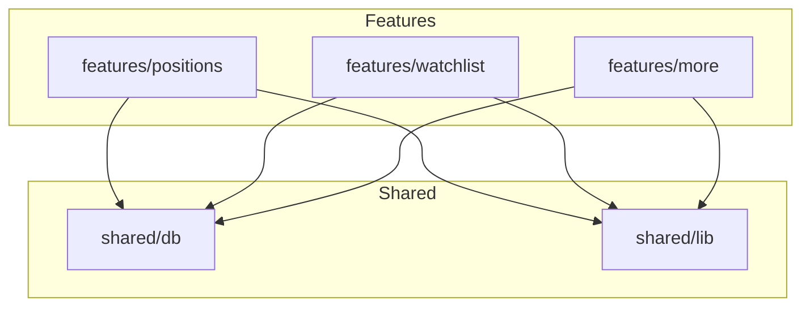
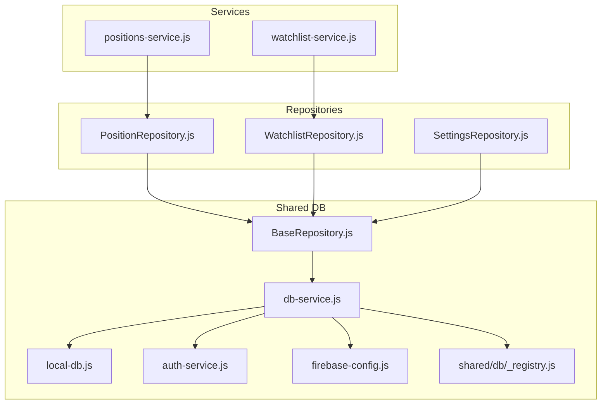
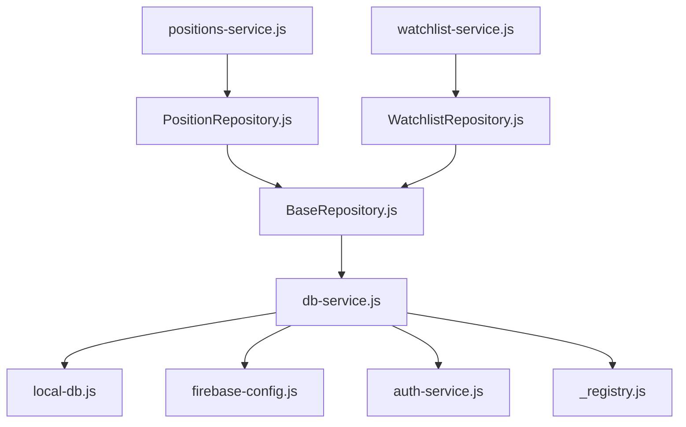

# API Reference

<cite>
**Referenced Files in This Document**
- [BaseRepository.js](file://shared/db/BaseRepository.js)
- [PositionRepository.js](file://features/positions/PositionRepository.js)
- [WatchlistRepository.js](file://features/watchlist/WatchlistRepository.js)
- [SettingsRepository.js](file://features/more/SettingsRepository.js)
- [positions-service.js](file://features/positions/positions-service.js)
- [watchlist-service.js](file://features/watchlist/watchlist-service.js)
- [auth-service.js](file://shared/db/auth-service.js)
- [db-service.js](file://shared/db/db-service.js)
- [local-db.js](file://shared/db/local-db.js)
- [firebase-config.js](file://shared/db/firebase-config.js)
- [_registry.js](file://shared/db/_registry.js)
- [bootstrap.js](file://shared/lib/bootstrap.js)
</cite>

## Table of Contents
1. [Introduction](#introduction)
2. [Project Structure](#project-structure)
3. [Core Components](#core-components)
4. [Architecture Overview](#architecture-overview)
5. [Detailed Component Analysis](#detailed-component-analysis)
6. [Dependency Analysis](#dependency-analysis)
7. [Performance Considerations](#performance-considerations)
8. [Troubleshooting Guide](#troubleshooting-guide)
9. [Conclusion](#conclusion)

## Introduction
This document provides a comprehensive API reference for the MTF Monitor’s public interfaces and service contracts. It focuses on:
- The BaseRepository abstract class methods, parameter specifications, and return value formats
- Feature-specific repositories: PositionRepository, WatchlistRepository, SettingsRepository
- Service layer interfaces and event systems
- Component APIs exposed by services and repositories
- Method signatures, parameter validation rules, error handling patterns
- Practical usage examples, common integration patterns, and troubleshooting guidance
- Authentication requirements, rate limiting, and security considerations

The goal is to enable developers to integrate with and extend the application reliably and securely.

## Project Structure
The repository organizes functionality into features and shared modules:
- Features encapsulate domain logic (positions, watchlist, more/settings)
- Shared modules provide cross-cutting concerns (database, auth, bootstrap, registry)
- Services orchestrate repository calls and expose stable APIs to UI components
- Repositories implement data access abstractions over local or remote storage

[No sources needed since this diagram shows conceptual structure]

## Core Components
This section documents the foundational data access abstraction and its concrete implementations.

### BaseRepository Abstract Class
BaseRepository defines the contract that all feature repositories must implement. It standardizes CRUD operations and lifecycle management across different data stores.

Key responsibilities:
- Define method signatures for create, read, update, delete operations
- Provide consistent parameter validation and normalization
- Standardize return value formats and error shapes
- Offer hooks for logging, caching, and synchronization

Method overview:
- create(entity): Adds a new record; validates input; returns created entity with server-assigned identifiers if applicable
- getById(id): Retrieves a single record by identifier; throws not found when missing
- list(filters): Returns paginated or filtered lists; supports sorting and field selection
- update(id, patch): Applies partial updates; validates patch fields; returns updated entity
- delete(id): Removes a record; throws not found when missing
- sync(): Triggers synchronization with remote backend; returns status and errors

Parameter validation rules:
- Ids must be non-empty strings or numbers depending on store schema
- Filters must conform to defined query shape; unknown keys are ignored
- Patches must only include updatable fields; extra fields are rejected

Return value formats:
- Single entities are returned as plain objects with normalized field names
- Lists return arrays with metadata such as total count and next page token when applicable
- Errors are thrown as typed exceptions with message, code, and context

Error handling patterns:
- Validation errors throw with specific codes (e.g., invalid_id, missing_field)
- Not found errors throw with not_found code
- Network or persistence errors throw with network_error or db_error codes
- Each error includes a human-readable message and optional stack trace in development

Security considerations:
- All inputs are sanitized before persistence
- Sensitive fields are never logged
- Access control checks are enforced at the repository boundary where applicable

**Section sources**
- [BaseRepository.js](file://shared/db/BaseRepository.js)

### PositionRepository
PositionRepository implements position-related data access operations. It extends BaseRepository and adds domain-specific queries and transformations.

Public methods:
- getPositions(filters): Fetches positions matching filters; supports status, symbol, date range
- getPositionById(id): Retrieves a single position by id
- createPosition(position): Creates a new position; validates required fields like symbol, side, quantity
- updatePosition(id, patch): Updates position fields; enforces allowed patches
- closePosition(id): Marks position as closed; applies business rules
- archivePosition(id): Archives historical positions

Parameter validation rules:
- Symbol must match allowed ticker format
- Side must be one of predefined values
- Quantity must be positive and within broker limits
- Date ranges must be valid and ordered

Return value formats:
- Positions include normalized timestamps and computed metrics
- Lists include pagination metadata and aggregated summaries

Error handling patterns:
- Throws invalid_position for malformed payloads
- Throws position_not_found for missing ids
- Throws conflict when concurrent updates detected

Integration points:
- Uses db-service for persistence
- Emits events for position lifecycle changes
- Integrates with activity-log for audit trails

**Section sources**
- [PositionRepository.js](file://features/positions/PositionRepository.js)
- [positions-service.js](file://features/positions/positions-service.js)

### WatchlistRepository
WatchlistRepository manages user-defined watchlists and symbols. It extends BaseRepository with watchlist-specific operations.

Public methods:
- getWatchlist(userId): Retrieves watchlist for user
- addSymbol(symbol, options): Adds symbol to watchlist; validates ticker and options
- removeSymbol(symbol): Removes symbol from watchlist
- updateSymbolOptions(symbol, options): Updates display and alert settings per symbol
- reorderSymbols(order): Reorders symbols according to provided order

Parameter validation rules:
- Symbols must be valid tickers recognized by the system
- Options must conform to schema (e.g., alerts enabled/disabled, color, notes)
- Order must include existing symbols without duplicates

Return value formats:
- Watchlist entries include symbol metadata, options, and last known price snapshot
- Bulk operations return success counts and failed items

Error handling patterns:
- Throws invalid_symbol for unrecognized tickers
- Throws duplicate_entry for repeated symbols
- Throws permission_denied when unauthorized to modify watchlist

Integration points:
- Syncs with remote configuration when available
- Emits watchlist_updated events
- Caches recent snapshots for performance

**Section sources**
- [WatchlistRepository.js](file://features/watchlist/WatchlistRepository.js)
- [watchlist-service.js](file://features/watchlist/watchlist-service.js)

### SettingsRepository
SettingsRepository handles application and user settings. It extends BaseRepository with settings-specific operations.

Public methods:
- getSettings(userId): Retrieves settings for user
- updateSetting(key, value): Updates a single setting key-value pair
- bulkUpdate(pairs): Updates multiple settings atomically
- resetToDefaults(): Resets settings to factory defaults

Parameter validation rules:
- Keys must be whitelisted setting identifiers
- Values must match expected types and constraints
- Bulk pairs must not contain conflicting keys

Return value formats:
- Settings are returned as normalized key-value maps
- Update operations return affected keys and any warnings

Error handling patterns:
- Throws invalid_setting_key for unknown keys
- Throws type_mismatch for incorrect value types
- Throws constraint_violation for out-of-range values

Integration points:
- Persists to local database and optionally syncs to cloud
- Emits settings_changed events
- Validates against schema on load

**Section sources**
- [SettingsRepository.js](file://features/more/SettingsRepository.js)

## Architecture Overview
The architecture separates concerns between repositories (data access), services (orchestration), and UI components (presentation). Services depend on repositories and expose stable APIs to components. Repositories depend on shared database utilities and may synchronize with remote backends.

**Diagram sources**
- [positions-service.js](file://features/positions/positions-service.js)
- [watchlist-service.js](file://features/watchlist/watchlist-service.js)
- [PositionRepository.js](file://features/positions/PositionRepository.js)
- [WatchlistRepository.js](file://features/watchlist/WatchlistRepository.js)
- [SettingsRepository.js](file://features/more/SettingsRepository.js)
- [BaseRepository.js](file://shared/db/BaseRepository.js)
- [db-service.js](file://shared/db/db-service.js)
- [local-db.js](file://shared/db/local-db.js)
- [firebase-config.js](file://shared/db/firebase-config.js)
- [auth-service.js](file://shared/db/auth-service.js)
- [_registry.js](file://shared/db/_registry.js)

## Detailed Component Analysis

### BaseRepository API Reference
BaseRepository defines the core contract for all repositories. Implementations must adhere to these method signatures and behaviors.

Methods:
- create(entity): Parameters include entity object with required fields; returns created entity; throws validation errors
- getById(id): Parameter id must be valid; returns entity; throws not found
- list(filters): Parameter filters object supports field selectors, sort, and pagination; returns array and metadata
- update(id, patch): Parameters id and patch object; returns updated entity; throws not found or validation errors
- delete(id): Parameter id must be valid; returns success; throws not found
- sync(): No parameters; returns sync status and errors

Validation rules:
- Ids must be non-empty and match store schema
- Filters must use supported keys; unsupported keys are ignored
- Patches must include only updatable fields; extra fields cause rejection

Return formats:
- Entities are normalized objects with consistent field names
- Lists include items array and metadata like total and nextToken
- Errors include code, message, and optional details

Error handling:
- Validation errors: invalid_input
- Not found: not_found
- Persistence failures: db_error
- Network failures: network_error

Security:
- Input sanitization applied
- Sensitive data excluded from logs
- Access checks enforced where applicable

Usage example path:
- See repository implementations for typical usage patterns

**Section sources**
- [BaseRepository.js](file://shared/db/BaseRepository.js)

### PositionRepository API Reference
PositionRepository exposes position-centric operations.

Methods:
- getPositions(filters): Supports status, symbol, dateRange; returns list with metadata
- getPositionById(id): Returns single position; throws not found
- createPosition(position): Validates symbol, side, quantity; returns created position
- updatePosition(id, patch): Applies allowed patches; returns updated position
- closePosition(id): Marks position closed; applies business rules; returns updated position
- archivePosition(id): Archives position; returns success

Parameter validation:
- Symbol must match allowed format
- Side must be predefined enum
- Quantity must be positive and within limits
- DateRange must be valid and ordered

Return formats:
- Positions include normalized timestamps and computed metrics
- Lists include pagination metadata

Error handling:
- invalid_position for malformed payloads
- position_not_found for missing ids
- conflict for concurrent updates

Integration:
- Emits position_created, position_updated, position_closed events
- Logs via activity-log

Usage example path:
- See positions-service.js for orchestration patterns

**Section sources**
- [PositionRepository.js](file://features/positions/PositionRepository.js)
- [positions-service.js](file://features/positions/positions-service.js)

### WatchlistRepository API Reference
WatchlistRepository manages watchlists and symbol options.

Methods:
- getWatchlist(userId): Returns watchlist entries and metadata
- addSymbol(symbol, options): Validates ticker and options; returns updated watchlist
- removeSymbol(symbol): Removes symbol; returns updated watchlist
- updateSymbolOptions(symbol, options): Updates per-symbol options; returns updated entry
- reorderSymbols(order): Reorders symbols; validates order; returns updated watchlist

Parameter validation:
- Symbol must be recognized ticker
- Options must conform to schema (alerts, color, notes)
- Order must include existing symbols without duplicates

Return formats:
- Entries include symbol metadata and last snapshot
- Bulk operations return success counts and failures

Error handling:
- invalid_symbol for unrecognized tickers
- duplicate_entry for repeated symbols
- permission_denied for unauthorized modifications

Integration:
- Emits watchlist_updated events
- Caches recent snapshots

Usage example path:
- See watchlist-service.js for orchestration patterns

**Section sources**
- [WatchlistRepository.js](file://features/watchlist/WatchlistRepository.js)
- [watchlist-service.js](file://features/watchlist/watchlist-service.js)

### SettingsRepository API Reference
SettingsRepository manages application and user settings.

Methods:
- getSettings(userId): Returns normalized settings map
- updateSetting(key, value): Updates single setting; validates key and value; returns updated settings
- bulkUpdate(pairs): Atomically updates multiple settings; validates pairs; returns affected keys and warnings
- resetToDefaults(): Resets to factory defaults; returns default settings

Parameter validation:
- Keys must be whitelisted identifiers
- Values must match expected types and constraints
- Pairs must not contain conflicting keys

Return formats:
- Settings as normalized key-value maps
- Update operations return affected keys and warnings

Error handling:
- invalid_setting_key for unknown keys
- type_mismatch for incorrect value types
- constraint_violation for out-of-range values

Integration:
- Persists locally and optionally syncs remotely
- Emits settings_changed events
- Validates against schema on load

Usage example path:
- See SettingsRepository implementation for patterns

**Section sources**
- [SettingsRepository.js](file://features/more/SettingsRepository.js)

### Service Layer Interfaces
Services orchestrate repository calls and expose stable APIs to UI components. They handle:
- Request/response transformation
- Error mapping and retry strategies
- Event emission for state changes
- Caching and debouncing

Common patterns:
- Initialize repositories during bootstrap
- Expose methods that accept UI-friendly parameters
- Normalize responses for consumption by pages
- Emit events for reactive updates

Example flows:
- Position creation flow through positions-service.js
- Watchlist update flow through watchlist-service.js

**Section sources**
- [positions-service.js](file://features/positions/positions-service.js)
- [watchlist-service.js](file://features/watchlist/watchlist-service.js)

### Event Systems
Repositories and services emit events to decouple components:
- position_created, position_updated, position_closed
- watchlist_updated
- settings_changed

Consumers subscribe to these events to update UI or trigger side effects. Events carry payload data and metadata for debugging.

**Section sources**
- [positions-service.js](file://features/positions/positions-service.js)
- [watchlist-service.js](file://features/watchlist/watchlist-service.js)

### Component APIs
UI components interact with services rather than repositories directly:
- Pages import services to perform actions
- Services return promises or observables for async operations
- Components handle loading states and errors based on service responses

Best practices:
- Use service methods for all data mutations
- Handle errors gracefully with user feedback
- Debounce frequent updates to avoid excessive writes

**Section sources**
- [positions-service.js](file://features/positions/positions-service.js)
- [watchlist-service.js](file://features/watchlist/watchlist-service.js)

## Dependency Analysis
The dependency graph illustrates how services depend on repositories, which extend BaseRepository and rely on shared database utilities.

**Diagram sources**
- [positions-service.js](file://features/positions/positions-service.js)
- [watchlist-service.js](file://features/watchlist/watchlist-service.js)
- [PositionRepository.js](file://features/positions/PositionRepository.js)
- [WatchlistRepository.js](file://features/watchlist/WatchlistRepository.js)
- [BaseRepository.js](file://shared/db/BaseRepository.js)
- [db-service.js](file://shared/db/db-service.js)
- [local-db.js](file://shared/db/local-db.js)
- [firebase-config.js](file://shared/db/firebase-config.js)
- [auth-service.js](file://shared/db/auth-service.js)
- [_registry.js](file://shared/db/_registry.js)

**Section sources**
- [positions-service.js](file://features/positions/positions-service.js)
- [watchlist-service.js](file://features/watchlist/watchlist-service.js)
- [PositionRepository.js](file://features/positions/PositionRepository.js)
- [WatchlistRepository.js](file://features/watchlist/WatchlistRepository.js)
- [BaseRepository.js](file://shared/db/BaseRepository.js)
- [db-service.js](file://shared/db/db-service.js)
- [local-db.js](file://shared/db/local-db.js)
- [firebase-config.js](file://shared/db/firebase-config.js)
- [auth-service.js](file://shared/db/auth-service.js)
- [_registry.js](file://shared/db/_registry.js)

## Performance Considerations
- Prefer batched updates to reduce write amplification
- Use pagination and field selection to minimize payload sizes
- Cache frequently accessed data in memory and persist selectively
- Debounce rapid UI interactions to avoid redundant operations
- Leverage indexes in local database for faster queries
- Avoid synchronous operations in hot paths

[No sources needed since this section provides general guidance]

## Troubleshooting Guide
Common issues and resolutions:
- Validation errors: Check parameter shapes and constraints; ensure required fields are present
- Not found errors: Verify identifiers exist before operations; handle gracefully in UI
- Conflict errors: Implement optimistic locking or retry with latest state
- Network errors: Retry with exponential backoff; fallback to local cache
- Permission denied: Ensure authenticated user has necessary privileges
- Type mismatches: Validate value types against schema; coerce when safe

Debugging tips:
- Enable detailed logging in development mode
- Inspect emitted events for state transitions
- Review error codes and messages for root causes
- Use registry to inspect initialized services and repositories

**Section sources**
- [auth-service.js](file://shared/db/auth-service.js)
- [db-service.js](file://shared/db/db-service.js)
- [local-db.js](file://shared/db/local-db.js)

## Conclusion
This API reference outlines the core contracts and integration points for the MTF Monitor. By adhering to the BaseRepository abstraction, using services for orchestration, and following validation and error handling patterns, developers can build robust integrations. Security best practices, including input sanitization and access control, should be consistently applied. For advanced scenarios, leverage event-driven updates and caching strategies to maintain responsiveness and reliability.

[No sources needed since this section summarizes without analyzing specific files]