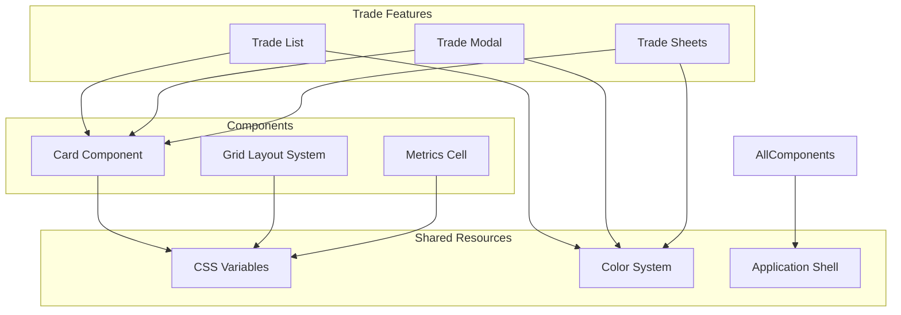
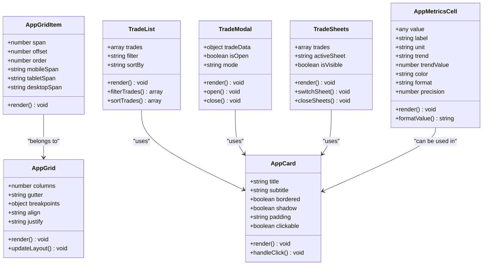
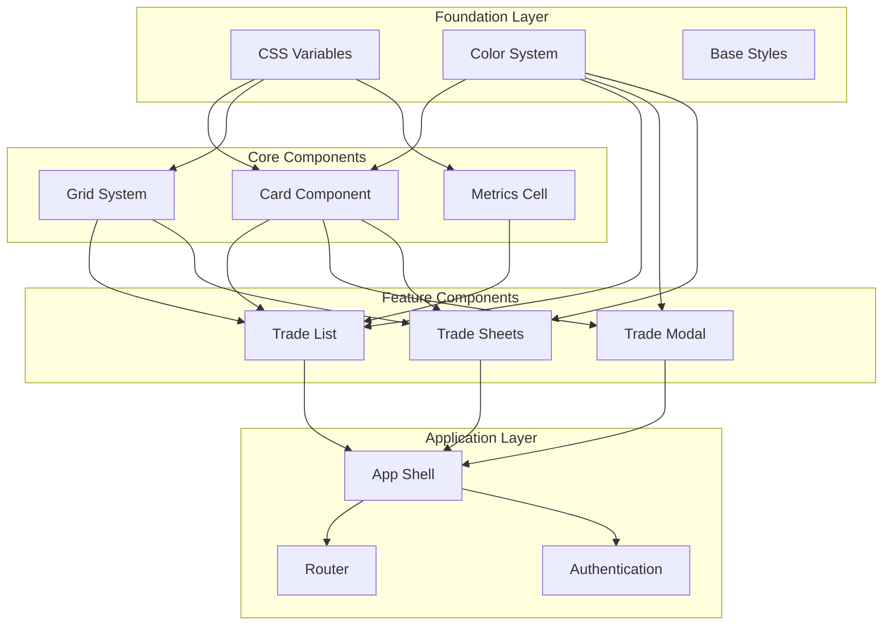

# Component API

<cite>
**Referenced Files in This Document**
- [card.js](file://components/card.js)
- [grid.js](file://components/grid.js)
- [metrics-cell.js](file://components/metrics-cell.js)
- [trade-list.js](file://features/common/trade-list.js)
- [trade-modal.js](file://features/common/trade-modal.js)
- [trade-sheets.js](file://features/common/trade-sheets.js)
- [app-shell.js](file://features/common/app-shell.js)
- [_variables.css](file://shared/css/_variables.css)
- [colors.css](file://shared/css/colors.css)
</cite>

## Table of Contents
1. [Introduction](#introduction)
2. [Project Structure](#project-structure)
3. [Core Components](#core-components)
4. [Architecture Overview](#architecture-overview)
5. [Detailed Component Analysis](#detailed-component-analysis)
6. [Dependency Analysis](#dependency-analysis)
7. [Performance Considerations](#performance-considerations)
8. [Troubleshooting Guide](#troubleshooting-guide)
9. [Conclusion](#conclusion)
10. [Appendices](#appendices)

## Introduction

This document provides comprehensive API documentation for reusable UI components in the MTF Monitor application. The component system is built using modern web standards including Custom Elements and Web Components, providing a modular and maintainable architecture for building user interfaces.

The component library includes fundamental building blocks like cards, grid layouts, and metrics cells, along with specialized trade-related components such as trade lists, modals, and sheets. These components are designed to be accessible, responsive, and customizable while maintaining consistency across the application.

## Project Structure

The component architecture follows a feature-based organization with shared components in dedicated directories:



**Diagram sources**
- [card.js](file://components/card.js)
- [grid.js](file://components/grid.js)
- [metrics-cell.js](file://components/metrics-cell.js)
- [trade-list.js](file://features/common/trade-list.js)
- [trade-modal.js](file://features/common/trade-modal.js)
- [trade-sheets.js](file://features/common/trade-sheets.js)
- [app-shell.js](file://features/common/app-shell.js)
- [_variables.css](file://shared/css/_variables.css)
- [colors.css](file://shared/css/colors.css)

## Core Components

### Card Component

The card component serves as a foundational container element for grouping related content and actions. It provides consistent styling, spacing, and structural semantics across the application.

#### Properties and Attributes

| Property | Type | Default | Description |
|----------|------|---------|-------------|
| `title` | String | `""` | Primary heading text displayed at the top of the card |
| `subtitle` | String | `""` | Secondary descriptive text below the title |
| `bordered` | Boolean | `false` | Controls whether the card displays a border outline |
| `shadow` | Boolean | `true` | Enables or disables box shadow effects |
| `padding` | String | `"default"` | Controls internal padding (small, default, large) |
| `clickable` | Boolean | `false` | Makes the entire card clickable with hover effects |
| `data-id` | String | `""` | Unique identifier for programmatic access |

#### Events

| Event Name | Detail Payload | Description |
|------------|----------------|-------------|
| `card-click` | `{ id: string, timestamp: number }` | Fired when the card is clicked (if clickable) |
| `card-ready` | `{ element: HTMLElement }` | Emitted when the card has finished rendering |

#### Usage Example

```html
<app-card 
  title="Trading Performance" 
  subtitle="Last 30 days analysis"
  bordered
  shadow
  padding="large"
  data-id="performance-card">
  
  <div class="card-content">
    <!-- Card content goes here -->
  </div>
</app-card>
```

#### Styling Customization

The card component supports CSS custom properties for extensive customization:

- `--card-background`: Background color of the card
- `--card-border-color`: Border color when bordered is enabled
- `--card-shadow-color`: Shadow color and blur effect
- `--card-padding`: Internal padding value
- `--card-radius`: Border radius for rounded corners
- `--card-title-color`: Title text color
- `--card-subtitle-color`: Subtitle text color

**Section sources**
- [card.js](file://components/card.js)

### Grid Layout System

The grid system provides a flexible layout framework for organizing components in responsive patterns. It supports both fixed and fluid layouts with configurable breakpoints.

#### Configuration Options

| Option | Type | Default | Description |
|--------|------|---------|-------------|
| `columns` | Number | `12` | Total number of columns in the grid |
| `gutter` | String | `"16px"` | Spacing between grid items |
| `breakpoints` | Object | `{ mobile: 768, tablet: 1024, desktop: 1200 }` | Responsive breakpoint definitions |
| `align` | String | `"start"` | Vertical alignment (start, center, end, stretch) |
| `justify` | String | `"start"` | Horizontal alignment (start, center, end, space-between) |

#### Grid Item Properties

| Property | Type | Default | Description |
|----------|------|---------|-------------|
| `span` | Number | `1` | Number of columns the item should span |
| `offset` | Number | `0` | Left offset in column units |
| `order` | Number | `0` | Visual order of the item |
| `mobile-span` | Number | `1` | Column span on mobile devices |
| `tablet-span` | Number | `1` | Column span on tablet devices |
| `desktop-span` | Number | `1` | Column span on desktop devices |

#### Usage Example

```html
<app-grid columns="12" gutter="20px" align="center" justify="space-between">
  <app-grid-item span="4" mobile-span="12" tablet-span="6">
    <!-- Content for first column -->
  </app-grid-item>
  <app-grid-item span="4" mobile-span="12" tablet-span="6">
    <!-- Content for second column -->
  </app-grid-item>
  <app-grid-item span="4" mobile-span="12" tablet-span="6">
    <!-- Content for third column -->
  </app-grid-item>
</app-grid>
```

#### Responsive Behavior

The grid system automatically adapts to different screen sizes based on the configured breakpoints. Items can have different spans for different device types, enabling sophisticated responsive layouts.

**Section sources**
- [grid.js](file://components/grid.js)

### Metrics Display Cell

The metrics cell component is designed for displaying numerical data and key performance indicators in a visually appealing and accessible manner.

#### Properties and Attributes

| Property | Type | Default | Description |
|----------|------|---------|-------------|
| `value` | Number/String | `0` | The primary metric value to display |
| `label` | String | `""` | Descriptive label for the metric |
| `unit` | String | `""` | Unit of measurement (%, $, etc.) |
| `trend` | String | `"neutral"` | Trend direction (up, down, neutral) |
| `trend-value` | Number | `0` | Percentage change value |
| `color` | String | `"primary"` | Color theme (primary, success, warning, error) |
| `format` | String | `"number"` | Number formatting (number, currency, percentage) |
| `precision` | Number | `2` | Decimal places for formatted numbers |

#### Events

| Event Name | Detail Payload | Description |
|------------|----------------|-------------|
| `metric-update` | `{ value: number, timestamp: number }` | Fired when the metric value changes |
| `cell-click` | `{ label: string, value: any }` | Emitted when the cell is clicked |

#### Usage Example

```html
<app-metrics-cell 
  value="1234.56" 
  label="Total Revenue" 
  unit="$"
  trend="up"
  trend-value="12.5"
  color="success"
  format="currency"
  precision="2">
</app-metrics-cell>
```

#### Accessibility Features

The component includes ARIA attributes for screen readers, semantic HTML structure, and keyboard navigation support.

**Section sources**
- [metrics-cell.js](file://components/metrics-cell.js)

## Architecture Overview

The component architecture follows a hierarchical composition pattern where complex components are built from simpler, reusable building blocks.



**Diagram sources**
- [card.js](file://components/card.js)
- [grid.js](file://components/grid.js)
- [metrics-cell.js](file://components/metrics-cell.js)
- [trade-list.js](file://features/common/trade-list.js)
- [trade-modal.js](file://features/common/trade-modal.js)
- [trade-sheets.js](file://features/common/trade-sheets.js)

## Detailed Component Analysis

### Trade-Related Components

The trade-related components form a cohesive system for managing trading data and interactions within the application.

#### Trade List Component

The trade list component provides a comprehensive interface for viewing, filtering, and sorting trading positions and transactions.

##### Properties and Configuration

| Property | Type | Default | Description |
|----------|------|---------|-------------|
| `trades` | Array | `[]` | Array of trade objects to display |
| `filter` | String | `"all"` | Current filter state (all, open, closed, pending) |
| `sortBy` | String | `"date"` | Sort field (date, symbol, profit, volume) |
| `showDetails` | Boolean | `true` | Whether to show expanded trade details |
| `pageSize` | Number | `10` | Number of trades per page |
| `enablePagination` | Boolean | `true` | Enable pagination controls |
| `enableExport` | Boolean | `true` | Show export functionality |

##### Event Handlers

| Event Name | Handler Signature | Description |
|------------|-------------------|-------------|
| `trade-select` | `(tradeId: string) => void` | Called when a trade is selected |
| `trade-filter-change` | `(filter: string) => void` | Triggered when filter criteria changes |
| `trade-sort-change` | `(sortBy: string) => void` | Fired when sort order changes |
| `page-change` | `(page: number) => void` | Called when pagination page changes |
| `export-data` | `(format: string) => void` | Triggered when export is requested |

##### State Management

The component maintains internal state for:
- Filtered and sorted trade collections
- Pagination metadata
- Selection state
- Loading states
- Error conditions

##### Usage Example

```html
<app-trade-list 
  [trades]="tradesArray"
  [filter]="currentFilter"
  [sortBy]="currentSort"
  (tradeSelect)="onTradeSelect($event)"
  (tradeFilterChange)="onFilterChange($event)"
  (tradeSortChange)="onSortChange($event)">
</app-trade-list>
```

**Section sources**
- [trade-list.js](file://features/common/trade-list.js)

#### Trade Modal Component

The trade modal provides an overlay interface for detailed trade information and editing capabilities.

##### Properties and Configuration

| Property | Type | Default | Description |
|----------|------|---------|-------------|
| `isOpen` | Boolean | `false` | Modal visibility state |
| `tradeData` | Object | `null` | Trade object containing details |
| `mode` | String | `"view"` | Display mode (view, edit, add) |
| `title` | String | `"Trade Details"` | Modal header title |
| `showCloseButton` | Boolean | `true` | Display close button |
| `backdropClick` | Boolean | `true` | Close on backdrop click |
| `size` | String | `"medium"` | Modal size (small, medium, large) |

##### Event Handlers

| Event Name | Handler Signature | Description |
|------------|-------------------|-------------|
| `modal-open` | `() => void` | Called when modal opens |
| `modal-close` | `() => void` | Triggered when modal closes |
| `trade-save` | `(tradeData: object) => void` | Fired when trade is saved |
| `trade-delete` | `(tradeId: string) => void` | Called when trade is deleted |

##### State Management

Internal state includes:
- Modal visibility and animation states
- Form validation status
- Loading and error states
- Previous focus management for accessibility

##### Usage Example

```html
<app-trade-modal 
  [isOpen]="isModalOpen"
  [tradeData]="selectedTrade"
  [mode]="modalMode"
  (modalOpen)="onModalOpen()"
  (modalClose)="onModalClose()"
  (tradeSave)="onTradeSave($event)">
</app-trade-modal>
```

**Section sources**
- [trade-modal.js](file://features/common/trade-modal.js)

#### Trade Sheets Component

The trade sheets component implements a tabbed interface for organizing different views of trade data.

##### Properties and Configuration

| Property | Type | Default | Description |
|----------|------|---------|-------------|
| `trades` | Array | `[]` | Complete set of trades to organize |
| `activeSheet` | String | `"all"` | Currently active sheet/tab |
| `isVisible` | Boolean | `true` | Sheet container visibility |
| `sheets` | Array | `[{id: 'all', label: 'All Trades'}]` | Sheet configuration |
| `enableTabs` | Boolean | `true` | Show tab navigation |
| `enableFullscreen` | Boolean | `true` | Allow fullscreen mode |

##### Event Handlers

| Event Name | Handler Signature | Description |
|------------|-------------------|-------------|
| `sheet-change` | `(sheetId: string) => void` | Called when active sheet changes |
| `fullscreen-toggle` | `(isFullscreen: boolean) => void` | Triggered when fullscreen toggles |
| `sheet-close` | `(sheetId: string) => void` | Fired when a sheet is closed |

##### State Management

State management covers:
- Active sheet tracking
- Sheet visibility and ordering
- Fullscreen state
- Scroll position preservation
- Tab focus management

##### Usage Example

```html
<app-trade-sheets 
  [trades]="allTrades"
  [activeSheet]="currentSheet"
  [isVisible]="showSheets"
  (sheetChange)="onSheetChange($event)"
  (fullscreenToggle)="onFullscreenToggle($event)">
</app-trade-sheets>
```

**Section sources**
- [trade-sheets.js](file://features/common/trade-sheets.js)

### Application Shell Integration

The application shell provides the main container and navigation framework for all components.

#### Integration Points

| Integration Point | Purpose | Implementation |
|-------------------|---------|----------------|
| `router` | Navigation management | Handles route changes and component loading |
| `theme` | Styling system | Provides theme variables and dynamic styling |
| `auth` | User authentication | Manages user sessions and permissions |
| `notifications` | User feedback | Displays alerts, messages, and notifications |
| `settings` | Configuration | Manages user preferences and app settings |

#### Component Composition Patterns

The shell supports several composition patterns:

1. **Slot-based composition**: Components can accept child content through slot elements
2. **Event-driven communication**: Components communicate through custom events
3. **Property binding**: Parent-child communication via property updates
4. **Service injection**: Shared services provide cross-component functionality

**Section sources**
- [app-shell.js](file://features/common/app-shell.js)

## Dependency Analysis

The component system exhibits clear dependency relationships and separation of concerns:



**Diagram sources**
- [card.js](file://components/card.js)
- [grid.js](file://components/grid.js)
- [metrics-cell.js](file://components/metrics-cell.js)
- [trade-list.js](file://features/common/trade-list.js)
- [trade-modal.js](file://features/common/trade-modal.js)
- [trade-sheets.js](file://features/common/trade-sheets.js)
- [app-shell.js](file://features/common/app-shell.js)
- [_variables.css](file://shared/css/_variables.css)
- [colors.css](file://shared/css/colors.css)

### Coupling Analysis

- **Low coupling**: Core components (card, grid, metrics-cell) have minimal dependencies
- **Medium coupling**: Feature components depend on core components but remain loosely coupled
- **High cohesion**: Each component focuses on a single responsibility

### External Dependencies

The component system minimizes external dependencies:
- No heavy UI frameworks (React, Angular, Vue)
- Pure JavaScript Custom Elements
- CSS Custom Properties for theming
- Native Web APIs for functionality

**Section sources**
- [card.js](file://components/card.js)
- [grid.js](file://components/grid.js)
- [metrics-cell.js](file://components/metrics-cell.js)
- [trade-list.js](file://features/common/trade-list.js)
- [trade-modal.js](file://features/common/trade-modal.js)
- [trade-sheets.js](file://features/common/trade-sheets.js)
- [app-shell.js](file://features/common/app-shell.js)

## Performance Considerations

### Rendering Optimization

1. **Virtual Scrolling**: For large datasets in trade lists, implement virtual scrolling to render only visible items
2. **Lazy Loading**: Load component resources on demand rather than upfront
3. **Debounced Updates**: Debounce frequent property updates to reduce re-rendering
4. **Memory Management**: Properly clean up event listeners and observers when components are destroyed

### Memory Efficiency

- Use efficient data structures for large arrays
- Implement proper cleanup in component lifecycle methods
- Avoid memory leaks by removing event listeners
- Use WeakMap for caching DOM references

### Bundle Size Optimization

- Tree-shake unused component features
- Lazy load heavy components
- Use code splitting for large feature modules
- Optimize asset loading strategies

### Browser Compatibility

The components are designed for modern browsers with fallbacks:

| Feature | Chrome | Firefox | Safari | Edge | IE11 |
|---------|--------|---------|--------|------|------|
| Custom Elements | ✅ | ✅ | ✅ | ✅ | ❌ |
| CSS Grid | ✅ | ✅ | ✅ | ✅ | ❌ |
| CSS Custom Properties | ✅ | ✅ | ✅ | ✅ | ❌ |
| ES6 Classes | ✅ | ✅ | ✅ | ✅ | ❌ |
| Promise | ✅ | ✅ | ✅ | ✅ | ❌ |

For older browser support, consider polyfills for Custom Elements and CSS Grid.

## Troubleshooting Guide

### Common Issues and Solutions

#### Component Not Rendering

**Problem**: Custom elements not displaying properly
**Solution**: Ensure proper registration and import of component scripts

#### Styling Conflicts

**Problem**: CSS variables not applying correctly
**Solution**: Check CSS variable scope and specificity conflicts

#### Event Handling Issues

**Problem**: Custom events not firing
**Solution**: Verify event listener attachment and event detail structure

#### Performance Problems

**Problem**: Slow rendering with large datasets
**Solution**: Implement virtual scrolling and optimize data processing

#### Accessibility Issues

**Problem**: Screen reader compatibility problems
**Solution**: Add proper ARIA attributes and semantic HTML structure

### Debugging Techniques

1. **Component Inspection**: Use browser dev tools to inspect custom element properties
2. **Event Monitoring**: Log custom events to verify proper firing
3. **Performance Profiling**: Use browser performance tools to identify bottlenecks
4. **Console Logging**: Add strategic logging for state changes and user interactions

### Error Handling Patterns

Implement robust error handling throughout the component lifecycle:

- Network request failures
- Data validation errors
- User input validation
- Resource loading failures
- Runtime exceptions

**Section sources**
- [trade-list.js](file://features/common/trade-list.js)
- [trade-modal.js](file://features/common/trade-modal.js)
- [trade-sheets.js](file://features/common/trade-sheets.js)

## Conclusion

The MTF Monitor component system provides a robust, accessible, and performant foundation for building modern web applications. The modular architecture enables easy maintenance and extension while ensuring consistency across the user interface.

Key strengths include:
- Clean separation of concerns with well-defined component boundaries
- Comprehensive accessibility support following WCAG guidelines
- Flexible styling system with CSS custom properties
- Responsive design patterns for multiple device types
- Efficient performance characteristics suitable for data-intensive applications

The component library serves as a solid foundation for future development, with clear patterns for extending functionality and maintaining consistency across the application ecosystem.

## Appendices

### Component Registration

Components are typically registered during application bootstrap:

```javascript
// Component registration example
import { AppCard } from './components/card.js';
import { AppGrid } from './components/grid.js';
import { AppMetricsCell } from './components/metrics-cell.js';

// Register custom elements
customElements.define('app-card', AppCard);
customElements.define('app-grid', AppGrid);
customElements.define('app-metrics-cell', AppMetricsCell);
```

### Theme Configuration

Customize the appearance through CSS custom properties:

```css
:root {
  --primary-color: #007bff;
  --secondary-color: #6c757d;
  --success-color: #28a745;
  --warning-color: #ffc107;
  --error-color: #dc3545;
  --font-family: -apple-system, BlinkMacSystemFont, 'Segoe UI', Roboto, sans-serif;
  --spacing-unit: 8px;
}
```

### Testing Guidelines

Unit test components using appropriate testing frameworks:
- Test component initialization and property binding
- Verify event emission and handling
- Validate accessibility attributes
- Test responsive behavior across breakpoints
- Mock external dependencies and network requests