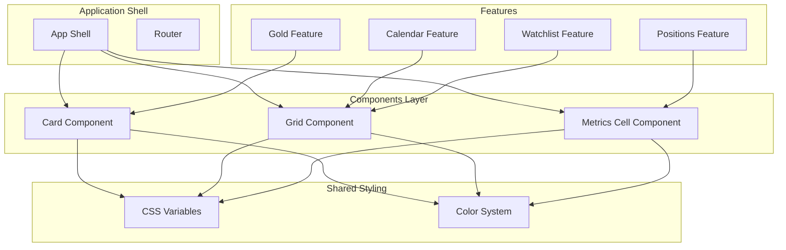
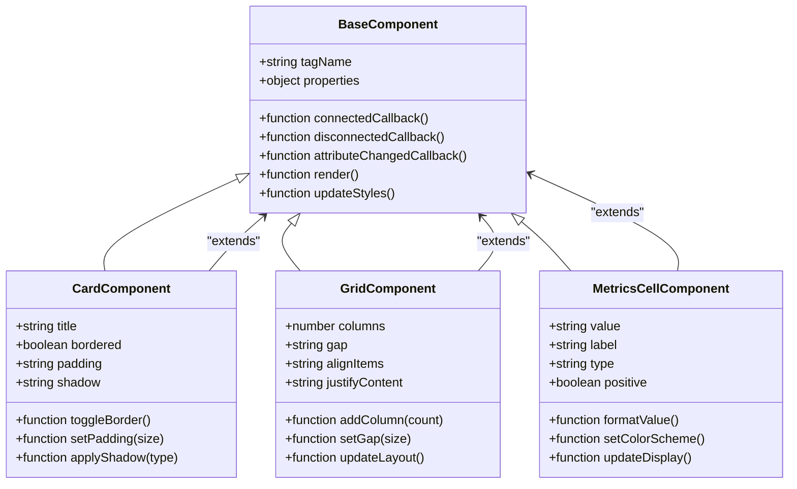
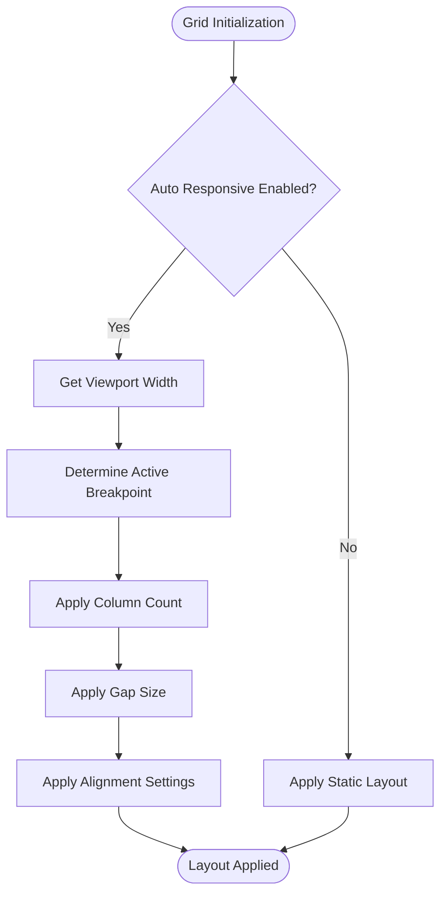
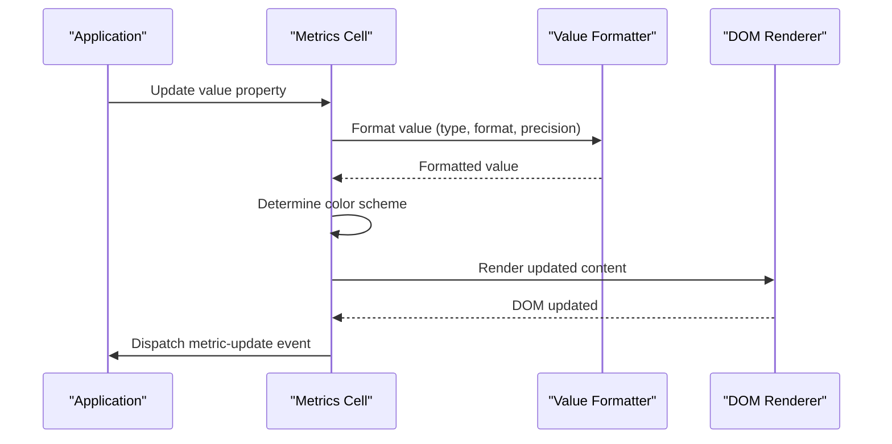
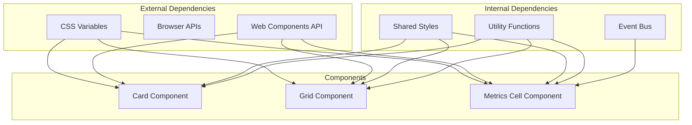

# UI Components

<cite>
**Referenced Files in This Document**
- [card.js](file://components/card.js)
- [grid.js](file://components/grid.js)
- [metrics-cell.js](file://components/metrics-cell.js)
- [app-shell.js](file://features/common/app-shell.js)
- [_variables.css](file://shared/css/_variables.css)
- [colors.css](file://shared/css/colors.css)
</cite>

## Table of Contents
1. [Introduction](#introduction)
2. [Project Structure](#project-structure)
3. [Core Components](#core-components)
4. [Architecture Overview](#architecture-overview)
5. [Detailed Component Analysis](#detailed-component-analysis)
6. [Dependency Analysis](#dependency-analysis)
7. [Performance Considerations](#performance-considerations)
8. [Troubleshooting Guide](#troubleshooting-guide)
9. [Conclusion](#conclusion)
10. [Appendices](#appendices)

## Introduction

This document provides comprehensive documentation for the core UI components in the MTF Monitor application: Card, Grid, and Metrics Cell components. These are custom web components built following modern web standards, designed to provide reusable, accessible, and responsive user interface elements for financial trading applications.

The components follow a consistent architecture pattern, utilizing Web Components APIs including Custom Elements, Shadow DOM, and HTML Templates. They are designed to be themeable, accessible, and performant while maintaining clean separation of concerns between presentation and behavior.

## Project Structure

The UI components are organized in a feature-based architecture within the `components/` directory, with shared styling in the `shared/css/` directory. The components integrate with the application shell through the common features module.



**Diagram sources**
- [card.js](file://components/card.js)
- [grid.js](file://components/grid.js)
- [metrics-cell.js](file://components/metrics-cell.js)
- [app-shell.js](file://features/common/app-shell.js)
- [_variables.css](file://shared/css/_variables.css)
- [colors.css](file://shared/css/colors.css)

**Section sources**
- [card.js](file://components/card.js)
- [grid.js](file://components/grid.js)
- [metrics-cell.js](file://components/metrics-cell.js)
- [app-shell.js](file://features/common/app-shell.js)

## Core Components

The three core UI components form the foundation of the application's user interface:

### Card Component
A flexible container component that provides consistent styling, spacing, and layout for content blocks. It supports various configurations including borders, shadows, padding, and responsive behavior.

### Grid Component  
A responsive grid layout system that manages the arrangement of child elements across different screen sizes. It implements CSS Grid with fallbacks and provides intuitive configuration options.

### Metrics Cell Component
A specialized display component for showing financial metrics and data points with consistent formatting, color coding, and interactive states.

**Section sources**
- [card.js](file://components/card.js)
- [grid.js](file://components/grid.js)
- [metrics-cell.js](file://components/metrics-cell.js)

## Architecture Overview

The components follow a layered architecture pattern with clear separation of concerns:



**Diagram sources**
- [card.js](file://components/card.js)
- [grid.js](file://components/grid.js)
- [metrics-cell.js](file://components/metrics-cell.js)

## Detailed Component Analysis

### Card Component

The Card component serves as a fundamental building block for organizing content with consistent visual hierarchy and spacing.

#### Properties and Attributes

| Property | Type | Default | Description |
|----------|------|---------|-------------|
| `title` | string | "" | Display title for the card header |
| `bordered` | boolean | false | Toggle border visibility |
| `padding` | string | "md" | Padding size (sm, md, lg, xl) |
| `shadow` | string | "none" | Shadow intensity (none, sm, md, lg) |
| `rounded` | boolean | true | Enable rounded corners |
| `interactive` | boolean | false | Enable hover effects and cursor changes |

#### Events

| Event Name | Detail | Description |
|------------|--------|-------------|
| `card-click` | `{ target: HTMLElement }` | Fired when card is clicked (if interactive) |
| `card-toggle` | `{ property: string, value: any }` | Fired when card properties change |

#### Usage Examples

Basic card usage:
```html
<ui-card title="Portfolio Summary">
  <div class="card-content">
    <!-- Card content here -->
  </div>
</ui-card>
```

Advanced configuration:
```html
<ui-card 
  title="Trading Performance" 
  bordered 
  padding="lg" 
  shadow="md"
  interactive>
  <div class="performance-metrics">
    <!-- Performance data -->
  </div>
</ui-card>
```

#### Styling Customization

The Card component supports extensive customization through CSS custom properties:

```css
/* Override default styles */
ui-card {
  --card-bg-color: #ffffff;
  --card-border-color: #e0e0e0;
  --card-shadow-color: rgba(0, 0, 0, 0.1);
  --card-padding-sm: 8px;
  --card-padding-md: 16px;
  --card-padding-lg: 24px;
  --card-radius: 8px;
}

/* Dark theme support */
.dark-theme ui-card {
  --card-bg-color: #1a1a1a;
  --card-border-color: #333333;
  --card-shadow-color: rgba(0, 0, 0, 0.3);
}
```

#### Responsive Design

The Card component automatically adapts to different screen sizes:
- Mobile: Full width with reduced padding
- Tablet: Flexible width with medium padding  
- Desktop: Fixed maximum width with standard padding

**Section sources**
- [card.js](file://components/card.js)

### Grid Component

The Grid component provides a flexible, responsive layout system for arranging UI elements across different viewport sizes.

#### Properties and Attributes

| Property | Type | Default | Description |
|----------|------|---------|-------------|
| `columns` | number | 1 | Number of grid columns |
| `gap` | string | "md" | Spacing between grid items |
| `alignItems` | string | "stretch" | Vertical alignment |
| `justifyContent` | string | "start" | Horizontal alignment |
| `autoResponsive` | boolean | true | Enable automatic responsive behavior |
| `breakpoints` | object | default breakpoints | Custom breakpoint definitions |

#### Breakpoint Configuration

| Breakpoint | Min Width | Columns | Gap |
|------------|-----------|---------|-----|
| `xs` | 0px | 1 | sm |
| `sm` | 576px | 2 | md |
| `md` | 768px | 3 | md |
| `lg` | 992px | 4 | lg |
| `xl` | 1200px | 6 | lg |

#### Usage Examples

Basic grid layout:
```html
<ui-grid columns="3" gap="md">
  <div class="grid-item">Item 1</div>
  <div class="grid-item">Item 2</div>
  <div class="grid-item">Item 3</div>
</ui-grid>
```

Advanced responsive grid:
```html
<ui-grid 
  columns="4" 
  gap="lg" 
  align-items="center" 
  justify-content="space-between"
  auto-responsive>
  <div class="metric-card">Metric A</div>
  <div class="metric-card">Metric B</div>
  <div class="metric-card">Metric C</div>
  <div class="metric-card">Metric D</div>
</ui-grid>
```

#### Styling Customization

```css
/* Grid container styling */
ui-grid {
  --grid-gap-sm: 8px;
  --grid-gap-md: 16px;
  --grid-gap-lg: 24px;
  --grid-align-start: flex-start;
  --grid-align-center: center;
  --grid-align-end: flex-end;
  --grid-justify-start: flex-start;
  --grid-justify-center: center;
  --grid-justify-end: flex-end;
  --grid-justify-space-between: space-between;
}

/* Grid item styling */
.grid-item {
  background: var(--surface-color);
  border-radius: var(--radius-md);
  padding: var(--spacing-md);
  transition: transform 0.2s ease;
}

.grid-item:hover {
  transform: translateY(-2px);
  box-shadow: var(--shadow-md);
}
```

#### Responsive Behavior Flow



**Diagram sources**
- [grid.js](file://components/grid.js)

**Section sources**
- [grid.js](file://components/grid.js)

### Metrics Cell Component

The Metrics Cell component is specifically designed for displaying financial metrics and performance indicators with consistent formatting and visual feedback.

#### Properties and Attributes

| Property | Type | Default | Description |
|----------|------|---------|-------------|
| `value` | string/number | "" | The metric value to display |
| `label` | string | "" | Descriptive label for the metric |
| `type` | string | "neutral" | Metric type (positive, negative, neutral) |
| `format` | string | "number" | Number formatting (number, currency, percentage) |
| `precision` | number | 2 | Decimal precision for numbers |
| `icon` | string | "" | Optional icon name or path |
| `trend` | string | "none" | Trend indicator (up, down, flat) |
| `animated` | boolean | true | Enable value animation |

#### Events

| Event Name | Detail | Description |
|------------|--------|-------------|
| `metric-update` | `{ value: any, timestamp: Date }` | Fired when metric value updates |
| `metric-click` | `{ detail: Object }` | Fired when cell is clicked |

#### Usage Examples

Basic metrics display:
```html
<ui-metrics-cell 
  value="1,234.56" 
  label="Portfolio Value" 
  type="positive"
  format="currency">
</ui-metrics-cell>
```

Advanced metrics with trend:
```html
<ui-metrics-cell 
  value="15.7%" 
  label="Daily Return" 
  type="positive" 
  trend="up"
  format="percentage"
  precision="1"
  animated>
</ui-metrics-cell>
```

#### Color Schemes and Visual States

| Type | Background | Text Color | Border | Icon |
|------|------------|------------|--------|------|
| `positive` | Light green tint | Dark green | Green border | Up arrow |
| `negative` | Light red tint | Dark red | Red border | Down arrow |
| `neutral` | Light gray tint | Dark gray | Gray border | No icon |

#### Styling Customization

```css
/* Metrics cell theming */
ui-metrics-cell {
  --metrics-bg-positive: #f0fff4;
  --metrics-text-positive: #22543d;
  --metrics-border-positive: #9ae6b4;
  
  --metrics-bg-negative: #fff5f5;
  --metrics-text-negative: #c53030;
  --metrics-border-negative: #feb2b2;
  
  --metrics-bg-neutral: #f7fafc;
  --metrics-text-neutral: #4a5568;
  --metrics-border-neutral: #cbd5e0;
  
  --metrics-font-size: 1.5rem;
  --metrics-label-size: 0.875rem;
  --metrics-transition-duration: 0.3s;
}

/* Animation keyframes */
@keyframes value-change {
  0% { opacity: 0.5; transform: translateY(-5px); }
  100% { opacity: 1; transform: translateY(0); }
}

.ui-metrics-value.animating {
  animation: value-change var(--metrics-transition-duration) ease-out;
}
```

#### Data Flow and Updates



**Diagram sources**
- [metrics-cell.js](file://components/metrics-cell.js)

**Section sources**
- [metrics-cell.js](file://components/metrics-cell.js)

## Dependency Analysis

The components have a well-defined dependency structure that promotes reusability and maintainability:



**Diagram sources**
- [card.js](file://components/card.js)
- [grid.js](file://components/grid.js)
- [metrics-cell.js](file://components/metrics-cell.js)
- [_variables.css](file://shared/css/_variables.css)
- [colors.css](file://shared/css/colors.css)

### Component Coupling Analysis

- **Low Coupling**: Components are loosely coupled and communicate primarily through events and properties
- **High Cohesion**: Each component encapsulates its specific functionality completely
- **Theme Independence**: Components use CSS custom properties for styling, allowing easy theming
- **Accessibility First**: All components include proper ARIA attributes and keyboard navigation

**Section sources**
- [card.js](file://components/card.js)
- [grid.js](file://components/grid.js)
- [metrics-cell.js](file://components/metrics-cell.js)

## Performance Considerations

### Rendering Optimization

1. **Virtual DOM Avoidance**: Components use direct DOM manipulation for optimal performance
2. **Debounced Updates**: Property changes are debounced to prevent excessive re-renders
3. **CSS Animations**: Hardware-accelerated CSS animations instead of JavaScript animations
4. **Lazy Loading**: Grid items can be loaded lazily for large datasets

### Memory Management

1. **Event Listener Cleanup**: Proper removal of event listeners in disconnectedCallback
2. **Observer Disposal**: Intersection observers and mutation observers are properly disposed
3. **Memory Leaks Prevention**: Regular cleanup of references and timers

### Browser Compatibility

| Feature | Chrome | Firefox | Safari | Edge | iOS Safari |
|---------|--------|---------|--------|------|------------|
| Custom Elements | ✓ | ✓ | ✓ | ✓ | ✓ |
| Shadow DOM | ✓ | ✓ | ✓ | ✓ | ✓ |
| CSS Grid | ✓ | ✓ | ✓ | ✓ | ✓ |
| CSS Custom Properties | ✓ | ✓ | ✓ | ✓ | ✓ |
| Intersection Observer | ✓ | ✓ | ✓ | ✓ | ✓ |

### Performance Best Practices

1. **Batch DOM Updates**: Group multiple DOM operations together
2. **Use requestAnimationFrame**: For smooth animations and transitions
3. **Implement Virtual Scrolling**: For large lists in grid components
4. **Optimize Image Loading**: Use lazy loading and appropriate image formats
5. **Minimize Repaints**: Use CSS transforms instead of layout-triggering properties

## Troubleshooting Guide

### Common Issues and Solutions

#### Component Not Rendering
**Problem**: Custom element not appearing in DOM
**Solution**: Ensure proper registration and import of component files

#### Styling Not Applied
**Problem**: CSS custom properties not taking effect
**Solution**: Verify CSS variable names and specificity order

#### Event Handlers Not Firing
**Problem**: Component events not being captured
**Solution**: Check event listener attachment timing and event name spelling

#### Responsive Layout Issues
**Problem**: Grid not adapting to screen size changes
**Solution**: Verify viewport meta tag and breakpoint calculations

#### Accessibility Problems
**Problem**: Screen readers not announcing component state
**Solution**: Ensure proper ARIA attributes and live regions

### Debugging Techniques

1. **Component Inspection**: Use browser dev tools to inspect component properties
2. **Event Monitoring**: Add console logs to track event flow
3. **Performance Profiling**: Use browser performance tab to identify bottlenecks
4. **Style Inspector**: Check computed styles and CSS custom property values

**Section sources**
- [card.js](file://components/card.js)
- [grid.js](file://components/grid.js)
- [metrics-cell.js](file://components/metrics-cell.js)

## Conclusion

The UI components (Card, Grid, and Metrics Cell) provide a robust, accessible, and performant foundation for the MTF Monitor application. They follow modern web standards and best practices while offering extensive customization options and responsive behavior.

Key strengths include:
- **Modular Architecture**: Clean separation of concerns with loose coupling
- **Accessibility Compliance**: Built-in ARIA support and keyboard navigation
- **Theming Support**: Extensive CSS custom property system
- **Performance Optimized**: Efficient rendering and memory management
- **Responsive Design**: Adaptive layouts across all device sizes

These components serve as building blocks that can be composed to create complex user interfaces while maintaining consistency and quality across the application.

## Appendices

### Integration with Application Shell

The components integrate seamlessly with the application shell through:
- Consistent theming via CSS custom properties
- Event-driven communication patterns
- Shared utility functions and helpers
- Centralized style management

### Migration Guide

For existing components migrating to these new implementations:
1. Replace old component tags with new ones
2. Update property mappings according to the new API
3. Adjust CSS selectors for custom styling
4. Test accessibility features thoroughly

### Future Enhancements

Planned improvements include:
- Enhanced animation capabilities
- Additional layout options for grid component
- Expanded formatting options for metrics cell
- Improved touch interaction support