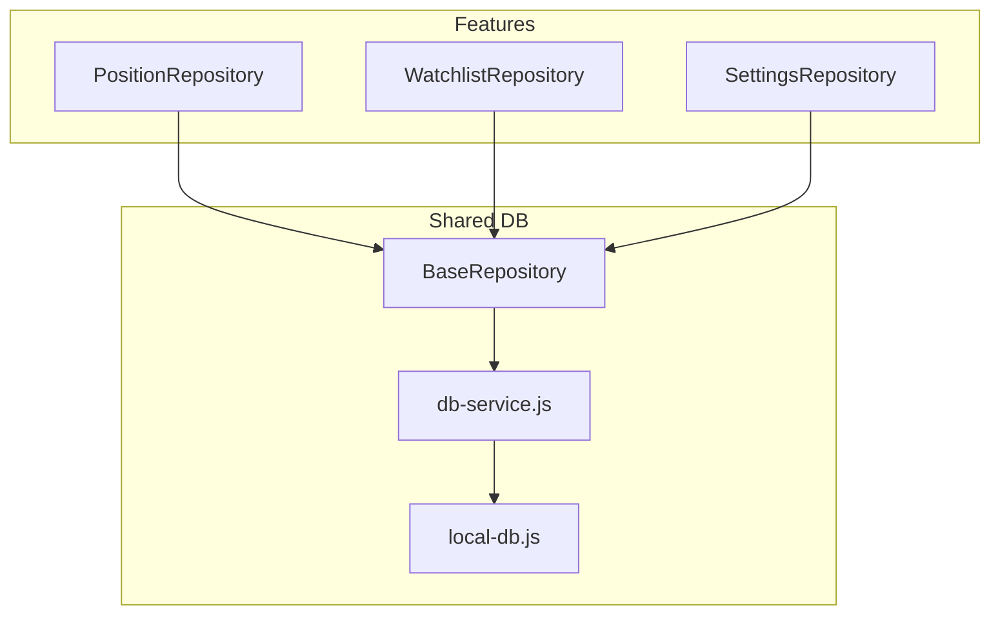
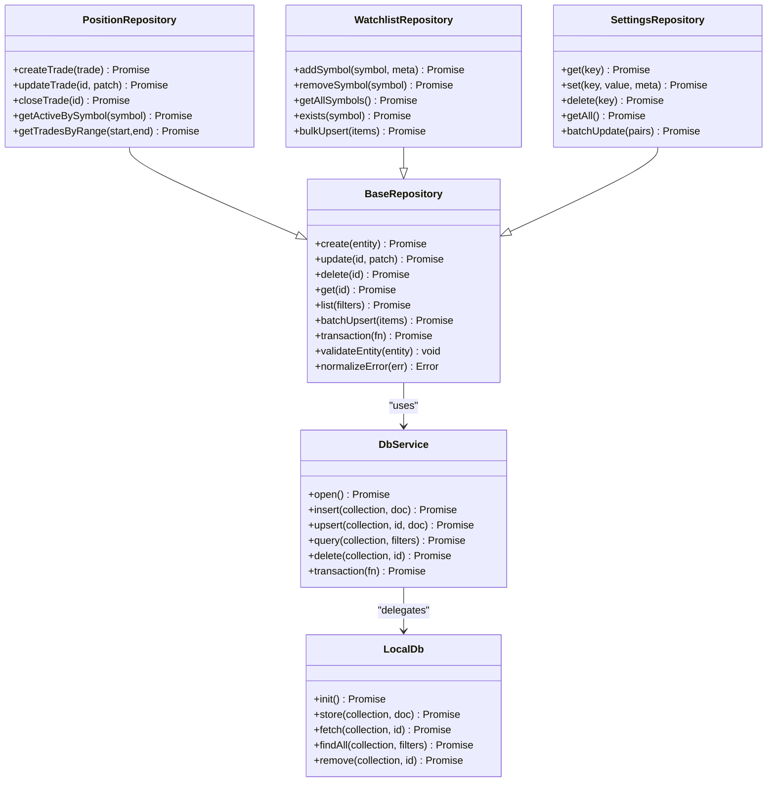
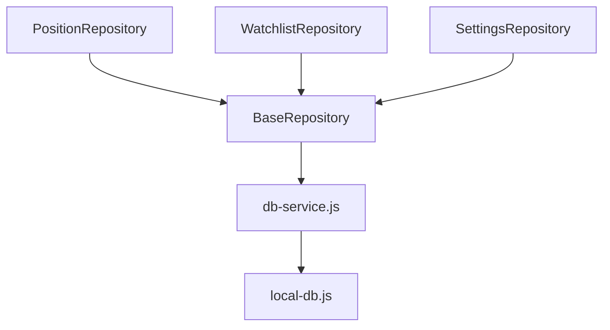

# Repository API

<cite>
**Referenced Files in This Document**
- [BaseRepository.js](file://shared/db/BaseRepository.js)
- [PositionRepository.js](file://features/positions/PositionRepository.js)
- [WatchlistRepository.js](file://features/watchlist/WatchlistRepository.js)
- [SettingsRepository.js](file://features/more/SettingsRepository.js)
- [db-service.js](file://shared/db/db-service.js)
- [local-db.js](file://shared/db/local-db.js)
</cite>

## Table of Contents
1. [Introduction](#introduction)
2. [Project Structure](#project-structure)
3. [Core Components](#core-components)
4. [Architecture Overview](#architecture-overview)
5. [Detailed Component Analysis](#detailed-component-analysis)
6. [Dependency Analysis](#dependency-analysis)
7. [Performance Considerations](#performance-considerations)
8. [Troubleshooting Guide](#troubleshooting-guide)
9. [Conclusion](#conclusion)

## Introduction
This document provides comprehensive API documentation for the repository layer interfaces used across the application. It focuses on:
- The BaseRepository abstract class and its inherited methods
- Feature-specific repositories: PositionRepository, WatchlistRepository, SettingsRepository
- Method signatures, parameter validation rules, return formats, and error handling patterns
- Async/await usage, promise handling, and error propagation
- Practical examples for common CRUD operations, query patterns, and data manipulation

The repository layer encapsulates database interactions and exposes a consistent API to features and services.

## Project Structure
The repository layer is organized under shared/db for base infrastructure and features/*/ for domain-specific repositories. Key files include:
- BaseRepository: Abstract base providing common persistence utilities
- Feature repositories: Implement domain operations using BaseRepository
- Database service: Provides access to underlying storage (e.g., local or remote)

**Diagram sources**
- [BaseRepository.js](file://shared/db/BaseRepository.js)
- [PositionRepository.js](file://features/positions/PositionRepository.js)
- [WatchlistRepository.js](file://features/watchlist/WatchlistRepository.js)
- [SettingsRepository.js](file://features/more/SettingsRepository.js)
- [db-service.js](file://shared/db/db-service.js)
- [local-db.js](file://shared/db/local-db.js)

**Section sources**
- [BaseRepository.js](file://shared/db/BaseRepository.js)
- [PositionRepository.js](file://features/positions/PositionRepository.js)
- [WatchlistRepository.js](file://features/watchlist/WatchlistRepository.js)
- [SettingsRepository.js](file://features/more/SettingsRepository.js)
- [db-service.js](file://shared/db/db-service.js)
- [local-db.js](file://shared/db/local-db.js)

## Core Components
This section summarizes the responsibilities and contracts of each repository component.

- BaseRepository
  - Purpose: Provide shared persistence helpers, transactional wrappers, and standardized error handling.
  - Typical capabilities: create, read, update, delete, list, query with filters, batch operations, and safe async wrappers.
  - Error handling: Normalizes errors into consistent shapes; supports retryable vs non-retryable classification.
  - Concurrency: Ensures safe concurrent writes via locks or serialized queues when needed.

- PositionRepository
  - Purpose: Manage trade positions, including creation, updates, closures, and queries by symbol/status/time range.
  - Common operations: Create position, update fields, mark closed, fetch active positions, historical trades.
  - Data model: Represents a trade position entity with fields such as symbol, side, quantity, entry price, timestamps, status.

- WatchlistRepository
  - Purpose: Maintain user watchlists of symbols, including add/remove, reorder, and sync state.
  - Common operations: Add symbol, remove symbol, get all symbols, check existence, bulk upsert.
  - Data model: Represents a watchlist item entity with fields like symbol, metadata, last updated timestamp.

- SettingsRepository
  - Purpose: Persist user preferences and configuration values.
  - Common operations: Get setting by key, set/update setting, delete setting, get all settings, batch update.
  - Data model: Represents a setting entity with key-value pairs and optional metadata.

**Section sources**
- [BaseRepository.js](file://shared/db/BaseRepository.js)
- [PositionRepository.js](file://features/positions/PositionRepository.js)
- [WatchlistRepository.js](file://features/watchlist/WatchlistRepository.js)
- [SettingsRepository.js](file://features/more/SettingsRepository.js)

## Architecture Overview
The repository layer follows a layered architecture where feature repositories extend BaseRepository and delegate low-level operations to db-service.js, which may use local-db.js or other backends.

**Diagram sources**
- [BaseRepository.js](file://shared/db/BaseRepository.js)
- [PositionRepository.js](file://features/positions/PositionRepository.js)
- [WatchlistRepository.js](file://features/watchlist/WatchlistRepository.js)
- [SettingsRepository.js](file://features/more/SettingsRepository.js)
- [db-service.js](file://shared/db/db-service.js)
- [local-db.js](file://shared/db/local-db.js)

## Detailed Component Analysis

### BaseRepository API Reference
Responsibilities:
- Standardized CRUD operations
- Entity validation and normalization
- Transactional execution wrapper
- Consistent error shaping and propagation

Key Methods:
- create(entity)
  - Parameters:
    - entity: Object conforming to schema defined by the implementing repository
  - Returns:
    - Promise resolving to created entity with server-assigned id
  - Validation:
    - Required fields enforced by validateEntity
  - Errors:
    - Throws normalized error on invalid input or write failure

- update(id, patch)
  - Parameters:
    - id: String identifier
    - patch: Partial object with fields to update
  - Returns:
    - Promise resolving to updated entity
  - Validation:
    - Id must exist; patch fields validated against schema
  - Errors:
    - Not found if id missing; validation error for invalid patch

- delete(id)
  - Parameters:
    - id: String identifier
  - Returns:
    - Promise resolving to boolean success flag
  - Errors:
    - Not found if id missing

- get(id)
  - Parameters:
    - id: String identifier
  - Returns:
    - Promise resolving to entity or null
  - Errors:
    - None; returns null when not found

- list(filters)
  - Parameters:
    - filters: Object with supported keys (e.g., symbol, status, date range)
  - Returns:
    - Promise resolving to array of entities
  - Validation:
    - Filters normalized and sanitized
  - Errors:
    - Query error propagated as normalized error

- batchUpsert(items)
  - Parameters:
    - items: Array of entities to upsert
  - Returns:
    - Promise resolving to array of results
  - Errors:
    - Partial failures aggregated; overall promise resolves with results

- transaction(fn)
  - Parameters:
    - fn: Async function receiving transaction context
  - Returns:
    - Promise resolving to result of fn
  - Behavior:
    - Ensures atomicity; rolls back on any error thrown inside fn

- validateEntity(entity)
  - Parameters:
    - entity: Object to validate
  - Returns:
    - void; throws validation error if invalid

- normalizeError(err)
  - Parameters:
    - err: Original error
  - Returns:
    - Error with consistent shape and message

Async/Await Patterns:
- All public methods return Promises suitable for async/await
- Errors are normalized before propagation to callers

Usage Examples:
- Create an entity: await repo.create(entity)
- Update fields: await repo.update(id, patch)
- Delete: await repo.delete(id)
- Fetch single: const entity = await repo.get(id)
- List with filters: const items = await repo.list({ symbol: "AAPL", status: "active" })
- Batch upsert: const results = await repo.batchUpsert(items)
- Transaction: await repo.transaction(async (tx) => { /* ... */ })

**Section sources**
- [BaseRepository.js](file://shared/db/BaseRepository.js)

### PositionRepository API Reference
Responsibilities:
- Trade management and position tracking
- Active/historical queries
- Status transitions (e.g., open to closed)

Key Methods:
- createTrade(trade)
  - Parameters:
    - trade: Object with required fields (symbol, side, quantity, entryPrice, timestamps, etc.)
  - Returns:
    - Promise resolving to created trade entity
  - Validation:
    - Required fields enforced; numeric validations for prices and quantities
  - Errors:
    - Validation error on invalid trade; write error propagated

- updateTrade(id, patch)
  - Parameters:
    - id: String identifier
    - patch: Partial fields to update (e.g., exitPrice, status, notes)
  - Returns:
    - Promise resolving to updated trade entity
  - Validation:
    - Patch fields validated; id must exist
  - Errors:
    - Not found or validation error

- closeTrade(id)
  - Parameters:
    - id: String identifier
  - Returns:
    - Promise resolving to updated trade with status closed
  - Validation:
    - Trade must be open; closing logic enforced
  - Errors:
    - Invalid state transition error

- getActiveBySymbol(symbol)
  - Parameters:
    - symbol: String representing asset symbol
  - Returns:
    - Promise resolving to array of active trades for symbol
  - Validation:
    - Symbol must be non-empty
  - Errors:
    - Query error propagated

- getTradesByRange(start, end)
  - Parameters:
    - start: ISO string or timestamp for start boundary
    - end: ISO string or timestamp for end boundary
  - Returns:
    - Promise resolving to array of trades within range
  - Validation:
    - Dates must be valid and start <= end
  - Errors:
    - Invalid date range error

Async/Await Patterns:
- All methods return Promises; recommended to use async/await
- Errors normalized and include context (e.g., operation, entity id)

Usage Examples:
- Create trade: await posRepo.createTrade({ symbol: "EURUSD", side: "buy", quantity: 0.1, entryPrice: 1.1234 })
- Close trade: await posRepo.closeTrade("trade-id")
- Get active positions: const active = await posRepo.getActiveBySymbol("GBPUSD")
- Range query: const trades = await posRepo.getTradesByRange("2024-01-01T00:00:00Z", "2024-01-31T23:59:59Z")

**Section sources**
- [PositionRepository.js](file://features/positions/PositionRepository.js)

### WatchlistRepository API Reference
Responsibilities:
- Symbol monitoring and watchlist operations
- Add/remove/reorder symbols
- Bulk operations and existence checks

Key Methods:
- addSymbol(symbol, meta)
  - Parameters:
    - symbol: String unique identifier for the symbol
    - meta: Optional object with additional metadata
  - Returns:
    - Promise resolving to created watchlist item
  - Validation:
    - Symbol must be non-empty and unique
  - Errors:
    - Duplicate symbol error; write error propagated

- removeSymbol(symbol)
  - Parameters:
    - symbol: String identifier
  - Returns:
    - Promise resolving to boolean success flag
  - Errors:
    - Not found if symbol absent

- getAllSymbols()
  - Parameters:
    - None
  - Returns:
    - Promise resolving to array of symbols with metadata
  - Errors:
    - Query error propagated

- exists(symbol)
  - Parameters:
    - symbol: String identifier
  - Returns:
    - Promise resolving to boolean
  - Errors:
    - None; returns false if not present

- bulkUpsert(items)
  - Parameters:
    - items: Array of { symbol, meta } objects
  - Returns:
    - Promise resolving to array of results
  - Validation:
    - Each item validated; duplicates handled
  - Errors:
    - Partial failures aggregated; overall promise resolves

Async/Await Patterns:
- All methods return Promises; recommended to use async/await
- Errors normalized and include operation context

Usage Examples:
- Add symbol: await wlRepo.addSymbol("BTCUSD", { note: "Long-term hold" })
- Remove symbol: await wlRepo.removeSymbol("XAUUSD")
- Check existence: const present = await wlRepo.exists("ETHUSD")
- Bulk upsert: await wlRepo.bulkUpsert([{ symbol: "NZDUSD", meta: {} }, { symbol: "USDCAD", meta: {} }])

**Section sources**
- [WatchlistRepository.js](file://features/watchlist/WatchlistRepository.js)

### SettingsRepository API Reference
Responsibilities:
- User preferences and configuration management
- Key-value settings with optional metadata
- Batch updates and retrieval

Key Methods:
- get(key)
  - Parameters:
    - key: String setting key
  - Returns:
    - Promise resolving to setting value or null
  - Validation:
    - Key must be non-empty
  - Errors:
    - None; returns null if not found

- set(key, value, meta)
  - Parameters:
    - key: String unique setting key
    - value: Serializable value
    - meta: Optional metadata object
  - Returns:
    - Promise resolving to persisted setting
  - Validation:
    - Key uniqueness enforced; value type validated
  - Errors:
    - Duplicate key error; serialization error propagated

- delete(key)
  - Parameters:
    - key: String setting key
  - Returns:
    - Promise resolving to boolean success flag
  - Errors:
    - Not found if key absent

- getAll()
  - Parameters:
    - None
  - Returns:
    - Promise resolving to map of key to value
  - Errors:
    - Query error propagated

- batchUpdate(pairs)
  - Parameters:
    - pairs: Array of { key, value, meta? } objects
  - Returns:
    - Promise resolving to array of results
  - Validation:
    - Keys validated; duplicates handled
  - Errors:
    - Partial failures aggregated; overall promise resolves

Async/Await Patterns:
- All methods return Promises; recommended to use async/await
- Errors normalized and include operation context

Usage Examples:
- Get setting: const theme = await settingsRepo.get("theme")
- Set setting: await settingsRepo.set("fontSize", 14, { version: 1 })
- Delete setting: await settingsRepo.delete("lastSyncTime")
- Batch update: await settingsRepo.batchUpdate([{ key: "lang", value: "en" }, { key: "tz", value: "UTC" }])

**Section sources**
- [SettingsRepository.js](file://features/more/SettingsRepository.js)

## Dependency Analysis
Repositories depend on BaseRepository for shared behavior and on db-service.js for storage operations. db-service.js may delegate to local-db.js or other backends.

**Diagram sources**
- [BaseRepository.js](file://shared/db/BaseRepository.js)
- [PositionRepository.js](file://features/positions/PositionRepository.js)
- [WatchlistRepository.js](file://features/watchlist/WatchlistRepository.js)
- [SettingsRepository.js](file://features/more/SettingsRepository.js)
- [db-service.js](file://shared/db/db-service.js)
- [local-db.js](file://shared/db/local-db.js)

**Section sources**
- [BaseRepository.js](file://shared/db/BaseRepository.js)
- [db-service.js](file://shared/db/db-service.js)
- [local-db.js](file://shared/db/local-db.js)

## Performance Considerations
- Prefer batch operations (batchUpsert, bulkUpsert, batchUpdate) to reduce round-trips
- Use filtered list queries to minimize payload size
- Avoid frequent small writes; coalesce updates when possible
- Leverage transactions for multi-step operations to ensure consistency and reduce partial states
- Cache frequently accessed settings and watchlist data at the service layer to reduce repository load

## Troubleshooting Guide
Common issues and strategies:
- Validation errors: Ensure required fields are present and types match expected schemas
- Not found errors: Verify ids and keys exist before update/delete operations
- Duplicate key errors: For unique constraints (symbols, settings), handle conflicts gracefully
- Transaction rollbacks: Inspect errors thrown inside transaction functions; wrap critical sections appropriately
- Error normalization: Catch normalized errors and inspect operation context for diagnostics

Recommended practices:
- Always await repository calls and handle errors explicitly
- Log normalized errors with operation details for easier debugging
- Use retries for transient network/storage errors when appropriate

**Section sources**
- [BaseRepository.js](file://shared/db/BaseRepository.js)
- [PositionRepository.js](file://features/positions/PositionRepository.js)
- [WatchlistRepository.js](file://features/watchlist/WatchlistRepository.js)
- [SettingsRepository.js](file://features/more/SettingsRepository.js)

## Conclusion
The repository layer provides a consistent, validated, and error-normalized interface for persistence across features. BaseRepository standardizes core operations and error handling, while feature-specific repositories implement domain-focused APIs. Using async/await and following the documented validation and error patterns ensures robust and maintainable code.