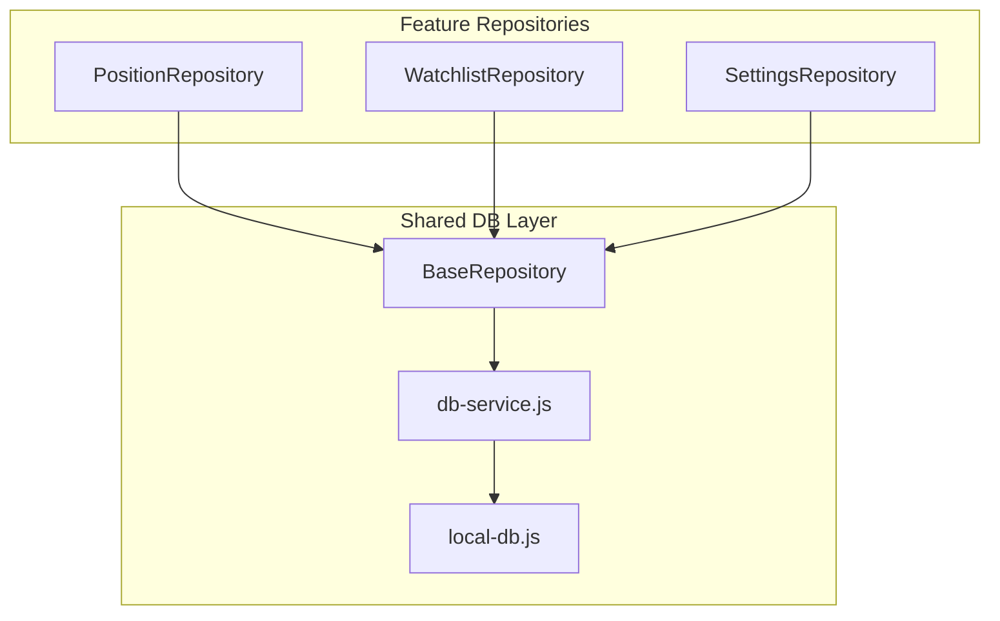
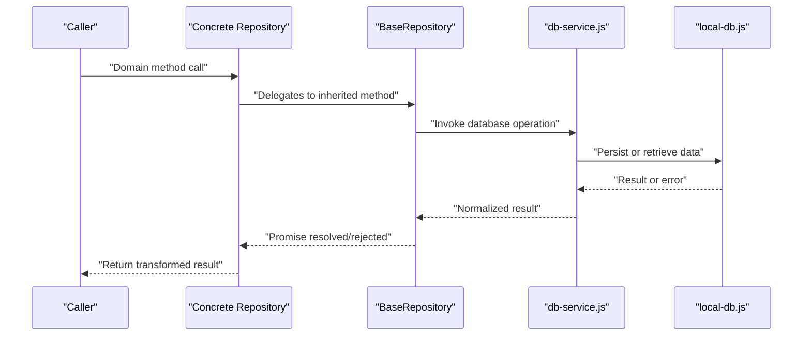
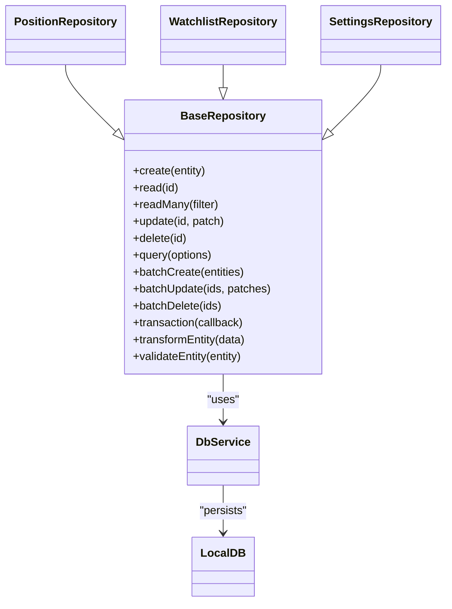

# Base Repository Interface

<cite>
**Referenced Files in This Document**
- [BaseRepository.js](file://shared/db/BaseRepository.js)
- [PositionRepository.js](file://features/positions/PositionRepository.js)
- [WatchlistRepository.js](file://features/watchlist/WatchlistRepository.js)
- [SettingsRepository.js](file://features/more/SettingsRepository.js)
- [db-service.js](file://shared/db/db-service.js)
- [local-db.js](file://shared/db/local-db.js)
</cite>

## Table of Contents
1. [Introduction](#introduction)
2. [Project Structure](#project-structure)
3. [Core Components](#core-components)
4. [Architecture Overview](#architecture-overview)
5. [Detailed Component Analysis](#detailed-component-analysis)
6. [Dependency Analysis](#dependency-analysis)
7. [Performance Considerations](#performance-considerations)
8. [Troubleshooting Guide](#troubleshooting-guide)
9. [Conclusion](#conclusion)

## Introduction
This document provides comprehensive API documentation for the BaseRepository abstract class and its usage across the application. It explains the repository pattern implementation, asynchronous operations with async/await and promises, database abstraction layer integration, method signatures, parameter validation rules, return formats, error handling patterns, transaction handling strategies, and performance optimization techniques. It also includes guidance on extending BaseRepository to build custom repositories and managing data transformation and connections.

## Project Structure
The repository layer is implemented under shared/db and consumed by feature-specific repositories in features/*/... The key files include:
- BaseRepository abstract class defining common CRUD and query methods
- Feature repositories that extend BaseRepository (e.g., PositionRepository, WatchlistRepository, SettingsRepository)
- Database service abstractions (db-service.js, local-db.js) used by BaseRepository for persistence

**Diagram sources**
- [BaseRepository.js](file://shared/db/BaseRepository.js)
- [PositionRepository.js](file://features/positions/PositionRepository.js)
- [WatchlistRepository.js](file://features/watchlist/WatchlistRepository.js)
- [SettingsRepository.js](file://features/more/SettingsRepository.js)
- [db-service.js](file://shared/db/db-service.js)
- [local-db.js](file://shared/db/local-db.js)

**Section sources**
- [BaseRepository.js](file://shared/db/BaseRepository.js)
- [PositionRepository.js](file://features/positions/PositionRepository.js)
- [WatchlistRepository.js](file://features/watchlist/WatchlistRepository.js)
- [SettingsRepository.js](file://features/more/SettingsRepository.js)
- [db-service.js](file://shared/db/db-service.js)
- [local-db.js](file://shared/db/local-db.js)

## Core Components
- BaseRepository: Abstract base providing a consistent interface for CRUD operations, queries, and utilities. It encapsulates database interactions via db-service and local-db abstractions.
- Feature Repositories: Concrete implementations extending BaseRepository to provide domain-specific behavior and data transformations.

Key responsibilities:
- Standardized create, read, update, delete operations
- Query helpers for filtering, sorting, pagination
- Error normalization and propagation
- Async/promise-based APIs
- Optional transaction support through underlying database services

**Section sources**
- [BaseRepository.js](file://shared/db/BaseRepository.js)
- [PositionRepository.js](file://features/positions/PositionRepository.js)
- [WatchlistRepository.js](file://features/watchlist/WatchlistRepository.js)
- [SettingsRepository.js](file://features/more/SettingsRepository.js)

## Architecture Overview
The repository pattern decouples business logic from data access. BaseRepository defines the contract; concrete repositories implement domain-specific logic while reusing common functionality. Database services abstract storage backends, enabling consistent behavior across different environments.

**Diagram sources**
- [BaseRepository.js](file://shared/db/BaseRepository.js)
- [db-service.js](file://shared/db/db-service.js)
- [local-db.js](file://shared/db/local-db.js)

## Detailed Component Analysis

### BaseRepository API
BaseRepository exposes a set of standardized methods for data access. All methods are asynchronous and return Promises.

- create(entity): Creates a new entity record.
  - Parameters:
    - entity: Object representing the entity to be created. Must conform to the schema expected by the underlying database service.
  - Returns: Promise resolving to the created entity object including generated identifiers if applicable.
  - Validation:
    - Required fields must be present; otherwise, a validation error is thrown.
  - Errors:
    - Throws on invalid input or database write failures.

- read(id): Retrieves an entity by its unique identifier.
  - Parameters:
    - id: String or number representing the entity ID.
  - Returns: Promise resolving to the entity object or null if not found.
  - Validation:
    - id must be non-empty and of the expected type.
  - Errors:
    - Throws on malformed id or database read errors.

- readMany(filter): Retrieves multiple entities based on filter criteria.
  - Parameters:
    - filter: Object specifying conditions such as equality, range, or list membership.
  - Returns: Promise resolving to an array of entity objects.
  - Validation:
    - filter must be a valid object; unsupported keys may be ignored or cause errors depending on implementation.
  - Errors:
    - Throws on invalid filter structure or database query errors.

- update(id, patch): Updates an existing entity with partial changes.
  - Parameters:
    - id: Unique identifier of the entity to update.
    - patch: Object containing fields to update.
  - Returns: Promise resolving to the updated entity object.
  - Validation:
    - id must exist; patch must contain at least one updatable field.
  - Errors:
    - Throws if entity not found or patch is invalid.

- delete(id): Deletes an entity by its identifier.
  - Parameters:
    - id: Unique identifier of the entity to delete.
  - Returns: Promise resolving to true upon successful deletion or false if not found.
  - Validation:
    - id must be valid.
  - Errors:
    - Throws on database delete errors.

- query(options): Advanced querying with filtering, sorting, and pagination.
  - Parameters:
    - options: Object with optional fields:
      - where: Filter conditions
      - orderBy: Field name and direction
      - limit: Maximum number of results
      - offset: Number of records to skip
  - Returns: Promise resolving to an object containing results and metadata (e.g., total count).
  - Validation:
    - Options must be well-formed; unsupported combinations may be rejected.
  - Errors:
    - Throws on invalid options or database query errors.

- batchCreate(entities): Creates multiple entities in a single operation.
  - Parameters:
    - entities: Array of entity objects.
  - Returns: Promise resolving to an array of created entities.
  - Validation:
    - Each entity must pass individual validation.
  - Errors:
    - Throws if any entity is invalid or batch write fails.

- batchUpdate(ids, patches): Updates multiple entities atomically.
  - Parameters:
    - ids: Array of unique identifiers.
    - patches: Array of patch objects corresponding to ids.
  - Returns: Promise resolving to an array of updated entities.
  - Validation:
    - ids and patches arrays must match in length and validity.
  - Errors:
    - Throws on mismatched inputs or partial failure scenarios.

- batchDelete(ids): Deletes multiple entities atomically.
  - Parameters:
    - ids: Array of unique identifiers.
  - Returns: Promise resolving to an array of boolean flags indicating success per id.
  - Validation:
    - ids must be non-empty and valid.
  - Errors:
    - Throws on invalid inputs or database errors.

- transaction(callback): Executes a callback within a database transaction.
  - Parameters:
    - callback: Function receiving a transaction context; performs multiple operations.
  - Returns: Promise resolving to the callback’s result if all operations succeed.
  - Validation:
    - callback must be a function returning a Promise.
  - Errors:
    - Rolls back on any rejection; throws normalized error.

- transformEntity(data): Transforms raw database data into domain model format.
  - Parameters:
    - data: Raw data object from database.
  - Returns: Domain model object.
  - Validation:
    - Ensures required fields are present; applies default values if needed.
  - Errors:
    - Throws on missing critical fields.

- validateEntity(entity): Validates an entity against schema rules.
  - Parameters:
    - entity: Entity object to validate.
  - Returns: Boolean or throws detailed validation errors.
  - Validation:
    - Enforces required fields, types, and constraints.
  - Errors:
    - Throws descriptive validation errors.

Notes on async/await and promise handling:
- All methods return Promises; callers should use async/await or .then/.catch consistently.
- Errors are normalized and propagated; callers can catch and handle them uniformly.

Connection management:
- BaseRepository relies on db-service.js and local-db.js for connection and persistence. Ensure proper initialization before invoking repository methods.

Error propagation strategies:
- Input validation errors are thrown early with clear messages.
- Database errors are wrapped and normalized for consistent handling.
- Transaction failures trigger rollback and propagate the first encountered error.

**Section sources**
- [BaseRepository.js](file://shared/db/BaseRepository.js)
- [db-service.js](file://shared/db/db-service.js)
- [local-db.js](file://shared/db/local-db.js)

### Extending BaseRepository: Example Repositories
Concrete repositories inherit BaseRepository and add domain-specific logic, data transformations, and convenience methods.

- PositionRepository
  - Purpose: Manages trading positions with specialized queries and transformations.
  - Typical additions:
    - Methods to fetch positions by symbol, status, or date ranges.
    - Data enrichment combining position data with market info.
    - Custom validation rules for financial constraints.

- WatchlistRepository
  - Purpose: Manages user watchlists and item ordering.
  - Typical additions:
    - Methods to add/remove items, reorder lists.
    - Aggregation of watchlist metrics.
    - Conflict resolution for concurrent updates.

- SettingsRepository
  - Purpose: Manages application settings with defaults and versioning.
  - Typical additions:
    - Migration helpers for schema evolution.
    - Bulk import/export of settings.
    - Validation against allowed setting keys and value ranges.

Best practices when extending:
- Keep BaseRepository methods untouched; override only when necessary.
- Implement transformEntity and validateEntity to enforce domain invariants.
- Use transaction(callback) for multi-step operations requiring atomicity.
- Provide clear error messages and stack traces for debugging.

**Section sources**
- [PositionRepository.js](file://features/positions/PositionRepository.js)
- [WatchlistRepository.js](file://features/watchlist/WatchlistRepository.js)
- [SettingsRepository.js](file://features/more/SettingsRepository.js)
- [BaseRepository.js](file://shared/db/BaseRepository.js)

### Data Transformation Logic
Data transformation ensures consistency between raw database records and domain models.

- transformEntity(data): Converts raw data to domain objects, applying defaults and formatting.
- validateEntity(entity): Enforces schema constraints and business rules prior to persistence.

Recommended approach:
- Centralize transformation in BaseRepository or overridden methods in concrete repositories.
- Use deterministic transformations to avoid side effects.
- Log transformation warnings for unexpected data shapes without failing fast unless critical.

**Section sources**
- [BaseRepository.js](file://shared/db/BaseRepository.js)

### Connection Management
BaseRepository delegates connection and persistence to db-service.js and local-db.js.

- Initialization:
  - Ensure database services are initialized before repository usage.
- Lifecycle:
  - Connections are managed by db-service.js; repositories should not manage connections directly.
- Environment differences:
  - local-db.js may provide in-memory or file-backed storage for development/testing.

**Section sources**
- [db-service.js](file://shared/db/db-service.js)
- [local-db.js](file://shared/db/local-db.js)

## Dependency Analysis
Repositories depend on BaseRepository for common operations and on database services for persistence.

**Diagram sources**
- [BaseRepository.js](file://shared/db/BaseRepository.js)
- [PositionRepository.js](file://features/positions/PositionRepository.js)
- [WatchlistRepository.js](file://features/watchlist/WatchlistRepository.js)
- [SettingsRepository.js](file://features/more/SettingsRepository.js)
- [db-service.js](file://shared/db/db-service.js)
- [local-db.js](file://shared/db/local-db.js)

**Section sources**
- [BaseRepository.js](file://shared/db/BaseRepository.js)
- [PositionRepository.js](file://features/positions/PositionRepository.js)
- [WatchlistRepository.js](file://features/watchlist/WatchlistRepository.js)
- [SettingsRepository.js](file://features/more/SettingsRepository.js)
- [db-service.js](file://shared/db/db-service.js)
- [local-db.js](file://shared/db/local-db.js)

## Performance Considerations
- Prefer batch operations (batchCreate, batchUpdate, batchDelete) to reduce round-trips.
- Use query(options) with appropriate filters, limits, and offsets to minimize payload sizes.
- Cache frequently accessed data at the repository layer when safe.
- Avoid unnecessary transformations; apply them only when needed by consumers.
- Monitor transaction scope; keep transactions short to reduce contention.
- Leverage indexes defined in local-db.js or database schema for efficient queries.

[No sources needed since this section provides general guidance]

## Troubleshooting Guide
Common issues and resolutions:
- Validation errors:
  - Check required fields and types in entity objects.
  - Review validateEntity rules and adjust inputs accordingly.
- Not found errors:
  - Verify id correctness and existence before update/delete calls.
- Database errors:
  - Inspect db-service.js and local-db.js logs for underlying failures.
  - Ensure database initialization completed successfully.
- Transaction rollbacks:
  - Identify the failing operation within transaction(callback) and fix the root cause.
- Promise rejections:
  - Always attach .catch or use try/catch with async/await to handle errors gracefully.

**Section sources**
- [BaseRepository.js](file://shared/db/BaseRepository.js)
- [db-service.js](file://shared/db/db-service.js)
- [local-db.js](file://shared/db/local-db.js)

## Conclusion
BaseRepository provides a robust, consistent foundation for data access across the application. By adhering to its API, implementing proper validation and transformation, and leveraging transactions and batch operations, developers can build reliable, maintainable repositories tailored to their domains. Proper error handling and performance optimizations ensure smooth operation in both development and production environments.

[No sources needed since this section summarizes without analyzing specific files]