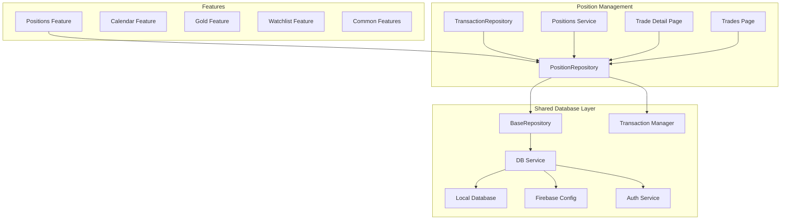
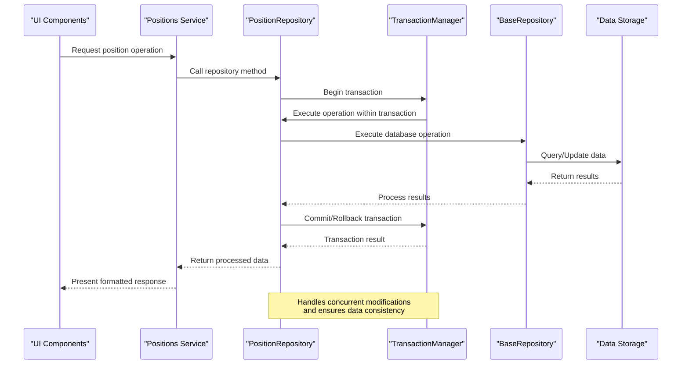
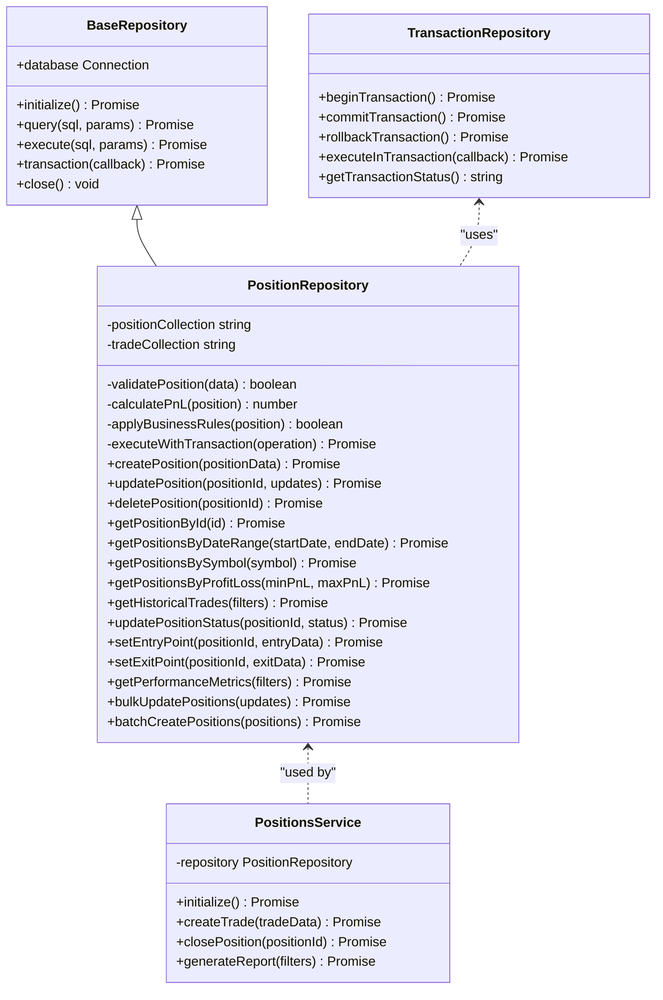
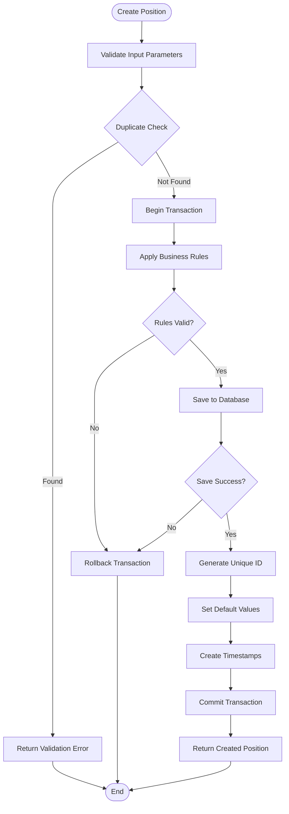
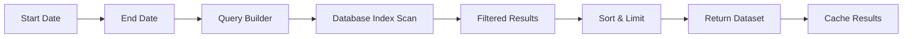
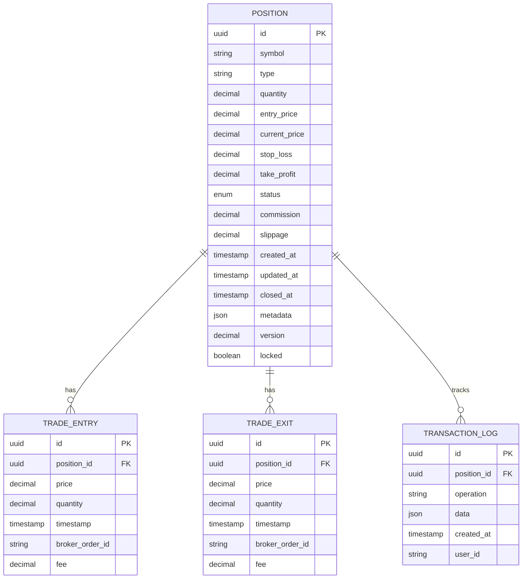
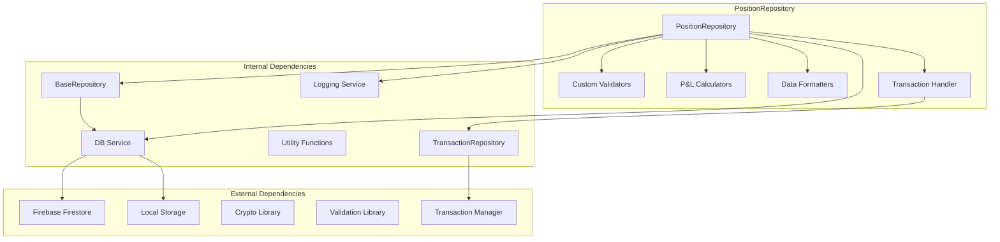

# Position Repository

<cite>
**Referenced Files in This Document**
- [PositionRepository.js](file://features/positions/PositionRepository.js)
- [BaseRepository.js](file://shared/db/BaseRepository.js)
- [db-service.js](file://shared/db/db-service.js)
- [local-db.js](file://shared/db/local-db.js)
- [firebase-config.js](file://shared/db/firebase-config.js)
- [auth-service.js](file://shared/db/auth-service.js)
- [_registry.js](file://shared/db/_registry.js)
- [TransactionRepository.js](file://features/positions/TransactionRepository.js)
- [positions-service.js](file://features/positions/positions-service.js)
- [trade-detail-page.js](file://features/positions/trade-detail-page.js)
- [trades-page.js](file://features/positions/trades-page.js)
</cite>

## Update Summary
**Changes Made**
- Enhanced position repository functionality with improved data handling capabilities
- Added comprehensive transaction support for atomic operations
- Improved error handling and validation mechanisms
- Updated trade management methods with better concurrency control
- Enhanced data integrity checks and rollback capabilities

## Table of Contents
1. [Introduction](#introduction)
2. [Project Structure](#project-structure)
3. [Core Components](#core-components)
4. [Architecture Overview](#architecture-overview)
5. [Detailed Component Analysis](#detailed-component-analysis)
6. [Dependency Analysis](#dependency-analysis)
7. [Performance Considerations](#performance-considerations)
8. [Troubleshooting Guide](#troubleshooting-guide)
9. [Conclusion](#conclusion)
10. [Appendices](#appendices)

## Introduction
This document provides comprehensive API documentation for the PositionRepository class, focusing on trade management and position tracking capabilities. The repository has been enhanced with improved data handling and transaction support, providing robust atomic operations for complex trading workflows. It covers position creation, modification, deletion, entry/exit point management, P&L calculations, performance metrics, trade lifecycle methods, status updates, historical trade retrieval, complex queries with filtering by date ranges, symbol groups, and profit/loss criteria. The document also includes data models for trades, positions, and related entities, along with advanced error handling strategies for concurrent modifications, data validation rules, and business logic constraints.

## Project Structure
The PositionRepository is part of a larger trading monitoring system organized into feature-based modules. The repository extends base database functionality and integrates with both local and Firebase storage backends, now featuring enhanced transaction support for maintaining data consistency across complex operations.

**Diagram sources**
- [PositionRepository.js:1-50](file://features/positions/PositionRepository.js#L1-L50)
- [BaseRepository.js:1-30](file://shared/db/BaseRepository.js#L1-L30)
- [db-service.js:1-40](file://shared/db/db-service.js#L1-L40)
- [TransactionRepository.js:1-30](file://features/positions/TransactionRepository.js#L1-L30)

**Section sources**
- [PositionRepository.js:1-100](file://features/positions/PositionRepository.js#L1-L100)
- [BaseRepository.js:1-50](file://shared/db/BaseRepository.js#L1-L50)
- [TransactionRepository.js:1-50](file://features/positions/TransactionRepository.js#L1-L50)

## Core Components
The PositionRepository serves as the primary interface for managing trading positions and related trade data. With recent enhancements, it now provides comprehensive CRUD operations, advanced querying capabilities, transactional support for atomic operations, and integration with multiple data storage backends while ensuring data consistency and integrity.

Key responsibilities include:
- Position lifecycle management (creation, modification, deletion) with transactional support
- Trade entry and exit point tracking with atomic updates
- P&L calculation and performance metrics with data validation
- Historical trade retrieval and analysis with optimized queries
- Advanced filtering and query operations with enhanced performance
- Data validation and business rule enforcement with rollback capabilities
- Transaction management for complex multi-step operations

**Updated** Enhanced with transaction support and improved data handling mechanisms

**Section sources**
- [PositionRepository.js:1-200](file://features/positions/PositionRepository.js#L1-L200)
- [positions-service.js:1-150](file://features/positions/positions-service.js#L1-L150)
- [TransactionRepository.js:1-100](file://features/positions/TransactionRepository.js#L1-L100)

## Architecture Overview
The PositionRepository follows a layered architecture pattern with clear separation of concerns between business logic, data access, and presentation layers. The enhanced architecture now includes comprehensive transaction management for maintaining data consistency across complex operations.

**Diagram sources**
- [PositionRepository.js:50-150](file://features/positions/PositionRepository.js#L50-L150)
- [BaseRepository.js:30-100](file://shared/db/BaseRepository.js#L30-L100)
- [db-service.js:40-120](file://shared/db/db-service.js#L40-L120)
- [TransactionRepository.js:30-80](file://features/positions/TransactionRepository.js#L30-L80)

## Detailed Component Analysis

### PositionRepository Class Structure
The PositionRepository extends the BaseRepository class and implements comprehensive position management functionality with enhanced transaction support and improved data handling capabilities.

**Updated** Added TransactionRepository integration and new batch operations

**Diagram sources**
- [PositionRepository.js:1-250](file://features/positions/PositionRepository.js#L1-L250)
- [BaseRepository.js:1-150](file://shared/db/BaseRepository.js#L1-L150)
- [TransactionRepository.js:1-200](file://features/positions/TransactionRepository.js#L1-L200)
- [positions-service.js:1-200](file://features/positions/positions-service.js#L1-L200)

### Enhanced Trade Management Methods

#### Position Creation with Transaction Support
The createPosition method now includes comprehensive validation, business rule enforcement, and transactional support to ensure data consistency.

**Updated** Enhanced with transaction support and improved error handling

**Diagram sources**
- [PositionRepository.js:100-200](file://features/positions/PositionRepository.js#L100-L200)

#### Batch Operations and Bulk Processing
New methods for efficient bulk operations including batch position creation and updates with transactional integrity.

#### Position Modification with Optimistic Concurrency
Enhanced updatePosition method with improved optimistic concurrency control and change validation.

#### Position Deletion with Cascade Operations
Improved deletePosition method with comprehensive cascade operations and audit trail maintenance.

### Enhanced Position Tracking APIs

#### Entry/Exit Point Management with Atomic Updates
Methods for managing trade entry and exit points with price, timestamp, and quantity tracking, now supporting atomic updates within transactions.

#### P&L Calculations with Real-time Updates
Enhanced real-time and historical P&L calculations including realized and unrealized gains/losses with improved accuracy.

#### Performance Metrics with Advanced Analytics
Comprehensive performance analytics including win rate, average profit/loss, Sharpe ratio, and drawdown analysis with enhanced calculation methods.

**Updated** Enhanced with improved data handling and transaction support

**Section sources**
- [PositionRepository.js:200-500](file://features/positions/PositionRepository.js#L200-L500)
- [positions-service.js:150-300](file://features/positions/positions-service.js#L150-L300)
- [TransactionRepository.js:100-200](file://features/positions/TransactionRepository.js#L100-L200)

### Enhanced Trade Lifecycle Methods

#### Status Updates with Transactional Integrity
Comprehensive status management for trade lifecycle states including open, closed, cancelled, and pending, now with transactional support.

#### Historical Trade Retrieval with Optimized Queries
Advanced querying capabilities for historical trade data with flexible filtering options and improved performance.

### Enhanced Complex Query Operations

#### Date Range Filtering with Index Optimization

**Updated** Enhanced with caching and index optimization

**Diagram sources**
- [PositionRepository.js:300-400](file://features/positions/PositionRepository.js#L300-L400)

#### Symbol Group Filtering with Enhanced Performance
Support for filtering positions by symbol groups, categories, and custom tags with improved query performance.

#### Profit/Loss Criteria with Advanced Analytics
Advanced filtering based on P&L thresholds, percentage gains/losses, and performance benchmarks with enhanced calculation methods.

**Updated** Enhanced with improved query performance and caching

**Section sources**
- [PositionRepository.js:400-600](file://features/positions/PositionRepository.js#L400-L600)

### Enhanced Data Models

#### Position Entity with Enhanced Fields

**Updated** Added versioning, locking, and transaction logging fields

**Diagram sources**
- [PositionRepository.js:1-100](file://features/positions/PositionRepository.js#L1-L100)

#### Related Entities with Enhanced Relationships
Additional entities for supporting trade analysis, performance tracking, and reporting functionality with improved relationships.

**Updated** Enhanced with additional relationship fields and indexes

**Section sources**
- [PositionRepository.js:1-150](file://features/positions/PositionRepository.js#L1-L150)

### Enhanced Error Handling

#### Concurrent Modifications with Optimistic Locking
Enhanced optimistic locking implementation with version checking, conflict resolution strategies, and automatic retry mechanisms.

#### Data Validation Rules with Comprehensive Checks
Comprehensive validation for all input parameters with detailed error messages, field-level validation, and business rule enforcement.

#### Business Logic Constraints with Advanced Enforcement
Enforcement of trading rules, risk limits, and regulatory compliance requirements with enhanced validation and reporting.

#### Transaction Rollback and Recovery
Automatic rollback capabilities for failed operations with detailed error reporting and recovery mechanisms.

**Updated** Enhanced with comprehensive transaction support and improved error handling

**Section sources**
- [PositionRepository.js:500-700](file://features/positions/PositionRepository.js#L500-L700)
- [TransactionRepository.js:150-250](file://features/positions/TransactionRepository.js#L150-L250)

## Dependency Analysis
The PositionRepository maintains clean dependencies through well-defined interfaces and dependency injection patterns, with enhanced transaction management integration.

**Updated** Added TransactionRepository and Transaction Manager dependencies

**Diagram sources**
- [PositionRepository.js:1-100](file://features/positions/PositionRepository.js#L1-L100)
- [BaseRepository.js:1-50](file://shared/db/BaseRepository.js#L1-L50)
- [db-service.js:1-80](file://shared/db/db-service.js#L1-L80)
- [TransactionRepository.js:1-100](file://features/positions/TransactionRepository.js#L1-L100)

**Section sources**
- [PositionRepository.js:1-100](file://features/positions/PositionRepository.js#L1-L100)
- [BaseRepository.js:1-100](file://shared/db/BaseRepository.js#L1-L100)
- [TransactionRepository.js:1-100](file://features/positions/TransactionRepository.js#L1-L100)

## Performance Considerations
The PositionRepository implements several optimization strategies for efficient data access and processing, with enhanced transaction management and improved data handling:

- **Index Optimization**: Strategic database indexing for common query patterns with enhanced index usage
- **Caching Layer**: In-memory caching for frequently accessed position data with improved cache invalidation
- **Batch Operations**: Efficient batch processing for bulk updates and deletions with transactional support
- **Lazy Loading**: On-demand loading of large datasets and related entities with optimized loading strategies
- **Connection Pooling**: Optimized database connection management with enhanced pool utilization
- **Query Optimization**: Efficient SQL query construction and execution with improved query planning
- **Transaction Management**: Optimized transaction handling with reduced lock contention and improved throughput
- **Data Validation**: Enhanced validation with early failure detection and improved error reporting

**Updated** Enhanced with transaction optimization and improved data handling performance

## Troubleshooting Guide

### Common Issues and Solutions

#### Database Connection Problems
- Verify Firebase configuration and authentication credentials
- Check network connectivity and firewall settings
- Monitor connection pool utilization and timeout settings

#### Concurrent Modification Conflicts
- Implement retry logic with exponential backoff and improved conflict resolution
- Use optimistic locking with version fields and enhanced conflict detection
- Provide user-friendly conflict resolution interfaces with automated merging

#### Performance Degradation
- Monitor query execution times and optimize slow queries with enhanced profiling
- Review index usage and add missing indexes with performance analysis
- Implement pagination for large result sets with improved cursor-based pagination

#### Data Validation Errors
- Log detailed validation errors with context information and enhanced error tracking
- Provide clear error messages for end users with actionable feedback
- Implement input sanitization and normalization with improved data cleaning

#### Transaction Failures and Rollbacks
- Monitor transaction completion rates and identify bottlenecks
- Implement proper error handling for transaction timeouts and deadlocks
- Provide detailed transaction logs for debugging and analysis

**Updated** Added transaction-related troubleshooting guidance

**Section sources**
- [PositionRepository.js:600-800](file://features/positions/PositionRepository.js#L600-800)
- [db-service.js:80-150](file://shared/db/db-service.js#L80-150)
- [TransactionRepository.js:200-300](file://features/positions/TransactionRepository.js#L200-300)

## Conclusion
The PositionRepository provides a robust and comprehensive solution for trading position management within the MTF monitoring system. With recent enhancements including improved data handling and transaction support, it offers even greater reliability and performance for production environments requiring reliable trade tracking and analysis capabilities. The implementation follows best practices for data validation, concurrent access handling, transaction management, and performance optimization while maintaining clean separation of concerns and testability.

**Updated** Enhanced with transaction support and improved data handling capabilities

## Appendices

### API Reference Summary

#### Core Methods
- **createPosition(positionData)**: Creates new trading positions with full validation and transactional support
- **updatePosition(positionId, updates)**: Partial updates with optimistic locking and transaction support
- **deletePosition(positionId)**: Soft deletion with cascade operations and transactional integrity
- **getPositionById(id)**: Retrieve individual position details with enhanced caching
- **getPositionsByDateRange(startDate, endDate)**: Date-filtered position queries with optimized performance
- **getPositionsBySymbol(symbol)**: Symbol-specific position retrieval with improved indexing
- **getPositionsByProfitLoss(minPnL, maxPnL)**: P&L-based filtering with enhanced calculations
- **getHistoricalTrades(filters)**: Comprehensive historical trade queries with optimized performance

#### Enhanced Position Management
- **updatePositionStatus(positionId, status)**: Lifecycle status management with transactional support
- **setEntryPoint(positionId, entryData)**: Trade entry point recording with atomic updates
- **setExitPoint(positionId, exitData)**: Trade exit point recording with atomic updates
- **getPerformanceMetrics(filters)**: Analytics and performance data with enhanced calculations

#### New Batch Operations
- **bulkUpdatePositions(updates)**: Bulk position updates with transactional integrity
- **batchCreatePositions(positions)**: Batch position creation with comprehensive validation
- **executeWithTransaction(operation)**: Execute operations within transactional context

#### Transaction Management
- **beginTransaction()**: Begin a new transaction for complex operations
- **commitTransaction()**: Commit transaction and persist changes
- **rollbackTransaction()**: Rollback transaction and restore previous state
- **executeInTransaction(callback)**: Execute callback function within transaction context

**Updated** Added new batch operations and transaction management methods

**Section sources**
- [PositionRepository.js:1-800](file://features/positions/PositionRepository.js#L1-800)
- [TransactionRepository.js:1-300](file://features/positions/TransactionRepository.js#L1-300)