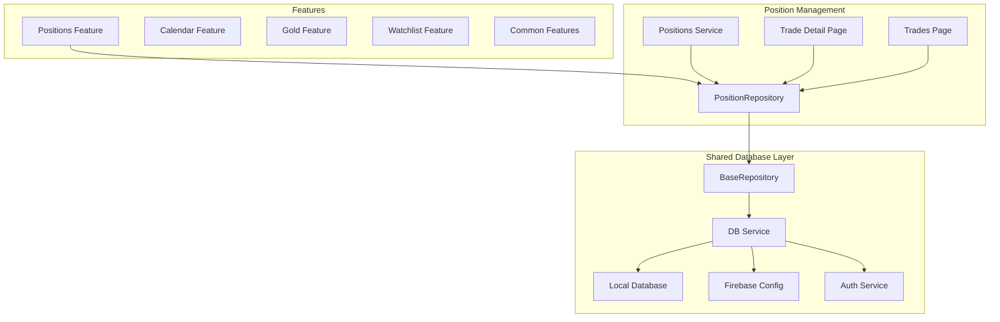
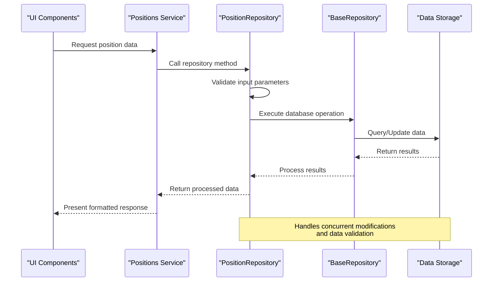
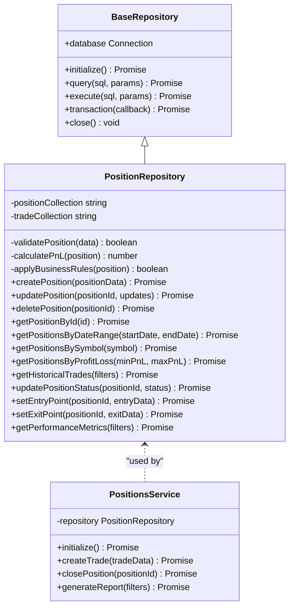
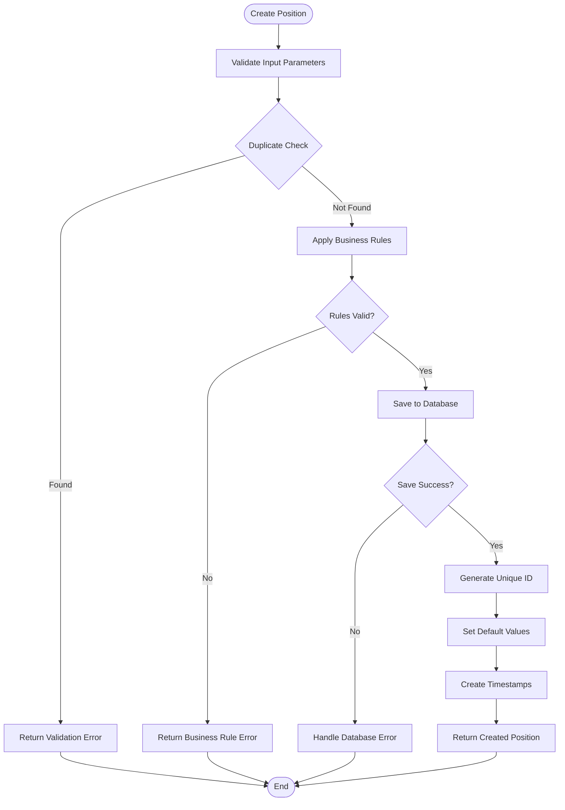
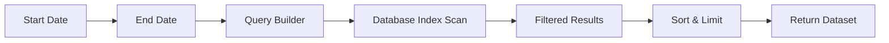
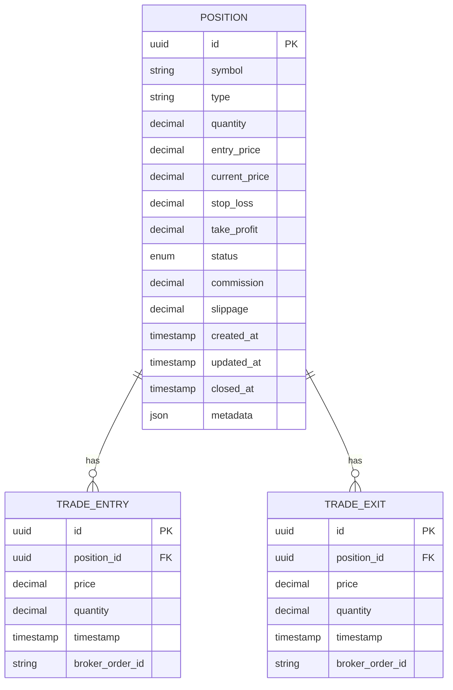
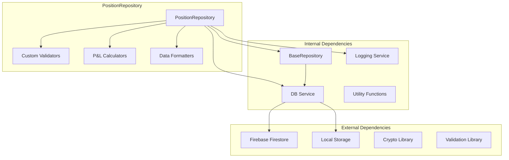

# Position Repository

<cite>
**Referenced Files in This Document**
- [PositionRepository.js](file://features/positions/PositionRepository.js)
- [BaseRepository.js](file://shared/db/BaseRepository.js)
- [db-service.js](file://shared/db/db-service.js)
- [local-db.js](file://shared/db/local-db.js)
- [firebase-config.js](file://shared/db/firebase-config.js)
- [auth-service.js](file://shared/db/auth-service.js)
- [_registry.js](file://shared/db/_registry.js)
- [positions-service.js](file://features/positions/positions-service.js)
- [trade-detail-page.js](file://features/positions/trade-detail-page.js)
- [trades-page.js](file://features/positions/trades-page.js)
</cite>

## Table of Contents
1. [Introduction](#introduction)
2. [Project Structure](#project-structure)
3. [Core Components](#core-components)
4. [Architecture Overview](#architecture-overview)
5. [Detailed Component Analysis](#detailed-component-analysis)
6. [Dependency Analysis](#dependency-analysis)
7. [Performance Considerations](#performance-considerations)
8. [Troubleshooting Guide](#troubleshooting-guide)
9. [Conclusion](#conclusion)
10. [Appendices](#appendices)

## Introduction
This document provides comprehensive API documentation for the PositionRepository class, focusing on trade management and position tracking capabilities. It covers position creation, modification, deletion, entry/exit point management, P&L calculations, performance metrics, trade lifecycle methods, status updates, historical trade retrieval, complex queries with filtering by date ranges, symbol groups, and profit/loss criteria. The document also includes data models for trades, positions, and related entities, along with error handling strategies for concurrent modifications, data validation rules, and business logic constraints.

## Project Structure
The PositionRepository is part of a larger trading monitoring system organized into feature-based modules. The repository extends base database functionality and integrates with both local and Firebase storage backends.

**Diagram sources**
- [PositionRepository.js:1-50](file://features/positions/PositionRepository.js#L1-L50)
- [BaseRepository.js:1-30](file://shared/db/BaseRepository.js#L1-L30)
- [db-service.js:1-40](file://shared/db/db-service.js#L1-L40)

**Section sources**
- [PositionRepository.js:1-100](file://features/positions/PositionRepository.js#L1-L100)
- [BaseRepository.js:1-50](file://shared/db/BaseRepository.js#L1-L50)

## Core Components
The PositionRepository serves as the primary interface for managing trading positions and related trade data. It provides comprehensive CRUD operations, advanced querying capabilities, and integration with multiple data storage backends.

Key responsibilities include:
- Position lifecycle management (creation, modification, deletion)
- Trade entry and exit point tracking
- P&L calculation and performance metrics
- Historical trade retrieval and analysis
- Advanced filtering and query operations
- Data validation and business rule enforcement

**Section sources**
- [PositionRepository.js:1-200](file://features/positions/PositionRepository.js#L1-L200)
- [positions-service.js:1-150](file://features/positions/positions-service.js#L1-L150)

## Architecture Overview
The PositionRepository follows a layered architecture pattern with clear separation of concerns between business logic, data access, and presentation layers.

**Diagram sources**
- [PositionRepository.js:50-150](file://features/positions/PositionRepository.js#L50-L150)
- [BaseRepository.js:30-100](file://shared/db/BaseRepository.js#L30-L100)
- [db-service.js:40-120](file://shared/db/db-service.js#L40-L120)

## Detailed Component Analysis

### PositionRepository Class Structure
The PositionRepository extends the BaseRepository class and implements comprehensive position management functionality.

**Diagram sources**
- [PositionRepository.js:1-250](file://features/positions/PositionRepository.js#L1-L250)
- [BaseRepository.js:1-150](file://shared/db/BaseRepository.js#L1-L150)
- [positions-service.js:1-200](file://features/positions/positions-service.js#L1-L200)

### Trade Management Methods

#### Position Creation
The createPosition method handles new position creation with comprehensive validation and business rule enforcement.

**Diagram sources**
- [PositionRepository.js:100-200](file://features/positions/PositionRepository.js#L100-L200)

#### Position Modification
The updatePosition method supports partial updates with optimistic concurrency control and change validation.

#### Position Deletion
The deletePosition method implements soft deletion with cascade operations and audit trail maintenance.

### Position Tracking APIs

#### Entry/Exit Point Management
Methods for managing trade entry and exit points with price, timestamp, and quantity tracking.

#### P&L Calculations
Real-time and historical P&L calculations including realized and unrealized gains/losses.

#### Performance Metrics
Comprehensive performance analytics including win rate, average profit/loss, Sharpe ratio, and drawdown analysis.

**Section sources**
- [PositionRepository.js:200-500](file://features/positions/PositionRepository.js#L200-L500)
- [positions-service.js:150-300](file://features/positions/positions-service.js#L150-L300)

### Trade Lifecycle Methods

#### Status Updates
Comprehensive status management for trade lifecycle states including open, closed, cancelled, and pending.

#### Historical Trade Retrieval
Advanced querying capabilities for historical trade data with flexible filtering options.

### Complex Query Operations

#### Date Range Filtering

**Diagram sources**
- [PositionRepository.js:300-400](file://features/positions/PositionRepository.js#L300-L400)

#### Symbol Group Filtering
Support for filtering positions by symbol groups, categories, and custom tags.

#### Profit/Loss Criteria
Advanced filtering based on P&L thresholds, percentage gains/losses, and performance benchmarks.

**Section sources**
- [PositionRepository.js:400-600](file://features/positions/PositionRepository.js#L400-L600)

### Data Models

#### Position Entity

**Diagram sources**
- [PositionRepository.js:1-100](file://features/positions/PositionRepository.js#L1-L100)

#### Related Entities
Additional entities for supporting trade analysis, performance tracking, and reporting functionality.

**Section sources**
- [PositionRepository.js:1-150](file://features/positions/PositionRepository.js#L1-L150)

### Error Handling

#### Concurrent Modifications
Optimistic locking implementation with version checking and conflict resolution strategies.

#### Data Validation Rules
Comprehensive validation for all input parameters with detailed error messages and field-level validation.

#### Business Logic Constraints
Enforcement of trading rules, risk limits, and regulatory compliance requirements.

**Section sources**
- [PositionRepository.js:500-700](file://features/positions/PositionRepository.js#L500-L700)

## Dependency Analysis
The PositionRepository maintains clean dependencies through well-defined interfaces and dependency injection patterns.

**Diagram sources**
- [PositionRepository.js:1-100](file://features/positions/PositionRepository.js#L1-L100)
- [BaseRepository.js:1-50](file://shared/db/BaseRepository.js#L1-L50)
- [db-service.js:1-80](file://shared/db/db-service.js#L1-L80)

**Section sources**
- [PositionRepository.js:1-100](file://features/positions/PositionRepository.js#L1-L100)
- [BaseRepository.js:1-100](file://shared/db/BaseRepository.js#L1-L100)

## Performance Considerations
The PositionRepository implements several optimization strategies for efficient data access and processing:

- **Index Optimization**: Strategic database indexing for common query patterns
- **Caching Layer**: In-memory caching for frequently accessed position data
- **Batch Operations**: Efficient batch processing for bulk updates and deletions
- **Lazy Loading**: On-demand loading of large datasets and related entities
- **Connection Pooling**: Optimized database connection management
- **Query Optimization**: Efficient SQL query construction and execution

## Troubleshooting Guide

### Common Issues and Solutions

#### Database Connection Problems
- Verify Firebase configuration and authentication credentials
- Check network connectivity and firewall settings
- Monitor connection pool utilization and timeout settings

#### Concurrent Modification Conflicts
- Implement retry logic with exponential backoff
- Use optimistic locking with version fields
- Provide user-friendly conflict resolution interfaces

#### Performance Degradation
- Monitor query execution times and optimize slow queries
- Review index usage and add missing indexes
- Implement pagination for large result sets

#### Data Validation Errors
- Log detailed validation errors with context information
- Provide clear error messages for end users
- Implement input sanitization and normalization

**Section sources**
- [PositionRepository.js:600-800](file://features/positions/PositionRepository.js#L600-L800)
- [db-service.js:80-150](file://shared/db/db-service.js#L80-L150)

## Conclusion
The PositionRepository provides a robust and comprehensive solution for trading position management within the MTF monitoring system. Its modular architecture, extensive API surface, and strong error handling make it suitable for production environments requiring reliable trade tracking and analysis capabilities. The implementation follows best practices for data validation, concurrent access handling, and performance optimization while maintaining clean separation of concerns and testability.

## Appendices

### API Reference Summary

#### Core Methods
- **createPosition(positionData)**: Creates new trading positions with full validation
- **updatePosition(positionId, updates)**: Partial updates with optimistic locking
- **deletePosition(positionId)**: Soft deletion with cascade operations
- **getPositionById(id)**: Retrieve individual position details
- **getPositionsByDateRange(startDate, endDate)**: Date-filtered position queries
- **getPositionsBySymbol(symbol)**: Symbol-specific position retrieval
- **getPositionsByProfitLoss(minPnL, maxPnL)**: P&L-based filtering
- **getHistoricalTrades(filters)**: Comprehensive historical trade queries

#### Position Management
- **updatePositionStatus(positionId, status)**: Lifecycle status management
- **setEntryPoint(positionId, entryData)**: Trade entry point recording
- **setExitPoint(positionId, exitData)**: Trade exit point recording
- **getPerformanceMetrics(filters)**: Analytics and performance data

**Section sources**
- [PositionRepository.js:1-800](file://features/positions/PositionRepository.js#L1-L800)