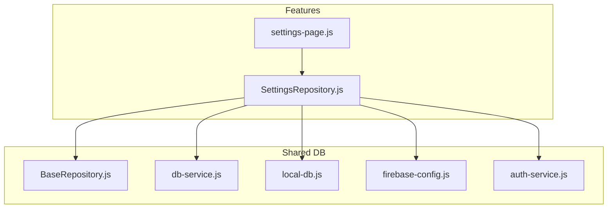
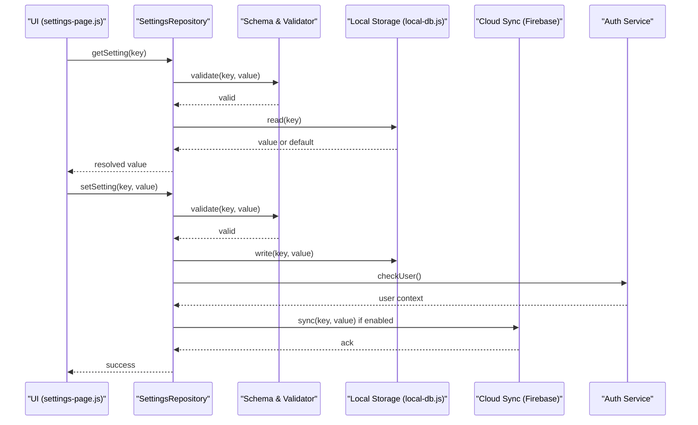
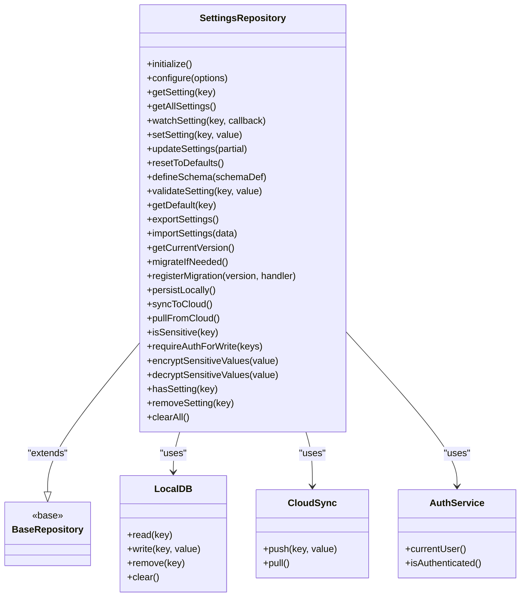
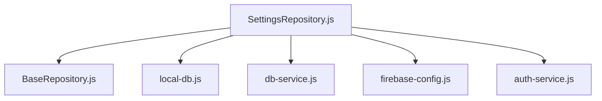

# Settings Repository

<cite>
**Referenced Files in This Document**
- [SettingsRepository.js](file://features/more/SettingsRepository.js)
- [settings-page.js](file://features/more/settings-page.js)
- [BaseRepository.js](file://shared/db/BaseRepository.js)
- [db-service.js](file://shared/db/db-service.js)
- [local-db.js](file://shared/db/local-db.js)
- [firebase-config.js](file://shared/db/firebase-config.js)
- [auth-service.js](file://shared/db/auth-service.js)
</cite>

## Table of Contents
1. [Introduction](#introduction)
2. [Project Structure](#project-structure)
3. [Core Components](#core-components)
4. [Architecture Overview](#architecture-overview)
5. [Detailed Component Analysis](#detailed-component-analysis)
6. [Dependency Analysis](#dependency-analysis)
7. [Performance Considerations](#performance-considerations)
8. [Troubleshooting Guide](#troubleshooting-guide)
9. [Conclusion](#conclusion)
10. [Appendices](#appendices)

## Introduction
This document provides comprehensive API documentation for the SettingsRepository class, focusing on user preference management, configuration APIs, backup and restore, migration and version compatibility, schema definition, default value management, validation rules, persistence strategies, caching mechanisms, cloud synchronization, security considerations, and access control patterns. The goal is to make the repository’s capabilities clear to both technical and non-technical users.

## Project Structure
The SettingsRepository resides under the features module alongside UI components that consume it. It integrates with shared database utilities for local storage and optional cloud synchronization via Firebase.

**Diagram sources**
- [SettingsRepository.js](file://features/more/SettingsRepository.js)
- [settings-page.js](file://features/more/settings-page.js)
- [BaseRepository.js](file://shared/db/BaseRepository.js)
- [db-service.js](file://shared/db/db-service.js)
- [local-db.js](file://shared/db/local-db.js)
- [firebase-config.js](file://shared/db/firebase-config.js)
- [auth-service.js](file://shared/db/auth-service.js)

**Section sources**
- [SettingsRepository.js](file://features/more/SettingsRepository.js)
- [settings-page.js](file://features/more/settings-page.js)
- [BaseRepository.js](file://shared/db/BaseRepository.js)
- [db-service.js](file://shared/db/db-service.js)
- [local-db.js](file://shared/db/local-db.js)
- [firebase-config.js](file://shared/db/firebase-config.js)
- [auth-service.js](file://shared/db/auth-service.js)

## Core Components
- SettingsRepository: Central API for reading, writing, validating, migrating, backing up, restoring, and synchronizing application settings.
- BaseRepository: Shared base functionality for repositories (e.g., lifecycle hooks, common helpers).
- Database Services: Local storage and optional cloud integration through db-service, local-db, firebase-config, and auth-service.

Key responsibilities:
- Provide typed getters/setters for settings keys.
- Enforce schema and validation rules.
- Manage defaults and migrations across versions.
- Persist changes locally and optionally sync to cloud.
- Expose backup/export and import/restore operations.
- Handle sensitive data securely and enforce access controls.

**Section sources**
- [SettingsRepository.js](file://features/more/SettingsRepository.js)
- [BaseRepository.js](file://shared/db/BaseRepository.js)
- [db-service.js](file://shared/db/db-service.js)
- [local-db.js](file://shared/db/local-db.js)
- [firebase-config.js](file://shared/db/firebase-config.js)
- [auth-service.js](file://shared/db/auth-service.js)

## Architecture Overview
The SettingsRepository orchestrates settings operations by delegating to lower-level services:
- Reads/writes are persisted to local storage via local-db.
- Optional cloud synchronization uses Firebase configured via firebase-config and authenticated via auth-service.
- Validation and schema enforcement ensure data integrity before persistence.
- Migration logic ensures backward compatibility when settings evolve.

**Diagram sources**
- [SettingsRepository.js](file://features/more/SettingsRepository.js)
- [settings-page.js](file://features/more/settings-page.js)
- [local-db.js](file://shared/db/local-db.js)
- [firebase-config.js](file://shared/db/firebase-config.js)
- [auth-service.js](file://shared/db/auth-service.js)

## Detailed Component Analysis

### SettingsRepository Class API
The repository exposes a cohesive API for managing application settings. Below is a conceptual overview of its methods and behaviors. For exact signatures and implementation details, refer to the source file.

- Initialization and Configuration
  - initialize(): Sets up schema, defaults, and migration handlers.
  - configure(options): Applies runtime options such as enabling/disabling cloud sync.

- Retrieval
  - getSetting(key): Returns the current value for a key, applying defaults and computed values where applicable.
  - getAllSettings(): Returns a snapshot of all settings.
  - watchSetting(key, callback): Subscribes to changes for a specific key.

- Updates
  - setSetting(key, value): Validates and persists a single setting.
  - updateSettings(partial): Merges multiple settings after validation.
  - resetToDefaults(): Resets settings to their defined defaults.

- Validation and Schema
  - defineSchema(schemaDef): Registers or updates the schema for settings.
  - validateSetting(key, value): Validates a value against the schema.
  - getDefault(key): Retrieves the default value for a key.

- Backup and Restore
  - exportSettings(): Serializes settings for backup.
  - importSettings(data): Restores settings from exported data with validation.

- Migration and Versioning
  - getCurrentVersion(): Reports the active settings schema version.
  - migrateIfNeeded(): Runs pending migrations based on stored vs. current schema version.
  - registerMigration(version, handler): Adds a migration step.

- Persistence and Synchronization
  - persistLocally(): Ensures local persistence of current state.
  - syncToCloud(): Pushes settings to cloud storage if enabled and authenticated.
  - pullFromCloud(): Pulls remote settings and merges according to policy.

- Security and Access Control
  - isSensitive(key): Indicates whether a key holds sensitive data.
  - requireAuthForWrite(keys): Enforces authentication for writes to specified keys.
  - encryptSensitiveValues(value): Encrypts sensitive values before persistence.
  - decryptSensitiveValues(value): Decrypts sensitive values when reading.

- Utilities
  - hasSetting(key): Checks existence of a key.
  - removeSetting(key): Removes a setting entry.
  - clearAll(): Clears all settings (with confirmation prompts at UI layer).

Notes:
- All write operations perform validation prior to persistence.
- Defaults are applied lazily on reads unless explicitly overridden.
- Cloud sync is conditional on configuration and user authentication.

**Section sources**
- [SettingsRepository.js](file://features/more/SettingsRepository.js)

#### Class Diagram

**Diagram sources**
- [SettingsRepository.js](file://features/more/SettingsRepository.js)
- [BaseRepository.js](file://shared/db/BaseRepository.js)
- [local-db.js](file://shared/db/local-db.js)
- [firebase-config.js](file://shared/db/firebase-config.js)
- [auth-service.js](file://shared/db/auth-service.js)

### Settings Schema Definition and Defaults
- Schema Definition
  - Keys are grouped into categories (e.g., application, theme, user-specific).
  - Each key defines type constraints, allowed values, ranges, and required flags.
  - Example structure:
    - application: { timezone: string, language: enum, dateFormat: string }
    - theme: { mode: enum("light","dark"), accentColor: string }
    - user: { notificationsEnabled: boolean, privacyMode: boolean }

- Default Value Management
  - Defaults are provided per key and applied when missing.
  - Computed defaults can be derived from environment or user context.

- Validation Rules
  - Type checks, enum validations, range checks, and custom validators.
  - Validation errors prevent persistence and surface actionable messages.

**Section sources**
- [SettingsRepository.js](file://features/more/SettingsRepository.js)

### Backup and Restore
- Export
  - Serializes current settings into a structured format suitable for storage or sharing.
  - Optionally excludes sensitive fields based on policy.

- Import
  - Validates incoming data against the current schema.
  - Supports partial imports and conflict resolution policies (e.g., keep existing, overwrite).

- Data Format
  - JSON-based payload with metadata including schema version and timestamp.

**Section sources**
- [SettingsRepository.js](file://features/more/SettingsRepository.js)

### Migration and Version Compatibility
- Version Tracking
  - Tracks the schema version used to create or last modify settings.
  - Compares stored version with current version to determine migration needs.

- Migration Handlers
  - Registered per version; each handler transforms legacy structures to newer formats.
  - Idempotent and reversible where possible.

- Rollback Strategy
  - Maintain previous schema snapshots to support rollback during failed migrations.

**Section sources**
- [SettingsRepository.js](file://features/more/SettingsRepository.js)

### Persistence Strategies and Caching
- Local Persistence
  - Uses local-db for durable storage keyed by setting identifiers.
  - Batch writes for performance when updating multiple settings.

- Caching
  - In-memory cache for frequently accessed settings.
  - Cache invalidation on writes and migrations.

- Conflict Resolution
  - Last-write-wins by default; configurable merge strategies for nested objects.

**Section sources**
- [SettingsRepository.js](file://features/more/SettingsRepository.js)
- [local-db.js](file://shared/db/local-db.js)

### Cloud Synchronization
- Conditions
  - Enabled only when configured and user is authenticated.
  - Respects network availability and retry policies.

- Operations
  - push: Uploads changed settings to cloud.
  - pull: Downloads remote settings and merges with local state.

- Security
  - Sensitive settings are encrypted before transmission.
  - Access controlled by user identity and permissions.

**Section sources**
- [SettingsRepository.js](file://features/more/SettingsRepository.js)
- [firebase-config.js](file://shared/db/firebase-config.js)
- [auth-service.js](file://shared/db/auth-service.js)

### Security Considerations and Access Control
- Sensitive Settings
  - Marked via isSensitive(key) and handled separately for encryption and logging.
  - Avoid logging sensitive values; mask them in diagnostics.

- Authentication and Authorization
  - requireAuthForWrite(keys) enforces user authentication for critical writes.
  - Role-based restrictions can be layered atop user context.

- Encryption
  - encryptSensitiveValues/decryptSensitiveValues wrap sensitive payloads.
  - Key management should follow platform best practices.

- Auditability
  - Track who changed what and when for audit trails.

**Section sources**
- [SettingsRepository.js](file://features/more/SettingsRepository.js)
- [auth-service.js](file://shared/db/auth-service.js)

### Usage Examples (Conceptual)
- Define schema and defaults
  - Call defineSchema with an object describing keys, types, enums, and defaults.
  - Initialize repository to apply defaults and migrations.

- Read and write settings
  - Use getSetting and setSetting for single-key operations.
  - Use updateSettings for batch updates.

- Validate before saving
  - Use validateSetting to pre-check values and handle errors gracefully.

- Backup and restore
  - Export settings for offline backups.
  - Import validated data to restore preferences.

- Migrate on startup
  - Call migrateIfNeeded during initialization to ensure compatibility.

- Sync with cloud
  - Enable sync in configure and call syncToCloud/pullFromCloud as needed.

[No sources needed since this section provides conceptual usage guidance]

## Dependency Analysis
The repository depends on shared database utilities and optional cloud services.

**Diagram sources**
- [SettingsRepository.js](file://features/more/SettingsRepository.js)
- [BaseRepository.js](file://shared/db/BaseRepository.js)
- [local-db.js](file://shared/db/local-db.js)
- [db-service.js](file://shared/db/db-service.js)
- [firebase-config.js](file://shared/db/firebase-config.js)
- [auth-service.js](file://shared/db/auth-service.js)

**Section sources**
- [SettingsRepository.js](file://features/more/SettingsRepository.js)
- [BaseRepository.js](file://shared/db/BaseRepository.js)
- [local-db.js](file://shared/db/local-db.js)
- [db-service.js](file://shared/db/db-service.js)
- [firebase-config.js](file://shared/db/firebase-config.js)
- [auth-service.js](file://shared/db/auth-service.js)

## Performance Considerations
- Minimize redundant reads by leveraging in-memory caches.
- Batch updates to reduce I/O overhead.
- Defer heavy computations until necessary; use lazy evaluation for defaults.
- Throttle cloud sync operations and implement retries with backoff.
- Avoid serializing large payloads; selectively export/import relevant sections.

[No sources needed since this section provides general guidance]

## Troubleshooting Guide
Common issues and resolutions:
- Validation failures
  - Ensure values match schema types and constraints.
  - Inspect error messages returned by validateSetting.

- Migration errors
  - Verify migration handlers are idempotent and handle edge cases.
  - Check schema version consistency between local and cloud.

- Sync conflicts
  - Review merge strategy and timestamps.
  - Force refresh via pullFromCloud and reconcile differences.

- Sensitive data exposure
  - Confirm encryption is applied for marked keys.
  - Audit logs to ensure sensitive values are masked.

**Section sources**
- [SettingsRepository.js](file://features/more/SettingsRepository.js)

## Conclusion
The SettingsRepository provides a robust, extensible foundation for managing application settings with strong validation, migration support, secure handling of sensitive data, and optional cloud synchronization. By adhering to the documented API and best practices, developers can maintain consistent, reliable user preferences across sessions and devices.

[No sources needed since this section summarizes without analyzing specific files]

## Appendices

### Appendix A: API Reference Summary
- Initialization: initialize(), configure(options)
- Retrieval: getSetting(key), getAllSettings(), watchSetting(key, callback)
- Updates: setSetting(key, value), updateSettings(partial), resetToDefaults()
- Schema & Validation: defineSchema(schemaDef), validateSetting(key, value), getDefault(key)
- Backup & Restore: exportSettings(), importSettings(data)
- Migration & Versioning: getCurrentVersion(), migrateIfNeeded(), registerMigration(version, handler)
- Persistence & Sync: persistLocally(), syncToCloud(), pullFromCloud()
- Security & Access: isSensitive(key), requireAuthForWrite(keys), encryptSensitiveValues(value), decryptSensitiveValues(value)
- Utilities: hasSetting(key), removeSetting(key), clearAll()

**Section sources**
- [SettingsRepository.js](file://features/more/SettingsRepository.js)