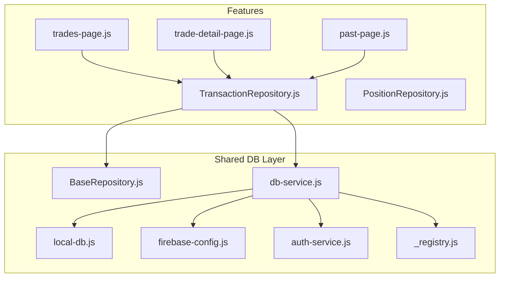
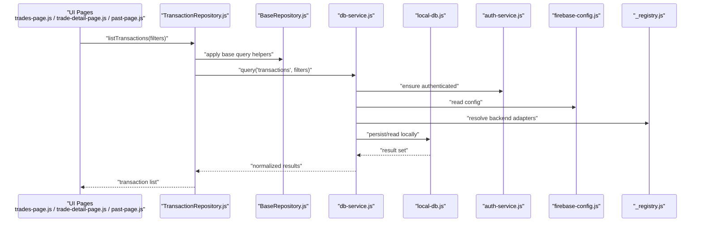
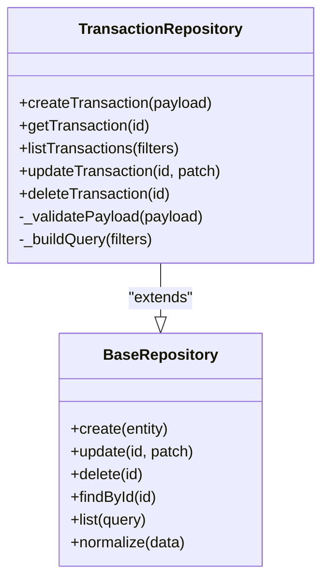
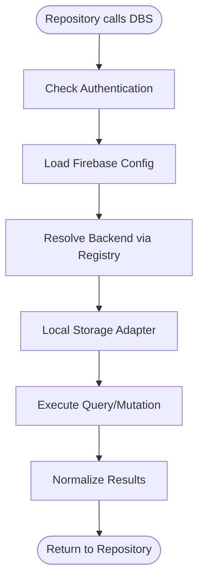
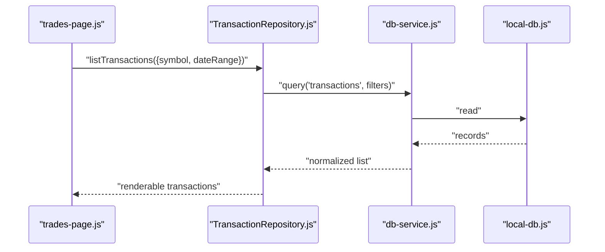
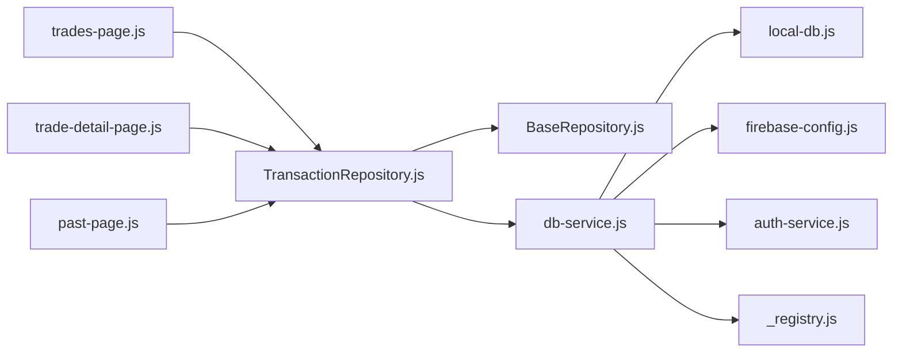

# Transaction Repository

<cite>
**Referenced Files in This Document**
- [TransactionRepository.js](file://features/positions/TransactionRepository.js)
- [PositionRepository.js](file://features/positions/PositionRepository.js)
- [BaseRepository.js](file://shared/db/BaseRepository.js)
- [db-service.js](file://shared/db/db-service.js)
- [local-db.js](file://shared/db/local-db.js)
- [firebase-config.js](file://shared/db/firebase-config.js)
- [auth-service.js](file://shared/db/auth-service.js)
- [_registry.js](file://shared/db/_registry.js)
- [trades-page.js](file://features/positions/trades-page.js)
- [trade-detail-page.js](file://features/positions/trade-detail-page.js)
- [past-page.js](file://features/positions/past-page.js)
</cite>

## Table of Contents
1. [Introduction](#introduction)
2. [Project Structure](#project-structure)
3. [Core Components](#core-components)
4. [Architecture Overview](#architecture-overview)
5. [Detailed Component Analysis](#detailed-component-analysis)
6. [Dependency Analysis](#dependency-analysis)
7. [Performance Considerations](#performance-considerations)
8. [Troubleshooting Guide](#troubleshooting-guide)
9. [Conclusion](#conclusion)

## Introduction
This document explains the Transaction Repository implementation and its role within the application’s data layer. It focuses on how transaction records are modeled, persisted, queried, and synchronized with local and remote storage backends. The goal is to provide both a high-level understanding and a code-level reference for developers working with trade history and related features.

## Project Structure
The Transaction Repository resides under the positions feature and builds upon shared database utilities. Key files include:
- Feature repository: TransactionRepository.js
- Related repositories and pages: PositionRepository.js, trades-page.js, trade-detail-page.js, past-page.js
- Shared database layer: BaseRepository.js, db-service.js, local-db.js, firebase-config.js, auth-service.js, _registry.js

**Diagram sources**
- [TransactionRepository.js](file://features/positions/TransactionRepository.js)
- [PositionRepository.js](file://features/positions/PositionRepository.js)
- [trades-page.js](file://features/positions/trades-page.js)
- [trade-detail-page.js](file://features/positions/trade-detail-page.js)
- [past-page.js](file://features/positions/past-page.js)
- [BaseRepository.js](file://shared/db/BaseRepository.js)
- [db-service.js](file://shared/db/db-service.js)
- [local-db.js](file://shared/db/local-db.js)
- [firebase-config.js](file://shared/db/firebase-config.js)
- [auth-service.js](file://shared/db/auth-service.js)
- [_registry.js](file://shared/db/_registry.js)

**Section sources**
- [TransactionRepository.js](file://features/positions/TransactionRepository.js)
- [BaseRepository.js](file://shared/db/BaseRepository.js)
- [db-service.js](file://shared/db/db-service.js)
- [local-db.js](file://shared/db/local-db.js)
- [firebase-config.js](file://shared/db/firebase-config.js)
- [auth-service.js](file://shared/db/auth-service.js)
- [_registry.js](file://shared/db/_registry.js)
- [trades-page.js](file://features/positions/trades-page.js)
- [trade-detail-page.js](file://features/positions/trade-detail-page.js)
- [past-page.js](file://features/positions/past-page.js)

## Core Components
- TransactionRepository: Encapsulates all operations related to transaction records (create, read, update, delete, list, filter). It typically extends a base repository class and delegates persistence to the shared database service.
- BaseRepository: Provides common repository behavior such as entity lifecycle methods, ID generation, and default query helpers.
- Database Service: Orchestrates access to local storage and remote services, handling configuration, authentication, and registry-based lookups.

Key responsibilities:
- Normalize and validate transaction payloads before persistence.
- Provide efficient queries for listing and filtering transactions by date, symbol, or status.
- Coordinate synchronization between local and remote stores when applicable.

**Section sources**
- [TransactionRepository.js](file://features/positions/TransactionRepository.js)
- [BaseRepository.js](file://shared/db/BaseRepository.js)
- [db-service.js](file://shared/db/db-service.js)

## Architecture Overview
The Transaction Repository integrates with the shared database layer to abstract storage details from UI components. Pages consume repository APIs to render trade lists and details without knowing where data originates.

**Diagram sources**
- [TransactionRepository.js](file://features/positions/TransactionRepository.js)
- [BaseRepository.js](file://shared/db/BaseRepository.js)
- [db-service.js](file://shared/db/db-service.js)
- [local-db.js](file://shared/db/local-db.js)
- [firebase-config.js](file://shared/db/firebase-config.js)
- [auth-service.js](file://shared/db/auth-service.js)
- [_registry.js](file://shared/db/_registry.js)
- [trades-page.js](file://features/positions/trades-page.js)
- [trade-detail-page.js](file://features/positions/trade-detail-page.js)
- [past-page.js](file://features/positions/past-page.js)

## Detailed Component Analysis

### TransactionRepository Class
Responsibilities:
- CRUD operations for transaction entities.
- Filtering and sorting helpers tailored to trade history use cases.
- Optional sync coordination with remote storage via the database service.

Typical interactions:
- Create: Validate payload, assign IDs/timestamps, persist via base repository.
- Read: Fetch by ID or list with filters; normalize results for UI consumption.
- Update/Delete: Apply changes and propagate to underlying store(s).

**Diagram sources**
- [TransactionRepository.js](file://features/positions/TransactionRepository.js)
- [BaseRepository.js](file://shared/db/BaseRepository.js)

**Section sources**
- [TransactionRepository.js](file://features/positions/TransactionRepository.js)
- [BaseRepository.js](file://shared/db/BaseRepository.js)

### Database Service Integration
The database service centralizes configuration, authentication, and backend resolution. It exposes consistent query/mutation interfaces used by repositories.

**Diagram sources**
- [db-service.js](file://shared/db/db-service.js)
- [auth-service.js](file://shared/db/auth-service.js)
- [firebase-config.js](file://shared/db/firebase-config.js)
- [_registry.js](file://shared/db/_registry.js)
- [local-db.js](file://shared/db/local-db.js)

**Section sources**
- [db-service.js](file://shared/db/db-service.js)
- [auth-service.js](file://shared/db/auth-service.js)
- [firebase-config.js](file://shared/db/firebase-config.js)
- [_registry.js](file://shared/db/_registry.js)
- [local-db.js](file://shared/db/local-db.js)

### UI Consumption Patterns
Pages that display trade history interact with the Transaction Repository through well-defined methods. Typical flows include:
- Listing recent transactions with optional filters (date range, symbol).
- Loading a specific transaction detail by ID.
- Triggering refresh or re-query after mutations.

**Diagram sources**
- [trades-page.js](file://features/positions/trades-page.js)
- [TransactionRepository.js](file://features/positions/TransactionRepository.js)
- [db-service.js](file://shared/db/db-service.js)
- [local-db.js](file://shared/db/local-db.js)

**Section sources**
- [trades-page.js](file://features/positions/trades-page.js)
- [trade-detail-page.js](file://features/positions/trade-detail-page.js)
- [past-page.js](file://features/positions/past-page.js)
- [TransactionRepository.js](file://features/positions/TransactionRepository.js)
- [db-service.js](file://shared/db/db-service.js)
- [local-db.js](file://shared/db/local-db.js)

## Dependency Analysis
The Transaction Repository depends on shared database utilities and is consumed by multiple UI pages. Its coupling is primarily to the BaseRepository interface and the database service abstraction, which promotes testability and backend flexibility.

**Diagram sources**
- [trades-page.js](file://features/positions/trades-page.js)
- [trade-detail-page.js](file://features/positions/trade-detail-page.js)
- [past-page.js](file://features/positions/past-page.js)
- [TransactionRepository.js](file://features/positions/TransactionRepository.js)
- [BaseRepository.js](file://shared/db/BaseRepository.js)
- [db-service.js](file://shared/db/db-service.js)
- [local-db.js](file://shared/db/local-db.js)
- [firebase-config.js](file://shared/db/firebase-config.js)
- [auth-service.js](file://shared/db/auth-service.js)
- [_registry.js](file://shared/db/_registry.js)

**Section sources**
- [TransactionRepository.js](file://features/positions/TransactionRepository.js)
- [BaseRepository.js](file://shared/db/BaseRepository.js)
- [db-service.js](file://shared/db/db-service.js)
- [local-db.js](file://shared/db/local-db.js)
- [firebase-config.js](file://shared/db/firebase-config.js)
- [auth-service.js](file://shared/db/auth-service.js)
- [_registry.js](file://shared/db/_registry.js)
- [trades-page.js](file://features/positions/trades-page.js)
- [trade-detail-page.js](file://features/positions/trade-detail-page.js)
- [past-page.js](file://features/positions/past-page.js)

## Performance Considerations
- Prefer filtered queries at the repository level to minimize data transfer and processing overhead.
- Cache frequently accessed transaction lists in memory when appropriate, invalidating on mutations.
- Batch updates where possible to reduce repeated writes.
- Ensure normalization logic is efficient and avoids unnecessary transformations.

[No sources needed since this section provides general guidance]

## Troubleshooting Guide
Common issues and checks:
- Authentication failures: Verify that the database service correctly initializes authentication before queries.
- Configuration errors: Confirm Firebase configuration is loaded and valid.
- Registry resolution: Ensure backend adapters are registered and resolvable.
- Data normalization: Inspect normalization steps if UI displays malformed or missing fields.
- Local storage limits: Monitor storage usage and consider pagination or pruning strategies.

**Section sources**
- [db-service.js](file://shared/db/db-service.js)
- [auth-service.js](file://shared/db/auth-service.js)
- [firebase-config.js](file://shared/db/firebase-config.js)
- [_registry.js](file://shared/db/_registry.js)
- [local-db.js](file://shared/db/local-db.js)

## Conclusion
The Transaction Repository provides a focused, reusable interface for managing trade-related records. By building on a shared database abstraction and base repository patterns, it enables consistent data access across UI components while keeping storage concerns encapsulated. Following the performance and troubleshooting recommendations will help maintain reliability and responsiveness as the dataset grows.