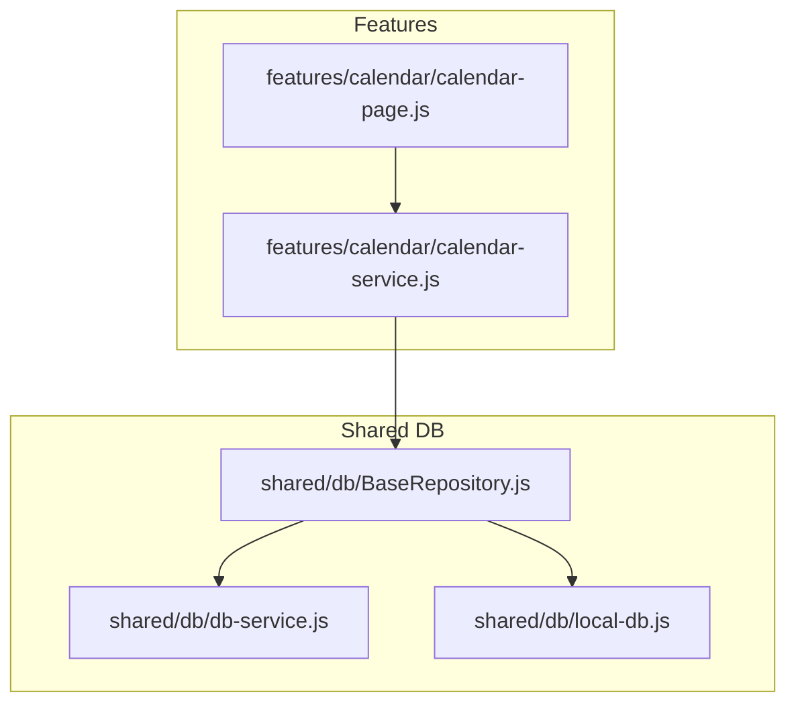
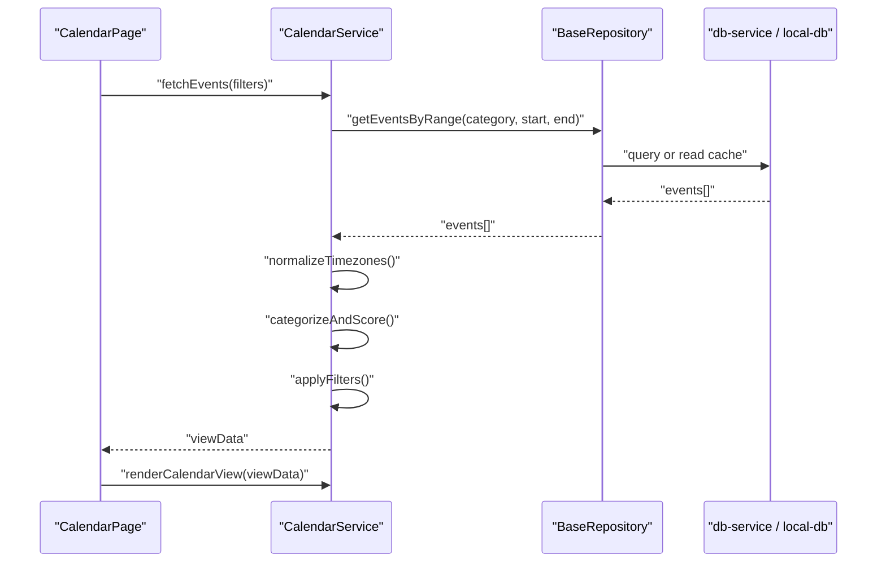
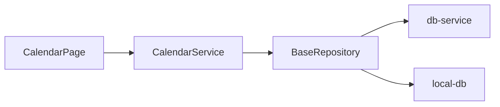

# Calendar Service API

<cite>
**Referenced Files in This Document**
- [calendar-service.js](file://features/calendar/calendar-service.js)
- [calendar-page.js](file://features/calendar/calendar-page.js)
- [BaseRepository.js](file://shared/db/BaseRepository.js)
- [db-service.js](file://shared/db/db-service.js)
- [local-db.js](file://shared/db/local-db.js)
</cite>

## Table of Contents
1. [Introduction](#introduction)
2. [Project Structure](#project-structure)
3. [Core Components](#core-components)
4. [Architecture Overview](#architecture-overview)
5. [Detailed Component Analysis](#detailed-component-analysis)
6. [Dependency Analysis](#dependency-analysis)
7. [Performance Considerations](#performance-considerations)
8. [Troubleshooting Guide](#troubleshooting-guide)
9. [Conclusion](#conclusion)

## Introduction
This document provides detailed API documentation for the Calendar Service layer responsible for economic event processing, market schedule management, and calendar data operations. It covers method signatures, business rules (event categorization, priority scoring, notification triggers), timezone handling, filtering by category and date range, event data transformation, calendar view generation, repository integration, error handling strategies, and caching mechanisms.

## Project Structure
The Calendar Service is implemented under the features/calendar module and integrates with shared database utilities. The key files are:
- Calendar service implementation
- Calendar page controller that consumes the service
- Shared database base repository and services used by the repository layer

**Diagram sources**
- [calendar-page.js](file://features/calendar/calendar-page.js)
- [calendar-service.js](file://features/calendar/calendar-service.js)
- [BaseRepository.js](file://shared/db/BaseRepository.js)
- [db-service.js](file://shared/db/db-service.js)
- [local-db.js](file://shared/db/local-db.js)

**Section sources**
- [calendar-service.js](file://features/calendar/calendar-service.js)
- [calendar-page.js](file://features/calendar/calendar-page.js)
- [BaseRepository.js](file://shared/db/BaseRepository.js)
- [db-service.js](file://shared/db/db-service.js)
- [local-db.js](file://shared/db/local-db.js)

## Core Components
- CalendarService: Orchestrates fetching, filtering, transforming, and caching of economic events; manages market sessions and timezone-aware scheduling; exposes methods to render calendar views.
- CalendarPage: UI controller that invokes CalendarService methods and updates the view based on user interactions.
- Repository Layer (BaseRepository + db-service + local-db): Provides persistence and retrieval of calendar data, including cached entries and remote synchronization when applicable.

Key responsibilities:
- Fetching economic events with optional filters (category, date range).
- Timezone normalization and session alignment.
- Event categorization and priority scoring.
- Notification trigger evaluation.
- Data transformation into a view-ready format.
- Caching strategy and cache invalidation.

**Section sources**
- [calendar-service.js](file://features/calendar/calendar-service.js)
- [calendar-page.js](file://features/calendar/calendar-page.js)
- [BaseRepository.js](file://shared/db/BaseRepository.js)
- [db-service.js](file://shared/db/db-service.js)
- [local-db.js](file://shared/db/local-db.js)

## Architecture Overview
The Calendar Service sits between the UI and the repository layer. It encapsulates business logic for event processing and presentation while delegating persistence to the repository.

**Diagram sources**
- [calendar-page.js](file://features/calendar/calendar-page.js)
- [calendar-service.js](file://features/calendar/calendar-service.js)
- [BaseRepository.js](file://shared/db/BaseRepository.js)
- [db-service.js](file://shared/db/db-service.js)
- [local-db.js](file://shared/db/local-db.js)

## Detailed Component Analysis

### CalendarService API
The following methods are exposed by the Calendar Service for economic event processing, market schedule management, and calendar data operations.

- fetchEconomicEvents(filters)
  - Purpose: Retrieve economic events filtered by category and date range, apply transformations, and return view-ready data.
  - Parameters:
    - filters.category: string | null — filter by event category (e.g., high-impact, low-impact).
    - filters.startDate: Date | string — inclusive start of range.
    - filters.endDate: Date | string — inclusive end of range.
    - filters.timezone: string — IANA timezone identifier for display and session alignment.
  - Returns: Promise<ViewEvent[]> — normalized, categorized, scored events ready for rendering.
  - Behavior:
    - Normalizes dates to UTC internally and converts to requested timezone for display.
    - Applies category filter if provided.
    - Enforces date range boundaries.
    - Computes priority scores and categories.
    - Triggers notifications for high-priority events within current session window.
    - Uses cache-first strategy; falls back to repository query on miss.

- getMarketSessions(timezone)
  - Purpose: Return market session definitions aligned to the specified timezone.
  - Parameters:
    - timezone: string — IANA timezone identifier.
  - Returns: Promise<Session[]> — list of sessions with start/end times and labels.
  - Behavior:
    - Loads session definitions from repository/cache.
    - Adjusts session boundaries to the given timezone.
    - Merges with live market status if available.

- updateMarketSchedule(sessions)
  - Purpose: Persist updated market sessions and invalidate related caches.
  - Parameters:
    - sessions: Session[] — new or modified session definitions.
  - Returns: Promise<void>
  - Behavior:
    - Validates session schema.
    - Persists via repository.
    - Invalidates event cache for affected ranges.

- transformToView(events, options)
  - Purpose: Transform raw event records into a view model suitable for rendering.
  - Parameters:
    - events: Event[] — raw events from repository.
    - options.timezone: string — target timezone for display.
    - options.groupBy: 'day' | 'hour' | 'none' — grouping strategy.
  - Returns: ViewModel — grouped and formatted structure for UI.

- renderCalendarView(viewModel)
  - Purpose: Generate final calendar view data consumed by the UI.
  - Parameters:
    - viewModel: ViewModel — output of transformToView.
  - Returns: CalendarView — structured view with sections, groups, and metadata.

Business Rules:
- Event Categorization:
  - Events are categorized based on impact level and source reliability.
  - Categories include high, medium, low impact; special cases for central bank announcements and holidays.
- Priority Scoring:
  - Score computed from impact weight, historical volatility influence, and recency factor.
  - Thresholds determine whether an event qualifies for notifications.
- Notification Triggers:
  - Triggered when an event’s score exceeds threshold and occurs within the next N minutes/hours relative to current time in the selected timezone.
  - Deduplication prevents repeated alerts for the same event within a cooldown window.

Error Handling:
- Network failures:
  - On repository query failure, returns cached data if available; otherwise returns empty dataset with error context.
- Data validation:
  - Rejects malformed events; logs warnings and excludes invalid items from results.
- Cache mechanisms:
  - Cache keys include category, date range, and timezone.
  - TTL-based expiration; invalidated on schedule updates or explicit refresh.

**Section sources**
- [calendar-service.js](file://features/calendar/calendar-service.js)

### CalendarPage Integration
The Calendar Page orchestrates user interactions and calls CalendarService methods to update the UI.

- loadEvents(filters)
  - Invokes CalendarService.fetchEconomicEvents and renders the result.
- selectTimezone(tz)
  - Updates timezone context and re-renders calendar with adjusted sessions and events.
- setCategoryFilter(category)
  - Applies category filter and refreshes the view.
- handleSessionChange(newSessions)
  - Calls CalendarService.updateMarketSchedule and refreshes dependent views.

**Section sources**
- [calendar-page.js](file://features/calendar/calendar-page.js)

### Repository Layer Integration
The repository layer abstracts persistence and caching details.

- BaseRepository
  - Provides common CRUD patterns and cache helpers used by CalendarService.
- db-service
  - Manages connection and orchestration for remote and local storage.
- local-db
  - Implements local storage operations and cache management.

Integration points:
- CalendarService delegates data retrieval to BaseRepository methods such as getEventsByRange and getMarketSessions.
- BaseRepository uses db-service and local-db to read/write data and manage cache entries.

**Section sources**
- [BaseRepository.js](file://shared/db/BaseRepository.js)
- [db-service.js](file://shared/db/db-service.js)
- [local-db.js](file://shared/db/local-db.js)

## Dependency Analysis
The Calendar Service depends on the repository layer for data access and on the UI controller for invocation. The repository layer depends on database services for persistence.

**Diagram sources**
- [calendar-page.js](file://features/calendar/calendar-page.js)
- [calendar-service.js](file://features/calendar/calendar-service.js)
- [BaseRepository.js](file://shared/db/BaseRepository.js)
- [db-service.js](file://shared/db/db-service.js)
- [local-db.js](file://shared/db/local-db.js)

**Section sources**
- [calendar-page.js](file://features/calendar/calendar-page.js)
- [calendar-service.js](file://features/calendar/calendar-service.js)
- [BaseRepository.js](file://shared/db/BaseRepository.js)
- [db-service.js](file://shared/db/db-service.js)
- [local-db.js](file://shared/db/local-db.js)

## Performance Considerations
- Cache-first reads reduce latency and network usage; ensure appropriate TTL and invalidation policies.
- Grouping and transformation should be performed lazily to avoid unnecessary work when filters change frequently.
- Batch updates for market schedules minimize cache churn.
- Timezone conversions should be memoized per day to avoid repeated computations.

[No sources needed since this section provides general guidance]

## Troubleshooting Guide
Common issues and resolutions:
- Empty results after filter changes:
  - Verify date range validity and timezone correctness.
  - Check cache key composition and TTL expiration.
- Stale market sessions:
  - Ensure updateMarketSchedule invalidates dependent caches.
- Notification not firing:
  - Confirm priority thresholds and cooldown settings.
  - Validate timezone alignment for “next N minutes” checks.
- Network errors:
  - Inspect repository error paths and fallback to cache behavior.
  - Log and surface error context to the UI for user feedback.

**Section sources**
- [calendar-service.js](file://features/calendar/calendar-service.js)
- [BaseRepository.js](file://shared/db/BaseRepository.js)
- [db-service.js](file://shared/db/db-service.js)
- [local-db.js](file://shared/db/local-db.js)

## Conclusion
The Calendar Service provides a robust API for managing economic events and market schedules with strong support for filtering, timezone handling, prioritization, and caching. Its clear separation from the repository layer ensures maintainability and testability, while the UI integration remains straightforward through well-defined methods.

[No sources needed since this section summarizes without analyzing specific files]