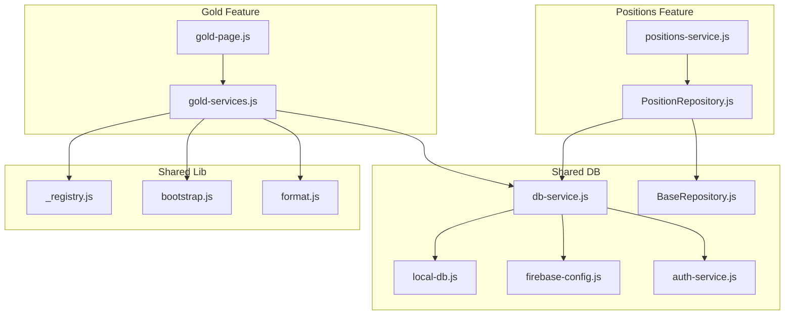
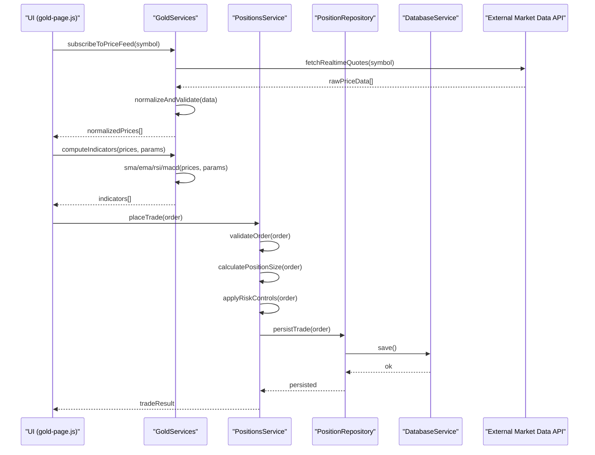
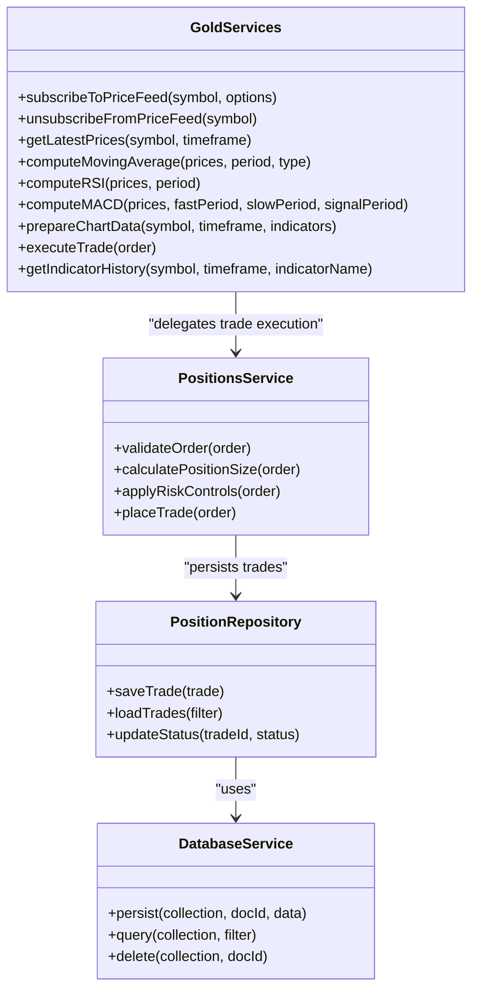
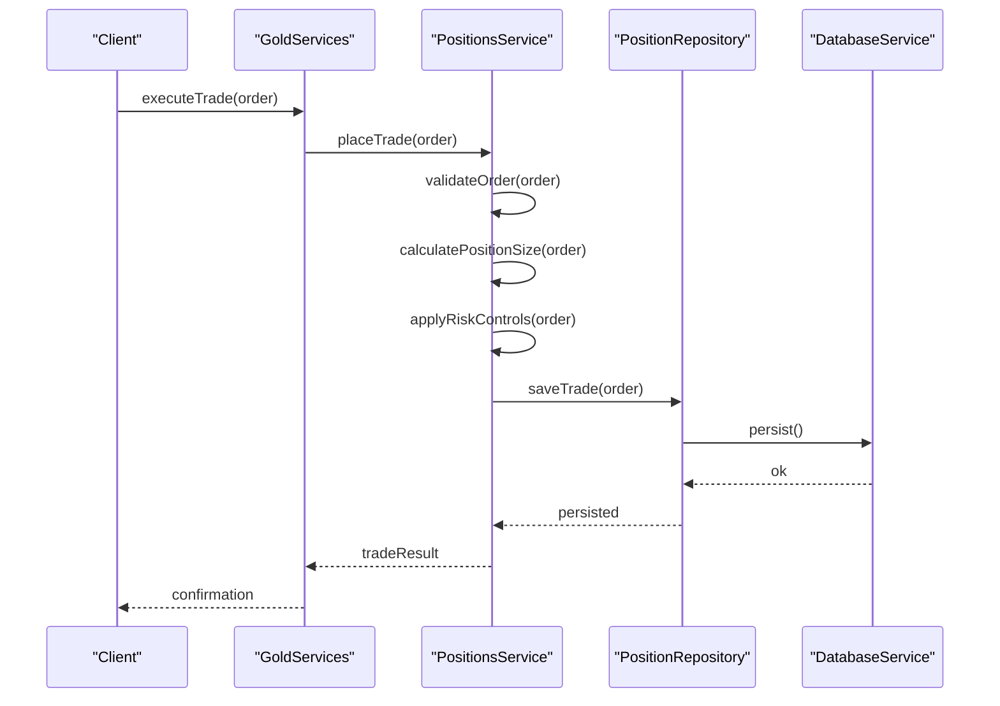
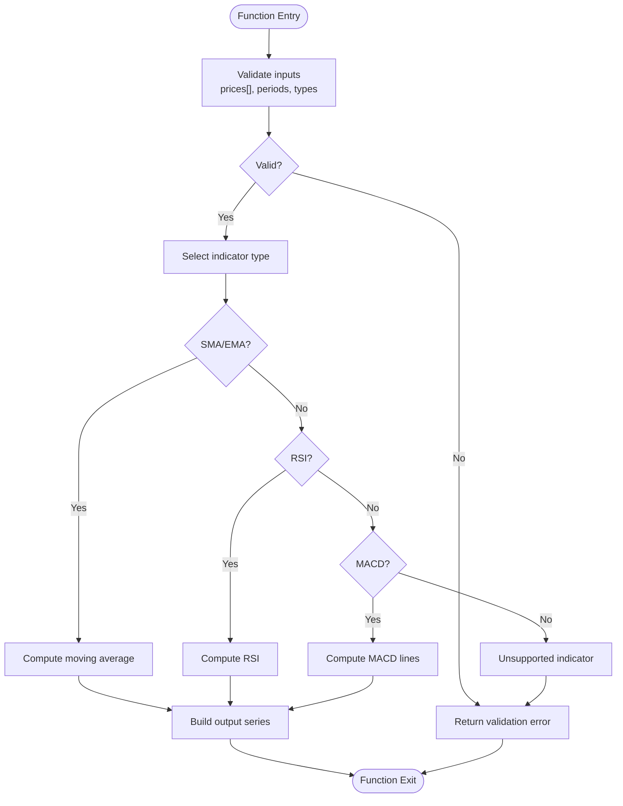
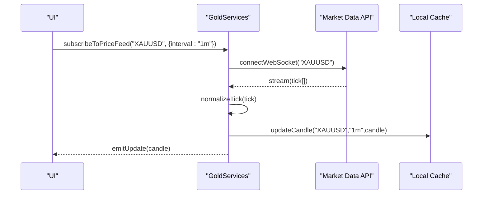
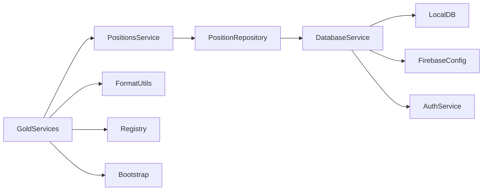

# Gold Trading Service API

<cite>
**Referenced Files in This Document**
- [gold-services.js](file://features/gold/gold-services.js)
- [gold-page.js](file://features/gold/gold-page.js)
- [positions-service.js](file://features/positions/positions-service.js)
- [PositionRepository.js](file://features/positions/PositionRepository.js)
- [db-service.js](file://shared/db/db-service.js)
- [BaseRepository.js](file://shared/db/BaseRepository.js)
- [local-db.js](file://shared/db/local-db.js)
- [firebase-config.js](file://shared/db/firebase-config.js)
- [auth-service.js](file://shared/db/auth-service.js)
- [_registry.js](file://shared/lib/_registry.js)
- [bootstrap.js](file://shared/lib/bootstrap.js)
- [format.js](file://shared/lib/format.js)
</cite>

## Table of Contents
1. [Introduction](#introduction)
2. [Project Structure](#project-structure)
3. [Core Components](#core-components)
4. [Architecture Overview](#architecture-overview)
5. [Detailed Component Analysis](#detailed-component-analysis)
6. [Dependency Analysis](#dependency-analysis)
7. [Performance Considerations](#performance-considerations)
8. [Troubleshooting Guide](#troubleshooting-guide)
9. [Conclusion](#conclusion)
10. [Appendices](#appendices)

## Introduction
This document provides detailed API documentation for the Gold Trading Service layer. It covers real-time price monitoring, technical analysis calculations (moving averages, RSI, MACD), and gold trading operations including position sizing, risk management, and performance metrics. It also documents integration with external market data APIs, error handling strategies, retry mechanisms, and examples for transforming price data and preparing chart-ready datasets.

The service is implemented as a JavaScript module that orchestrates:
- Price feed ingestion and normalization
- Technical indicator computations
- Trade execution workflows
- Persistence via local and cloud storage
- UI integration for charts and dashboards

## Project Structure
The Gold Trading Service resides under features/gold and integrates with shared database utilities and repository patterns used across the application.

**Diagram sources**
- [gold-page.js](file://features/gold/gold-page.js)
- [gold-services.js](file://features/gold/gold-services.js)
- [positions-service.js](file://features/positions/positions-service.js)
- [PositionRepository.js](file://features/positions/PositionRepository.js)
- [db-service.js](file://shared/db/db-service.js)
- [BaseRepository.js](file://shared/db/BaseRepository.js)
- [local-db.js](file://shared/db/local-db.js)
- [firebase-config.js](file://shared/db/firebase-config.js)
- [auth-service.js](file://shared/db/auth-service.js)
- [_registry.js](file://shared/lib/_registry.js)
- [bootstrap.js](file://shared/lib/bootstrap.js)
- [format.js](file://shared/lib/format.js)

**Section sources**
- [gold-services.js](file://features/gold/gold-services.js)
- [gold-page.js](file://features/gold/gold-page.js)
- [positions-service.js](file://features/positions/positions-service.js)
- [PositionRepository.js](file://features/positions/PositionRepository.js)
- [db-service.js](file://shared/db/db-service.js)
- [BaseRepository.js](file://shared/db/BaseRepository.js)
- [local-db.js](file://shared/db/local-db.js)
- [firebase-config.js](file://shared/db/firebase-config.js)
- [auth-service.js](file://shared/db/auth-service.js)
- [_registry.js](file://shared/lib/_registry.js)
- [bootstrap.js](file://shared/lib/bootstrap.js)
- [format.js](file://shared/lib/format.js)

## Core Components
- Gold Services: Provides methods for subscribing to price feeds, computing indicators, executing trades, and persisting results.
- Positions Service: Manages trade lifecycle, position sizing, risk checks, and performance metrics.
- Repositories and Database Layer: Encapsulate persistence logic using local storage and Firebase-backed services.
- Shared Utilities: Formatting helpers, registry, and bootstrap utilities used by services.

Key responsibilities:
- Real-time price monitoring and transformation
- Indicator calculations (SMA, EMA, RSI, MACD)
- Trade execution workflow with validation and retries
- Risk controls and position sizing rules
- Performance metrics computation and reporting

**Section sources**
- [gold-services.js](file://features/gold/gold-services.js)
- [positions-service.js](file://features/positions/positions-service.js)
- [PositionRepository.js](file://features/positions/PositionRepository.js)
- [db-service.js](file://shared/db/db-service.js)
- [BaseRepository.js](file://shared/db/BaseRepository.js)
- [local-db.js](file://shared/db/local-db.js)
- [firebase-config.js](file://shared/db/firebase-config.js)
- [auth-service.js](file://shared/db/auth-service.js)
- [format.js](file://shared/lib/format.js)
- [_registry.js](file://shared/lib/_registry.js)
- [bootstrap.js](file://shared/lib/bootstrap.js)

## Architecture Overview
The Gold Trading Service follows a layered architecture:
- Presentation Layer: UI components consume service APIs to render charts and dashboards.
- Service Layer: Orchestrates business logic, indicator calculations, and trade workflows.
- Repository Layer: Abstracts persistence operations.
- Data Access Layer: Local storage and Firebase integrations.

**Diagram sources**
- [gold-page.js](file://features/gold/gold-page.js)
- [gold-services.js](file://features/gold/gold-services.js)
- [positions-service.js](file://features/positions/positions-service.js)
- [PositionRepository.js](file://features/positions/PositionRepository.js)
- [db-service.js](file://shared/db/db-service.js)

## Detailed Component Analysis

### Gold Services API
Responsibilities:
- Subscribe to price feeds and handle streaming updates
- Normalize incoming price data and validate fields
- Compute technical indicators (SMA, EMA, RSI, MACD)
- Prepare chart-ready datasets
- Execute trades through positions service
- Persist computed results and trade logs

Primary methods:
- subscribeToPriceFeed(symbol, options)
- unsubscribeFromPriceFeed(symbol)
- getLatestPrices(symbol, timeframe)
- computeMovingAverage(prices, period, type)
- computeRSI(prices, period)
- computeMACD(prices, fastPeriod, slowPeriod, signalPeriod)
- prepareChartData(symbol, timeframe, indicators)
- executeTrade(order)
- getIndicatorHistory(symbol, timeframe, indicatorName)

Input/output specifications:
- Prices array: ordered timestamps with open/high/low/close/volume fields
- Timeframe: string enum (e.g., 1m, 5m, 15m, 1h, 4h, 1d)
- Indicators parameters: numeric periods and types (simple/exponential)
- Order object: symbol, side, quantity, stopLoss, takeProfit, orderType

Error handling:
- Connection failures: exponential backoff and retry policy
- Data validation: reject malformed records and log warnings
- Retry mechanisms: configurable max attempts and jitter

Examples:
- Transform raw ticks into OHLCV candles at selected timeframe
- Generate chart series for SMA(20), EMA(50), RSI(14), MACD(12,26,9)

**Section sources**
- [gold-services.js](file://features/gold/gold-services.js)
- [format.js](file://shared/lib/format.js)

#### Class Diagram: Gold Services

**Diagram sources**
- [gold-services.js](file://features/gold/gold-services.js)
- [positions-service.js](file://features/positions/positions-service.js)
- [PositionRepository.js](file://features/positions/PositionRepository.js)
- [db-service.js](file://shared/db/db-service.js)

### Positions Service API
Responsibilities:
- Validate orders against business rules
- Calculate position sizes based on account equity and risk tolerance
- Apply risk controls (stop-loss, take-profit, max drawdown)
- Manage trade lifecycle and state transitions
- Compute performance metrics (PnL, win rate, Sharpe ratio)

Primary methods:
- validateOrder(order)
- calculatePositionSize(order)
- applyRiskControls(order)
- placeTrade(order)
- closeTrade(tradeId, reason)
- getMetrics(accountId, timeframe)

Business rules:
- Position sizing: fixed fractional or volatility-adjusted sizing
- Risk limits: per-trade risk cap, daily loss limit, correlation exposure
- Stop-loss and take-profit enforcement before submission
- Slippage and spread buffers applied to exit levels

Performance metrics:
- Cumulative PnL, average win/loss, expectancy
- Drawdown metrics (max, current)
- Risk-adjusted returns (Sharpe, Sortino)

**Section sources**
- [positions-service.js](file://features/positions/positions-service.js)
- [PositionRepository.js](file://features/positions/PositionRepository.js)

#### Sequence Diagram: Trade Execution Workflow

**Diagram sources**
- [gold-services.js](file://features/gold/gold-services.js)
- [positions-service.js](file://features/positions/positions-service.js)
- [PositionRepository.js](file://features/positions/PositionRepository.js)
- [db-service.js](file://shared/db/db-service.js)

### Technical Analysis Calculations
Supported indicators:
- Simple Moving Average (SMA)
- Exponential Moving Average (EMA)
- Relative Strength Index (RSI)
- Moving Average Convergence Divergence (MACD)

Method signatures:
- computeMovingAverage(prices, period, type) -> series
- computeRSI(prices, period) -> series
- computeMACD(prices, fastPeriod, slowPeriod, signalPeriod) -> {macdLine, signalLine, histogram}

Complexity:
- SMA/EMA: O(n) time, O(k) space where k is window size
- RSI: O(n) time, O(k) space
- MACD: O(n) time, O(k) space

Optimization opportunities:
- Incremental updates for streaming prices
- Caching recent windows to avoid recomputation
- Vectorized operations if available in runtime environment

**Section sources**
- [gold-services.js](file://features/gold/gold-services.js)

#### Flowchart: Indicator Computation Pipeline

**Diagram sources**
- [gold-services.js](file://features/gold/gold-services.js)

### Price Feed Integration
Integration points:
- External market data APIs for real-time quotes and historical data
- WebSocket streams for live updates
- REST endpoints for batch retrieval and backtesting

Methods:
- subscribeToPriceFeed(symbol, options)
- unsubscribeFromPriceFeed(symbol)
- getLatestPrices(symbol, timeframe)
- getHistoricalPrices(symbol, from, to, resolution)

Data transformation:
- Normalize tick data to OHLCV candles
- Align timestamps to timezone-aware intervals
- Handle missing bars and duplicate entries

Chart data preparation:
- Aggregate indicators into chart-ready arrays
- Format labels and metadata for rendering

**Section sources**
- [gold-services.js](file://features/gold/gold-services.js)

#### Sequence Diagram: Price Subscription Flow

**Diagram sources**
- [gold-services.js](file://features/gold/gold-services.js)

### Error Handling and Retry Mechanisms
Strategies:
- Connection failures: exponential backoff with jitter
- Data validation errors: skip invalid records and continue processing
- Partial responses: merge partial data and request retransmission
- Circuit breaker: pause requests after repeated failures

Retry configuration:
- Max attempts
- Base delay and multiplier
- Jitter range
- Timeout thresholds

Validation rules:
- Required fields presence
- Numeric ranges and monotonicity checks
- Timestamp ordering and deduplication

**Section sources**
- [gold-services.js](file://features/gold/gold-services.js)

## Dependency Analysis
The Gold Trading Service depends on:
- Positions Service for trade execution and risk management
- Repositories for persistence
- Database Service for local and cloud storage
- Shared utilities for formatting and bootstrapping

**Diagram sources**
- [gold-services.js](file://features/gold/gold-services.js)
- [positions-service.js](file://features/positions/positions-service.js)
- [PositionRepository.js](file://features/positions/PositionRepository.js)
- [db-service.js](file://shared/db/db-service.js)
- [local-db.js](file://shared/db/local-db.js)
- [firebase-config.js](file://shared/db/firebase-config.js)
- [auth-service.js](file://shared/db/auth-service.js)
- [format.js](file://shared/lib/format.js)
- [_registry.js](file://shared/lib/_registry.js)
- [bootstrap.js](file://shared/lib/bootstrap.js)

**Section sources**
- [gold-services.js](file://features/gold/gold-services.js)
- [positions-service.js](file://features/positions/positions-service.js)
- [PositionRepository.js](file://features/positions/PositionRepository.js)
- [db-service.js](file://shared/db/db-service.js)
- [local-db.js](file://shared/db/local-db.js)
- [firebase-config.js](file://shared/db/firebase-config.js)
- [auth-service.js](file://shared/db/auth-service.js)
- [format.js](file://shared/lib/format.js)
- [_registry.js](file://shared/lib/_registry.js)
- [bootstrap.js](file://shared/lib/bootstrap.js)

## Performance Considerations
- Use incremental updates for indicators to minimize recomputation
- Cache recent price windows and indicator states
- Batch write operations to reduce I/O overhead
- Limit subscription scope to active symbols and timeframes
- Implement pagination for historical data retrieval
- Monitor memory usage for large datasets and prune old data

[No sources needed since this section provides general guidance]

## Troubleshooting Guide
Common issues:
- Connection failures: check network connectivity and API credentials; verify retry settings
- Data validation errors: inspect malformed records and adjust normalization rules
- Indicator divergence: confirm input data integrity and parameter ranges
- Trade execution failures: review risk control outputs and broker response codes

Debugging steps:
- Enable verbose logging for price feed events
- Inspect cached candles and indicator series
- Validate order objects against business rules
- Review persistence logs for successful writes

Recovery actions:
- Reconnect to market data streams with backoff
- Rebuild indicators from last valid snapshot
- Rollback failed trades and resubmit with adjusted parameters

**Section sources**
- [gold-services.js](file://features/gold/gold-services.js)
- [positions-service.js](file://features/positions/positions-service.js)

## Conclusion
The Gold Trading Service provides a robust API for real-time price monitoring, technical analysis, and trade execution. It integrates seamlessly with external market data providers, enforces strict business rules for risk management, and offers comprehensive error handling and retry mechanisms. The layered architecture ensures maintainability and scalability while supporting rich charting and dashboard experiences.

[No sources needed since this section summarizes without analyzing specific files]

## Appendices

### Method Signatures Reference
- Gold Services
  - subscribeToPriceFeed(symbol, options)
  - unsubscribeFromPriceFeed(symbol)
  - getLatestPrices(symbol, timeframe)
  - computeMovingAverage(prices, period, type)
  - computeRSI(prices, period)
  - computeMACD(prices, fastPeriod, slowPeriod, signalPeriod)
  - prepareChartData(symbol, timeframe, indicators)
  - executeTrade(order)
  - getIndicatorHistory(symbol, timeframe, indicatorName)
- Positions Service
  - validateOrder(order)
  - calculatePositionSize(order)
  - applyRiskControls(order)
  - placeTrade(order)
  - closeTrade(tradeId, reason)
  - getMetrics(accountId, timeframe)

**Section sources**
- [gold-services.js](file://features/gold/gold-services.js)
- [positions-service.js](file://features/positions/positions-service.js)