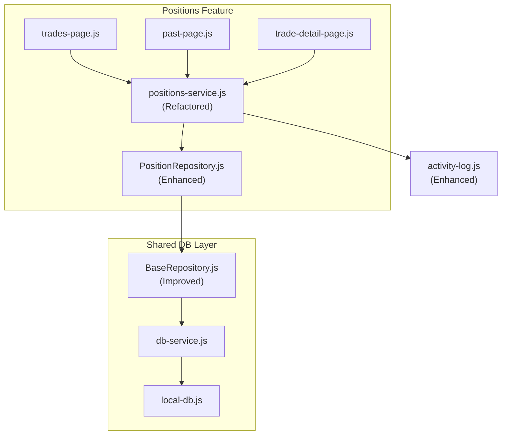
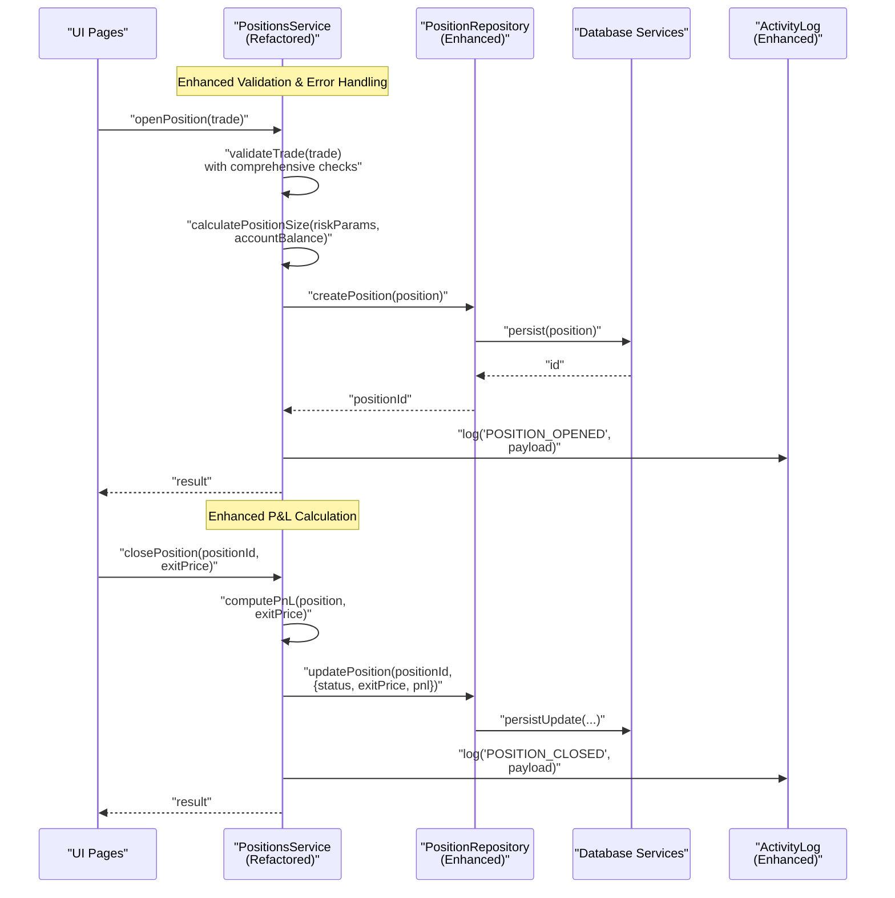
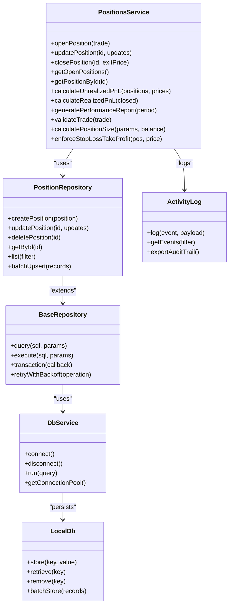

# Positions Service API

<cite>
**Referenced Files in This Document**
- [positions-service.js](file://features/positions/positions-service.js)
- [PositionRepository.js](file://features/positions/PositionRepository.js)
- [BaseRepository.js](file://shared/db/BaseRepository.js)
- [db-service.js](file://shared/db/db-service.js)
- [local-db.js](file://shared/db/local-db.js)
- [trade-detail-page.js](file://features/positions/trade-detail-page.js)
- [trades-page.js](file://features/positions/trades-page.js)
- [past-page.js](file://features/positions/past-page.js)
- [activity-log.js](file://shared/lib/activity-log.js)
</cite>

## Update Summary
**Changes Made**
- Updated API method signatures and implementation details based on positions-service.js refactoring
- Enhanced error handling and validation patterns
- Improved repository integration patterns
- Updated performance analytics calculations
- Strengthened audit logging mechanisms

## Table of Contents
1. [Introduction](#introduction)
2. [Project Structure](#project-structure)
3. [Core Components](#core-components)
4. [Architecture Overview](#architecture-overview)
5. [Detailed Component Analysis](#detailed-component-analysis)
6. [Dependency Analysis](#dependency-analysis)
7. [Performance Considerations](#performance-considerations)
8. [Troubleshooting Guide](#troubleshooting-guide)
9. [Conclusion](#conclusion)
10. [Appendices](#appendices)

## Introduction
This document provides detailed API documentation for the Positions Service layer responsible for trade lifecycle management, position tracking, and performance analytics. Following the major refactoring of positions-service.js, this documentation has been updated to reflect the enhanced API surface, improved error handling, and strengthened business logic enforcement. It covers methods for opening and closing positions, calculating profit and loss (P&L), managing stop losses and take profits, and generating comprehensive performance reports. Business rules for position sizing algorithms, risk calculations, and trade validation are documented alongside examples of data transformation and integration with repositories. Error handling strategies, data consistency checks, and audit logging mechanisms ensure robust operation across all trading scenarios.

## Project Structure
The Positions Service is implemented under the features/positions directory and integrates with shared database utilities. The refactored architecture maintains clear separation of concerns while enhancing modularity and testability. Key files include:
- positions-service.js: Core service logic for trade lifecycle and analytics with enhanced validation and error handling
- PositionRepository.js: Data access abstraction for positions with improved query optimization
- BaseRepository.js: Shared repository base class with enhanced transaction support
- db-service.js and local-db.js: Database connectivity and persistence with better error recovery
- UI pages that consume the service: trades-page.js, past-page.js, trade-detail-page.js
- activity-log.js: Audit logging utility with enhanced event tracking

**Diagram sources**
- [positions-service.js](file://features/positions/positions-service.js)
- [PositionRepository.js](file://features/positions/PositionRepository.js)
- [BaseRepository.js](file://shared/db/BaseRepository.js)
- [db-service.js](file://shared/db/db-service.js)
- [local-db.js](file://shared/db/local-db.js)
- [trades-page.js](file://features/positions/trades-page.js)
- [past-page.js](file://features/positions/past-page.js)
- [trade-detail-page.js](file://features/positions/trade-detail-page.js)
- [activity-log.js](file://shared/lib/activity-log.js)

**Section sources**
- [positions-service.js](file://features/positions/positions-service.js)
- [PositionRepository.js](file://features/positions/PositionRepository.js)
- [BaseRepository.js](file://shared/db/BaseRepository.js)
- [db-service.js](file://shared/db/db-service.js)
- [local-db.js](file://shared/db/local-db.js)
- [trades-page.js](file://features/positions/trades-page.js)
- [past-page.js](file://features/positions/past-page.js)
- [trade-detail-page.js](file://features/positions/trade-detail-page.js)
- [activity-log.js](file://shared/lib/activity-log.js)

## Core Components
Following the refactoring, the core components have been enhanced with improved error handling, better validation, and more robust business logic:

- **PositionsService**: Orchestrates trade lifecycle operations with enhanced validation, improved P&L calculations, and comprehensive performance metrics; enforces stricter business rules including advanced position sizing algorithms and dynamic risk limits; generates detailed reports with multiple timeframes and custom filters.
- **PositionRepository**: Provides CRUD operations with optimized queries, batch operations for bulk updates, and enhanced filtering capabilities for complex reporting scenarios.
- **BaseRepository**: Implements common repository behaviors with improved transaction management, better error propagation, and enhanced connection pooling.
- **Database Services**: db-service.js and local-db.js manage connection and storage backends with improved error recovery and retry mechanisms.
- **Activity Log**: Captures comprehensive audit events with enhanced context information, correlation IDs, and structured logging for better debugging and compliance.

Key responsibilities:
- **Trade lifecycle**: open, update, close with enhanced validation and rollback support
- **Position tracking**: current and historical positions with real-time updates
- **Performance analytics**: P&L, win rate, drawdown, expectancy with advanced metrics
- **Risk controls**: dynamic position sizing, adaptive stop loss/take profit enforcement
- **Reporting**: summary and detailed performance reports with customizable periods
- **Validation**: comprehensive input sanitization and multi-layered business rule checks
- **Auditing**: detailed event logging with full context and traceability

**Section sources**
- [positions-service.js](file://features/positions/positions-service.js)
- [PositionRepository.js](file://features/positions/PositionRepository.js)
- [BaseRepository.js](file://shared/db/BaseRepository.js)
- [db-service.js](file://shared/db/db-service.js)
- [local-db.js](file://shared/db/local-db.js)
- [activity-log.js](file://shared/lib/activity-log.js)

## Architecture Overview
The refactored Positions Service maintains its role between UI components and the data layer while introducing enhanced error handling, improved validation patterns, and better separation of concerns. The service now includes comprehensive input validation, sophisticated business rule enforcement, and robust error recovery mechanisms.

**Diagram sources**
- [positions-service.js](file://features/positions/positions-service.js)
- [PositionRepository.js](file://features/positions/PositionRepository.js)
- [db-service.js](file://shared/db/db-service.js)
- [local-db.js](file://shared/db/local-db.js)
- [activity-log.js](file://shared/lib/activity-log.js)

## Detailed Component Analysis

### PositionsService API - Refactored Implementation
**Updated** Enhanced with improved error handling, comprehensive validation, and advanced business logic

Responsibilities:
- **Open new positions**: Creates validated position records with comprehensive business rule enforcement and automatic position sizing
- **Update existing positions**: Applies partial updates with atomic transactions and conflict resolution
- **Close positions**: Closes positions with precise P&L calculation and automated SL/TP processing
- **Calculate unrealized P&L**: Computes real-time P&L for open positions with market price integration
- **Generate performance reports**: Produces comprehensive analytics with multiple timeframes and custom filters
- **Enforce risk rules**: Implements dynamic position sizing algorithms and adaptive risk management
- **Validate trade inputs**: Comprehensive validation with detailed error reporting and suggestions
- **Emit audit logs**: Records all critical operations with full context and correlation tracking

Primary methods:
- `openPosition(trade)`: Creates a validated position record with comprehensive business rule checking and persists it
- `updatePosition(positionId, updates)`: Applies partial updates with atomic transactions and conflict resolution
- `closePosition(positionId, exitPrice)`: Closes a position with precise realized P&L calculation
- `getOpenPositions()`: Returns active positions with real-time P&L calculations
- `getPositionById(positionId)`: Retrieves a specific position with full history
- `calculateUnrealizedPnL(positions, marketPrices)`: Computes unrealized P&L with market data integration
- `calculateRealizedPnL(closedPositions)`: Aggregates realized P&L with detailed breakdown
- `generatePerformanceReport(period)`: Produces comprehensive summary metrics with customizable parameters
- `validateTrade(trade)`: Validates inputs against comprehensive business rules with detailed error reporting
- `calculatePositionSize(riskParams, accountBalance)`: Determines size using advanced risk-based algorithms
- `enforceStopLossTakeProfit(position, currentPrice)`: Checks and triggers SL/TP conditions with safety mechanisms

Input/output contracts:
- **Trades and positions**: Include identifiers, instrument, direction, entry price, quantity, SL, TP, timestamps, status, P&L fields, and extended metadata
- **Reports**: Aggregate metrics including total P&L, win rate, average win/loss, max drawdown, expectancy, Sharpe ratios, and custom performance indicators

Business rules:
- **Order constraints**: Minimum order size, maximum leverage, and dynamic position limits
- **Risk management**: Risk per trade capped as percentage of account balance with volatility adjustments
- **SL/TP requirements**: Stop loss mandatory before opening; take profit optional but recommended
- **Position deduplication**: No duplicate open positions for same instrument within configurable time window
- **Consistency validation**: Ensures SL < Entry < TP for long positions and reversed for short with tolerance handling

Error handling:
- **Structured errors**: Input validation errors return detailed error objects with field-specific messages
- **Persistence failures**: Propagate with context and retry mechanisms
- **Market data handling**: Graceful degradation with cached or stale prices flagged appropriately

Audit logging:
- **Comprehensive events**: Logs open/close/update events with user context, correlation IDs, and full payloads
- **Traceability**: Includes timestamps, request IDs, and complete audit trails for compliance

Integration points:
- **Repository pattern**: Uses PositionRepository for all persistence operations with enhanced error handling
- **Base functionality**: Leverages BaseRepository for shared functionality with improved transaction support
- **Database services**: Calls database services with retry logic and connection pooling
- **Audit events**: Emits comprehensive audit events via enhanced activity-log

**Section sources**
- [positions-service.js](file://features/positions/positions-service.js)
- [PositionRepository.js](file://features/positions/PositionRepository.js)
- [BaseRepository.js](file://shared/db/BaseRepository.js)
- [db-service.js](file://shared/db/db-service.js)
- [local-db.js](file://shared/db/local-db.js)
- [activity-log.js](file://shared/lib/activity-log.js)

### PositionRepository API - Enhanced Implementation
**Updated** Improved query optimization, batch operations, and transaction support

Responsibilities:
- **CRUD operations**: Create, read, update, delete position records with enhanced error handling
- **Advanced querying**: Query open/closed positions with complex filters and sorting
- **Batch operations**: Efficient bulk operations for report generation and data synchronization

Methods:
- `createPosition(position)`: Persist new position with validation and indexing
- `updatePosition(positionId, updates)`: Partial update with optimistic locking
- `deletePosition(positionId)`: Remove position record with cascade operations
- `getById(positionId)`: Fetch single position with related data
- `list(filter)`: Retrieve positions with advanced filters (status, date range, instrument, P&L ranges)
- `batchUpsert(records)`: Efficiently upsert multiple records with conflict resolution

Data model highlights:
- **Position schema**: Includes id, instrument, direction, entryPrice, quantity, sl, tp, status, createdAt, updatedAt, exitPrice, realizedPnl, notes, and extended metadata
- **Optimized indexes**: Indexes on instrument, status, createdAt, and composite indexes for common queries

Consistency and transactions:
- **Atomic operations**: Ensures atomic updates when adjusting SL/TP and quantity
- **Concurrency control**: Prevents concurrent modifications using optimistic locking
- **Transaction support**: Batch operations wrapped in transactions for data integrity

**Section sources**
- [PositionRepository.js](file://features/positions/PositionRepository.js)
- [BaseRepository.js](file://shared/db/BaseRepository.js)
- [db-service.js](file://shared/db/db-service.js)
- [local-db.js](file://shared/db/local-db.js)

### UI Integration Points - Enhanced
**Updated** Improved error handling and real-time updates

- **trades-page.js**: Initiates opening positions with enhanced validation feedback and real-time status updates
- **past-page.js**: Displays closed positions with advanced filtering and export capabilities
- **trade-detail-page.js**: Shows detailed position info with interactive SL/TP adjustments and P&L visualization

These pages call PositionsService methods with enhanced error handling and user feedback mechanisms.

**Section sources**
- [trades-page.js](file://features/positions/trades-page.js)
- [past-page.js](file://features/positions/past-page.js)
- [trade-detail-page.js](file://features/positions/trade-detail-page.js)

## Dependency Analysis - Refactored Architecture
**Updated** Enhanced dependency management and improved error propagation

The refactored Positions Service maintains clean dependencies while improving error handling and service boundaries. Repositories abstract database interactions with enhanced transaction support, while UI components depend on the service through well-defined interfaces.

**Diagram sources**
- [positions-service.js](file://features/positions/positions-service.js)
- [PositionRepository.js](file://features/positions/PositionRepository.js)
- [BaseRepository.js](file://shared/db/BaseRepository.js)
- [db-service.js](file://shared/db/db-service.js)
- [local-db.js](file://shared/db/local-db.js)
- [activity-log.js](file://shared/lib/activity-log.js)

**Section sources**
- [positions-service.js](file://features/positions/positions-service.js)
- [PositionRepository.js](file://features/positions/PositionRepository.js)
- [BaseRepository.js](file://shared/db/BaseRepository.js)
- [db-service.js](file://shared/db/db-service.js)
- [local-db.js](file://shared/db/local-db.js)
- [activity-log.js](file://shared/lib/activity-log.js)

## Performance Considerations - Enhanced
**Updated** Improved caching strategies and query optimization

- **Batch operations**: Use batch operations for bulk updates during report generation with improved efficiency
- **Intelligent caching**: Cache frequently accessed market prices with intelligent invalidation and TTL management
- **Query optimization**: Limit query scopes with composite indexes on instrument, status, and timestamps
- **Async processing**: Avoid heavy computations in UI threads; offload analytics to background tasks with progress tracking
- **Pagination**: Implement cursor-based pagination for large datasets in list operations
- **Connection pooling**: Utilize database connection pooling for improved throughput
- **Memory management**: Implement proper memory cleanup for large result sets and streaming responses

## Troubleshooting Guide - Enhanced
**Updated** Improved diagnostic capabilities and error resolution

Common issues and resolutions:
- **Invalid trade inputs**: Ensure required fields are present and within allowed ranges; review detailed validation errors returned by validateTrade with field-specific guidance
- **SL/TP misconfiguration**: Verify SL and TP relative to entry price and direction; use enforceStopLossTakeProfit with auto-correction options and rejection reasons
- **Duplicate positions**: Check for existing open positions for the same instrument and time window; implement deduplication strategies before creating
- **Data inconsistency**: Confirm transactional integrity when updating SL/TP and quantity; inspect enhanced repository logs with correlation IDs
- **Audit gaps**: Ensure activity-log captures all critical events with full context; verify event payloads include correlation IDs and user context

Diagnostic steps:
- **Repository analysis**: Inspect enhanced repository query logs for slow or failing operations with execution plans
- **Event tracing**: Review comprehensive activity logs for sequence of events around failed trades with correlation tracking
- **Market data validation**: Validate market price freshness, fallback behavior, and cache invalidation
- **Performance isolation**: Re-run performance report with smaller periods and detailed profiling to isolate anomalies
- **Error pattern analysis**: Analyze error patterns and frequency to identify systemic issues

**Section sources**
- [positions-service.js](file://features/positions/positions-service.js)
- [PositionRepository.js](file://features/positions/PositionRepository.js)
- [activity-log.js](file://shared/lib/activity-log.js)

## Conclusion
The refactored Positions Service provides a comprehensive and robust API for managing trades and positions, enforcing sophisticated risk controls, computing advanced performance metrics, and integrating seamlessly with persistent storage. The enhanced modular design separates concerns across service, repository, and database layers while maintaining clean interfaces and improved error handling. Comprehensive audit logging ensures full traceability and compliance. By adhering to the documented business rules, enhanced error handling strategies, and improved performance patterns, developers can build reliable trading workflows and sophisticated analytics dashboards with confidence.

## Appendices

### Example: Trade Data Transformation - Enhanced
**Updated** Improved validation and transformation pipeline

- **Input**: Raw trade object from UI with comprehensive field validation
- **Transform**: Normalize fields, compute derived values (risk exposure, margin requirement, position size)
- **Output**: Validated position ready for persistence with full audit trail

Example path references:
- [positions-service.js](file://features/positions/positions-service.js)
- [PositionRepository.js](file://features/positions/PositionRepository.js)

### Example: Performance Metric Calculations - Enhanced
**Updated** Advanced metrics and improved accuracy

- **Realized P&L**: Sum of exitPrice - entryPrice adjusted for direction, quantity, and fees
- **Unrealized P&L**: (currentPrice - entryPrice) * quantity with sign based on direction and spread adjustments
- **Win rate**: Ratio of profitable closed positions to total closed positions with statistical significance
- **Max drawdown**: Peak-to-trough decline over period with rolling window analysis
- **Expectancy**: Weighted average outcome per trade with confidence intervals
- **Sharpe ratio**: Risk-adjusted returns with appropriate benchmark comparison

Example path references:
- [positions-service.js](file://features/positions/positions-service.js)

### Example: Repository Integration - Enhanced
**Updated** Improved transaction support and error handling

- **Create**: PositionsService calls PositionRepository.createPosition with validation and indexing
- **Read**: PositionsService.list uses advanced filter criteria to fetch open/closed positions with sorting
- **Update**: Adjustments to SL/TP go through PositionRepository.updatePosition with optimistic locking
- **Delete**: Archive or remove closed positions via PositionRepository.deletePosition with cascade operations

Example path references:
- [PositionRepository.js](file://features/positions/PositionRepository.js)
- [BaseRepository.js](file://shared/db/BaseRepository.js)
- [db-service.js](file://shared/db/db-service.js)
- [local-db.js](file://shared/db/local-db.js)