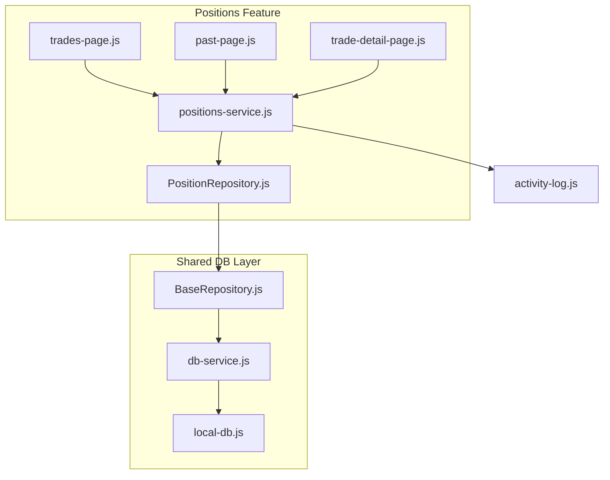
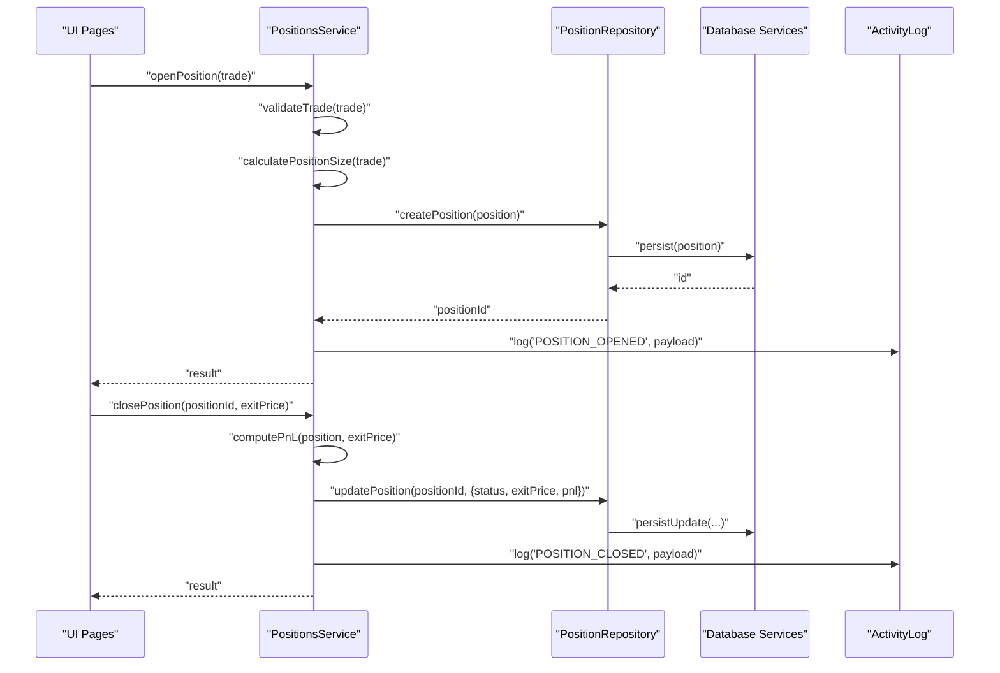
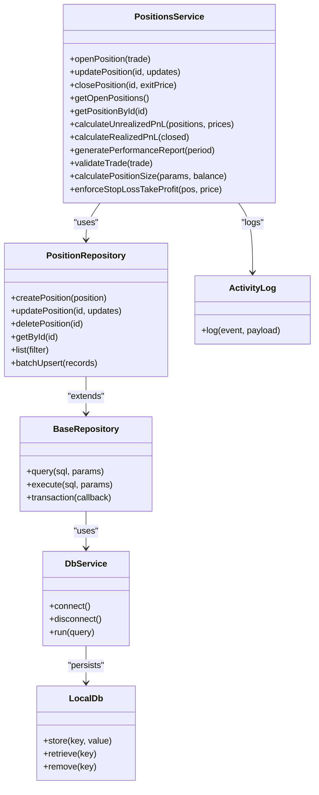

# Positions Service API

<cite>
**Referenced Files in This Document**
- [positions-service.js](file://features/positions/positions-service.js)
- [PositionRepository.js](file://features/positions/PositionRepository.js)
- [BaseRepository.js](file://shared/db/BaseRepository.js)
- [db-service.js](file://shared/db/db-service.js)
- [local-db.js](file://shared/db/local-db.js)
- [trade-detail-page.js](file://features/positions/trade-detail-page.js)
- [trades-page.js](file://features/positions/trades-page.js)
- [past-page.js](file://features/positions/past-page.js)
- [activity-log.js](file://shared/lib/activity-log.js)
</cite>

## Table of Contents
1. [Introduction](#introduction)
2. [Project Structure](#project-structure)
3. [Core Components](#core-components)
4. [Architecture Overview](#architecture-overview)
5. [Detailed Component Analysis](#detailed-component-analysis)
6. [Dependency Analysis](#dependency-analysis)
7. [Performance Considerations](#performance-considerations)
8. [Troubleshooting Guide](#troubleshooting-guide)
9. [Conclusion](#conclusion)
10. [Appendices](#appendices)

## Introduction
This document provides detailed API documentation for the Positions Service layer responsible for trade lifecycle management, position tracking, and performance analytics. It covers methods for opening and closing positions, calculating profit and loss (P&L), managing stop losses and take profits, and generating performance reports. Business rules for position sizing algorithms, risk calculations, and trade validation are documented alongside examples of data transformation and integration with repositories. Error handling strategies, data consistency checks, and audit logging mechanisms are also included to ensure robust operation.

## Project Structure
The Positions Service is implemented under the features/positions directory and integrates with shared database utilities. The key files include:
- positions-service.js: Core service logic for trade lifecycle and analytics
- PositionRepository.js: Data access abstraction for positions
- BaseRepository.js: Shared repository base class
- db-service.js and local-db.js: Database connectivity and persistence
- UI pages that consume the service: trades-page.js, past-page.js, trade-detail-page.js
- activity-log.js: Audit logging utility

**Diagram sources**
- [positions-service.js](file://features/positions/positions-service.js)
- [PositionRepository.js](file://features/positions/PositionRepository.js)
- [BaseRepository.js](file://shared/db/BaseRepository.js)
- [db-service.js](file://shared/db/db-service.js)
- [local-db.js](file://shared/db/local-db.js)
- [trades-page.js](file://features/positions/trades-page.js)
- [past-page.js](file://features/positions/past-page.js)
- [trade-detail-page.js](file://features/positions/trade-detail-page.js)
- [activity-log.js](file://shared/lib/activity-log.js)

**Section sources**
- [positions-service.js](file://features/positions/positions-service.js)
- [PositionRepository.js](file://features/positions/PositionRepository.js)
- [BaseRepository.js](file://shared/db/BaseRepository.js)
- [db-service.js](file://shared/db/db-service.js)
- [local-db.js](file://shared/db/local-db.js)
- [trades-page.js](file://features/positions/trades-page.js)
- [past-page.js](file://features/positions/past-page.js)
- [trade-detail-page.js](file://features/positions/trade-detail-page.js)
- [activity-log.js](file://shared/lib/activity-log.js)

## Core Components
- PositionsService: Orchestrates trade lifecycle operations including opening, updating, and closing positions; computes P&L and performance metrics; enforces business rules such as position sizing and risk limits; and generates reports.
- PositionRepository: Provides CRUD operations for positions and related trade records, abstracting persistence details.
- BaseRepository: Implements common repository behaviors and helpers used by PositionRepository.
- Database Services: db-service.js and local-db.js manage connection and storage backends.
- Activity Log: Captures audit events for critical actions like trade creation and closure.

Key responsibilities:
- Trade lifecycle: open, update, close
- Position tracking: current and historical positions
- Performance analytics: P&L, win rate, drawdown, expectancy
- Risk controls: position sizing, stop loss/take profit enforcement
- Reporting: summary and detailed performance reports
- Validation: input sanitization and business rule checks
- Auditing: log significant state changes

**Section sources**
- [positions-service.js](file://features/positions/positions-service.js)
- [PositionRepository.js](file://features/positions/PositionRepository.js)
- [BaseRepository.js](file://shared/db/BaseRepository.js)
- [db-service.js](file://shared/db/db-service.js)
- [local-db.js](file://shared/db/local-db.js)
- [activity-log.js](file://shared/lib/activity-log.js)

## Architecture Overview
The Positions Service sits between UI components and the data layer. It validates inputs, applies business rules, performs calculations, persists state via repositories, and logs audit events. Repositories abstract database interactions, enabling consistent data access patterns.

**Diagram sources**
- [positions-service.js](file://features/positions/positions-service.js)
- [PositionRepository.js](file://features/positions/PositionRepository.js)
- [db-service.js](file://shared/db/db-service.js)
- [local-db.js](file://shared/db/local-db.js)
- [activity-log.js](file://shared/lib/activity-log.js)

## Detailed Component Analysis

### PositionsService API
Responsibilities:
- Open a new position after validation and sizing
- Update existing positions (e.g., partial closes, SL/TP adjustments)
- Close positions and compute realized P&L
- Calculate unrealized P&L for open positions
- Generate performance reports (summary and detailed)
- Enforce risk rules and position sizing algorithms
- Validate trade inputs and maintain data consistency
- Emit audit logs for critical operations

Primary methods:
- openPosition(trade): Creates a validated position record and persists it
- updatePosition(positionId, updates): Applies partial updates (SL/TP, quantity)
- closePosition(positionId, exitPrice): Closes a position and calculates realized P&L
- getOpenPositions(): Returns active positions
- getPositionById(positionId): Retrieves a specific position
- calculateUnrealizedPnL(positions, marketPrices): Computes unrealized P&L
- calculateRealizedPnL(closedPositions): Aggregates realized P&L
- generatePerformanceReport(period): Produces summary metrics over a period
- validateTrade(trade): Validates inputs against business rules
- calculatePositionSize(riskParams, accountBalance): Determines size based on risk parameters
- enforceStopLossTakeProfit(position, currentPrice): Checks and triggers SL/TP conditions

Input/output contracts:
- Trades and positions include identifiers, instrument, direction, entry price, quantity, SL, TP, timestamps, status, and P&L fields
- Reports aggregate metrics such as total P&L, win rate, average win/loss, max drawdown, expectancy, and Sharpe-like ratios where applicable

Business rules:
- Minimum order size and maximum leverage constraints
- Risk per trade capped as a percentage of account balance
- Stop loss must be set before opening a position
- Take profit optional but recommended
- No duplicate open positions for the same instrument within a time window
- Consistency checks ensure SL < Entry < TP for long positions and reversed for short

Error handling:
- Input validation errors return structured error objects
- Persistence failures propagate with context
- Market data unavailability handled gracefully with cached or stale prices flagged

Audit logging:
- Logs open/close/update events with user context and relevant payloads
- Includes timestamps and correlation IDs for traceability

Integration points:
- Uses PositionRepository for all persistence operations
- Leverages BaseRepository for shared functionality
- Calls database services for backend storage
- Emits audit events via activity-log

**Section sources**
- [positions-service.js](file://features/positions/positions-service.js)
- [PositionRepository.js](file://features/positions/PositionRepository.js)
- [BaseRepository.js](file://shared/db/BaseRepository.js)
- [db-service.js](file://shared/db/db-service.js)
- [local-db.js](file://shared/db/local-db.js)
- [activity-log.js](file://shared/lib/activity-log.js)

### PositionRepository API
Responsibilities:
- Create, read, update, delete position records
- Query open/closed positions and filtered lists
- Batch operations for report generation

Methods:
- createPosition(position): Persist new position
- updatePosition(positionId, updates): Partial update
- deletePosition(positionId): Remove position record
- getById(positionId): Fetch single position
- list(filter): Retrieve positions with filters (status, date range, instrument)
- batchUpsert(records): Efficiently upsert multiple records

Data model highlights:
- Position includes id, instrument, direction, entryPrice, quantity, sl, tp, status, createdAt, updatedAt, exitPrice, realizedPnl, notes
- Indexes on instrument, status, createdAt for efficient queries

Consistency and transactions:
- Ensures atomic updates when adjusting SL/TP and quantity
- Prevents concurrent modifications using optimistic locking if supported

**Section sources**
- [PositionRepository.js](file://features/positions/PositionRepository.js)
- [BaseRepository.js](file://shared/db/BaseRepository.js)
- [db-service.js](file://shared/db/db-service.js)
- [local-db.js](file://shared/db/local-db.js)

### UI Integration Points
- trades-page.js: Initiates opening positions and displays real-time updates
- past-page.js: Displays closed positions and historical performance
- trade-detail-page.js: Shows detailed position info and allows SL/TP adjustments

These pages call PositionsService methods and render results accordingly.

**Section sources**
- [trades-page.js](file://features/positions/trades-page.js)
- [past-page.js](file://features/positions/past-page.js)
- [trade-detail-page.js](file://features/positions/trade-detail-page.js)

## Dependency Analysis
The Positions Service depends on repositories and database services, while UI components depend on the service. Audit logging is a cross-cutting concern.

**Diagram sources**
- [positions-service.js](file://features/positions/positions-service.js)
- [PositionRepository.js](file://features/positions/PositionRepository.js)
- [BaseRepository.js](file://shared/db/BaseRepository.js)
- [db-service.js](file://shared/db/db-service.js)
- [local-db.js](file://shared/db/local-db.js)
- [activity-log.js](file://shared/lib/activity-log.js)

**Section sources**
- [positions-service.js](file://features/positions/positions-service.js)
- [PositionRepository.js](file://features/positions/PositionRepository.js)
- [BaseRepository.js](file://shared/db/BaseRepository.js)
- [db-service.js](file://shared/db/db-service.js)
- [local-db.js](file://shared/db/local-db.js)
- [activity-log.js](file://shared/lib/activity-log.js)

## Performance Considerations
- Use batch operations for bulk updates during report generation
- Cache frequently accessed market prices and invalidate on updates
- Limit query scopes with indexes on instrument, status, and timestamps
- Avoid heavy computations in UI threads; offload analytics to background tasks
- Implement pagination for large datasets in list operations

[No sources needed since this section provides general guidance]

## Troubleshooting Guide
Common issues and resolutions:
- Invalid trade inputs: Ensure required fields are present and within allowed ranges; review validation errors returned by validateTrade
- SL/TP misconfiguration: Verify SL and TP relative to entry price and direction; use enforceStopLossTakeProfit to auto-correct or reject
- Duplicate positions: Check for existing open positions for the same instrument and time window; deduplicate before creating
- Data inconsistency: Confirm transactional integrity when updating SL/TP and quantity; inspect repository logs
- Audit gaps: Ensure activity-log captures all critical events; verify event payloads include correlation IDs

Diagnostic steps:
- Inspect repository query logs for slow or failing operations
- Review activity logs for sequence of events around failed trades
- Validate market price freshness and fallback behavior
- Re-run performance report with smaller periods to isolate anomalies

**Section sources**
- [positions-service.js](file://features/positions/positions-service.js)
- [PositionRepository.js](file://features/positions/PositionRepository.js)
- [activity-log.js](file://shared/lib/activity-log.js)

## Conclusion
The Positions Service provides a comprehensive API for managing trades and positions, enforcing risk controls, computing performance metrics, and integrating with persistent storage. Its modular design separates concerns across service, repository, and database layers, while audit logging ensures traceability. By adhering to the documented business rules and error handling strategies, developers can build reliable trading workflows and analytics dashboards.

[No sources needed since this section summarizes without analyzing specific files]

## Appendices

### Example: Trade Data Transformation
- Input: raw trade object from UI
- Transform: normalize fields, compute derived values (risk exposure, margin requirement)
- Output: validated position ready for persistence

Example path references:
- [positions-service.js](file://features/positions/positions-service.js)
- [PositionRepository.js](file://features/positions/PositionRepository.js)

### Example: Performance Metric Calculations
- Realized P&L: sum of exitPrice - entryPrice adjusted for direction and quantity
- Unrealized P&L: (currentPrice - entryPrice) * quantity with sign based on direction
- Win rate: ratio of profitable closed positions to total closed positions
- Max drawdown: peak-to-trough decline over a period
- Expectancy: weighted average outcome per trade

Example path references:
- [positions-service.js](file://features/positions/positions-service.js)

### Example: Repository Integration
- Create: PositionsService calls PositionRepository.createPosition
- Read: PositionsService.list uses filter criteria to fetch open/closed positions
- Update: Adjustments to SL/TP go through PositionRepository.updatePosition
- Delete: Archive or remove closed positions via PositionRepository.deletePosition

Example path references:
- [PositionRepository.js](file://features/positions/PositionRepository.js)
- [BaseRepository.js](file://shared/db/BaseRepository.js)
- [db-service.js](file://shared/db/db-service.js)
- [local-db.js](file://shared/db/local-db.js)