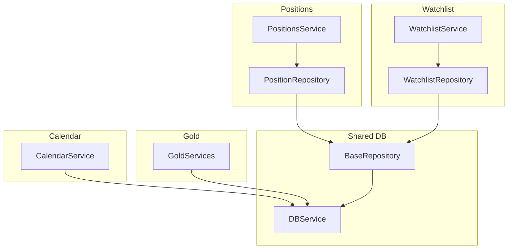
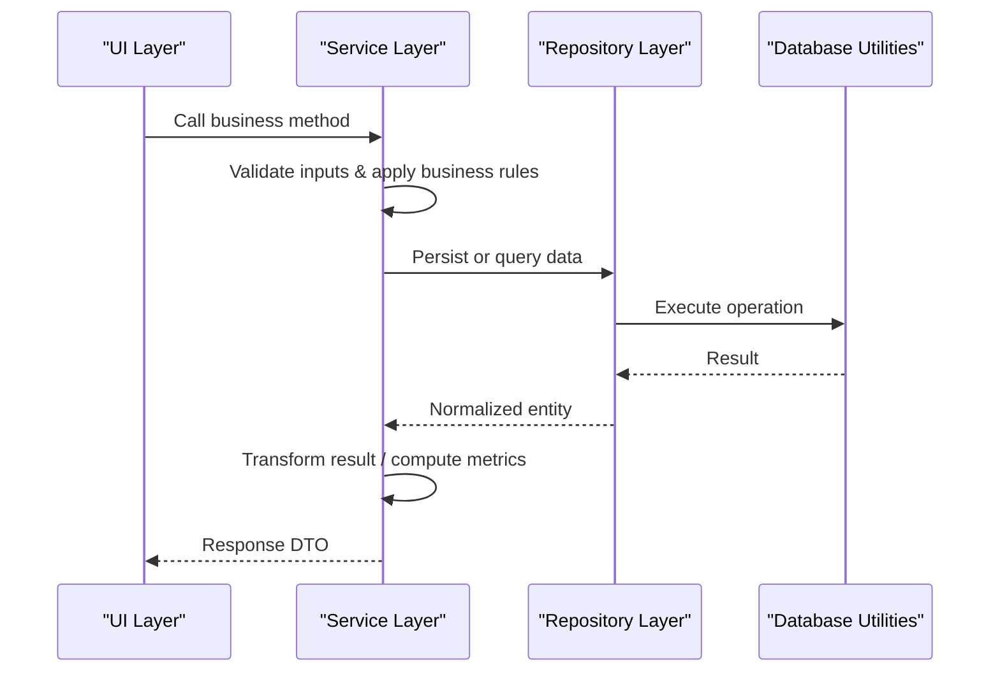
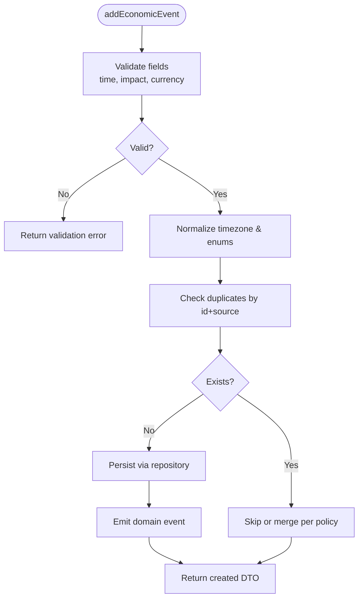
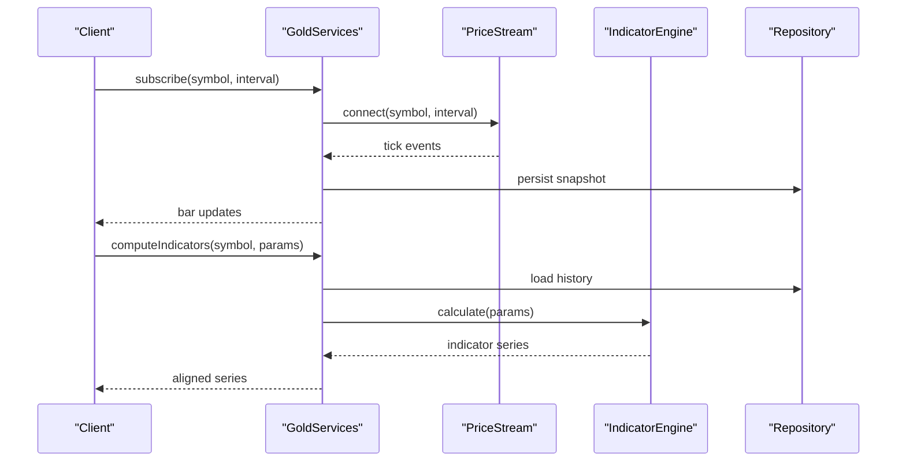
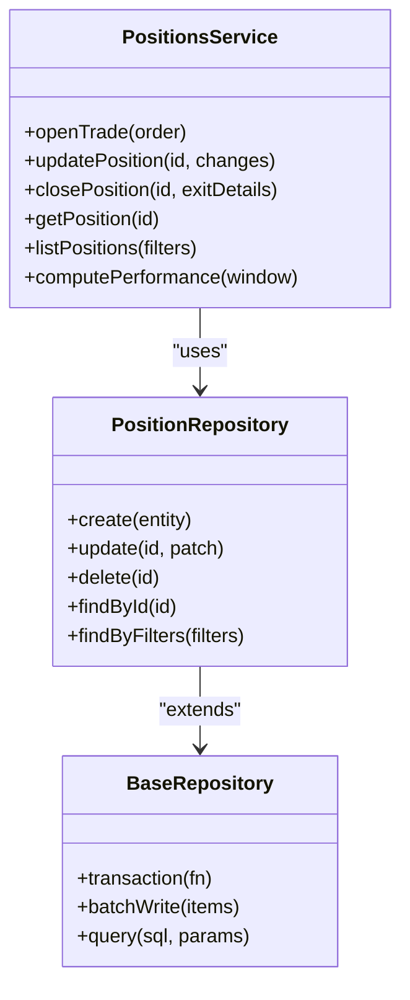
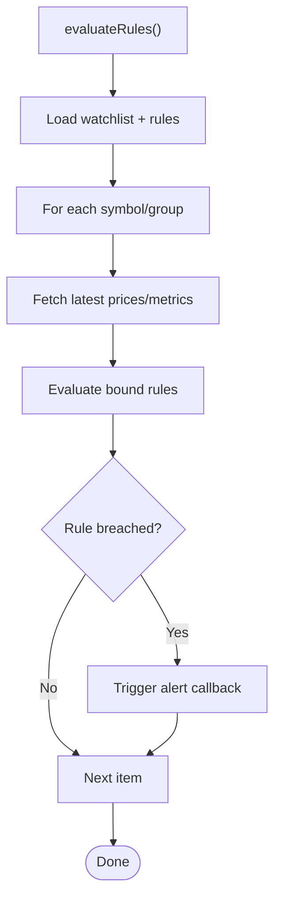
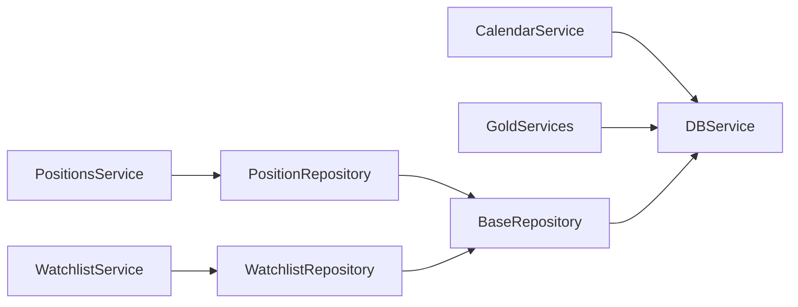

# Service Layer API

<cite>
**Referenced Files in This Document**
- [calendar-service.js](file://features/calendar/calendar-service.js)
- [gold-services.js](file://features/gold/gold-services.js)
- [positions-service.js](file://features/positions/positions-service.js)
- [watchlist-service.js](file://features/watchlist/watchlist-service.js)
- [PositionRepository.js](file://features/positions/PositionRepository.js)
- [WatchlistRepository.js](file://features/watchlist/WatchlistRepository.js)
- [BaseRepository.js](file://shared/db/BaseRepository.js)
- [db-service.js](file://shared/db/db-service.js)
</cite>

## Table of Contents
1. [Introduction](#introduction)
2. [Project Structure](#project-structure)
3. [Core Components](#core-components)
4. [Architecture Overview](#architecture-overview)
5. [Detailed Component Analysis](#detailed-component-analysis)
6. [Dependency Analysis](#dependency-analysis)
7. [Performance Considerations](#performance-considerations)
8. [Troubleshooting Guide](#troubleshooting-guide)
9. [Conclusion](#conclusion)

## Introduction
This document provides detailed API documentation for the service layer interfaces that orchestrate business logic across calendar events, gold trading, positions management, and watchlist monitoring. It focuses on method contracts, validations, data transformations, repository integrations, error handling, logging, and performance optimization strategies.

## Project Structure
The service layer is organized by feature modules:
- Calendar: economic event processing and market schedule management
- Gold: real-time price monitoring and technical analysis integration
- Positions: trade lifecycle management, performance calculations, and analytics
- Watchlist: symbol monitoring, alerting, and group management

Each service typically depends on a repository abstraction for persistence and integrates with shared database utilities.

**Diagram sources**
- [calendar-service.js](file://features/calendar/calendar-service.js)
- [gold-services.js](file://features/gold/gold-services.js)
- [positions-service.js](file://features/positions/positions-service.js)
- [PositionRepository.js](file://features/positions/PositionRepository.js)
- [watchlist-service.js](file://features/watchlist/watchlist-service.js)
- [WatchlistRepository.js](file://features/watchlist/WatchlistRepository.js)
- [BaseRepository.js](file://shared/db/BaseRepository.js)
- [db-service.js](file://shared/db/db-service.js)

**Section sources**
- [calendar-service.js](file://features/calendar/calendar-service.js)
- [gold-services.js](file://features/gold/gold-services.js)
- [positions-service.js](file://features/positions/positions-service.js)
- [watchlist-service.js](file://features/watchlist/watchlist-service.js)
- [PositionRepository.js](file://features/positions/PositionRepository.js)
- [WatchlistRepository.js](file://features/watchlist/WatchlistRepository.js)
- [BaseRepository.js](file://shared/db/BaseRepository.js)
- [db-service.js](file://shared/db/db-service.js)

## Core Components
- CalendarService: orchestrates economic event ingestion, normalization, scheduling, and retrieval.
- GoldServices: manages real-time price streams, indicators computation, and alerts.
- PositionsService: handles trade lifecycle (open, update, close), PnL/performance metrics, and analytics.
- WatchlistService: maintains symbol lists, groups, and alerting rules; coordinates updates and notifications.

These services integrate with repositories and shared database utilities to persist state and query data efficiently.

**Section sources**
- [calendar-service.js](file://features/calendar/calendar-service.js)
- [gold-services.js](file://features/gold/gold-services.js)
- [positions-service.js](file://features/positions/positions-service.js)
- [watchlist-service.js](file://features/watchlist/watchlist-service.js)

## Architecture Overview
The service layer sits above repositories and shared database utilities. Services encapsulate business rules, perform input validation, transform data, and coordinate cross-cutting concerns such as logging and error handling. Repositories abstract persistence operations and extend a common base.

[No sources needed since this diagram shows conceptual workflow, not actual code structure]

## Detailed Component Analysis

### Calendar Service API
Responsibilities:
- Ingest and normalize economic events
- Manage market schedules and closures
- Provide filtered and aggregated views for UI and downstream consumers

Key methods (descriptive):
- addEconomicEvent(event): validates event fields, normalizes timestamps/timezones, persists via repository, returns created event DTO.
- updateEconomicEvent(id, patch): partial update with field-level validation, conflict resolution, audit logging.
- getEvents(filters): applies filters (date range, impact, currency), paginates results, caches where appropriate.
- getMarketSchedule(region): retrieves scheduled sessions/holidays, merges overrides, returns normalized schedule.
- syncFromSource(sourceId): pulls external feed, deduplicates by id/source, reconciles conflicts, logs sync stats.

Business rule validations:
- Event time must be in future unless explicitly marked historical.
- Impact levels must be within allowed enum set.
- Currency codes must be ISO-standard.
- Duplicate detection by composite key (sourceId + eventId).

Data transformation processes:
- Normalize timezone offsets to UTC.
- Map external impact enums to internal severity levels.
- Flatten nested source payloads into flat DTOs.

Integration patterns with repository layer:
- Uses repository methods for CRUD and queries.
- Wraps repository calls with retry/backoff for transient failures.
- Emits domain events after successful mutations.

Error handling strategies:
- Input validation errors return structured error objects with field details.
- Network or storage errors are wrapped with contextual messages and logged.
- Idempotency keys prevent duplicate writes during retries.

Logging mechanisms:
- Structured logs for ingestion, transforms, and sync jobs.
- Metrics counters for events ingested, duplicates skipped, errors.

Performance optimization tips:
- Batch insert for bulk feeds.
- Indexes on date ranges and impact/currency filters.
- Cache frequent schedule lookups with short TTL.

**Diagram sources**
- [calendar-service.js](file://features/calendar/calendar-service.js)

**Section sources**
- [calendar-service.js](file://features/calendar/calendar-service.js)

### Gold Trading Service API
Responsibilities:
- Subscribe to real-time price streams
- Compute technical indicators
- Generate and manage alerts
- Expose analytics endpoints for dashboards

Key methods (descriptive):
- subscribe(symbol, interval): establishes stream, buffers ticks, emits updates.
- getPriceHistory(symbol, range): fetches OHLCV or tick history, aggregates to requested timeframe.
- computeIndicators(symbol, params): calculates indicators (e.g., moving averages, RSI), returns series aligned to timestamps.
- evaluateAlerts(symbol, rules): checks current state against alert rules, triggers callbacks when breached.
- getMetrics(symbol, window): computes summary statistics (volatility, drawdown, Sharpe-like ratios).

Business rule validations:
- Symbol must be supported and active.
- Interval must be valid and consistent with data availability.
- Indicator parameters must be within sane bounds.
- Alert thresholds must be numeric and ordered correctly.

Data transformation processes:
- Convert raw ticks to OHLCV bars at requested intervals.
- Align indicator outputs to bar timestamps.
- Normalize units (price, volume) and handle missing values.

Integration patterns with repository layer:
- Persists price snapshots and computed indicators for history.
- Stores alert configurations and breach logs.
- Reads configuration and user preferences for defaults.

Error handling strategies:
- Stream reconnection with exponential backoff.
- Graceful degradation when indicators cannot be computed due to insufficient data.
- Clear error categorization for network vs. data quality issues.

Logging mechanisms:
- Tick throughput and latency metrics.
- Indicator computation durations.
- Alert evaluation outcomes and breaches.

Performance optimization tips:
- Use sliding windows for indicator computations.
- Downsample high-frequency data for long-range queries.
- Precompute popular indicators for hot symbols.

**Diagram sources**
- [gold-services.js](file://features/gold/gold-services.js)

**Section sources**
- [gold-services.js](file://features/gold/gold-services.js)

### Positions Service API
Responsibilities:
- Manage trade lifecycle (open, modify, close)
- Calculate realized/unrealized PnL and performance metrics
- Provide analytics and reporting for trades

Key methods (descriptive):
- openTrade(order): validates order, creates position, records entry price/time, persists initial state.
- updatePosition(id, changes): applies partial updates (size, stops, targets), recalculates exposure.
- closePosition(id, exitDetails): closes position, computes realized PnL, updates portfolio state.
- getPosition(id): returns full position details including live metrics if applicable.
- listPositions(filters): paginated listing with filters (status, symbol, date range).
- computePerformance(window): aggregates PnL, win rate, expectancy, max drawdown over period.

Business rule validations:
- Order size and margin requirements must be satisfied.
- Close attempts require an open position and valid exit price.
- Partial closes must not exceed remaining quantity.
- Timezone and slippage assumptions applied consistently.

Data transformation processes:
- Convert order payloads to position entities.
- Normalize currency conversions and fees.
- Aggregate tick/bar data into position-level metrics.

Integration patterns with repository layer:
- Uses PositionRepository for persistence and queries.
- Extends BaseRepository for common operations.
- Integrates with DBService for transactions and batch writes.

Error handling strategies:
- Validation errors include field-specific messages.
- Concurrency control prevents double-close or conflicting updates.
- Rollback on partial failures during multi-step operations.

Logging mechanisms:
- Lifecycle transitions with timestamps and actors.
- PnL deltas and fee breakdowns.
- Performance calculation summaries.

Performance optimization tips:
- Batch updates for multiple positions.
- Materialized views for frequently accessed metrics.
- Lazy loading of heavy analytics unless requested.

**Diagram sources**
- [positions-service.js](file://features/positions/positions-service.js)
- [PositionRepository.js](file://features/positions/PositionRepository.js)
- [BaseRepository.js](file://shared/db/BaseRepository.js)

**Section sources**
- [positions-service.js](file://features/positions/positions-service.js)
- [PositionRepository.js](file://features/positions/PositionRepository.js)
- [BaseRepository.js](file://shared/db/BaseRepository.js)

### Watchlist Service API
Responsibilities:
- Maintain symbol watchlists and groups
- Monitor symbols for conditions and generate alerts
- Coordinate updates and notifications

Key methods (descriptive):
- addSymbol(group, symbol): adds symbol to group, validates symbol, initializes watchers.
- removeSymbol(group, symbol): removes symbol and associated watchers/alerts.
- updateGroup(group, changes): renames or reorders groups, preserves memberships.
- getWatchlist(group): returns grouped symbols with metadata and last known prices.
- addAlert(rule): registers alert rule, binds to symbol(s), evaluates immediately.
- removeAlert(alertId): de-registers rule and cleans up listeners.
- evaluateRules(): runs periodic evaluation, triggers callbacks on breaches.

Business rule validations:
- Group names must be unique and non-empty.
- Symbols must be recognized and active.
- Alert rules must specify valid operators and thresholds.
- Duplicate symbol-group pairs prevented.

Data transformation processes:
- Normalize symbol identifiers across sources.
- Merge watchlist state with latest market data.
- Serialize alert states and histories.

Integration patterns with repository layer:
- Uses WatchlistRepository for persistence.
- Leverages BaseRepository for common operations.
- Integrates with DBService for transactional updates.

Error handling strategies:
- Conflict resolution for concurrent edits.
- Fallback to cached state when market data unavailable.
- Clear error types for invalid rules or symbols.

Logging mechanisms:
- Watchlist mutations and rule evaluations.
- Alert triggers and delivery status.
- Sync stats between local and remote state.

Performance optimization tips:
- Debounce rapid symbol updates.
- Coalesce rule evaluations into batches.
- Cache last-known prices with short TTL.

**Diagram sources**
- [watchlist-service.js](file://features/watchlist/watchlist-service.js)

**Section sources**
- [watchlist-service.js](file://features/watchlist/watchlist-service.js)
- [WatchlistRepository.js](file://features/watchlist/WatchlistRepository.js)
- [BaseRepository.js](file://shared/db/BaseRepository.js)

## Dependency Analysis
The service layer depends on repositories and shared database utilities. Repositories implement persistence abstractions and extend a common base for shared operations like transactions and batch writes.

**Diagram sources**
- [calendar-service.js](file://features/calendar/calendar-service.js)
- [gold-services.js](file://features/gold/gold-services.js)
- [positions-service.js](file://features/positions/positions-service.js)
- [PositionRepository.js](file://features/positions/PositionRepository.js)
- [watchlist-service.js](file://features/watchlist/watchlist-service.js)
- [WatchlistRepository.js](file://features/watchlist/WatchlistRepository.js)
- [BaseRepository.js](file://shared/db/BaseRepository.js)
- [db-service.js](file://shared/db/db-service.js)

**Section sources**
- [positions-service.js](file://features/positions/positions-service.js)
- [PositionRepository.js](file://features/positions/PositionRepository.js)
- [watchlist-service.js](file://features/watchlist/watchlist-service.js)
- [WatchlistRepository.js](file://features/watchlist/WatchlistRepository.js)
- [BaseRepository.js](file://shared/db/BaseRepository.js)
- [db-service.js](file://shared/db/db-service.js)

## Performance Considerations
- Prefer batch operations for bulk writes and reads.
- Use pagination and filtering to limit payload sizes.
- Cache frequently accessed data with appropriate TTLs.
- Defer expensive computations until necessary or precompute for hot paths.
- Apply backoff and retry policies for transient failures.
- Instrument critical paths with metrics and logs for observability.

[No sources needed since this section provides general guidance]

## Troubleshooting Guide
Common issues and resolutions:
- Validation failures: check input schemas, required fields, and enum constraints.
- Duplicate entries: ensure idempotency keys and deduplication logic are applied.
- Stream interruptions: verify reconnection logic and backoff settings.
- Missing data for indicators: confirm minimum data length and alignment.
- Concurrent modifications: use optimistic locking or transactions to avoid conflicts.

Operational checks:
- Review logs for error categories and stack traces.
- Inspect metrics for throughput, latency, and error rates.
- Validate indexes and query plans for slow queries.
- Confirm cache hit ratios and TTL effectiveness.

**Section sources**
- [positions-service.js](file://features/positions/positions-service.js)
- [gold-services.js](file://features/gold/gold-services.js)
- [watchlist-service.js](file://features/watchlist/watchlist-service.js)
- [calendar-service.js](file://features/calendar/calendar-service.js)

## Conclusion
The service layer provides cohesive APIs for calendar events, gold trading, positions, and watchlists. Each service enforces clear business rules, performs robust data transformations, integrates with repositories for persistence, and implements strong error handling and logging. Following the performance recommendations will help maintain responsiveness and scalability under load.

[No sources needed since this section summarizes without analyzing specific files]