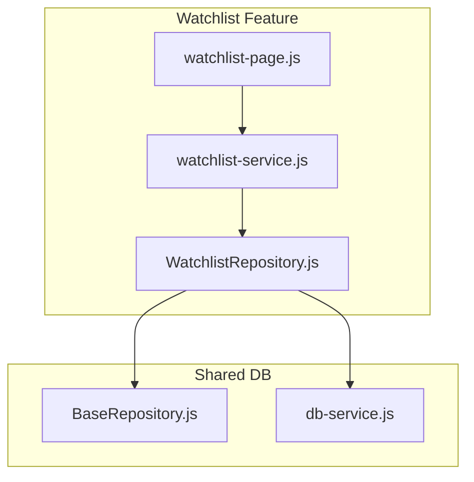
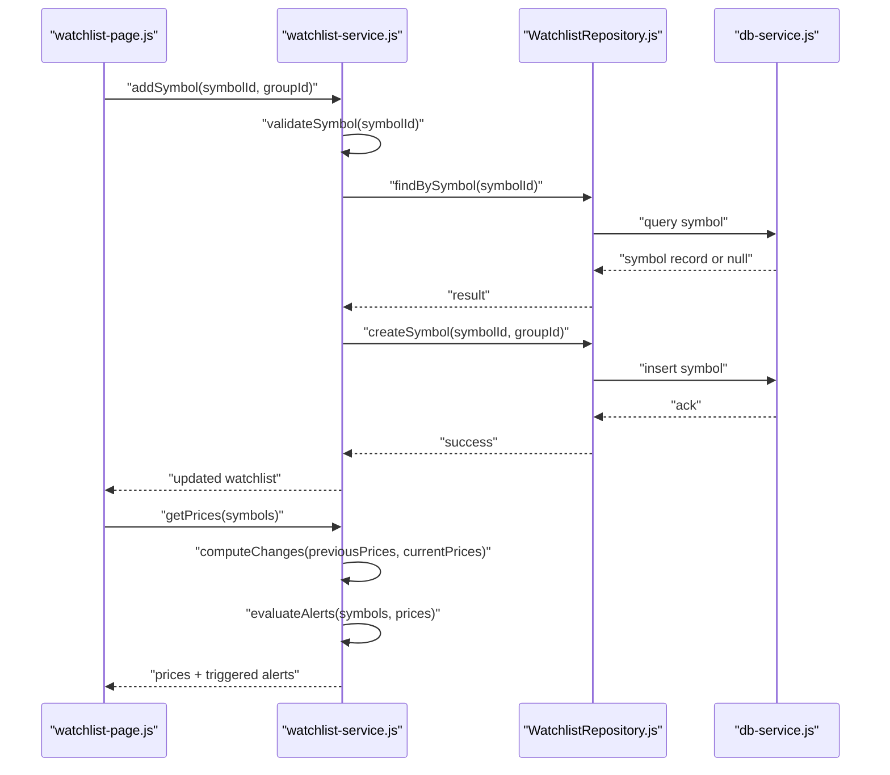
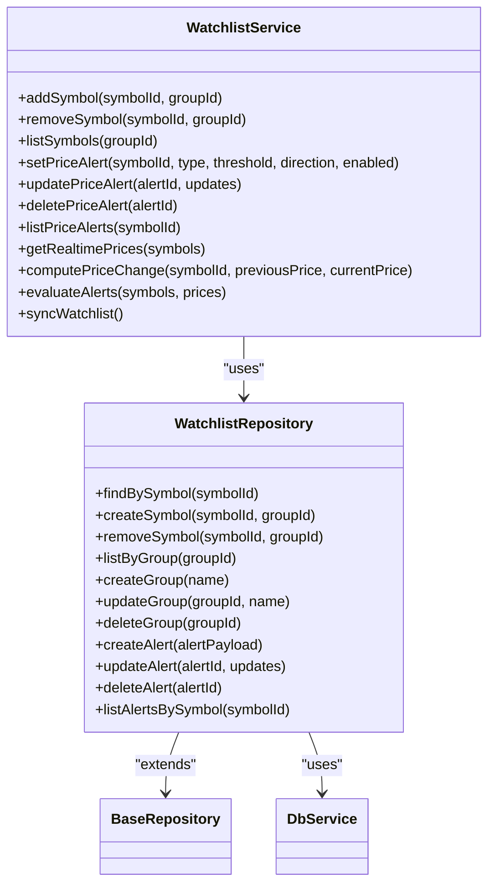

# Watchlist Service API

<cite>
**Referenced Files in This Document**
- [watchlist-service.js](file://features/watchlist/watchlist-service.js)
- [WatchlistRepository.js](file://features/watchlist/WatchlistRepository.js)
- [watchlist-page.js](file://features/watchlist/watchlist-page.js)
- [BaseRepository.js](file://shared/db/BaseRepository.js)
- [db-service.js](file://shared/db/db-service.js)
</cite>

## Table of Contents
1. [Introduction](#introduction)
2. [Project Structure](#project-structure)
3. [Core Components](#core-components)
4. [Architecture Overview](#architecture-overview)
5. [Detailed Component Analysis](#detailed-component-analysis)
6. [Dependency Analysis](#dependency-analysis)
7. [Performance Considerations](#performance-considerations)
8. [Troubleshooting Guide](#troubleshooting-guide)
9. [Conclusion](#conclusion)

## Introduction
This document provides detailed API documentation for the Watchlist Service layer responsible for symbol monitoring, alert management, and watchlist organization. It covers methods for adding/removing symbols, setting up price alerts, managing watchlist groups, and retrieving real-time price data. Business rules for alert thresholds, notification preferences, and symbol validation are included, along with examples of price change detection, alert triggering logic, and data synchronization patterns. Error handling strategies for failed price fetches, duplicate symbol prevention, and batch operations optimization are also documented.

## Project Structure
The Watchlist Service is implemented under the features/watchlist directory and integrates with shared database utilities:
- features/watchlist/watchlist-service.js: Service layer exposing business APIs for watchlist operations and alerts.
- features/watchlist/WatchlistRepository.js: Data access layer for persistence and retrieval of watchlist entities.
- features/watchlist/watchlist-page.js: UI integration that consumes the service to render and interact with watchlists.
- shared/db/BaseRepository.js: Base repository providing common CRUD and lifecycle helpers.
- shared/db/db-service.js: Database service abstraction used by repositories for storage operations.

**Diagram sources**
- [watchlist-page.js](file://features/watchlist/watchlist-page.js)
- [watchlist-service.js](file://features/watchlist/watchlist-service.js)
- [WatchlistRepository.js](file://features/watchlist/WatchlistRepository.js)
- [BaseRepository.js](file://shared/db/BaseRepository.js)
- [db-service.js](file://shared/db/db-service.js)

**Section sources**
- [watchlist-service.js](file://features/watchlist/watchlist-service.js)
- [WatchlistRepository.js](file://features/watchlist/WatchlistRepository.js)
- [watchlist-page.js](file://features/watchlist/watchlist-page.js)
- [BaseRepository.js](file://shared/db/BaseRepository.js)
- [db-service.js](file://shared/db/db-service.js)

## Core Components
- WatchlistService: Exposes high-level APIs for watchlist management, symbol operations, alert configuration, and price retrieval. It orchestrates repository calls and applies business rules (validation, deduplication, thresholds).
- WatchlistRepository: Implements persistence operations for watchlists, symbols, and alerts using the shared database service. Extends BaseRepository for common functionality.
- WatchlistPage: UI controller that invokes WatchlistService methods and updates the interface based on responses and events.

Key responsibilities:
- Symbol monitoring: Add/remove symbols, validate uniqueness, maintain group membership.
- Alert management: Create/update/delete price alerts with threshold rules and notification preferences.
- Real-time prices: Fetch latest prices, compute changes, and trigger alerts when thresholds are met.
- Synchronization: Persist state and propagate updates to UI.

**Section sources**
- [watchlist-service.js](file://features/watchlist/watchlist-service.js)
- [WatchlistRepository.js](file://features/watchlist/WatchlistRepository.js)
- [watchlist-page.js](file://features/watchlist/watchlist-page.js)

## Architecture Overview
The Watchlist Service follows a layered architecture:
- Presentation Layer (watchlist-page.js): Interacts with users and calls service methods.
- Service Layer (watchlist-service.js): Encapsulates business logic, validates inputs, coordinates repository calls, and manages alert evaluation.
- Repository Layer (WatchlistRepository.js): Handles data persistence via BaseRepository and db-service.

**Diagram sources**
- [watchlist-page.js](file://features/watchlist/watchlist-page.js)
- [watchlist-service.js](file://features/watchlist/watchlist-service.js)
- [WatchlistRepository.js](file://features/watchlist/WatchlistRepository.js)
- [db-service.js](file://shared/db/db-service.js)

## Detailed Component Analysis

### WatchlistService API
Responsibilities:
- Symbol operations: add, remove, list, check duplicates.
- Group management: create, update, delete groups; assign symbols to groups.
- Alert management: create, update, delete alerts; evaluate thresholds; notify.
- Price retrieval: fetch latest prices; compute changes; synchronize with previous snapshots.

Method signatures (descriptive):
- addSymbol(symbolId, groupId)
  - Adds a symbol to a watchlist group after validation and duplicate checks.
  - Returns success status and updated watchlist snapshot.
- removeSymbol(symbolId, groupId)
  - Removes a symbol from a group; cascades alert cleanup if needed.
- listSymbols(groupId)
  - Retrieves all symbols in a group.
- getGroupList()
  - Lists available watchlist groups.
- createGroup(name)
  - Creates a new watchlist group.
- updateGroup(groupId, name)
  - Updates group metadata.
- deleteGroup(groupId)
  - Deletes a group and associated symbols/alerts.
- setPriceAlert(symbolId, type, threshold, direction, enabled)
  - Configures a price alert with threshold rules and notification preferences.
- updatePriceAlert(alertId, updates)
  - Updates an existing alert’s parameters.
- deletePriceAlert(alertId)
  - Removes an alert.
- listPriceAlerts(symbolId)
  - Retrieves alerts for a symbol.
- getRealtimePrices(symbols)
  - Fetches current prices for provided symbols.
- computePriceChange(symbolId, previousPrice, currentPrice)
  - Computes absolute and percentage change between two prices.
- evaluateAlerts(symbols, prices)
  - Evaluates configured alerts against current prices and returns triggered alerts.
- syncWatchlist()
  - Synchronizes local watchlist state with persisted data.

Business rules:
- Symbol validation: Ensure symbol identifiers are non-empty and conform to expected format before adding.
- Duplicate prevention: Prevent adding the same symbol to the same group more than once.
- Threshold types: Support absolute and percentage thresholds; enforce positive values.
- Direction filters: Allow “above”, “below”, or “cross” conditions.
- Notification preferences: Respect user-enabled flags and channel settings per alert.
- Group integrity: Symbols must belong to an existing group; deleting a group removes its symbols and alerts.

Examples:
- Price change detection: Use computePriceChange to calculate delta and percent change; feed into evaluateAlerts.
- Alert triggering logic: When currentPrice crosses threshold relative to previousPrice, mark alert as triggered and return event payload.
- Data synchronization: After mutations (add/remove/update), call syncWatchlist to persist and refresh UI state.

Error handling:
- Failed price fetches: Return structured error with retry guidance; do not crash UI; fallback to last known prices.
- Duplicate symbol prevention: Return conflict response with details; allow caller to handle gracefully.
- Batch operations: Provide batchAddSymbols(symbols, groupId) and batchRemoveSymbols(symbolIds, groupId) to optimize multiple mutations.

**Section sources**
- [watchlist-service.js](file://features/watchlist/watchlist-service.js)

### WatchlistRepository API
Responsibilities:
- Persistence of watchlists, symbols, groups, and alerts.
- Querying and indexing for efficient lookups.
- Transactional updates where applicable.

Method signatures (descriptive):
- findBySymbol(symbolId)
- createSymbol(symbolId, groupId)
- removeSymbol(symbolId, groupId)
- listByGroup(groupId)
- createGroup(name)
- updateGroup(groupId, name)
- deleteGroup(groupId)
- createAlert(alertPayload)
- updateAlert(alertId, updates)
- deleteAlert(alertId)
- listAlertsBySymbol(symbolId)

Integration points:
- Extends BaseRepository for common operations.
- Uses db-service for underlying storage interactions.

**Section sources**
- [WatchlistRepository.js](file://features/watchlist/WatchlistRepository.js)
- [BaseRepository.js](file://shared/db/BaseRepository.js)
- [db-service.js](file://shared/db/db-service.js)

### WatchlistPage Integration
Responsibilities:
- Invokes WatchlistService methods in response to user actions.
- Renders watchlist lists, groups, and alerts.
- Displays real-time prices and alert notifications.

Typical flows:
- User adds a symbol -> page calls addSymbol -> service validates and persists -> page refreshes list.
- User sets an alert -> page calls setPriceAlert -> service stores alert -> page shows confirmation.
- Prices update -> page calls getRealtimePrices -> service computes changes and evaluates alerts -> page updates UI and shows notifications.

**Section sources**
- [watchlist-page.js](file://features/watchlist/watchlist-page.js)

## Dependency Analysis
The Watchlist Service depends on the repository layer for persistence and uses shared database utilities. The UI layer depends on the service for business operations.

**Diagram sources**
- [watchlist-service.js](file://features/watchlist/watchlist-service.js)
- [WatchlistRepository.js](file://features/watchlist/WatchlistRepository.js)
- [BaseRepository.js](file://shared/db/BaseRepository.js)
- [db-service.js](file://shared/db/db-service.js)

**Section sources**
- [watchlist-service.js](file://features/watchlist/watchlist-service.js)
- [WatchlistRepository.js](file://features/watchlist/WatchlistRepository.js)
- [BaseRepository.js](file://shared/db/BaseRepository.js)
- [db-service.js](file://shared/db/db-service.js)

## Performance Considerations
- Batch operations: Prefer batchAddSymbols and batchRemoveSymbols for bulk symbol changes to reduce round-trips and transaction overhead.
- Caching: Cache recent prices locally and invalidate on updates to minimize repeated fetches.
- Indexing: Ensure symbolId and groupId fields are indexed for fast queries.
- Throttling: Limit frequency of price fetches and alert evaluations to avoid excessive load.
- Lazy loading: Load only necessary groups/symbols initially; expand on demand.

[No sources needed since this section provides general guidance]

## Troubleshooting Guide
Common issues and resolutions:
- Failed price fetches:
  - Symptom: No price updates or stale data.
  - Action: Check network connectivity; implement retry with exponential backoff; fall back to last known prices.
- Duplicate symbol errors:
  - Symptom: Conflict when adding a symbol already present in a group.
  - Action: Validate existence before add; provide clear error messages; allow idempotent add operations.
- Alert not triggering:
  - Symptom: Alerts remain inactive despite crossing thresholds.
  - Action: Verify threshold type and direction; ensure enabled flag is true; confirm price evaluation runs after updates.
- Group deletion side effects:
  - Symptom: Orphaned symbols or alerts after group removal.
  - Action: Cascade delete symbols and alerts; verify repository transactions succeed.

**Section sources**
- [watchlist-service.js](file://features/watchlist/watchlist-service.js)
- [WatchlistRepository.js](file://features/watchlist/WatchlistRepository.js)

## Conclusion
The Watchlist Service provides a robust API for managing symbols, alerts, and watchlist groups while ensuring data integrity and performance. By adhering to the documented method signatures, business rules, and error handling strategies, developers can implement reliable symbol monitoring and alerting features. The layered architecture promotes separation of concerns and facilitates maintenance and scalability.