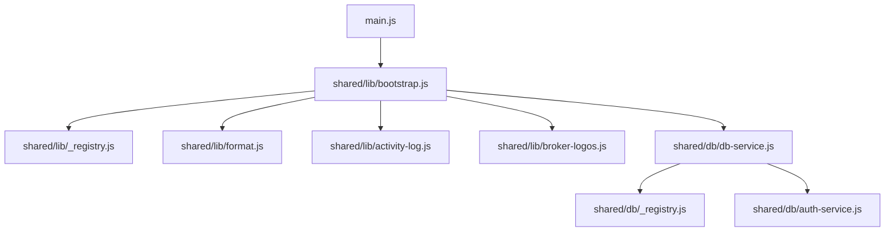
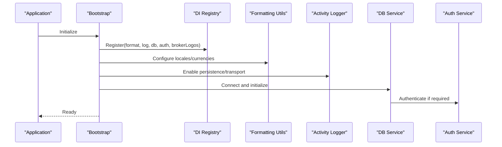
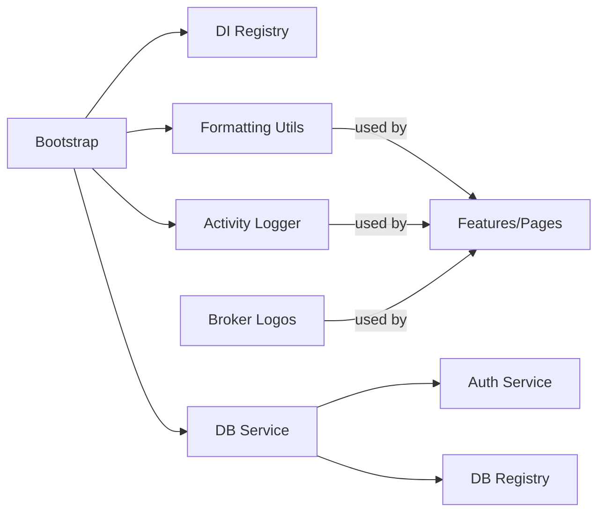

# Utility & Helper APIs

<cite>
**Referenced Files in This Document**
- [format.js](file://shared/lib/format.js)
- [activity-log.js](file://shared/lib/activity-log.js)
- [broker-logos.js](file://shared/lib/broker-logos.js)
- [_registry.js](file://shared/lib/_registry.js)
- [bootstrap.js](file://shared/lib/bootstrap.js)
- [db-service.js](file://shared/db/db-service.js)
- [_registry.js](file://shared/db/_registry.js)
- [auth-service.js](file://shared/db/auth-service.js)
- [main.js](file://main.js)
</cite>

## Table of Contents
1. [Introduction](#introduction)
2. [Project Structure](#project-structure)
3. [Core Components](#core-components)
4. [Architecture Overview](#architecture-overview)
5. [Detailed Component Analysis](#detailed-component-analysis)
6. [Dependency Analysis](#dependency-analysis)
7. [Performance Considerations](#performance-considerations)
8. [Troubleshooting Guide](#troubleshooting-guide)
9. [Conclusion](#conclusion)

## Introduction
This document provides detailed API documentation for the utility functions and helper libraries used across the application. It covers formatting utilities for numbers, dates, currencies, and financial data presentation; activity logging for user action tracking and audit trails; broker logo utilities; asset management helpers; bootstrap system initialization; dependency injection registry; and application lifecycle management. For each API, you will find function signatures, parameter types, return values, usage examples, error handling patterns, performance considerations, and best practices for extending these utilities.

## Project Structure
The utility and helper APIs are primarily located under shared/lib and shared/db:
- Formatting and presentation utilities: shared/lib/format.js
- Activity logging: shared/lib/activity-log.js
- Broker logos: shared/lib/broker-logos.js
- Dependency injection registry: shared/lib/_registry.js
- Bootstrap and lifecycle: shared/lib/bootstrap.js
- Database services and registry: shared/db/db-service.js, shared/db/_registry.js, shared/db/auth-service.js
- Application entrypoint that wires bootstrap and services: main.js

**Diagram sources**
- [main.js](file://main.js)
- [bootstrap.js](file://shared/lib/bootstrap.js)
- [_registry.js](file://shared/lib/_registry.js)
- [format.js](file://shared/lib/format.js)
- [activity-log.js](file://shared/lib/activity-log.js)
- [broker-logos.js](file://shared/lib/broker-logos.js)
- [db-service.js](file://shared/db/db-service.js)
- [_registry.js](file://shared/db/_registry.js)
- [auth-service.js](file://shared/db/auth-service.js)

**Section sources**
- [main.js](file://main.js)
- [bootstrap.js](file://shared/lib/bootstrap.js)
- [_registry.js](file://shared/lib/_registry.js)
- [format.js](file://shared/lib/format.js)
- [activity-log.js](file://shared/lib/activity-log.js)
- [broker-logos.js](file://shared/lib/broker-logos.js)
- [db-service.js](file://shared/db/db-service.js)
- [_registry.js](file://shared/db/_registry.js)
- [auth-service.js](file://shared/db/auth-service.js)

## Core Components
- Formatting Utilities (numbers, dates, currencies, financials): Provide consistent display logic for monetary values, percentages, timestamps, and chart-friendly formats.
- Activity Logging: Record user actions and system events with metadata for auditing and analytics.
- Broker Logos: Resolve and serve broker brand assets by identifier or name.
- Asset Helpers: Manage asset metadata, icons, and related resources.
- Dependency Injection Registry: Centralized container to register and resolve services and utilities.
- Bootstrap System: Initializes dependencies, configures environment, and starts core services.
- Database Services: Encapsulate persistence operations and authentication flows.

**Section sources**
- [format.js](file://shared/lib/format.js)
- [activity-log.js](file://shared/lib/activity-log.js)
- [broker-logos.js](file://shared/lib/broker-logos.js)
- [_registry.js](file://shared/lib/_registry.js)
- [bootstrap.js](file://shared/lib/bootstrap.js)
- [db-service.js](file://shared/db/db-service.js)
- [_registry.js](file://shared/db/_registry.js)
- [auth-service.js](file://shared/db/auth-service.js)

## Architecture Overview
The bootstrap orchestrates initialization and wiring of the DI registry, formatting utilities, activity logger, broker logos, and database services. The DI registry decouples components by providing a single source of truth for service resolution. Formatting and logging utilities are consumed throughout features and pages.

**Diagram sources**
- [bootstrap.js](file://shared/lib/bootstrap.js)
- [_registry.js](file://shared/lib/_registry.js)
- [format.js](file://shared/lib/format.js)
- [activity-log.js](file://shared/lib/activity-log.js)
- [db-service.js](file://shared/db/db-service.js)
- [auth-service.js](file://shared/db/auth-service.js)

## Detailed Component Analysis

### Formatting Utilities API
Purpose: Standardize presentation of numbers, dates, currencies, and financial metrics across the app.

Key responsibilities:
- Number formatting with locale-aware decimals and separators
- Currency formatting with symbol, code, and precision control
- Date/time formatting with timezone and relative time options
- Financial-specific helpers (e.g., percentage, PnL sign, compact notation)

Typical function signatures and behavior:
- formatNumber(value, options)
  - Parameters:
    - value: number | string
    - options: object (optional)
      - decimals?: number
      - locale?: string
      - style?: "decimal" | "percent"
  - Returns: string
  - Example usage:
    - formatNumber(1234.567, { decimals: 2 }) => "1,234.57"
    - formatNumber(0.1234, { style: "percent", decimals: 1 }) => "12.3%"

- formatCurrency(amount, currencyCode, options)
  - Parameters:
    - amount: number
    - currencyCode: string (ISO 4217)
    - options: object (optional)
      - locale?: string
      - showSymbol?: boolean
      - precision?: number
  - Returns: string
  - Example usage:
    - formatCurrency(1234.5, "USD") => "$1,234.50"
    - formatCurrency(1234.5, "EUR", { locale: "de-DE" }) => "1.234,50 €"

- formatDate(dateInput, options)
  - Parameters:
    - dateInput: Date | string | number
    - options: object (optional)
      - locale?: string
      - format?: "short" | "medium" | "long" | "relative"
      - timeZone?: string
  - Returns: string
  - Example usage:
    - formatDate(new Date(), { format: "short", locale: "en-US" }) => "MM/DD/YYYY"
    - formatDate("2024-01-01T12:00:00Z", { format: "relative" }) => "a few seconds ago"

- formatFinancialMetric(metric, options)
  - Parameters:
    - metric: number
    - options: object (optional)
      - type?: "pnl" | "return" | "volume"
      - compact?: boolean
      - locale?: string
  - Returns: string
  - Example usage:
    - formatFinancialMetric(-1234.56, { type: "pnl" }) => "-$1,234.56"
    - formatFinancialMetric(1234567, { type: "volume", compact: true }) => "1.23M"

Error handling:
- Invalid inputs return safe defaults or throw descriptive errors when critical parameters are missing.
- Locale or currency codes not supported fall back to default formatting.

Performance considerations:
- Cache locale-aware formatters where possible.
- Avoid repeated instantiation of heavy Intl objects in tight loops.

Best practices:
- Centralize locale and currency configuration in bootstrap.
- Use explicit options rather than relying on global state.

**Section sources**
- [format.js](file://shared/lib/format.js)

### Activity Logging API
Purpose: Track user actions and system events for audit trails and analytics.

Key responsibilities:
- Emit structured log entries with timestamp, actor, action, context, and severity
- Persist logs locally or forward to remote endpoints
- Provide query helpers for recent events and filtering

Typical function signatures and behavior:
- logAction(action, payload, options)
  - Parameters:
    - action: string
    - payload: object (optional)
    - options: object (optional)
      - userId?: string
      - severity?: "info" | "warn" | "error"
      - persist?: boolean
  - Returns: Promise<void> | void
  - Example usage:
    - logAction("trade.place", { symbol: "XAUUSD", side: "buy" }, { userId: "u123" })

- getRecentLogs(limit, filters)
  - Parameters:
    - limit: number
    - filters: object (optional)
      - since?: Date
      - action?: string
      - userId?: string
  - Returns: Array<object>
  - Example usage:
    - getRecentLogs(50, { action: "trade.place" })

- clearLogs()
  - Returns: Promise<void> | void
  - Example usage:
    - clearLogs()

Error handling:
- Network failures during remote sync are caught and retried with backoff.
- Local storage limits are handled gracefully by pruning older entries.

Performance considerations:
- Batch writes for high-frequency events.
- Debounce UI-triggered logs to avoid excessive writes.

Best practices:
- Include minimal but sufficient context in payloads.
- Avoid logging sensitive data (PII, tokens).

**Section sources**
- [activity-log.js](file://shared/lib/activity-log.js)

### Broker Logos API
Purpose: Resolve and render broker brand assets consistently.

Key responsibilities:
- Map broker identifiers to logo URLs or SVG paths
- Provide fallback images when assets are unavailable
- Support dynamic loading and caching

Typical function signatures and behavior:
- getBrokerLogo(brokerId, size)
  - Parameters:
    - brokerId: string
    - size: "small" | "medium" | "large" (optional)
  - Returns: string (URL or path)
  - Example usage:
    - getBrokerLogo("brokerA", "medium") => "/images/brokers/brokerA-medium.png"

- setBrokerLogoMapping(mapping)
  - Parameters:
    - mapping: object (brokerId -> URL/path)
  - Returns: void
  - Example usage:
    - setBrokerLogoMapping({ "brokerB": "/assets/bb.svg" })

Error handling:
- Unknown broker IDs return a generic placeholder image.
- Broken links are logged and replaced with fallback.

Performance considerations:
- Preload common logos at startup.
- Cache resolved URLs to avoid repeated lookups.

Best practices:
- Keep mappings centralized and versioned.
- Prefer vector assets (SVG) for scalability.

**Section sources**
- [broker-logos.js](file://shared/lib/broker-logos.js)

### Asset Management Helpers
Purpose: Provide helpers for managing asset metadata, icons, and related resources.

Typical function signatures and behavior:
- getAssetIcon(assetId, theme)
  - Parameters:
    - assetId: string
    - theme: "light" | "dark" (optional)
  - Returns: string (URL or path)
  - Example usage:
    - getAssetIcon("gold", "dark") => "/icons/gold-dark.svg"

- listAssets(filter)
  - Parameters:
    - filter: object (optional)
      - category?: string
      - active?: boolean
  - Returns: Array<object>
  - Example usage:
    - listAssets({ category: "commodities", active: true })

Error handling:
- Missing assets return null or a default icon.
- Filters with invalid keys are ignored with warnings.

Performance considerations:
- Memoize expensive lookups.
- Lazy-load large asset lists.

Best practices:
- Normalize asset IDs and categories.
- Keep asset catalogs synchronized with build-time manifests.

**Section sources**
- [broker-logos.js](file://shared/lib/broker-logos.js)

### Dependency Injection Registry API
Purpose: Centralized container to register and resolve services and utilities.

Key responsibilities:
- Register named instances
- Resolve dependencies by name
- Provide singleton semantics
- Validate registrations

Typical function signatures and behavior:
- register(name, instance)
  - Parameters:
    - name: string
    - instance: any
  - Returns: void
  - Example usage:
    - register("format", formatUtils)

- resolve(name)
  - Parameters:
    - name: string
  - Returns: any
  - Throws: Error if not registered
  - Example usage:
    - const format = resolve("format")

- has(name)
  - Parameters:
    - name: string
  - Returns: boolean
  - Example usage:
    - has("log") => true

Error handling:
- Attempting to resolve an unregistered key throws a descriptive error.
- Duplicate registrations can be rejected or overwritten based on policy.

Performance considerations:
- O(1) lookup by name.
- Avoid frequent re-registration in hot paths.

Best practices:
- Register all top-level services during bootstrap.
- Use stable, descriptive names.

**Section sources**
- [_registry.js](file://shared/lib/_registry.js)

### Bootstrap System and Lifecycle Management
Purpose: Initialize the application, configure services, and manage lifecycle events.

Key responsibilities:
- Load configuration and environment settings
- Register services into the DI registry
- Initialize database connections and authentication
- Start background tasks (logging flush, cache warm-up)
- Expose lifecycle hooks (onReady, onError)

Typical function signatures and behavior:
- bootstrap(config)
  - Parameters:
    - config: object
      - env?: string
      - db?: object
      - logging?: object
      - features?: object
  - Returns: Promise<void>
  - Example usage:
    - await bootstrap({ env: "production", db: { url: "...", token: "..." } })

- onReady(callback)
  - Parameters:
    - callback: Function
  - Returns: void
  - Example usage:
    - onReady(() => console.log("App ready"))

- shutdown()
  - Returns: Promise<void>
  - Example usage:
    - await shutdown()

Error handling:
- Initialization failures are surfaced via thrown errors or returned promises.
- Graceful degradation is applied when optional services fail to start.

Performance considerations:
- Parallelize independent initializations.
- Defer non-critical work until after onReady.

Best practices:
- Keep config small and typed.
- Use feature flags to toggle optional modules.

**Section sources**
- [bootstrap.js](file://shared/lib/bootstrap.js)
- [main.js](file://main.js)

### Database Services API
Purpose: Encapsulate persistence operations and authentication flows.

Key responsibilities:
- Connect to the database backend
- Perform CRUD operations
- Handle authentication and session management
- Provide transactional helpers

Typical function signatures and behavior:
- connect(options)
  - Parameters:
    - options: object
      - url?: string
      - credentials?: object
  - Returns: Promise<void>
  - Example usage:
    - await connect({ url: "https://...", credentials: { apiKey: "..." } })

- authenticate(credentials)
  - Parameters:
    - credentials: object
  - Returns: Promise<object>
  - Example usage:
    - const session = await authenticate({ token: "..." })

- query(collection, filter)
  - Parameters:
    - collection: string
    - filter: object
  - Returns: Promise<Array<object>>
  - Example usage:
    - const trades = await query("trades", { status: "open" })

- write(collection, doc)
  - Parameters:
    - collection: string
    - doc: object
  - Returns: Promise<string> (document id)
  - Example usage:
    - const id = await write("trades", { symbol: "XAUUSD", side: "buy" })

Error handling:
- Network errors are wrapped with retryable error types.
- Validation errors include field details.

Performance considerations:
- Batch writes when possible.
- Use indexes and selective fields for queries.

Best practices:
- Centralize error mapping and logging.
- Keep documents normalized and lean.

**Section sources**
- [db-service.js](file://shared/db/db-service.js)
- [_registry.js](file://shared/db/_registry.js)
- [auth-service.js](file://shared/db/auth-service.js)

## Dependency Analysis
The following diagram shows how components depend on each other through the DI registry and bootstrap process.

**Diagram sources**
- [bootstrap.js](file://shared/lib/bootstrap.js)
- [_registry.js](file://shared/lib/_registry.js)
- [format.js](file://shared/lib/format.js)
- [activity-log.js](file://shared/lib/activity-log.js)
- [broker-logos.js](file://shared/lib/broker-logos.js)
- [db-service.js](file://shared/db/db-service.js)
- [_registry.js](file://shared/db/_registry.js)
- [auth-service.js](file://shared/db/auth-service.js)

**Section sources**
- [bootstrap.js](file://shared/lib/bootstrap.js)
- [_registry.js](file://shared/lib/_registry.js)
- [format.js](file://shared/lib/format.js)
- [activity-log.js](file://shared/lib/activity-log.js)
- [broker-logos.js](file://shared/lib/broker-logos.js)
- [db-service.js](file://shared/db/db-service.js)
- [_registry.js](file://shared/db/_registry.js)
- [auth-service.js](file://shared/db/auth-service.js)

## Performance Considerations
- Formatting:
  - Reuse Intl formatters per locale to reduce overhead.
  - Avoid formatting in render loops; precompute where feasible.
- Logging:
  - Batch and debounce high-frequency events.
  - Use async queues to prevent blocking UI.
- Broker Logos:
  - Preload frequently used assets.
  - Cache resolved URLs and handle broken links gracefully.
- DI Registry:
  - Register once at startup; avoid runtime churn.
- Database:
  - Use efficient queries and projections.
  - Implement retries with exponential backoff for transient failures.

[No sources needed since this section provides general guidance]

## Troubleshooting Guide
Common issues and resolutions:
- Formatting errors:
  - Ensure valid locale and currency codes.
  - Check for NaN or undefined inputs before formatting.
- Logging failures:
  - Verify network connectivity and permissions for remote endpoints.
  - Inspect local storage quotas and prune old logs if necessary.
- Broker logo missing:
  - Confirm mappings exist for the broker ID.
  - Provide a fallback image and log warnings for missing assets.
- DI registration problems:
  - Confirm all services are registered before first use.
  - Use has() checks to guard against missing dependencies.
- Database connection issues:
  - Validate credentials and endpoint URLs.
  - Review error wrappers for retryable vs. fatal errors.

**Section sources**
- [format.js](file://shared/lib/format.js)
- [activity-log.js](file://shared/lib/activity-log.js)
- [broker-logos.js](file://shared/lib/broker-logos.js)
- [_registry.js](file://shared/lib/_registry.js)
- [db-service.js](file://shared/db/db-service.js)
- [auth-service.js](file://shared/db/auth-service.js)

## Conclusion
The utility and helper APIs provide a robust foundation for consistent data presentation, reliable event tracking, and clean service orchestration. By centralizing formatting, logging, asset management, and dependency resolution, the application achieves better maintainability and extensibility. Follow the best practices outlined above to extend these utilities safely and efficiently.

[No sources needed since this section summarizes without analyzing specific files]