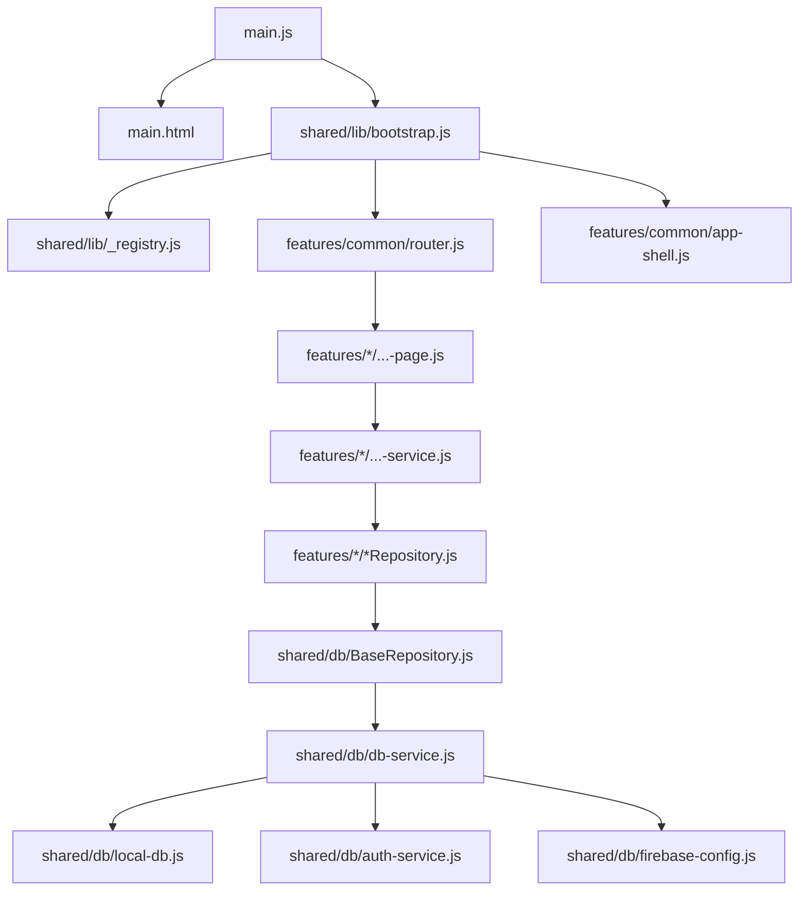
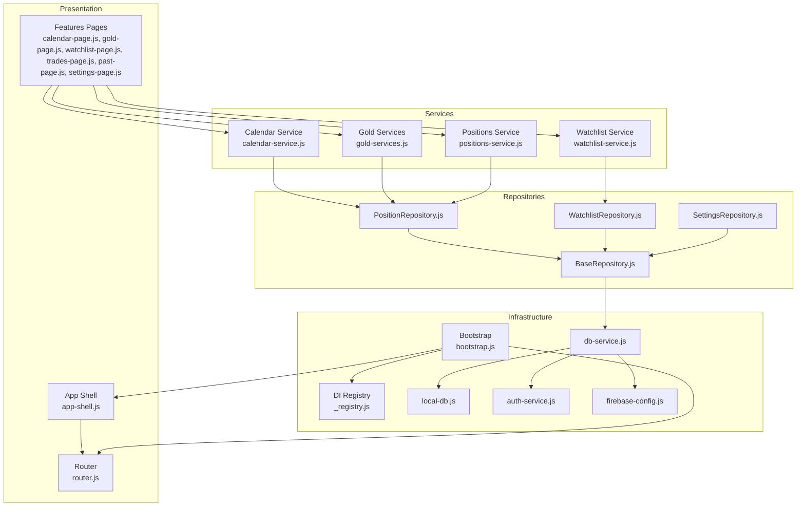
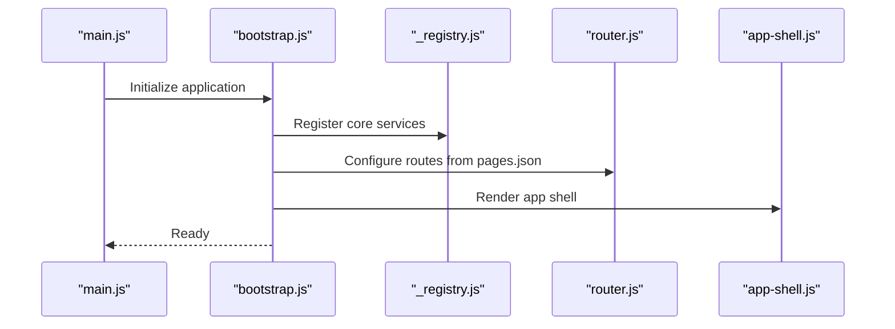
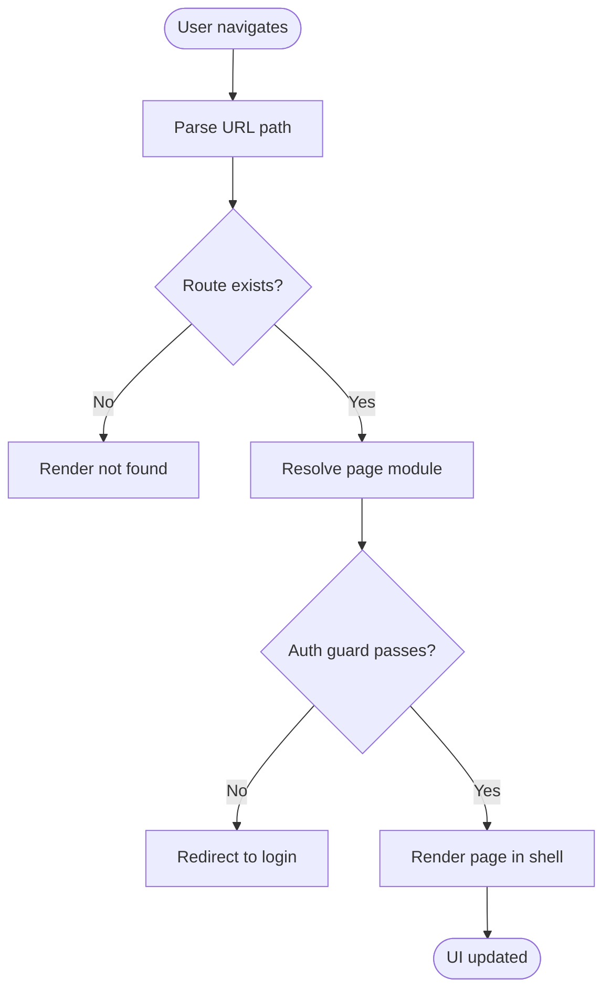
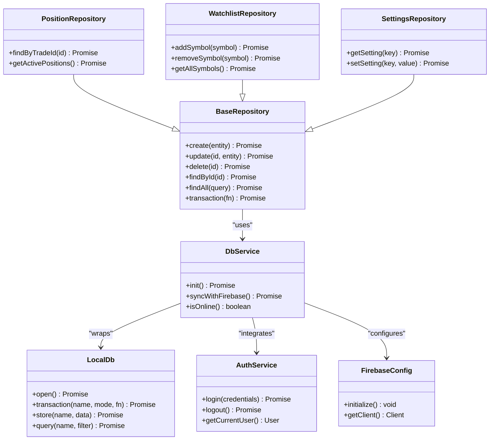
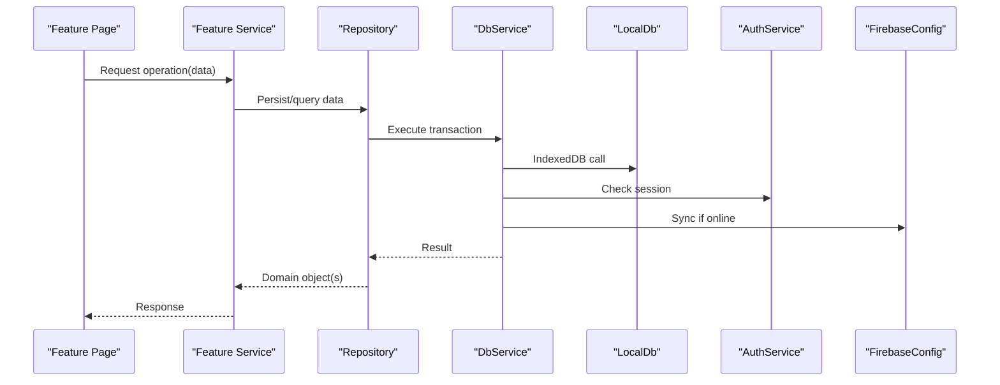
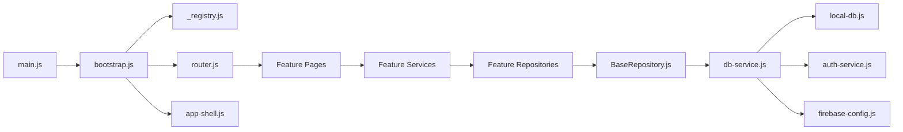

# Architecture Overview

<cite>
**Referenced Files in This Document**
- [main.js](file://main.js)
- [main.html](file://main.html)
- [package.json](file://package.json)
- [pages.json](file://pages.json)
- [shared/lib/bootstrap.js](file://shared/lib/bootstrap.js)
- [shared/lib/_registry.js](file://shared/lib/_registry.js)
- [features/common/router.js](file://features/common/router.js)
- [features/common/app-shell.js](file://features/common/app-shell.js)
- [shared/db/BaseRepository.js](file://shared/db/BaseRepository.js)
- [shared/db/_registry.js](file://shared/db/_registry.js)
- [shared/db/db-service.js](file://shared/db/db-service.js)
- [shared/db/local-db.js](file://shared/db/local-db.js)
- [shared/db/auth-service.js](file://shared/db/auth-service.js)
- [shared/db/firebase-config.js](file://shared/db/firebase-config.js)
- [features/positions/PositionRepository.js](file://features/positions/PositionRepository.js)
- [features/watchlist/WatchlistRepository.js](file://features/watchlist/WatchlistRepository.js)
- [features/more/SettingsRepository.js](file://features/more/SettingsRepository.js)
- [features/calendar/calendar-service.js](file://features/calendar/calendar-service.js)
- [features/gold/gold-services.js](file://features/gold/gold-services.js)
- [features/watchlist/watchlist-service.js](file://features/watchlist/watchlist-service.js)
- [features/positions/positions-service.js](file://features/positions/positions-service.js)
</cite>

## Table of Contents
1. Introduction
2. Project Structure
3. Core Components
4. Architecture Overview
5. Detailed Component Analysis
6. Dependency Analysis
7. Performance Considerations
8. Troubleshooting Guide
9. Conclusion

## Introduction
This document provides an architectural overview of the MTF Monitor application, focusing on its feature-based architecture, repository pattern implementation, service layer design, dependency injection system, bootstrap process, module loading mechanism, and routing architecture. It also covers system boundaries, data flow between UI components, services, repositories, and database layers, as well as cross-cutting concerns such as authentication, logging, and error handling. The document concludes with technology stack decisions, third-party dependencies (Firebase, IndexedDB), architectural trade-offs, and guidance for extending the architecture consistently across features.

## Project Structure
The project follows a feature-based organization:
- Features are grouped under features/, each containing UI pages, services, and domain-specific repositories.
- Shared infrastructure is located under shared/, including database abstractions, dependency injection registry, bootstrap utilities, and common UI components.
- Application entry points are main.js and main.html, which initialize the runtime and shell.
- Configuration and metadata include package.json, pages.json, and app-version.json.

**Diagram sources**
- [main.js](file://main.js)
- [main.html](file://main.html)
- [shared/lib/bootstrap.js](file://shared/lib/bootstrap.js)
- [shared/lib/_registry.js](file://shared/lib/_registry.js)
- [features/common/router.js](file://features/common/router.js)
- [features/common/app-shell.js](file://features/common/app-shell.js)
- [shared/db/BaseRepository.js](file://shared/db/BaseRepository.js)
- [shared/db/_registry.js](file://shared/db/_registry.js)
- [shared/db/db-service.js](file://shared/db/db-service.js)
- [shared/db/local-db.js](file://shared/db/local-db.js)
- [shared/db/auth-service.js](file://shared/db/auth-service.js)
- [shared/db/firebase-config.js](file://shared/db/firebase-config.js)

**Section sources**
- [main.js](file://main.js)
- [main.html](file://main.html)
- [package.json](file://package.json)
- [pages.json](file://pages.json)

## Core Components
- Bootstrap and DI Registry:
  - Bootstrap orchestrates initialization, registers modules, and wires up core services.
  - The DI registry provides centralized resolution of dependencies by name or type.
- Router and App Shell:
  - The router manages navigation and page rendering based on routes defined in configuration.
  - The app shell renders the persistent layout and hosts feature pages.
- Database Abstraction:
  - BaseRepository defines common persistence operations and transaction helpers.
  - db-service coordinates local storage and optional Firebase synchronization.
  - local-db encapsulates IndexedDB interactions.
  - auth-service handles user identity and session management.
  - firebase-config centralizes Firebase configuration and client setup.
- Feature Services and Repositories:
  - Each feature exposes a service that encapsulates business logic and uses repositories for data access.
  - Repositories implement the repository pattern over BaseRepository to abstract persistence details.

**Section sources**
- [shared/lib/bootstrap.js](file://shared/lib/bootstrap.js)
- [shared/lib/_registry.js](file://shared/lib/_registry.js)
- [features/common/router.js](file://features/common/router.js)
- [features/common/app-shell.js](file://features/common/app-shell.js)
- [shared/db/BaseRepository.js](file://shared/db/BaseRepository.js)
- [shared/db/db-service.js](file://shared/db/db-service.js)
- [shared/db/local-db.js](file://shared/db/local-db.js)
- [shared/db/auth-service.js](file://shared/db/auth-service.js)
- [shared/db/firebase-config.js](file://shared/db/firebase-config.js)

## Architecture Overview
MTF Monitor implements a feature-based layered architecture:
- Presentation Layer: Feature pages render UI and delegate actions to services.
- Service Layer: Encapsulates business rules, orchestration, and cross-feature coordination.
- Repository Layer: Abstracts data access using a consistent interface over IndexedDB and optional Firebase sync.
- Infrastructure Layer: Provides DI, routing, bootstrapping, and database clients.

**Diagram sources**
- [features/calendar/calendar-service.js](file://features/calendar/calendar-service.js)
- [features/gold/gold-services.js](file://features/gold/gold-services.js)
- [features/watchlist/watchlist-service.js](file://features/watchlist/watchlist-service.js)
- [features/positions/positions-service.js](file://features/positions/positions-service.js)
- [features/positions/PositionRepository.js](file://features/positions/PositionRepository.js)
- [features/watchlist/WatchlistRepository.js](file://features/watchlist/WatchlistRepository.js)
- [features/more/SettingsRepository.js](file://features/more/SettingsRepository.js)
- [shared/db/BaseRepository.js](file://shared/db/BaseRepository.js)
- [shared/db/db-service.js](file://shared/db/db-service.js)
- [shared/db/local-db.js](file://shared/db/local-db.js)
- [shared/db/auth-service.js](file://shared/db/auth-service.js)
- [shared/db/firebase-config.js](file://shared/db/firebase-config.js)
- [shared/lib/bootstrap.js](file://shared/lib/bootstrap.js)
- [shared/lib/_registry.js](file://shared/lib/_registry.js)
- [features/common/router.js](file://features/common/router.js)
- [features/common/app-shell.js](file://features/common/app-shell.js)

## Detailed Component Analysis

### Bootstrap and Dependency Injection
- Bootstrap initializes the application lifecycle, sets up logging, configures environment, and registers core modules into the DI registry.
- The DI registry supports registration by key and resolution at runtime, enabling loose coupling between features and infrastructure.
- Bootstrap ensures that the router and app shell are ready before feature modules load.

**Diagram sources**
- [main.js](file://main.js)
- [shared/lib/bootstrap.js](file://shared/lib/bootstrap.js)
- [shared/lib/_registry.js](file://shared/lib/_registry.js)
- [features/common/router.js](file://features/common/router.js)
- [features/common/app-shell.js](file://features/common/app-shell.js)
- [pages.json](file://pages.json)

**Section sources**
- [shared/lib/bootstrap.js](file://shared/lib/bootstrap.js)
- [shared/lib/_registry.js](file://shared/lib/_registry.js)
- [pages.json](file://pages.json)

### Routing Architecture
- Routes are declared in pages.json and consumed by the router to map URLs to feature pages.
- The router resolves page modules dynamically and delegates rendering to the app shell.
- Navigation guards can be implemented via route hooks to enforce authentication or permissions.

**Diagram sources**
- [features/common/router.js](file://features/common/router.js)
- [features/common/app-shell.js](file://features/common/app-shell.js)
- [pages.json](file://pages.json)

**Section sources**
- [features/common/router.js](file://features/common/router.js)
- [features/common/app-shell.js](file://features/common/app-shell.js)
- [pages.json](file://pages.json)

### Database Abstraction and Repository Pattern
- BaseRepository provides common CRUD operations, query helpers, and transaction wrappers.
- Feature repositories extend BaseRepository to implement domain-specific queries and mutations.
- db-service coordinates persistence strategies, including local-first IndexedDB and optional Firebase synchronization.
- local-db encapsulates IndexedDB schema, transactions, and error handling.
- auth-service manages user sessions and integrates with db-service for authenticated operations.
- firebase-config centralizes Firebase client initialization and security rules integration.

**Diagram sources**
- [shared/db/BaseRepository.js](file://shared/db/BaseRepository.js)
- [features/positions/PositionRepository.js](file://features/positions/PositionRepository.js)
- [features/watchlist/WatchlistRepository.js](file://features/watchlist/WatchlistRepository.js)
- [features/more/SettingsRepository.js](file://features/more/SettingsRepository.js)
- [shared/db/db-service.js](file://shared/db/db-service.js)
- [shared/db/local-db.js](file://shared/db/local-db.js)
- [shared/db/auth-service.js](file://shared/db/auth-service.js)
- [shared/db/firebase-config.js](file://shared/db/firebase-config.js)

**Section sources**
- [shared/db/BaseRepository.js](file://shared/db/BaseRepository.js)
- [features/positions/PositionRepository.js](file://features/positions/PositionRepository.js)
- [features/watchlist/WatchlistRepository.js](file://features/watchlist/WatchlistRepository.js)
- [features/more/SettingsRepository.js](file://features/more/SettingsRepository.js)
- [shared/db/db-service.js](file://shared/db/db-service.js)
- [shared/db/local-db.js](file://shared/db/local-db.js)
- [shared/db/auth-service.js](file://shared/db/auth-service.js)
- [shared/db/firebase-config.js](file://shared/db/firebase-config.js)

### Service Layer Design
- Feature services encapsulate business logic and coordinate multiple repositories.
- Services handle validation, transformation, and orchestration of data flows.
- Services may trigger background tasks like syncing or caching.

**Diagram sources**
- [features/calendar/calendar-service.js](file://features/calendar/calendar-service.js)
- [features/gold/gold-services.js](file://features/gold/gold-services.js)
- [features/watchlist/watchlist-service.js](file://features/watchlist/watchlist-service.js)
- [features/positions/positions-service.js](file://features/positions/positions-service.js)
- [shared/db/db-service.js](file://shared/db/db-service.js)
- [shared/db/local-db.js](file://shared/db/local-db.js)
- [shared/db/auth-service.js](file://shared/db/auth-service.js)
- [shared/db/firebase-config.js](file://shared/db/firebase-config.js)

**Section sources**
- [features/calendar/calendar-service.js](file://features/calendar/calendar-service.js)
- [features/gold/gold-services.js](file://features/gold/gold-services.js)
- [features/watchlist/watchlist-service.js](file://features/watchlist/watchlist-service.js)
- [features/positions/positions-service.js](file://features/positions/positions-service.js)

### Cross-Cutting Concerns
- Authentication:
  - Handled by auth-service, integrated with db-service for authenticated operations and Firebase sync.
- Logging:
  - Centralized logging initialized during bootstrap; services and repositories log errors and events.
- Error Handling:
  - Consistent error propagation through promises; user-facing messages surfaced by services.
- Offline Support:
  - Local-first strategy using IndexedDB; background sync when online.

**Section sources**
- [shared/db/auth-service.js](file://shared/db/auth-service.js)
- [shared/db/db-service.js](file://shared/db/db-service.js)
- [shared/db/local-db.js](file://shared/db/local-db.js)
- [shared/db/firebase-config.js](file://shared/db/firebase-config.js)

## Dependency Analysis
The following diagram shows high-level dependencies among core modules:

**Diagram sources**
- [main.js](file://main.js)
- [shared/lib/bootstrap.js](file://shared/lib/bootstrap.js)
- [shared/lib/_registry.js](file://shared/lib/_registry.js)
- [features/common/router.js](file://features/common/router.js)
- [features/common/app-shell.js](file://features/common/app-shell.js)
- [shared/db/BaseRepository.js](file://shared/db/BaseRepository.js)
- [shared/db/db-service.js](file://shared/db/db-service.js)
- [shared/db/local-db.js](file://shared/db/local-db.js)
- [shared/db/auth-service.js](file://shared/db/auth-service.js)
- [shared/db/firebase-config.js](file://shared/db/firebase-config.js)

**Section sources**
- [main.js](file://main.js)
- [shared/lib/bootstrap.js](file://shared/lib/bootstrap.js)
- [shared/lib/_registry.js](file://shared/lib/_registry.js)
- [features/common/router.js](file://features/common/router.js)
- [features/common/app-shell.js](file://features/common/app-shell.js)
- [shared/db/BaseRepository.js](file://shared/db/BaseRepository.js)
- [shared/db/db-service.js](file://shared/db/db-service.js)
- [shared/db/local-db.js](file://shared/db/local-db.js)
- [shared/db/auth-service.js](file://shared/db/auth-service.js)
- [shared/db/firebase-config.js](file://shared/db/firebase-config.js)

## Performance Considerations
- Local-first persistence reduces latency and improves offline UX.
- Use transactions in repositories to batch writes and minimize IndexedDB overhead.
- Defer heavy computations to background tasks or web workers where feasible.
- Cache frequently accessed data in memory within services to avoid redundant queries.
- Optimize IndexedDB indexes for common query patterns exposed by repositories.
- Implement pagination and virtualization in UI lists to reduce DOM pressure.

[No sources needed since this section provides general guidance]

## Troubleshooting Guide
- Initialization failures:
  - Verify bootstrap completes without errors and all required modules are registered.
- Routing issues:
  - Ensure pages.json contains correct route definitions and page module paths.
- Database errors:
  - Check IndexedDB availability and schema migrations; inspect db-service logs for transaction failures.
- Authentication problems:
  - Validate auth-service state and Firebase configuration; confirm session tokens are valid.
- Sync conflicts:
  - Review conflict resolution policies in db-service and ensure idempotent operations in repositories.

**Section sources**
- [shared/lib/bootstrap.js](file://shared/lib/bootstrap.js)
- [features/common/router.js](file://features/common/router.js)
- [shared/db/db-service.js](file://shared/db/db-service.js)
- [shared/db/local-db.js](file://shared/db/local-db.js)
- [shared/db/auth-service.js](file://shared/db/auth-service.js)
- [shared/db/firebase-config.js](file://shared/db/firebase-config.js)

## Conclusion
MTF Monitor employs a robust feature-based architecture with clear separation of concerns: presentation, services, repositories, and infrastructure. The repository pattern standardizes data access, while the DI registry and bootstrap process enable modular composition. Local-first persistence with IndexedDB ensures responsiveness and offline capability, complemented by optional Firebase synchronization. By adhering to these patterns and guidelines, teams can extend the application consistently across new features while maintaining reliability and performance.

[No sources needed since this section summarizes without analyzing specific files]