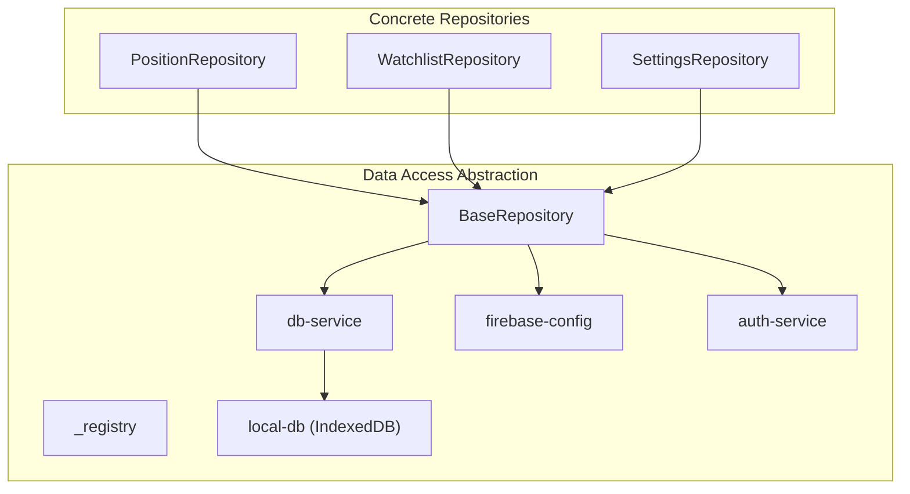
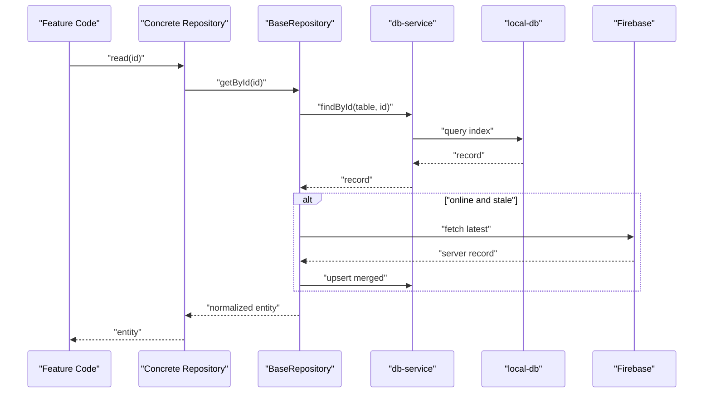
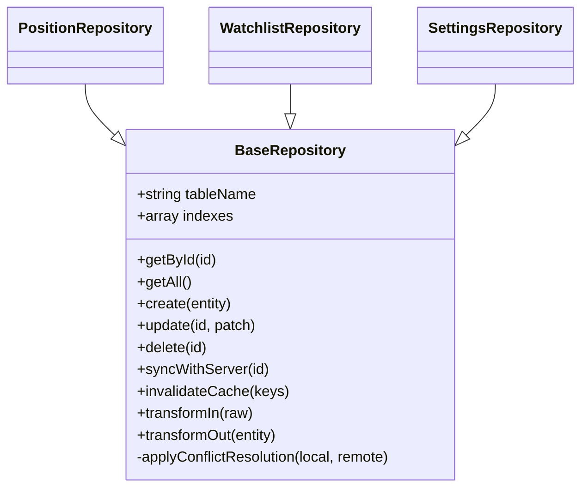
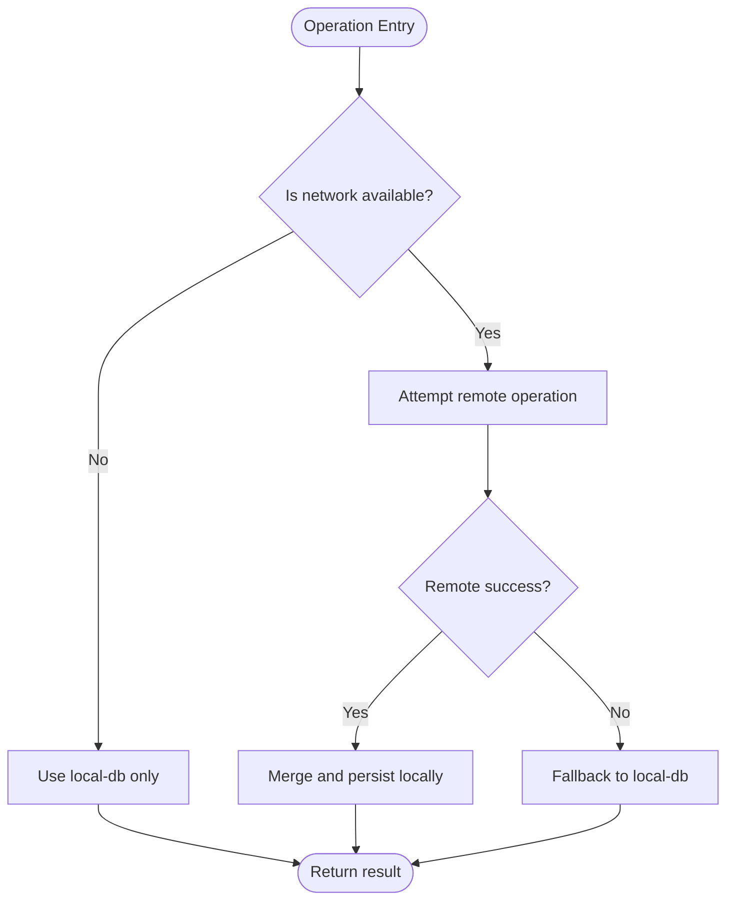
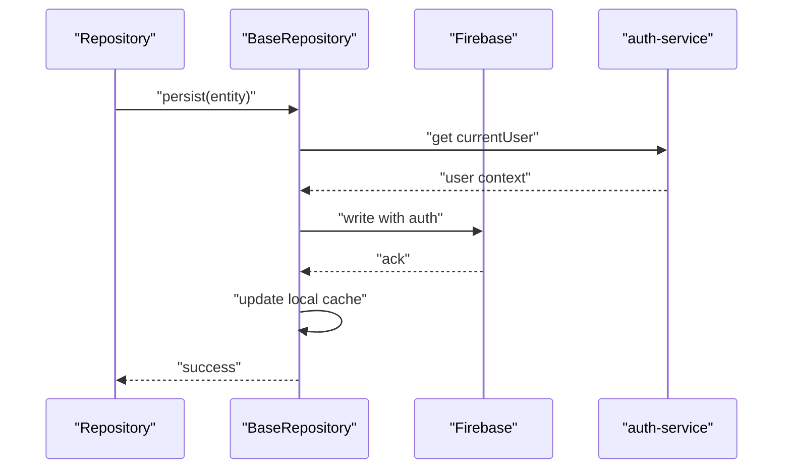
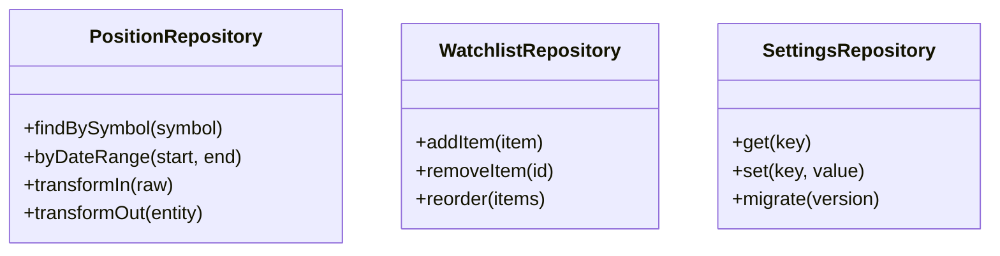
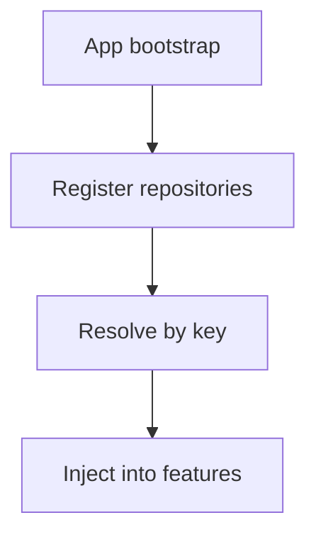
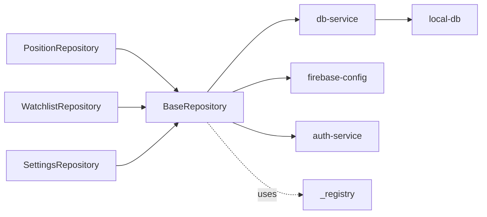

# Data Layer Patterns

<cite>
**Referenced Files in This Document**
- [BaseRepository.js](file://shared/db/BaseRepository.js)
- [db-service.js](file://shared/db/db-service.js)
- [local-db.js](file://shared/db/local-db.js)
- [firebase-config.js](file://shared/db/firebase-config.js)
- [auth-service.js](file://shared/db/auth-service.js)
- [_registry.js](file://shared/db/_registry.js)
- [PositionRepository.js](file://features/positions/PositionRepository.js)
- [WatchlistRepository.js](file://features/watchlist/WatchlistRepository.js)
- [SettingsRepository.js](file://features/more/SettingsRepository.js)
</cite>

## Table of Contents
1. [Introduction](#introduction)
2. [Project Structure](#project-structure)
3. [Core Components](#core-components)
4. [Architecture Overview](#architecture-overview)
5. [Detailed Component Analysis](#detailed-component-analysis)
6. [Dependency Analysis](#dependency-analysis)
7. [Performance Considerations](#performance-considerations)
8. [Troubleshooting Guide](#troubleshooting-guide)
9. [Conclusion](#conclusion)
10. [Appendices](#appendices)

## Introduction
This document explains the data layer patterns used in MTF Monitor, focusing on the repository pattern, an abstract base repository, concrete repository implementations, and the data access abstraction over IndexedDB with Firebase synchronization. It covers caching strategies, offline-first behavior, conflict resolution, consistency guarantees, performance considerations, query optimization, and data transformation patterns. It also provides guidance for creating new repositories, implementing custom data sources, and extending the base repository functionality.

## Project Structure
The data layer is organized under shared/db and consumed by feature-specific repositories:
- Abstract base and utilities: BaseRepository, registry, database service, local DB wrapper, Firebase configuration, and auth service.
- Concrete repositories: PositionRepository, WatchlistRepository, SettingsRepository.

**Diagram sources**
- [BaseRepository.js](file://shared/db/BaseRepository.js)
- [_registry.js](file://shared/db/_registry.js)
- [db-service.js](file://shared/db/db-service.js)
- [local-db.js](file://shared/db/local-db.js)
- [firebase-config.js](file://shared/db/firebase-config.js)
- [auth-service.js](file://shared/db/auth-service.js)
- [PositionRepository.js](file://features/positions/PositionRepository.js)
- [WatchlistRepository.js](file://features/watchlist/WatchlistRepository.js)
- [SettingsRepository.js](file://features/more/SettingsRepository.js)

**Section sources**
- [BaseRepository.js](file://shared/db/BaseRepository.js)
- [db-service.js](file://shared/db/db-service.js)
- [local-db.js](file://shared/db/local-db.js)
- [firebase-config.js](file://shared/db/firebase-config.js)
- [auth-service.js](file://shared/db/auth-service.js)
- [_registry.js](file://shared/db/_registry.js)
- [PositionRepository.js](file://features/positions/PositionRepository.js)
- [WatchlistRepository.js](file://features/watchlist/WatchlistRepository.js)
- [SettingsRepository.js](file://features/more/SettingsRepository.js)

## Core Components
- Abstract base repository: Provides common CRUD operations, cache management, sync orchestration, and lifecycle hooks for concrete repositories to override.
- Database service: Encapsulates IndexedDB interactions via a local DB wrapper and exposes typed methods for queries, mutations, and transactions.
- Local DB wrapper: Thin adapter around IndexedDB for schema management, indexing, and basic operations.
- Firebase integration: Configuration and optional real-time listeners or batch writes for cloud sync.
- Auth service: Supplies current user context and guards write operations when needed.
- Registry: Centralizes repository registration and lookup for dependency injection.

Key responsibilities:
- Offline-first reads from IndexedDB with immediate UI responsiveness.
- Background synchronization with Firebase when online.
- Conflict detection and resolution policies (e.g., last-write-wins or server-authoritative).
- Cache invalidation and selective updates.
- Query projection and transformation at the repository boundary.

**Section sources**
- [BaseRepository.js](file://shared/db/BaseRepository.js)
- [db-service.js](file://shared/db/db-service.js)
- [local-db.js](file://shared/db/local-db.js)
- [firebase-config.js](file://shared/db/firebase-config.js)
- [auth-service.js](file://shared/db/auth-service.js)
- [_registry.js](file://shared/db/_registry.js)

## Architecture Overview
The data layer follows a layered approach:
- Feature code depends on concrete repositories.
- Concrete repositories extend the base repository to implement domain-specific logic.
- The base repository coordinates between IndexedDB (offline cache) and Firebase (cloud source of truth).
- A registry enables clean DI and testability.

**Diagram sources**
- [BaseRepository.js](file://shared/db/BaseRepository.js)
- [db-service.js](file://shared/db/db-service.js)
- [local-db.js](file://shared/db/local-db.js)
- [firebase-config.js](file://shared/db/firebase-config.js)

## Detailed Component Analysis

### Abstract Base Repository
Responsibilities:
- Implements generic CRUD scaffolding (create, read, update, delete).
- Manages cache state and invalidation.
- Orchestrates sync with Firebase and applies conflict resolution.
- Exposes hooks for normalization, validation, and transformation.

Extension points:
- Override table name, indexes, and default projections.
- Implement transformIn/transformOut to normalize entities.
- Provide custom conflict resolution strategy per entity type.

**Diagram sources**
- [BaseRepository.js](file://shared/db/BaseRepository.js)
- [PositionRepository.js](file://features/positions/PositionRepository.js)
- [WatchlistRepository.js](file://features/watchlist/WatchlistRepository.js)
- [SettingsRepository.js](file://features/more/SettingsRepository.js)

**Section sources**
- [BaseRepository.js](file://shared/db/BaseRepository.js)

### Database Service and Local DB
- db-service: Provides typed methods for find, upsert, delete, and transactional operations; handles retries and error mapping.
- local-db: Wraps IndexedDB, manages schema versioning, indexes, and raw CRUD calls.

**Diagram sources**
- [db-service.js](file://shared/db/db-service.js)
- [local-db.js](file://shared/db/local-db.js)

**Section sources**
- [db-service.js](file://shared/db/db-service.js)
- [local-db.js](file://shared/db/local-db.js)

### Firebase Integration and Auth
- firebase-config: Initializes and configures Firebase client modules.
- auth-service: Provides current user identity and token refresh helpers.
- Sync strategy: Real-time listeners can keep IndexedDB in sync; alternatively, background writes are queued and flushed when connectivity resumes.

**Diagram sources**
- [firebase-config.js](file://shared/db/firebase-config.js)
- [auth-service.js](file://shared/db/auth-service.js)
- [BaseRepository.js](file://shared/db/BaseRepository.js)

**Section sources**
- [firebase-config.js](file://shared/db/firebase-config.js)
- [auth-service.js](file://shared/db/auth-service.js)

### Concrete Repositories
- PositionRepository: Domain-specific queries for trades/positions, including filtering by date ranges, status, and symbol. May implement specialized transforms and conflict rules.
- WatchlistRepository: Manages watchlist items with ordering and deduplication strategies.
- SettingsRepository: Key-value store for app settings with defaults and migration support.

**Diagram sources**
- [PositionRepository.js](file://features/positions/PositionRepository.js)
- [WatchlistRepository.js](file://features/watchlist/WatchlistRepository.js)
- [SettingsRepository.js](file://features/more/SettingsRepository.js)

**Section sources**
- [PositionRepository.js](file://features/positions/PositionRepository.js)
- [WatchlistRepository.js](file://features/watchlist/WatchlistRepository.js)
- [SettingsRepository.js](file://features/more/SettingsRepository.js)

### Registry and Dependency Injection
- _registry: Registers repositories and resolves them by key, enabling consistent instantiation across the app and easier testing.

**Diagram sources**
- [_registry.js](file://shared/db/_registry.js)

**Section sources**
- [_registry.js](file://shared/db/_registry.js)

## Dependency Analysis
High-level dependencies among data layer components:

**Diagram sources**
- [BaseRepository.js](file://shared/db/BaseRepository.js)
- [db-service.js](file://shared/db/db-service.js)
- [local-db.js](file://shared/db/local-db.js)
- [firebase-config.js](file://shared/db/firebase-config.js)
- [auth-service.js](file://shared/db/auth-service.js)
- [_registry.js](file://shared/db/_registry.js)
- [PositionRepository.js](file://features/positions/PositionRepository.js)
- [WatchlistRepository.js](file://features/watchlist/WatchlistRepository.js)
- [SettingsRepository.js](file://features/more/SettingsRepository.js)

**Section sources**
- [BaseRepository.js](file://shared/db/BaseRepository.js)
- [db-service.js](file://shared/db/db-service.js)
- [local-db.js](file://shared/db/local-db.js)
- [firebase-config.js](file://shared/db/firebase-config.js)
- [auth-service.js](file://shared/db/auth-service.js)
- [_registry.js](file://shared/db/_registry.js)
- [PositionRepository.js](file://features/positions/PositionRepository.js)
- [WatchlistRepository.js](file://features/watchlist/WatchlistRepository.js)
- [SettingsRepository.js](file://features/more/SettingsRepository.js)

## Performance Considerations
- Prefer indexed queries: Define indexes in local-db for frequently filtered fields (e.g., symbol, date range, status).
- Minimize payload size: Use repository-level projections to return only required fields.
- Batch writes: Coalesce multiple mutations into a single transaction to reduce IndexedDB overhead.
- Debounce rapid updates: For high-frequency events (e.g., live ticks), debounce before persisting to avoid excessive writes.
- Lazy loading: Load large collections in pages or chunks.
- Avoid unnecessary syncs: Only trigger Firebase sync when relevant records change or when coming back online.
- Normalize entities: Keep a canonical shape to reduce duplication and simplify diffs.

[No sources needed since this section provides general guidance]

## Troubleshooting Guide
Common issues and remedies:
- Stale data after reconnect: Ensure invalidation keys are updated and that sync triggers run on network restore.
- Write conflicts: Verify conflict resolution policy; consider server-authoritative mode for financial data.
- Missing indexes: Add indexes for slow queries and re-run migrations.
- Auth failures: Confirm auth-service returns valid tokens and retry with exponential backoff.
- Schema mismatches: Validate local-db schema version against expected and apply migrations.

**Section sources**
- [BaseRepository.js](file://shared/db/BaseRepository.js)
- [db-service.js](file://shared/db/db-service.js)
- [local-db.js](file://shared/db/local-db.js)
- [auth-service.js](file://shared/db/auth-service.js)

## Conclusion
MTF Monitor’s data layer uses a clear repository pattern backed by an abstract base repository, IndexedDB for offline-first storage, and Firebase for synchronization. The design emphasizes predictable cache behavior, explicit conflict resolution, and extensibility through hooks and overrides. By following the guidelines for creating repositories, optimizing queries, and transforming data, teams can maintain consistency and performance across the application.

[No sources needed since this section summarizes without analyzing specific files]

## Appendices

### Creating a New Repository
Steps:
1. Extend the base repository and set table/index metadata.
2. Implement transformIn/transformOut for normalization.
3. Add domain-specific methods (filters, aggregations).
4. Register the repository in the registry.
5. Inject it into feature services/pages.

Example references:
- Base repository extension: [BaseRepository.js](file://shared/db/BaseRepository.js)
- Concrete example: [PositionRepository.js](file://features/positions/PositionRepository.js)
- Registration: [_registry.js](file://shared/db/_registry.js)

**Section sources**
- [BaseRepository.js](file://shared/db/BaseRepository.js)
- [PositionRepository.js](file://features/positions/PositionRepository.js)
- [_registry.js](file://shared/db/_registry.js)

### Implementing Custom Data Sources
- Wrap external APIs behind a small adapter that conforms to the same interface used by db-service.
- Integrate adapters into the base repository’s sync path by overriding the fetch/persist hooks.
- Ensure transformations map external payloads to normalized entities.

References:
- Sync orchestration: [BaseRepository.js](file://shared/db/BaseRepository.js)
- Local persistence: [db-service.js](file://shared/db/db-service.js)

**Section sources**
- [BaseRepository.js](file://shared/db/BaseRepository.js)
- [db-service.js](file://shared/db/db-service.js)

### Extending Base Repository Functionality
- Add new lifecycle hooks (e.g., preSync/postSync).
- Introduce pluggable conflict resolvers selected per repository.
- Provide composite indexes and computed fields for complex queries.

References:
- Base implementation: [BaseRepository.js](file://shared/db/BaseRepository.js)
- Example usage: [SettingsRepository.js](file://features/more/SettingsRepository.js)

**Section sources**
- [BaseRepository.js](file://shared/db/BaseRepository.js)
- [SettingsRepository.js](file://features/more/SettingsRepository.js)