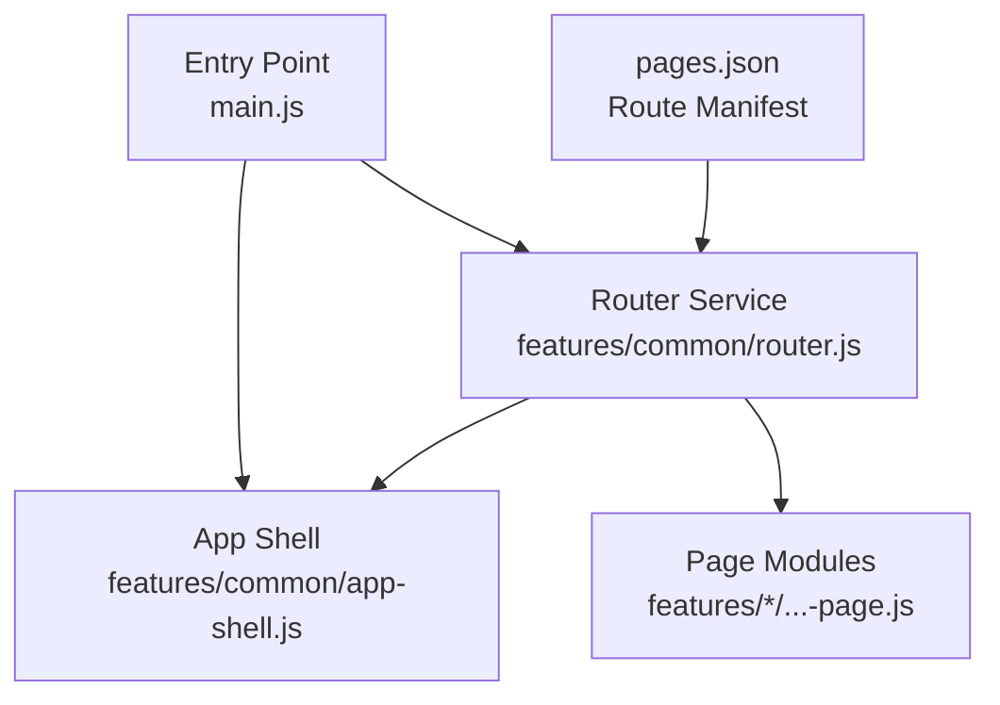
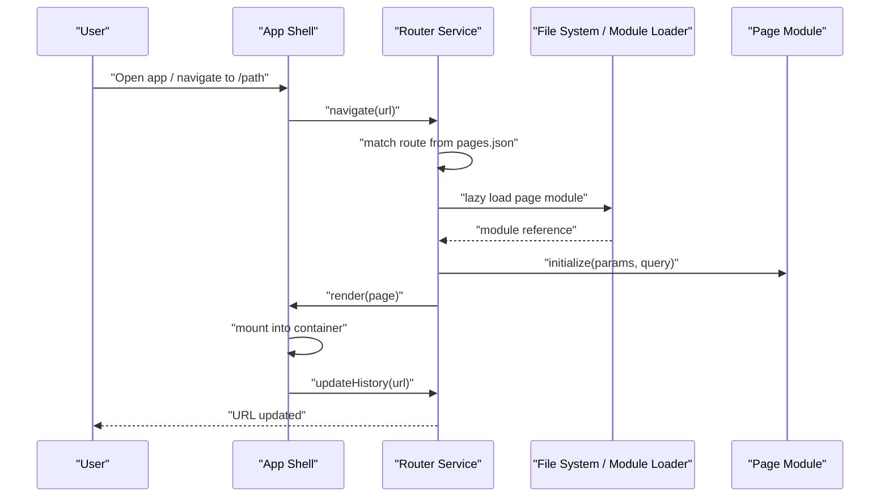
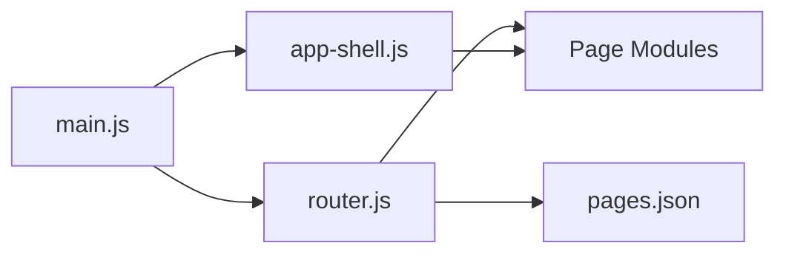

# Routing & Navigation

<cite>
**Referenced Files in This Document**
- [pages.json](file://pages.json)
- [router.js](file://features/common/router.js)
- [main.js](file://main.js)
- [app-shell.js](file://features/common/app-shell.js)
- [calendar-page.js](file://features/calendar/calendar-page.js)
- [gold-page.js](file://features/gold/gold-page.js)
- [more-page.js](file://features/more/more-page.js)
- [past-page.js](file://features/positions/past-page.js)
- [trades-page.js](file://features/positions/trades-page.js)
- [trade-detail-page.js](file://features/positions/trade-detail-page.js)
- [watchlist-page.js](file://features/watchlist/watchlist-page.js)
</cite>

## Table of Contents
1. [Introduction](#introduction)
2. [Project Structure](#project-structure)
3. [Core Components](#core-components)
4. [Architecture Overview](#architecture-overview)
5. [Detailed Component Analysis](#detailed-component-analysis)
6. [Dependency Analysis](#dependency-analysis)
7. [Performance Considerations](#performance-considerations)
8. [Troubleshooting Guide](#troubleshooting-guide)
9. [Conclusion](#conclusion)

## Introduction
This document describes the routing and navigation system used by MTF Monitor. It explains how routes are declared, registered, and resolved at runtime; how pages are loaded lazily; how URL parameters and query strings are handled; and how navigation state is managed across the application. It also covers route guards, navigation events, deep linking, history management, back button behavior, and mobile-friendly navigation patterns. Practical examples show how to add new routes, implement code splitting per route, and handle deep links.

## Project Structure
The routing subsystem is centered around a declarative configuration file and a lightweight router service:
- Route definitions live in a single JSON manifest that maps URL paths to page modules.
- The router service reads this manifest, resolves page modules on demand, and orchestrates navigation.
- Pages are organized feature-by-feature under features/, each exposing a page module with lifecycle hooks for mounting/unmounting.
- The application shell integrates the router into the UI and manages the active view container.

**Diagram sources**
- [pages.json](file://pages.json)
- [router.js](file://features/common/router.js)
- [app-shell.js](file://features/common/app-shell.js)
- [main.js](file://main.js)

**Section sources**
- [pages.json](file://pages.json)
- [router.js](file://features/common/router.js)
- [app-shell.js](file://features/common/app-shell.js)
- [main.js](file://main.js)

## Core Components
- Route Manifest (pages.json): Declares all available routes, their path patterns, and metadata such as lazy loading flags and optional guards.
- Router Service (features/common/router.js): Parses the manifest, registers routes, resolves dynamic segments, loads page modules on demand, and exposes navigation APIs.
- App Shell (features/common/app-shell.js): Hosts the router, renders the current page into a container, and coordinates global navigation behaviors like back handling.
- Page Modules (features/*/-page.js): Each page exports a minimal interface recognized by the router (e.g., mount, unmount, render).

Key responsibilities:
- Declarative route registration via pages.json.
- Lazy loading of page modules to reduce initial bundle size.
- Centralized navigation API and event emission.
- URL parameter extraction and query string parsing.
- Optional route guards for authorization or preconditions.
- History-aware navigation with back button support.

**Section sources**
- [pages.json](file://pages.json)
- [router.js](file://features/common/router.js)
- [app-shell.js](file://features/common/app-shell.js)

## Architecture Overview
The routing architecture follows a simple, extensible pattern:
- At startup, main.js initializes the app shell and router.
- The router reads pages.json to build an internal route table.
- When navigating, the router matches the target URL, resolves any dynamic segments, and lazily imports the corresponding page module.
- The app shell mounts the page into the DOM and updates the browser history.
- Global listeners handle back/forward and deep link entry points.

**Diagram sources**
- [main.js](file://main.js)
- [router.js](file://features/common/router.js)
- [app-shell.js](file://features/common/app-shell.js)

## Detailed Component Analysis

### Route Manifest (pages.json)
Purpose:
- Central source of truth for all routes.
- Defines path patterns, including dynamic segments and optional query parameters.
- Indicates whether a route should be lazy-loaded and any guard requirements.

Typical fields:
- id: Unique identifier for the route.
- path: URL path pattern (supports dynamic segments).
- module: Path to the page module relative to the project root.
- lazy: Boolean flag to enable on-demand loading.
- guards: Array of guard names to run before rendering.
- title: Human-readable title for the page.
- params: Parameter schema describing expected URL parameters.

Usage:
- Add a new route by appending an object to the manifest with the required fields.
- Use dynamic segments in the path (for example, /detail/:id) and define them in params.
- Set lazy to true for large pages to improve initial load time.

Examples:
- Adding a new route:
  - Create a page module under features/.
  - Add an entry in pages.json pointing to the module path and set lazy to true.
  - Ensure the path includes any necessary dynamic segments.

- Implementing route-based code splitting:
  - Keep heavy dependencies inside the page module.
  - Mark the route as lazy so the module is only fetched when navigated to.

- Handling deep linking:
  - Ensure the path pattern matches the desired URL structure.
  - Provide default values in params if needed for missing segments.

**Section sources**
- [pages.json](file://pages.json)

### Router Service (features/common/router.js)
Responsibilities:
- Load and parse pages.json at initialization.
- Build a normalized route table supporting static and dynamic segments.
- Provide navigation methods (push, replace, goBack, etc.).
- Emit navigation events (beforeEnter, afterLeave, etc.) for guards and analytics.
- Resolve URL parameters and query strings into structured objects.
- Lazily import page modules based on route configuration.
- Manage browser history integration and synchronization.

Key concepts:
- Route matching:
  - Static paths match exactly.
  - Dynamic segments are extracted and validated against the route’s param schema.
- Lazy loading:
  - If a route is marked lazy, the router dynamically imports the module only when needed.
- Guards:
  - Before entering a route, the router runs configured guards.
  - Guards can abort navigation, redirect, or allow it to proceed.
- Events:
  - beforeEnter: Run guards and preflight checks.
  - afterEnter: Post-mount side effects (analytics, focus management).
  - beforeLeave: Cleanup or confirmation prompts.
  - afterLeave: Finalize cleanup.

Navigation API:
- navigate(targetUrl, options?): Push or replace navigation with optional state.
- goBack(): Navigate to previous history entry.
- getCurrent(): Return current route info (matched route, params, query, url).
- subscribe(listener): Subscribe to navigation events.

URL parameter handling:
- Extracts dynamic segments from the URL path.
- Parses query strings into a key-value map.
- Validates types and provides defaults where defined.

Error handling:
- Unknown routes fall back to a configured not-found handler.
- Guard failures can redirect to an error or login route.
- Lazy load failures trigger a retry or fallback UI.

**Section sources**
- [router.js](file://features/common/router.js)

### App Shell (features/common/app-shell.js)
Responsibilities:
- Initialize the router and connect it to the DOM.
- Maintain a single active page container.
- Handle global keyboard shortcuts and hardware back buttons on mobile.
- Coordinate transitions between pages (fade, slide) if implemented.

Integration points:
- On first load, reads the initial URL and triggers the router.
- Listens for popstate to update internal state on back/forward.
- Exposes a simple API for components to request navigation without direct router access.

Mobile navigation patterns:
- Back button handling delegates to the router’s history stack.
- Swipe-to-back gestures can be wired to goBack() if supported by the platform.
- Fullscreen modal-like pages can push a new route while preserving the previous one.

**Section sources**
- [app-shell.js](file://features/common/app-shell.js)

### Page Modules (examples)
Each page module typically exports:
- mount(container, params, query): Render content into the provided container.
- unmount(): Clean up listeners, timers, and subscriptions.
- Optional: getInitialData(params, query) for data prefetching.

Examples:
- Calendar page: features/calendar/calendar-page.js
- Gold page: features/gold/gold-page.js
- More settings: features/more/more-page.js
- Positions list/detail: features/positions/trades-page.js, features/positions/trade-detail-page.js, features/positions/past-page.js
- Watchlist: features/watchlist/watchlist-page.js

Best practices:
- Keep page modules small and focused.
- Defer heavy work until mount or afterEnter.
- Always clean up in unmount or beforeLeave to prevent memory leaks.

**Section sources**
- [calendar-page.js](file://features/calendar/calendar-page.js)
- [gold-page.js](file://features/gold/gold-page.js)
- [more-page.js](file://features/more/more-page.js)
- [trades-page.js](file://features/positions/trades-page.js)
- [trade-detail-page.js](file://features/positions/trade-detail-page.js)
- [past-page.js](file://features/positions/past-page.js)
- [watchlist-page.js](file://features/watchlist/watchlist-page.js)

### Entry Point (main.js)
Responsibilities:
- Bootstrap the application shell and router.
- Configure initial route based on the current URL.
- Attach global error handlers and analytics hooks.

Initialization flow:
- Load core libraries and styles.
- Instantiate the app shell.
- Start the router with pages.json.
- Navigate to the initial route.

**Section sources**
- [main.js](file://main.js)

## Dependency Analysis
High-level relationships:
- main.js depends on the app shell and router.
- The app shell hosts the router and renders page modules.
- The router depends on pages.json and lazily loads page modules.
- Page modules may depend on feature-specific services and repositories.

**Diagram sources**
- [main.js](file://main.js)
- [app-shell.js](file://features/common/app-shell.js)
- [router.js](file://features/common/router.js)
- [pages.json](file://pages.json)

**Section sources**
- [main.js](file://main.js)
- [app-shell.js](file://features/common/app-shell.js)
- [router.js](file://features/common/router.js)
- [pages.json](file://pages.json)

## Performance Considerations
- Lazy loading:
  - Enable lazy for large pages to reduce initial payload.
  - Group related routes to minimize chunk fragmentation.
- Prefetching:
  - Preload likely next routes during idle time or on hover/focus.
- Data fetching:
  - Defer heavy network calls until afterEnter or within the page module.
- Memory management:
  - Unsubscribe from events and cancel timers in unmount/beforeLeave.
- Transition costs:
  - Avoid expensive DOM operations during route transitions; use CSS transitions where possible.

[No sources needed since this section provides general guidance]

## Troubleshooting Guide
Common issues and resolutions:
- Route not found:
  - Verify the path exists in pages.json and matches the current URL.
  - Check dynamic segment names and order.
- Params not parsed:
  - Ensure the route defines the expected params and the URL contains the segments.
  - Validate query string keys and encoding.
- Guard blocking navigation:
  - Inspect guard logic for redirects or abort conditions.
  - Log guard inputs and outcomes for debugging.
- Lazy load failure:
  - Confirm the module path in pages.json is correct.
  - Handle network errors and provide a retry mechanism.
- Back button not working:
  - Ensure the app shell listens to popstate and delegates to the router.
  - Verify no custom handlers are preventing default behavior.

Operational tips:
- Use the router’s getCurrent() to log the active route during development.
- Subscribe to navigation events to capture full transition flows.
- Wrap lazy imports in try/catch and display a friendly fallback.

**Section sources**
- [router.js](file://features/common/router.js)
- [app-shell.js](file://features/common/app-shell.js)

## Conclusion
MTF Monitor’s routing system is built around a declarative manifest and a lightweight router service that supports dynamic segments, lazy loading, guards, and rich navigation events. By centralizing route configuration and enforcing consistent page interfaces, the system remains scalable and maintainable. Following the guidelines here will help you add new routes, implement code splitting, handle deep links, and deliver smooth navigation experiences across desktop and mobile.