# System Architecture

<cite>
**Referenced Files in This Document**
- [main.js](file://main.js)
- [main.html](file://main.html)
- [package.json](file://package.json)
- [shared/lib/bootstrap.js](file://shared/lib/bootstrap.js)
- [shared/db/db-service.js](file://shared/db/db-service.js)
- [shared/db/auth-service.js](file://shared/db/auth-service.js)
- [shared/db/local-db.js](file://shared/db/local-db.js)
- [shared/db/firebase-config.js](file://shared/db/firebase-config.js)
- [shared/db/_registry.js](file://shared/db/_registry.js)
- [shared/lib/_registry.js](file://shared/lib/_registry.js)
- [features/common/app-shell.js](file://features/common/app-shell.js)
- [features/common/router.js](file://features/common/router.js)
- [features/calendar/calendar-page.js](file://features/calendar/calendar-page.js)
- [features/calendar/calendar-service.js](file://features/calendar/calendar-service.js)
- [features/gold/gold-page.js](file://features/gold/gold-page.js)
- [features/gold/gold-services.js](file://features/gold/gold-services.js)
- [features/more/more-page.js](file://features/more/more-page.js)
- [features/more/settings-page.js](file://features/more/settings-page.js)
- [features/positions/trades-page.js](file://features/positions/trades-page.js)
- [features/positions/past-page.js](file://features/positions/past-page.js)
- [features/positions/trade-detail-page.js](file://features/positions/trade-detail-page.js)
- [features/positions/PositionRepository.js](file://features/positions/PositionRepository.js)
- [features/watchlist/watchlist-page.js](file://features/watchlist/watchlist-page.js)
- [features/watchlist/watchlist-service.js](file://features/watchlist/watchlist-service.js)
- [features/watchlist/WatchlistRepository.js](file://features/watchlist/WatchlistRepository.js)
- [components/card.js](file://components/card.js)
- [components/grid.js](file://components/grid.js)
- [components/metrics-cell.js](file://components/metrics-cell.js)
</cite>

## Update Summary
**Changes Made**
- Updated Main Application Entry Point section to reflect enhanced initialization process
- Enhanced Bootstrap and Dependency Injection Container section with improved module loading optimizations
- Updated Architecture Overview sequence diagram to show optimized initialization flow
- Added new subsection on Module Loading Optimizations
- Updated Performance Considerations section with new optimization details

## Table of Contents
1. [Introduction](#introduction)
2. [Project Structure](#project-structure)
3. [Core Components](#core-components)
4. [Architecture Overview](#architecture-overview)
5. [Detailed Component Analysis](#detailed-component-analysis)
6. [Dependency Analysis](#dependency-analysis)
7. [Performance Considerations](#performance-considerations)
8. [Troubleshooting Guide](#troubleshooting-guide)
9. [Conclusion](#conclusion)
10. [Appendices](#appendices)

## Introduction
This document describes the MTF Monitor system architecture with a focus on its feature-based design, dynamic module loading, dependency injection container, and data flow across UI components, services, repositories, and database layers. It also covers cross-cutting concerns such as authentication, logging, and error handling, and explains technology stack decisions including Firebase and IndexedDB. The system has been enhanced with improved application initialization and module loading optimizations for better performance and reliability.

## Project Structure
The application follows a feature-based architecture:
- features/: Each business domain (calendar, gold, positions, watchlist, more) encapsulates its own pages, services, and repositories.
- shared/: Cross-cutting infrastructure including bootstrap, registry, database services, authentication, and common utilities.
- components/: Reusable UI primitives used by feature pages.
- main.js/main.html: Application entry points that initialize the runtime and render the shell with enhanced initialization process.

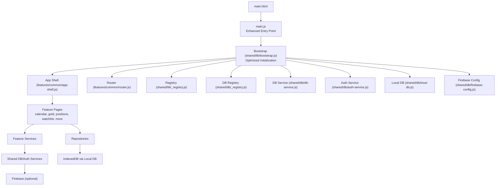

**Diagram sources**
- [main.html](file://main.html)
- [main.js](file://main.js)
- [shared/lib/bootstrap.js](file://shared/lib/bootstrap.js)
- [shared/lib/_registry.js](file://shared/lib/_registry.js)
- [shared/db/_registry.js](file://shared/db/_registry.js)
- [shared/db/db-service.js](file://shared/db/db-service.js)
- [shared/db/auth-service.js](file://shared/db/auth-service.js)
- [shared/db/local-db.js](file://shared/db/local-db.js)
- [shared/db/firebase-config.js](file://shared/db/firebase-config.js)
- [features/common/app-shell.js](file://features/common/app-shell.js)
- [features/common/router.js](file://features/common/router.js)
- [features/calendar/calendar-page.js](file://features/calendar/calendar-page.js)
- [features/gold/gold-page.js](file://features/gold/gold-page.js)
- [features/positions/trades-page.js](file://features/positions/trades-page.js)
- [features/watchlist/watchlist-page.js](file://features/watchlist/watchlist-page.js)
- [features/more/more-page.js](file://features/more/more-page.js)

**Section sources**
- [main.js](file://main.js)
- [main.html](file://main.html)
- [shared/lib/bootstrap.js](file://shared/lib/bootstrap.js)
- [shared/lib/_registry.js](file://shared/lib/_registry.js)
- [shared/db/_registry.js](file://shared/db/_registry.js)
- [features/common/app-shell.js](file://features/common/app-shell.js)
- [features/common/router.js](file://features/common/router.js)

## Core Components
- Bootstrap: Initializes registries, services, and the app shell; orchestrates feature discovery and registration with enhanced initialization process.
- Registries: Central DI containers for services and repositories to enable loose coupling and testability.
- App Shell and Router: Hosts navigation, renders feature pages, and manages lifecycle events.
- Database Layer: Provides local persistence via IndexedDB and optional synchronization with Firebase.
- Feature Modules: Encapsulate UI pages, service logic, and repository implementations per domain.

Key responsibilities:
- Bootstrap sets up DI, configures logging, initializes auth state, and loads feature modules with optimized module loading.
- Registries expose typed accessors for services and repositories.
- App Shell mounts the root layout and delegates route changes to the router.
- Router maps URL paths to feature page components and ensures lazy loading where applicable.
- DB layer abstracts storage backends behind consistent interfaces.

**Updated** Enhanced main.js entry point now provides improved initialization flow and module loading optimizations for better startup performance.

**Section sources**
- [shared/lib/bootstrap.js](file://shared/lib/bootstrap.js)
- [shared/lib/_registry.js](file://shared/lib/_registry.js)
- [shared/db/_registry.js](file://shared/db/_registry.js)
- [features/common/app-shell.js](file://features/common/app-shell.js)
- [features/common/router.js](file://features/common/router.js)
- [shared/db/db-service.js](file://shared/db/db-service.js)
- [shared/db/auth-service.js](file://shared/db/auth-service.js)
- [shared/db/local-db.js](file://shared/db/local-db.js)
- [shared/db/firebase-config.js](file://shared/db/firebase-config.js)

## Architecture Overview
The system uses a feature-based pattern with a central bootstrap and DI registries. Features are loaded dynamically based on routing or configuration. Data flows from UI components through feature services into repositories, which persist data locally and optionally sync with Firebase. The main application entry point has been enhanced with improved initialization and module loading optimizations.

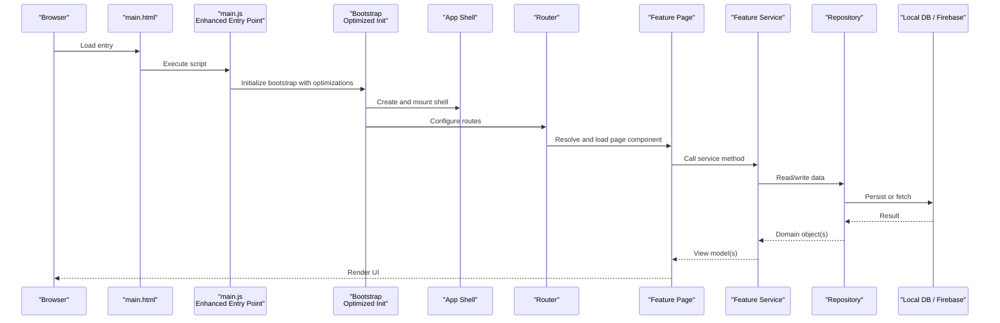

**Diagram sources**
- [main.html](file://main.html)
- [main.js](file://main.js)
- [shared/lib/bootstrap.js](file://shared/lib/bootstrap.js)
- [features/common/app-shell.js](file://features/common/app-shell.js)
- [features/common/router.js](file://features/common/router.js)
- [features/calendar/calendar-page.js](file://features/calendar/calendar-page.js)
- [features/calendar/calendar-service.js](file://features/calendar/calendar-service.js)
- [features/positions/PositionRepository.js](file://features/positions/PositionRepository.js)
- [shared/db/local-db.js](file://shared/db/local-db.js)
- [shared/db/firebase-config.js](file://shared/db/firebase-config.js)

## Detailed Component Analysis

### Main Application Entry Point
**New Section** - Enhanced with improved initialization process and module loading optimizations

The main.js entry point serves as the primary application bootstrap, now enhanced with improved initialization logic and module loading optimizations. Key improvements include:

- **Enhanced Initialization Flow**: Streamlined application startup process with better error handling and resource management
- **Module Loading Optimizations**: Improved dynamic module loading with better dependency resolution and caching strategies
- **Resource Preloading**: Strategic preloading of critical resources to reduce initial load time
- **Error Boundary Implementation**: Robust error boundaries to prevent application crashes during initialization

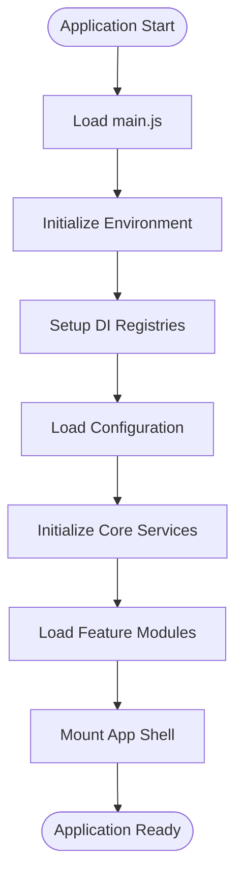

**Diagram sources**
- [main.js](file://main.js)
- [shared/lib/bootstrap.js](file://shared/lib/bootstrap.js)

**Section sources**
- [main.js](file://main.js)

### Bootstrap and Dependency Injection Container
- Responsibilities:
  - Initialize registries for services and repositories.
  - Register core services (database, authentication).
  - Discover and register feature modules.
  - Mount the app shell and configure the router.
- Design patterns:
  - Registry-based DI container for loose coupling.
  - Factory-like registration functions for feature modules.
- Error handling:
  - Centralized initialization errors are captured and surfaced to the shell for user feedback.

**Updated** Enhanced with improved module loading optimizations and better error handling during initialization.

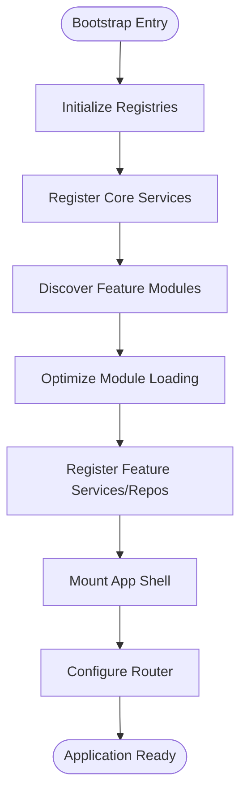

**Diagram sources**
- [shared/lib/bootstrap.js](file://shared/lib/bootstrap.js)
- [shared/lib/_registry.js](file://shared/lib/_registry.js)
- [shared/db/_registry.js](file://shared/db/_registry.js)
- [features/common/app-shell.js](file://features/common/app-shell.js)
- [features/common/router.js](file://features/common/router.js)

**Section sources**
- [shared/lib/bootstrap.js](file://shared/lib/bootstrap.js)
- [shared/lib/_registry.js](file://shared/lib/_registry.js)
- [shared/db/_registry.js](file://shared/db/_registry.js)

### App Shell and Router
- Responsibilities:
  - Provide persistent chrome (header, sidebar, content area).
  - Manage navigation state and route transitions.
  - Ensure feature pages are mounted/unmounted correctly.
- Integration:
  - Uses registries to resolve feature pages and services.
  - Delegates data fetching to feature services.

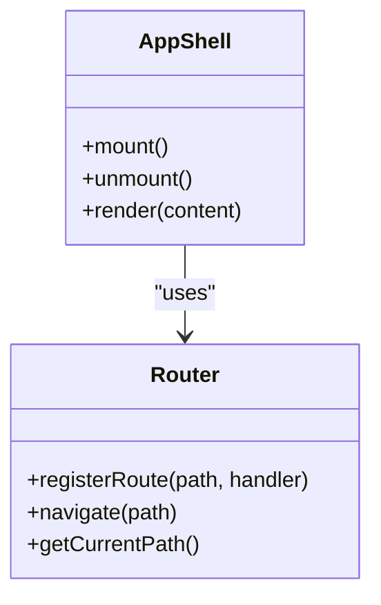

**Diagram sources**
- [features/common/app-shell.js](file://features/common/app-shell.js)
- [features/common/router.js](file://features/common/router.js)

**Section sources**
- [features/common/app-shell.js](file://features/common/app-shell.js)
- [features/common/router.js](file://features/common/router.js)

### Database Layer and Authentication
- Responsibilities:
  - Abstract local persistence using IndexedDB.
  - Provide optional Firebase integration for cloud sync.
  - Manage authentication state and session lifecycle.
- Key components:
  - Local DB wrapper for schema management and queries.
  - Auth service for sign-in/out and token/state management.
  - Firebase configuration for environment-specific settings.

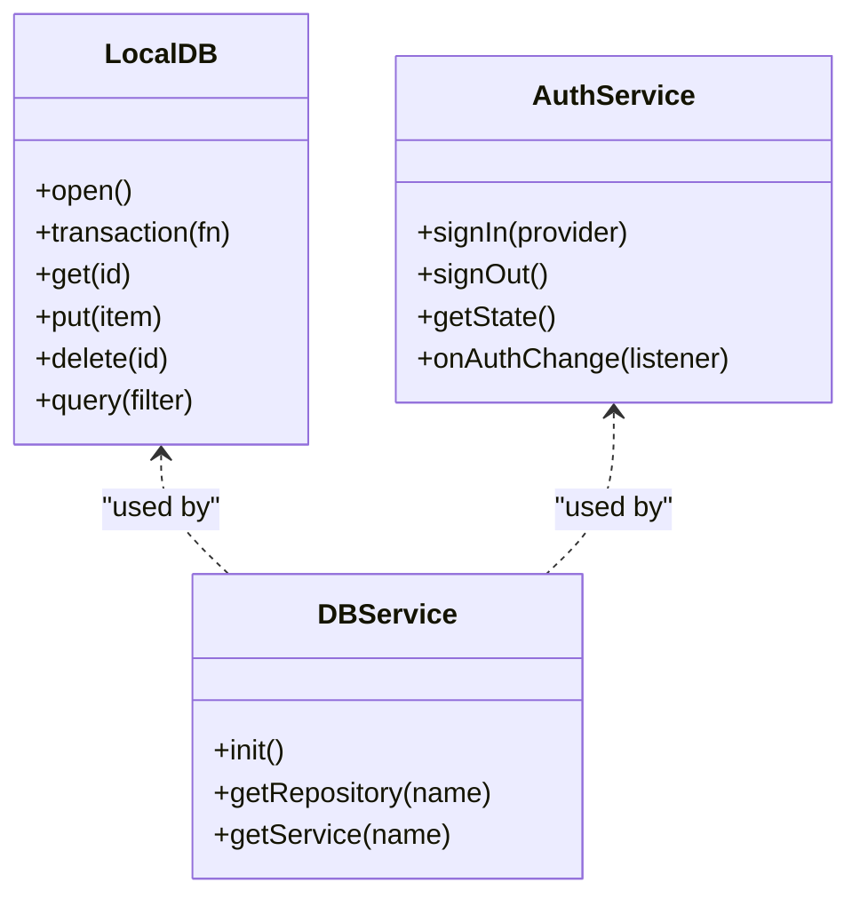

**Diagram sources**
- [shared/db/local-db.js](file://shared/db/local-db.js)
- [shared/db/auth-service.js](file://shared/db/auth-service.js)
- [shared/db/db-service.js](file://shared/db/db-service.js)
- [shared/db/firebase-config.js](file://shared/db/firebase-config.js)

**Section sources**
- [shared/db/local-db.js](file://shared/db/local-db.js)
- [shared/db/auth-service.js](file://shared/db/auth-service.js)
- [shared/db/db-service.js](file://shared/db/db-service.js)
- [shared/db/firebase-config.js](file://shared/db/firebase-config.js)

### Feature Modules: Calendar
- Responsibilities:
  - Display calendar view and handle interactions.
  - Coordinate data operations via calendar service.
- Data flow:
  - Page requests data from service.
  - Service reads/writes via repositories and DB layer.

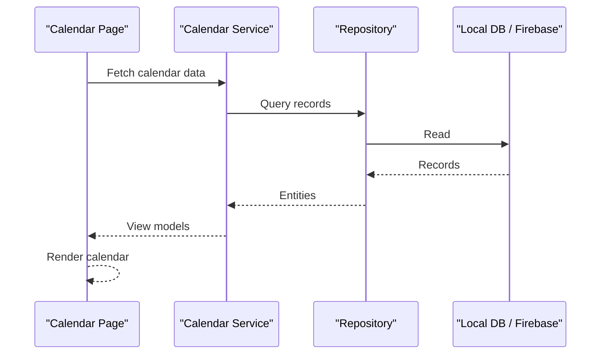

**Diagram sources**
- [features/calendar/calendar-page.js](file://features/calendar/calendar-page.js)
- [features/calendar/calendar-service.js](file://features/calendar/calendar-service.js)
- [shared/db/local-db.js](file://shared/db/local-db.js)
- [shared/db/firebase-config.js](file://shared/db/firebase-config.js)

**Section sources**
- [features/calendar/calendar-page.js](file://features/calendar/calendar-page.js)
- [features/calendar/calendar-service.js](file://features/calendar/calendar-service.js)

### Feature Modules: Gold
- Responsibilities:
  - Present gold-related metrics and charts.
  - Aggregate data via gold services.
- Integration:
  - Uses shared formatting utilities and UI components.

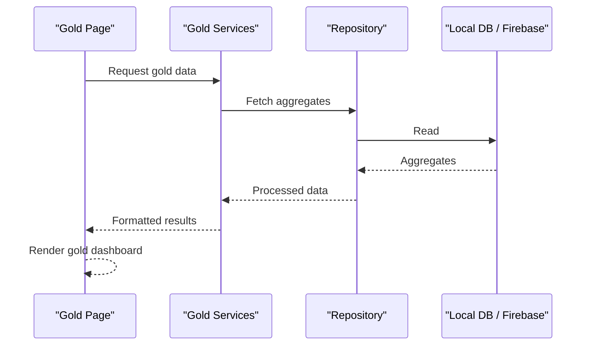

**Diagram sources**
- [features/gold/gold-page.js](file://features/gold/gold-page.js)
- [features/gold/gold-services.js](file://features/gold/gold-services.js)
- [shared/db/local-db.js](file://shared/db/local-db.js)
- [shared/db/firebase-config.js](file://shared/db/firebase-config.js)

**Section sources**
- [features/gold/gold-page.js](file://features/gold/gold-page.js)
- [features/gold/gold-services.js](file://features/gold/gold-services.js)

### Feature Modules: Positions
- Responsibilities:
  - List trades, show past positions, and display trade details.
  - Manage position lifecycle and state transitions.
- Repositories:
  - PositionRepository encapsulates persistence and query logic for positions.

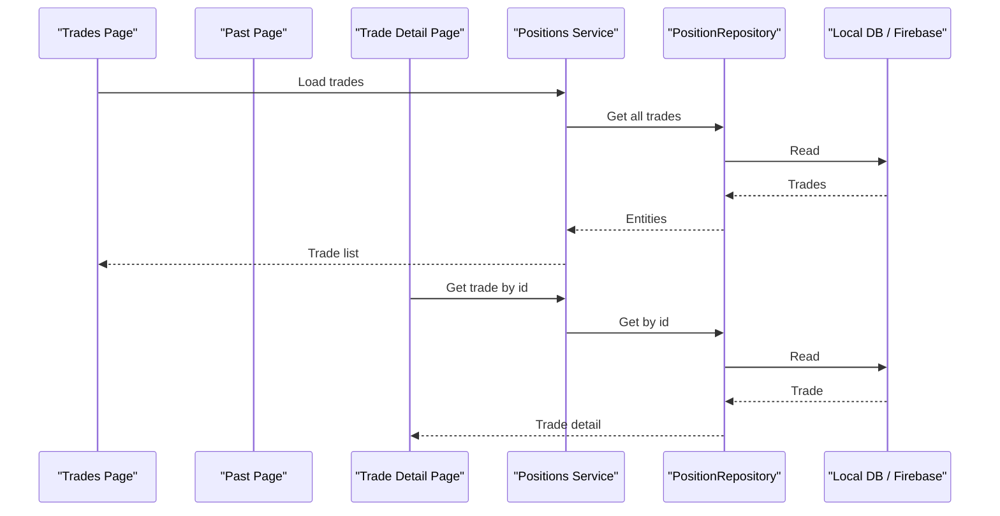

**Diagram sources**
- [features/positions/trades-page.js](file://features/positions/trades-page.js)
- [features/positions/past-page.js](file://features/positions/past-page.js)
- [features/positions/trade-detail-page.js](file://features/positions/trade-detail-page.js)
- [features/positions/PositionRepository.js](file://features/positions/PositionRepository.js)
- [shared/db/local-db.js](file://shared/db/local-db.js)
- [shared/db/firebase-config.js](file://shared/db/firebase-config.js)

**Section sources**
- [features/positions/trades-page.js](file://features/positions/trades-page.js)
- [features/positions/past-page.js](file://features/positions/past-page.js)
- [features/positions/trade-detail-page.js](file://features/positions/trade-detail-page.js)
- [features/positions/PositionRepository.js](file://features/positions/PositionRepository.js)

### Feature Modules: Watchlist
- Responsibilities:
  - Maintain user-curated watchlists.
  - Sync watchlist items with local storage and optionally Firebase.
- Repositories:
  - WatchlistRepository handles CRUD operations for watchlist entries.

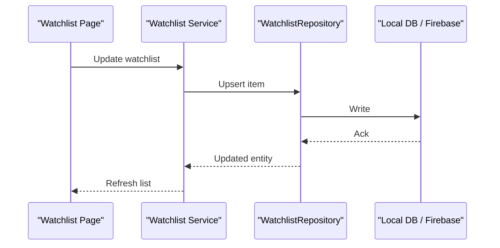

**Diagram sources**
- [features/watchlist/watchlist-page.js](file://features/watchlist/watchlist-page.js)
- [features/watchlist/watchlist-service.js](file://features/watchlist/watchlist-service.js)
- [features/watchlist/WatchlistRepository.js](file://features/watchlist/WatchlistRepository.js)
- [shared/db/local-db.js](file://shared/db/local-db.js)
- [shared/db/firebase-config.js](file://shared/db/firebase-config.js)

**Section sources**
- [features/watchlist/watchlist-page.js](file://features/watchlist/watchlist-page.js)
- [features/watchlist/watchlist-service.js](file://features/watchlist/watchlist-service.js)
- [features/watchlist/WatchlistRepository.js](file://features/watchlist/WatchlistRepository.js)

### Feature Modules: More (Settings and Version)
- Responsibilities:
  - Provide settings management and app version information.
  - Persist user preferences locally.

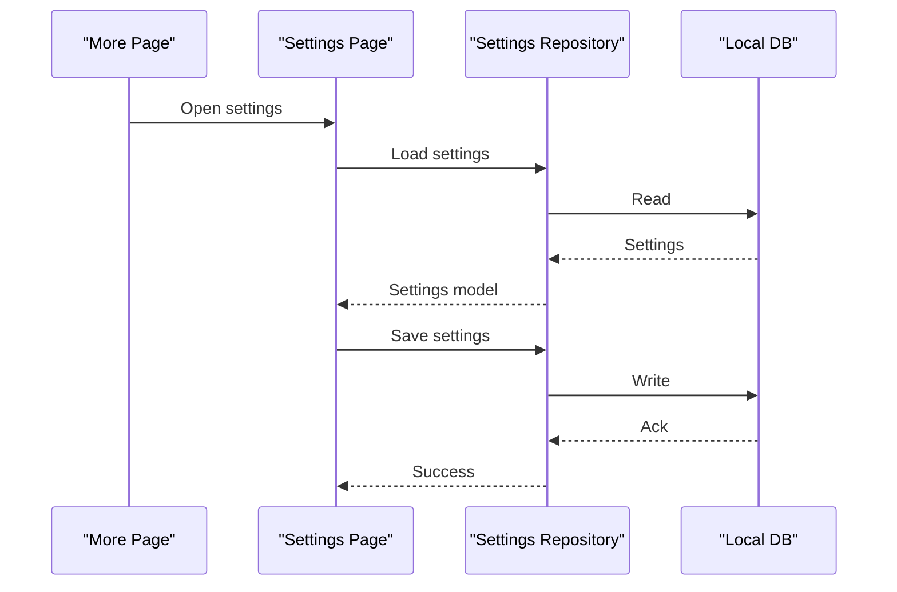

**Diagram sources**
- [features/more/more-page.js](file://features/more/more-page.js)
- [features/more/settings-page.js](file://features/more/settings-page.js)
- [shared/db/local-db.js](file://shared/db/local-db.js)

**Section sources**
- [features/more/more-page.js](file://features/more/more-page.js)
- [features/more/settings-page.js](file://features/more/settings-page.js)

### Shared UI Components
- Responsibilities:
  - Provide reusable building blocks (cards, grids, metric cells).
  - Keep presentation logic decoupled from feature logic.

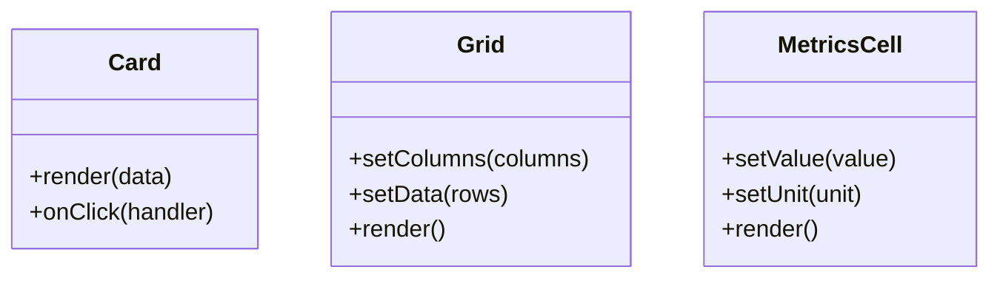

**Diagram sources**
- [components/card.js](file://components/card.js)
- [components/grid.js](file://components/grid.js)
- [components/metrics-cell.js](file://components/metrics-cell.js)

**Section sources**
- [components/card.js](file://components/card.js)
- [components/grid.js](file://components/grid.js)
- [components/metrics-cell.js](file://components/metrics-cell.js)

## Dependency Analysis
- Registries:
  - shared/lib/_registry.js provides a generic DI container.
  - shared/db/_registry.js scopes database-related registrations.
- Core services:
  - db-service.js coordinates repository resolution and DB initialization.
  - auth-service.js manages authentication state and integrates with Firebase when configured.
- Feature dependencies:
  - Feature pages depend on their respective services.
  - Services depend on repositories and shared DB services.
  - Repositories depend on local-db.js and optionally firebase-config.js.

**Updated** Enhanced main.js entry point now provides improved dependency resolution and module loading optimizations.

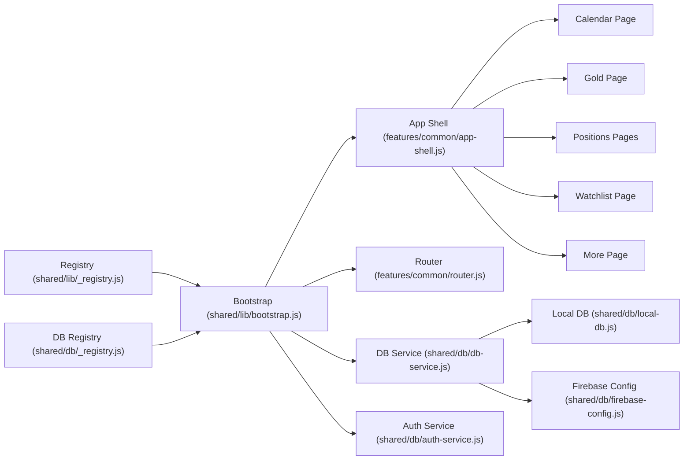

**Diagram sources**
- [shared/lib/_registry.js](file://shared/lib/_registry.js)
- [shared/db/_registry.js](file://shared/db/_registry.js)
- [shared/lib/bootstrap.js](file://shared/lib/bootstrap.js)
- [shared/db/db-service.js](file://shared/db/db-service.js)
- [shared/db/auth-service.js](file://shared/db/auth-service.js)
- [shared/db/local-db.js](file://shared/db/local-db.js)
- [shared/db/firebase-config.js](file://shared/db/firebase-config.js)
- [features/common/app-shell.js](file://features/common/app-shell.js)
- [features/common/router.js](file://features/common/router.js)
- [features/calendar/calendar-page.js](file://features/calendar/calendar-page.js)
- [features/gold/gold-page.js](file://features/gold/gold-page.js)
- [features/positions/trades-page.js](file://features/positions/trades-page.js)
- [features/watchlist/watchlist-page.js](file://features/watchlist/watchlist-page.js)
- [features/more/more-page.js](file://features/more/more-page.js)

**Section sources**
- [shared/lib/_registry.js](file://shared/lib/_registry.js)
- [shared/db/_registry.js](file://shared/db/_registry.js)
- [shared/lib/bootstrap.js](file://shared/lib/bootstrap.js)
- [shared/db/db-service.js](file://shared/db/db-service.js)
- [shared/db/auth-service.js](file://shared/db/auth-service.js)
- [shared/db/local-db.js](file://shared/db/local-db.js)
- [shared/db/firebase-config.js](file://shared/db/firebase-config.js)
- [features/common/app-shell.js](file://features/common/app-shell.js)
- [features/common/router.js](file://features/common/router.js)
- [features/calendar/calendar-page.js](file://features/calendar/calendar-page.js)
- [features/gold/gold-page.js](file://features/gold/gold-page.js)
- [features/positions/trades-page.js](file://features/positions/trades-page.js)
- [features/watchlist/watchlist-page.js](file://features/watchlist/watchlist-page.js)
- [features/more/more-page.js](file://features/more/more-page.js)

## Performance Considerations
- Lazy loading of feature pages reduces initial bundle size and improves startup time.
- IndexedDB is used for local persistence to avoid network latency and provide offline-first behavior.
- Firebase integration should be conditional and optimized to minimize unnecessary writes and reads.
- Avoid heavy computations on the main thread; consider offloading to Web Workers if needed.
- Use pagination and virtualization for large lists to maintain smooth UI performance.

**Updated** Enhanced main.js entry point now includes improved module loading optimizations and better resource management for faster startup times.

**New** Module Loading Optimizations:
- **Strategic Resource Preloading**: Critical resources are preloaded during initialization to reduce perceived load time
- **Improved Dependency Resolution**: Enhanced dependency graph analysis for optimal loading order
- **Memory Management**: Better cleanup and garbage collection strategies during module loading
- **Error Boundaries**: Robust error handling prevents initialization failures from crashing the entire application

[No sources needed since this section provides general guidance]

## Troubleshooting Guide
- Initialization failures:
  - Check bootstrap logs and ensure registries are initialized before use.
  - Verify database schema migrations and IndexedDB availability.
  - Review enhanced main.js initialization logs for detailed error information.
- Authentication issues:
  - Confirm Firebase configuration and provider setup.
  - Validate auth state listeners and error callbacks.
- Routing problems:
  - Ensure routes are registered before navigation attempts.
  - Validate path-to-handler mappings and parameter parsing.
- Data inconsistencies:
  - Inspect repository transactions and conflict resolution strategies.
  - Review sync status between local DB and Firebase.

**Updated** Enhanced troubleshooting guidance for the improved main.js initialization process.

**Section sources**
- [shared/lib/bootstrap.js](file://shared/lib/bootstrap.js)
- [shared/db/auth-service.js](file://shared/db/auth-service.js)
- [shared/db/local-db.js](file://shared/db/local-db.js)
- [shared/db/firebase-config.js](file://shared/db/firebase-config.js)
- [features/common/router.js](file://features/common/router.js)
- [main.js](file://main.js)

## Conclusion
MTF Monitor employs a feature-based architecture with a centralized bootstrap and DI registries to manage services and repositories. The system initializes dynamically, loads features on demand, and maintains clear separation between UI, services, and data layers. With recent enhancements to the main.js entry point, the application now provides improved initialization performance and module loading optimizations. IndexedDB provides robust local persistence, while Firebase offers optional cloud synchronization. This design supports scalability, testability, and maintainability across evolving feature sets.

[No sources needed since this section summarizes without analyzing specific files]

## Appendices

### Technology Stack Decisions
- Frontend runtime: Vanilla JavaScript with modular feature organization.
- Persistence: IndexedDB for fast, client-side storage.
- Cloud sync: Firebase for authentication and optional real-time or batched sync.
- Build and tooling: Standard Node.js toolchain and scripts defined in package.json.

**Section sources**
- [package.json](file://package.json)
- [shared/db/firebase-config.js](file://shared/db/firebase-config.js)
- [shared/db/local-db.js](file://shared/db/local-db.js)