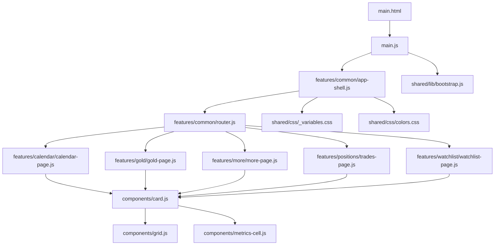
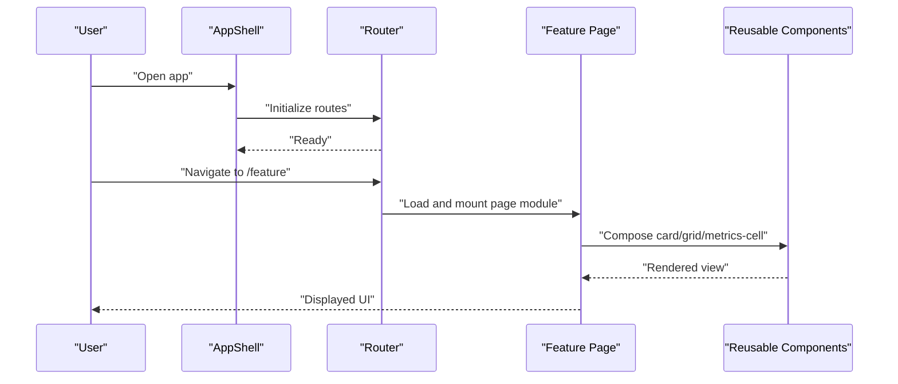
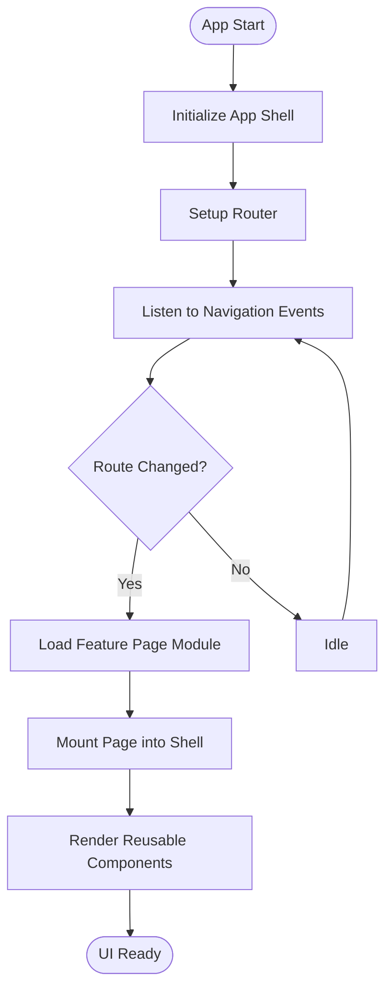
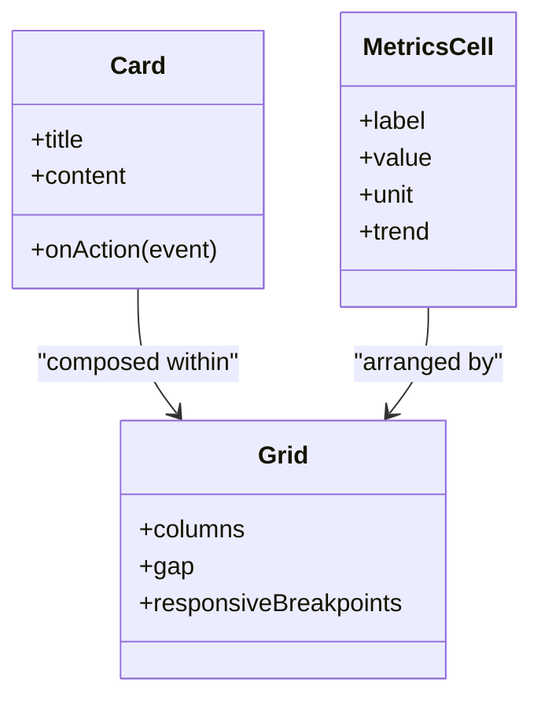
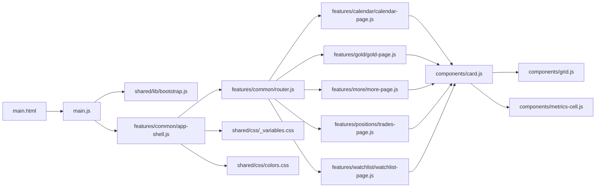

# UI Component Architecture

<cite>
**Referenced Files in This Document**
- [main.html](file://main.html)
- [main.js](file://main.js)
- [components/card.js](file://components/card.js)
- [components/grid.js](file://components/grid.js)
- [components/metrics-cell.js](file://components/metrics-cell.js)
- [features/common/app-shell.js](file://features/common/app-shell.js)
- [features/common/router.js](file://features/common/router.js)
- [features/calendar/calendar-page.js](file://features/calendar/calendar-page.js)
- [features/gold/gold-page.js](file://features/gold/gold-page.js)
- [features/more/more-page.js](file://features/more/more-page.js)
- [features/positions/trades-page.js](file://features/positions/trades-page.js)
- [features/watchlist/watchlist-page.js](file://features/watchlist/watchlist-page.js)
- [shared/css/_variables.css](file://shared/css/_variables.css)
- [shared/css/colors.css](file://shared/css/colors.css)
- [shared/lib/bootstrap.js](file://shared/lib/bootstrap.js)
</cite>

## Table of Contents
1. [Introduction](#introduction)
2. [Project Structure](#project-structure)
3. [Core Components](#core-components)
4. [Architecture Overview](#architecture-overview)
5. [Detailed Component Analysis](#detailed-component-analysis)
6. [Dependency Analysis](#dependency-analysis)
7. [Performance Considerations](#performance-considerations)
8. [Troubleshooting Guide](#troubleshooting-guide)
9. [Conclusion](#conclusion)
10. [Appendices](#appendices)

## Introduction
This document describes the UI component architecture of MTF Monitor with a focus on:
- Component-based design pattern and reusable component library structure
- App shell architecture and routing
- Component lifecycle management and event-driven communication
- State management, styling consistency, and responsive design patterns
- Guidelines for creating new components, testing strategies, and performance optimization
- Accessibility compliance, browser compatibility, and mobile-first principles

The goal is to provide both high-level architectural insight and practical guidance for extending and maintaining the UI layer.

## Project Structure
MTF Monitor organizes UI code into feature modules and shared components:
- features: Feature pages and their services (e.g., calendar, gold, more, positions, watchlist)
- components: Reusable UI primitives (card, grid, metrics cell)
- shared: Cross-cutting concerns including CSS variables, bootstrap utilities, and database abstractions
- main entry points: HTML shell and JS bootstrapper

**Diagram sources**
- [main.html](file://main.html)
- [main.js](file://main.js)
- [features/common/app-shell.js](file://features/common/app-shell.js)
- [features/common/router.js](file://features/common/router.js)
- [features/calendar/calendar-page.js](file://features/calendar/calendar-page.js)
- [features/gold/gold-page.js](file://features/gold/gold-page.js)
- [features/more/more-page.js](file://features/more/more-page.js)
- [features/positions/trades-page.js](file://features/positions/trades-page.js)
- [features/watchlist/watchlist-page.js](file://features/watchlist/watchlist-page.js)
- [components/card.js](file://components/card.js)
- [components/grid.js](file://components/grid.js)
- [components/metrics-cell.js](file://components/metrics-cell.js)
- [shared/css/_variables.css](file://shared/css/_variables.css)
- [shared/css/colors.css](file://shared/css/colors.css)
- [shared/lib/bootstrap.js](file://shared/lib/bootstrap.js)

**Section sources**
- [main.html](file://main.html)
- [main.js](file://main.js)
- [features/common/app-shell.js](file://features/common/app-shell.js)
- [features/common/router.js](file://features/common/router.js)
- [components/card.js](file://components/card.js)
- [components/grid.js](file://components/grid.js)
- [components/metrics-cell.js](file://components/metrics-cell.js)
- [shared/css/_variables.css](file://shared/css/_variables.css)
- [shared/css/colors.css](file://shared/css/colors.css)
- [shared/lib/bootstrap.js](file://shared/lib/bootstrap.js)

## Core Components
Reusable UI primitives are implemented as lightweight custom elements or composable modules:
- Card: Encapsulates a content container with consistent padding, borders, and elevation; used across feature pages to group related information.
- Grid: Provides layout control via columns and spacing tokens; supports responsive breakpoints defined in CSS variables.
- Metrics Cell: Displays a single metric value with label, unit, and optional trend indicator; designed for data-heavy dashboards.

These components:
- Expose configuration via attributes or properties
- Emit events for user interactions
- Compose together to build complex views without duplicating markup or logic

Guidelines:
- Keep components stateless where possible; accept props and emit events
- Use CSS variables from shared styles for colors, spacing, and typography
- Prefer composition over inheritance; combine small components to form larger ones

**Section sources**
- [components/card.js](file://components/card.js)
- [components/grid.js](file://components/grid.js)
- [components/metrics-cell.js](file://components/metrics-cell.js)
- [shared/css/_variables.css](file://shared/css/_variables.css)
- [shared/css/colors.css](file://shared/css/colors.css)

## Architecture Overview
The app follows an app shell + feature pages model:
- The app shell initializes global UI chrome and delegates page rendering to a router
- The router maps URL paths to feature page modules
- Feature pages compose reusable components to render domain-specific views
- Shared CSS variables ensure visual consistency across all components and pages

**Diagram sources**
- [features/common/app-shell.js](file://features/common/app-shell.js)
- [features/common/router.js](file://features/common/router.js)
- [features/calendar/calendar-page.js](file://features/calendar/calendar-page.js)
- [features/gold/gold-page.js](file://features/gold/gold-page.js)
- [features/more/more-page.js](file://features/more/more-page.js)
- [features/positions/trades-page.js](file://features/positions/trades-page.js)
- [features/watchlist/watchlist-page.js](file://features/watchlist/watchlist-page.js)
- [components/card.js](file://components/card.js)
- [components/grid.js](file://components/grid.js)
- [components/metrics-cell.js](file://components/metrics-cell.js)

## Detailed Component Analysis

### App Shell and Routing
Responsibilities:
- Initialize global UI chrome (header, navigation, footer)
- Manage application-wide state such as theme and language
- Delegate page rendering to the router based on current route
- Provide a stable mounting point for feature pages

Routing behavior:
- Maps URL paths to feature page modules
- Supports lazy loading of page modules to reduce initial payload
- Handles back/forward navigation by updating the active page

Lifecycle:
- Bootstraps once at app start
- Subscribes to navigation events
- Mounts/unmounts feature pages as routes change

**Diagram sources**
- [features/common/app-shell.js](file://features/common/app-shell.js)
- [features/common/router.js](file://features/common/router.js)

**Section sources**
- [features/common/app-shell.js](file://features/common/app-shell.js)
- [features/common/router.js](file://features/common/router.js)

### Feature Pages
Each feature page encapsulates a domain area and composes reusable components:
- Calendar page: Schedules and timeline visualization using cards and grids
- Gold page: Market overview and charts composed from metrics cells and cards
- More page: Settings and about sections built from cards
- Trades page: Trade list and details using cards and grids
- Watchlist page: Real-time watchlist items rendered with metrics cells and cards

Common patterns:
- Accept route parameters and query strings
- Fetch data through feature services and update local state
- Render by composing reusable components
- Emit events for cross-feature actions (e.g., opening a trade detail modal)

**Section sources**
- [features/calendar/calendar-page.js](file://features/calendar/calendar-page.js)
- [features/gold/gold-page.js](file://features/gold/gold-page.js)
- [features/more/more-page.js](file://features/more/more-page.js)
- [features/positions/trades-page.js](file://features/positions/trades-page.js)
- [features/watchlist/watchlist-page.js](file://features/watchlist/watchlist-page.js)

### Reusable Components Library
Reusable components follow a consistent API:
- Properties/attributes for configuration
- Events for user interactions
- Slots or child composition for flexible layouts
- Styling via CSS variables for theming and responsiveness

Composition strategy:
- Cards wrap content blocks consistently
- Grids arrange cards and metrics cells responsively
- Metrics cells display numeric values with labels and units

**Diagram sources**
- [components/card.js](file://components/card.js)
- [components/grid.js](file://components/grid.js)
- [components/metrics-cell.js](file://components/metrics-cell.js)

**Section sources**
- [components/card.js](file://components/card.js)
- [components/grid.js](file://components/grid.js)
- [components/metrics-cell.js](file://components/metrics-cell.js)

### Styling System and Responsive Design
Styling is centralized through CSS variables:
- Colors: semantic tokens for primary, secondary, success, warning, error
- Spacing: scale for margins, paddings, gaps
- Typography: font families, sizes, weights
- Breakpoints: min-width rules for mobile-first responsive layouts

Principles:
- Mobile-first: base styles target small screens; enhancements apply at larger breakpoints
- Consistency: reuse tokens instead of hardcoding values
- Theming: override variables to support dark mode or brand variants

**Section sources**
- [shared/css/_variables.css](file://shared/css/_variables.css)
- [shared/css/colors.css](file://shared/css/colors.css)

### Bootstrap and Initialization
The bootstrap utility coordinates early initialization:
- Loads shared CSS assets
- Registers custom elements if needed
- Sets up global listeners and environment flags
- Ensures DOM readiness before mounting the app shell

**Section sources**
- [shared/lib/bootstrap.js](file://shared/lib/bootstrap.js)
- [main.js](file://main.js)
- [main.html](file://main.html)

## Dependency Analysis
High-level dependencies among UI layers:
- main.html loads main.js
- main.js initializes bootstrap and app shell
- App shell depends on router and shared CSS variables
- Feature pages depend on reusable components and shared CSS
- Components depend only on shared CSS variables

**Diagram sources**
- [main.html](file://main.html)
- [main.js](file://main.js)
- [shared/lib/bootstrap.js](file://shared/lib/bootstrap.js)
- [features/common/app-shell.js](file://features/common/app-shell.js)
- [features/common/router.js](file://features/common/router.js)
- [features/calendar/calendar-page.js](file://features/calendar/calendar-page.js)
- [features/gold/gold-page.js](file://features/gold/gold-page.js)
- [features/more/more-page.js](file://features/more/more-page.js)
- [features/positions/trades-page.js](file://features/positions/trades-page.js)
- [features/watchlist/watchlist-page.js](file://features/watchlist/watchlist-page.js)
- [components/card.js](file://components/card.js)
- [components/grid.js](file://components/grid.js)
- [components/metrics-cell.js](file://components/metrics-cell.js)
- [shared/css/_variables.css](file://shared/css/_variables.css)
- [shared/css/colors.css](file://shared/css/colors.css)

**Section sources**
- [main.html](file://main.html)
- [main.js](file://main.js)
- [shared/lib/bootstrap.js](file://shared/lib/bootstrap.js)
- [features/common/app-shell.js](file://features/common/app-shell.js)
- [features/common/router.js](file://features/common/router.js)
- [features/calendar/calendar-page.js](file://features/calendar/calendar-page.js)
- [features/gold/gold-page.js](file://features/gold/gold-page.js)
- [features/more/more-page.js](file://features/more/more-page.js)
- [features/positions/trades-page.js](file://features/positions/trades-page.js)
- [features/watchlist/watchlist-page.js](file://features/watchlist/watchlist-page.js)
- [components/card.js](file://components/card.js)
- [components/grid.js](file://components/grid.js)
- [components/metrics-cell.js](file://components/metrics-cell.js)
- [shared/css/_variables.css](file://shared/css/_variables.css)
- [shared/css/colors.css](file://shared/css/colors.css)

## Performance Considerations
- Lazy load feature pages: defer module loading until navigation occurs to reduce initial bundle size
- Virtualize long lists: implement virtual scrolling for large trade or watchlist datasets
- Debounce input and resize handlers: avoid excessive reflows during typing or window resizing
- Minimize DOM mutations: batch updates and use efficient diffing strategies when updating lists
- Prefer CSS transforms and opacity for animations: leverage GPU acceleration for smooth transitions
- Cache computed values: memoize derived metrics to prevent redundant recalculations
- Optimize images and assets: use appropriate formats and sizes; consider lazy loading offscreen media

[No sources needed since this section provides general guidance]

## Troubleshooting Guide
Common issues and resolutions:
- Page not rendering after navigation: verify router mapping and that the feature page module exports the expected interface
- Styles not applied: ensure CSS variables are loaded and no conflicting overrides exist
- Event not firing: confirm event names and that listeners are attached after component mount
- Memory leaks: detach event listeners and cancel timers on component unmount
- Performance regressions: profile rendering hotspots and identify unnecessary re-renders

Operational checks:
- Confirm bootstrap runs before app shell initialization
- Validate that main.html includes required scripts and styles
- Inspect console errors and network requests for missing assets

**Section sources**
- [features/common/app-shell.js](file://features/common/app-shell.js)
- [features/common/router.js](file://features/common/router.js)
- [shared/lib/bootstrap.js](file://shared/lib/bootstrap.js)
- [main.js](file://main.js)
- [main.html](file://main.html)

## Conclusion
MTF Monitor’s UI architecture emphasizes modularity, composability, and consistency:
- An app shell manages chrome and delegates to a router
- Feature pages compose reusable components to deliver domain functionality
- Shared CSS variables enforce styling consistency and enable responsive, mobile-first design
- Following the guidelines for component creation, testing, and performance will keep the system maintainable and scalable

[No sources needed since this section summarizes without analyzing specific files]

## Appendices

### Creating New Components: Guidelines
- Define a clear public API: properties/attributes for configuration and events for interactions
- Keep components stateless when possible; lift state to parent components or services
- Compose smaller components to build complex UIs rather than monolithic widgets
- Use CSS variables for all visual tokens; avoid hardcoded values
- Ensure keyboard accessibility and screen reader support by using semantic markup and ARIA attributes
- Test with multiple viewport sizes to validate responsive behavior

[No sources needed since this section provides general guidance]

### Component Testing Strategies
- Unit tests: assert component properties, events, and rendering outcomes
- Integration tests: verify composition of multiple components and interaction flows
- Visual regression tests: capture screenshots across breakpoints to detect unintended style changes
- Accessibility audits: run automated checks and manual reviews for contrast, focus order, and semantics

[No sources needed since this section provides general guidance]

### Accessibility Compliance
- Use semantic HTML elements and headings hierarchy
- Provide alt text for images and descriptive labels for controls
- Ensure sufficient color contrast and visible focus indicators
- Support keyboard navigation and screen readers
- Announce dynamic content changes via live regions when appropriate

[No sources needed since this section provides general guidance]

### Browser Compatibility and Mobile-First Principles
- Target modern browsers while providing graceful degradation for older versions
- Use progressive enhancement: core functionality works without advanced features
- Adopt mobile-first CSS: base styles for small screens, then enhance for larger devices
- Test on real devices and emulators to validate touch interactions and performance

[No sources needed since this section provides general guidance]