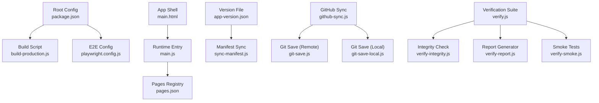
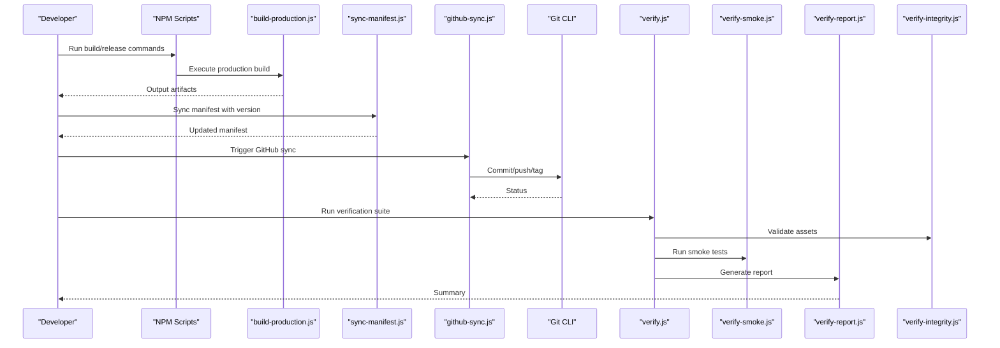
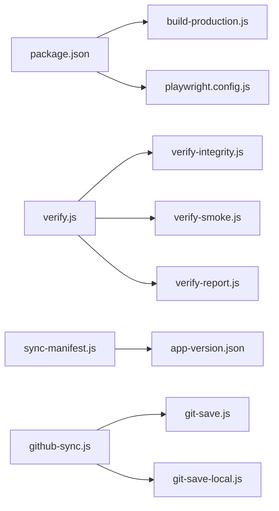

# Build & Deployment

<cite>
**Referenced Files in This Document**
- [package.json](file://package.json)
- [build-production.js](file://build-production.js)
- [main.html](file://main.html)
- [main.js](file://main.js)
- [pages.json](file://pages.json)
- [app-version.json](file://app-version.json)
- [shared/scripts/github-sync.js](file://shared/scripts/github-sync.js)
- [shared/scripts/git-save.js](file://shared/scripts/git-save.js)
- [shared/scripts/git-save-local.js](file://shared/scripts/git-save-local.js)
- [shared/scripts/sync-manifest.js](file://shared/scripts/sync-manifest.js)
- [shared/scripts/manifest.json](file://shared/scripts/manifest.json)
- [shared/scripts/verify.js](file://shared/scripts/verify.js)
- [shared/scripts/verify-integrity.js](file://shared/scripts/verify-integrity.js)
- [shared/scripts/verify-report.js](file://shared/scripts/verify-report.js)
- [shared/scripts/verify-smoke.js](file://shared/scripts/verify-smoke.js)
- [playwright.config.js](file://playwright.config.js)
- [PRODUCTION.md](file://PRODUCTION.md)
- [README.md](file://README.md)
</cite>

## Table of Contents
1. [Introduction](#introduction)
2. [Project Structure](#project-structure)
3. [Core Components](#core-components)
4. [Architecture Overview](#architecture-overview)
5. [Detailed Component Analysis](#detailed-component-analysis)
6. [Dependency Analysis](#dependency-analysis)
7. [Performance Considerations](#performance-considerations)
8. [Troubleshooting Guide](#troubleshooting-guide)
9. [Conclusion](#conclusion)
10. [Appendices](#appendices)

## Introduction
This document provides comprehensive build and deployment guidance for the MTF Monitor application. It covers production builds, asset optimization, bundling strategies, GitHub synchronization, version management, release automation, CI/CD configuration, automated testing integration, deployment environments, versioning strategy, changelog generation, rollback procedures, hosting options, CDN configuration, performance optimization, development workflows, debugging production issues, and monitoring application health.

## Project Structure
The repository is organized into feature modules, shared utilities, scripts, and build artifacts. Key areas relevant to build and deployment include:
- Root-level build entry points and configuration files
- Shared scripts for GitHub sync, manifest synchronization, verification, and smoke tests
- Application shell and page registry used at runtime
- Playwright configuration for end-to-end testing

**Diagram sources**
- [package.json](file://package.json)
- [build-production.js](file://build-production.js)
- [playwright.config.js](file://playwright.config.js)
- [main.html](file://main.html)
- [main.js](file://main.js)
- [pages.json](file://pages.json)
- [app-version.json](file://app-version.json)
- [shared/scripts/sync-manifest.js](file://shared/scripts/sync-manifest.js)
- [shared/scripts/github-sync.js](file://shared/scripts/github-sync.js)
- [shared/scripts/git-save.js](file://shared/scripts/git-save.js)
- [shared/scripts/git-save-local.js](file://shared/scripts/git-save-local.js)
- [shared/scripts/verify.js](file://shared/scripts/verify.js)
- [shared/scripts/verify-integrity.js](file://shared/scripts/verify-integrity.js)
- [shared/scripts/verify-report.js](file://shared/scripts/verify-report.js)
- [shared/scripts/verify-smoke.js](file://shared/scripts/verify-smoke.js)

**Section sources**
- [README.md](file://README.md)
- [PRODUCTION.md](file://PRODUCTION.md)

## Core Components
- Production build script orchestrates asset processing and output generation.
- Manifest synchronization aligns app version with a published manifest.
- GitHub synchronization automates pushing changes and tagging releases.
- Verification suite validates integrity, generates reports, and runs smoke tests.
- Playwright configuration defines test execution environment and targets.

**Section sources**
- [build-production.js](file://build-production.js)
- [shared/scripts/sync-manifest.js](file://shared/scripts/sync-manifest.js)
- [shared/scripts/github-sync.js](file://shared/scripts/github-sync.js)
- [shared/scripts/verify.js](file://shared/scripts/verify.js)
- [playwright.config.js](file://playwright.config.js)

## Architecture Overview
The build and deployment pipeline integrates local scripting with remote operations:

**Diagram sources**
- [build-production.js](file://build-production.js)
- [shared/scripts/sync-manifest.js](file://shared/scripts/sync-manifest.js)
- [shared/scripts/github-sync.js](file://shared/scripts/github-sync.js)
- [shared/scripts/verify.js](file://shared/scripts/verify.js)
- [shared/scripts/verify-integrity.js](file://shared/scripts/verify-integrity.js)
- [shared/scripts/verify-report.js](file://shared/scripts/verify-report.js)
- [shared/scripts/verify-smoke.js](file://shared/scripts/verify-smoke.js)

## Detailed Component Analysis

### Production Build Process
- The build script compiles and optimizes assets for production. It may perform minification, tree-shaking, and resource bundling based on project configuration.
- Outputs are typically placed under a dedicated distribution directory consumed by hosting or CDN.

Operational steps:
- Install dependencies using package manager.
- Invoke the production build command defined in package scripts.
- Validate generated artifacts exist and meet size constraints.

Best practices:
- Enable source maps only for staging or when diagnosing production issues.
- Cache node_modules and build artifacts in CI to speed up pipelines.
- Pin dependency versions to ensure reproducible builds.

**Section sources**
- [package.json](file://package.json)
- [build-production.js](file://build-production.js)

### Asset Optimization and Bundling Strategies
- Minify JavaScript and CSS to reduce payload sizes.
- Inline critical resources where appropriate; defer non-critical assets.
- Use efficient image formats and compression.
- Leverage browser caching via immutable cache headers for hashed filenames.
- Configure content delivery networks to serve static assets globally.

Implementation pointers:
- Ensure build script emits deterministic filenames for cache busting.
- Validate that all referenced assets are included in the bundle.
- Audit third-party libraries for unused code and replace with lighter alternatives if needed.

**Section sources**
- [build-production.js](file://build-production.js)

### Deployment Scripts for GitHub Synchronization
- The GitHub sync script automates committing, pushing, and tagging changes.
- Git save scripts support both remote and local operations for different workflows.

Workflow:
- Update version metadata before syncing.
- Stage and commit changes with descriptive messages.
- Push to the target branch and create annotated tags for releases.
- Optionally publish artifacts or update manifests after successful push.

Security considerations:
- Store credentials securely using environment variables or secret managers.
- Restrict write access to protected branches and enforce required checks.

**Section sources**
- [shared/scripts/github-sync.js](file://shared/scripts/github-sync.js)
- [shared/scripts/git-save.js](file://shared/scripts/git-save.js)
- [shared/scripts/git-save-local.js](file://shared/scripts/git-save-local.js)

### Version Management and Release Automation
- Centralize version information in a dedicated file.
- Synchronize the manifest with the current version to keep clients aligned.
- Tag releases consistently and generate changelogs from commit history.

Release checklist:
- Bump version in the version file.
- Run full verification suite and smoke tests.
- Sync manifest and push tagged release.
- Announce updates and monitor post-release metrics.

**Section sources**
- [app-version.json](file://app-version.json)
- [shared/scripts/sync-manifest.js](file://shared/scripts/sync-manifest.js)

### CI/CD Pipeline Configuration
- Define stages for install, lint, test, build, and deploy.
- Cache dependencies and build outputs to accelerate runs.
- Publish test results and coverage reports.
- Gate deployments on passing checks and approvals.

Environment-specific configurations:
- Separate configs for staging and production.
- Use environment variables for secrets and endpoints.
- Validate environment readiness before deploying.

**Section sources**
- [playwright.config.js](file://playwright.config.js)
- [package.json](file://package.json)

### Automated Testing Integration
- End-to-end tests configured via Playwright validate critical user flows.
- Verification scripts provide integrity checks, reporting, and smoke tests.

Test strategy:
- Unit tests for core logic.
- Integration tests for data services.
- E2E smoke tests for key pages and features.
- Performance regression tests for critical paths.

Execution:
- Run tests in headless mode within CI.
- Capture screenshots/videos on failures for diagnostics.
- Aggregate results and publish artifacts.

**Section sources**
- [playwright.config.js](file://playwright.config.js)
- [shared/scripts/verify.js](file://shared/scripts/verify.js)
- [shared/scripts/verify-integrity.js](file://shared/scripts/verify-integrity.js)
- [shared/scripts/verify-report.js](file://shared/scripts/verify-report.js)
- [shared/scripts/verify-smoke.js](file://shared/scripts/verify-smoke.js)

### Deployment Environments
- Development: Local dev server with hot reload and verbose logging.
- Staging: Pre-production environment mirroring production settings.
- Production: Live environment with strict security and performance tuning.

Environment controls:
- Feature flags for gradual rollouts.
- Environment-specific URLs and API keys.
- Health check endpoints and readiness probes.

**Section sources**
- [PRODUCTION.md](file://PRODUCTION.md)

### Hosting Options and CDN Configuration
- Static hosting platforms suitable for single-page applications.
- CDN configuration for global low-latency delivery.
- Cache policies leveraging immutable filenames and long-lived caches.

Recommendations:
- Enable HTTP/2 and Brotli/Gzip compression.
- Set appropriate cache-control headers.
- Use origin shielding and edge caching rules.

**Section sources**
- [build-production.js](file://build-production.js)

### Performance Optimization for Production
- Reduce initial load time by lazy-loading routes and components.
- Implement service workers for offline capabilities and caching strategies.
- Monitor Core Web Vitals and set budgets for performance regressions.

Monitoring:
- Integrate real-user monitoring and synthetic checks.
- Alert on latency spikes and error rate increases.

**Section sources**
- [main.html](file://main.html)
- [main.js](file://main.js)
- [pages.json](file://pages.json)

### Development Workflows
- Local setup includes installing dependencies and running the dev server.
- Use consistent tooling versions across team members.
- Adopt pre-commit hooks for linting and formatting.

Debugging tips:
- Enable detailed logs in development.
- Use browser dev tools and network throttling to simulate slow connections.

**Section sources**
- [README.md](file://README.md)
- [package.json](file://package.json)

### Debugging Production Issues
- Collect error traces and stack traces from client-side logs.
- Correlate timestamps with deployment tags and version files.
- Reproduce issues using staging mirrors and sanitized data.

Tools:
- Error tracking services and log aggregation.
- Distributed tracing for backend calls.

**Section sources**
- [shared/scripts/verify-report.js](file://shared/scripts/verify-report.js)

### Monitoring Application Health
- Define health check endpoints and uptime monitors.
- Track key metrics: request latency, error rates, throughput.
- Establish alerting thresholds and escalation procedures.

**Section sources**
- [PRODUCTION.md](file://PRODUCTION.md)

## Dependency Analysis
The build and deployment system relies on Node.js tooling and Git CLI. External integrations include GitHub for version control and potential artifact registries.

**Diagram sources**
- [package.json](file://package.json)
- [build-production.js](file://build-production.js)
- [playwright.config.js](file://playwright.config.js)
- [shared/scripts/verify.js](file://shared/scripts/verify.js)
- [shared/scripts/verify-integrity.js](file://shared/scripts/verify-integrity.js)
- [shared/scripts/verify-report.js](file://shared/scripts/verify-report.js)
- [shared/scripts/verify-smoke.js](file://shared/scripts/verify-smoke.js)
- [shared/scripts/sync-manifest.js](file://shared/scripts/sync-manifest.js)
- [app-version.json](file://app-version.json)
- [shared/scripts/github-sync.js](file://shared/scripts/github-sync.js)
- [shared/scripts/git-save.js](file://shared/scripts/git-save.js)
- [shared/scripts/git-save-local.js](file://shared/scripts/git-save-local.js)

**Section sources**
- [package.json](file://package.json)

## Performance Considerations
- Optimize bundle size and leverage code splitting.
- Prefer modern asset formats and compression.
- Configure CDN caching rules and enable HTTP/2.
- Monitor performance budgets and regressions in CI.

[No sources needed since this section provides general guidance]

## Troubleshooting Guide
Common issues and resolutions:
- Build failures due to missing dependencies: reinstall and verify lockfiles.
- Asset not found errors: confirm paths and inclusion in the bundle.
- Authentication failures during GitHub sync: validate tokens and permissions.
- Test flakiness: stabilize selectors and add retries where appropriate.
- Performance regressions: analyze bundle diffs and identify heavy imports.

Diagnostic steps:
- Re-run verification suite locally and compare reports.
- Inspect generated artifacts and checksums.
- Review CI logs for failing stages and artifacts.

**Section sources**
- [shared/scripts/verify.js](file://shared/scripts/verify.js)
- [shared/scripts/verify-integrity.js](file://shared/scripts/verify-integrity.js)
- [shared/scripts/verify-report.js](file://shared/scripts/verify-report.js)
- [shared/scripts/verify-smoke.js](file://shared/scripts/verify-smoke.js)

## Conclusion
This guide consolidates the build, deployment, and operational practices for MTF Monitor. By following the outlined processes for production builds, asset optimization, GitHub synchronization, version management, CI/CD configuration, and monitoring, teams can deliver reliable, high-performance releases with confidence.

[No sources needed since this section summarizes without analyzing specific files]

## Appendices

### Quick Start Commands
- Install dependencies and run the production build.
- Sync manifest with the current version.
- Trigger GitHub synchronization and tagging.
- Execute verification suite including integrity checks and smoke tests.

**Section sources**
- [package.json](file://package.json)
- [shared/scripts/sync-manifest.js](file://shared/scripts/sync-manifest.js)
- [shared/scripts/github-sync.js](file://shared/scripts/github-sync.js)
- [shared/scripts/verify.js](file://shared/scripts/verify.js)

### Rollback Procedures
- Identify the last known good tag and version.
- Re-deploy artifacts associated with that tag.
- Validate health checks and monitor error rates.
- Communicate rollback status and investigate root cause.

**Section sources**
- [app-version.json](file://app-version.json)
- [shared/scripts/github-sync.js](file://shared/scripts/github-sync.js)