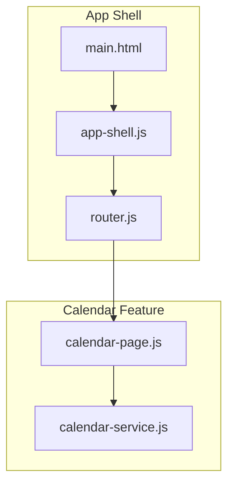
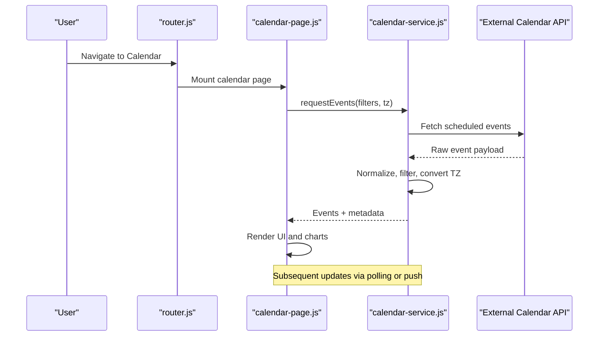
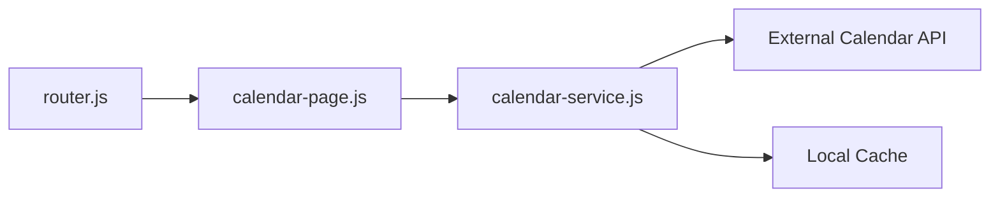

# Calendar Management

<cite>
**Referenced Files in This Document**
- [calendar-page.js](file://features/calendar/calendar-page.js)
- [calendar-service.js](file://features/calendar/calendar-service.js)
- [main.html](file://main.html)
- [router.js](file://features/common/router.js)
- [app-shell.js](file://features/common/app-shell.js)
</cite>

## Table of Contents
1. [Introduction](#introduction)
2. [Project Structure](#project-structure)
3. [Core Components](#core-components)
4. [Architecture Overview](#architecture-overview)
5. [Detailed Component Analysis](#detailed-component-analysis)
6. [Dependency Analysis](#dependency-analysis)
7. [Performance Considerations](#performance-considerations)
8. [Troubleshooting Guide](#troubleshooting-guide)
9. [Conclusion](#conclusion)
10. [Appendices](#appendices)

## Introduction
This document explains the Calendar Management feature, focusing on economic calendar functionality, event filtering and categorization, market schedule visualization, timezone handling, and the implementation of the calendar page. It also covers the service layer architecture, data processing logic, integration points with external calendar APIs, examples for extending events and categories, real-time update strategies, performance optimization for large datasets, and mobile-responsive design considerations.

## Project Structure
The Calendar Management feature is implemented under features/calendar with two primary files:
- A page component that renders the UI and handles user interactions
- A service module that encapsulates data fetching, processing, caching, and integration with external sources

These components integrate with the application shell and router to be navigable from the main app entry point.

**Diagram sources**
- [main.html](file://main.html)
- [app-shell.js](file://features/common/app-shell.js)
- [router.js](file://features/common/router.js)
- [calendar-page.js](file://features/calendar/calendar-page.js)
- [calendar-service.js](file://features/calendar/calendar-service.js)

**Section sources**
- [main.html](file://main.html)
- [app-shell.js](file://features/common/app-shell.js)
- [router.js](file://features/common/router.js)
- [calendar-page.js](file://features/calendar/calendar-page.js)
- [calendar-service.js](file://features/calendar/calendar-service.js)

## Core Components
- Calendar Page (UI): Renders the calendar view, displays events, provides filters and controls, and reacts to user interactions such as date navigation and category toggles.
- Calendar Service (Data): Encapsulates all data operations including fetching from external calendars, transforming and normalizing events, applying filters and time zone conversions, caching results, and exposing a clean API to the page.

Key responsibilities:
- Event display and interaction in the page
- Data acquisition, normalization, and caching in the service
- Filtering by category, impact, and date range
- Timezone-aware scheduling and display
- Integration with external calendar APIs or data sources

**Section sources**
- [calendar-page.js](file://features/calendar/calendar-page.js)
- [calendar-service.js](file://features/calendar/calendar-service.js)

## Architecture Overview
The calendar feature follows a clear separation between presentation and data layers:
- The page subscribes to the service’s state and re-renders when data changes
- The service manages network requests, caching, and transformations
- The router mounts the calendar page at the appropriate route
- The app shell initializes routing and shared UI chrome

**Diagram sources**
- [router.js](file://features/common/router.js)
- [calendar-page.js](file://features/calendar/calendar-page.js)
- [calendar-service.js](file://features/calendar/calendar-service.js)

## Detailed Component Analysis

### Calendar Page Implementation
Responsibilities:
- Initialize and mount within the router
- Bind UI controls (date pickers, category toggles, impact filters)
- Request events from the service and render them
- Handle user interactions like selecting an event, navigating dates, and switching views
- Update UI based on loading states and errors returned by the service

User interactions:
- Date range selection and quick presets (today, week, month)
- Category and impact filters
- Sorting options (time, importance)
- Event detail expansion or drill-down

Data presentation:
- Tabular list of events with time, name, category, impact, and actual/forecast/previous values
- Optional timeline or heatmap visualization for market schedules
- Responsive layout for mobile and desktop

Timezone handling:
- Displays times in the user’s local timezone
- Converts incoming UTC timestamps consistently before rendering

Error handling:
- Shows retry prompts and fallback messages when fetch fails
- Gracefully degrades when partial data is available

**Section sources**
- [calendar-page.js](file://features/calendar/calendar-page.js)
- [router.js](file://features/common/router.js)

### Calendar Service Layer
Responsibilities:
- Provide a single source of truth for calendar data
- Manage network calls to external calendar APIs
- Normalize heterogeneous payloads into a consistent event model
- Apply filters (category, impact, date range) and sort orders
- Convert timestamps to target timezones
- Cache recent results to reduce network load
- Expose methods for subscribing to updates and refreshing data

Data processing logic:
- Deduplication by event ID or composite key
- Validation of required fields (time, title, category, impact)
- Mapping of external categories to internal taxonomy
- Aggregation helpers for summary statistics (e.g., high-impact count)

Integration points:
- External calendar API client(s)
- Local cache storage (in-memory or persistent)
- Optional real-time channel (WebSocket/SSE) for live updates

Real-time updates:
- Polling-based refresh with configurable intervals
- Push-based updates if supported by the backend
- Incremental diffing to minimize re-render cost

**Section sources**
- [calendar-service.js](file://features/calendar/calendar-service.js)

### Economic Calendar Functionality
- Event model includes fields for timestamp, title, currency/market, category, impact level, forecast, previous, and actual values
- Filtering supports multiple dimensions: category, impact, currency, and date window
- Sorting prioritizes upcoming events and high-impact items
- Visualization highlights market open/close windows and overlapping sessions

Market schedule visualization:
- Session overlays indicate major market hours
- Visual cues differentiate pre-market, regular session, and after-hours periods
- Color coding aligns with impact levels

Timezone handling:
- All incoming times normalized to UTC internally
- Display conversion applied per user preference
- Day boundaries respected across timezones

**Section sources**
- [calendar-service.js](file://features/calendar/calendar-service.js)
- [calendar-page.js](file://features/calendar/calendar-page.js)

### Event Filtering and Categorization System
- Categories map to domains such as macroeconomic indicators, central bank decisions, earnings, and geopolitical events
- Impact levels drive visual prominence and optional alerting
- Filters compose logically (AND semantics) and can be persisted in settings
- Custom categories can be added by extending the category registry and mapping rules

Examples:
- Adding a new economic event type involves defining its category, impact mapping, and any special formatting rules
- Customizing categories requires updating the category registry and ensuring UI filters reflect the change

**Section sources**
- [calendar-service.js](file://features/calendar/calendar-service.js)
- [calendar-page.js](file://features/calendar/calendar-page.js)

### Real-Time Updates
- Implement periodic refresh using a timer managed by the service
- On receiving new data, compute diffs and update only affected rows
- If the backend supports push notifications, subscribe to a channel and apply incremental updates
- Debounce rapid successive updates to avoid excessive re-renders

**Section sources**
- [calendar-service.js](file://features/calendar/calendar-service.js)

## Dependency Analysis
The calendar feature depends on the app shell and router for mounting and navigation, and it encapsulates all external integrations behind the service interface.

**Diagram sources**
- [router.js](file://features/common/router.js)
- [calendar-page.js](file://features/calendar/calendar-page.js)
- [calendar-service.js](file://features/calendar/calendar-service.js)

**Section sources**
- [router.js](file://features/common/router.js)
- [calendar-page.js](file://features/calendar/calendar-page.js)
- [calendar-service.js](file://features/calendar/calendar-service.js)

## Performance Considerations
For large event datasets:
- Virtualize lists to render only visible rows
- Paginate or lazy-load events beyond the current viewport
- Use memoized selectors for filtered/sorted results
- Debounce input-driven filters and search
- Batch DOM updates and minimize reflows
- Prefer immutable data structures and shallow comparisons for efficient re-renders
- Cache responses aggressively with short TTLs for volatile data
- Offload heavy computations (e.g., timezone conversions) to Web Workers if needed

Mobile-responsive design:
- Use fluid typography and spacing scales
- Collapse dense columns into expandable rows on small screens
- Ensure touch targets meet minimum size guidelines
- Optimize chart sizes and simplify legends on narrow viewports
- Avoid horizontal scrolling; stack content vertically where possible

[No sources needed since this section provides general guidance]

## Troubleshooting Guide
Common issues and resolutions:
- No events displayed: verify network connectivity, check service error logs, and ensure filters are not overly restrictive
- Incorrect time display: confirm timezone conversion pipeline and that timestamps are normalized to UTC before display
- Stale data: inspect refresh intervals and push subscription status; force a manual refresh if necessary
- Slow rendering: enable virtualization and pagination; profile re-renders to identify expensive components
- Filter anomalies: validate category mappings and impact thresholds; reset filters to defaults to isolate issues

Operational tips:
- Log service method entry/exit with minimal payloads
- Add a “debug mode” toggle to expose raw vs processed events
- Capture and report failed requests with retry counts and backoff details

**Section sources**
- [calendar-service.js](file://features/calendar/calendar-service.js)
- [calendar-page.js](file://features/calendar/calendar-page.js)

## Conclusion
The Calendar Management feature cleanly separates UI concerns from data logic, enabling robust economic calendar functionality with flexible filtering, accurate timezone handling, and scalable rendering. By leveraging caching, virtualization, and responsive patterns, the system remains performant and accessible across devices. Extensibility is straightforward through the service’s data processing pipeline and the page’s modular UI bindings.

[No sources needed since this section summarizes without analyzing specific files]

## Appendices

### Example: Adding a New Economic Event
- Define the event schema fields and constraints
- Map the new event’s category and impact level
- Extend the service’s normalization step to handle the new payload shape
- Update UI filters and visuals to support the new category

**Section sources**
- [calendar-service.js](file://features/calendar/calendar-service.js)
- [calendar-page.js](file://features/calendar/calendar-page.js)

### Example: Customizing Event Categories
- Register new categories in the service’s taxonomy
- Adjust filter UI to include the new category
- Optionally add custom formatting or icons for the category

**Section sources**
- [calendar-service.js](file://features/calendar/calendar-service.js)
- [calendar-page.js](file://features/calendar/calendar-page.js)

### Example: Implementing Real-Time Updates
- Choose between polling and push mechanisms
- Implement debounced refresh cycles in the service
- Apply incremental updates to the UI state
- Provide user controls to pause/resume updates

**Section sources**
- [calendar-service.js](file://features/calendar/calendar-service.js)