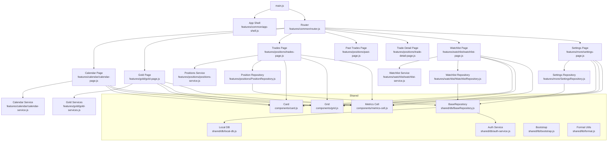
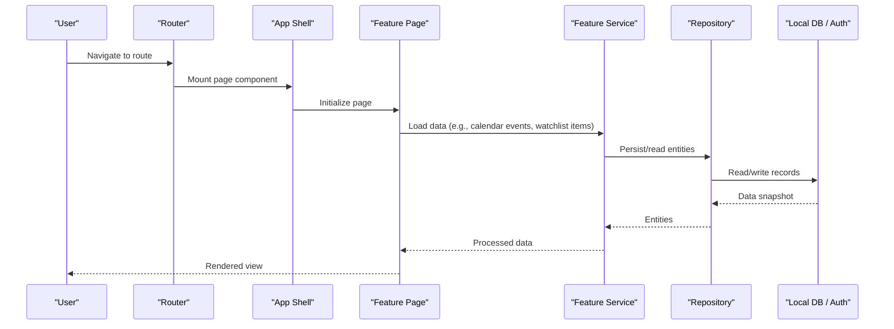
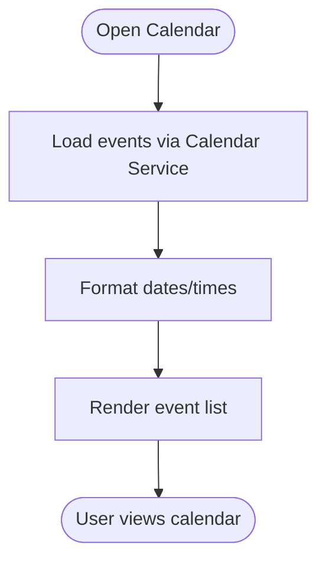
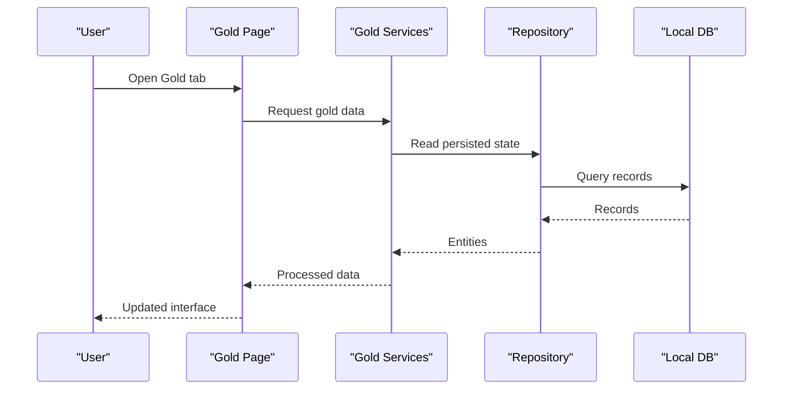
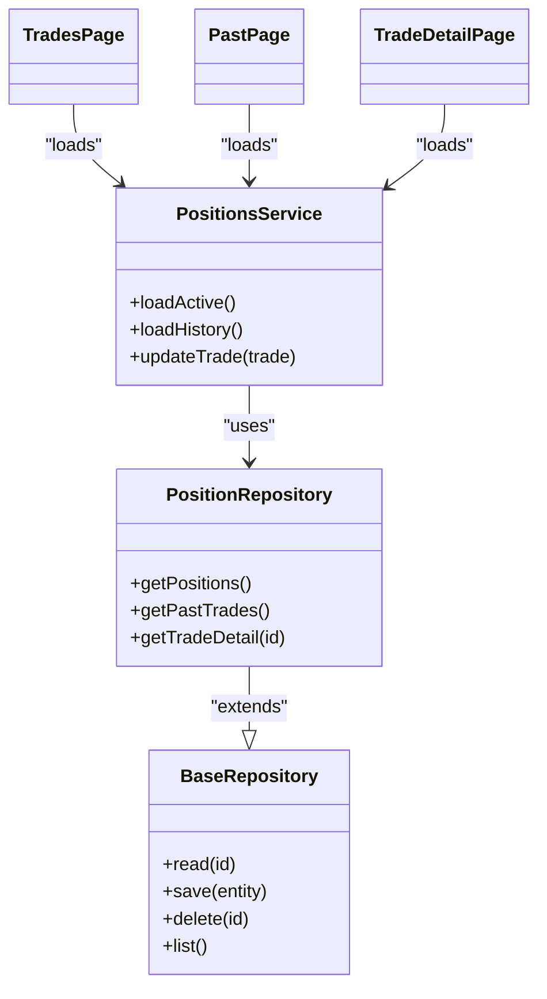
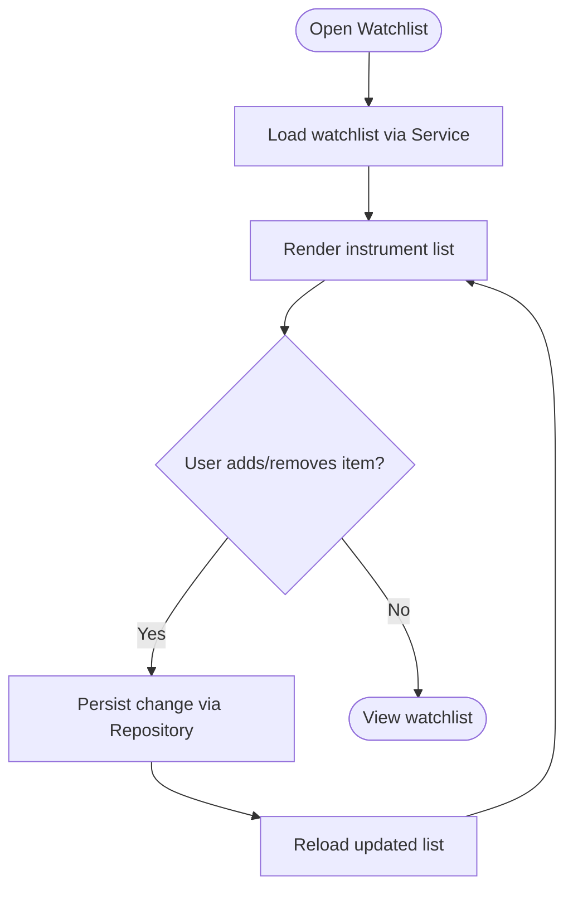
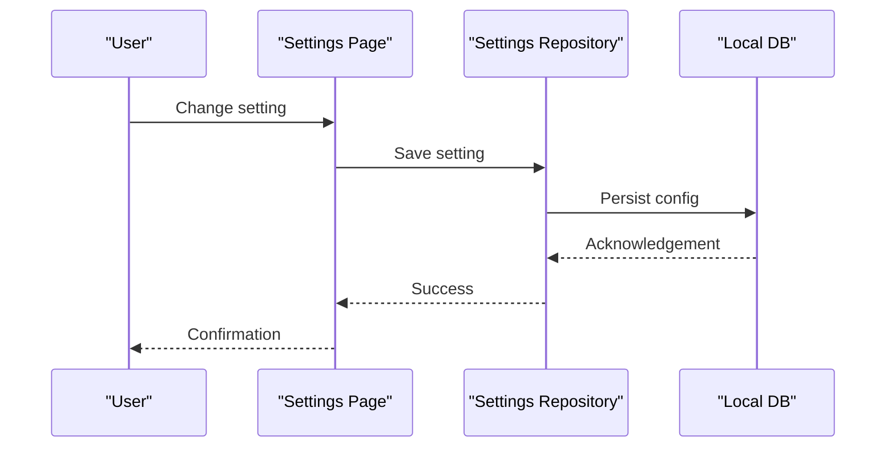
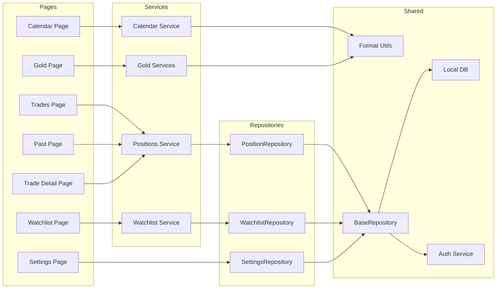

# Core Features

<cite>
**Referenced Files in This Document**
- [main.js](file://main.js)
- [main.html](file://main.html)
- [pages.json](file://pages.json)
- [features/common/app-shell.js](file://features/common/app-shell.js)
- [features/common/router.js](file://features/common/router.js)
- [features/calendar/calendar-page.js](file://features/calendar/calendar-page.js)
- [features/calendar/calendar-service.js](file://features/calendar/calendar-service.js)
- [features/gold/gold-page.js](file://features/gold/gold-page.js)
- [features/gold/gold-services.js](file://features/gold/gold-services.js)
- [features/positions/trades-page.js](file://features/positions/trades-page.js)
- [features/positions/past-page.js](file://features/positions/past-page.js)
- [features/positions/trade-detail-page.js](file://features/positions/trade-detail-page.js)
- [features/positions/positions-service.js](file://features/positions/positions-service.js)
- [features/positions/PositionRepository.js](file://features/positions/PositionRepository.js)
- [features/watchlist/watchlist-page.js](file://features/watchlist/watchlist-page.js)
- [features/watchlist/watchlist-service.js](file://features/watchlist/watchlist-service.js)
- [features/watchlist/WatchlistRepository.js](file://features/watchlist/WatchlistRepository.js)
- [features/more/settings-page.js](file://features/more/settings-page.js)
- [features/more/SettingsRepository.js](file://features/more/SettingsRepository.js)
- [shared/db/BaseRepository.js](file://shared/db/BaseRepository.js)
- [shared/db/local-db.js](file://shared/db/local-db.js)
- [shared/db/auth-service.js](file://shared/db/auth-service.js)
- [shared/lib/bootstrap.js](file://shared/lib/bootstrap.js)
- [shared/lib/format.js](file://shared/lib/format.js)
- [components/card.js](file://components/card.js)
- [components/grid.js](file://components/grid.js)
- [components/metrics-cell.js](file://components/metrics-cell.js)
</cite>

## Table of Contents
1. Introduction
2. Project Structure
3. Core Components
4. Architecture Overview
5. Detailed Component Analysis
6. Dependency Analysis
7. Performance Considerations
8. Troubleshooting Guide
9. Conclusion

## Introduction
This document explains the core features of the MTF Monitor trading dashboard and how they work together to provide a complete monitoring solution. It covers Calendar Management, Gold Trading Interface, Positions Tracking, Watchlist Management, and Settings Configuration. It also documents shared components and utilities, data sharing patterns, common business logic, user workflows, navigation between modules, and their relationships within the application architecture.

## Project Structure
The project is organized by feature modules under features/, with shared infrastructure in shared/ and reusable UI primitives in components/. The application entry points are main.js and main.html, which bootstrap the app shell and routing. Feature pages are registered via pages.json and navigated through a client-side router.

**Diagram sources**
- [main.js](file://main.js)
- [features/common/app-shell.js](file://features/common/app-shell.js)
- [features/common/router.js](file://features/common/router.js)
- [features/calendar/calendar-page.js](file://features/calendar/calendar-page.js)
- [features/calendar/calendar-service.js](file://features/calendar/calendar-service.js)
- [features/gold/gold-page.js](file://features/gold/gold-page.js)
- [features/gold/gold-services.js](file://features/gold/gold-services.js)
- [features/positions/trades-page.js](file://features/positions/trades-page.js)
- [features/positions/past-page.js](file://features/positions/past-page.js)
- [features/positions/trade-detail-page.js](file://features/positions/trade-detail-page.js)
- [features/positions/positions-service.js](file://features/positions/positions-service.js)
- [features/positions/PositionRepository.js](file://features/positions/PositionRepository.js)
- [features/watchlist/watchlist-page.js](file://features/watchlist/watchlist-page.js)
- [features/watchlist/watchlist-service.js](file://features/watchlist/watchlist-service.js)
- [features/watchlist/WatchlistRepository.js](file://features/watchlist/WatchlistRepository.js)
- [features/more/settings-page.js](file://features/more/settings-page.js)
- [features/more/SettingsRepository.js](file://features/more/SettingsRepository.js)
- [shared/db/BaseRepository.js](file://shared/db/BaseRepository.js)
- [shared/db/local-db.js](file://shared/db/local-db.js)
- [shared/db/auth-service.js](file://shared/db/auth-service.js)
- [shared/lib/bootstrap.js](file://shared/lib/bootstrap.js)
- [shared/lib/format.js](file://shared/lib/format.js)
- [components/card.js](file://components/card.js)
- [components/grid.js](file://components/grid.js)
- [components/metrics-cell.js](file://components/metrics-cell.js)

**Section sources**
- [main.js](file://main.js)
- [main.html](file://main.html)
- [pages.json](file://pages.json)
- [features/common/app-shell.js](file://features/common/app-shell.js)
- [features/common/router.js](file://features/common/router.js)

## Core Components
Reusable UI building blocks used across features:
- Card: Encapsulates a content container with consistent styling and layout behavior.
- Grid: Provides a responsive grid layout for arranging cards or metric cells.
- Metrics Cell: Displays a single metric value with label and formatting helpers.

These components are composed by feature pages to render calendars, watchlists, positions, gold interface, and settings panels.

**Section sources**
- [components/card.js](file://components/card.js)
- [components/grid.js](file://components/grid.js)
- [components/metrics-cell.js](file://components/metrics-cell.js)

## Architecture Overview
At runtime, main.js bootstraps the application shell and initializes the router. The router resolves routes defined in pages.json and mounts corresponding feature pages into the app shell. Each feature page coordinates its service layer (data fetching, transformations) and repository layer (persistence). Shared repositories extend BaseRepository, which abstracts local storage and authentication context. Formatting utilities standardize number and date presentation across features.

**Diagram sources**
- [features/common/router.js](file://features/common/router.js)
- [features/common/app-shell.js](file://features/common/app-shell.js)
- [shared/db/BaseRepository.js](file://shared/db/BaseRepository.js)
- [shared/db/local-db.js](file://shared/db/local-db.js)
- [shared/db/auth-service.js](file://shared/db/auth-service.js)

## Detailed Component Analysis

### Calendar Management
Purpose: Display upcoming economic events and market-relevant dates to support trade planning.

Key responsibilities:
- Fetching and rendering calendar events.
- Filtering and grouping events by relevance.
- Integrating with shared formatting utilities for dates and times.

Data flow:
- Calendar page requests events from the calendar service.
- Calendar service may read from local persistence or external sources.
- Events are formatted and rendered using shared components.

**Diagram sources**
- [features/calendar/calendar-page.js](file://features/calendar/calendar-page.js)
- [features/calendar/calendar-service.js](file://features/calendar/calendar-service.js)
- [shared/lib/format.js](file://shared/lib/format.js)

**Section sources**
- [features/calendar/calendar-page.js](file://features/calendar/calendar-page.js)
- [features/calendar/calendar-service.js](file://features/calendar/calendar-service.js)

### Gold Trading Interface
Purpose: Provide a focused interface for monitoring and interacting with gold-related instruments and trades.

Key responsibilities:
- Loading gold-specific data (prices, positions, or watchlist entries).
- Presenting actionable controls and metrics.
- Sharing data with positions and watchlist modules where applicable.

Data flow:
- Gold page calls gold services to retrieve current state.
- Services coordinate with repositories if persistence is required.
- UI updates reflect latest data using shared components.

**Diagram sources**
- [features/gold/gold-page.js](file://features/gold/gold-page.js)
- [features/gold/gold-services.js](file://features/gold/gold-services.js)
- [shared/db/BaseRepository.js](file://shared/db/BaseRepository.js)
- [shared/db/local-db.js](file://shared/db/local-db.js)

**Section sources**
- [features/gold/gold-page.js](file://features/gold/gold-page.js)
- [features/gold/gold-services.js](file://features/gold/gold-services.js)

### Positions Tracking
Purpose: Track open and past positions, including detailed trade information and history.

Key responsibilities:
- Listing active and historical trades.
- Showing trade details and performance metrics.
- Persisting trade records and syncing with local database.

Core classes and relationships:
- PositionRepository extends BaseRepository to manage position entities.
- Positions service orchestrates reading/writing positions and transforming data for display.
- Trades page lists positions; Past page shows historical trades; Trade detail page displays specifics.

**Diagram sources**
- [shared/db/BaseRepository.js](file://shared/db/BaseRepository.js)
- [features/positions/PositionRepository.js](file://features/positions/PositionRepository.js)
- [features/positions/positions-service.js](file://features/positions/positions-service.js)
- [features/positions/trades-page.js](file://features/positions/trades-page.js)
- [features/positions/past-page.js](file://features/positions/past-page.js)
- [features/positions/trade-detail-page.js](file://features/positions/trade-detail-page.js)

**Section sources**
- [features/positions/trades-page.js](file://features/positions/trades-page.js)
- [features/positions/past-page.js](file://features/positions/past-page.js)
- [features/positions/trade-detail-page.js](file://features/positions/trade-detail-page.js)
- [features/positions/positions-service.js](file://features/positions/positions-service.js)
- [features/positions/PositionRepository.js](file://features/positions/PositionRepository.js)
- [shared/db/BaseRepository.js](file://shared/db/BaseRepository.js)

### Watchlist Management
Purpose: Maintain a curated list of instruments to monitor, with quick access to prices and status.

Key responsibilities:
- Adding/removing instruments.
- Refreshing watchlist data.
- Persisting user preferences and selections.

Data flow:
- Watchlist page interacts with watchlist service to load and update items.
- WatchlistRepository persists watchlist entries via BaseRepository.

**Diagram sources**
- [features/watchlist/watchlist-page.js](file://features/watchlist/watchlist-page.js)
- [features/watchlist/watchlist-service.js](file://features/watchlist/watchlist-service.js)
- [features/watchlist/WatchlistRepository.js](file://features/watchlist/WatchlistRepository.js)
- [shared/db/BaseRepository.js](file://shared/db/BaseRepository.js)

**Section sources**
- [features/watchlist/watchlist-page.js](file://features/watchlist/watchlist-page.js)
- [features/watchlist/watchlist-service.js](file://features/watchlist/watchlist-service.js)
- [features/watchlist/WatchlistRepository.js](file://features/watchlist/WatchlistRepository.js)

### Settings Configuration
Purpose: Manage application-level configuration such as theme, units, and feature toggles.

Key responsibilities:
- Reading and writing settings.
- Applying settings to UI and behavior.
- Persisting user preferences.

Data flow:
- Settings page uses SettingsRepository to load/save configuration.
- Changes propagate to the app shell and other features that consume settings.

**Diagram sources**
- [features/more/settings-page.js](file://features/more/settings-page.js)
- [features/more/SettingsRepository.js](file://features/more/SettingsRepository.js)
- [shared/db/local-db.js](file://shared/db/local-db.js)

**Section sources**
- [features/more/settings-page.js](file://features/more/settings-page.js)
- [features/more/SettingsRepository.js](file://features/more/SettingsRepository.js)

### Shared Infrastructure and Utilities
- App Shell: Hosts navigation and renders feature pages.
- Router: Resolves routes and mounts pages based on pages.json.
- Bootstrap: Initializes core services and prepares environment.
- BaseRepository: Common persistence operations for all repositories.
- Local DB: Underlying storage abstraction.
- Auth Service: Authentication context and session management.
- Format Utilities: Standardized formatting for numbers, dates, and currency.

These shared pieces ensure consistency, reduce duplication, and enable cross-feature data sharing.

**Section sources**
- [features/common/app-shell.js](file://features/common/app-shell.js)
- [features/common/router.js](file://features/common/router.js)
- [shared/lib/bootstrap.js](file://shared/lib/bootstrap.js)
- [shared/db/BaseRepository.js](file://shared/db/BaseRepository.js)
- [shared/db/local-db.js](file://shared/db/local-db.js)
- [shared/db/auth-service.js](file://shared/db/auth-service.js)
- [shared/lib/format.js](file://shared/lib/format.js)

## Dependency Analysis
Features depend on shared repositories and services rather than directly on storage mechanisms. Repositories encapsulate persistence and expose simple APIs to services. Services orchestrate business logic and transform data for UI consumption. Pages remain thin, focusing on presentation and user interactions.

**Diagram sources**
- [features/calendar/calendar-page.js](file://features/calendar/calendar-page.js)
- [features/calendar/calendar-service.js](file://features/calendar/calendar-service.js)
- [features/gold/gold-page.js](file://features/gold/gold-page.js)
- [features/gold/gold-services.js](file://features/gold/gold-services.js)
- [features/positions/trades-page.js](file://features/positions/trades-page.js)
- [features/positions/past-page.js](file://features/positions/past-page.js)
- [features/positions/trade-detail-page.js](file://features/positions/trade-detail-page.js)
- [features/positions/positions-service.js](file://features/positions/positions-service.js)
- [features/positions/PositionRepository.js](file://features/positions/PositionRepository.js)
- [features/watchlist/watchlist-page.js](file://features/watchlist/watchlist-page.js)
- [features/watchlist/watchlist-service.js](file://features/watchlist/watchlist-service.js)
- [features/watchlist/WatchlistRepository.js](file://features/watchlist/WatchlistRepository.js)
- [features/more/settings-page.js](file://features/more/settings-page.js)
- [features/more/SettingsRepository.js](file://features/more/SettingsRepository.js)
- [shared/db/BaseRepository.js](file://shared/db/BaseRepository.js)
- [shared/db/local-db.js](file://shared/db/local-db.js)
- [shared/db/auth-service.js](file://shared/db/auth-service.js)
- [shared/lib/format.js](file://shared/lib/format.js)

**Section sources**
- [features/common/router.js](file://features/common/router.js)
- [pages.json](file://pages.json)

## Performance Considerations
- Prefer lazy loading of feature resources when possible to reduce initial bundle size.
- Cache frequently accessed data at the service layer to minimize repeated reads.
- Use pagination or virtualization for large lists (e.g., past trades) to improve rendering performance.
- Debounce user inputs in settings and watchlist editing to avoid excessive writes.
- Normalize and format data once in services before passing to UI components.

[No sources needed since this section provides general guidance]

## Troubleshooting Guide
Common issues and resolutions:
- Navigation not working: Verify routes in pages.json and ensure router initialization completes.
- Data not persisting: Check BaseRepository usage and local DB availability; confirm auth context is set.
- Incorrect formatting: Ensure format utilities are applied consistently in services and pages.
- UI not updating: Confirm that changes trigger re-rendering after repository save operations.

**Section sources**
- [features/common/router.js](file://features/common/router.js)
- [shared/db/BaseRepository.js](file://shared/db/BaseRepository.js)
- [shared/db/local-db.js](file://shared/db/local-db.js)
- [shared/db/auth-service.js](file://shared/db/auth-service.js)
- [shared/lib/format.js](file://shared/lib/format.js)

## Conclusion
The MTF Monitor dashboard organizes functionality into clear feature modules backed by shared infrastructure. Calendar, Gold, Positions, Watchlist, and Settings each follow a consistent pattern: page -> service -> repository -> shared persistence. This structure promotes maintainability, testability, and scalability while enabling smooth user workflows across the trading monitoring experience.

[No sources needed since this section summarizes without analyzing specific files]