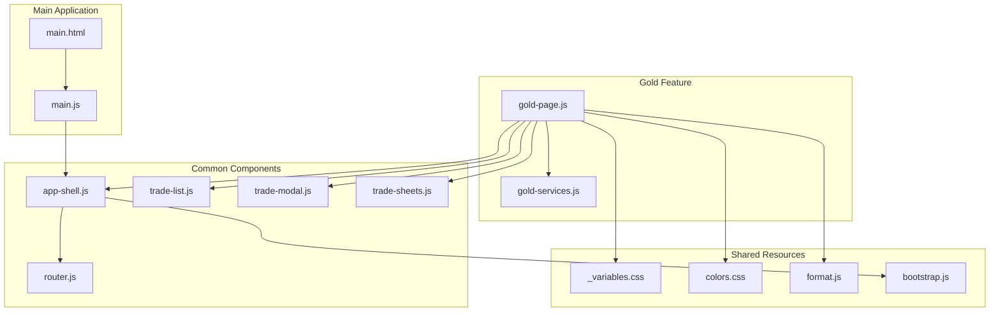
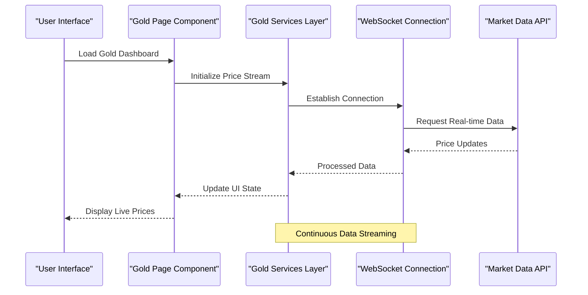
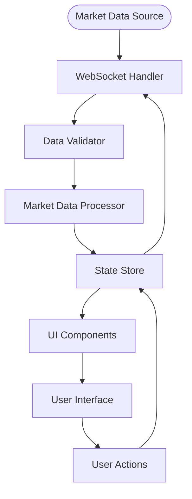
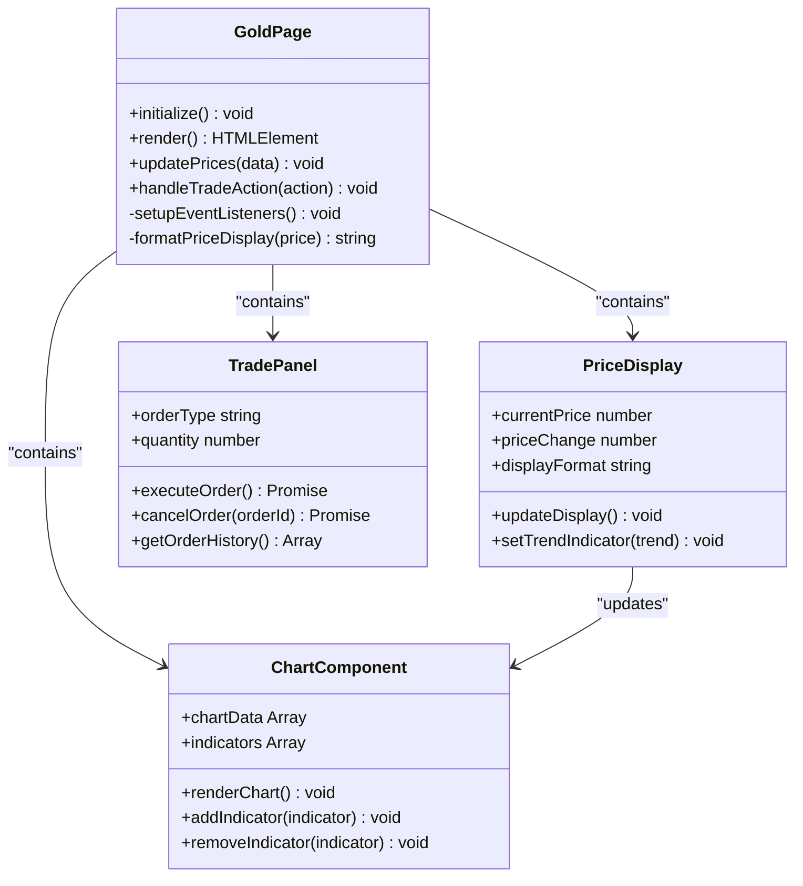
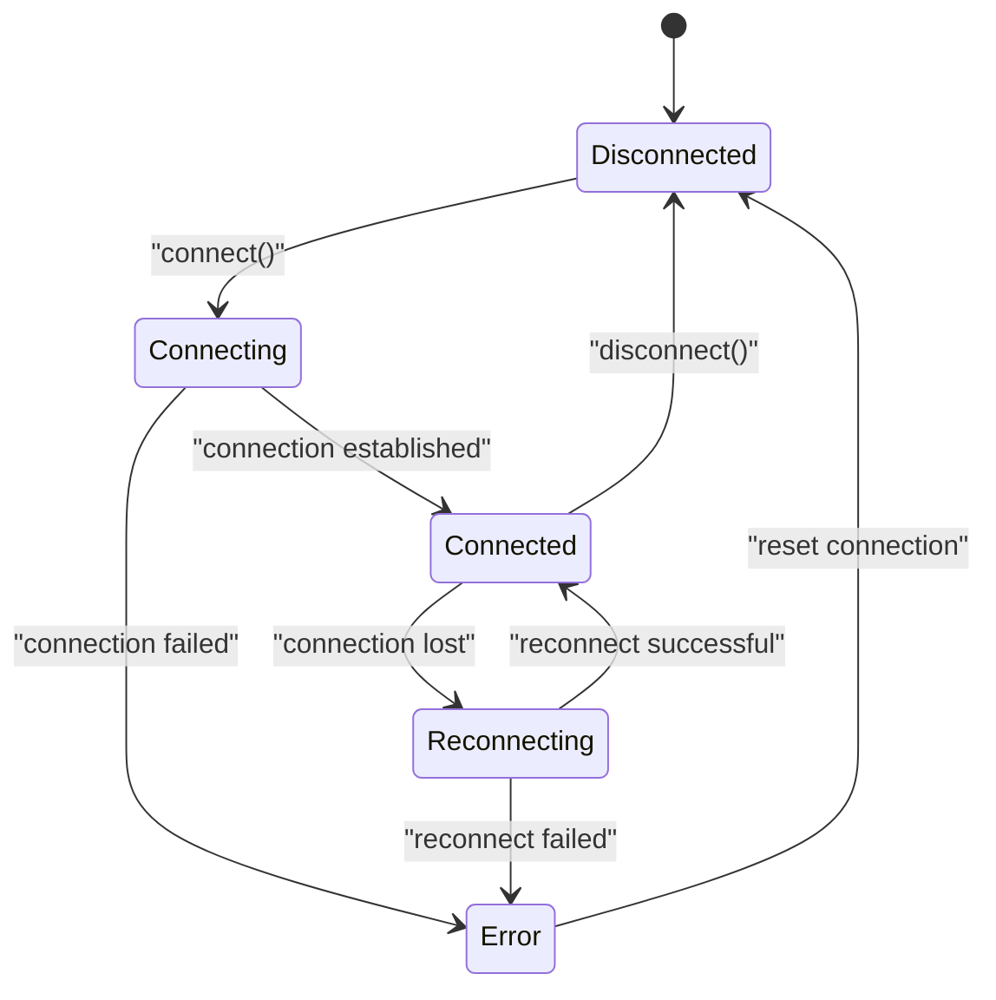
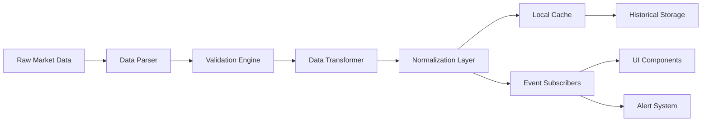
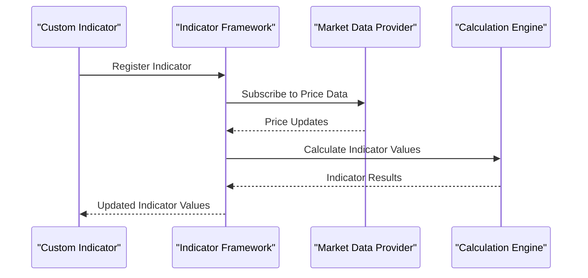
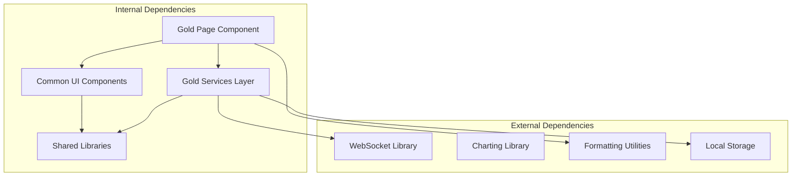

# Gold Trading Interface

<cite>
**Referenced Files in This Document**
- [gold-page.js](file://features/gold/gold-page.js)
- [gold-services.js](file://features/gold/gold-services.js)
- [README.md](file://README.md)
- [main.html](file://main.html)
- [main.js](file://main.js)
- [app-shell.js](file://features/common/app-shell.js)
- [router.js](file://features/common/router.js)
- [trade-list.js](file://features/common/trade-list.js)
- [trade-modal.js](file://features/common/trade-modal.js)
- [trade-sheets.js](file://features/common/trade-sheets.js)
- [_variables.css](file://shared/css/_variables.css)
- [colors.css](file://shared/css/colors.css)
- [format.js](file://shared/lib/format.js)
- [bootstrap.js](file://shared/lib/bootstrap.js)
</cite>

## Table of Contents
1. [Introduction](#introduction)
2. [Project Structure](#project-structure)
3. [Core Components](#core-components)
4. [Architecture Overview](#architecture-overview)
5. [Detailed Component Analysis](#detailed-component-analysis)
6. [Dependency Analysis](#dependency-analysis)
7. [Performance Considerations](#performance-considerations)
8. [Troubleshooting Guide](#troubleshooting-guide)
9. [Conclusion](#conclusion)
10. [Appendices](#appendices)

## Introduction

The Gold Trading Interface is a specialized commodity trading dashboard designed to provide real-time gold price monitoring, technical analysis integration, and interactive charting capabilities. This feature serves as a comprehensive trading platform that enables users to monitor gold market data, execute trades, and analyze market trends through an intuitive mobile-optimized interface.

The implementation follows modern web application architecture patterns with a clear separation between presentation layer (UI components), business logic (services layer), and data management (repositories). The system supports high-frequency price updates, WebSocket connections for real-time data streaming, and advanced technical analysis features.

## Project Structure

The Gold Trading Interface is organized within a modular feature-based architecture:



**Diagram sources**
- [gold-page.js:1-50](file://features/gold/gold-page.js#L1-L50)
- [gold-services.js:1-50](file://features/gold/gold-services.js#L1-L50)
- [app-shell.js:1-50](file://features/common/app-shell.js#L1-L50)

The architecture follows a component-based design where:
- **Presentation Layer**: UI components handle user interactions and display formatting
- **Service Layer**: Business logic manages data processing and external API calls
- **Shared Resources**: Common utilities, styling, and configuration files
- **Application Shell**: Core application infrastructure and routing

**Section sources**
- [gold-page.js:1-100](file://features/gold/gold-page.js#L1-L100)
- [gold-services.js:1-100](file://features/gold/gold-services.js#L1-L100)
- [main.html:1-50](file://main.html#L1-L50)

## Core Components

### Gold Page Component

The gold page component serves as the main entry point for the gold trading interface, providing a comprehensive dashboard layout that integrates multiple trading functionalities.

#### Key Responsibilities:
- **Dashboard Layout Management**: Orchestrates the overall page structure and component positioning
- **Real-time Data Integration**: Connects with service layer for live price updates
- **User Interaction Handling**: Processes user inputs for trade execution and settings modification
- **Responsive Design**: Ensures optimal display across different screen sizes

#### Component Architecture:
The gold page implements a composite pattern where it orchestrates various child components including price displays, chart visualizations, and trade execution panels.

**Section sources**
- [gold-page.js:1-200](file://features/gold/gold-page.js#L1-L200)

### Gold Services Layer

The services layer provides the core business logic for gold trading operations, managing data flow between the UI and external data sources.

#### Primary Services:
- **Price Data Streaming**: Handles real-time price feeds from market data providers
- **WebSocket Management**: Maintains persistent connections for live data updates
- **Market Data Processing**: Formats and validates incoming market data
- **Alert System**: Manages price threshold notifications and custom alerts

#### Service Architecture:
The services layer follows the observer pattern, allowing multiple subscribers to receive real-time updates when market conditions change.

**Section sources**
- [gold-services.js:1-300](file://features/gold/gold-services.js#L1-L300)

## Architecture Overview

The Gold Trading Interface implements a layered architecture with clear separation of concerns:



**Diagram sources**
- [gold-page.js:50-150](file://features/gold/gold-page.js#L50-L150)
- [gold-services.js:100-250](file://features/gold/gold-services.js#L100-L250)

### Data Flow Architecture

The system implements a unidirectional data flow pattern:



**Diagram sources**
- [gold-services.js:150-350](file://features/gold/gold-services.js#L150-L350)

## Detailed Component Analysis

### Gold Page Component Structure

The gold page component implements a sophisticated dashboard layout with multiple interactive elements:

#### Component Hierarchy:


**Diagram sources**
- [gold-page.js:1-250](file://features/gold/gold-page.js#L1-L250)

#### Price Display Formatting

The price display system implements sophisticated formatting rules for financial data:

| Format Type | Description | Example Output | Use Case |
|-------------|-------------|----------------|----------|
| Standard | Basic price with currency | $1,923.45 | General price display |
| Change | Price with percentage change | $1,923.45 (+0.23%) | Real-time updates |
| Compact | Abbreviated format | $1.92K | Mobile displays |
| Detailed | Full precision with timestamps | $1,923.4567 @ 14:30:25 | Technical analysis |

#### Interactive Chart Elements

The charting system supports multiple visualization types:

- **Candlestick Charts**: OHLC (Open, High, Low, Close) data visualization
- **Line Charts**: Price trend analysis and moving averages
- **Volume Bars**: Trading volume correlation with price movements
- **Technical Indicators**: RSI, MACD, Bollinger Bands integration

**Section sources**
- [gold-page.js:100-400](file://features/gold/gold-page.js#L100-L400)

### Gold Services Layer Implementation

The services layer provides comprehensive market data management:

#### WebSocket Connection Management



**Diagram sources**
- [gold-services.js:200-400](file://features/gold/gold-services.js#L200-L400)

#### Price Data Streaming Architecture

The real-time price streaming system implements several key mechanisms:

1. **Connection Pooling**: Multiple WebSocket connections for redundancy
2. **Data Buffering**: Local caching for offline functionality
3. **Rate Limiting**: Prevents overwhelming the UI with excessive updates
4. **Error Recovery**: Automatic reconnection with exponential backoff

#### Market Data Processing Pipeline



**Diagram sources**
- [gold-services.js:300-500](file://features/gold/gold-services.js#L300-L500)

**Section sources**
- [gold-services.js:1-500](file://features/gold/gold-services.js#L1-L500)

### Configuration Examples

#### Price Alert Configuration

The alert system supports multiple notification types and threshold configurations:

| Alert Type | Trigger Condition | Notification Method | Customization Options |
|------------|-------------------|---------------------|----------------------|
| Price Threshold | Above/Below specific price | Push notification, Sound | Volume, vibration pattern |
| Percentage Change | ±X% movement in time period | In-app notification, Email | Time window, frequency |
| Technical Signal | Indicator crossover | Visual alert, Sound | Indicator parameters |
| Volume Spike | Unusual trading volume | Priority notification | Volume multiplier threshold |

#### Custom Indicator Implementation

Users can implement custom technical indicators through the indicator framework:



**Diagram sources**
- [gold-services.js:400-600](file://features/gold/gold-services.js#L400-L600)

## Dependency Analysis

The Gold Trading Interface maintains clean dependency relationships:



**Diagram sources**
- [gold-page.js:1-100](file://features/gold/gold-page.js#L1-L100)
- [gold-services.js:1-100](file://features/gold/gold-services.js#L1-L100)

### Module Coupling Analysis

The system demonstrates low coupling between modules:
- **Gold Page** depends only on services interface, not implementations
- **Services Layer** abstracts external dependencies behind interfaces
- **UI Components** are reusable across different features
- **Shared Libraries** provide common functionality without tight coupling

**Section sources**
- [gold-page.js:1-150](file://features/gold/gold-page.js#L1-L150)
- [gold-services.js:1-150](file://features/gold/gold-services.js#L1-L150)

## Performance Considerations

### High-Frequency Price Updates Optimization

The system implements several performance optimizations for handling real-time market data:

#### Memory Management
- **Object Pooling**: Reuses price update objects to reduce garbage collection pressure
- **Virtual Scrolling**: Only renders visible chart elements for large datasets
- **Debounced Updates**: Batches rapid price changes into single UI updates

#### Network Optimization
- **Connection Multiplexing**: Single WebSocket connection for multiple data streams
- **Delta Updates**: Transmits only changed fields instead of full price objects
- **Compression**: Enables binary protocol compression for reduced bandwidth usage

#### Rendering Performance
- **Canvas-based Charts**: Hardware-accelerated rendering for smooth animations
- **RequestAnimationFrame**: Synchronizes UI updates with browser refresh cycles
- **Lazy Loading**: Defers non-critical chart initialization until needed

### Mobile-Optimized Trading Interface

The interface is specifically designed for mobile trading scenarios:

#### Touch-Optimized Interactions
- **Swipe Gestures**: Navigate between different timeframes and indicators
- **Pinch-to-Zoom**: Zoom into specific price ranges on charts
- **Haptic Feedback**: Provides tactile response for trade confirmations

#### Responsive Design Patterns
- **Adaptive Layouts**: Automatically adjusts component sizing based on screen dimensions
- **Progressive Enhancement**: Shows essential information first, loads details on demand
- **Offline Support**: Caches recent price data for continued functionality without connectivity

#### Battery Life Optimization
- **Adaptive Refresh Rates**: Reduces update frequency when app is in background
- **Efficient Animations**: Uses CSS transforms instead of JavaScript animations
- **Smart Throttling**: Limits expensive operations during low battery conditions

## Troubleshooting Guide

### Common Issues and Solutions

#### WebSocket Connection Problems
- **Symptom**: Price updates stop or become delayed
- **Diagnosis**: Check network connectivity and WebSocket status
- **Resolution**: Implement automatic reconnection with exponential backoff

#### Memory Leaks in Long Sessions
- **Symptom**: App becomes slower after extended use
- **Diagnosis**: Monitor memory usage and event listener cleanup
- **Resolution**: Ensure proper cleanup of subscriptions and timers

#### Chart Rendering Performance Issues
- **Symptom**: Laggy chart interactions or slow updates
- **Diagnosis**: Analyze chart data size and rendering complexity
- **Resolution**: Implement virtual scrolling and data aggregation

#### Mobile-Specific Issues
- **Symptom**: Poor performance on older devices
- **Diagnosis**: Test on target device specifications
- **Resolution**: Provide simplified UI modes for lower-end devices

### Debugging Tools and Techniques

The system includes comprehensive debugging capabilities:

#### Development Mode Features
- **Performance Profiling**: Tracks rendering times and memory usage
- **Network Monitoring**: Displays WebSocket traffic and API call metrics
- **State Inspection**: Visualizes current application state and data flows

#### Logging and Analytics
- **Structured Logging**: Categorizes logs by severity and component
- **Error Tracking**: Captures stack traces and contextual information
- **Usage Analytics**: Monitors feature adoption and performance metrics

**Section sources**
- [gold-services.js:500-700](file://features/gold/gold-services.js#L500-L700)
- [gold-page.js:300-500](file://features/gold/gold-page.js#L300-L500)

## Conclusion

The Gold Trading Interface represents a comprehensive solution for real-time commodity trading, combining sophisticated technical analysis capabilities with an intuitive mobile-first design. The modular architecture ensures maintainability and scalability, while the performance optimizations enable smooth operation even under high-frequency market conditions.

Key strengths of the implementation include:
- **Robust Real-time Data Handling**: Efficient WebSocket management with automatic error recovery
- **Advanced Technical Analysis**: Extensible indicator framework supporting custom calculations
- **Mobile-First Design**: Optimized touch interactions and responsive layouts
- **Performance Focus**: Multiple optimization strategies for smooth user experience

The system's clean separation of concerns and comprehensive error handling make it suitable for production deployment while maintaining flexibility for future enhancements and customizations.

## Appendices

### A. API Reference

#### Gold Services Methods

| Method | Parameters | Returns | Description |
|--------|------------|---------|-------------|
| `subscribeToPriceUpdates()` | symbol: string | Subscription | Establishes real-time price feed |
| `configureAlerts()` | alerts: AlertConfig[] | Promise | Sets up price threshold alerts |
| `registerIndicator()` | indicator: IndicatorConfig | Promise | Adds custom technical indicator |
| `getHistoricalData()` | symbol: string, timeframe: string | Promise | Retrieves past market data |

#### Configuration Options

| Option | Type | Default | Description |
|--------|------|---------|-------------|
| `refreshInterval` | number | 1000ms | Price update frequency |
| `maxChartDataPoints` | number | 1000 | Maximum historical data points |
| `alertSoundEnabled` | boolean | true | Enable audio notifications |
| `hapticFeedback` | boolean | true | Enable touch feedback |

### B. Integration Examples

#### Setting Up Price Alerts

```javascript
// Configure price alert for gold above $1950
const alertConfig = {
    symbol: 'XAUUSD',
    type: 'price_threshold',
    condition: 'above',
    threshold: 1950.00,
    notification: {
        sound: true,
        vibration: true,
        pushNotification: true
    }
};

goldServices.configureAlerts([alertConfig]);
```

#### Implementing Custom Indicator

```javascript
// Create custom momentum indicator
const customIndicator = {
    name: 'CustomMomentum',
    calculate: (prices, params) => {
        const momentum = prices[prices.length - 1] - prices[params.period];
        return momentum / prices[params.period] * 100;
    },
    params: {
        period: 14
    }
};

goldServices.registerIndicator(customIndicator);
```