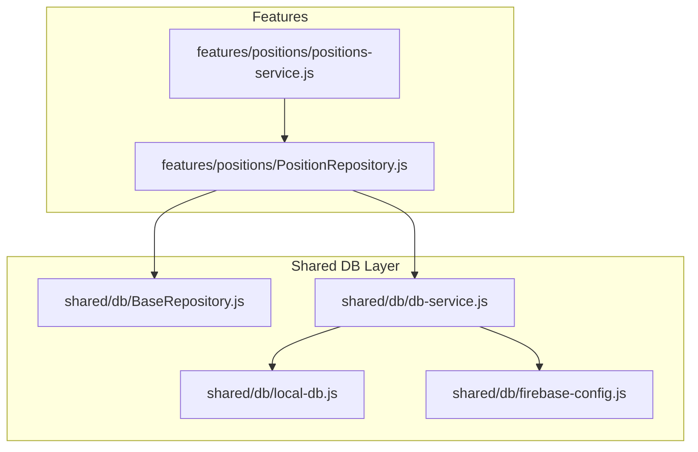
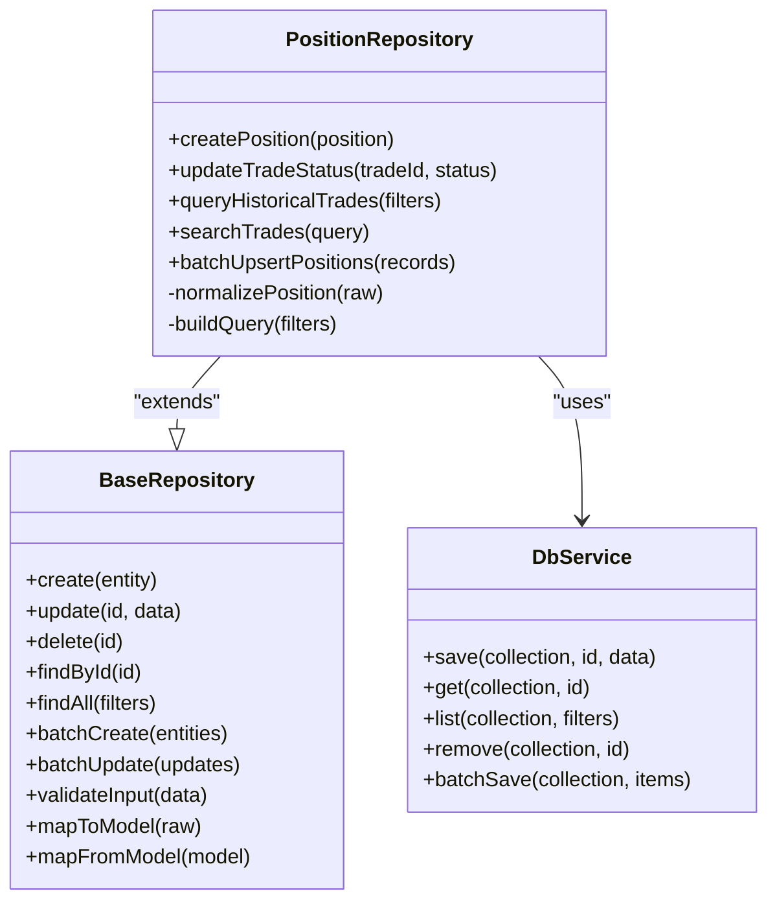
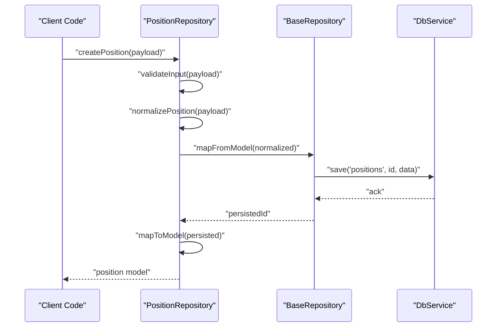
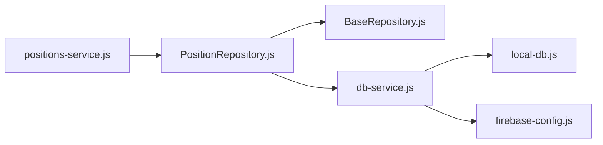

# Position Repository

<cite>
**Referenced Files in This Document**
- [PositionRepository.js](file://features/positions/PositionRepository.js)
- [BaseRepository.js](file://shared/db/BaseRepository.js)
- [positions-service.js](file://features/positions/positions-service.js)
- [db-service.js](file://shared/db/db-service.js)
- [local-db.js](file://shared/db/local-db.js)
- [firebase-config.js](file://shared/db/firebase-config.js)
</cite>

## Table of Contents
1. [Introduction](#introduction)
2. [Project Structure](#project-structure)
3. [Core Components](#core-components)
4. [Architecture Overview](#architecture-overview)
5. [Detailed Component Analysis](#detailed-component-analysis)
6. [Dependency Analysis](#dependency-analysis)
7. [Performance Considerations](#performance-considerations)
8. [Troubleshooting Guide](#troubleshooting-guide)
9. [Conclusion](#conclusion)

## Introduction
This document explains the Position Repository implementation used to manage position entities and trade data. It covers data access patterns, CRUD operations, filtering and search queries, transformation logic, parameter validation, error handling, integration with the base repository class, and performance strategies such as caching and persistence.

## Project Structure
The Position Repository is part of a feature-based layout where domain features encapsulate their own repositories and services. The shared database layer provides common infrastructure (base repository, database service, local storage, and configuration).

**Diagram sources**
- [PositionRepository.js](file://features/positions/PositionRepository.js)
- [BaseRepository.js](file://shared/db/BaseRepository.js)
- [positions-service.js](file://features/positions/positions-service.js)
- [db-service.js](file://shared/db/db-service.js)
- [local-db.js](file://shared/db/local-db.js)
- [firebase-config.js](file://shared/db/firebase-config.js)

**Section sources**
- [PositionRepository.js](file://features/positions/PositionRepository.js)
- [BaseRepository.js](file://shared/db/BaseRepository.js)
- [positions-service.js](file://features/positions/positions-service.js)
- [db-service.js](file://shared/db/db-service.js)
- [local-db.js](file://shared/db/local-db.js)
- [firebase-config.js](file://shared/db/firebase-config.js)

## Core Components
- PositionRepository: Implements domain-specific data access for positions and trades, including creation, updates, filtering, searching, and batch operations. It extends BaseRepository to reuse common persistence utilities and integrates with db-service for storage backends.
- BaseRepository: Provides shared methods for entity lifecycle management, query helpers, and consistent error handling.
- positions-service: Orchestrates business workflows using PositionRepository and may coordinate UI or other features.
- db-service: Abstracts persistence backends (e.g., local storage and Firebase), exposing unified read/write APIs.
- local-db and firebase-config: Provide backend-specific implementations and configuration.

Key responsibilities:
- Data access patterns: Encapsulate all persistence calls behind repository methods.
- CRUD operations: Create, read, update, delete position entities.
- Filtering and search: Query historical trades by filters (date range, symbol, status, etc.).
- Transformation: Normalize raw records into domain models and vice versa.
- Validation: Validate inputs before persistence.
- Error handling: Centralized error mapping and user-friendly messages.
- Integration: Leverage BaseRepository and db-service for consistency and testability.

**Section sources**
- [PositionRepository.js](file://features/positions/PositionRepository.js)
- [BaseRepository.js](file://shared/db/BaseRepository.js)
- [positions-service.js](file://features/positions/positions-service.js)
- [db-service.js](file://shared/db/db-service.js)
- [local-db.js](file://shared/db/local-db.js)
- [firebase-config.js](file://shared/db/firebase-config.js)

## Architecture Overview
The repository pattern separates domain logic from persistence details. PositionRepository depends on BaseRepository for common behavior and uses db-service to persist data across configured backends.

**Diagram sources**
- [BaseRepository.js](file://shared/db/BaseRepository.js)
- [PositionRepository.js](file://features/positions/PositionRepository.js)
- [db-service.js](file://shared/db/db-service.js)

## Detailed Component Analysis

### PositionRepository
Responsibilities:
- Implement domain-specific CRUD for positions and trades.
- Provide filtering and search over historical trades.
- Transform between raw storage format and domain models.
- Enforce parameter validation and consistent error handling.
- Support batch operations for performance.

Common methods and behaviors:
- createPosition: Validates input, normalizes fields, persists via BaseRepository/db-service, returns normalized model.
- updateTradeStatus: Validates tradeId and status, applies partial update, returns updated entity.
- queryHistoricalTrades: Builds query filters (date ranges, symbols, statuses), executes list/find, maps results to models.
- searchTrades: Applies text search across relevant fields, supports pagination/sorting if implemented.
- batchUpsertPositions: Accepts an array of records, validates each, performs batch save/upsert through db-service.

Data transformation:
- normalizePosition: Converts raw storage payloads to domain models (e.g., timestamps, enums, nested objects).
- buildQuery: Translates high-level filter objects into backend-specific query structures.

Parameter validation:
- Ensures required fields exist and have correct types.
- Normalizes optional values (e.g., trimming strings, coercing numbers).
- Rejects invalid states (e.g., unknown trade statuses).

Error handling:
- Wraps backend errors into repository-level exceptions or result objects.
- Maps network/storage errors to user-friendly messages.
- Logs contextual information for debugging without leaking sensitive data.

Integration with BaseRepository:
- Reuses common methods like findById, findAll, validateInput, mapToModel/mapFromModel.
- Extends with domain-specific overrides when needed.

Batch operations:
- Uses db-service batch endpoints to minimize round-trips.
- Applies transactional semantics if supported by the backend.

Examples of usage patterns:
- Creating a position record: call createPosition with validated payload; handle success/failure.
- Updating trade status: call updateTradeStatus with tradeId and new status; verify returned state.
- Querying historical trades: call queryHistoricalTrades with date range and symbol filters; iterate mapped results.
- Performing batch upserts: call batchUpsertPositions with an array of normalized records; process aggregated results.

**Diagram sources**
- [PositionRepository.js](file://features/positions/PositionRepository.js)
- [BaseRepository.js](file://shared/db/BaseRepository.js)
- [db-service.js](file://shared/db/db-service.js)

**Section sources**
- [PositionRepository.js](file://features/positions/PositionRepository.js)
- [BaseRepository.js](file://shared/db/BaseRepository.js)
- [db-service.js](file://shared/db/db-service.js)

### BaseRepository
Responsibilities:
- Provide generic CRUD scaffolding for any entity repository.
- Standardize validation, mapping, and error handling.
- Offer helper methods for querying and batching.

Key capabilities:
- Entity lifecycle: create, update, delete, find by id, list with filters.
- Mapping: mapToModel/mapFromModel to bridge storage and domain formats.
- Validation: validateInput for common field checks.
- Batch support: batchCreate/batchUpdate wrappers around db-service.

Integration points:
- Depends on db-service for persistence.
- Used by feature repositories (e.g., PositionRepository) to avoid duplication.

**Section sources**
- [BaseRepository.js](file://shared/db/BaseRepository.js)
- [db-service.js](file://shared/db/db-service.js)

### Database Service Abstraction
Responsibilities:
- Expose a unified API for saving, retrieving, listing, removing, and batch operations.
- Route calls to configured backends (local storage, Firebase).
- Handle connection setup and configuration.

Backends:
- local-db: Local persistence for development/offline scenarios.
- firebase-config: Remote persistence configuration and client initialization.

**Section sources**
- [db-service.js](file://shared/db/db-service.js)
- [local-db.js](file://shared/db/local-db.js)
- [firebase-config.js](file://shared/db/firebase-config.js)

### Positions Service
Responsibilities:
- Orchestrate higher-level workflows using PositionRepository.
- Coordinate UI interactions and feature modules.
- Optionally implement caching or memoization at the service layer.

**Section sources**
- [positions-service.js](file://features/positions/positions-service.js)
- [PositionRepository.js](file://features/positions/PositionRepository.js)

## Dependency Analysis
PositionRepository depends on BaseRepository for shared functionality and on db-service for persistence. The service layer composes these components to deliver feature capabilities.

**Diagram sources**
- [PositionRepository.js](file://features/positions/PositionRepository.js)
- [BaseRepository.js](file://shared/db/BaseRepository.js)
- [positions-service.js](file://features/positions/positions-service.js)
- [db-service.js](file://shared/db/db-service.js)
- [local-db.js](file://shared/db/local-db.js)
- [firebase-config.js](file://shared/db/firebase-config.js)

**Section sources**
- [PositionRepository.js](file://features/positions/PositionRepository.js)
- [BaseRepository.js](file://shared/db/BaseRepository.js)
- [positions-service.js](file://features/positions/positions-service.js)
- [db-service.js](file://shared/db/db-service.js)
- [local-db.js](file://shared/db/local-db.js)
- [firebase-config.js](file://shared/db/firebase-config.js)

## Performance Considerations
- Prefer batch operations for bulk writes to reduce network/storage overhead.
- Use targeted filters to limit result sets (date ranges, symbol filters).
- Apply pagination and sorting at the repository level when supported by the backend.
- Cache frequently accessed data at the service layer to avoid repeated queries.
- Normalize and transform data once per operation to minimize redundant work.
- Avoid unnecessary re-renders by returning stable references and minimizing object churn.

[No sources needed since this section provides general guidance]

## Troubleshooting Guide
Common issues and resolutions:
- Validation failures: Ensure required fields are present and correctly typed; check normalization steps.
- Persistence errors: Inspect backend connectivity and permissions; review db-service logs.
- Unexpected nulls after mapping: Verify mapToModel/mapFromModel transformations cover all fields.
- Slow queries: Add filters, indexes (backend-dependent), and pagination.
- Inconsistent state after updates: Confirm partial updates merge correctly and return full entities.

Operational tips:
- Log context-rich but non-sensitive information around repository calls.
- Wrap repository calls in try/catch blocks at the service layer to surface meaningful errors.
- Use unit tests to assert validation, mapping, and error paths.

**Section sources**
- [PositionRepository.js](file://features/positions/PositionRepository.js)
- [BaseRepository.js](file://shared/db/BaseRepository.js)
- [db-service.js](file://shared/db/db-service.js)

## Conclusion
The Position Repository encapsulates all position-related data access, providing clear CRUD operations, robust filtering and search, and reliable transformation and validation. By extending BaseRepository and integrating with db-service, it ensures consistent persistence across backends while keeping domain logic clean and testable. Adopting batch operations, targeted queries, and service-layer caching further improves performance and responsiveness.

[No sources needed since this section summarizes without analyzing specific files]