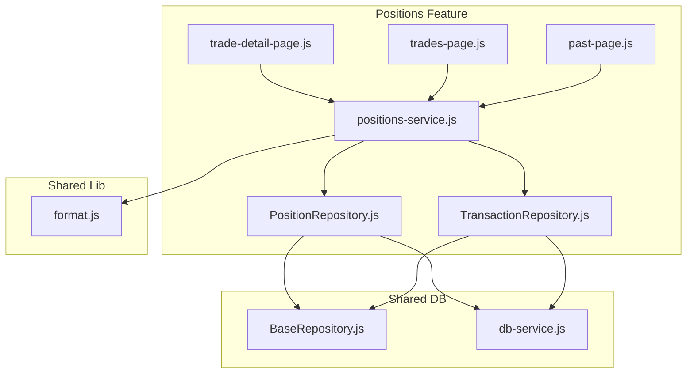
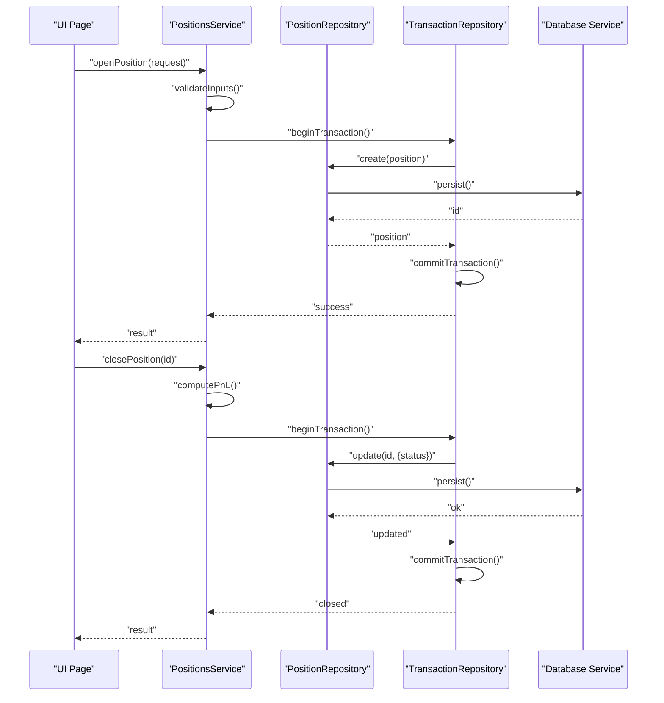
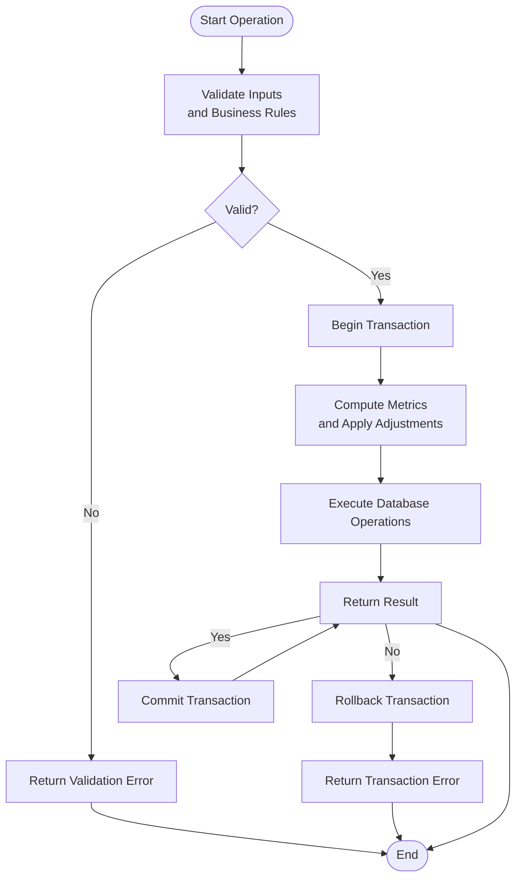
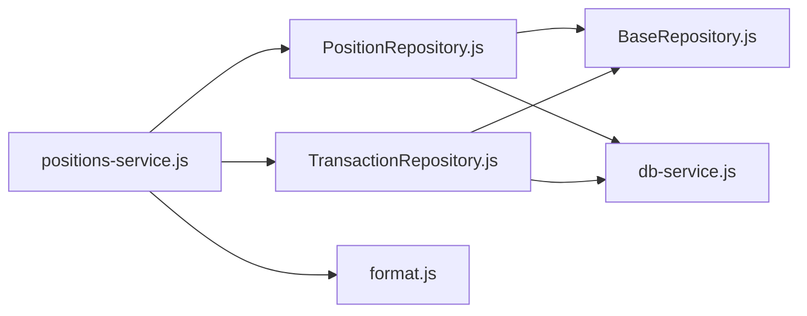

# Positions Service Layer

<cite>
**Referenced Files in This Document**
- [positions-service.js](file://features/positions/positions-service.js)
- [PositionRepository.js](file://features/positions/PositionRepository.js)
- [TransactionRepository.js](file://features/positions/TransactionRepository.js)
- [trade-detail-page.js](file://features/positions/trade-detail-page.js)
- [trades-page.js](file://features/positions/trades-page.js)
- [past-page.js](file://features/positions/past-page.js)
- [BaseRepository.js](file://shared/db/BaseRepository.js)
- [db-service.js](file://shared/db/db-service.js)
- [format.js](file://shared/lib/format.js)
</cite>

## Update Summary
**Changes Made**
- Enhanced transaction handling capabilities in the positions service layer
- Added integration with new TransactionRepository for improved data consistency
- Updated repository coordination patterns to support atomic operations
- Strengthened error handling and rollback mechanisms for position operations

## Table of Contents
1. [Introduction](#introduction)
2. [Project Structure](#project-structure)
3. [Core Components](#core-components)
4. [Architecture Overview](#architecture-overview)
5. [Detailed Component Analysis](#detailed-component-analysis)
6. [Dependency Analysis](#dependency-analysis)
7. [Performance Considerations](#performance-considerations)
8. [Troubleshooting Guide](#troubleshooting-guide)
9. [Conclusion](#conclusion)
10. [Appendices](#appendices)

## Introduction
This document explains the Positions Service Layer, focusing on business logic orchestration, position lifecycle management, P&L calculation algorithms, and coordination between repositories and UI components. It covers service methods for position operations, validation rules, business rule enforcement, and integration with external services. The service layer now features enhanced transaction handling and improved integration with the TransactionRepository for better data consistency and atomic operations. It also includes concrete examples of calculating position metrics, managing position states, handling position correlations, and generating performance reports, while addressing complex business logic such as multi-currency calculations, leverage adjustments, and risk management rules.

## Project Structure
The Positions feature is implemented under features/positions and integrates with shared database utilities and formatting helpers. The key files are:
- positions-service.js: Orchestrates business logic, validations, computations, and transaction management for positions.
- PositionRepository.js: Encapsulates persistence and retrieval of position data with enhanced transaction support.
- TransactionRepository.js: New repository providing specialized transaction handling and atomic operations.
- trade-detail-page.js, trades-page.js, past-page.js: UI pages that consume the service layer.
- BaseRepository.js, db-service.js: Shared repository base and database access utilities.
- format.js: Formatting helpers used by the service and UI.

**Diagram sources**
- [positions-service.js](file://features/positions/positions-service.js)
- [PositionRepository.js](file://features/positions/PositionRepository.js)
- [TransactionRepository.js](file://features/positions/TransactionRepository.js)
- [trade-detail-page.js](file://features/positions/trade-detail-page.js)
- [trades-page.js](file://features/positions/trades-page.js)
- [past-page.js](file://features/positions/past-page.js)
- [BaseRepository.js](file://shared/db/BaseRepository.js)
- [db-service.js](file://shared/db/db-service.js)
- [format.js](file://shared/lib/format.js)

**Section sources**
- [positions-service.js](file://features/positions/positions-service.js)
- [PositionRepository.js](file://features/positions/PositionRepository.js)
- [TransactionRepository.js](file://features/positions/TransactionRepository.js)
- [trade-detail-page.js](file://features/positions/trade-detail-page.js)
- [trades-page.js](file://features/positions/trades-page.js)
- [past-page.js](file://features/positions/past-page.js)
- [BaseRepository.js](file://shared/db/BaseRepository.js)
- [db-service.js](file://shared/db/db-service.js)
- [format.js](file://shared/lib/format.js)

## Core Components
- PositionsService (positions-service.js): Central orchestrator for position operations including creation, updates, closures, state transitions, P&L computation, currency normalization, leverage adjustments, correlation grouping, and report generation. It enforces business rules, coordinates with repositories, and manages transactions for data consistency.
- PositionRepository (PositionRepository.js): Data access abstraction over persistent storage, providing CRUD operations, queries, batch processing, and enhanced transaction support for positions. It extends BaseRepository and uses db-service for underlying persistence.
- TransactionRepository (TransactionRepository.js): New specialized repository providing atomic transaction operations, rollback capabilities, and coordinated updates across multiple data entities. It ensures data integrity during complex position operations.
- UI Pages (trade-detail-page.js, trades-page.js, past-page.js): Presentational layers that call service methods to render position lists, details, and historical views. They rely on formatted outputs from the service and formatting helpers.

Key responsibilities:
- Business rule enforcement: validate inputs, ensure consistent state transitions, enforce risk limits.
- Transaction management: coordinate atomic operations across position and transaction repositories.
- P&L and metrics: compute realized/unrealized P&L, exposure, margin usage, leverage-adjusted returns, and multi-currency conversions.
- Correlations: group positions by symbol or strategy and aggregate metrics.
- Reports: generate summaries and time-series snapshots for dashboards.

**Section sources**
- [positions-service.js](file://features/positions/positions-service.js)
- [PositionRepository.js](file://features/positions/PositionRepository.js)
- [TransactionRepository.js](file://features/positions/TransactionRepository.js)
- [trade-detail-page.js](file://features/positions/trade-detail-page.js)
- [trades-page.js](file://features/positions/trades-page.js)
- [past-page.js](file://features/positions/past-page.js)

## Architecture Overview
The Positions Service Layer follows a layered architecture with enhanced transaction support:
- Presentation layer (UI pages) calls service methods.
- Service layer applies business logic, validates inputs, computes metrics, and delegates persistence to repositories with transaction coordination.
- Repository layer abstracts data access using shared database utilities with improved transaction handling.

**Diagram sources**
- [positions-service.js](file://features/positions/positions-service.js)
- [PositionRepository.js](file://features/positions/PositionRepository.js)
- [TransactionRepository.js](file://features/positions/TransactionRepository.js)
- [db-service.js](file://shared/db/db-service.js)

## Detailed Component Analysis

### PositionsService
Responsibilities:
- Input validation and business rule enforcement for all position operations.
- Lifecycle management: open, modify, close, archive, restore.
- Transaction coordination: manage atomic operations across position and transaction repositories.
- P&L calculation: realized/unrealized P&L, fees, slippage, commissions.
- Multi-currency normalization: convert P&L and balances to reporting currency.
- Leverage adjustments: adjust exposure and margin requirements based on leverage.
- Risk management: enforce max drawdown, per-position limits, concentration caps.
- Correlation handling: group positions by symbol/strategy and aggregate metrics.
- Report generation: summary statistics, time-series snapshots, exportable formats.

Key methods (described conceptually):
- openPosition(request): Validates request fields, checks risk limits, begins transaction, persists new position, initializes state, commits transaction.
- updatePosition(id, changes): Applies allowed state transitions, recalculates metrics, begins transaction, persists updates, commits transaction.
- closePosition(id): Begins transaction, computes final P&L, applies fees/commissions, updates status, archives if needed, commits transaction.
- getPositions(filters): Queries positions with filters, enriches with computed metrics.
- getPositionById(id): Retrieves single position with full context.
- calculatePnL(position): Computes realized/unrealized P&L using entry/exit prices, quantity, fees, and currency conversion.
- normalizeCurrency(amount, fromCurrency, toCurrency): Converts amounts to reporting currency using exchange rates.
- applyLeverageAdjustment(exposure, leverage): Adjusts margin and exposure based on leverage.
- enforceRiskRules(position, portfolio): Checks drawdown, concentration, and per-position limits.
- correlatePositions(groupBy): Groups positions by symbol or strategy and aggregates metrics.
- generateReport(period, metrics): Produces summary and time-series data for dashboards.
- executeTransaction(operation): Manages transaction lifecycle for complex multi-step operations.

Validation rules and business constraints:
- Required fields: symbol, direction, quantity, entry price, currency, leverage, timestamps.
- Quantity must be positive; leverage must be within allowed bounds.
- State transitions: open -> modifying -> closed; invalid transitions rejected.
- Risk limits: maximum position size, portfolio drawdown thresholds, concentration caps.
- Currency consistency: P&L normalized to reporting currency before aggregation.

Multi-currency considerations:
- Exchange rate source and timestamping for accurate conversions.
- Handling rounding and precision consistently across calculations.
- Currency mismatch detection and resolution strategies.

Leverage adjustments:
- Exposure scaling proportional to leverage.
- Margin requirement calculations considering leverage and asset volatility.
- Risk limit checks after leverage application.

Correlation handling:
- Grouping by symbol or strategy to compute aggregated exposure and P&L.
- Deduplication and conflict resolution when merging correlated positions.

Report generation:
- Aggregating daily P&L, cumulative returns, drawdowns, Sharpe-like metrics.
- Export formats suitable for dashboards and analytics.

Enhanced transaction handling:
- Atomic operations ensure data consistency across position and transaction repositories.
- Rollback capabilities for failed operations prevent partial updates.
- Coordinated updates maintain referential integrity between related entities.

**Diagram sources**
- [positions-service.js](file://features/positions/positions-service.js)

**Section sources**
- [positions-service.js](file://features/positions/positions-service.js)

### PositionRepository
Responsibilities:
- CRUD operations for positions with enhanced transaction support.
- Querying with filters and sorting.
- Batch updates and transactions where supported.
- Extending BaseRepository for common persistence patterns.

Integration points:
- Uses db-service for database interactions.
- Implements BaseRepository methods for standardized behavior.
- Coordinates with TransactionRepository for atomic operations.

Example operations:
- create(position): Inserts a new position record within transaction context.
- update(id, changes): Updates existing position fields atomically within transaction.
- delete(id): Removes position record with transaction safety.
- findById(id): Retrieves a single position.
- findByFilters(filters): Returns filtered list of positions.
- batchUpdate(ids, changes): Applies bulk updates efficiently within transaction scope.

**Section sources**
- [PositionRepository.js](file://features/positions/PositionRepository.js)
- [BaseRepository.js](file://shared/db/BaseRepository.js)
- [db-service.js](file://shared/db/db-service.js)

### TransactionRepository
Responsibilities:
- Provides atomic transaction operations for complex position workflows.
- Manages transaction lifecycle: begin, commit, rollback.
- Coordinates updates across multiple repositories.
- Ensures data consistency and referential integrity.
- Handles error scenarios and automatic rollback on failures.

Key capabilities:
- beginTransaction(): Initiates a new transaction context.
- commitTransaction(): Commits all pending operations successfully.
- rollbackTransaction(): Rolls back all operations in case of failure.
- executeInTransaction(operation): Executes a function within transaction context.
- addOperation(operation): Registers operations for coordinated execution.

Integration benefits:
- Prevents partial updates during complex position operations.
- Maintains consistency between positions and related transactions.
- Simplifies error handling and recovery mechanisms.
- Improves reliability of multi-step business processes.

**Section sources**
- [TransactionRepository.js](file://features/positions/TransactionRepository.js)

### UI Integration (Pages)
- trade-detail-page.js: Displays detailed view of a single position, calling service methods to fetch and update position data with transaction safety.
- trades-page.js: Lists active positions with filters and pagination, leveraging service methods for querying and computed metrics.
- past-page.js: Shows historical/closed positions, aggregating results for reporting.

These pages consume formatted outputs from the service and use format.js helpers for display.

**Section sources**
- [trade-detail-page.js](file://features/positions/trade-detail-page.js)
- [trades-page.js](file://features/positions/trades-page.js)
- [past-page.js](file://features/positions/past-page.js)
- [format.js](file://shared/lib/format.js)

## Dependency Analysis
The Positions Service Layer depends on:
- PositionRepository for persistence with enhanced transaction support.
- TransactionRepository for atomic operation coordination.
- BaseRepository for shared repository behaviors.
- db-service for database access.
- format.js for number and currency formatting.

**Diagram sources**
- [positions-service.js](file://features/positions/positions-service.js)
- [PositionRepository.js](file://features/positions/PositionRepository.js)
- [TransactionRepository.js](file://features/positions/TransactionRepository.js)
- [BaseRepository.js](file://shared/db/BaseRepository.js)
- [db-service.js](file://shared/db/db-service.js)
- [format.js](file://shared/lib/format.js)

**Section sources**
- [positions-service.js](file://features/positions/positions-service.js)
- [PositionRepository.js](file://features/positions/PositionRepository.js)
- [TransactionRepository.js](file://features/positions/TransactionRepository.js)
- [BaseRepository.js](file://shared/db/BaseRepository.js)
- [db-service.js](file://shared/db/db-service.js)
- [format.js](file://shared/lib/format.js)

## Performance Considerations
- Minimize redundant computations by caching derived metrics and refreshing on relevant updates.
- Use batch operations for bulk updates to reduce database round-trips.
- Defer heavy computations (e.g., report generation) to background tasks or on-demand triggers.
- Optimize queries with appropriate filters and indexes at the repository level.
- Normalize currencies once per operation and reuse exchange rates within a transaction scope.
- Leverage transaction batching to reduce network overhead and improve consistency.
- Implement connection pooling for database operations within transactions.
- Monitor transaction duration and optimize long-running operations.

## Troubleshooting Guide
Common issues and resolutions:
- Validation errors: Ensure required fields are present and within allowed ranges; check business rule constraints like leverage bounds and quantity positivity.
- State transition failures: Verify current position status and allowed transitions; log detailed error messages for debugging.
- Currency conversion discrepancies: Confirm exchange rate source and timestamps; handle rounding consistently.
- Performance bottlenecks: Profile repository queries; consider batching and caching strategies.
- Persistence failures: Inspect database connectivity and transaction logs; verify schema compatibility.
- Transaction failures: Check for deadlock conditions, timeout issues, and constraint violations; implement retry logic for transient failures.
- Data inconsistency: Verify transaction boundaries and ensure all related operations are included in the same transaction context.

**Section sources**
- [positions-service.js](file://features/positions/positions-service.js)
- [PositionRepository.js](file://features/positions/PositionRepository.js)
- [TransactionRepository.js](file://features/positions/TransactionRepository.js)
- [db-service.js](file://shared/db/db-service.js)

## Conclusion
The Positions Service Layer centralizes business logic for position lifecycle management, P&L calculations, multi-currency handling, leverage adjustments, and risk enforcement. With enhanced transaction handling and improved integration with the TransactionRepository, it provides robust data consistency and atomic operations. The service coordinates with repositories for persistence and provides formatted outputs to UI components. By adhering to strict validation and business rules, it ensures reliable and auditable position operations across the application with improved reliability through transaction management.

## Appendices

### Example Scenarios

- Calculating position metrics:
  - Compute unrealized P&L using current market price, entry price, quantity, and fees.
  - Normalize P&L to reporting currency using exchange rates.
  - Adjust exposure and margin requirements based on leverage.

- Managing position states with transactions:
  - Open a position with validated inputs and initial metrics within a transaction.
  - Update position parameters while enforcing allowed transitions with transaction safety.
  - Close a position, finalize P&L, and archive if necessary within an atomic transaction.

- Handling position correlations:
  - Group positions by symbol or strategy.
  - Aggregate exposure and P&L across correlated groups.
  - Resolve conflicts and deduplicate overlapping positions.

- Generating performance reports:
  - Summarize daily P&L, cumulative returns, and drawdowns.
  - Provide time-series snapshots for dashboard visualization.
  - Export data in formats compatible with analytics tools.

- Transaction-based operations:
  - Execute complex multi-step operations atomically using transaction coordination.
  - Handle rollback scenarios gracefully when any step fails.
  - Maintain data consistency across position and transaction repositories.