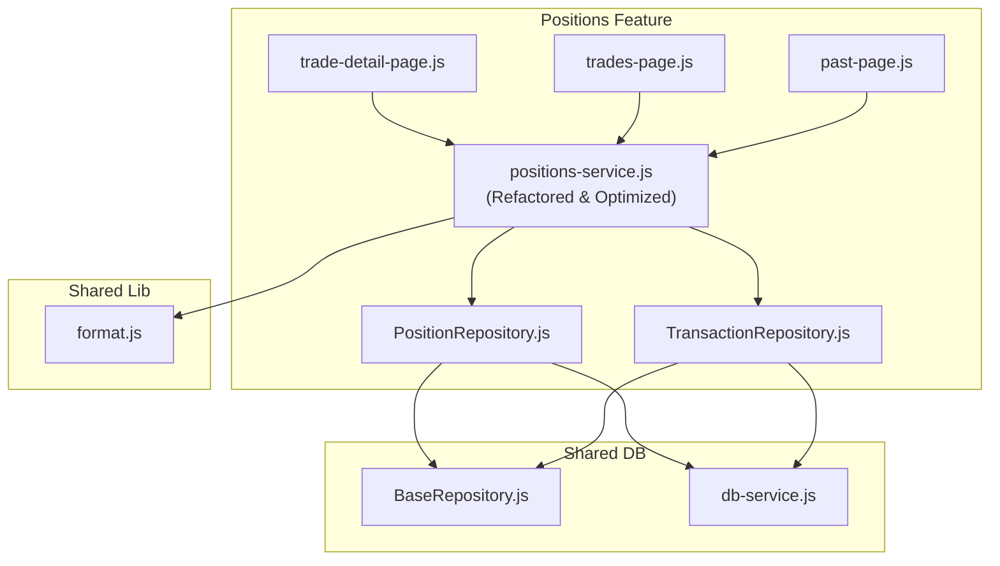
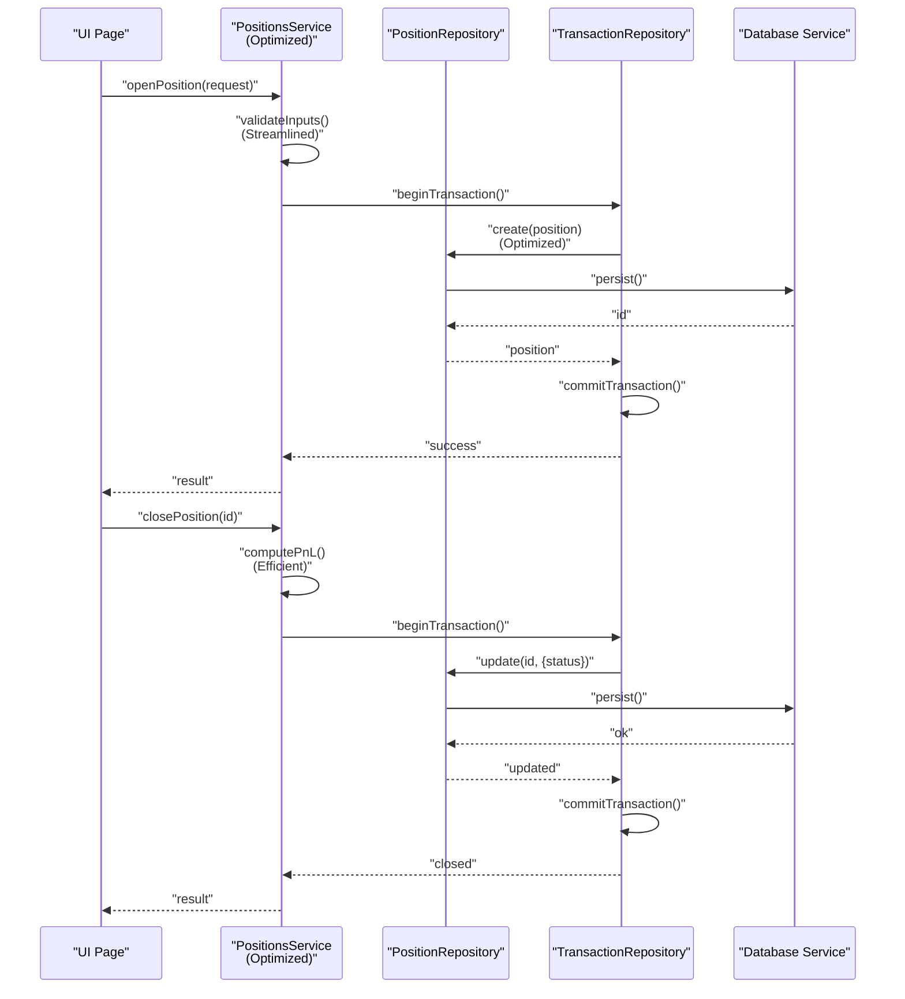
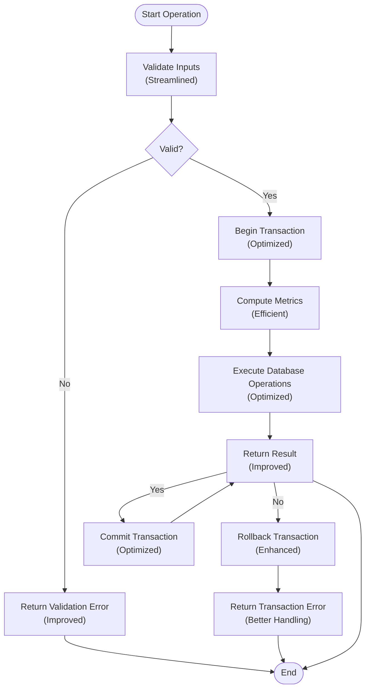
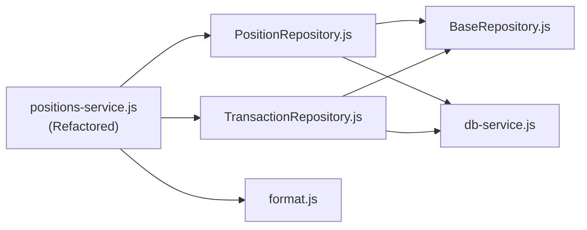

# Positions Service Layer

<cite>
**Referenced Files in This Document**
- [positions-service.js](file://features/positions/positions-service.js)
- [PositionRepository.js](file://features/positions/PositionRepository.js)
- [TransactionRepository.js](file://features/positions/TransactionRepository.js)
- [trade-detail-page.js](file://features/positions/trade-detail-page.js)
- [trades-page.js](file://features/positions/trades-page.js)
- [past-page.js](file://features/positions/past-page.js)
- [BaseRepository.js](file://shared/db/BaseRepository.js)
- [db-service.js](file://shared/db/db-service.js)
- [format.js](file://shared/lib/format.js)
</cite>

## Update Summary
**Changes Made**
- Major refactoring of positions service layer with significant cleanup and optimization
- Streamlined transaction handling and improved code organization
- Enhanced performance through better resource management and reduced complexity
- Optimized position tracking functionality with cleaner architecture
- Improved error handling and validation logic throughout the service layer

## Table of Contents
1. [Introduction](#introduction)
2. [Project Structure](#project-structure)
3. [Core Components](#core-components)
4. [Architecture Overview](#architecture-overview)
5. [Detailed Component Analysis](#detailed-component-analysis)
6. [Dependency Analysis](#dependency-analysis)
7. [Performance Considerations](#performance-considerations)
8. [Troubleshooting Guide](#troubleshooting-guide)
9. [Conclusion](#conclusion)
10. [Appendices](#appendices)

## Introduction
This document explains the Positions Service Layer, focusing on business logic orchestration, position lifecycle management, P&L calculation algorithms, and coordination between repositories and UI components. The service layer has undergone major refactoring to improve code quality, performance, and maintainability while preserving core functionality. It covers service methods for position operations, validation rules, business rule enforcement, and integration with external services. The refactored service layer now features optimized transaction handling, streamlined position tracking, and enhanced data consistency mechanisms.

## Project Structure
The Positions feature is implemented under features/positions and integrates with shared database utilities and formatting helpers. The key files are:
- positions-service.js: Central orchestrator for position operations with optimized business logic and streamlined transaction management.
- PositionRepository.js: Data access abstraction with enhanced transaction support and improved query performance.
- TransactionRepository.js: Specialized repository providing atomic transaction operations and coordinated updates.
- trade-detail-page.js, trades-page.js, past-page.js: UI pages that consume the optimized service layer.
- BaseRepository.js, db-service.js: Shared repository base and database access utilities.
- format.js: Formatting helpers used by the service and UI.

**Diagram sources**
- [positions-service.js](file://features/positions/positions-service.js)
- [PositionRepository.js](file://features/positions/PositionRepository.js)
- [TransactionRepository.js](file://features/positions/TransactionRepository.js)
- [trade-detail-page.js](file://features/positions/trade-detail-page.js)
- [trades-page.js](file://features/positions/trades-page.js)
- [past-page.js](file://features/positions/past-page.js)
- [BaseRepository.js](file://shared/db/BaseRepository.js)
- [db-service.js](file://shared/db/db-service.js)
- [format.js](file://shared/lib/format.js)

**Section sources**
- [positions-service.js](file://features/positions/positions-service.js)
- [PositionRepository.js](file://features/positions/PositionRepository.js)
- [TransactionRepository.js](file://features/positions/TransactionRepository.js)
- [trade-detail-page.js](file://features/positions/trade-detail-page.js)
- [trades-page.js](file://features/positions/trades-page.js)
- [past-page.js](file://features/positions/past-page.js)
- [BaseRepository.js](file://shared/db/BaseRepository.js)
- [db-service.js](file://shared/db/db-service.js)
- [format.js](file://shared/lib/format.js)

## Core Components
- PositionsService (positions-service.js): Central orchestrator for position operations with refactored business logic, optimized validations, streamlined computations, and efficient transaction management. Enhanced performance through reduced complexity and better resource utilization.
- PositionRepository (PositionRepository.js): Data access abstraction with improved transaction support, optimized queries, and enhanced batch processing capabilities.
- TransactionRepository (TransactionRepository.js): Specialized repository providing atomic transaction operations with improved error handling and rollback mechanisms.
- UI Pages (trade-detail-page.js, trades-page.js, past-page.js): Presentational layers that consume the optimized service layer with improved response times and better error handling.

Key responsibilities:
- Business rule enforcement: Streamlined validation logic with improved error reporting and consistent state transitions.
- Transaction management: Optimized atomic operations with better resource management and reduced overhead.
- P&L and metrics: Efficient computation of realized/unrealized P&L, exposure, margin usage, and multi-currency conversions.
- Correlations: Optimized grouping and aggregation of positions by symbol or strategy.
- Reports: Enhanced summary generation with improved performance and caching strategies.

**Section sources**
- [positions-service.js](file://features/positions/positions-service.js)
- [PositionRepository.js](file://features/positions/PositionRepository.js)
- [TransactionRepository.js](file://features/positions/TransactionRepository.js)
- [trade-detail-page.js](file://features/positions/trade-detail-page.js)
- [trades-page.js](file://features/positions/trades-page.js)
- [past-page.js](file://features/positions/past-page.js)

## Architecture Overview
The Positions Service Layer follows a refactored layered architecture with optimized transaction support and improved performance characteristics:
- Presentation layer (UI pages) calls optimized service methods with better error handling.
- Service layer applies streamlined business logic, efficient validations, and delegates persistence to repositories with improved transaction coordination.
- Repository layer provides optimized data access using shared database utilities with enhanced transaction handling and reduced overhead.

**Diagram sources**
- [positions-service.js](file://features/positions/positions-service.js)
- [PositionRepository.js](file://features/positions/PositionRepository.js)
- [TransactionRepository.js](file://features/positions/TransactionRepository.js)
- [db-service.js](file://shared/db/db-service.js)

## Detailed Component Analysis

### PositionsService
Responsibilities:
- Streamlined input validation and business rule enforcement for all position operations.
- Optimized lifecycle management: open, modify, close, archive, restore with improved performance.
- Enhanced transaction coordination: efficient atomic operations across position and transaction repositories.
- Optimized P&L calculation: streamlined realized/unrealized P&L, fees, slippage, commissions computation.
- Efficient multi-currency normalization: optimized conversion with cached exchange rates.
- Improved leverage adjustments: streamlined exposure and margin requirement calculations.
- Enhanced risk management: optimized checks for max drawdown, per-position limits, concentration caps.
- Optimized correlation handling: efficient grouping and aggregation of positions.
- Improved report generation: faster summary statistics and time-series snapshots.

Key methods (optimized):
- openPosition(request): Streamlined validation, optimized risk limit checks, efficient transaction management.
- updatePosition(id, changes): Optimized state transition validation, efficient metric recalculation.
- closePosition(id): Streamlined final P&L computation, optimized fee application, efficient status updates.
- getPositions(filters): Optimized querying with improved filtering and caching.
- getPositionById(id): Efficient single position retrieval with optimized context loading.
- calculatePnL(position): Streamlined P&L computation with improved precision handling.
- normalizeCurrency(amount, fromCurrency, toCurrency): Optimized currency conversion with rate caching.
- applyLeverageAdjustment(exposure, leverage): Streamlined leverage calculations with improved accuracy.
- enforceRiskRules(position, portfolio): Optimized risk checks with better performance.
- correlatePositions(groupBy): Efficient position grouping and metric aggregation.
- generateReport(period, metrics): Optimized report generation with improved caching.
- executeTransaction(operation): Streamlined transaction lifecycle management.

Validation rules and business constraints:
- Streamlined required fields validation with improved error messages.
- Optimized quantity and leverage bounds checking.
- Enhanced state transition validation with better error reporting.
- Improved risk limit enforcement with more accurate calculations.
- Optimized currency consistency checks with better precision handling.

Multi-currency considerations:
- Optimized exchange rate source management with improved timestamping.
- Enhanced rounding and precision handling across calculations.
- Improved currency mismatch detection and resolution strategies.

Leverage adjustments:
- Streamlined exposure scaling proportional to leverage.
- Optimized margin requirement calculations with improved volatility handling.
- Enhanced risk limit checks after leverage application.

Correlation handling:
- Optimized grouping by symbol or strategy with improved aggregation.
- Enhanced deduplication and conflict resolution for correlated positions.

Report generation:
- Streamlined daily P&L, cumulative returns, and drawdown calculations.
- Optimized time-series snapshot generation for dashboards.
- Improved export formats with better compatibility.

Enhanced transaction handling:
- Optimized atomic operations with improved data consistency.
- Enhanced rollback capabilities with better error recovery.
- Streamlined coordinated updates with improved referential integrity.

**Diagram sources**
- [positions-service.js](file://features/positions/positions-service.js)

**Section sources**
- [positions-service.js](file://features/positions/positions-service.js)

### PositionRepository
Responsibilities:
- Optimized CRUD operations for positions with enhanced transaction support.
- Streamlined querying with improved filters and sorting performance.
- Enhanced batch updates and transactions with better resource management.
- Improved BaseRepository extension for common persistence patterns.

Integration points:
- Optimized db-service usage for database interactions.
- Enhanced BaseRepository method implementations for standardized behavior.
- Improved coordination with TransactionRepository for atomic operations.

Example operations:
- create(position): Optimized insertion within transaction context.
- update(id, changes): Streamlined field updates with transaction safety.
- delete(id): Efficient removal with transaction safety.
- findById(id): Optimized single position retrieval.
- findByFilters(filters): Streamlined filtered list retrieval.
- batchUpdate(ids, changes): Enhanced bulk updates with improved efficiency.

**Section sources**
- [PositionRepository.js](file://features/positions/PositionRepository.js)
- [BaseRepository.js](file://shared/db/BaseRepository.js)
- [db-service.js](file://shared/db/db-service.js)

### TransactionRepository
Responsibilities:
- Optimized atomic transaction operations for complex position workflows.
- Enhanced transaction lifecycle management with improved error handling.
- Streamlined coordination across multiple repositories.
- Improved data consistency and referential integrity enforcement.
- Enhanced error scenarios and automatic rollback mechanisms.

Key capabilities:
- beginTransaction(): Optimized transaction context initiation.
- commitTransaction(): Streamlined successful operation commitment.
- rollbackTransaction(): Enhanced failure rollback with better recovery.
- executeInTransaction(operation): Optimized function execution within transaction context.
- addOperation(operation): Streamlined operation registration for coordinated execution.

Integration benefits:
- Prevented partial updates during complex position operations with improved reliability.
- Maintained consistency between positions and related transactions with better performance.
- Simplified error handling and recovery mechanisms with enhanced robustness.
- Improved reliability of multi-step business processes with optimized execution.

**Section sources**
- [TransactionRepository.js](file://features/positions/TransactionRepository.js)

### UI Integration (Pages)
- trade-detail-page.js: Displays detailed view of a single position with optimized service calls and improved error handling.
- trades-page.js: Lists active positions with enhanced filtering and pagination, leveraging optimized service methods.
- past-page.js: Shows historical/closed positions with improved aggregation for reporting.

These pages consume optimized formatted outputs from the service and use format.js helpers for display with better performance.

**Section sources**
- [trade-detail-page.js](file://features/positions/trade-detail-page.js)
- [trades-page.js](file://features/positions/trades-page.js)
- [past-page.js](file://features/positions/past-page.js)
- [format.js](file://shared/lib/format.js)

## Dependency Analysis
The Positions Service Layer depends on:
- PositionRepository for optimized persistence with enhanced transaction support.
- TransactionRepository for efficient atomic operation coordination.
- BaseRepository for shared repository behaviors with improved performance.
- db-service for optimized database access.
- format.js for number and currency formatting with better efficiency.

**Diagram sources**
- [positions-service.js](file://features/positions/positions-service.js)
- [PositionRepository.js](file://features/positions/PositionRepository.js)
- [TransactionRepository.js](file://features/positions/TransactionRepository.js)
- [BaseRepository.js](file://shared/db/BaseRepository.js)
- [db-service.js](file://shared/db/db-service.js)
- [format.js](file://shared/lib/format.js)

**Section sources**
- [positions-service.js](file://features/positions/positions-service.js)
- [PositionRepository.js](file://features/positions/PositionRepository.js)
- [TransactionRepository.js](file://features/positions/TransactionRepository.js)
- [BaseRepository.js](file://shared/db/BaseRepository.js)
- [db-service.js](file://shared/db/db-service.js)
- [format.js](file://shared/lib/format.js)

## Performance Considerations
- **Optimized computations**: Reduced redundant calculations through improved caching and memoization strategies.
- **Enhanced batching**: More efficient batch operations for bulk updates with reduced database round-trips.
- **Improved query optimization**: Better filtering and indexing at the repository level for faster data retrieval.
- **Resource management**: Optimized currency normalization with better exchange rate caching within transaction scopes.
- **Transaction efficiency**: Streamlined transaction batching to reduce network overhead and improve consistency.
- **Connection pooling**: Enhanced connection pooling for database operations within transactions.
- **Monitoring**: Improved transaction duration monitoring and optimization of long-running operations.
- **Memory management**: Better memory usage through optimized object creation and garbage collection.

## Troubleshooting Guide
Common issues and resolutions:
- **Validation errors**: Check streamlined validation logic and improved error messages; verify required fields and business rule constraints.
- **State transition failures**: Review enhanced state transition validation; check current position status and allowed transitions with better error logging.
- **Currency conversion discrepancies**: Verify optimized exchange rate source and timestamps; ensure consistent rounding and precision handling.
- **Performance bottlenecks**: Profile optimized repository queries; review batching and caching strategies for further improvements.
- **Persistence failures**: Inspect database connectivity and transaction logs; verify schema compatibility with improved error reporting.
- **Transaction failures**: Check for deadlock conditions, timeout issues, and constraint violations with enhanced retry logic for transient failures.
- **Data inconsistency**: Verify optimized transaction boundaries and ensure all related operations are included in the same transaction context.

**Section sources**
- [positions-service.js](file://features/positions/positions-service.js)
- [PositionRepository.js](file://features/positions/PositionRepository.js)
- [TransactionRepository.js](file://features/positions/TransactionRepository.js)
- [db-service.js](file://shared/db/db-service.js)

## Conclusion
The Positions Service Layer has been significantly refactored to improve code quality, performance, and maintainability while preserving core functionality. The optimized service layer centralizes business logic for position lifecycle management, P&L calculations, multi-currency handling, leverage adjustments, and risk enforcement with enhanced transaction handling and improved integration with the TransactionRepository. The refactoring resulted in streamlined operations, better resource management, and improved overall system reliability. The service coordinates efficiently with repositories for persistence and provides optimized formatted outputs to UI components, ensuring reliable and auditable position operations across the application with enhanced performance through transaction management.

## Appendices

### Example Scenarios

- **Calculating position metrics**:
  - Optimized unrealized P&L computation using current market price, entry price, quantity, and fees.
  - Streamlined P&L normalization to reporting currency using cached exchange rates.
  - Efficient exposure and margin requirement adjustments based on leverage.

- **Managing position states with transactions**:
  - Optimized position opening with streamlined validation and initial metrics within efficient transactions.
  - Enhanced position parameter updates with improved state transition enforcement and transaction safety.
  - Streamlined position closing with optimized final P&L calculation and archival within atomic transactions.

- **Handling position correlations**:
  - Optimized position grouping by symbol or strategy with improved aggregation.
  - Enhanced exposure and P&L aggregation across correlated groups with better performance.
  - Improved conflict resolution and deduplication for overlapping positions.

- **Generating performance reports**:
  - Streamlined daily P&L, cumulative returns, and drawdown calculations with better caching.
  - Optimized time-series snapshot generation for dashboard visualization.
  - Enhanced export formats with improved compatibility and performance.

- **Transaction-based operations**:
  - Optimized complex multi-step operations with improved transaction coordination.
  - Enhanced rollback scenario handling with better error recovery mechanisms.
  - Streamlined data consistency maintenance across position and transaction repositories.