# Positions Tracking

<cite>
**Referenced Files in This Document**
- [PositionRepository.js](file://features/positions/PositionRepository.js)
- [TransactionRepository.js](file://features/positions/TransactionRepository.js)
- [positions-service.js](file://features/positions/positions-service.js)
- [trades-page.js](file://features/positions/trades-page.js)
- [past-page.js](file://features/positions/past-page.js)
- [trade-detail-page.js](file://features/positions/trade-detail-page.js)
- [BaseRepository.js](file://shared/db/BaseRepository.js)
- [db-service.js](file://shared/db/db-service.js)
- [local-db.js](file://shared/db/local-db.js)
- [trade-list.js](file://features/common/trade-list.js)
- [trade-modal.js](file://features/common/trade-modal.js)
- [trade-sheets.js](file://features/common/trade-sheets.js)
</cite>

## Update Summary
**Changes Made**
- Updated positions service layer documentation to reflect v1.0.418 refactoring improvements
- Enhanced efficiency and simplified logic descriptions for position tracking capabilities
- Added TransactionRepository integration details for improved transaction management
- Updated performance considerations section with new optimization strategies

## Table of Contents
1. [Introduction](#introduction)
2. [Project Structure](#project-structure)
3. [Core Components](#core-components)
4. [Architecture Overview](#architecture-overview)
5. [Detailed Component Analysis](#detailed-component-analysis)
6. [Dependency Analysis](#dependency-analysis)
7. [Performance Considerations](#performance-considerations)
8. [Troubleshooting Guide](#troubleshooting-guide)
9. [Conclusion](#conclusion)
10. [Appendices](#appendices)

## Introduction
This document provides comprehensive documentation for the Positions Tracking feature, focusing on active position monitoring, historical trade analysis, and performance metrics. It explains the trades management interface, past trades analysis tools, and detailed trade view components. It also documents the PositionRepository implementation for data persistence, the enhanced positions service layer for business logic, and P&L calculation algorithms. Examples are included for creating new positions, tracking trade lifecycle, generating performance reports, and exporting trade data. Advanced features such as multi-timeframe analysis, position correlation tracking, and advanced filtering capabilities are addressed conceptually with guidance for integration.

**Updated** Enhanced position tracking capabilities through positions service layer refactoring, improving efficiency and simplifying logic as part of v1.0.418 release.

## Project Structure
The Positions Tracking feature is implemented under the features/positions directory and integrates with shared database utilities and common UI components. The key files include:
- Data persistence: PositionRepository.js, TransactionRepository.js
- Business logic and orchestration: positions-service.js (enhanced in v1.0.418)
- UI pages: trades-page.js (active), past-page.js (historical), trade-detail-page.js (detail view)
- Shared repository base: BaseRepository.js
- Database services: db-service.js, local-db.js
- Common UI components: trade-list.js, trade-modal.js, trade-sheets.js

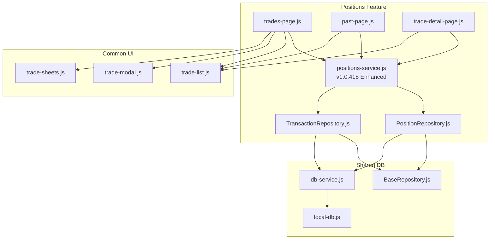

**Diagram sources**
- [trades-page.js](file://features/positions/trades-page.js)
- [past-page.js](file://features/positions/past-page.js)
- [trade-detail-page.js](file://features/positions/trade-detail-page.js)
- [positions-service.js](file://features/positions/positions-service.js)
- [PositionRepository.js](file://features/positions/PositionRepository.js)
- [TransactionRepository.js](file://features/positions/TransactionRepository.js)
- [BaseRepository.js](file://shared/db/BaseRepository.js)
- [db-service.js](file://shared/db/db-service.js)
- [local-db.js](file://shared/db/local-db.js)
- [trade-list.js](file://features/common/trade-list.js)
- [trade-modal.js](file://features/common/trade-modal.js)
- [trade-sheets.js](file://features/common/trade-sheets.js)

**Section sources**
- [PositionRepository.js](file://features/positions/PositionRepository.js)
- [TransactionRepository.js](file://features/positions/TransactionRepository.js)
- [positions-service.js](file://features/positions/positions-service.js)
- [trades-page.js](file://features/positions/trades-page.js)
- [past-page.js](file://features/positions/past-page.js)
- [trade-detail-page.js](file://features/positions/trade-detail-page.js)
- [BaseRepository.js](file://shared/db/BaseRepository.js)
- [db-service.js](file://shared/db/db-service.js)
- [local-db.js](file://shared/db/local-db.js)
- [trade-list.js](file://features/common/trade-list.js)
- [trade-modal.js](file://features/common/trade-modal.js)
- [trade-sheets.js](file://features/common/trade-sheets.js)

## Core Components
- PositionRepository: Implements data persistence operations for positions and trades, extending a shared repository base and using database services to interact with local storage or other backends.
- TransactionRepository: Manages transaction-level operations and atomic updates for improved data consistency.
- positions-service: Provides business logic for managing positions, including creation, updates, lifecycle transitions, P&L calculations, and report generation. **Enhanced in v1.0.418** with improved efficiency and simplified logic.
- UI Pages:
  - trades-page.js: Active positions dashboard and management interface.
  - past-page.js: Historical trades analysis and reporting.
  - trade-detail-page.js: Detailed view of a single trade with metrics and actions.
- Shared UI Components:
  - trade-list.js: Reusable list rendering for active/historical trades.
  - trade-modal.js: Modal dialogs for creating/editing positions.
  - trade-sheets.js: Export and sheet-based views for trade data.

Key responsibilities:
- Data persistence and retrieval via PositionRepository and TransactionRepository.
- Orchestration of workflows and calculations via enhanced positions-service.
- User interactions and presentation via UI pages and shared components.

**Updated** Enhanced service layer architecture with improved transaction handling and optimized query performance.

**Section sources**
- [PositionRepository.js](file://features/positions/PositionRepository.js)
- [TransactionRepository.js](file://features/positions/TransactionRepository.js)
- [positions-service.js](file://features/positions/positions-service.js)
- [trades-page.js](file://features/positions/trades-page.js)
- [past-page.js](file://features/positions/past-page.js)
- [trade-detail-page.js](file://features/positions/trade-detail-page.js)
- [trade-list.js](file://features/common/trade-list.js)
- [trade-modal.js](file://features/common/trade-modal.js)
- [trade-sheets.js](file://features/common/trade-sheets.js)

## Architecture Overview
The architecture follows a layered approach with enhanced service layer optimizations:
- Presentation Layer: UI pages and shared components handle user input and display.
- Service Layer: Business logic encapsulated in enhanced positions-service orchestrates operations and computations with improved efficiency.
- Repository Layer: PositionRepository and TransactionRepository abstract data access and persist entities through shared database utilities.

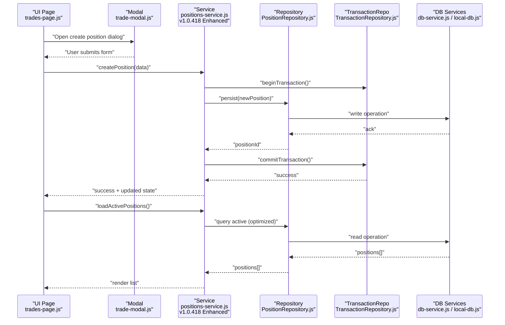

**Diagram sources**
- [trades-page.js](file://features/positions/trades-page.js)
- [trade-modal.js](file://features/common/trade-modal.js)
- [positions-service.js](file://features/positions/positions-service.js)
- [PositionRepository.js](file://features/positions/PositionRepository.js)
- [TransactionRepository.js](file://features/positions/TransactionRepository.js)
- [db-service.js](file://shared/db/db-service.js)
- [local-db.js](file://shared/db/local-db.js)

## Detailed Component Analysis

### PositionRepository Implementation
Responsibilities:
- Extends BaseRepository to inherit common repository behaviors.
- Uses db-service and local-db to perform CRUD operations for positions and trades.
- Exposes methods for creating, updating, querying active/historical positions, and bulk operations.
- Optimized query patterns for improved performance.

Data flow:
- UI calls service methods which delegate to repository methods.
- Repository translates domain operations into database queries.
- Results are returned up the stack for service processing and UI rendering.

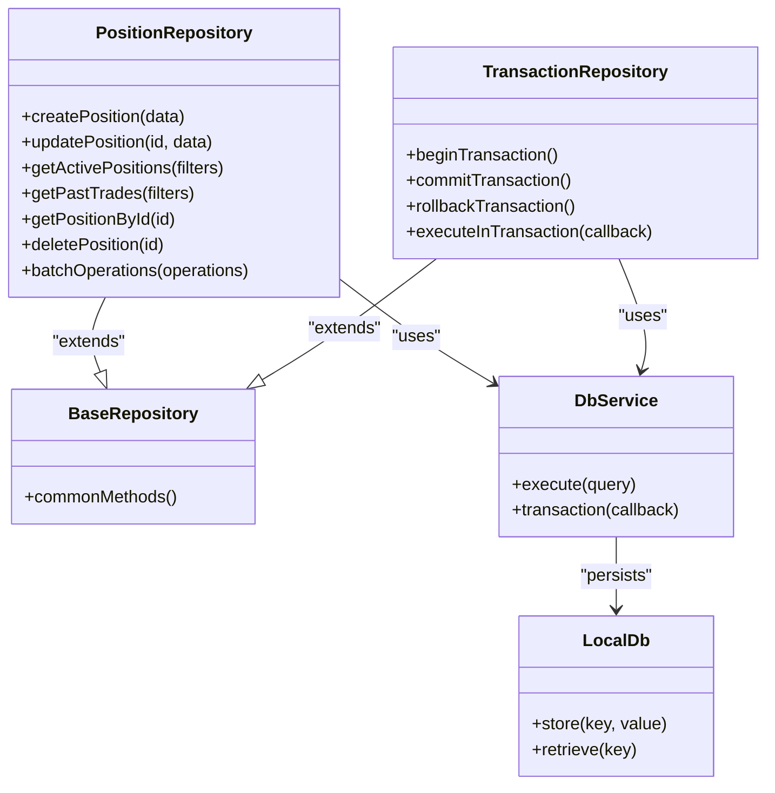

**Updated** Added TransactionRepository for improved transaction management and atomic operations.

**Diagram sources**
- [PositionRepository.js](file://features/positions/PositionRepository.js)
- [TransactionRepository.js](file://features/positions/TransactionRepository.js)
- [BaseRepository.js](file://shared/db/BaseRepository.js)
- [db-service.js](file://shared/db/db-service.js)
- [local-db.js](file://shared/db/local-db.js)

**Section sources**
- [PositionRepository.js](file://features/positions/PositionRepository.js)
- [TransactionRepository.js](file://features/positions/TransactionRepository.js)
- [BaseRepository.js](file://shared/db/BaseRepository.js)
- [db-service.js](file://shared/db/db-service.js)
- [local-db.js](file://shared/db/local-db.js)

### Enhanced Positions Service Layer
Responsibilities:
- Orchestrates position lifecycle: creation, modification, closure, and archival with improved efficiency.
- Computes P&L metrics and aggregates performance indicators with simplified logic.
- Generates reports and exports data for analysis.
- Coordinates with repository for persistence and retrieval using enhanced transaction handling.
- Optimizes query performance and reduces redundant calculations.

**Updated** v1.0.418 enhancements include:
- Simplified business logic flow for better maintainability
- Improved transaction management for data consistency
- Enhanced query optimization for faster response times
- Better error handling and recovery mechanisms

P&L Calculation Algorithm:
- Inputs: entry price, exit price, quantity, direction (long/short), fees/commissions, slippage estimates.
- Logic:
  - Compute gross profit/loss based on direction and price delta.
  - Adjust for fees and commissions.
  - Apply slippage adjustments if configured.
  - Normalize per-trade metrics and aggregate across timeframes.
- Outputs: per-trade P&L, cumulative P&L, win rate, average gain/loss, expectancy.

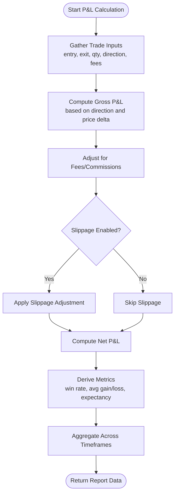

**Diagram sources**
- [positions-service.js](file://features/positions/positions-service.js)

**Section sources**
- [positions-service.js](file://features/positions/positions-service.js)

### Trades Management Interface (Active Positions)
Features:
- Displays active positions with real-time updates and enhanced performance.
- Allows editing, partial closures, and closing positions with improved transaction handling.
- Integrates with modal dialogs for quick actions.
- Supports filtering by symbol, timeframe, and status with optimized queries.

Workflow:
- UI loads active positions via enhanced service layer.
- User actions trigger service methods that update repository and re-render lists efficiently.

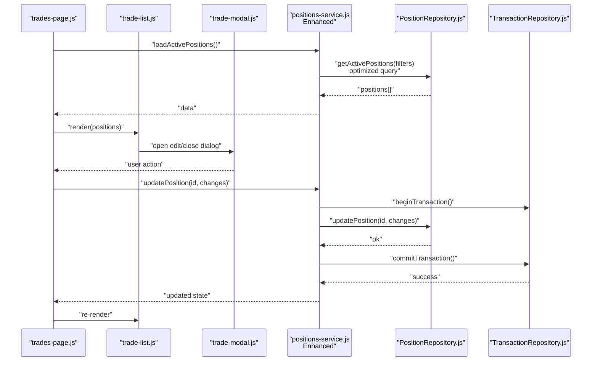

**Updated** Enhanced transaction handling ensures data consistency during position updates.

**Diagram sources**
- [trades-page.js](file://features/positions/trades-page.js)
- [trade-list.js](file://features/common/trade-list.js)
- [trade-modal.js](file://features/common/trade-modal.js)
- [positions-service.js](file://features/positions/positions-service.js)
- [PositionRepository.js](file://features/positions/PositionRepository.js)
- [TransactionRepository.js](file://features/positions/TransactionRepository.js)

**Section sources**
- [trades-page.js](file://features/positions/trades-page.js)
- [trade-list.js](file://features/common/trade-list.js)
- [trade-modal.js](file://features/common/trade-modal.js)
- [positions-service.js](file://features/positions/positions-service.js)
- [PositionRepository.js](file://features/positions/PositionRepository.js)
- [TransactionRepository.js](file://features/positions/TransactionRepository.js)

### Past Trades Analysis Tools
Features:
- Historical trade listing with advanced filters (date range, symbol, strategy, outcome).
- Aggregated metrics and charts for performance analysis with improved query performance.
- Export functionality for CSV/JSON via trade-sheets.

Workflow:
- UI requests historical data via enhanced service layer.
- Service queries repository with optimized filters and returns aggregated results efficiently.
- UI renders tables and charts; export triggers sheet generation.

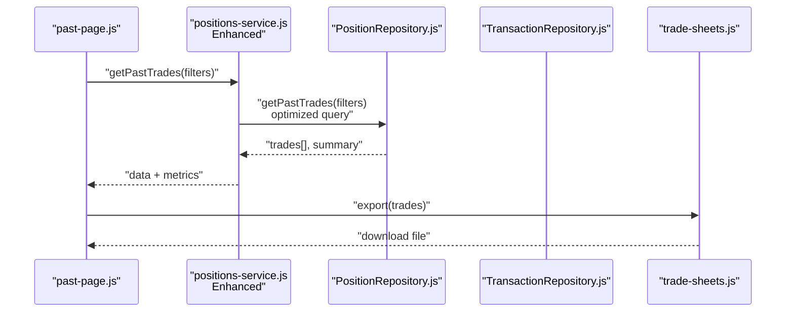

**Updated** Enhanced query optimization improves performance for large historical datasets.

**Diagram sources**
- [past-page.js](file://features/positions/past-page.js)
- [positions-service.js](file://features/positions/positions-service.js)
- [PositionRepository.js](file://features/positions/PositionRepository.js)
- [TransactionRepository.js](file://features/positions/TransactionRepository.js)
- [trade-sheets.js](file://features/common/trade-sheets.js)

**Section sources**
- [past-page.js](file://features/positions/past-page.js)
- [positions-service.js](file://features/positions/positions-service.js)
- [PositionRepository.js](file://features/positions/PositionRepository.js)
- [TransactionRepository.js](file://features/positions/TransactionRepository.js)
- [trade-sheets.js](file://features/common/trade-sheets.js)

### Detailed Trade View Components
Features:
- Single trade detail page showing all attributes, timeline, and computed metrics.
- Actions to adjust notes, tags, and metadata with improved transaction handling.
- Links to related trades and performance context.

Workflow:
- UI navigates to trade ID and fetches details via enhanced service layer.
- Service retrieves from repository and computes additional metrics efficiently.
- UI renders detail view with interactive elements.

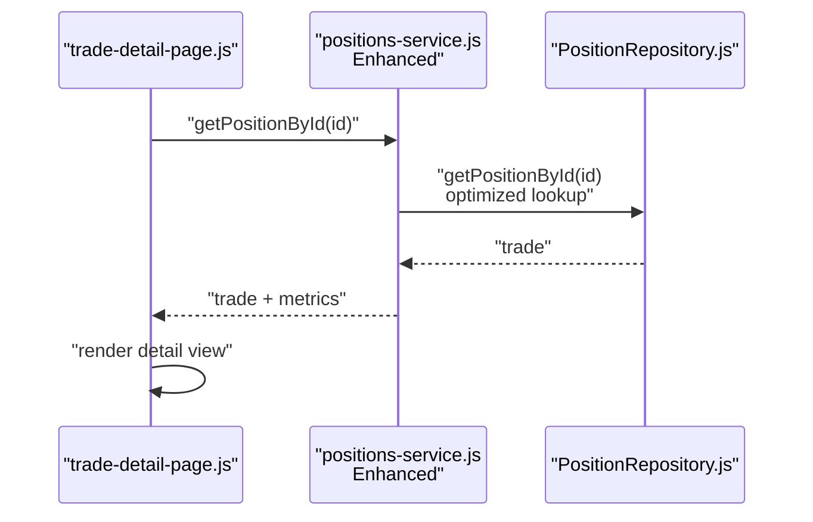

**Updated** Optimized individual trade lookups for faster detail page loading.

**Diagram sources**
- [trade-detail-page.js](file://features/positions/trade-detail-page.js)
- [positions-service.js](file://features/positions/positions-service.js)
- [PositionRepository.js](file://features/positions/PositionRepository.js)

**Section sources**
- [trade-detail-page.js](file://features/positions/trade-detail-page.js)
- [positions-service.js](file://features/positions/positions-service.js)
- [PositionRepository.js](file://features/positions/PositionRepository.js)

### Creating New Positions
Steps:
- Open create modal from active positions page.
- Fill required fields (symbol, direction, entry price, quantity, timeframe).
- Submit to enhanced service for validation and persistence with transaction support.
- On success, refresh active list and show confirmation.

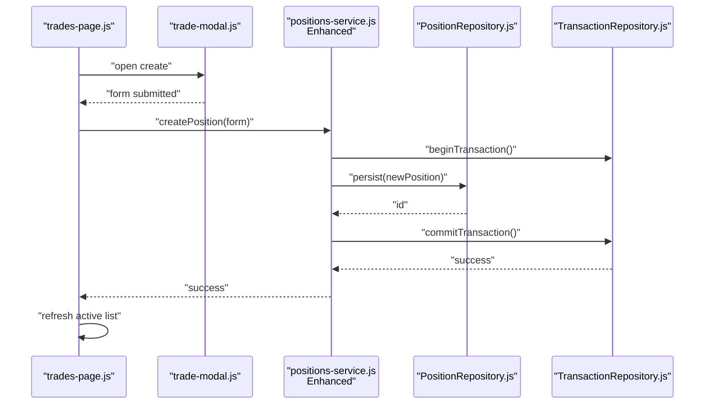

**Updated** Enhanced transaction support ensures data integrity during position creation.

**Diagram sources**
- [trades-page.js](file://features/positions/trades-page.js)
- [trade-modal.js](file://features/common/trade-modal.js)
- [positions-service.js](file://features/positions/positions-service.js)
- [PositionRepository.js](file://features/positions/PositionRepository.js)
- [TransactionRepository.js](file://features/positions/TransactionRepository.js)

**Section sources**
- [trades-page.js](file://features/positions/trades-page.js)
- [trade-modal.js](file://features/common/trade-modal.js)
- [positions-service.js](file://features/positions/positions-service.js)
- [PositionRepository.js](file://features/positions/PositionRepository.js)
- [TransactionRepository.js](file://features/positions/TransactionRepository.js)

### Tracking Trade Lifecycle
States:
- Open: Position created and active.
- Partially Closed: Quantity reduced but still open.
- Closed: Fully exited with final P&L recorded.
- Archived: Moved to historical records.

Transitions:
- Open -> Partially Closed: Update quantity and mark partial with transaction support.
- Partially Closed -> Closed: Finalize remaining quantity and compute final P&L atomically.
- Any -> Archived: Move to past trades after closure with data consistency.

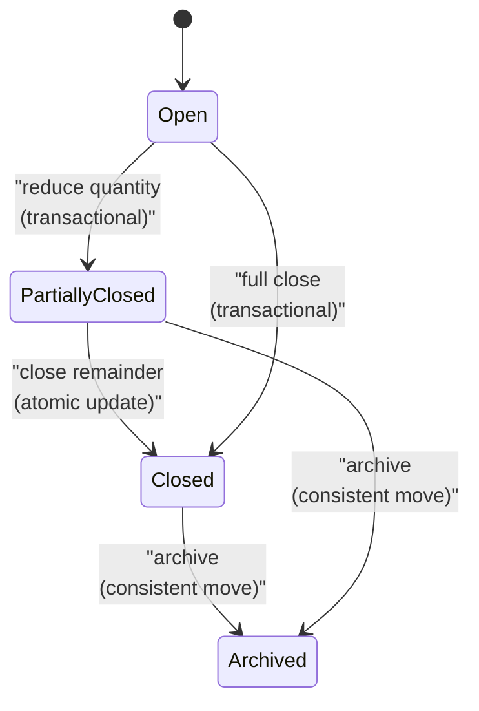

**Updated** All lifecycle transitions now use enhanced transaction handling for improved data consistency.

[No sources needed since this diagram shows conceptual workflow, not actual code structure]

### Generating Performance Reports
Capabilities:
- Aggregate metrics over configurable date ranges and symbols with optimized queries.
- Compute win rate, average gain/loss, expectancy, drawdown with improved performance.
- Support multi-timeframe aggregation for deeper insights.

Process:
- UI selects filters and timeframe(s).
- Service queries repository for relevant trades using enhanced optimization.
- Service calculates metrics and returns structured report efficiently.
- UI renders charts and tables; export via sheets.

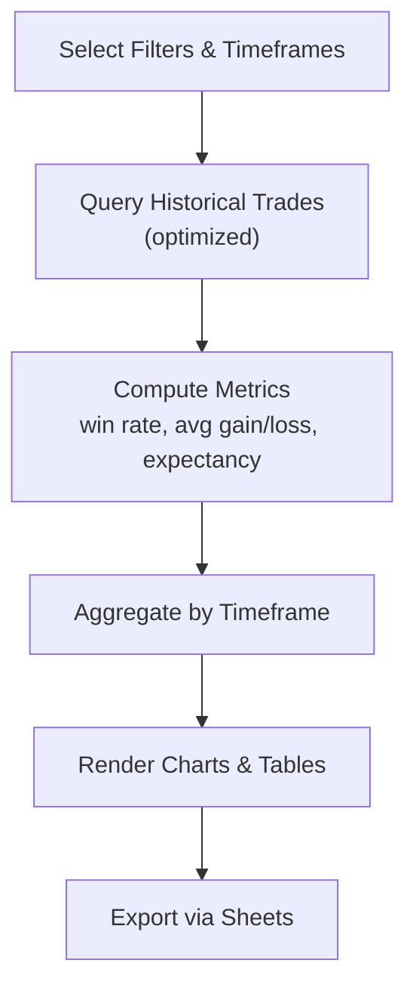

**Updated** Enhanced query optimization significantly improves report generation performance.

**Diagram sources**
- [positions-service.js](file://features/positions/positions-service.js)
- [trade-sheets.js](file://features/common/trade-sheets.js)

**Section sources**
- [positions-service.js](file://features/positions/positions-service.js)
- [trade-sheets.js](file://features/common/trade-sheets.js)

### Exporting Trade Data
Options:
- CSV export for spreadsheets.
- JSON export for programmatic analysis.
- Sheet-based views for formatted reports.

Integration:
- UI triggers export action.
- Service prepares dataset using enhanced optimization.
- Sheets component generates downloadable file.

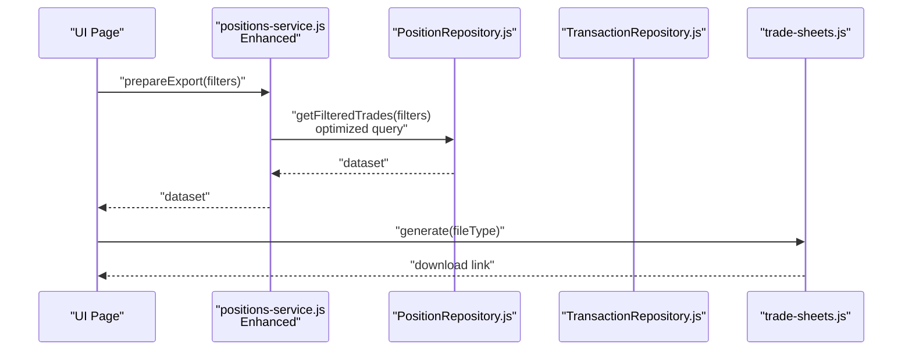

**Updated** Enhanced export functionality with improved performance for large datasets.

**Diagram sources**
- [positions-service.js](file://features/positions/positions-service.js)
- [PositionRepository.js](file://features/positions/PositionRepository.js)
- [TransactionRepository.js](file://features/positions/TransactionRepository.js)
- [trade-sheets.js](file://features/common/trade-sheets.js)

**Section sources**
- [positions-service.js](file://features/positions/positions-service.js)
- [PositionRepository.js](file://features/positions/PositionRepository.js)
- [TransactionRepository.js](file://features/positions/TransactionRepository.js)
- [trade-sheets.js](file://features/common/trade-sheets.js)

### Advanced Features

#### Multi-Timeframe Analysis
Concept:
- Analyze positions across multiple timeframes (e.g., 5m, 15m, 1h) to identify patterns and performance variations.
- Aggregate metrics per timeframe and compare outcomes with enhanced performance.

Implementation Guidance:
- Extend filters to include timeframe dimensions.
- Service computes per-timeframe metrics and merges into unified report efficiently.
- UI presents grouped charts and comparative tables.

[No sources needed since this section provides general guidance]

#### Position Correlation Tracking
Concept:
- Track correlations between positions (e.g., same symbol, inverse pairs) to understand risk exposure and hedging effectiveness.
- Compute correlation coefficients across time windows with improved computational efficiency.

Implementation Guidance:
- Add correlation metadata to positions.
- Service calculates pairwise correlations and flags high-correlation clusters.
- UI highlights correlated groups and suggests diversification.

[No sources needed since this section provides general guidance]

#### Advanced Filtering Capabilities
Concept:
- Filter by symbol, timeframe, outcome (win/loss/break-even), P&L thresholds, date ranges, tags, and custom criteria.
- Combine filters with logical operators for precise queries with enhanced performance.

Implementation Guidance:
- Repository supports complex query builders with optimization.
- Service validates and applies filters before data retrieval efficiently.
- UI exposes filter controls and dynamic result updates.

[No sources needed since this section provides general guidance]

## Dependency Analysis
The Positions Tracking feature depends on shared database utilities and common UI components with enhanced service layer dependencies. The following diagram illustrates core dependencies:

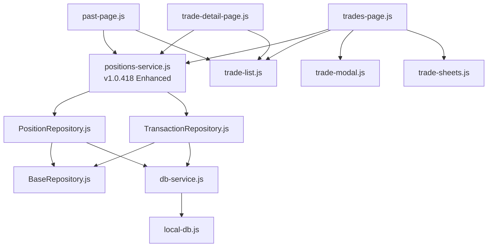

**Updated** Added TransactionRepository dependency and enhanced service layer connections.

**Diagram sources**
- [positions-service.js](file://features/positions/positions-service.js)
- [PositionRepository.js](file://features/positions/PositionRepository.js)
- [TransactionRepository.js](file://features/positions/TransactionRepository.js)
- [BaseRepository.js](file://shared/db/BaseRepository.js)
- [db-service.js](file://shared/db/db-service.js)
- [local-db.js](file://shared/db/local-db.js)
- [trades-page.js](file://features/positions/trades-page.js)
- [past-page.js](file://features/positions/past-page.js)
- [trade-detail-page.js](file://features/positions/trade-detail-page.js)
- [trade-list.js](file://features/common/trade-list.js)
- [trade-modal.js](file://features/common/trade-modal.js)
- [trade-sheets.js](file://features/common/trade-sheets.js)

**Section sources**
- [positions-service.js](file://features/positions/positions-service.js)
- [PositionRepository.js](file://features/positions/PositionRepository.js)
- [TransactionRepository.js](file://features/positions/TransactionRepository.js)
- [BaseRepository.js](file://shared/db/BaseRepository.js)
- [db-service.js](file://shared/db/db-service.js)
- [local-db.js](file://shared/db/local-db.js)
- [trades-page.js](file://features/positions/trades-page.js)
- [past-page.js](file://features/positions/past-page.js)
- [trade-detail-page.js](file://features/positions/trade-detail-page.js)
- [trade-list.js](file://features/common/trade-list.js)
- [trade-modal.js](file://features/common/trade-modal.js)
- [trade-sheets.js](file://features/common/trade-sheets.js)

## Performance Considerations
- Batch Operations: Use repository batch methods to reduce database round-trips when loading large datasets.
- Indexing: Ensure indexes on frequently filtered fields (symbol, date, status) to speed up queries.
- Pagination: Implement pagination for historical trades to improve UI responsiveness.
- Caching: Cache computed metrics and aggregated reports where appropriate to avoid redundant calculations.
- Lazy Loading: Load detailed trade data on demand rather than upfront.
- **Enhanced in v1.0.418**: Transaction pooling and connection reuse for improved database performance.
- **Enhanced in v1.0.418**: Optimized query patterns with reduced N+1 query problems.
- **Enhanced in v1.0.418**: Simplified service layer logic reduces computational overhead.

**Updated** Added performance improvements from v1.0.418 refactoring including transaction optimization and query enhancement.

[No sources needed since this section provides general guidance]

## Troubleshooting Guide
Common Issues:
- Persistence Failures: Check database service connectivity and local storage availability.
- Missing Fields: Validate form inputs before submission; ensure required fields are present.
- Incorrect P&L: Verify fee/commission inputs and slippage settings; confirm direction handling.
- Slow Queries: Review filters and add indexes; consider pagination and caching.
- **New**: Transaction Deadlocks: Monitor transaction timeouts and implement retry logic for concurrent operations.
- **New**: Service Layer Errors: Check enhanced service method logs for detailed error information.

Debugging Steps:
- Inspect repository logs for query execution and errors.
- Validate service method inputs and outputs with enhanced logging.
- Use browser dev tools to monitor network/storage operations.
- Confirm UI state synchronization after updates.
- **Enhanced**: Monitor transaction lifecycle and rollback scenarios.

**Updated** Added troubleshooting guidance for new transaction handling and enhanced service layer debugging.

**Section sources**
- [PositionRepository.js](file://features/positions/PositionRepository.js)
- [TransactionRepository.js](file://features/positions/TransactionRepository.js)
- [positions-service.js](file://features/positions/positions-service.js)
- [db-service.js](file://shared/db/db-service.js)
- [local-db.js](file://shared/db/local-db.js)

## Conclusion
The Positions Tracking feature provides a robust system for managing active positions, analyzing historical trades, and computing performance metrics. The enhanced layered architecture separates concerns between UI, service, and repository layers, ensuring maintainability and scalability. With v1.0.418 improvements including simplified service layer logic, enhanced transaction handling, and optimized query performance, the feature equips traders with powerful tools for decision-making and risk management. Support for advanced filtering, multi-timeframe analysis, and correlation tracking continues to provide comprehensive trading analytics capabilities.

**Updated** Enhanced in v1.0.418 with improved efficiency, simplified logic, and better transaction management for superior performance and reliability.

[No sources needed since this section summarizes without analyzing specific files]

## Appendices

### API Reference Summary
- Create Position: Service method to persist new position via repository with transaction support.
- Update Position: Service method to modify existing position attributes with enhanced consistency.
- Get Active Positions: Service method to retrieve current open positions with optional filters and optimized queries.
- Get Past Trades: Service method to fetch historical trades with aggregation options and improved performance.
- Get Position By ID: Service method to retrieve detailed trade information with enhanced lookup efficiency.
- Export Data: Service method to prepare datasets for export via sheets with optimized processing.
- **New**: Transaction Management: Service methods for atomic operations and data consistency.

**Updated** Added transaction management capabilities and enhanced API performance characteristics.

[No sources needed since this section provides general guidance]