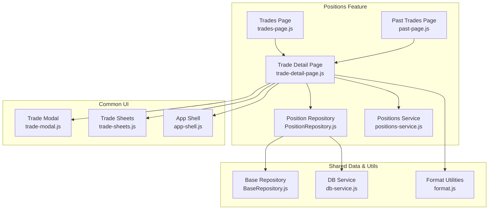
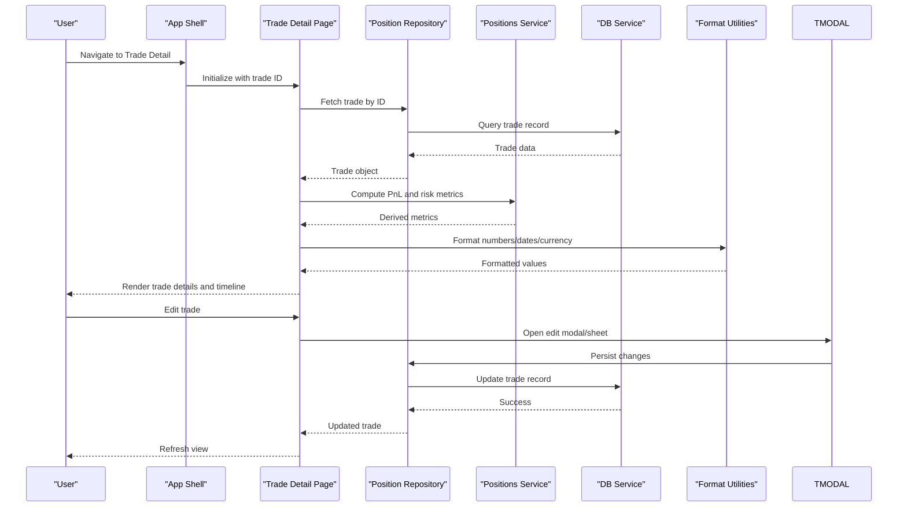
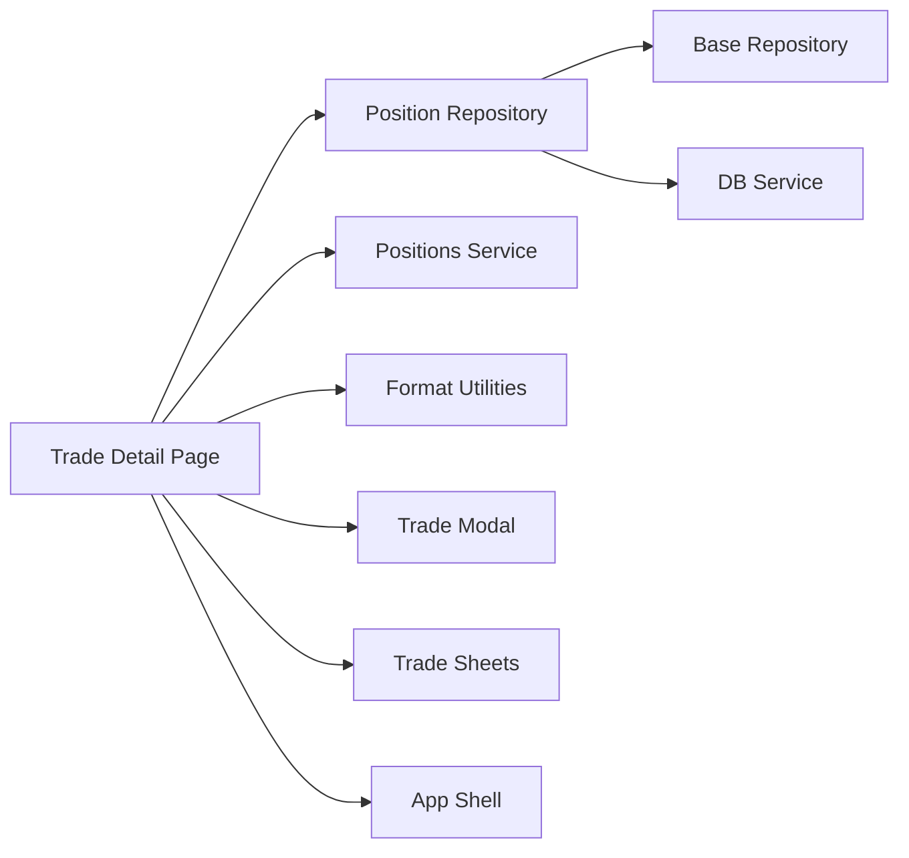
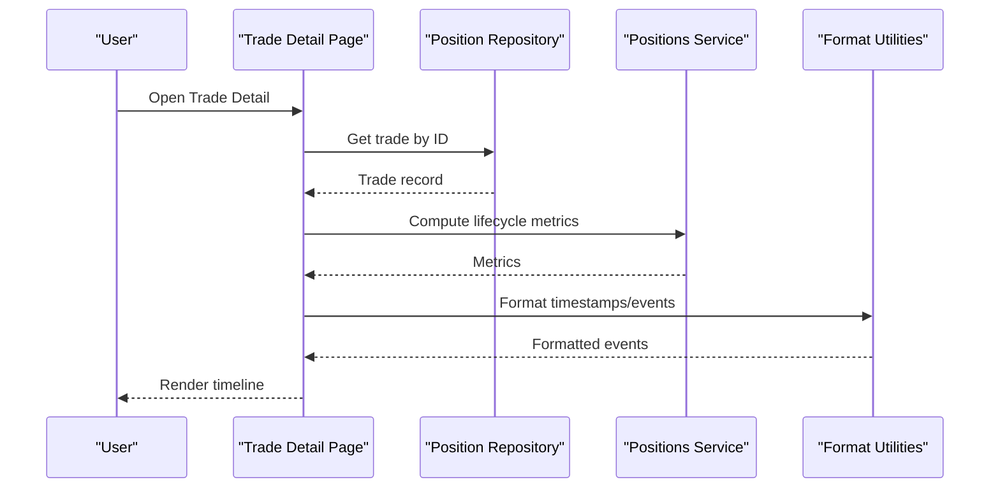
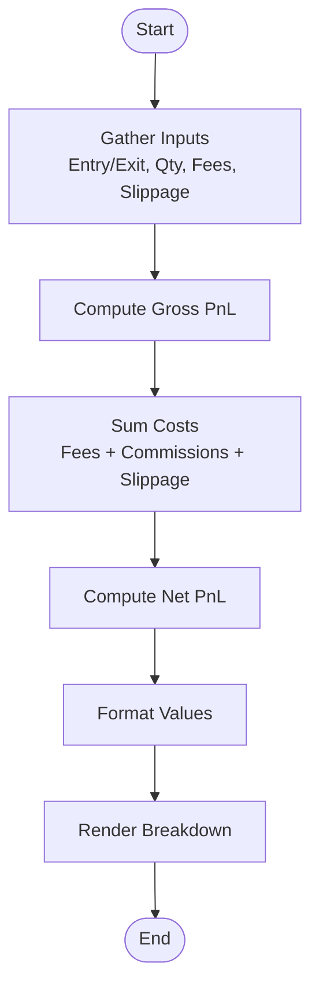
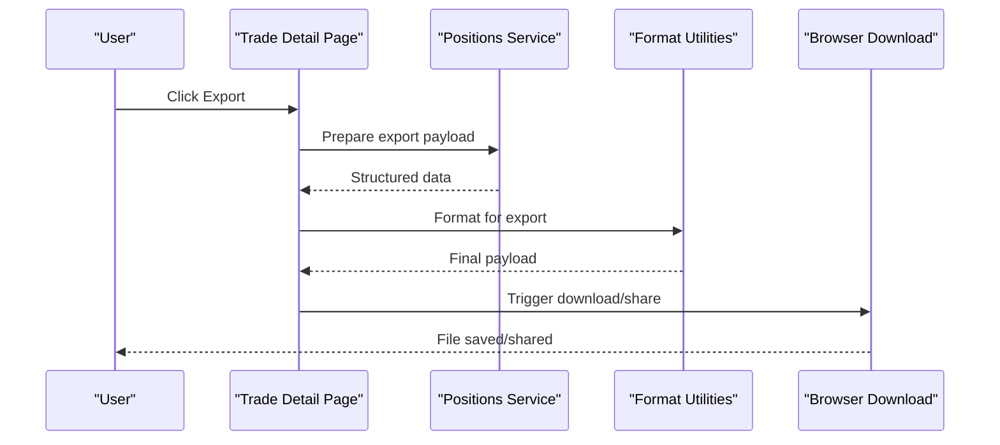

# Trade Detail View

<cite>
**Referenced Files in This Document**
- [trade-detail-page.js](file://features/positions/trade-detail-page.js)
- [PositionRepository.js](file://features/positions/PositionRepository.js)
- [positions-service.js](file://features/positions/positions-service.js)
- [trades-page.js](file://features/positions/trades-page.js)
- [past-page.js](file://features/positions/past-page.js)
- [trade-modal.js](file://features/common/trade-modal.js)
- [trade-sheets.js](file://features/common/trade-sheets.js)
- [BaseRepository.js](file://shared/db/BaseRepository.js)
- [db-service.js](file://shared/db/db-service.js)
- [format.js](file://shared/lib/format.js)
- [app-shell.js](file://features/common/app-shell.js)
</cite>

## Table of Contents
1. [Introduction](#introduction)
2. [Project Structure](#project-structure)
3. [Core Components](#core-components)
4. [Architecture Overview](#architecture-overview)
5. [Detailed Component Analysis](#detailed-component-analysis)
6. [Dependency Analysis](#dependency-analysis)
7. [Performance Considerations](#performance-considerations)
8. [Troubleshooting Guide](#troubleshooting-guide)
9. [Conclusion](#conclusion)
10. [Appendices](#appendices)

## Introduction
This document provides comprehensive documentation for the Trade Detail View component within the application. It explains how detailed trade information is displayed, how trade lifecycle and entry/exit points are visualized, and how comprehensive metadata is presented. It also covers data structure requirements, rendering logic, interactive elements for trade modification, integration with position management features, examples of displaying trade history, profit/loss breakdowns, risk metrics, export functionality, responsive design considerations, and accessibility features.

## Project Structure
The Trade Detail View is implemented as a feature page under the positions module and integrates with shared repositories and services for persistence and formatting. The key files involved include:
- Feature page for trade details
- Position repository and service for data access
- Shared database base repository and DB service
- Formatting utilities for display values
- Common UI components for modal/sheet interactions
- Shell for navigation and layout

**Diagram sources**
- [trade-detail-page.js](file://features/positions/trade-detail-page.js)
- [PositionRepository.js](file://features/positions/PositionRepository.js)
- [positions-service.js](file://features/positions/positions-service.js)
- [trades-page.js](file://features/positions/trades-page.js)
- [past-page.js](file://features/positions/past-page.js)
- [trade-modal.js](file://features/common/trade-modal.js)
- [trade-sheets.js](file://features/common/trade-sheets.js)
- [app-shell.js](file://features/common/app-shell.js)
- [BaseRepository.js](file://shared/db/BaseRepository.js)
- [db-service.js](file://shared/db/db-service.js)
- [format.js](file://shared/lib/format.js)

**Section sources**
- [trade-detail-page.js](file://features/positions/trade-detail-page.js)
- [PositionRepository.js](file://features/positions/PositionRepository.js)
- [positions-service.js](file://features/positions/positions-service.js)
- [trades-page.js](file://features/positions/trades-page.js)
- [past-page.js](file://features/positions/past-page.js)
- [trade-modal.js](file://features/common/trade-modal.js)
- [trade-sheets.js](file://features/common/trade-sheets.js)
- [app-shell.js](file://features/common/app-shell.js)
- [BaseRepository.js](file://shared/db/BaseRepository.js)
- [db-service.js](file://shared/db/db-service.js)
- [format.js](file://shared/lib/format.js)

## Core Components
- Trade Detail Page: Orchestrates loading, rendering, and user interactions for a single trade’s detail view. It fetches trade data via repository/service, formats values for display, and exposes actions such as editing or exporting.
- Position Repository: Encapsulates persistence operations for trades and positions, providing methods to retrieve, update, and manage trade records.
- Positions Service: Provides higher-level business logic around positions and trades, including calculations and aggregations used by the detail view.
- Shared Base Repository and DB Service: Provide common persistence patterns and database connectivity.
- Format Utilities: Centralize number, currency, date, and percentage formatting used across the detail view.
- Common UI (Modal/Sheets): Offer consistent interfaces for modifying trade attributes and presenting secondary actions.

Key responsibilities:
- Load trade by identifier
- Render trade metadata, lifecycle timeline, entry/exit analysis, PnL breakdown, and risk metrics
- Support interactive modifications via modal/sheets
- Integrate with navigation shell and other pages (e.g., trades list, past trades)

**Section sources**
- [trade-detail-page.js](file://features/positions/trade-detail-page.js)
- [PositionRepository.js](file://features/positions/PositionRepository.js)
- [positions-service.js](file://features/positions/positions-service.js)
- [BaseRepository.js](file://shared/db/BaseRepository.js)
- [db-service.js](file://shared/db/db-service.js)
- [format.js](file://shared/lib/format.js)
- [trade-modal.js](file://features/common/trade-modal.js)
- [trade-sheets.js](file://features/common/trade-sheets.js)
- [app-shell.js](file://features/common/app-shell.js)

## Architecture Overview
The Trade Detail View follows a layered architecture:
- Presentation Layer: The detail page renders UI and handles user interactions.
- Business Logic Layer: The positions service computes derived metrics (PnL, risk).
- Data Access Layer: The position repository interacts with the database through the base repository and DB service.
- Shared Utilities: Formatting and common UI components support consistent presentation and interaction.

**Diagram sources**
- [trade-detail-page.js](file://features/positions/trade-detail-page.js)
- [PositionRepository.js](file://features/positions/PositionRepository.js)
- [positions-service.js](file://features/positions/positions-service.js)
- [db-service.js](file://shared/db/db-service.js)
- [format.js](file://shared/lib/format.js)
- [trade-modal.js](file://features/common/trade-modal.js)
- [trade-sheets.js](file://features/common/trade-sheets.js)
- [app-shell.js](file://features/common/app-shell.js)

## Detailed Component Analysis

### Trade Detail Page
Responsibilities:
- Resolve trade ID from route/context
- Load trade data and compute derived metrics
- Render sections: overview, lifecycle timeline, entry/exit analysis, PnL breakdown, risk metrics, notes/tags, and actions
- Handle user interactions: open edit modal/sheets, export trade, navigate back

Data structure requirements:
- Trade identifiers and timestamps
- Instrument and broker metadata
- Entry/exit prices, quantities, fees, slippage
- Stop-loss/take-profit levels
- Status and lifecycle events
- Notes and tags for context

Rendering logic:
- Use format utilities to present currency, percentages, dates
- Build timeline nodes from lifecycle events
- Aggregate PnL components into summary and breakdown views
- Present risk metrics computed by the positions service

Interactive elements:
- Edit button opens modal/sheets for updating fields
- Export action triggers download or share of trade data
- Navigation links to related trades or charts

Integration points:
- App shell for routing and layout
- Trade modal/sheets for consistent editing UX
- Positions repository/service for data and computations
- Trades/Past pages for cross-navigation

Accessibility:
- Semantic headings and landmarks
- ARIA labels for controls and status updates
- Keyboard navigability for modal/sheets
- Color contrast and scalable text support

Responsive design:
- Stacked layouts on small screens
- Collapsible sections for dense data
- Touch-friendly targets for actions

Export functionality:
- Generate structured payload (JSON/CSV)
- Include all metadata, PnL breakdown, and risk metrics
- Trigger browser download or system share

Examples:
- Displaying trade history: Show chronological lifecycle events with timestamps and descriptions
- Profit/Loss breakdown: Summarize gross PnL, fees, commissions, slippage, net PnL
- Risk metrics: Show max drawdown, exposure, leverage, stop distance, take-profit distance
- Export: Provide “Export Trade” action that downloads a file with trade details

**Section sources**
- [trade-detail-page.js](file://features/positions/trade-detail-page.js)
- [positions-service.js](file://features/positions/positions-service.js)
- [format.js](file://shared/lib/format.js)
- [trade-modal.js](file://features/common/trade-modal.js)
- [trade-sheets.js](file://features/common/trade-sheets.js)
- [app-shell.js](file://features/common/app-shell.js)

### Position Repository
Responsibilities:
- Retrieve trade by ID
- Update trade fields
- List trades with filters (status, date range)
- Manage relationships between trades and positions

Persistence:
- Uses BaseRepository for common CRUD patterns
- Connects to DB Service for storage backend

Error handling:
- Propagates errors up to caller with meaningful messages
- Handles missing records gracefully

**Section sources**
- [PositionRepository.js](file://features/positions/PositionRepository.js)
- [BaseRepository.js](file://shared/db/BaseRepository.js)
- [db-service.js](file://shared/db/db-service.js)

### Positions Service
Responsibilities:
- Compute PnL components (gross, fees, slippage, net)
- Derive risk metrics (exposure, leverage, drawdown indicators)
- Validate trade state transitions
- Provide aggregated summaries for lists and detail views

Optimization:
- Memoizes expensive calculations when inputs unchanged
- Returns normalized structures for consistent rendering

**Section sources**
- [positions-service.js](file://features/positions/positions-service.js)

### Common UI: Trade Modal and Sheets
Responsibilities:
- Present editable fields for trade attributes
- Validate inputs before persisting
- Provide confirmation dialogs for destructive actions
- Maintain focus management and keyboard navigation

Integration:
- Called by Trade Detail Page for edits
- Persists changes via Position Repository

**Section sources**
- [trade-modal.js](file://features/common/trade-modal.js)
- [trade-sheets.js](file://features/common/trade-sheets.js)

### Integration with Other Pages
- Trades Page: Navigates to Trade Detail for selected trade
- Past Trades Page: Shows historical trades; clicking opens detail view

These integrations ensure consistent data flow and user experience across the positions feature.

**Section sources**
- [trades-page.js](file://features/positions/trades-page.js)
- [past-page.js](file://features/positions/past-page.js)
- [trade-detail-page.js](file://features/positions/trade-detail-page.js)

## Dependency Analysis
The Trade Detail View depends on several modules:
- Direct dependencies: Position Repository, Positions Service, Format Utilities, Common UI (Modal/Sheets), App Shell
- Indirect dependencies: Base Repository, DB Service

**Diagram sources**
- [trade-detail-page.js](file://features/positions/trade-detail-page.js)
- [PositionRepository.js](file://features/positions/PositionRepository.js)
- [positions-service.js](file://features/positions/positions-service.js)
- [BaseRepository.js](file://shared/db/BaseRepository.js)
- [db-service.js](file://shared/db/db-service.js)
- [format.js](file://shared/lib/format.js)
- [trade-modal.js](file://features/common/trade-modal.js)
- [trade-sheets.js](file://features/common/trade-sheets.js)
- [app-shell.js](file://features/common/app-shell.js)

**Section sources**
- [trade-detail-page.js](file://features/positions/trade-detail-page.js)
- [PositionRepository.js](file://features/positions/PositionRepository.js)
- [positions-service.js](file://features/positions/positions-service.js)
- [BaseRepository.js](file://shared/db/BaseRepository.js)
- [db-service.js](file://shared/db/db-service.js)
- [format.js](file://shared/lib/format.js)
- [trade-modal.js](file://features/common/trade-modal.js)
- [trade-sheets.js](file://features/common/trade-sheets.js)
- [app-shell.js](file://features/common/app-shell.js)

## Performance Considerations
- Lazy load heavy computations: Defer PnL/risk calculations until needed
- Cache formatted values: Avoid repeated formatting calls for static fields
- Minimize re-renders: Batch updates when multiple fields change
- Optimize list-to-detail transitions: Preload minimal metadata, fetch full details on demand
- Debounce input validation in modals/sheets to reduce overhead during typing

[No sources needed since this section provides general guidance]

## Troubleshooting Guide
Common issues and resolutions:
- Missing trade data: Verify trade ID resolution and repository query; handle not-found states gracefully
- Incorrect PnL values: Check service calculations and input normalization; validate fee/slippage fields
- Modal/sheets not closing: Ensure event listeners are properly bound and focus is restored
- Export failures: Confirm payload structure and MIME types; handle browser restrictions
- Accessibility problems: Test keyboard navigation, screen reader announcements, and color contrast

Operational checks:
- Inspect network/database calls via DB Service logs
- Validate format utility outputs for edge cases (zero values, negative amounts)
- Review error propagation from repository to page

**Section sources**
- [trade-detail-page.js](file://features/positions/trade-detail-page.js)
- [PositionRepository.js](file://features/positions/PositionRepository.js)
- [positions-service.js](file://features/positions/positions-service.js)
- [db-service.js](file://shared/db/db-service.js)
- [format.js](file://shared/lib/format.js)

## Conclusion
The Trade Detail View provides a robust, accessible, and responsive interface for inspecting and managing individual trades. It integrates cleanly with position management features, supports rich metadata and analytics, and offers practical tools like export and editing workflows. By adhering to the documented data structures, rendering logic, and interaction patterns, developers can extend and maintain the component effectively while ensuring consistency across the application.

[No sources needed since this section summarizes without analyzing specific files]

## Appendices

### Data Model Summary
- Identifiers: Unique trade ID, related position IDs
- Timestamps: Entry time, exit time, last updated
- Instrument/Broker: Symbol, exchange, broker-specific fields
- Prices/Quantities: Entry price, exit price, quantity, direction
- Costs: Fees, commissions, slippage, financing
- Risk Controls: Stop-loss, take-profit, exposure, leverage
- Lifecycle: Status transitions, events, notes
- Metadata: Tags, source, annotations

[No sources needed since this section provides conceptual model guidance]

### Example Workflows

#### Displaying Trade History
- Sequence diagram showing retrieval and rendering of lifecycle events

**Diagram sources**
- [trade-detail-page.js](file://features/positions/trade-detail-page.js)
- [PositionRepository.js](file://features/positions/PositionRepository.js)
- [positions-service.js](file://features/positions/positions-service.js)
- [format.js](file://shared/lib/format.js)

#### Profit/Loss Breakdown
- Flowchart illustrating calculation steps

**Diagram sources**
- [positions-service.js](file://features/positions/positions-service.js)
- [format.js](file://shared/lib/format.js)

#### Export Individual Trade
- Sequence diagram for export action

**Diagram sources**
- [trade-detail-page.js](file://features/positions/trade-detail-page.js)
- [positions-service.js](file://features/positions/positions-service.js)
- [format.js](file://shared/lib/format.js)