# Trades Management Interface

<cite>
**Referenced Files in This Document**
- [trades-page.js](file://features/positions/trades-page.js)
- [trade-detail-page.js](file://features/positions/trade-detail-page.js)
- [positions-service.js](file://features/positions/positions-service.js)
- [PositionRepository.js](file://features/positions/PositionRepository.js)
- [past-page.js](file://features/positions/past-page.js)
- [trade-modal.js](file://features/common/trade-modal.js)
- [trade-list.js](file://features/common/trade-list.js)
- [trade-sheets.js](file://features/common/trade-sheets.js)
- [BaseRepository.js](file://shared/db/BaseRepository.js)
- [db-service.js](file://shared/db/db-service.js)
- [local-db.js](file://shared/db/local-db.js)
- [bootstrap.js](file://shared/lib/bootstrap.js)
- [router.js](file://features/common/router.js)
- [app-shell.js](file://features/common/app-shell.js)
</cite>

## Table of Contents
1. [Introduction](#introduction)
2. [Project Structure](#project-structure)
3. [Core Components](#core-components)
4. [Architecture Overview](#architecture-overview)
5. [Detailed Component Analysis](#detailed-component-analysis)
6. [Dependency Analysis](#dependency-analysis)
7. [Performance Considerations](#performance-considerations)
8. [Troubleshooting Guide](#troubleshooting-guide)
9. [Conclusion](#conclusion)
10. [Appendices](#appendices)

## Introduction
This document explains the Trades Management Interface, focusing on active position monitoring, trade creation and modification workflows, real-time updates, and user interaction patterns. It covers page lifecycle, data binding mechanisms, event handling for trade operations, and integration with the positions service layer. It also includes examples for creating new positions, modifying existing trades, closing positions, and managing position states, along with UI components used for display, form validation, error handling, and responsive design considerations.

## Project Structure
The trades management feature is implemented under features/positions and integrates with shared services and common UI components:
- Feature pages:
  - Active trades list and navigation
  - Trade detail view for editing and actions
  - Past trades view
- Service and repository layers:
  - Positions service orchestrating business logic
  - Repository abstraction over persistence
- Shared database utilities:
  - Base repository, DB service, local storage adapter
- Common UI components:
  - Trade modal, trade list, trade sheets (side panels)
- App shell and routing:
  - Application bootstrap and client-side router

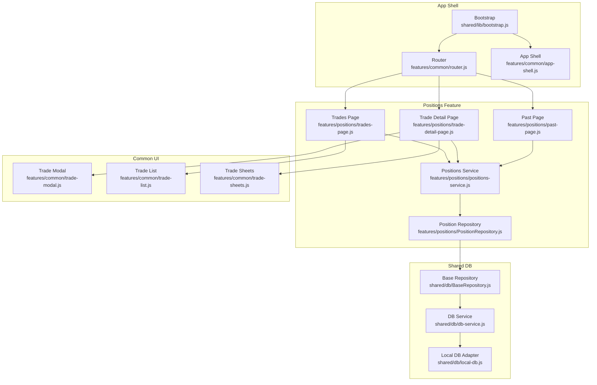

**Diagram sources**
- [trades-page.js](file://features/positions/trades-page.js)
- [trade-detail-page.js](file://features/positions/trade-detail-page.js)
- [positions-service.js](file://features/positions/positions-service.js)
- [PositionRepository.js](file://features/positions/PositionRepository.js)
- [trade-modal.js](file://features/common/trade-modal.js)
- [trade-list.js](file://features/common/trade-list.js)
- [trade-sheets.js](file://features/common/trade-sheets.js)
- [BaseRepository.js](file://shared/db/BaseRepository.js)
- [db-service.js](file://shared/db/db-service.js)
- [local-db.js](file://shared/db/local-db.js)
- [bootstrap.js](file://shared/lib/bootstrap.js)
- [router.js](file://features/common/router.js)
- [app-shell.js](file://features/common/app-shell.js)

**Section sources**
- [trades-page.js](file://features/positions/trades-page.js)
- [trade-detail-page.js](file://features/positions/trade-detail-page.js)
- [positions-service.js](file://features/positions/positions-service.js)
- [PositionRepository.js](file://features/positions/PositionRepository.js)
- [trade-modal.js](file://features/common/trade-modal.js)
- [trade-list.js](file://features/common/trade-list.js)
- [trade-sheets.js](file://features/common/trade-sheets.js)
- [BaseRepository.js](file://shared/db/BaseRepository.js)
- [db-service.js](file://shared/db/db-service.js)
- [local-db.js](file://shared/db/local-db.js)
- [bootstrap.js](file://shared/lib/bootstrap.js)
- [router.js](file://features/common/router.js)
- [app-shell.js](file://features/common/app-shell.js)

## Core Components
- Trades Page: Renders the active trades list, triggers navigation to trade details, and coordinates real-time updates via the positions service.
- Trade Detail Page: Displays a single position’s details, provides forms for modifications, and exposes actions such as close or adjust size/price.
- Positions Service: Encapsulates business logic for fetching, creating, updating, and closing positions; manages subscriptions for live updates and normalizes data for UI consumption.
- Position Repository: Abstracts persistence operations, delegating to base repository and DB service.
- Common UI Components:
  - Trade List: Renders lists of positions with interactive rows and summary metrics.
  - Trade Modal: Presents inline forms for quick edits or confirmations.
  - Trade Sheets: Side panel overlays for detailed editing flows.
- Shared Database Layer:
  - Base Repository: Provides common CRUD helpers and subscription patterns.
  - DB Service: Centralized access to storage backends.
  - Local DB Adapter: In-memory or persistent local store implementation.
- App Shell and Router:
  - Bootstrap: Initializes app modules and routes.
  - Router: Handles navigation between trades, detail, and past views.
  - App Shell: Manages global layout and state.

**Section sources**
- [trades-page.js](file://features/positions/trades-page.js)
- [trade-detail-page.js](file://features/positions/trade-detail-page.js)
- [positions-service.js](file://features/positions/positions-service.js)
- [PositionRepository.js](file://features/positions/PositionRepository.js)
- [trade-list.js](file://features/common/trade-list.js)
- [trade-modal.js](file://features/common/trade-modal.js)
- [trade-sheets.js](file://features/common/trade-sheets.js)
- [BaseRepository.js](file://shared/db/BaseRepository.js)
- [db-service.js](file://shared/db/db-service.js)
- [local-db.js](file://shared/db/local-db.js)
- [bootstrap.js](file://shared/lib/bootstrap.js)
- [router.js](file://features/common/router.js)
- [app-shell.js](file://features/common/app-shell.js)

## Architecture Overview
The interface follows a layered architecture:
- Presentation Layer: Pages and UI components render state and capture user interactions.
- Service Layer: Business logic and orchestration, including real-time subscriptions and normalization.
- Repository Layer: Data access abstraction over persistence.
- Storage Layer: Local database adapter and DB service.

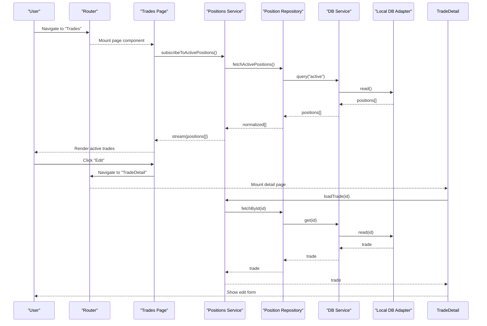

**Diagram sources**
- [router.js](file://features/common/router.js)
- [trades-page.js](file://features/positions/trades-page.js)
- [trade-detail-page.js](file://features/positions/trade-detail-page.js)
- [positions-service.js](file://features/positions/positions-service.js)
- [PositionRepository.js](file://features/positions/PositionRepository.js)
- [db-service.js](file://shared/db/db-service.js)
- [local-db.js](file://shared/db/local-db.js)

## Detailed Component Analysis

### Active Position Monitoring
- Real-time subscription: The trades page subscribes to active positions through the positions service, which maintains a live stream of changes.
- Normalization and diffing: The service normalizes incoming data and emits only changed items to minimize re-renders.
- UI update pattern: The page binds to the stream and updates the trade list incrementally.

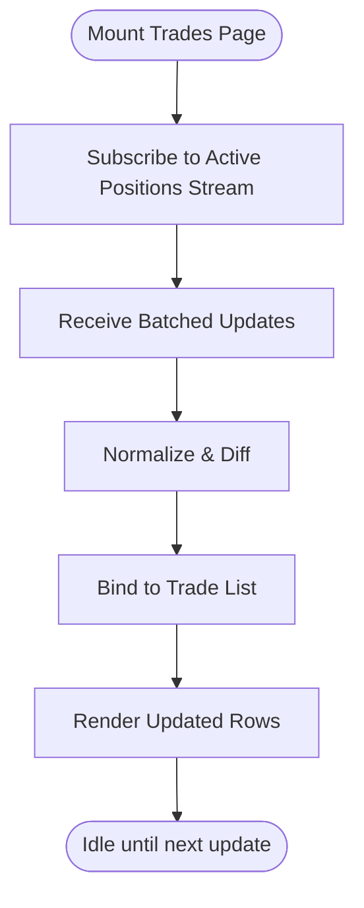

**Diagram sources**
- [trades-page.js](file://features/positions/trades-page.js)
- [positions-service.js](file://features/positions/positions-service.js)
- [trade-list.js](file://features/common/trade-list.js)

**Section sources**
- [trades-page.js](file://features/positions/trades-page.js)
- [positions-service.js](file://features/positions/positions-service.js)
- [trade-list.js](file://features/common/trade-list.js)

### Trade Creation Workflow
- Entry points:
  - From the trades page via a “New” action that opens the trade modal or sheet.
  - From the trade detail page when duplicating or adjusting parameters.
- Validation:
  - Client-side checks for required fields, numeric ranges, and constraints.
  - Server-side or service-level validation before persistence.
- Persistence:
  - Service calls repository create method.
  - Repository persists via DB service and local adapter.
- Post-create behavior:
  - Emit new position into active stream.
  - Update UI and navigate if needed.

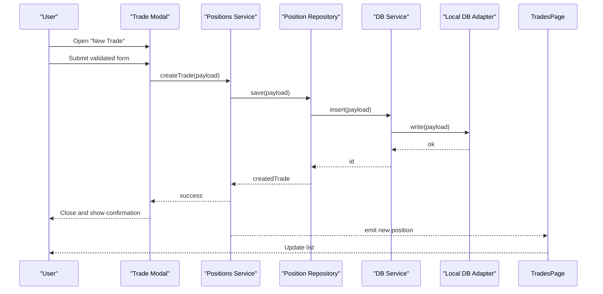

**Diagram sources**
- [trade-modal.js](file://features/common/trade-modal.js)
- [positions-service.js](file://features/positions/positions-service.js)
- [PositionRepository.js](file://features/positions/PositionRepository.js)
- [db-service.js](file://shared/db/db-service.js)
- [local-db.js](file://shared/db/local-db.js)
- [trades-page.js](file://features/positions/trades-page.js)

**Section sources**
- [trade-modal.js](file://features/common/trade-modal.js)
- [positions-service.js](file://features/positions/positions-service.js)
- [PositionRepository.js](file://features/positions/PositionRepository.js)
- [db-service.js](file://shared/db/db-service.js)
- [local-db.js](file://shared/db/local-db.js)
- [trades-page.js](file://features/positions/trades-page.js)

### Trade Modification Workflow
- Editing entry:
  - From trade list row click to open detail page.
  - From trade sheets for quick edits.
- Form binding:
  - Two-way binding between model and inputs.
  - Live validation feedback.
- Save flow:
  - Service validates and persists changes.
  - Emits updated position to subscribers.
- Undo/confirmation:
  - Optional confirmation dialogs for destructive changes.

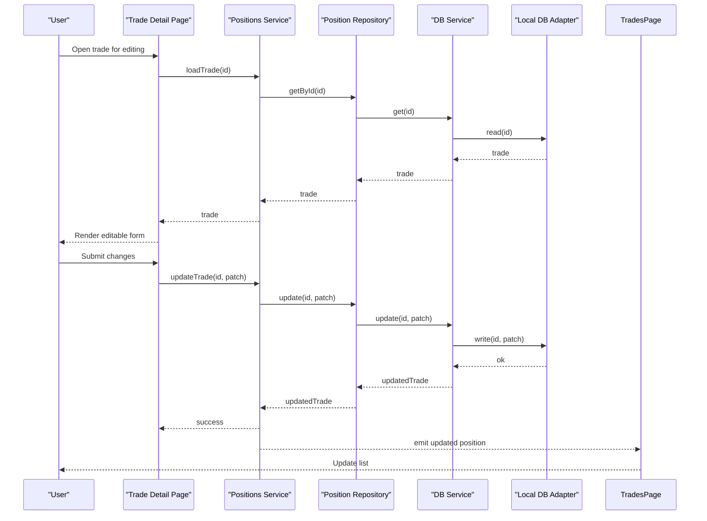

**Diagram sources**
- [trade-detail-page.js](file://features/positions/trade-detail-page.js)
- [positions-service.js](file://features/positions/positions-service.js)
- [PositionRepository.js](file://features/positions/PositionRepository.js)
- [db-service.js](file://shared/db/db-service.js)
- [local-db.js](file://shared/db/local-db.js)
- [trades-page.js](file://features/positions/trades-page.js)

**Section sources**
- [trade-detail-page.js](file://features/positions/trade-detail-page.js)
- [positions-service.js](file://features/positions/positions-service.js)
- [PositionRepository.js](file://features/positions/PositionRepository.js)
- [db-service.js](file://shared/db/db-service.js)
- [local-db.js](file://shared/db/local-db.js)
- [trades-page.js](file://features/positions/trades-page.js)

### Closing Positions
- Initiation:
  - Action button on trade detail or list item.
- Confirmation:
  - Modal or sheet prompts for confirmation.
- Execution:
  - Service calls close operation on repository.
  - Repository persists closure and updates status.
- Post-close:
  - Remove from active stream and add to past stream.
  - Update UI accordingly.

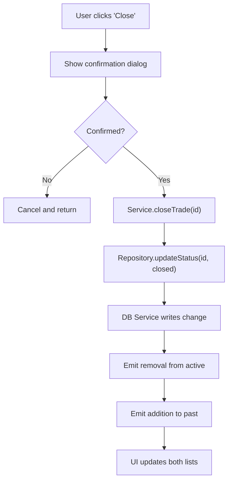

**Diagram sources**
- [trade-detail-page.js](file://features/positions/trade-detail-page.js)
- [trade-modal.js](file://features/common/trade-modal.js)
- [positions-service.js](file://features/positions/positions-service.js)
- [PositionRepository.js](file://features/positions/PositionRepository.js)
- [db-service.js](file://shared/db/db-service.js)
- [local-db.js](file://shared/db/local-db.js)
- [past-page.js](file://features/positions/past-page.js)
- [trades-page.js](file://features/positions/trades-page.js)

**Section sources**
- [trade-detail-page.js](file://features/positions/trade-detail-page.js)
- [trade-modal.js](file://features/common/trade-modal.js)
- [positions-service.js](file://features/positions/positions-service.js)
- [PositionRepository.js](file://features/positions/PositionRepository.js)
- [db-service.js](file://shared/db/db-service.js)
- [local-db.js](file://shared/db/local-db.js)
- [past-page.js](file://features/positions/past-page.js)
- [trades-page.js](file://features/positions/trades-page.js)

### Managing Position States
- State transitions:
  - Active -> Closed
  - Pending -> Active
  - Rejected -> Archived
- State propagation:
  - Service emits state change events.
  - Pages react by filtering streams and updating UI.
- History tracking:
  - Past page aggregates historical positions.

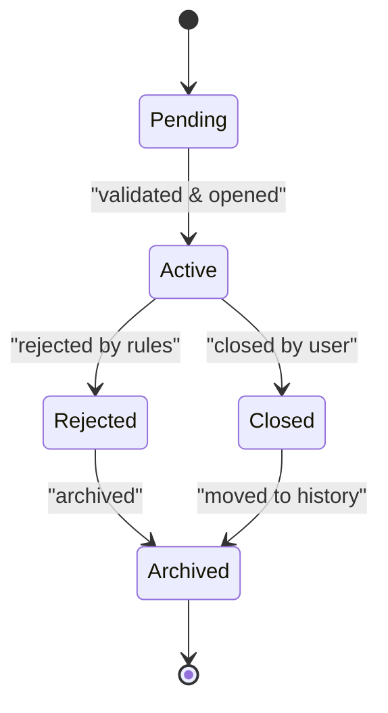

**Diagram sources**
- [positions-service.js](file://features/positions/positions-service.js)
- [past-page.js](file://features/positions/past-page.js)
- [trades-page.js](file://features/positions/trades-page.js)

**Section sources**
- [positions-service.js](file://features/positions/positions-service.js)
- [past-page.js](file://features/positions/past-page.js)
- [trades-page.js](file://features/positions/trades-page.js)

### UI Components for Trade Display and Interaction
- Trade List:
  - Renders rows with key metrics and actions.
  - Supports selection, sorting, and filtering.
- Trade Modal:
  - Inline forms for quick edits and confirmations.
  - Validates inputs and shows errors inline.
- Trade Sheets:
  - Full-screen or side-panel editing experience.
  - Integrates with navigation and back actions.

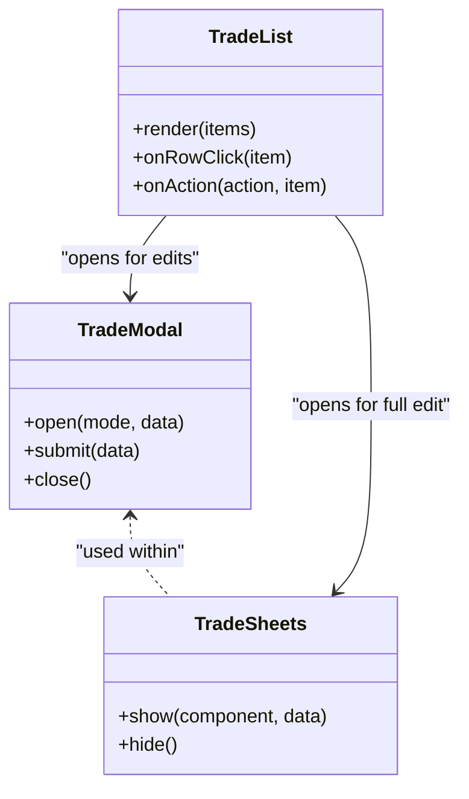

**Diagram sources**
- [trade-list.js](file://features/common/trade-list.js)
- [trade-modal.js](file://features/common/trade-modal.js)
- [trade-sheets.js](file://features/common/trade-sheets.js)

**Section sources**
- [trade-list.js](file://features/common/trade-list.js)
- [trade-modal.js](file://features/common/trade-modal.js)
- [trade-sheets.js](file://features/common/trade-sheets.js)

### Page Lifecycle and Routing
- Bootstrap initializes the app shell and registers routes.
- Router mounts/unmounts pages based on URL or navigation actions.
- Each page subscribes to services on mount and unsubscribes on unmount to prevent leaks.

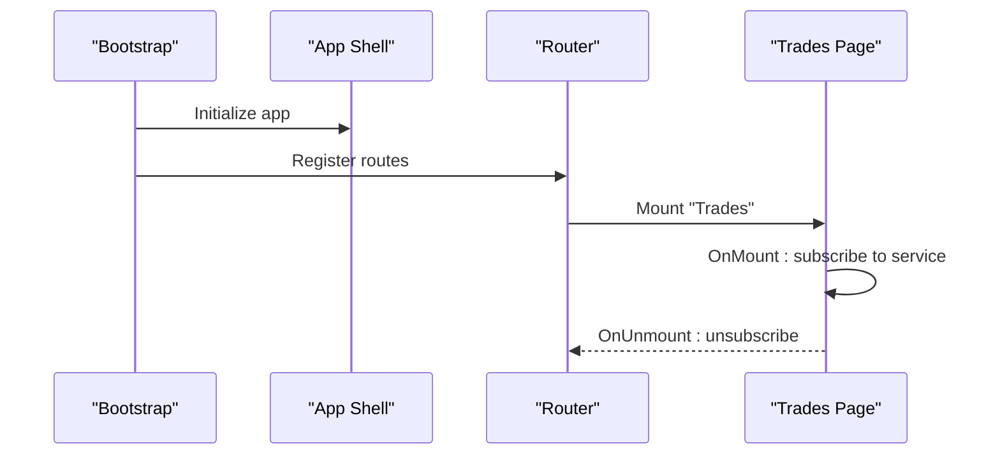

**Diagram sources**
- [bootstrap.js](file://shared/lib/bootstrap.js)
- [app-shell.js](file://features/common/app-shell.js)
- [router.js](file://features/common/router.js)
- [trades-page.js](file://features/positions/trades-page.js)

**Section sources**
- [bootstrap.js](file://shared/lib/bootstrap.js)
- [app-shell.js](file://features/common/app-shell.js)
- [router.js](file://features/common/router.js)
- [trades-page.js](file://features/positions/trades-page.js)

### Data Binding Mechanisms
- Reactive streams:
  - Service emits arrays or objects representing positions.
  - Pages bind to these streams and update DOM efficiently.
- Form bindings:
  - Inputs bound to model fields with validation hooks.
  - Errors displayed near relevant fields.

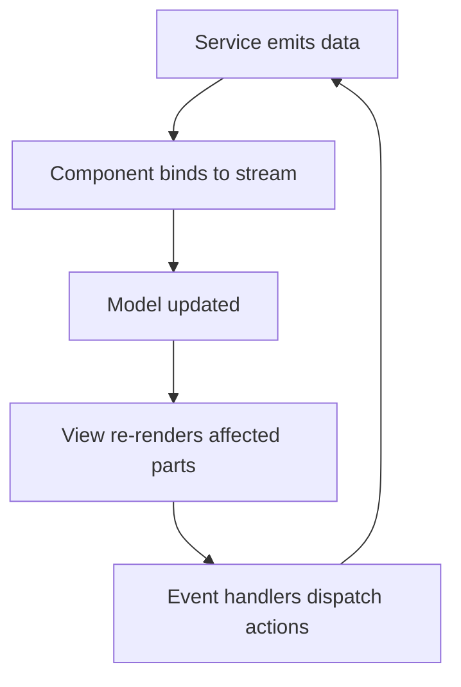

**Diagram sources**
- [positions-service.js](file://features/positions/positions-service.js)
- [trade-detail-page.js](file://features/positions/trade-detail-page.js)
- [trade-list.js](file://features/common/trade-list.js)

**Section sources**
- [positions-service.js](file://features/positions/positions-service.js)
- [trade-detail-page.js](file://features/positions/trade-detail-page.js)
- [trade-list.js](file://features/common/trade-list.js)

### Event Handling for Trade Operations
- Actions:
  - Create, update, close, duplicate.
- Handlers:
  - Validate input, call service methods, handle success/failure.
- Feedback:
  - Toasts or inline messages for user feedback.

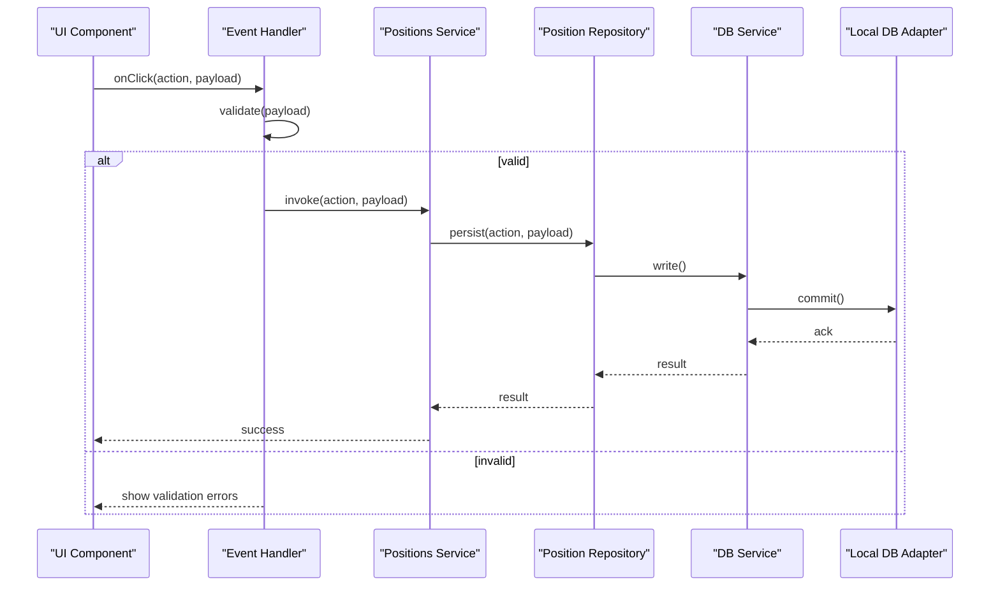

**Diagram sources**
- [trade-modal.js](file://features/common/trade-modal.js)
- [trade-detail-page.js](file://features/positions/trade-detail-page.js)
- [positions-service.js](file://features/positions/positions-service.js)
- [PositionRepository.js](file://features/positions/PositionRepository.js)
- [db-service.js](file://shared/db/db-service.js)
- [local-db.js](file://shared/db/local-db.js)

**Section sources**
- [trade-modal.js](file://features/common/trade-modal.js)
- [trade-detail-page.js](file://features/positions/trade-detail-page.js)
- [positions-service.js](file://features/positions/positions-service.js)
- [PositionRepository.js](file://features/positions/PositionRepository.js)
- [db-service.js](file://shared/db/db-service.js)
- [local-db.js](file://shared/db/local-db.js)

### Integration with Positions Service Layer
- Responsibilities:
  - Orchestrate repository calls.
  - Manage subscriptions and broadcasting.
  - Normalize and transform data for UI.
- Error handling:
  - Centralized error mapping and retry strategies.
- Caching:
  - Local cache for recent positions to reduce latency.

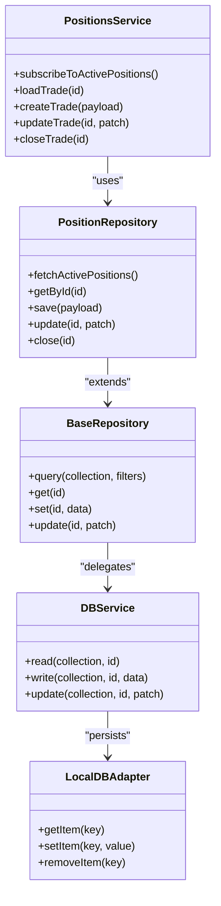

**Diagram sources**
- [positions-service.js](file://features/positions/positions-service.js)
- [PositionRepository.js](file://features/positions/PositionRepository.js)
- [BaseRepository.js](file://shared/db/BaseRepository.js)
- [db-service.js](file://shared/db/db-service.js)
- [local-db.js](file://shared/db/local-db.js)

**Section sources**
- [positions-service.js](file://features/positions/positions-service.js)
- [PositionRepository.js](file://features/positions/PositionRepository.js)
- [BaseRepository.js](file://shared/db/BaseRepository.js)
- [db-service.js](file://shared/db/db-service.js)
- [local-db.js](file://shared/db/local-db.js)

### Examples of Common Workflows
- Creating a new position:
  - Open modal from trades page, fill form, submit, receive confirmation, see new item in list.
- Modifying an existing trade:
  - Navigate to detail page, edit fields, save, observe live update in list.
- Closing a position:
  - Click close action, confirm, remove from active list, appear in past list.
- Managing position states:
  - Observe state transitions and corresponding UI updates across pages.

[No sources needed since this section summarizes workflows without analyzing specific files]

### UI Components Used for Trade Display
- Trade List:
  - Row rendering, selection, and action buttons.
- Trade Modal:
  - Inline editing and confirmation dialogs.
- Trade Sheets:
  - Full-screen editing with navigation context.

**Section sources**
- [trade-list.js](file://features/common/trade-list.js)
- [trade-modal.js](file://features/common/trade-modal.js)
- [trade-sheets.js](file://features/common/trade-sheets.js)

### Form Validation
- Client-side validation:
  - Required fields, numeric constraints, range checks.
- Service-level validation:
  - Additional business rule enforcement before persistence.
- Error presentation:
  - Inline messages and focus management.

**Section sources**
- [trade-modal.js](file://features/common/trade-modal.js)
- [trade-detail-page.js](file://features/positions/trade-detail-page.js)
- [positions-service.js](file://features/positions/positions-service.js)

### Error Handling
- Centralized error mapping:
  - Service translates backend errors into user-friendly messages.
- Retry and fallback:
  - Network retries and cached data fallback.
- User feedback:
  - Toasts, banners, and inline errors.

**Section sources**
- [positions-service.js](file://features/positions/positions-service.js)
- [trade-modal.js](file://features/common/trade-modal.js)
- [trade-detail-page.js](file://features/positions/trade-detail-page.js)

### Responsive Design Considerations
- Mobile-first layouts:
  - Trade list adapts to small screens with compact rows.
- Sheet vs modal:
  - Use sheets on larger screens, modals on smaller devices.
- Touch-friendly controls:
  - Larger tap targets and swipe gestures where applicable.

[No sources needed since this section provides general guidance]

## Dependency Analysis
The following diagram highlights direct dependencies among core components:

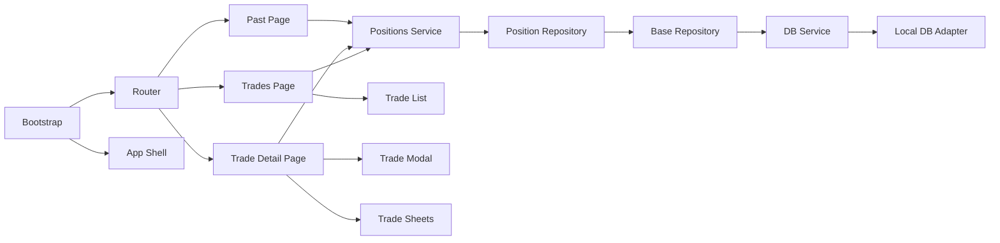

**Diagram sources**
- [trades-page.js](file://features/positions/trades-page.js)
- [trade-detail-page.js](file://features/positions/trade-detail-page.js)
- [past-page.js](file://features/positions/past-page.js)
- [positions-service.js](file://features/positions/positions-service.js)
- [PositionRepository.js](file://features/positions/PositionRepository.js)
- [BaseRepository.js](file://shared/db/BaseRepository.js)
- [db-service.js](file://shared/db/db-service.js)
- [local-db.js](file://shared/db/local-db.js)
- [trade-list.js](file://features/common/trade-list.js)
- [trade-modal.js](file://features/common/trade-modal.js)
- [trade-sheets.js](file://features/common/trade-sheets.js)
- [bootstrap.js](file://shared/lib/bootstrap.js)
- [router.js](file://features/common/router.js)
- [app-shell.js](file://features/common/app-shell.js)

**Section sources**
- [trades-page.js](file://features/positions/trades-page.js)
- [trade-detail-page.js](file://features/positions/trade-detail-page.js)
- [past-page.js](file://features/positions/past-page.js)
- [positions-service.js](file://features/positions/positions-service.js)
- [PositionRepository.js](file://features/positions/PositionRepository.js)
- [BaseRepository.js](file://shared/db/BaseRepository.js)
- [db-service.js](file://shared/db/db-service.js)
- [local-db.js](file://shared/db/local-db.js)
- [trade-list.js](file://features/common/trade-list.js)
- [trade-modal.js](file://features/common/trade-modal.js)
- [trade-sheets.js](file://features/common/trade-sheets.js)
- [bootstrap.js](file://shared/lib/bootstrap.js)
- [router.js](file://features/common/router.js)
- [app-shell.js](file://features/common/app-shell.js)

## Performance Considerations
- Minimize re-renders:
  - Use incremental updates and keyed lists.
- Debounce rapid updates:
  - Coalesce frequent price or PnL changes.
- Pagination and virtualization:
  - For large trade histories, implement pagination or virtual scrolling.
- Efficient subscriptions:
  - Unsubscribe on unmount and scope listeners to active views.

[No sources needed since this section provides general guidance]

## Troubleshooting Guide
- Symptom: No positions displayed
  - Check subscription initialization and route mounting.
  - Verify DB service connectivity and local adapter availability.
- Symptom: Changes not reflected in UI
  - Ensure service emits updates after successful persistence.
  - Confirm UI binds to correct streams and keys are stable.
- Symptom: Validation errors not shown
  - Inspect form handler error mapping and field binding.
- Symptom: Navigation issues
  - Review router registration and page lifecycle hooks.

**Section sources**
- [trades-page.js](file://features/positions/trades-page.js)
- [trade-detail-page.js](file://features/positions/trade-detail-page.js)
- [positions-service.js](file://features/positions/positions-service.js)
- [router.js](file://features/common/router.js)
- [bootstrap.js](file://shared/lib/bootstrap.js)

## Conclusion
The Trades Management Interface implements a robust, layered architecture with clear separation of concerns. Active position monitoring leverages reactive streams for real-time updates, while trade creation and modification follow consistent workflows with strong validation and error handling. Integration with the positions service layer ensures reliable data persistence and state management. UI components provide flexible interaction patterns suitable for various screen sizes, and the overall design supports scalability and maintainability.

[No sources needed since this section summarizes without analyzing specific files]

## Appendices
- Glossary:
  - Active positions: Currently open trades.
  - Past positions: Historical trades moved out of active view.
  - Trade sheets: Side-panel editing interfaces.
- Best practices:
  - Always unsubscribe from streams on unmount.
  - Normalize data at the service boundary.
  - Keep UI components stateless where possible.

[No sources needed since this section provides general guidance]