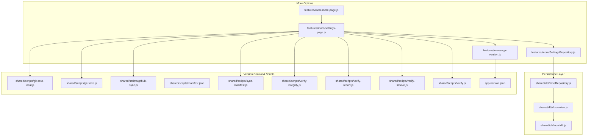
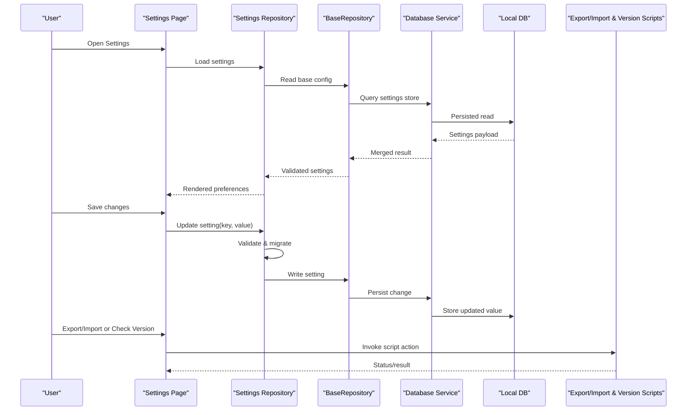
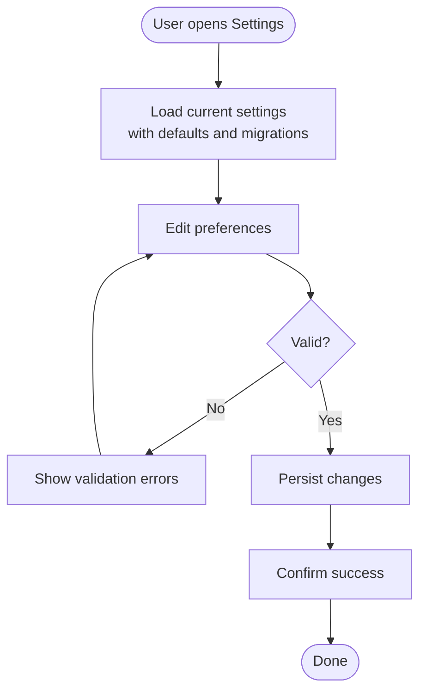
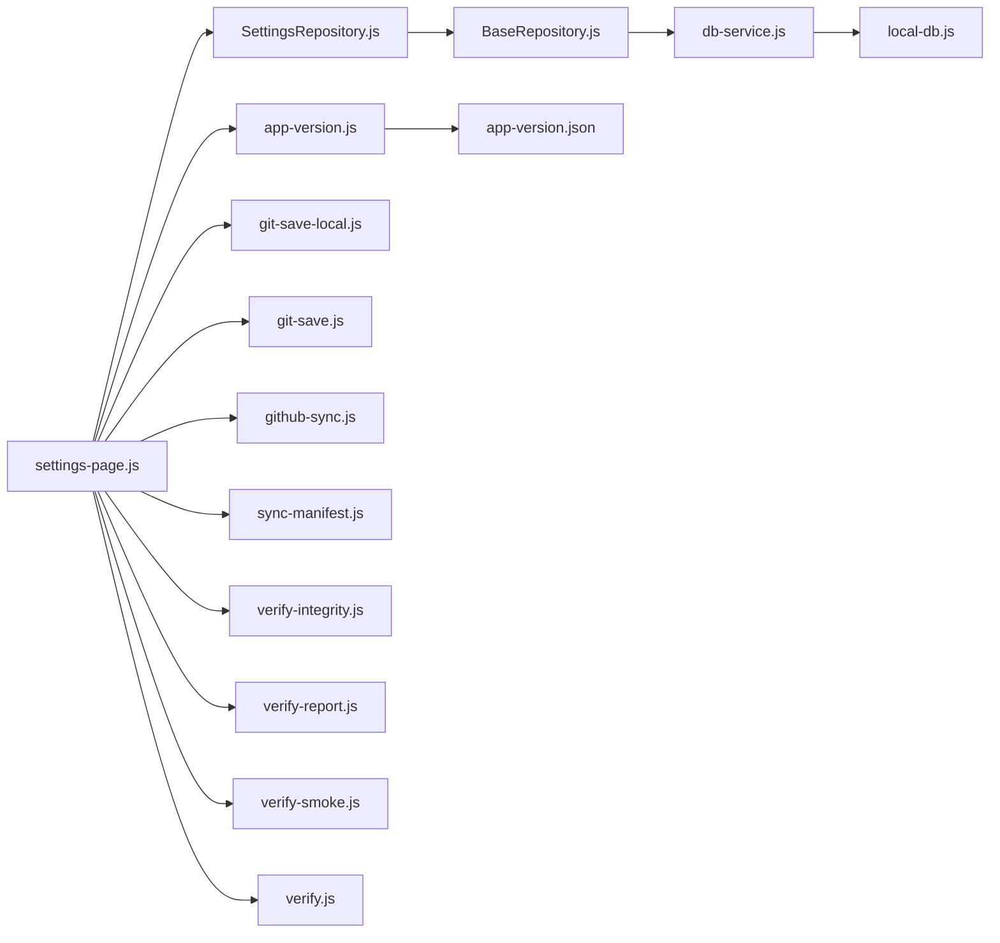

# Settings & Configuration

<cite>
**Referenced Files in This Document**
- [more-page.js](file://features/more/more-page.js)
- [settings-page.js](file://features/more/settings-page.js)
- [SettingsRepository.js](file://features/more/SettingsRepository.js)
- [app-version.js](file://features/more/app-version.js)
- [BaseRepository.js](file://shared/db/BaseRepository.js)
- [db-service.js](file://shared/db/db-service.js)
- [local-db.js](file://shared/db/local-db.js)
- [bootstrap.js](file://shared/lib/bootstrap.js)
- [git-save-local.js](file://shared/scripts/git-save-local.js)
- [git-save.js](file://shared/scripts/git-save.js)
- [github-sync.js](file://shared/scripts/github-sync.js)
- [manifest.json](file://shared/scripts/manifest.json)
- [sync-manifest.js](file://shared/scripts/sync-manifest.js)
- [verify-integrity.js](file://shared/scripts/verify-integrity.js)
- [verify-report.js](file://shared/scripts/verify-report.js)
- [verify-smoke.js](file://shared/scripts/verify-smoke.js)
- [verify.js](file://shared/scripts/verify.js)
- [app-version.json](file://app-version.json)
</cite>

## Table of Contents
1. [Introduction](#introduction)
2. [Project Structure](#project-structure)
3. [Core Components](#core-components)
4. [Architecture Overview](#architecture-overview)
5. [Detailed Component Analysis](#detailed-component-analysis)
6. [Dependency Analysis](#dependency-analysis)
7. [Performance Considerations](#performance-considerations)
8. [Troubleshooting Guide](#troubleshooting-guide)
9. [Conclusion](#conclusion)
10. [Appendices](#appendices)

## Introduction
This document explains the Settings & Configuration feature, covering application preferences management, data export/import, and version control systems. It documents the settings page interface, the settings repository for persistence, the more options menu, and app version management. It also describes configuration schema, default values, validation rules, migration strategies, examples for custom settings, backup/restore workflows, update management, integration with external configuration sources, security considerations for sensitive settings, and cross-device synchronization.

## Project Structure
The Settings & Configuration feature is implemented under the features/more directory and integrates with shared database utilities and scripts for export/import and versioning.

**Diagram sources**
- [more-page.js](file://features/more/more-page.js)
- [settings-page.js](file://features/more/settings-page.js)
- [SettingsRepository.js](file://features/more/SettingsRepository.js)
- [BaseRepository.js](file://shared/db/BaseRepository.js)
- [db-service.js](file://shared/db/db-service.js)
- [local-db.js](file://shared/db/local-db.js)
- [git-save-local.js](file://shared/scripts/git-save-local.js)
- [git-save.js](file://shared/scripts/git-save.js)
- [github-sync.js](file://shared/scripts/github-sync.js)
- [manifest.json](file://shared/scripts/manifest.json)
- [sync-manifest.js](file://shared/scripts/sync-manifest.js)
- [verify-integrity.js](file://shared/scripts/verify-integrity.js)
- [verify-report.js](file://shared/scripts/verify-report.js)
- [verify-smoke.js](file://shared/scripts/verify-smoke.js)
- [verify.js](file://shared/scripts/verify.js)
- [app-version.js](file://features/more/app-version.js)
- [app-version.json](file://app-version.json)

**Section sources**
- [more-page.js](file://features/more/more-page.js)
- [settings-page.js](file://features/more/settings-page.js)
- [SettingsRepository.js](file://features/more/SettingsRepository.js)
- [BaseRepository.js](file://shared/db/BaseRepository.js)
- [db-service.js](file://shared/db/db-service.js)
- [local-db.js](file://shared/db/local-db.js)
- [git-save-local.js](file://shared/scripts/git-save-local.js)
- [git-save.js](file://shared/scripts/git-save.js)
- [github-sync.js](file://shared/scripts/github-sync.js)
- [manifest.json](file://shared/scripts/manifest.json)
- [sync-manifest.js](file://shared/scripts/sync-manifest.js)
- [verify-integrity.js](file://shared/scripts/verify-integrity.js)
- [verify-report.js](file://shared/scripts/verify-report.js)
- [verify-smoke.js](file://shared/scripts/verify-smoke.js)
- [verify.js](file://shared/scripts/verify.js)
- [app-version.js](file://features/more/app-version.js)
- [app-version.json](file://app-version.json)

## Core Components
- More Options Menu: Entry point to settings and related tools.
- Settings Page: UI for viewing/editing preferences, exporting/importing data, and managing versions.
- Settings Repository: Centralized persistence for application preferences.
- App Version Manager: Reads and exposes current app version metadata.
- Persistence Layer: Shared database utilities used by the repository.
- Scripts: Export/import, manifest sync, integrity verification, and GitHub sync utilities.

Key responsibilities:
- Provide a consistent API for reading/writing settings.
- Validate and migrate settings on load.
- Support export/import of settings and related data.
- Surface version information and support update checks.
- Integrate with local and remote storage mechanisms.

**Section sources**
- [more-page.js](file://features/more/more-page.js)
- [settings-page.js](file://features/more/settings-page.js)
- [SettingsRepository.js](file://features/more/SettingsRepository.js)
- [app-version.js](file://features/more/app-version.js)
- [BaseRepository.js](file://shared/db/BaseRepository.js)
- [db-service.js](file://shared/db/db-service.js)
- [local-db.js](file://shared/db/local-db.js)

## Architecture Overview
The Settings & Configuration subsystem follows a layered architecture:
- Presentation: Settings Page renders controls and actions.
- Domain: Settings Repository encapsulates business logic for preferences (schema, defaults, validation, migration).
- Infrastructure: Database services and local storage provide persistence; scripts handle export/import and version control.

**Diagram sources**
- [settings-page.js](file://features/more/settings-page.js)
- [SettingsRepository.js](file://features/more/SettingsRepository.js)
- [BaseRepository.js](file://shared/db/BaseRepository.js)
- [db-service.js](file://shared/db/db-service.js)
- [local-db.js](file://shared/db/local-db.js)
- [git-save-local.js](file://shared/scripts/git-save-local.js)
- [git-save.js](file://shared/scripts/git-save.js)
- [github-sync.js](file://shared/scripts/github-sync.js)
- [sync-manifest.js](file://shared/scripts/sync-manifest.js)
- [verify-integrity.js](file://shared/scripts/verify-integrity.js)
- [verify-report.js](file://shared/scripts/verify-report.js)
- [verify-smoke.js](file://shared/scripts/verify-smoke.js)
- [verify.js](file://shared/scripts/verify.js)
- [app-version.js](file://features/more/app-version.js)

## Detailed Component Analysis

### Settings Page Interface
Responsibilities:
- Display current preferences grouped by categories.
- Provide controls for toggles, inputs, and dropdowns.
- Trigger save operations with immediate feedback.
- Offer actions for export/import, version info, and maintenance tasks.

User flows:
- View and edit preferences.
- Save changes with validation and migration.
- Export settings/data to a file or local storage snapshot.
- Import settings/data from an exported artifact.
- Check app version and perform update-related actions.

Validation and feedback:
- Inline validation errors are shown next to fields.
- Success notifications confirm persisted changes.
- Warnings appear when importing incompatible versions.

**Section sources**
- [settings-page.js](file://features/more/settings-page.js)

### Settings Repository
Responsibilities:
- Define configuration schema, default values, and validation rules.
- Perform migrations when schema evolves.
- Provide atomic get/set/update methods.
- Coordinate with the base repository for persistence.

Schema and defaults:
- Schema defines keys, types, constraints, and descriptions.
- Defaults ensure consistent initial state across devices.
- Validation enforces type safety and business rules.

Migration strategy:
- On load, compare stored version with expected schema version.
- Apply incremental migrations to transform legacy structures.
- Rollback-safe design with idempotent steps.

Persistence:
- Uses BaseRepository to read/write settings.
- Integrates with database service and local storage.

Error handling:
- Graceful fallback to defaults on corruption.
- Detailed error messages for invalid imports.

**Section sources**
- [SettingsRepository.js](file://features/more/SettingsRepository.js)
- [BaseRepository.js](file://shared/db/BaseRepository.js)
- [db-service.js](file://shared/db/db-service.js)
- [local-db.js](file://shared/db/local-db.js)

### More Options Menu
Responsibilities:
- Provide navigation to the Settings Page.
- Expose quick access to export/import and version tools.
- Group related maintenance actions for discoverability.

Integration:
- Delegates to Settings Page for preference editing.
- Invokes scripts for export/import and version control.

**Section sources**
- [more-page.js](file://features/more/more-page.js)

### App Version Management
Responsibilities:
- Read current app version metadata.
- Expose version details to the UI.
- Support update checks and release notes display.

Metadata source:
- Version information is sourced from a dedicated JSON file.

Update workflow:
- Compare installed version with latest available.
- Prompt user to update if newer version exists.
- Preserve settings during updates via export/import or migration.

**Section sources**
- [app-version.js](file://features/more/app-version.js)
- [app-version.json](file://app-version.json)

### Data Export/Import
Capabilities:
- Export settings and related data to a portable format.
- Import previously exported data with validation and migration.
- Generate manifests for consistency and integrity checks.

Workflow:
- Export:
  - Collect settings and related artifacts.
  - Compute checksums and generate manifest.
  - Save to local storage or download as file.
- Import:
  - Parse uploaded/exported artifact.
  - Validate structure and checksums.
  - Apply migrations if needed.
  - Persist validated data.

Security:
- Verify integrity using provided scripts.
- Warn on mismatched checksums or unsupported formats.

**Section sources**
- [git-save-local.js](file://shared/scripts/git-save-local.js)
- [git-save.js](file://shared/scripts/git-save.js)
- [github-sync.js](file://shared/scripts/github-sync.js)
- [manifest.json](file://shared/scripts/manifest.json)
- [sync-manifest.js](file://shared/scripts/sync-manifest.js)
- [verify-integrity.js](file://shared/scripts/verify-integrity.js)
- [verify-report.js](file://shared/scripts/verify-report.js)
- [verify-smoke.js](file://shared/scripts/verify-smoke.js)
- [verify.js](file://shared/scripts/verify.js)

### Version Control Systems Integration
Capabilities:
- Local snapshots for quick rollback.
- Remote synchronization via GitHub.
- Manifest-based tracking for reproducible builds.

Workflows:
- Local save:
  - Create timestamped snapshots.
  - Maintain history for restore points.
- Remote sync:
  - Push/pull changes to a designated repository.
  - Resolve conflicts based on timestamps and manifests.
- Integrity verification:
  - Validate checksums and report discrepancies.
  - Smoke tests to ensure critical components remain functional.

**Section sources**
- [git-save-local.js](file://shared/scripts/git-save-local.js)
- [git-save.js](file://shared/scripts/git-save.js)
- [github-sync.js](file://shared/scripts/github-sync.js)
- [manifest.json](file://shared/scripts/manifest.json)
- [sync-manifest.js](file://shared/scripts/sync-manifest.js)
- [verify-integrity.js](file://shared/scripts/verify-integrity.js)
- [verify-report.js](file://shared/scripts/verify-report.js)
- [verify-smoke.js](file://shared/scripts/verify-smoke.js)
- [verify.js](file://shared/scripts/verify.js)

### Conceptual Overview
The following conceptual diagram illustrates how settings flow through the system without mapping to specific files.

[No sources needed since this diagram shows conceptual workflow, not actual code structure]

## Dependency Analysis
The Settings & Configuration feature depends on shared database utilities and scripts for export/import and version control. The repository pattern centralizes persistence logic, while the UI delegates to scripts for heavy operations.

**Diagram sources**
- [settings-page.js](file://features/more/settings-page.js)
- [SettingsRepository.js](file://features/more/SettingsRepository.js)
- [BaseRepository.js](file://shared/db/BaseRepository.js)
- [db-service.js](file://shared/db/db-service.js)
- [local-db.js](file://shared/db/local-db.js)
- [app-version.js](file://features/more/app-version.js)
- [app-version.json](file://app-version.json)
- [git-save-local.js](file://shared/scripts/git-save-local.js)
- [git-save.js](file://shared/scripts/git-save.js)
- [github-sync.js](file://shared/scripts/github-sync.js)
- [sync-manifest.js](file://shared/scripts/sync-manifest.js)
- [verify-integrity.js](file://shared/scripts/verify-integrity.js)
- [verify-report.js](file://shared/scripts/verify-report.js)
- [verify-smoke.js](file://shared/scripts/verify-smoke.js)
- [verify.js](file://shared/scripts/verify.js)

**Section sources**
- [settings-page.js](file://features/more/settings-page.js)
- [SettingsRepository.js](file://features/more/SettingsRepository.js)
- [BaseRepository.js](file://shared/db/BaseRepository.js)
- [db-service.js](file://shared/db/db-service.js)
- [local-db.js](file://shared/db/local-db.js)
- [app-version.js](file://features/more/app-version.js)
- [app-version.json](file://app-version.json)
- [git-save-local.js](file://shared/scripts/git-save-local.js)
- [git-save.js](file://shared/scripts/git-save.js)
- [github-sync.js](file://shared/scripts/github-sync.js)
- [sync-manifest.js](file://shared/scripts/sync-manifest.js)
- [verify-integrity.js](file://shared/scripts/verify-integrity.js)
- [verify-report.js](file://shared/scripts/verify-report.js)
- [verify-smoke.js](file://shared/scripts/verify-smoke.js)
- [verify.js](file://shared/scripts/verify.js)

## Performance Considerations
- Batch writes: Coalesce multiple setting updates into a single transaction where possible.
- Lazy loading: Load only necessary settings groups initially; defer others until accessed.
- Caching: Cache frequently accessed settings in memory to reduce I/O overhead.
- Validation efficiency: Use fast path checks before expensive validations.
- Import/export streaming: Process large exports incrementally to avoid blocking the UI.
- Version checks: Cache remote version responses with short TTL to minimize network calls.

[No sources needed since this section provides general guidance]

## Troubleshooting Guide
Common issues and resolutions:
- Invalid import artifact:
  - Ensure checksums match and format is supported.
  - Re-export from a compatible version or apply required migrations.
- Missing settings after update:
  - Run migration steps explicitly or re-import a recent backup.
- Sync failures:
  - Verify connectivity and credentials; check conflict resolution logs.
- Integrity errors:
  - Run integrity verification and review reports for discrepancies.
- Slow settings load:
  - Inspect database queries and consider adding caching or pagination.

Operational tips:
- Use local snapshots before major changes.
- Keep manifests up-to-date to maintain reproducibility.
- Monitor verification reports for early detection of corruption.

**Section sources**
- [verify-integrity.js](file://shared/scripts/verify-integrity.js)
- [verify-report.js](file://shared/scripts/verify-report.js)
- [verify-smoke.js](file://shared/scripts/verify-smoke.js)
- [verify.js](file://shared/scripts/verify.js)
- [sync-manifest.js](file://shared/scripts/sync-manifest.js)

## Conclusion
The Settings & Configuration feature provides a robust foundation for managing application preferences, ensuring data portability through export/import, and maintaining version integrity with local and remote synchronization. By centralizing schema, validation, and migration logic in the settings repository and leveraging shared persistence and verification utilities, the system remains reliable, secure, and extensible.

[No sources needed since this section summarizes without analyzing specific files]

## Appendices

### Configuration Schema Guidelines
- Define each setting with key, type, default, and constraints.
- Include human-readable descriptions for UI tooltips.
- Enforce non-empty strings, numeric ranges, and boolean flags as appropriate.
- Version the schema to enable migrations.

Example implementation patterns:
- Add a new setting by extending the schema and providing a default.
- Implement validation rules that return clear error messages.
- Add a migration step to transform legacy values safely.

**Section sources**
- [SettingsRepository.js](file://features/more/SettingsRepository.js)
- [BaseRepository.js](file://shared/db/BaseRepository.js)

### Security Considerations for Sensitive Settings
- Avoid storing secrets in plain text; prefer encrypted storage or environment variables.
- Mask sensitive fields in the UI and logs.
- Validate and sanitize all imported data to prevent injection.
- Restrict access to settings APIs and enforce authentication where applicable.
- Rotate credentials regularly and audit access logs.

[No sources needed since this section provides general guidance]

### Cross-Device Synchronization
- Use manifests to track device-specific changes and resolve conflicts deterministically.
- Prefer last-write-wins with timestamps for simple cases; use merge strategies for complex objects.
- Provide manual override prompts when conflicts cannot be resolved automatically.
- Ensure offline-first behavior with queued sync operations.

**Section sources**
- [github-sync.js](file://shared/scripts/github-sync.js)
- [sync-manifest.js](file://shared/scripts/sync-manifest.js)

### Examples: Custom Settings, Backup/Restore, Updates, External Sources
- Custom settings:
  - Extend schema, add UI controls, implement validation and migration.
- Backup/restore:
  - Export full settings bundle; import with integrity checks and migrations.
- Application updates:
  - Compare versions, prompt user, preserve settings, and run post-update migrations.
- External configuration sources:
  - Merge remote configs with local overrides; prioritize local for privacy-sensitive keys.

**Section sources**
- [settings-page.js](file://features/more/settings-page.js)
- [SettingsRepository.js](file://features/more/SettingsRepository.js)
- [git-save-local.js](file://shared/scripts/git-save-local.js)
- [git-save.js](file://shared/scripts/git-save.js)
- [github-sync.js](file://shared/scripts/github-sync.js)
- [app-version.js](file://features/more/app-version.js)
- [app-version.json](file://app-version.json)