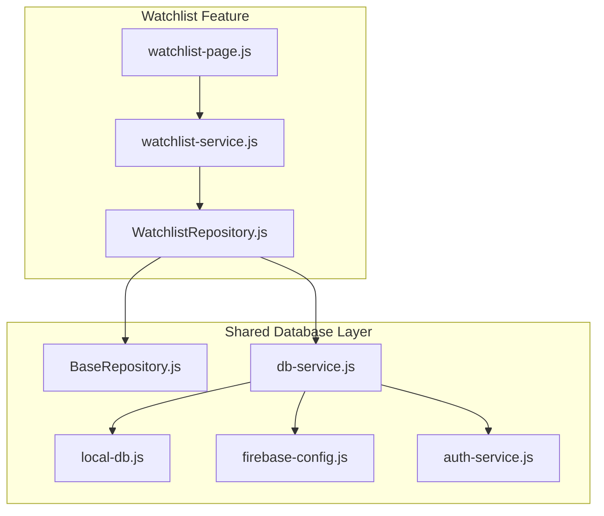
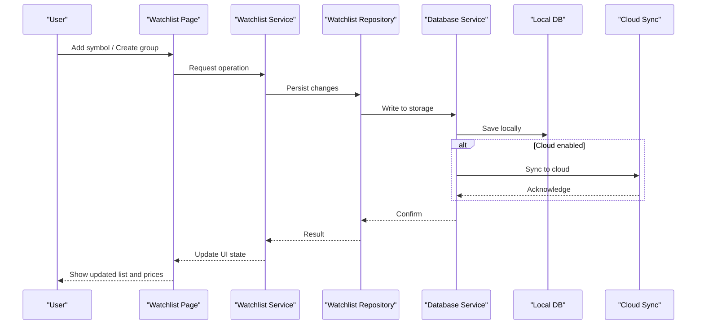
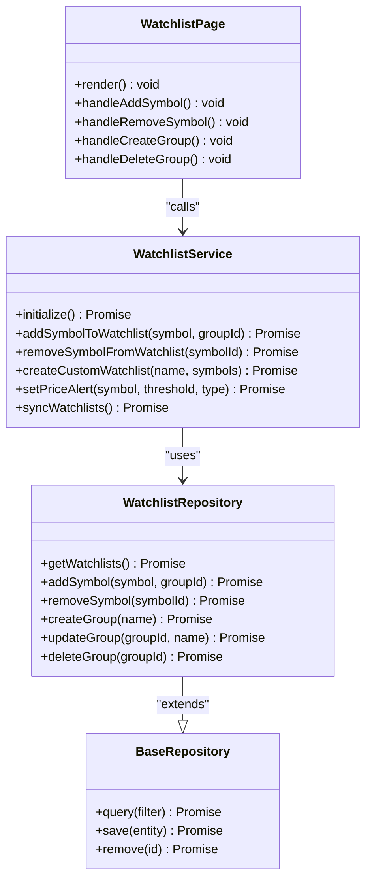
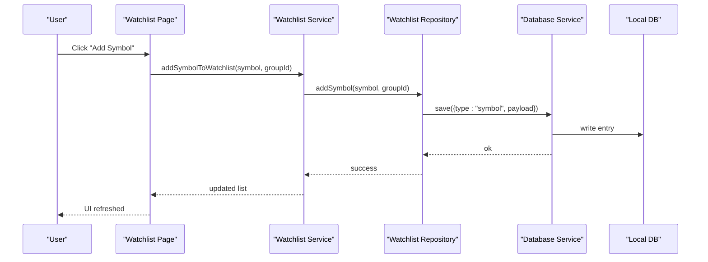
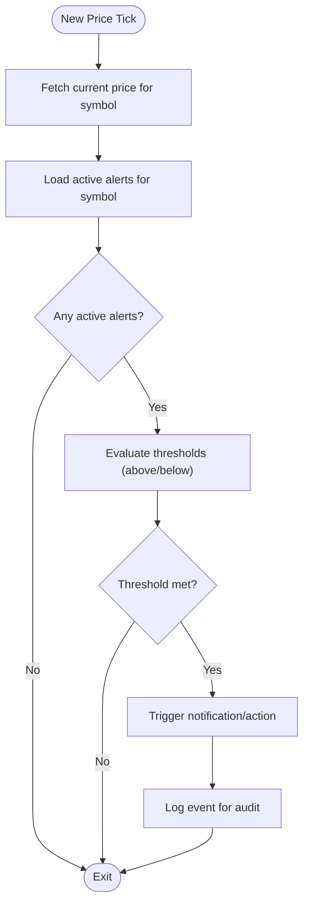
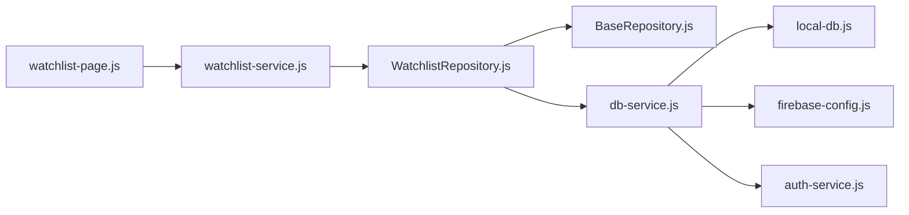

# Watchlist Management

<cite>
**Referenced Files in This Document**
- [watchlist-page.js](file://features/watchlist/watchlist-page.js)
- [watchlist-service.js](file://features/watchlist/watchlist-service.js)
- [WatchlistRepository.js](file://features/watchlist/WatchlistRepository.js)
- [BaseRepository.js](file://shared/db/BaseRepository.js)
- [db-service.js](file://shared/db/db-service.js)
- [local-db.js](file://shared/db/local-db.js)
- [firebase-config.js](file://shared/db/firebase-config.js)
- [auth-service.js](file://shared/db/auth-service.js)
</cite>

## Table of Contents
1. [Introduction](#introduction)
2. [Project Structure](#project-structure)
3. [Core Components](#core-components)
4. [Architecture Overview](#architecture-overview)
5. [Detailed Component Analysis](#detailed-component-analysis)
6. [Dependency Analysis](#dependency-analysis)
7. [Performance Considerations](#performance-considerations)
8. [Troubleshooting Guide](#troubleshooting-guide)
9. [Conclusion](#conclusion)
10. [Appendices](#appendices)

## Introduction
This document explains the Watchlist Management feature, focusing on multi-symbol price monitoring, customizable symbol groups, and alerting systems. It covers the watchlist page interface for adding/removing symbols and organizing them into groups, real-time price updates, data persistence via the repository layer, business logic encapsulated in the service layer, and integration patterns with price data sources. It also provides guidance on creating custom watchlists, setting up alerts, categorizing symbols, syncing across devices, and optimizing performance for large watchlists.

## Project Structure
The Watchlist feature is implemented under features/watchlist with a clear separation between UI (page), business logic (service), and persistence (repository). The repository leverages shared database utilities for local storage and optional cloud sync.

**Diagram sources**
- [watchlist-page.js](file://features/watchlist/watchlist-page.js)
- [watchlist-service.js](file://features/watchlist/watchlist-service.js)
- [WatchlistRepository.js](file://features/watchlist/WatchlistRepository.js)
- [BaseRepository.js](file://shared/db/BaseRepository.js)
- [db-service.js](file://shared/db/db-service.js)
- [local-db.js](file://shared/db/local-db.js)
- [firebase-config.js](file://shared/db/firebase-config.js)
- [auth-service.js](file://shared/db/auth-service.js)

**Section sources**
- [watchlist-page.js](file://features/watchlist/watchlist-page.js)
- [watchlist-service.js](file://features/watchlist/watchlist-service.js)
- [WatchlistRepository.js](file://features/watchlist/WatchlistRepository.js)
- [BaseRepository.js](file://shared/db/BaseRepository.js)
- [db-service.js](file://shared/db/db-service.js)
- [local-db.js](file://shared/db/local-db.js)
- [firebase-config.js](file://shared/db/firebase-config.js)
- [auth-service.js](file://shared/db/auth-service.js)

## Core Components
- Watchlist Page: Renders the user interface for managing watchlists, including adding/removing symbols, grouping, and displaying live prices.
- Watchlist Service: Encapsulates business logic such as group management, symbol operations, and orchestrating persistence and updates.
- Watchlist Repository: Provides data access methods to persist watchlists and groups, integrating with local storage and optional cloud services.

Key responsibilities:
- UI interactions: add/remove symbols, create/edit/delete groups, toggle visibility.
- Business rules: validate inputs, manage group membership, handle conflicts during sync.
- Persistence: CRUD operations for watchlists and groups; background sync when available.

**Section sources**
- [watchlist-page.js](file://features/watchlist/watchlist-page.js)
- [watchlist-service.js](file://features/watchlist/watchlist-service.js)
- [WatchlistRepository.js](file://features/watchlist/WatchlistRepository.js)

## Architecture Overview
The architecture follows a layered approach:
- Presentation Layer: Watchlist Page handles user interactions and renders real-time updates.
- Service Layer: Watchlist Service implements domain logic and coordinates calls to the repository.
- Data Access Layer: Watchlist Repository abstracts persistence using BaseRepository and db-service, supporting local-first storage and optional cloud synchronization.

**Diagram sources**
- [watchlist-page.js](file://features/watchlist/watchlist-page.js)
- [watchlist-service.js](file://features/watchlist/watchlist-service.js)
- [WatchlistRepository.js](file://features/watchlist/WatchlistRepository.js)
- [db-service.js](file://shared/db/db-service.js)
- [local-db.js](file://shared/db/local-db.js)
- [firebase-config.js](file://shared/db/firebase-config.js)
- [auth-service.js](file://shared/db/auth-service.js)

## Detailed Component Analysis

### Watchlist Page
Responsibilities:
- Render lists of symbols grouped by category.
- Provide controls to add/remove symbols and manage groups.
- Display real-time price updates and visual indicators.
- Handle user actions like editing group names or reordering items.

Implementation highlights:
- Event-driven updates from service layer to refresh UI.
- Debounced input handling for search/filter operations.
- Efficient rendering strategies for large lists (virtualization or pagination if applicable).

Best practices:
- Keep UI thin; delegate complex logic to the service layer.
- Use immutable updates to trigger minimal re-renders.
- Separate concerns for formatting and display logic.

**Section sources**
- [watchlist-page.js](file://features/watchlist/watchlist-page.js)

### Watchlist Service
Responsibilities:
- Manage watchlist entities and group memberships.
- Validate symbol inputs and enforce naming/group constraints.
- Orchestrate persistence through the repository.
- Coordinate real-time price updates and alert checks.

Implementation highlights:
- Methods for creating, updating, and deleting watchlists and groups.
- Batch operations to reduce I/O overhead.
- Conflict resolution strategies for concurrent edits.

Error handling:
- Centralized error mapping for user-friendly messages.
- Retry mechanisms for transient failures.

**Section sources**
- [watchlist-service.js](file://features/watchlist/watchlist-service.js)

### Watchlist Repository
Responsibilities:
- Implement CRUD operations for watchlists and groups.
- Abstract underlying storage (local and cloud).
- Provide query helpers for filtering by group or symbol.

Integration points:
- Extends BaseRepository for common functionality.
- Uses db-service to route writes to local-db and optionally to cloud via firebase-config and auth-service.

Data model considerations:
- Entities include watchlist entries, group metadata, and timestamps.
- Indexes or keys optimized for frequent queries (e.g., by group id).

**Section sources**
- [WatchlistRepository.js](file://features/watchlist/WatchlistRepository.js)
- [BaseRepository.js](file://shared/db/BaseRepository.js)
- [db-service.js](file://shared/db/db-service.js)
- [local-db.js](file://shared/db/local-db.js)
- [firebase-config.js](file://shared/db/firebase-config.js)
- [auth-service.js](file://shared/db/auth-service.js)

### Class Diagram

**Diagram sources**
- [WatchlistRepository.js](file://features/watchlist/WatchlistRepository.js)
- [BaseRepository.js](file://shared/db/BaseRepository.js)
- [watchlist-service.js](file://features/watchlist/watchlist-service.js)
- [watchlist-page.js](file://features/watchlist/watchlist-page.js)

### API/Service Flow: Adding a Symbol

**Diagram sources**
- [watchlist-page.js](file://features/watchlist/watchlist-page.js)
- [watchlist-service.js](file://features/watchlist/watchlist-service.js)
- [WatchlistRepository.js](file://features/watchlist/WatchlistRepository.js)
- [db-service.js](file://shared/db/db-service.js)
- [local-db.js](file://shared/db/local-db.js)

### Algorithm Flow: Price Alert Evaluation

[No sources needed since this diagram shows conceptual workflow, not actual code structure]

## Dependency Analysis
The Watchlist feature depends on shared database utilities for persistence and optional cloud sync. The repository extends base functionality and uses db-service to coordinate local and remote storage.

**Diagram sources**
- [watchlist-page.js](file://features/watchlist/watchlist-page.js)
- [watchlist-service.js](file://features/watchlist/watchlist-service.js)
- [WatchlistRepository.js](file://features/watchlist/WatchlistRepository.js)
- [BaseRepository.js](file://shared/db/BaseRepository.js)
- [db-service.js](file://shared/db/db-service.js)
- [local-db.js](file://shared/db/local-db.js)
- [firebase-config.js](file://shared/db/firebase-config.js)
- [auth-service.js](file://shared/db/auth-service.js)

**Section sources**
- [watchlist-page.js](file://features/watchlist/watchlist-page.js)
- [watchlist-service.js](file://features/watchlist/watchlist-service.js)
- [WatchlistRepository.js](file://features/watchlist/WatchlistRepository.js)
- [BaseRepository.js](file://shared/db/BaseRepository.js)
- [db-service.js](file://shared/db/db-service.js)
- [local-db.js](file://shared/db/local-db.js)
- [firebase-config.js](file://shared/db/firebase-config.js)
- [auth-service.js](file://shared/db/auth-service.js)

## Performance Considerations
- Local-first persistence: Minimize network calls by writing to local-db first; batch sync to cloud when possible.
- Debounce and throttle: Apply debouncing to search/filter inputs and throttling to high-frequency price ticks.
- Virtualization/pagination: For large watchlists, render only visible items and load more on demand.
- Efficient queries: Use indexes or keys optimized for group-based lookups and symbol searches.
- Change detection: Use immutable updates and shallow comparisons to limit re-renders.
- Background sync: Queue operations and reconcile conflicts deterministically.

[No sources needed since this section provides general guidance]

## Troubleshooting Guide
Common issues and resolutions:
- Persistence failures: Check local-db availability and schema compatibility; verify db-service routing.
- Sync errors: Ensure authentication is valid and firebase-config is correctly set; implement retry/backoff.
- UI not updating: Verify service emits updates after successful repository operations; ensure UI subscribes to state changes.
- Missing symbols/groups: Inspect repository queries and filters; confirm entity IDs are consistent.

Operational tips:
- Enable verbose logging around repository calls and db-service operations.
- Validate inputs at the service layer before persistence.
- Use deterministic conflict resolution for concurrent edits.

**Section sources**
- [WatchlistRepository.js](file://features/watchlist/WatchlistRepository.js)
- [db-service.js](file://shared/db/db-service.js)
- [local-db.js](file://shared/db/local-db.js)
- [firebase-config.js](file://shared/db/firebase-config.js)
- [auth-service.js](file://shared/db/auth-service.js)

## Conclusion
The Watchlist Management feature provides a robust foundation for multi-symbol monitoring, group organization, and alerting. Its layered architecture separates UI, business logic, and persistence, enabling maintainability and scalability. By following the recommended performance and troubleshooting practices, teams can deliver a responsive experience even with large watchlists and real-time updates.

[No sources needed since this section summarizes without analyzing specific files]

## Appendices

### Examples and Recipes
- Creating a custom watchlist:
  - Use the service method to initialize a new watchlist with an initial set of symbols.
  - Persist via repository and update UI state upon confirmation.
- Setting up price alerts:
  - Define threshold conditions per symbol and store alert configurations.
  - Integrate with price tick pipeline to evaluate and trigger notifications.
- Implementing symbol categorization:
  - Create groups and assign symbols to categories; support drag-and-drop reordering.
- Syncing watchlists across devices:
  - Enable cloud sync via db-service; handle conflicts with last-write-wins or merge strategies.

[No sources needed since this section provides general guidance]