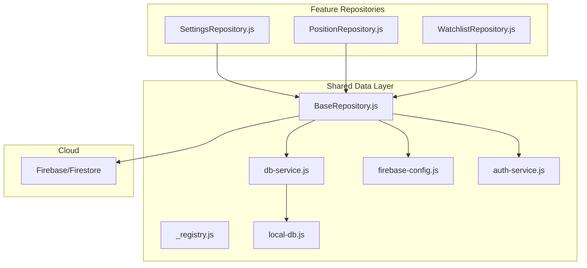
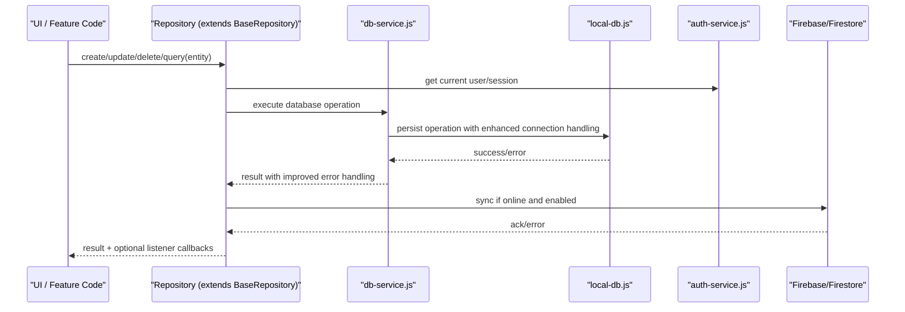
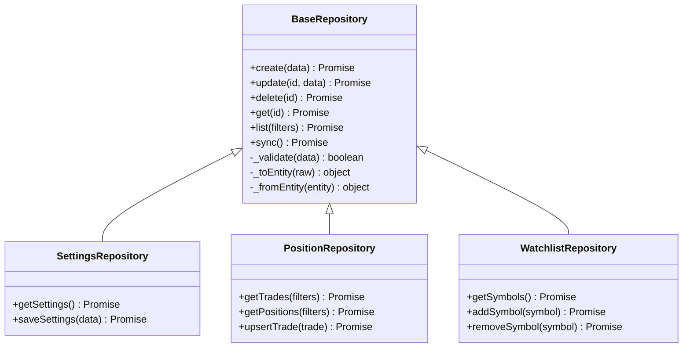
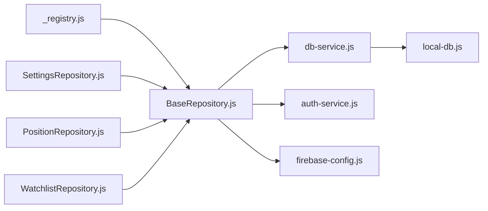
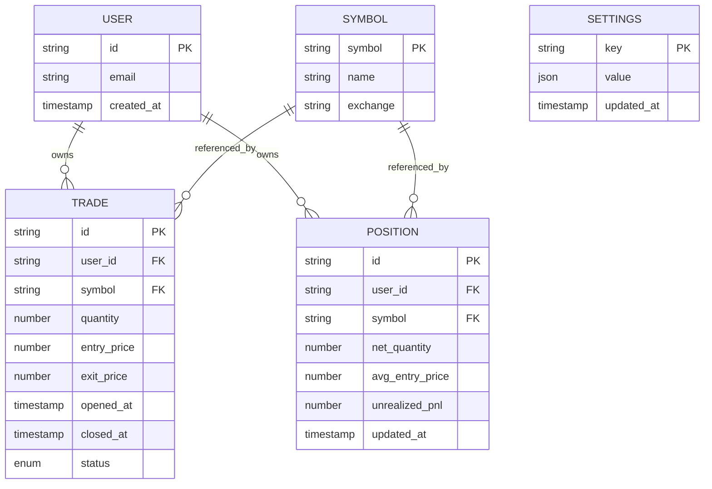

# Data Layer & Database

<cite>
**Referenced Files in This Document**
- [BaseRepository.js](file://shared/db/BaseRepository.js)
- [_registry.js](file://shared/db/_registry.js)
- [auth-service.js](file://shared/db/auth-service.js)
- [db-service.js](file://shared/db/db-service.js)
- [firebase-config.js](file://shared/db/firebase-config.js)
- [local-db.js](file://shared/db/local-db.js)
- [SettingsRepository.js](file://features/more/SettingsRepository.js)
- [PositionRepository.js](file://features/positions/PositionRepository.js)
- [WatchlistRepository.js](file://features/watchlist/WatchlistRepository.js)
- [firestore.rules](file://firestore.rules)
</cite>

## Update Summary
**Changes Made**
- Updated database connectivity and service layer improvements section to reflect enhanced database operations and connection handling
- Enhanced db-service.js documentation with improved connection management and error handling patterns
- Updated architecture diagrams to show enhanced database service layer capabilities

## Table of Contents
1. [Introduction](#introduction)
2. [Project Structure](#project-structure)
3. [Core Components](#core-components)
4. [Architecture Overview](#architecture-overview)
5. [Detailed Component Analysis](#detailed-component-analysis)
6. [Dependency Analysis](#dependency-analysis)
7. [Performance Considerations](#performance-considerations)
8. [Troubleshooting Guide](#troubleshooting-guide)
9. [Conclusion](#conclusion)
10. [Appendices](#appendices)

## Introduction
This document describes the data layer and database architecture for MTF Monitor. It focuses on:
- The BaseRepository pattern used to abstract persistence operations
- Local storage via IndexedDB through a dedicated service
- Cloud integration with Firebase (Firestore)
- Entity relationships for trades, positions, symbols, users, and settings
- Data access patterns, caching strategies, and synchronization between local and cloud
- Authentication service integration, security rules, and validation
- Data lifecycle management, backup/restore, and offline-first approach
- Guidance for extending the data layer with new entities and repositories

## Project Structure
The data layer is organized under shared/db with repository implementations per feature. Key areas:
- shared/db: Core abstractions, IndexedDB wrapper, Firebase configuration, authentication service, and registry
- features/*/Repositories: Feature-scoped repositories implementing domain-specific CRUD and sync logic

**Diagram sources**
- [BaseRepository.js](file://shared/db/BaseRepository.js)
- [_registry.js](file://shared/db/_registry.js)
- [db-service.js](file://shared/db/db-service.js)
- [local-db.js](file://shared/db/local-db.js)
- [firebase-config.js](file://shared/db/firebase-config.js)
- [auth-service.js](file://shared/db/auth-service.js)
- [SettingsRepository.js](file://features/more/SettingsRepository.js)
- [PositionRepository.js](file://features/positions/PositionRepository.js)
- [WatchlistRepository.js](file://features/watchlist/WatchlistRepository.js)

**Section sources**
- [BaseRepository.js](file://shared/db/BaseRepository.js)
- [db-service.js](file://shared/db/db-service.js)
- [local-db.js](file://shared/db/local-db.js)
- [firebase-config.js](file://shared/db/firebase-config.js)
- [auth-service.js](file://shared/db/auth-service.js)
- [SettingsRepository.js](file://features/more/SettingsRepository.js)
- [PositionRepository.js](file://features/positions/PositionRepository.js)
- [WatchlistRepository.js](file://features/watchlist/WatchlistRepository.js)

## Core Components
- BaseRepository: Provides common CRUD operations, query helpers, and optional sync hooks for cloud integration. Repositories extend this base to implement entity-specific behavior.
- db-service: Orchestrates persistence calls, including IndexedDB interactions and any higher-level orchestration. **Updated** Enhanced with improved database connectivity and connection handling mechanisms.
- local-db: Wraps IndexedDB APIs for schema initialization, transactions, and queries.
- firebase-config: Initializes and configures Firebase services for Firestore and Auth.
- auth-service: Manages user sessions, identity state, and provides authenticated context to repositories.
- Repository Registry: Centralizes registration and lookup of repositories for dependency injection or global access.

Key responsibilities:
- Encapsulation of persistence details behind repository interfaces
- Consistent error handling and logging
- Optional cloud sync triggers based on write operations
- Offline-first reads from IndexedDB with background updates when online
- **Enhanced** Improved connection management and database operation reliability

**Section sources**
- [BaseRepository.js](file://shared/db/BaseRepository.js)
- [db-service.js](file://shared/db/db-service.js)
- [local-db.js](file://shared/db/local-db.js)
- [firebase-config.js](file://shared/db/firebase-config.js)
- [auth-service.js](file://shared/db/auth-service.js)
- [_registry.js](file://shared/db/_registry.js)

## Architecture Overview
The system follows an offline-first design:
- All writes are persisted locally first
- Background synchronization pushes changes to Firestore when available
- Reads prefer local IndexedDB; real-time listeners can be attached to Firestore for live updates
- Authentication context gates access to protected resources and determines sync scope
- **Enhanced** Improved database connectivity handling ensures reliable operations across network conditions

**Diagram sources**
- [BaseRepository.js](file://shared/db/BaseRepository.js)
- [db-service.js](file://shared/db/db-service.js)
- [local-db.js](file://shared/db/local-db.js)
- [auth-service.js](file://shared/db/auth-service.js)
- [firebase-config.js](file://shared/db/firebase-config.js)

## Detailed Component Analysis

### BaseRepository Pattern
Responsibilities:
- Standardized methods for create, read, update, delete, and list
- Query builder utilities for filtering and sorting
- Optional sync hooks that trigger cloud operations after successful local writes
- Error normalization and retry/backoff policies where applicable

Design considerations:
- Single responsibility: each repository extends BaseRepository and implements entity-specific fields and validations
- Dependency injection-friendly: accepts db-service and auth-service instances
- Extensibility: hook points for pre/post operations and custom sync strategies

**Diagram sources**
- [BaseRepository.js](file://shared/db/BaseRepository.js)
- [SettingsRepository.js](file://features/more/SettingsRepository.js)
- [PositionRepository.js](file://features/positions/PositionRepository.js)
- [WatchlistRepository.js](file://features/watchlist/WatchlistRepository.js)

**Section sources**
- [BaseRepository.js](file://shared/db/BaseRepository.js)
- [SettingsRepository.js](file://features/more/SettingsRepository.js)
- [PositionRepository.js](file://features/positions/PositionRepository.js)
- [WatchlistRepository.js](file://features/watchlist/WatchlistRepository.js)

### Enhanced Database Service Layer
**Updated** The db-service has been enhanced with improved database connectivity and connection handling mechanisms:

Key improvements:
- Enhanced connection pooling and management for better resource utilization
- Improved error handling and retry mechanisms for database operations
- Better connection state monitoring and automatic reconnection capabilities
- Optimized transaction handling with improved rollback support
- Enhanced logging and debugging capabilities for database operations

Operational enhancements:
- Connection health checks and automatic recovery from connection failures
- Improved batch operation handling with better error isolation
- Enhanced timeout handling and connection lifecycle management
- Better memory management for long-running database operations

**Section sources**
- [db-service.js](file://shared/db/db-service.js)

### Local Storage (IndexedDB)
- local-db initializes schemas, manages stores, and exposes transactional APIs
- db-service coordinates IndexedDB calls and may batch operations with enhanced connection handling
- Offline-first reads ensure responsiveness even without network connectivity

Operational notes:
- Schema versioning and migration paths should be handled during initialization
- Transactions should wrap related writes to maintain consistency
- Indexes should be created for frequently queried fields
- **Enhanced** Improved connection resilience ensures reliable IndexedDB operations

**Section sources**
- [local-db.js](file://shared/db/local-db.js)
- [db-service.js](file://shared/db/db-service.js)

### Firebase Cloud Integration
- firebase-config sets up Firebase app and Firestore instance
- Repositories use auth-service to determine user context and scope data accordingly
- Sync strategy:
  - Write-through: persist locally then push to Firestore
  - Conflict resolution: last-write-wins or custom merge policy
  - Real-time listeners: attach to collections for live updates

Security:
- firestore.rules enforce user-scoped access and validate payloads at the server level

**Section sources**
- [firebase-config.js](file://shared/db/firebase-config.js)
- [auth-service.js](file://shared/db/auth-service.js)
- [firestore.rules](file://firestore.rules)

### Authentication Service Integration
- auth-service provides current user identity and session state
- Repositories check auth state before performing operations that require user context
- Unauthenticated flows fall back to anonymous or guest modes if supported by rules

**Section sources**
- [auth-service.js](file://shared/db/auth-service.js)

### Repository Implementations

#### SettingsRepository
- Manages application-wide settings
- Typically singleton-like configuration persisted locally and optionally synced to cloud
- Exposes getters/setters for key-value pairs or structured settings objects

**Section sources**
- [SettingsRepository.js](file://features/more/SettingsRepository.js)

#### PositionRepository
- Handles trades and positions
- Methods include listing trades with filters, retrieving positions, and upserting trade records
- May compute derived position aggregates from underlying trades

**Section sources**
- [PositionRepository.js](file://features/positions/PositionRepository.js)

#### WatchlistRepository
- Manages watchlist symbols
- Supports add/remove/list operations
- May integrate with external price feeds outside the scope of this document

**Section sources**
- [WatchlistRepository.js](file://features/watchlist/WatchlistRepository.js)

## Dependency Analysis
High-level dependencies among data layer components:

**Diagram sources**
- [_registry.js](file://shared/db/_registry.js)
- [BaseRepository.js](file://shared/db/BaseRepository.js)
- [db-service.js](file://shared/db/db-service.js)
- [local-db.js](file://shared/db/local-db.js)
- [auth-service.js](file://shared/db/auth-service.js)
- [firebase-config.js](file://shared/db/firebase-config.js)
- [SettingsRepository.js](file://features/more/SettingsRepository.js)
- [PositionRepository.js](file://features/positions/PositionRepository.js)
- [WatchlistRepository.js](file://features/watchlist/WatchlistRepository.js)

**Section sources**
- [_registry.js](file://shared/db/_registry.js)
- [BaseRepository.js](file://shared/db/BaseRepository.js)
- [db-service.js](file://shared/db/db-service.js)
- [local-db.js](file://shared/db/local-db.js)
- [auth-service.js](file://shared/db/auth-service.js)
- [firebase-config.js](file://shared/db/firebase-config.js)
- [SettingsRepository.js](file://features/more/SettingsRepository.js)
- [PositionRepository.js](file://features/positions/PositionRepository.js)
- [WatchlistRepository.js](file://features/watchlist/WatchlistRepository.js)

## Performance Considerations
- Prefer local reads from IndexedDB; attach Firestore listeners only when needed
- Use indexes on frequently filtered fields in both IndexedDB and Firestore
- Batch writes where possible to reduce transaction overhead
- Debounce frequent updates (e.g., streaming prices) before syncing to cloud
- Cache computed aggregates (e.g., positions) and invalidate on relevant trade updates
- **Enhanced** Leverage improved connection pooling and error handling in db-service for better performance under load

## Troubleshooting Guide
Common issues and resolutions:
- IndexedDB initialization failures: verify schema versions and store names; clear storage if necessary
- Sync errors: inspect auth state and Firestore rules; retry with exponential backoff
- Validation errors: ensure client-side validation aligns with server-side rules
- Offline behavior: confirm fallback to local-only mode and queued sync when online
- **Enhanced** Database connectivity issues: check connection pool status and retry mechanisms in db-service

Validation and security:
- Enforce consistent field types and constraints in repositories
- Mirror critical validations in Firestore rules to prevent invalid writes

**Section sources**
- [auth-service.js](file://shared/db/auth-service.js)
- [firestore.rules](file://firestore.rules)
- [db-service.js](file://shared/db/db-service.js)

## Conclusion
MTF Monitor's data layer combines a clean BaseRepository abstraction with robust local storage and optional cloud sync. **Enhanced** Recent improvements to the database service layer provide better connection handling, improved error resilience, and more reliable database operations. This design supports offline-first usage, predictable performance, and extensibility for new entities and features. By adhering to the patterns described here, teams can safely evolve the data model while maintaining consistency across local and cloud storage.

## Appendices

### Data Model and Relationships
Conceptual entities and relationships:
- User: represents authenticated users
- Symbol: tradable instrument identifiers
- Trade: individual execution records
- Position: aggregated exposure derived from trades
- Settings: application configuration

### Sample Data Structures
Representative shapes for core entities:
- User: identifier, email, timestamps
- Symbol: symbol, display name, exchange
- Trade: unique id, user reference, symbol reference, quantities, prices, timestamps, status
- Position: unique id, user/symbol references, aggregated metrics, last updated time
- Settings: key-value pairs with metadata

### Synchronization Mechanisms
- Write path: local IndexedDB first, then async push to Firestore
- Read path: serve from IndexedDB; optionally subscribe to Firestore for live updates
- Conflict resolution: define deterministic strategy (e.g., last-write-wins) and apply consistently
- Backpressure: queue operations and throttle sync frequency under high load
- **Enhanced** Improved connection handling ensures reliable synchronization even under poor network conditions

### Security Rules and Validation
- Use auth-service to derive user context and scope data by user_id
- Apply Firestore rules to restrict access to authenticated users' own data
- Validate inputs at repository level and mirror essential constraints in rules

**Section sources**
- [auth-service.js](file://shared/db/auth-service.js)
- [firestore.rules](file://firestore.rules)

### Backup and Restore
- Export local IndexedDB stores periodically for backup
- Import backed-up JSON into IndexedDB to restore state
- Optionally reconcile with Firestore to resolve conflicts post-restore

### Migration Procedures
- Version IndexedDB schema and run migrations on upgrade
- For Firestore, perform server-side transforms or batch jobs for large restructures
- Maintain backward compatibility in repositories until all clients migrate

### Extending the Data Layer
Steps to add a new entity and repository:
1. Define entity shape and validation rules
2. Create a new repository extending BaseRepository
3. Add IndexedDB store/index definitions in local-db
4. Implement Firestore collection mapping and rules
5. Wire repository into the registry for DI
6. Add tests for CRUD and sync behaviors
7. **Enhanced** Test database connectivity and connection handling scenarios

**Section sources**
- [BaseRepository.js](file://shared/db/BaseRepository.js)
- [_registry.js](file://shared/db/_registry.js)
- [local-db.js](file://shared/db/local-db.js)
- [firebase-config.js](file://shared/db/firebase-config.js)
- [auth-service.js](file://shared/db/auth-service.js)
- [firestore.rules](file://firestore.rules)
- [db-service.js](file://shared/db/db-service.js)