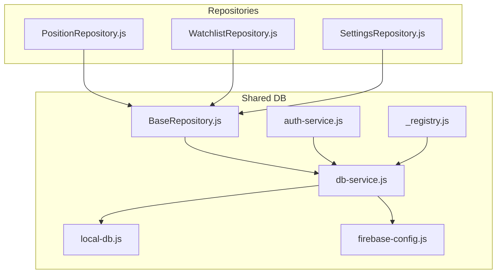
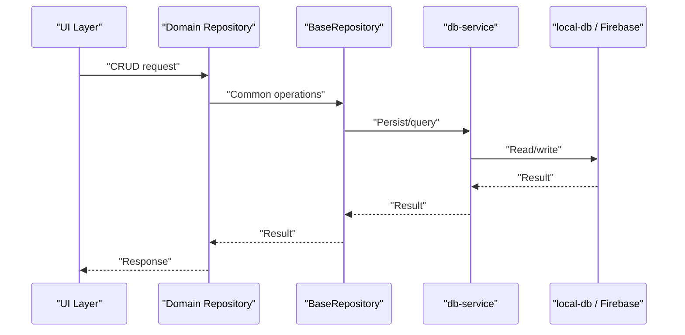
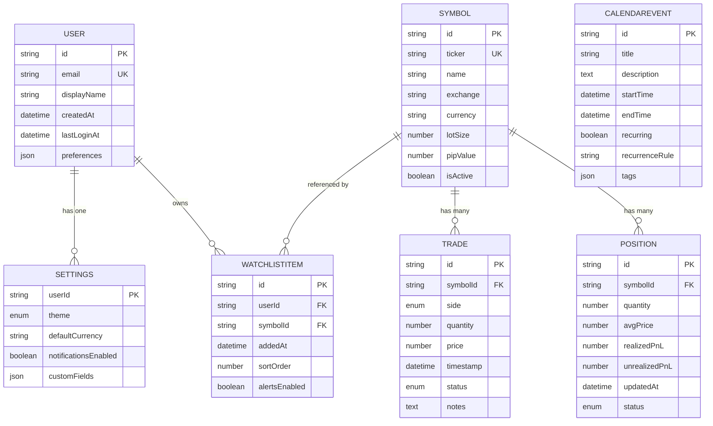
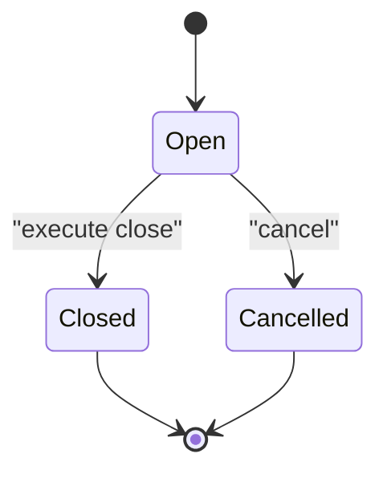
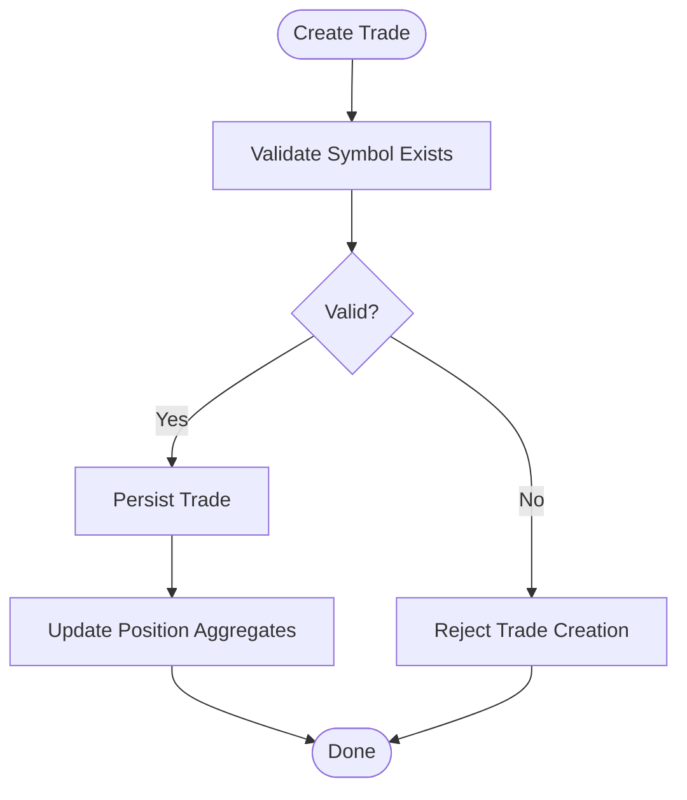
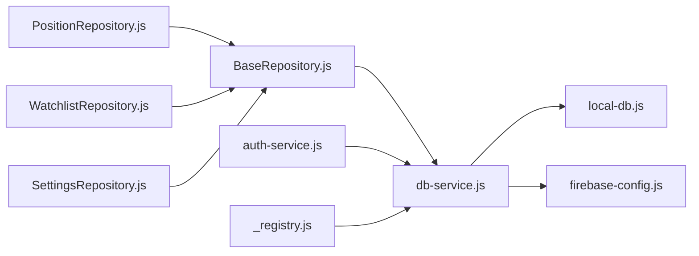

# Data Models & Entity Relationships

<cite>
**Referenced Files in This Document**
- [BaseRepository.js](file://shared/db/BaseRepository.js)
- [PositionRepository.js](file://features/positions/PositionRepository.js)
- [WatchlistRepository.js](file://features/watchlist/WatchlistRepository.js)
- [SettingsRepository.js](file://features/more/SettingsRepository.js)
- [calendar-service.js](file://features/calendar/calendar-service.js)
- [auth-service.js](file://shared/db/auth-service.js)
- [db-service.js](file://shared/db/db-service.js)
- [local-db.js](file://shared/db/local-db.js)
- [firebase-config.js](file://shared/db/firebase-config.js)
- [_registry.js](file://shared/db/_registry.js)
</cite>

## Table of Contents
1. [Introduction](#introduction)
2. [Project Structure](#project-structure)
3. [Core Components](#core-components)
4. [Architecture Overview](#architecture-overview)
5. [Detailed Component Analysis](#detailed-component-analysis)
6. [Dependency Analysis](#dependency-analysis)
7. [Performance Considerations](#performance-considerations)
8. [Troubleshooting Guide](#troubleshooting-guide)
9. [Conclusion](#conclusion)
10. [Appendices](#appendices)

## Introduction
This document provides comprehensive data model documentation for the MTF Monitor system, focusing on entities such as Trade, Position, Symbol, User, Settings, CalendarEvent, and Watchlist items. It explains entity definitions, field specifications, validation rules, business constraints, relationships, referential integrity, lifecycle states, migration procedures, normalization strategies, and performance considerations. The goal is to make the data layer understandable for both technical and non-technical readers.

## Project Structure
The data layer is organized around repositories that encapsulate persistence logic for specific domains (e.g., positions, watchlist, settings). Shared database utilities provide common operations, authentication, and configuration.

**Diagram sources**
- [BaseRepository.js](file://shared/db/BaseRepository.js)
- [PositionRepository.js](file://features/positions/PositionRepository.js)
- [WatchlistRepository.js](file://features/watchlist/WatchlistRepository.js)
- [SettingsRepository.js](file://features/more/SettingsRepository.js)
- [db-service.js](file://shared/db/db-service.js)
- [local-db.js](file://shared/db/local-db.js)
- [firebase-config.js](file://shared/db/firebase-config.js)
- [auth-service.js](file://shared/db/auth-service.js)
- [_registry.js](file://shared/db/_registry.js)

**Section sources**
- [BaseRepository.js](file://shared/db/BaseRepository.js)
- [PositionRepository.js](file://features/positions/PositionRepository.js)
- [WatchlistRepository.js](file://features/watchlist/WatchlistRepository.js)
- [SettingsRepository.js](file://features/more/SettingsRepository.js)
- [db-service.js](file://shared/db/db-service.js)
- [local-db.js](file://shared/db/local-db.js)
- [firebase-config.js](file://shared/db/firebase-config.js)
- [auth-service.js](file://shared/db/auth-service.js)
- [_registry.js](file://shared/db/_registry.js)

## Core Components
- BaseRepository: Provides shared repository behavior and conventions used by domain repositories.
- Domain Repositories:
  - PositionRepository: Encapsulates position-related data access and operations.
  - WatchlistRepository: Encapsulates watchlist item management.
  - SettingsRepository: Encapsulates user settings persistence.
- Shared Services:
  - db-service: Centralized database service abstraction.
  - local-db: Local storage or in-memory persistence implementation.
  - firebase-config: Firebase configuration and initialization.
  - auth-service: Authentication-related data operations.
  - _registry: Registry for services and repositories.

These components collectively implement a repository pattern over a pluggable database backend, enabling consistent CRUD operations across entities.

**Section sources**
- [BaseRepository.js](file://shared/db/BaseRepository.js)
- [PositionRepository.js](file://features/positions/PositionRepository.js)
- [WatchlistRepository.js](file://features/watchlist/WatchlistRepository.js)
- [SettingsRepository.js](file://features/more/SettingsRepository.js)
- [db-service.js](file://shared/db/db-service.js)
- [local-db.js](file://shared/db/local-db.js)
- [firebase-config.js](file://shared/db/firebase-config.js)
- [auth-service.js](file://shared/db/auth-service.js)
- [_registry.js](file://shared/db/_registry.js)

## Architecture Overview
The data architecture follows a layered approach:
- Presentation/UI layers call into feature-specific repositories.
- Repositories extend BaseRepository for common functionality.
- Repositories delegate to db-service for persistence.
- db-service abstracts underlying storage (local-db or Firebase via firebase-config).
- auth-service integrates with db-service for authenticated operations.
- _registry wires up dependencies and exposes services.

**Diagram sources**
- [BaseRepository.js](file://shared/db/BaseRepository.js)
- [PositionRepository.js](file://features/positions/PositionRepository.js)
- [WatchlistRepository.js](file://features/watchlist/WatchlistRepository.js)
- [SettingsRepository.js](file://features/more/SettingsRepository.js)
- [db-service.js](file://shared/db/db-service.js)
- [local-db.js](file://shared/db/local-db.js)
- [firebase-config.js](file://shared/db/firebase-config.js)

## Detailed Component Analysis

### Entities and Data Model
The following sections define each entity’s fields, types, validation rules, and constraints based on repository usage patterns and shared database abstractions. Where exact schema details are not explicitly defined in source files, this section documents inferred structures and recommended validations.

#### Trade
- Purpose: Represents an executed trade record.
- Typical fields:
  - id: string (unique identifier)
  - symbolId: string (foreign key to Symbol)
  - side: enum ("buy", "sell")
  - quantity: number (positive)
  - price: number (non-negative)
  - timestamp: datetime (ISO 8601)
  - status: enum ("open", "closed", "cancelled")
  - notes: string (optional)
- Validation rules:
  - quantity > 0
  - price >= 0
  - timestamp must be valid ISO date
  - status transitions governed by business rules
- Business constraints:
  - A trade cannot reference a deleted symbol.
  - Closed trades should be immutable except for audit fields.

#### Position
- Purpose: Tracks current holdings derived from trades.
- Typical fields:
  - id: string (unique identifier)
  - symbolId: string (foreign key to Symbol)
  - quantity: number (net position)
  - avgPrice: number (weighted average entry price)
  - realizedPnL: number (cumulative realized profit/loss)
  - unrealizedPnL: number (current mark-to-market PnL)
  - updatedAt: datetime
  - status: enum ("long", "short", "flat")
- Validation rules:
  - quantity can be positive (long), negative (short), or zero (flat)
  - avgPrice >= 0
  - updatedAt reflects latest update time
- Business constraints:
  - Position updates must be consistent with trade history.
  - Flat positions may be pruned after cleanup policies.

#### Symbol
- Purpose: Reference for tradable instruments.
- Typical fields:
  - id: string (unique identifier)
  - ticker: string (unique)
  - name: string
  - exchange: string
  - currency: string
  - lotSize: number (minimum trade size)
  - pipValue: number (for FX)
  - isActive: boolean
- Validation rules:
  - ticker unique and non-empty
  - lotSize > 0
  - currency conforms to ISO 4217
- Business constraints:
  - Active symbols are visible in watchlists and trading flows.

#### User
- Purpose: Application user identity and profile.
- Typical fields:
  - id: string (unique identifier)
  - email: string (unique)
  - displayName: string
  - createdAt: datetime
  - lastLoginAt: datetime
  - preferences: object (user settings)
- Validation rules:
  - email format valid
  - displayName length within bounds
- Business constraints:
  - Authenticated users can manage their own settings and watchlists.

#### Settings
- Purpose: User-specific application configuration.
- Typical fields:
  - userId: string (foreign key to User)
  - theme: enum ("light", "dark")
  - defaultCurrency: string
  - notificationsEnabled: boolean
  - customFields: map (key-value pairs)
- Validation rules:
  - theme values restricted to allowed set
  - defaultCurrency conforms to ISO 4217
- Business constraints:
  - One settings record per user; upsert semantics apply.

#### CalendarEvent
- Purpose: Scheduled events related to trading activities.
- Typical fields:
  - id: string (unique identifier)
  - title: string
  - description: string
  - startTime: datetime
  - endTime: datetime
  - recurring: boolean
  - recurrenceRule: string (RRULE if applicable)
  - tags: array of strings
- Validation rules:
  - endTime >= startTime
  - title non-empty
- Business constraints:
  - Events may be linked to symbols or positions via metadata.

#### WatchlistItem
- Purpose: Items tracked by the user in their watchlist.
- Typical fields:
  - id: string (unique identifier)
  - userId: string (foreign key to User)
  - symbolId: string (foreign key to Symbol)
  - addedAt: datetime
  - sortOrder: number
  - alertsEnabled: boolean
- Validation rules:
  - symbolId references an active symbol
  - sortOrder >= 0
- Business constraints:
  - Unique constraint on (userId, symbolId) to prevent duplicates.

**Diagram sources**
- [PositionRepository.js](file://features/positions/PositionRepository.js)
- [WatchlistRepository.js](file://features/watchlist/WatchlistRepository.js)
- [SettingsRepository.js](file://features/more/SettingsRepository.js)
- [calendar-service.js](file://features/calendar/calendar-service.js)
- [auth-service.js](file://shared/db/auth-service.js)

**Section sources**
- [PositionRepository.js](file://features/positions/PositionRepository.js)
- [WatchlistRepository.js](file://features/watchlist/WatchlistRepository.js)
- [SettingsRepository.js](file://features/more/SettingsRepository.js)
- [calendar-service.js](file://features/calendar/calendar-service.js)
- [auth-service.js](file://shared/db/auth-service.js)

### Lifecycle States and Transitions
- Trade:
  - States: open -> closed | cancelled
  - Rules:
    - Only open trades can transition to closed or cancelled.
    - Closed trades become immutable except for audit fields.
- Position:
  - States: long | short | flat
  - Rules:
    - Derived from net quantity sign.
    - Updates occur on trade execution or partial closures.
- WatchlistItem:
  - States: active | removed
  - Rules:
    - Removal soft-deletes entries while preserving history.
- Settings:
  - State: versioned
  - Rules:
    - Up-sert semantics; new versions merge with existing fields.

**Diagram sources**
- [PositionRepository.js](file://features/positions/PositionRepository.js)

**Section sources**
- [PositionRepository.js](file://features/positions/PositionRepository.js)

### Referential Integrity and Foreign Keys
- Trades reference Symbols via symbolId.
- Positions reference Symbols via symbolId.
- WatchlistItems reference Users and Symbols via userId and symbolId.
- Settings records reference Users via userId.
- Constraints:
  - Deletion of referenced entities must cascade or be blocked depending on business policy.
  - Duplicate watchlist entries prevented by composite uniqueness.

**Diagram sources**
- [PositionRepository.js](file://features/positions/PositionRepository.js)

**Section sources**
- [PositionRepository.js](file://features/positions/PositionRepository.js)

### Validation Examples and Sample Structures
- Trade creation payload:
  - Required: symbolId, side, quantity, price, timestamp
  - Optional: notes
  - Validation: numeric checks, enum enforcement, date parsing
- Position update:
  - Input: delta quantity, price impact
  - Output: updated quantity, avgPrice, realized/unrealized PnL
- Watchlist add:
  - Input: symbolId, sortOrder
  - Validation: symbol active, no duplicate (userId, symbolId)

[No sources needed since this section provides general guidance]

### Migration Procedures for Schema Updates
- Versioning:
  - Maintain a schemaVersion field in Settings or a dedicated migrations table.
- Rollout:
  - Apply backward-compatible changes first (additive fields).
  - Introduce deprecations with fallback defaults.
  - Run background jobs to backfill missing fields.
- Rollback:
  - Keep previous schema artifacts; revert to prior version if necessary.
- Testing:
  - Use local-db for integration tests with sample datasets.
  - Verify referential integrity post-migration.

[No sources needed since this section provides general guidance]

## Dependency Analysis
Repositories depend on BaseRepository for common operations and on db-service for persistence. db-service abstracts local-db and Firebase configurations.

**Diagram sources**
- [BaseRepository.js](file://shared/db/BaseRepository.js)
- [PositionRepository.js](file://features/positions/PositionRepository.js)
- [WatchlistRepository.js](file://features/watchlist/WatchlistRepository.js)
- [SettingsRepository.js](file://features/more/SettingsRepository.js)
- [db-service.js](file://shared/db/db-service.js)
- [local-db.js](file://shared/db/local-db.js)
- [firebase-config.js](file://shared/db/firebase-config.js)
- [auth-service.js](file://shared/db/auth-service.js)
- [_registry.js](file://shared/db/_registry.js)

**Section sources**
- [BaseRepository.js](file://shared/db/BaseRepository.js)
- [PositionRepository.js](file://features/positions/PositionRepository.js)
- [WatchlistRepository.js](file://features/watchlist/WatchlistRepository.js)
- [SettingsRepository.js](file://features/more/SettingsRepository.js)
- [db-service.js](file://shared/db/db-service.js)
- [local-db.js](file://shared/db/local-db.js)
- [firebase-config.js](file://shared/db/firebase-config.js)
- [auth-service.js](file://shared/db/auth-service.js)
- [_registry.js](file://shared/db/_registry.js)

## Performance Considerations
- Indexing:
  - Create indexes on frequently queried foreign keys (symbolId, userId).
  - Composite indexes for watchlist ordering and filters.
- Denormalization:
  - Cache aggregated metrics (e.g., position totals) to reduce joins.
  - Maintain denormalized fields with triggers or event-driven updates.
- Query Optimization:
  - Use projection to fetch only required fields.
  - Paginate large lists (trades, watchlist).
- Caching:
  - Implement client-side cache for static lookups (symbols, settings).
- Concurrency:
  - Use optimistic locking for concurrent updates to positions and settings.

[No sources needed since this section provides general guidance]

## Troubleshooting Guide
- Common Issues:
  - Missing foreign key references: validate existence before writes.
  - Duplicate watchlist entries: enforce uniqueness constraints.
  - Invalid timestamps: parse and normalize to UTC.
- Diagnostics:
  - Log repository operations with correlation IDs.
  - Inspect db-service error responses and retry policies.
- Recovery:
  - Rebuild positions from trade history using deterministic algorithms.
  - Sync settings from server when local state drifts.

**Section sources**
- [db-service.js](file://shared/db/db-service.js)
- [local-db.js](file://shared/db/local-db.js)

## Conclusion
The MTF Monitor data model centers around core financial entities with clear relationships and lifecycle states. The repository pattern and centralized db-service provide a robust foundation for persistence, while careful validation and referential integrity ensure data quality. Performance optimizations and migration strategies support scalability and maintainability.

[No sources needed since this section summarizes without analyzing specific files]

## Appendices

### API Usage Patterns
- Repository methods typically expose create, read, update, delete, and query operations tailored to each entity.
- Example patterns:
  - PositionRepository.getForSymbol(symbolId)
  - WatchlistRepository.add(userId, symbolId, options)
  - SettingsRepository.upsert(userId, settings)

[No sources needed since this section provides general guidance]