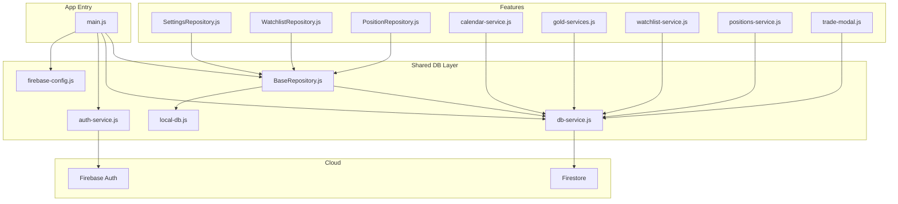
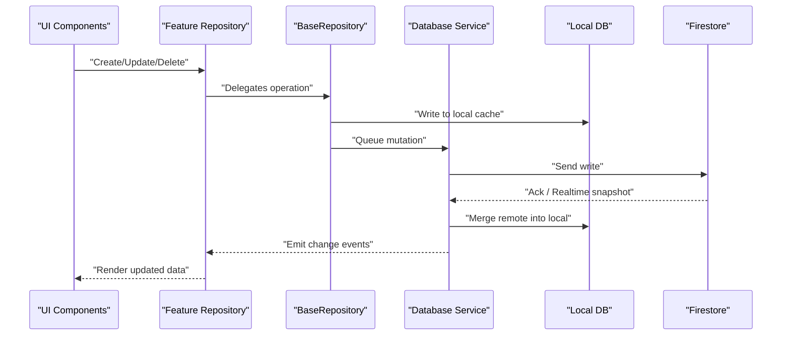
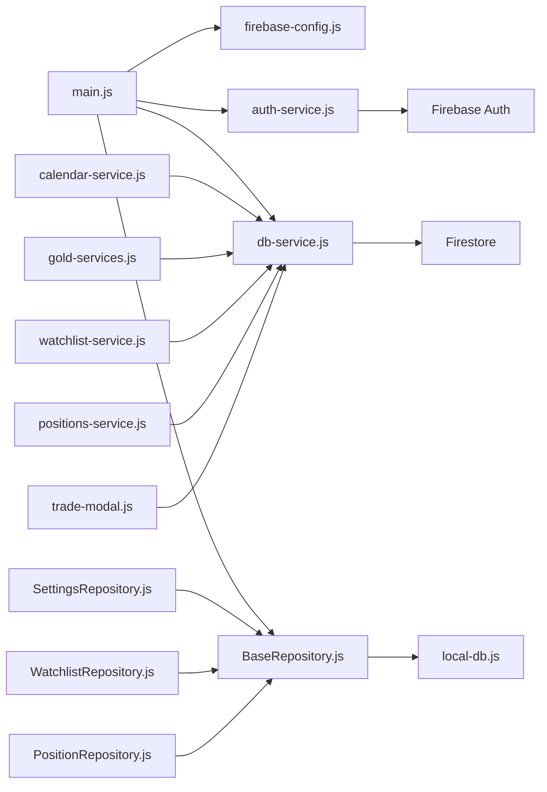

# Firebase Cloud Integration

<cite>
**Referenced Files in This Document**
- [firebase-config.js](file://shared/db/firebase-config.js)
- [auth-service.js](file://shared/db/auth-service.js)
- [db-service.js](file://shared/db/db-service.js)
- [local-db.js](file://shared/db/local-db.js)
- [BaseRepository.js](file://shared/db/BaseRepository.js)
- [firestore.rules](file://firestore.rules)
- [SettingsRepository.js](file://features/more/SettingsRepository.js)
- [WatchlistRepository.js](file://features/watchlist/WatchlistRepository.js)
- [PositionRepository.js](file://features/positions/PositionRepository.js)
- [calendar-service.js](file://features/calendar/calendar-service.js)
- [gold-services.js](file://features/gold/gold-services.js)
- [watchlist-service.js](file://features/watchlist/watchlist-service.js)
- [positions-service.js](file://features/positions/positions-service.js)
- [trade-modal.js](file://features/common/trade-modal.js)
- [main.js](file://main.js)
</cite>

## Table of Contents
1. [Introduction](#introduction)
2. [Project Structure](#project-structure)
3. [Core Components](#core-components)
4. [Architecture Overview](#architecture-overview)
5. [Detailed Component Analysis](#detailed-component-analysis)
6. [Dependency Analysis](#dependency-analysis)
7. [Performance Considerations](#performance-considerations)
8. [Troubleshooting Guide](#troubleshooting-guide)
9. [Conclusion](#conclusion)
10. [Appendices](#appendices)

## Introduction
This document explains how the application integrates with Firebase for authentication, real-time data synchronization, and security rules. It covers configuration, environment variable management, authentication flows, Firestore structure, listeners, sync strategies between local and cloud storage, and error handling for network failures and offline queueing. It also provides concrete examples for syncing trades, positions, and user preferences.

## Project Structure
The Firebase integration is centered under shared/db and is consumed by feature repositories and services:
- Configuration and initialization: firebase-config.js
- Authentication service: auth-service.js
- Database abstraction and listeners: db-service.js
- Local persistence layer: local-db.js
- Repository base class: BaseRepository.js
- Security rules: firestore.rules
- Feature-level repositories and services that use the above abstractions

**Diagram sources**
- [main.js](file://main.js)
- [firebase-config.js](file://shared/db/firebase-config.js)
- [auth-service.js](file://shared/db/auth-service.js)
- [db-service.js](file://shared/db/db-service.js)
- [local-db.js](file://shared/db/local-db.js)
- [BaseRepository.js](file://shared/db/BaseRepository.js)
- [SettingsRepository.js](file://features/more/SettingsRepository.js)
- [WatchlistRepository.js](file://features/watchlist/WatchlistRepository.js)
- [PositionRepository.js](file://features/positions/PositionRepository.js)
- [calendar-service.js](file://features/calendar/calendar-service.js)
- [gold-services.js](file://features/gold/gold-services.js)
- [watchlist-service.js](file://features/watchlist/watchlist-service.js)
- [positions-service.js](file://features/positions/positions-service.js)
- [trade-modal.js](file://features/common/trade-modal.js)

**Section sources**
- [firebase-config.js](file://shared/db/firebase-config.js)
- [auth-service.js](file://shared/db/auth-service.js)
- [db-service.js](file://shared/db/db-service.js)
- [local-db.js](file://shared/db/local-db.js)
- [BaseRepository.js](file://shared/db/BaseRepository.js)
- [SettingsRepository.js](file://features/more/SettingsRepository.js)
- [WatchlistRepository.js](file://features/watchlist/WatchlistRepository.js)
- [PositionRepository.js](file://features/positions/PositionRepository.js)
- [calendar-service.js](file://features/calendar/calendar-service.js)
- [gold-services.js](file://features/gold/gold-services.js)
- [watchlist-service.js](file://features/watchlist/watchlist-service.js)
- [positions-service.js](file://features/positions/positions-service.js)
- [trade-modal.js](file://features/common/trade-modal.js)
- [main.js](file://main.js)

## Core Components
- Firebase configuration: Initializes the Firebase app using environment variables and exposes a configured client instance to other modules.
- Authentication service: Provides user registration, login, logout, session state, and role-based access control helpers.
- Database service: Wraps Firestore operations, including writes, reads, and real-time listeners; coordinates with local storage for offline-first behavior.
- Local database: A lightweight local store used for caching and offline queuing.
- Base repository: Common repository logic for CRUD, listener lifecycle, conflict resolution, and offline queueing.

Key responsibilities:
- Centralized configuration via environment variables
- Secure authentication flows with role checks
- Real-time updates with automatic local cache synchronization
- Offline-first strategy with queued mutations and conflict resolution

**Section sources**
- [firebase-config.js](file://shared/db/firebase-config.js)
- [auth-service.js](file://shared/db/auth-service.js)
- [db-service.js](file://shared/db/db-service.js)
- [local-db.js](file://shared/db/local-db.js)
- [BaseRepository.js](file://shared/db/BaseRepository.js)

## Architecture Overview
The system follows an offline-first architecture:
- UI components call feature repositories/services.
- Repositories extend BaseRepository to perform operations against both local and cloud layers.
- The database service manages Firestore listeners and persists changes locally.
- Authentication service gates access based on roles and session state.

**Diagram sources**
- [BaseRepository.js](file://shared/db/BaseRepository.js)
- [db-service.js](file://shared/db/db-service.js)
- [local-db.js](file://shared/db/local-db.js)

## Detailed Component Analysis

### Firebase Configuration
- Purpose: Initialize Firebase with project credentials from environment variables and expose a configured client.
- Environment variables:
  - apiKey, authDomain, projectId, storageBucket, messagingSenderId, appId, measurementId
- Initialization flow:
  - Read environment variables
  - Configure Firebase app
  - Export initialized instances for auth and Firestore usage

Best practices:
- Keep secrets out of source control
- Use build-time injection or secure runtime env loaders
- Validate presence of required keys before initializing

**Section sources**
- [firebase-config.js](file://shared/db/firebase-config.js)

### Authentication Service
Responsibilities:
- User registration and login
- Session management (current user, token refresh)
- Role-based access control (RBAC) helpers
- Logout and cleanup

Typical flows:
- Registration: create account, set initial profile, assign default role
- Login: authenticate credentials, retrieve token, update session
- RBAC: check current user’s role before allowing privileged actions

Security considerations:
- Enforce server-side rules in Firestore
- Validate roles on the client only as UX gating; never trust client-only checks for sensitive operations

**Section sources**
- [auth-service.js](file://shared/db/auth-service.js)

### Database Service
Responsibilities:
- Firestore read/write wrappers
- Real-time listeners setup and teardown
- Conflict resolution when merging remote snapshots with local cache
- Offline queue management for mutations

Real-time listeners:
- Subscribe to collections/documents
- Update local cache on changes
- Emit change events to subscribers

Offline queue:
- Queue mutations when offline
- Replay on reconnect
- Handle conflicts and retries

**Section sources**
- [db-service.js](file://shared/db/db-service.js)

### Local Database
Responsibilities:
- In-memory or persistent local cache
- Key-value or document-like storage
- Indexing for fast queries
- Snapshot diffing for efficient merges

Integration points:
- Used by BaseRepository to persist data immediately
- Updated by Database Service after successful cloud writes

**Section sources**
- [local-db.js](file://shared/db/local-db.js)

### Base Repository
Responsibilities:
- Shared CRUD operations
- Listener lifecycle management
- Sync strategy: local-first writes, then cloud; merge remote updates
- Error handling and retry/backoff
- Conflict resolution hooks

Common patterns:
- Batched writes
- Optimistic updates with rollback on failure
- Debounced listeners to reduce churn

**Section sources**
- [BaseRepository.js](file://shared/db/BaseRepository.js)

### Feature Repositories and Services
Examples of usage across features:
- SettingsRepository: stores user preferences, synced to Firestore
- WatchlistRepository: manages watchlist items with real-time updates
- PositionRepository: tracks trading positions and history
- CalendarService, GoldServices, WatchlistService, PositionsService: orchestrate domain-specific logic and delegate persistence to repositories

These components rely on BaseRepository and Database Service for consistent sync behavior.

**Section sources**
- [SettingsRepository.js](file://features/more/SettingsRepository.js)
- [WatchlistRepository.js](file://features/watchlist/WatchlistRepository.js)
- [PositionRepository.js](file://features/positions/PositionRepository.js)
- [calendar-service.js](file://features/calendar/calendar-service.js)
- [gold-services.js](file://features/gold/gold-services.js)
- [watchlist-service.js](file://features/watchlist/watchlist-service.js)
- [positions-service.js](file://features/positions/positions-service.js)

### Trade Modal Integration
The trade modal triggers creation/update flows that go through repositories and the database service, ensuring both local and cloud states are synchronized.

**Section sources**
- [trade-modal.js](file://features/common/trade-modal.js)

## Dependency Analysis
High-level dependencies:
- App entry initializes configuration and core services
- Feature modules depend on repositories and services
- Repositories depend on BaseRepository and Database Service
- Database Service depends on Firebase Auth and Firestore
- Local DB is used by BaseRepository for offline-first behavior

**Diagram sources**
- [main.js](file://main.js)
- [firebase-config.js](file://shared/db/firebase-config.js)
- [auth-service.js](file://shared/db/auth-service.js)
- [db-service.js](file://shared/db/db-service.js)
- [local-db.js](file://shared/db/local-db.js)
- [BaseRepository.js](file://shared/db/BaseRepository.js)
- [SettingsRepository.js](file://features/more/SettingsRepository.js)
- [WatchlistRepository.js](file://features/watchlist/WatchlistRepository.js)
- [PositionRepository.js](file://features/positions/PositionRepository.js)
- [calendar-service.js](file://features/calendar/calendar-service.js)
- [gold-services.js](file://features/gold/gold-services.js)
- [watchlist-service.js](file://features/watchlist/watchlist-service.js)
- [positions-service.js](file://features/positions/positions-service.js)
- [trade-modal.js](file://features/common/trade-modal.js)

**Section sources**
- [main.js](file://main.js)
- [firebase-config.js](file://shared/db/firebase-config.js)
- [auth-service.js](file://shared/db/auth-service.js)
- [db-service.js](file://shared/db/db-service.js)
- [local-db.js](file://shared/db/local-db.js)
- [BaseRepository.js](file://shared/db/BaseRepository.js)
- [SettingsRepository.js](file://features/more/SettingsRepository.js)
- [WatchlistRepository.js](file://features/watchlist/WatchlistRepository.js)
- [PositionRepository.js](file://features/positions/PositionRepository.js)
- [calendar-service.js](file://features/calendar/calendar-service.js)
- [gold-services.js](file://features/gold/gold-services.js)
- [watchlist-service.js](file://features/watchlist/watchlist-service.js)
- [positions-service.js](file://features/positions/positions-service.js)
- [trade-modal.js](file://features/common/trade-modal.js)

## Performance Considerations
- Prefer real-time listeners over polling to minimize bandwidth and latency.
- Debounce frequent writes and batch updates where possible.
- Use selective field updates to reduce payload size.
- Cache frequently accessed documents locally and invalidate on relevant changes.
- Implement exponential backoff for failed writes and reconnection attempts.
- Limit listener scopes to necessary documents/collections to avoid unnecessary data transfer.

[No sources needed since this section provides general guidance]

## Troubleshooting Guide
Common issues and resolutions:
- Network failures:
  - Ensure offline queue exists and replays on reconnect
  - Log and surface retry status to users
- Conflict resolution:
  - Merge remote snapshots into local cache deterministically
  - Provide conflict markers and allow manual resolution if needed
- Authentication errors:
  - Verify tokens and session state
  - Redirect to login on invalid/expired sessions
- Firestore security rule violations:
  - Review rules and ensure client requests match allowed paths and conditions

Operational tips:
- Enable verbose logging in development
- Monitor listener counts and unsubscribe when not needed
- Test offline scenarios thoroughly

**Section sources**
- [db-service.js](file://shared/db/db-service.js)
- [auth-service.js](file://shared/db/auth-service.js)
- [firestore.rules](file://firestore.rules)

## Conclusion
The application implements a robust offline-first Firebase integration with clear separation of concerns: configuration, authentication, database abstraction, and feature repositories. Real-time listeners keep the UI responsive while local caching ensures resilience. Security rules and RBAC provide layered protection. Following the patterns outlined here will help maintain consistency, performance, and reliability across features.

[No sources needed since this section summarizes without analyzing specific files]

## Appendices

### Firestore Security Rules
- Define per-collection permissions
- Enforce ownership and role checks
- Restrict writes to authenticated users with appropriate roles

**Section sources**
- [firestore.rules](file://firestore.rules)

### Environment Variables Management
- Required variables for Firebase initialization
- Recommended approach for injecting variables at build or runtime
- Validation checks before app startup

**Section sources**
- [firebase-config.js](file://shared/db/firebase-config.js)

### Example: Syncing Trades
- Create trade via trade modal
- Persist locally first, then queue write to Firestore
- Listen for trade updates and reflect changes in UI
- Handle conflicts by merging timestamps or version fields

**Section sources**
- [trade-modal.js](file://features/common/trade-modal.js)
- [db-service.js](file://shared/db/db-service.js)
- [BaseRepository.js](file://shared/db/BaseRepository.js)

### Example: Syncing Positions
- Track open and closed positions
- Use real-time listeners for live PnL updates
- Apply optimistic updates with rollback on failure

**Section sources**
- [PositionRepository.js](file://features/positions/PositionRepository.js)
- [positions-service.js](file://features/positions/positions-service.js)
- [db-service.js](file://shared/db/db-service.js)

### Example: Syncing User Preferences
- Store preferences in a user-scoped document
- Sync on change and initialize UI from local cache
- Resolve conflicts by preferring most recent edit timestamp

**Section sources**
- [SettingsRepository.js](file://features/more/SettingsRepository.js)
- [db-service.js](file://shared/db/db-service.js)