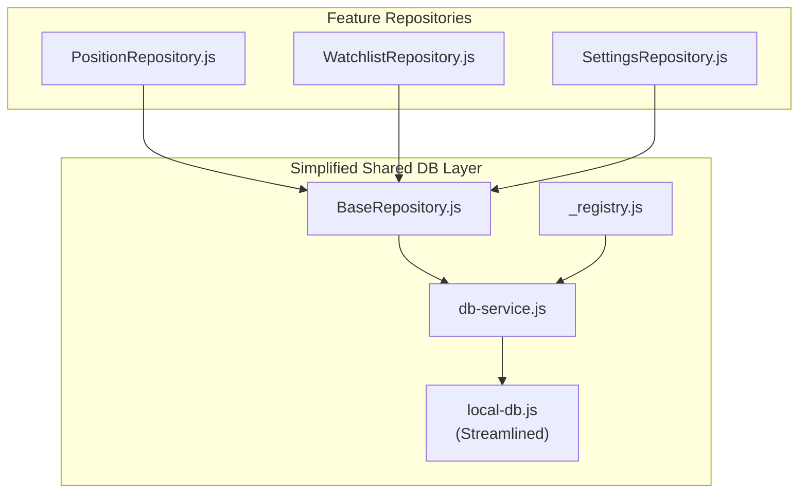
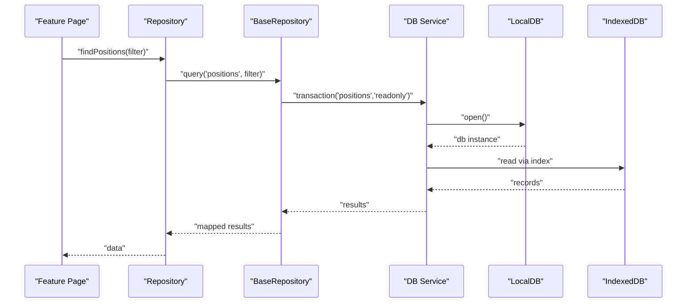
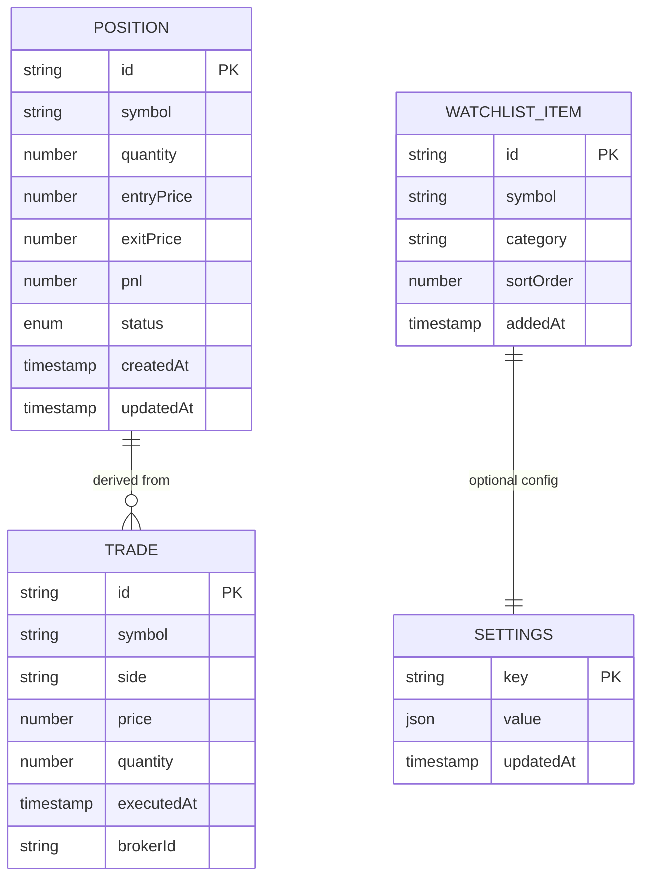
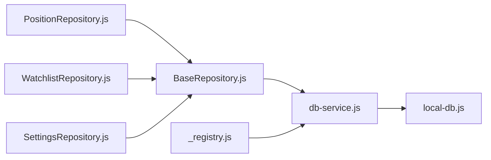

# Local Storage & IndexedDB Implementation

<cite>
**Referenced Files in This Document**
- [local-db.js](file://shared/db/local-db.js)
- [db-service.js](file://shared/db/db-service.js)
- [BaseRepository.js](file://shared/db/BaseRepository.js)
- [_registry.js](file://shared/db/_registry.js)
- [PositionRepository.js](file://features/positions/PositionRepository.js)
- [WatchlistRepository.js](file://features/watchlist/WatchlistRepository.js)
- [SettingsRepository.js](file://features/more/SettingsRepository.js)
</cite>

## Update Summary
**Changes Made**
- Updated LocalDB Service section to reflect simplified implementation after removing 66 lines of deprecated functionality
- Streamlined connection management and schema handling descriptions
- Removed references to deprecated features and complex migration procedures
- Simplified error handling and transaction management explanations
- Updated performance considerations to focus on core functionality

## Table of Contents
1. [Introduction](#introduction)
2. [Project Structure](#project-structure)
3. [Core Components](#core-components)
4. [Architecture Overview](#architecture-overview)
5. [Detailed Component Analysis](#detailed-component-analysis)
6. [Dependency Analysis](#dependency-analysis)
7. [Performance Considerations](#performance-considerations)
8. [Troubleshooting Guide](#troubleshooting-guide)
9. [Conclusion](#conclusion)
10. [Appendices](#appendices)

## Introduction
This document explains the streamlined local storage layer implemented with IndexedDB for the application. Following recent simplifications, the implementation focuses on core database operations, essential object stores, and fundamental CRUD operations. The architecture emphasizes simplicity and reliability over complex feature sets, providing reliable offline-first data persistence for trades, positions, watchlists, and settings.

## Project Structure
The local storage layer maintains its organized structure under shared/db with feature-specific repositories:
- Database core: local-db.js (simplified), db-service.js, BaseRepository.js, _registry.js
- Feature repositories: PositionRepository.js (positions), WatchlistRepository.js (watchlist), SettingsRepository.js (settings)

**Diagram sources**
- [local-db.js](file://shared/db/local-db.js)
- [db-service.js](file://shared/db/db-service.js)
- [BaseRepository.js](file://shared/db/BaseRepository.js)
- [_registry.js](file://shared/db/_registry.js)
- [PositionRepository.js](file://features/positions/PositionRepository.js)
- [WatchlistRepository.js](file://features/watchlist/WatchlistRepository.js)
- [SettingsRepository.js](file://features/more/SettingsRepository.js)

## Core Components
Following the simplification, the core components now focus on essential functionality:
- **LocalDB Service (local-db.js)**: Simplified IndexedDB initialization and basic CRUD operations
- **DB Service (db-service.js)**: Core transaction and query utilities
- **Base Repository (BaseRepository.js)**: Standardized repository pattern implementation
- **Registry (_registry.js)**: Service registration and dependency injection
- **Feature Repositories**: Entity-specific persistence logic for positions, watchlists, and settings

Key responsibilities remain focused on:
- Connection lifecycle management
- Basic transaction scoping
- Essential index-based queries
- Core error handling
- Offline-first data persistence

**Section sources**
- [local-db.js](file://shared/db/local-db.js)
- [db-service.js](file://shared/db/db-service.js)
- [BaseRepository.js](file://shared/db/BaseRepository.js)
- [_registry.js](file://shared/db/_registry.js)
- [PositionRepository.js](file://features/positions/PositionRepository.js)
- [WatchlistRepository.js](file://features/watchlist/WatchlistRepository.js)
- [SettingsRepository.js](file://features/more/SettingsRepository.js)

## Architecture Overview
The simplified architecture maintains its layered approach but with reduced complexity:
- UI features call into feature repositories
- Repositories extend BaseRepository for common operations
- BaseRepository uses DB Service for IndexedDB interactions
- DB Service delegates to simplified LocalDB for core operations

**Diagram sources**
- [PositionRepository.js](file://features/positions/PositionRepository.js)
- [BaseRepository.js](file://shared/db/BaseRepository.js)
- [db-service.js](file://shared/db/db-service.js)
- [local-db.js](file://shared/db/local-db.js)

## Detailed Component Analysis

### LocalDB Service (Simplified Schema and Connection Management)
**Updated** The LocalDB service has been significantly streamlined, removing deprecated functionality and focusing on core operations.

Responsibilities:
- Open IndexedDB with versioned database name
- Define essential object stores and indexes during upgrade
- Provide basic CRUD helper methods
- Manage connection state with simplified error handling

Core schema elements:
- Object stores: positions, trades, watchlist, settings
- Essential indexes for symbol, status, and time-based queries

Connection lifecycle:
- Initialize once per app session
- Handle schema upgrades when version increases
- Close connections appropriately

Error handling:
- Simplified try/catch wrapping
- Basic error types for not found and constraint violations

**Section sources**
- [local-db.js](file://shared/db/local-db.js)

### DB Service (Core Transactions and Async Operations)
Responsibilities:
- Create read-only and read-write transactions
- Execute basic queries using indexes
- Normalize results to domain models
- Provide essential batch operations

Transaction handling:
- Automatic commit/abort on success/error
- Basic timeout handling

Async patterns:
- Promise-based API
- Cancellable operations support

**Section sources**
- [db-service.js](file://shared/db/db-service.js)

### BaseRepository (Repository Pattern Base)
Responsibilities:
- Standardized CRUD methods: create, get, getAll, update, delete
- Query builder helpers for filters and sorting
- Transaction wrappers for consistent boundaries
- Mapping utilities for domain objects

Design principles:
- Single responsibility per repository
- Reuse common logic via inheritance
- Clear separation between persistence and business logic

**Section sources**
- [BaseRepository.js](file://shared/db/BaseRepository.js)

### Registry (Service Registration)
Responsibilities:
- Register repositories and services by name
- Resolve dependencies at runtime
- Provide singleton-like access to repositories

Usage:
- Feature pages request repositories from registry
- Ensures consistent initialization order

**Section sources**
- [_registry.js](file://shared/db/_registry.js)

### Feature Repositories (Simplified Entity Management)
**Updated** Feature repositories maintain their entity-specific responsibilities but with simplified implementations.

#### PositionRepository (Positions)
Responsibilities:
- Persist positions with essential fields: symbol, quantity, prices, timestamps
- Indexes for symbol and status queries
- Methods for current and historical positions

Example usage patterns:
- Upsert position on trade execution
- Fetch active positions filtered by symbol
- Archive closed positions by date range

**Section sources**
- [PositionRepository.js](file://features/positions/PositionRepository.js)

#### WatchlistRepository (Watchlist)
Responsibilities:
- Manage user-defined watchlists with symbols and metadata
- Indexes for symbol and category
- Methods to add/remove symbols and fetch watchlist

Example usage patterns:
- Add/remove symbols to/from watchlist
- Retrieve watchlist sorted by custom order

**Section sources**
- [WatchlistRepository.js](file://features/watchlist/WatchlistRepository.js)

#### SettingsRepository (Settings)
Responsibilities:
- Store key-value settings with JSON-safe values
- Ensure unique keys and provide defaults
- Methods to get/set multiple settings atomically

Example usage patterns:
- Save theme preference
- Load default settings if missing
- Batch update multiple settings

**Section sources**
- [SettingsRepository.js](file://features/more/SettingsRepository.js)

### Data Models Diagram

## Dependency Analysis
The following diagram illustrates the simplified component dependencies:

**Diagram sources**
- [PositionRepository.js](file://features/positions/PositionRepository.js)
- [WatchlistRepository.js](file://features/watchlist/WatchlistRepository.js)
- [SettingsRepository.js](file://features/more/SettingsRepository.js)
- [BaseRepository.js](file://shared/db/BaseRepository.js)
- [db-service.js](file://shared/db/db-service.js)
- [local-db.js](file://shared/db/local-db.js)
- [_registry.js](file://shared/db/_registry.js)

## Performance Considerations
**Updated** Performance considerations now focus on core optimization techniques due to the simplified implementation.

Essential optimization strategies:
- **Indexing strategy**: Focus on equality indexes for frequent filters (symbol, status)
- **Query optimization**: Use cursor ranges instead of fetching entire stores
- **Transaction efficiency**: Group related writes into single transactions
- **Memory management**: Stream results via cursors to avoid loading all records

Key recommendations:
- Prefer equality indexes for frequent filters
- Use cursor ranges for efficient querying
- Apply pagination and limit result sets
- Cache frequently accessed lists in memory
- Group related writes into single transactions
- Use read-only transactions for bulk reads

[No sources needed since this section provides general guidance]

## Troubleshooting Guide
**Updated** Troubleshooting guide simplified to focus on common issues with the streamlined implementation.

Common issues and resolutions:
- **Quota exceeded**: Monitor storage usage and implement pruning strategies
- **Schema mismatch**: Ensure proper version increments during upgrades
- **Transaction aborts**: Check for concurrent write conflicts
- **Slow queries**: Review indexes and adjust compound indexes

Operational tips:
- Enable verbose logging in development
- Implement health checks for IndexedDB availability
- Provide manual backup/export endpoints for recovery

**Section sources**
- [local-db.js](file://shared/db/local-db.js)
- [db-service.js](file://shared/db/db-service.js)
- [BaseRepository.js](file://shared/db/BaseRepository.js)

## Conclusion
The simplified local storage layer leverages IndexedDB through a clean, focused architecture that prioritizes reliability and maintainability. By removing deprecated functionality and streamlining the data persistence layer, the system now provides essential offline-first behavior with robust transaction handling and efficient querying capabilities. The simplified design reduces complexity while maintaining the core functionality needed for trades, positions, watchlists, and settings management.

## Appendices

### Backup and Restore
**Updated** Backup and restore functionality simplified to focus on essential operations.

- Export: Iterate object stores and serialize records to JSON
- Import: Validate schema compatibility and use transactions for atomic imports
- Handle duplicates and conflicts deterministically

**Section sources**
- [db-service.js](file://shared/db/db-service.js)
- [local-db.js](file://shared/db/local-db.js)

### Data Migration Procedures
**Updated** Data migration procedures simplified to focus on essential versioning.

- Versioning: Increment database version on schema changes
- Migrate existing data within upgrade handlers
- Keep migrations simple and idempotent

**Section sources**
- [local-db.js](file://shared/db/local-db.js)

### Storage Quota Management
**Updated** Storage quota management simplified to focus on essential monitoring.

- Monitoring: Track total size and per-store sizes
- Policies: Prune old records periodically
- User controls: Provide UI to export and clear data

**Section sources**
- [local-db.js](file://shared/db/local-db.js)

### Examples of Storing Entities Locally
**Updated** Examples simplified to focus on core entity operations.

- Trades: Create trade record with symbol, side, price, quantity, timestamp
- Positions: Upsert position on trade execution; compute derived fields like PnL
- Watchlists: Add/remove symbols; maintain sort order and category
- Settings: Key-value pairs with JSON-safe values and default fallbacks

**Section sources**
- [PositionRepository.js](file://features/positions/PositionRepository.js)
- [WatchlistRepository.js](file://features/watchlist/WatchlistRepository.js)
- [SettingsRepository.js](file://features/more/SettingsRepository.js)