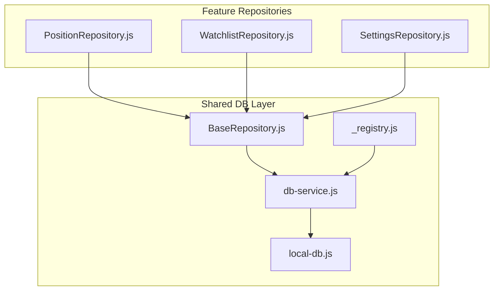
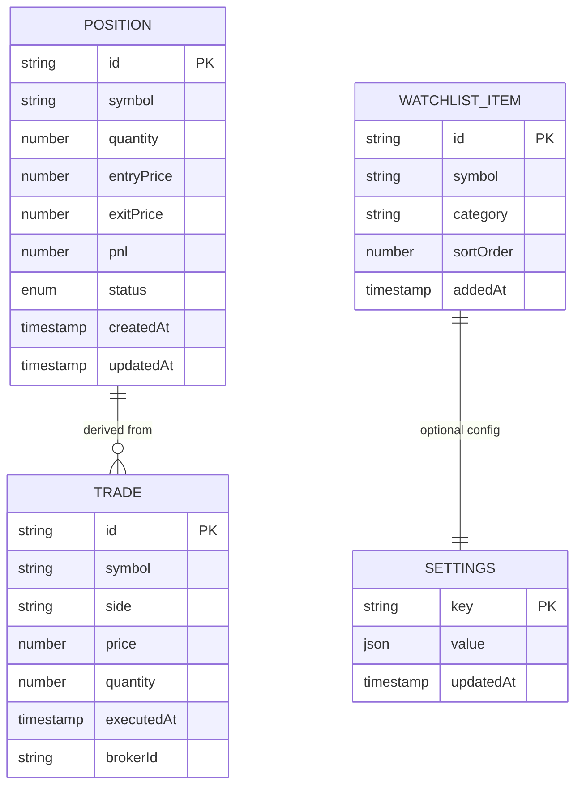
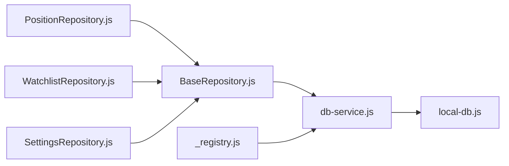

# Local Storage & IndexedDB Implementation

<cite>
**Referenced Files in This Document**
- [local-db.js](file://shared/db/local-db.js)
- [db-service.js](file://shared/db/db-service.js)
- [BaseRepository.js](file://shared/db/BaseRepository.js)
- [_registry.js](file://shared/db/_registry.js)
- [PositionRepository.js](file://features/positions/PositionRepository.js)
- [WatchlistRepository.js](file://features/watchlist/WatchlistRepository.js)
- [SettingsRepository.js](file://features/more/SettingsRepository.js)
</cite>

## Table of Contents
1. [Introduction](#introduction)
2. [Project Structure](#project-structure)
3. [Core Components](#core-components)
4. [Architecture Overview](#architecture-overview)
5. [Detailed Component Analysis](#detailed-component-analysis)
6. [Dependency Analysis](#dependency-analysis)
7. [Performance Considerations](#performance-considerations)
8. [Troubleshooting Guide](#troubleshooting-guide)
9. [Conclusion](#conclusion)
10. [Appendices](#appendices)

## Introduction
This document explains the local storage layer implemented with IndexedDB for the application. It covers database schema design, object stores and indexes, relationships between entities, and the LocalDB service API including connection management, transaction handling, and asynchronous operations. It also documents data persistence patterns, caching strategies, offline-first approach implementation, examples for trades, positions, watchlists, and settings, as well as backup and restore functionality, data migration procedures, and storage quota management. Finally, it provides performance optimization techniques, indexing strategies, and query optimization guidance for large datasets.

## Project Structure
The local storage layer is organized under shared/db and feature-specific repositories:
- Database core: local-db.js, db-service.js, BaseRepository.js, _registry.js
- Feature repositories: PositionRepository.js (positions), WatchlistRepository.js (watchlist), SettingsRepository.js (settings)

**Diagram sources**
- [local-db.js](file://shared/db/local-db.js)
- [db-service.js](file://shared/db/db-service.js)
- [BaseRepository.js](file://shared/db/BaseRepository.js)
- [_registry.js](file://shared/db/_registry.js)
- [PositionRepository.js](file://features/positions/PositionRepository.js)
- [WatchlistRepository.js](file://features/watchlist/WatchlistRepository.js)
- [SettingsRepository.js](file://features/more/SettingsRepository.js)

**Section sources**
- [local-db.js](file://shared/db/local-db.js)
- [db-service.js](file://shared/db/db-service.js)
- [BaseRepository.js](file://shared/db/BaseRepository.js)
- [_registry.js](file://shared/db/_registry.js)
- [PositionRepository.js](file://features/positions/PositionRepository.js)
- [WatchlistRepository.js](file://features/watchlist/WatchlistRepository.js)
- [SettingsRepository.js](file://features/more/SettingsRepository.js)

## Core Components
- LocalDB Service (local-db.js): Initializes and manages the IndexedDB instance, versioning, upgrades, and exposes low-level CRUD helpers.
- DB Service (db-service.js): Provides a higher-level API over IndexedDB, wrapping transactions, cursors, and common queries.
- Base Repository (BaseRepository.js): Implements repository pattern base class with standardized create/read/update/delete methods and transaction utilities.
- Registry (_registry.js): Centralizes registration and retrieval of repositories or services for dependency injection.
- Feature Repositories:
  - PositionRepository.js: Encapsulates position-related persistence logic.
  - WatchlistRepository.js: Encapsulates watchlist persistence logic.
  - SettingsRepository.js: Encapsulates settings persistence logic.

Key responsibilities:
- Connection lifecycle: open, upgrade, close
- Transaction scoping: read-only vs read-write
- Index-based queries: equality, range, compound indexes
- Error handling and retries
- Caching and offline-first behavior

**Section sources**
- [local-db.js](file://shared/db/local-db.js)
- [db-service.js](file://shared/db/db-service.js)
- [BaseRepository.js](file://shared/db/BaseRepository.js)
- [_registry.js](file://shared/db/_registry.js)
- [PositionRepository.js](file://features/positions/PositionRepository.js)
- [WatchlistRepository.js](file://features/watchlist/WatchlistRepository.js)
- [SettingsRepository.js](file://features/more/SettingsRepository.js)

## Architecture Overview
The architecture follows a layered approach:
- UI features call into feature repositories.
- Repositories extend BaseRepository to reuse transaction and query helpers.
- BaseRepository uses DB Service for IndexedDB interactions.
- DB Service delegates to LocalDB for connection and schema management.

**Diagram sources**
- [PositionRepository.js](file://features/positions/PositionRepository.js)
- [BaseRepository.js](file://shared/db/BaseRepository.js)
- [db-service.js](file://shared/db/db-service.js)
- [local-db.js](file://shared/db/local-db.js)

## Detailed Component Analysis

### LocalDB Service (Schema and Connection Management)
Responsibilities:
- Open IndexedDB with a versioned database name.
- Define object stores and indexes during onupgradeneeded.
- Provide helper methods for transactions and basic CRUD.
- Manage connection state and error propagation.

Typical schema elements:
- Object stores: trades, positions, watchlist, settings, audit logs (if used).
- Indexes:
  - positions: symbol, status, date ranges
  - trades: symbol, timestamp, side
  - watchlist: symbol, category
  - settings: key uniqueness

Connection lifecycle:
- Initialize once per app session.
- Upgrade schema when version increases.
- Close connections on shutdown or idle.

Error handling:
- Wrap all operations in try/catch.
- Return typed errors for not found, constraint violations, and quota exceeded.

**Section sources**
- [local-db.js](file://shared/db/local-db.js)

### DB Service (Transactions and Async Operations)
Responsibilities:
- Create read-only and read-write transactions scoped to specific object stores.
- Execute queries using indexes and cursors.
- Normalize results and map to domain models.
- Provide batch operations where appropriate.

Transaction handling:
- Automatic commit/abort on success/error.
- Timeout and retry policies for transient failures.

Async patterns:
- Promise-based API.
- AbortController support for cancellable queries.

**Section sources**
- [db-service.js](file://shared/db/db-service.js)

### BaseRepository (Repository Pattern Base)
Responsibilities:
- Standardized CRUD methods: create, get, getAll, update, delete.
- Query builder helpers for filters, sorting, pagination.
- Transaction wrappers ensuring consistent read/write boundaries.
- Mapping utilities to convert raw records to domain objects.

Design principles:
- Single responsibility: each repository focuses on one entity type.
- Reuse common logic via inheritance.
- Clear separation between persistence and business logic.

**Section sources**
- [BaseRepository.js](file://shared/db/BaseRepository.js)

### Registry (Service Registration)
Responsibilities:
- Register repositories and services by name.
- Resolve dependencies at runtime.
- Provide singleton-like access to repositories.

Usage:
- Feature pages request repositories from registry.
- Ensures consistent initialization order.

**Section sources**
- [_registry.js](file://shared/db/_registry.js)

### PositionRepository (Positions)
Responsibilities:
- Persist positions with fields like symbol, quantity, entry price, exit price, PnL, timestamps.
- Indexes for symbol, status, and time-based queries.
- Methods for current positions, historical positions, and aggregated metrics.

Example usage patterns:
- Upsert position on trade execution.
- Fetch active positions filtered by symbol.
- Archive closed positions by date range.

**Section sources**
- [PositionRepository.js](file://features/positions/PositionRepository.js)

### WatchlistRepository (Watchlist)
Responsibilities:
- Manage user-defined watchlists with symbols and optional metadata.
- Indexes for symbol and category.
- Methods to add/remove symbols, fetch full watchlist, and sync with remote if available.

Example usage patterns:
- Add symbol to watchlist.
- Remove symbol from watchlist.
- Retrieve watchlist sorted by custom order.

**Section sources**
- [WatchlistRepository.js](file://features/watchlist/WatchlistRepository.js)

### SettingsRepository (Settings)
Responsibilities:
- Store key-value settings with JSON-safe values.
- Ensure unique keys and provide defaults.
- Methods to get/set multiple settings atomically.

Example usage patterns:
- Save theme preference.
- Load default settings if missing.
- Batch update multiple settings.

**Section sources**
- [SettingsRepository.js](file://features/more/SettingsRepository.js)

### Data Models Diagram

[No sources needed since this diagram shows conceptual model mapping]

## Dependency Analysis
The following diagram illustrates how components depend on each other:

**Diagram sources**
- [PositionRepository.js](file://features/positions/PositionRepository.js)
- [WatchlistRepository.js](file://features/watchlist/WatchlistRepository.js)
- [SettingsRepository.js](file://features/more/SettingsRepository.js)
- [BaseRepository.js](file://shared/db/BaseRepository.js)
- [db-service.js](file://shared/db/db-service.js)
- [local-db.js](file://shared/db/local-db.js)
- [_registry.js](file://shared/db/_registry.js)

**Section sources**
- [PositionRepository.js](file://features/positions/PositionRepository.js)
- [WatchlistRepository.js](file://features/watchlist/WatchlistRepository.js)
- [SettingsRepository.js](file://features/more/SettingsRepository.js)
- [BaseRepository.js](file://shared/db/BaseRepository.js)
- [db-service.js](file://shared/db/db-service.js)
- [local-db.js](file://shared/db/local-db.js)
- [_registry.js](file://shared/db/_registry.js)

## Performance Considerations
- Indexing strategy:
  - Prefer equality indexes for frequent filters (symbol, status).
  - Use compound indexes for multi-field queries (symbol + status).
  - Avoid over-indexing; keep index count minimal to reduce write overhead.
- Query optimization:
  - Use cursor ranges instead of fetching entire stores.
  - Apply server-side style pagination and limit result sets.
  - Cache frequently accessed lists in memory with TTL.
- Transaction efficiency:
  - Group related writes into single transactions.
  - Use read-only transactions for bulk reads.
- Large dataset handling:
  - Partition data by date ranges or symbol groups if necessary.
  - Periodic archival of old records to separate stores.
- Memory management:
  - Stream results via cursors to avoid loading all records into memory.
  - Release references after processing to allow GC.

[No sources needed since this section provides general guidance]

## Troubleshooting Guide
Common issues and resolutions:
- Quota exceeded:
  - Monitor storage usage and implement pruning/archival strategies.
  - Prompt users to clear cache or export data.
- Schema mismatch:
  - Ensure onupgradeneeded increments version and migrates data safely.
  - Validate object store existence before operations.
- Transaction aborts:
  - Check for concurrent write conflicts and implement retry logic.
  - Log detailed error messages and stack traces.
- Slow queries:
  - Review indexes and adjust compound indexes.
  - Profile cursor iterations and reduce payload size.

Operational tips:
- Enable verbose logging in development.
- Implement health checks for IndexedDB availability.
- Provide manual backup/export endpoints for recovery.

**Section sources**
- [local-db.js](file://shared/db/local-db.js)
- [db-service.js](file://shared/db/db-service.js)
- [BaseRepository.js](file://shared/db/BaseRepository.js)

## Conclusion
The local storage layer leverages IndexedDB through a clean, layered architecture that separates concerns across LocalDB, DB Service, BaseRepository, and feature-specific repositories. The design supports offline-first behavior, robust transaction handling, and scalable querying via indexes. By adhering to the recommended performance and troubleshooting practices, the system can efficiently manage large datasets while maintaining reliability and responsiveness.

[No sources needed since this section summarizes without analyzing specific files]

## Appendices

### Backup and Restore
- Export:
  - Iterate object stores and serialize records to JSON.
  - Support incremental exports based on timestamps.
- Import:
  - Validate schema compatibility.
  - Use transactions to ensure atomic imports.
  - Handle duplicates and conflicts deterministically.

**Section sources**
- [db-service.js](file://shared/db/db-service.js)
- [local-db.js](file://shared/db/local-db.js)

### Data Migration Procedures
- Versioning:
  - Increment database version on schema changes.
  - Migrate existing data within onupgradeneeded.
- Rollback safety:
  - Keep migrations idempotent.
  - Test migrations against sample datasets.

**Section sources**
- [local-db.js](file://shared/db/local-db.js)

### Storage Quota Management
- Monitoring:
  - Track total size and per-store sizes.
- Policies:
  - Prune old records periodically.
  - Compress or archive historical data.
- User controls:
  - Provide UI to export and clear data.

**Section sources**
- [local-db.js](file://shared/db/local-db.js)

### Examples of Storing Entities Locally
- Trades:
  - Create trade record with symbol, side, price, quantity, timestamp.
  - Index by symbol and executedAt for time-range queries.
- Positions:
  - Upsert position on trade execution; compute derived fields like PnL.
  - Filter by status and symbol for active positions.
- Watchlists:
  - Add/remove symbols; maintain sort order and category.
  - Fetch watchlist items sorted by sortOrder.
- Settings:
  - Key-value pairs with JSON-safe values.
  - Default settings fallback if keys are missing.

**Section sources**
- [PositionRepository.js](file://features/positions/PositionRepository.js)
- [WatchlistRepository.js](file://features/watchlist/WatchlistRepository.js)
- [SettingsRepository.js](file://features/more/SettingsRepository.js)