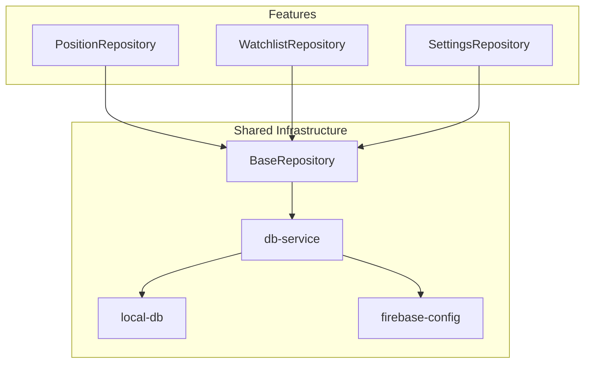
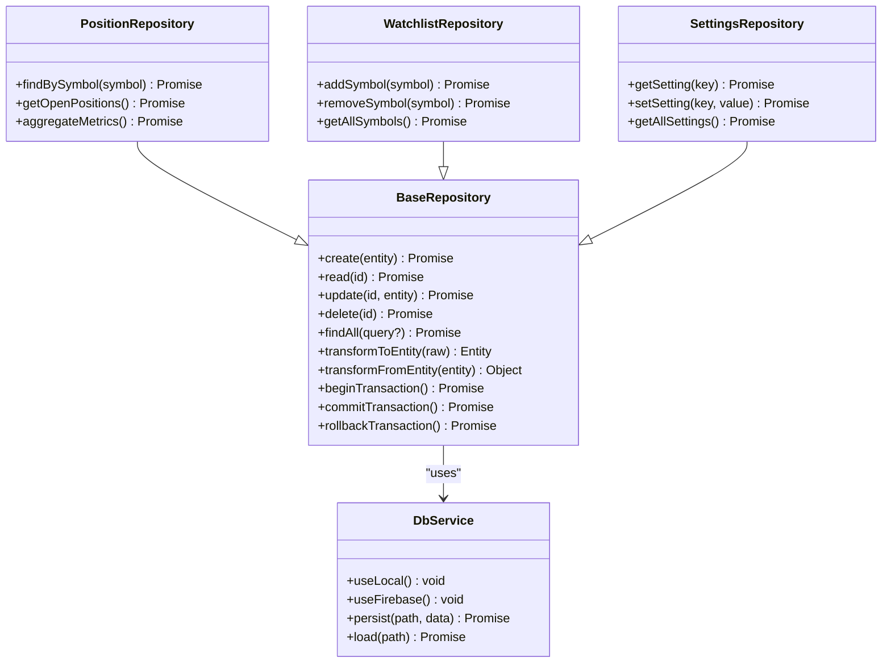
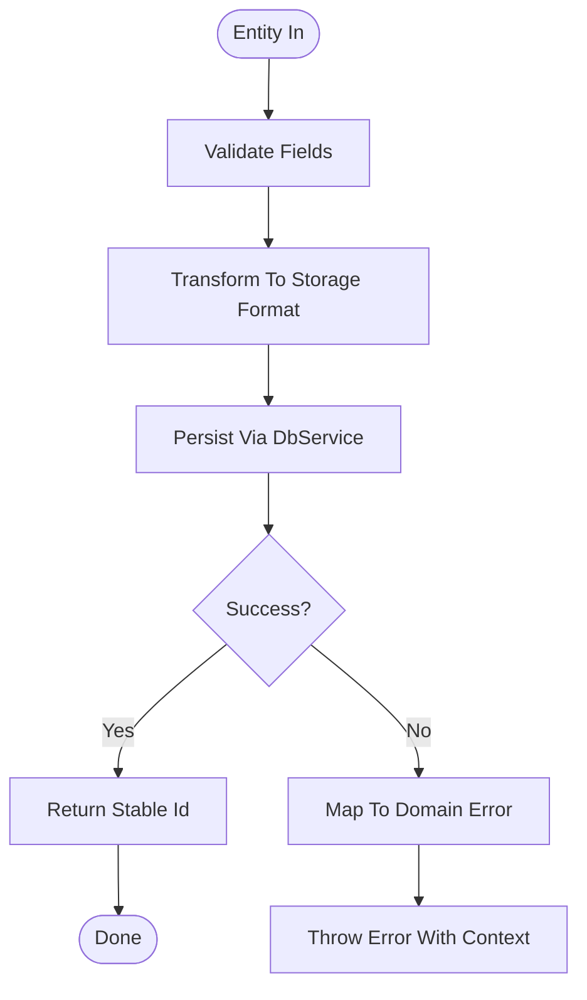
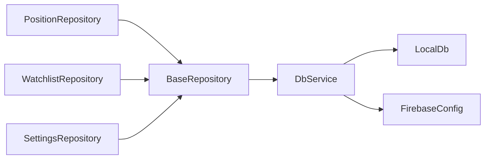

# Repository Pattern & Base Repository

<cite>
**Referenced Files in This Document**
- [BaseRepository.js](file://shared/db/BaseRepository.js)
- [PositionRepository.js](file://features/positions/PositionRepository.js)
- [WatchlistRepository.js](file://features/watchlist/WatchlistRepository.js)
- [SettingsRepository.js](file://features/more/SettingsRepository.js)
- [db-service.js](file://shared/db/db-service.js)
- [local-db.js](file://shared/db/local-db.js)
- [firebase-config.js](file://shared/db/firebase-config.js)
</cite>

## Table of Contents
1. [Introduction](#introduction)
2. [Project Structure](#project-structure)
3. [Core Components](#core-components)
4. [Architecture Overview](#architecture-overview)
5. [Detailed Component Analysis](#detailed-component-analysis)
6. [Dependency Analysis](#dependency-analysis)
7. [Performance Considerations](#performance-considerations)
8. [Troubleshooting Guide](#troubleshooting-guide)
9. [Conclusion](#conclusion)
10. [Appendices](#appendices)

## Introduction
This document explains the Repository Pattern implementation in MTF Monitor. It focuses on the BaseRepository abstract class, how feature-specific repositories extend it, interface contracts, error handling, transaction management, data transformation patterns, and testing strategies across local and cloud storage backends.

## Project Structure
The repository layer is organized under shared/db for base infrastructure and features/*/ for domain-specific repositories. Each feature typically owns its repository and service, keeping concerns separated.

[No sources needed since this diagram shows conceptual workflow, not actual code structure]

## Core Components
- BaseRepository: Abstract base providing common CRUD operations, query helpers, and data transformation utilities.
- Feature Repositories: PositionRepository, WatchlistRepository, SettingsRepository extending BaseRepository with domain-specific logic.
- Storage Abstraction: db-service orchestrates persistence via local-db (local storage) and firebase-config (cloud).

Key responsibilities:
- Encapsulate data access behind clean interfaces.
- Provide consistent error handling and logging.
- Normalize entities before persistence and after retrieval.
- Support transactions where applicable.

**Section sources**
- [BaseRepository.js](file://shared/db/BaseRepository.js)
- [PositionRepository.js](file://features/positions/PositionRepository.js)
- [WatchlistRepository.js](file://features/watchlist/WatchlistRepository.js)
- [SettingsRepository.js](file://features/more/SettingsRepository.js)
- [db-service.js](file://shared/db/db-service.js)
- [local-db.js](file://shared/db/local-db.js)
- [firebase-config.js](file://shared/db/firebase-config.js)

## Architecture Overview
The repository layer sits between feature services and the storage abstraction. BaseRepository defines the contract; feature repositories implement domain behavior; db-service selects the backend.

**Diagram sources**
- [BaseRepository.js](file://shared/db/BaseRepository.js)
- [PositionRepository.js](file://features/positions/PositionRepository.js)
- [WatchlistRepository.js](file://features/watchlist/WatchlistRepository.js)
- [SettingsRepository.js](file://features/more/SettingsRepository.js)
- [db-service.js](file://shared/db/db-service.js)

## Detailed Component Analysis

### BaseRepository
Responsibilities:
- Define standard CRUD methods with consistent signatures and return types.
- Provide query helpers for filtering, sorting, and pagination.
- Implement data transformation hooks to normalize entities.
- Manage transactions through begin/commit/rollback.
- Centralize error mapping and logging.

Common patterns:
- Input validation before persistence.
- Idempotent updates using versioning or timestamps.
- Safe defaults for optional fields.
- Deterministic keys for stable references.

Error handling strategy:
- Wrap storage errors into domain-level exceptions.
- Include context (entity id, operation) in error messages.
- Distinguish transient vs permanent failures for retry logic.

Transaction management:
- Begin a transactional scope.
- Execute multiple writes atomically.
- Commit on success; rollback on failure.
- Ensure cleanup even if an exception occurs.

Data transformation:
- transformFromEntity: convert domain objects to storage format.
- transformToEntity: convert raw storage records to domain objects.
- Apply default values and type coercion.

**Section sources**
- [BaseRepository.js](file://shared/db/BaseRepository.js)
- [db-service.js](file://shared/db/db-service.js)

### PositionRepository
Domain focus:
- Positions lifecycle: create, read, update, delete.
- Queries by symbol, status, date ranges.
- Aggregations for metrics and summaries.

Inheritance pattern:
- Extends BaseRepository to reuse CRUD and transformations.
- Overrides findBySymbol and getOpenPositions with custom filters.
- Adds aggregateMetrics combining multiple reads safely.

Custom implementations:
- Symbol normalization (case-insensitive lookup).
- Deduplication of entries by composite key.
- Snapshotting position state at specific times.

**Section sources**
- [PositionRepository.js](file://features/positions/PositionRepository.js)
- [BaseRepository.js](file://shared/db/BaseRepository.js)

### WatchlistRepository
Domain focus:
- Maintain a list of symbols or assets.
- Add/remove items and retrieve full watchlist.

Inheritance pattern:
- Uses BaseRepository for basic persistence.
- Implements addSymbol and removeSymbol with conflict resolution.
- Ensures uniqueness constraints at the repository level.

Custom implementations:
- Batch operations for bulk adds/removes.
- Sync order preservation.

**Section sources**
- [WatchlistRepository.js](file://features/watchlist/WatchlistRepository.js)
- [BaseRepository.js](file://shared/db/BaseRepository.js)

### SettingsRepository
Domain focus:
- Key-value settings store.
- Get/set individual settings and fetch all.

Inheritance pattern:
- Leverages BaseRepository for CRUD.
- Provides convenience methods for typed settings.

Custom implementations:
- Default fallbacks for missing keys.
- Validation and sanitization of setting values.

**Section sources**
- [SettingsRepository.js](file://features/more/SettingsRepository.js)
- [BaseRepository.js](file://shared/db/BaseRepository.js)

### Data Transformation Patterns
- Normalization: Convert incoming entities to canonical forms before saving.
- Projection: Select only necessary fields for queries.
- Enrichment: Attach computed fields after loading.
- Versioning: Track changes with timestamps or version numbers.

**Diagram sources**
- [BaseRepository.js](file://shared/db/BaseRepository.js)
- [db-service.js](file://shared/db/db-service.js)

## Dependency Analysis
Repositories depend on BaseRepository for shared behavior and on db-service for backend selection. Local and Firebase backends are interchangeable through the same interface.

**Diagram sources**
- [BaseRepository.js](file://shared/db/BaseRepository.js)
- [PositionRepository.js](file://features/positions/PositionRepository.js)
- [WatchlistRepository.js](file://features/watchlist/WatchlistRepository.js)
- [SettingsRepository.js](file://features/more/SettingsRepository.js)
- [db-service.js](file://shared/db/db-service.js)
- [local-db.js](file://shared/db/local-db.js)
- [firebase-config.js](file://shared/db/firebase-config.js)

**Section sources**
- [db-service.js](file://shared/db/db-service.js)
- [local-db.js](file://shared/db/local-db.js)
- [firebase-config.js](file://shared/db/firebase-config.js)

## Performance Considerations
- Prefer batched writes for bulk operations to reduce round-trips.
- Use projections to minimize payload size.
- Cache frequently accessed read-only data at the repository layer.
- Defer heavy computations until needed; expose lightweight queries.
- Avoid N+1 queries by joining or preloading related entities.

[No sources needed since this section provides general guidance]

## Troubleshooting Guide
Common issues and resolutions:
- Duplicate entries: Ensure unique constraints and deduplication logic in repositories.
- Stale data: Implement optimistic concurrency with version checks.
- Backend switching: Verify db-service configuration and credentials.
- Transaction rollbacks: Log failed operations and ensure partial commits are rolled back.
- Serialization errors: Validate entity shapes before persisting.

**Section sources**
- [BaseRepository.js](file://shared/db/BaseRepository.js)
- [db-service.js](file://shared/db/db-service.js)

## Conclusion
The Repository Pattern in MTF Monitor centralizes data access, enforces consistent contracts, and isolates storage specifics behind a clean API. BaseRepository provides reusable CRUD, transformation, and transaction support, while feature repositories encapsulate domain logic. This design simplifies testing, enables backend swaps, and improves maintainability.

[No sources needed since this section summarizes without analyzing specific files]

## Appendices

### Interface Contracts Summary
- create(entity): Create a new record; returns stable id.
- read(id): Retrieve by id; throws if not found.
- update(id, entity): Update existing record; validates presence.
- delete(id): Remove record; no-op if absent.
- findAll(query?): List with optional filters/sort/pagination.
- transformToEntity(raw): Convert storage row to domain object.
- transformFromEntity(entity): Convert domain object to storage row.
- beginTransaction()/commitTransaction()/rollbackTransaction(): Atomic scopes.

**Section sources**
- [BaseRepository.js](file://shared/db/BaseRepository.js)

### Testing Strategies
- Unit tests:
  - Mock BaseRepository methods to isolate feature repository logic.
  - Assert transformation functions for edge cases.
  - Validate error mapping and message context.
- Integration tests:
  - Swap db-service to use local-db for fast, deterministic runs.
  - Optionally test against Firebase emulator for cloud parity.
- Mocking approaches:
  - Replace db-service with a test double that records calls and returns fixtures.
  - Seed test data before each scenario and reset after.

**Section sources**
- [BaseRepository.js](file://shared/db/BaseRepository.js)
- [db-service.js](file://shared/db/db-service.js)
- [local-db.js](file://shared/db/local-db.js)
- [firebase-config.js](file://shared/db/firebase-config.js)