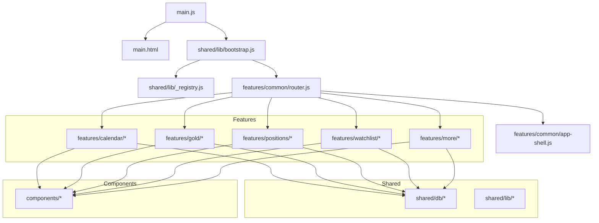
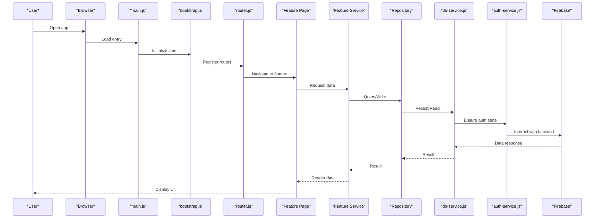
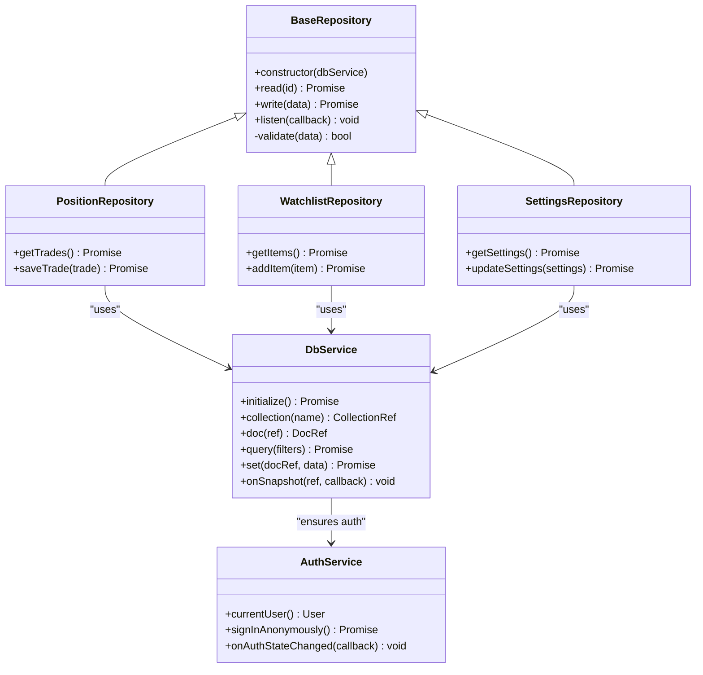
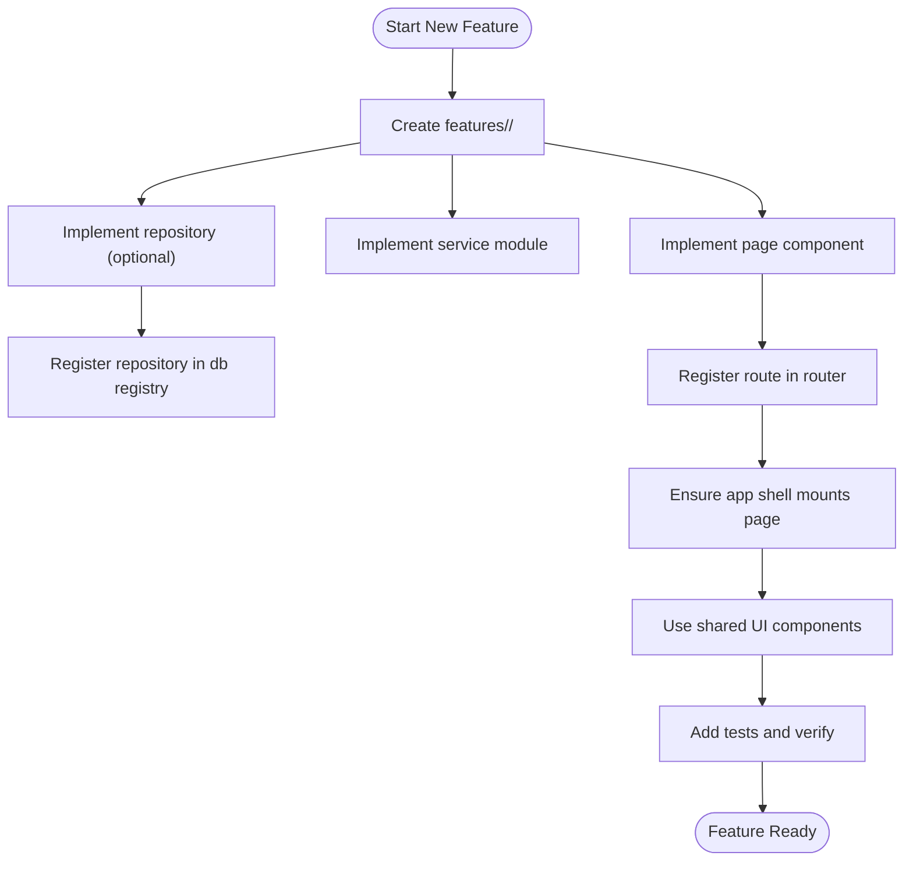
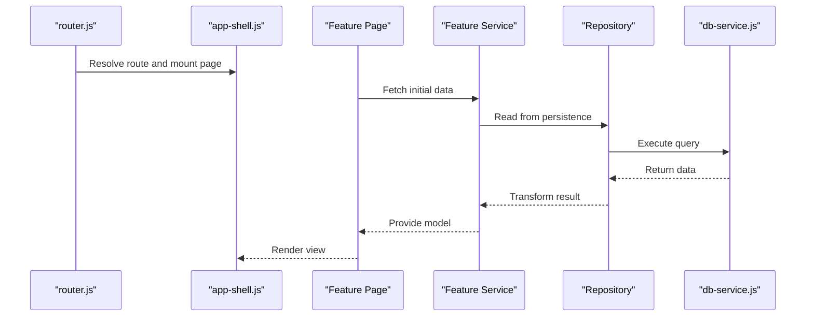
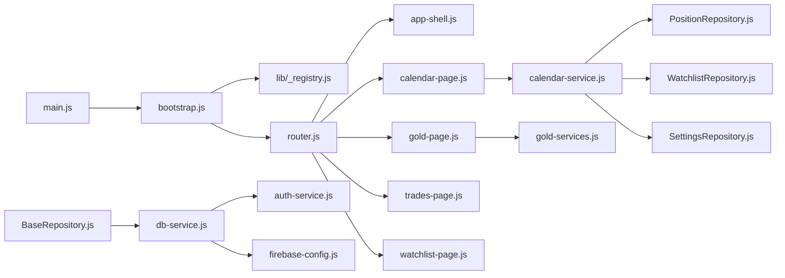

# Developer Guide

<cite>
**Referenced Files in This Document**
- [README.md](file://README.md)
- [main.js](file://main.js)
- [main.html](file://main.html)
- [package.json](file://package.json)
- [build-production.js](file://build-production.js)
- [playwright.config.js](file://playwright.config.js)
- [firestore.rules](file://firestore.rules)
- [app-version.json](file://app-version.json)
- [pages.json](file://pages.json)
- [shared/db/BaseRepository.js](file://shared/db/BaseRepository.js)
- [shared/db/_registry.js](file://shared/db/_registry.js)
- [shared/db/db-service.js](file://shared/db/db-service.js)
- [shared/db/auth-service.js](file://shared/db/auth-service.js)
- [shared/db/firebase-config.js](file://shared/db/firebase-config.js)
- [shared/lib/bootstrap.js](file://shared/lib/bootstrap.js)
- [shared/lib/_registry.js](file://shared/lib/_registry.js)
- [features/common/router.js](file://features/common/router.js)
- [features/common/app-shell.js](file://features/common/app-shell.js)
- [features/calendar/calendar-page.js](file://features/calendar/calendar-page.js)
- [features/calendar/calendar-service.js](file://features/calendar/calendar-service.js)
- [features/gold/gold-page.js](file://features/gold/gold-page.js)
- [features/gold/gold-services.js](file://features/gold/gold-services.js)
- [features/positions/PositionRepository.js](file://features/positions/PositionRepository.js)
- [features/positions/trades-page.js](file://features/positions/trades-page.js)
- [features/watchlist/WatchlistRepository.js](file://features/watchlist/WatchlistRepository.js)
- [features/watchlist/watchlist-page.js](file://features/watchlist/watchlist-page.js)
- [features/more/SettingsRepository.js](file://features/more/SettingsRepository.js)
- [components/card.js](file://components/card.js)
- [components/grid.js](file://components/grid.js)
- [components/metrics-cell.js](file://components/metrics-cell.js)
</cite>

## Table of Contents
1. Introduction
2. Project Structure
3. Core Components
4. Architecture Overview
5. Detailed Component Analysis
6. Dependency Analysis
7. Performance Considerations
8. Troubleshooting Guide
9. Conclusion
10. Appendices

## Introduction
This Developer Guide provides comprehensive guidance for contributing to the MTF Monitor project. It covers coding conventions, naming standards, architectural patterns, feature development workflow, debugging techniques, development tooling setup, performance profiling, code review processes, commit message standards, branching strategies, documentation and testing practices, backward compatibility, common scenarios, troubleshooting, and community contribution processes. The guide is designed to be accessible to contributors with varying levels of experience while ensuring consistency across the codebase.

## Project Structure
The project follows a modular, feature-based architecture with shared infrastructure and reusable components:
- features/: Feature modules encapsulating UI pages, services, and repositories (e.g., calendar, gold, positions, watchlist, more).
- shared/: Cross-cutting concerns including database layer, authentication, bootstrapping, registry utilities, formatting helpers, and scripts.
- components/: Reusable UI building blocks used across features.
- Root configuration files: Application entry points, build scripts, test configuration, and deployment rules.

**Diagram sources**
- [main.js](file://main.js)
- [main.html](file://main.html)
- [shared/lib/bootstrap.js](file://shared/lib/bootstrap.js)
- [shared/lib/_registry.js](file://shared/lib/_registry.js)
- [features/common/router.js](file://features/common/router.js)
- [features/common/app-shell.js](file://features/common/app-shell.js)
- [features/calendar/calendar-page.js](file://features/calendar/calendar-page.js)
- [features/calendar/calendar-service.js](file://features/calendar/calendar-service.js)
- [features/gold/gold-page.js](file://features/gold/gold-page.js)
- [features/gold/gold-services.js](file://features/gold/gold-services.js)
- [features/positions/PositionRepository.js](file://features/positions/PositionRepository.js)
- [features/positions/trades-page.js](file://features/positions/trades-page.js)
- [features/watchlist/WatchlistRepository.js](file://features/watchlist/WatchlistRepository.js)
- [features/watchlist/watchlist-page.js](file://features/watchlist/watchlist-page.js)
- [features/more/SettingsRepository.js](file://features/more/SettingsRepository.js)
- [shared/db/BaseRepository.js](file://shared/db/BaseRepository.js)
- [shared/db/_registry.js](file://shared/db/_registry.js)
- [shared/db/db-service.js](file://shared/db/db-service.js)
- [shared/db/auth-service.js](file://shared/db/auth-service.js)
- [shared/db/firebase-config.js](file://shared/db/firebase-config.js)
- [components/card.js](file://components/card.js)
- [components/grid.js](file://components/grid.js)
- [components/metrics-cell.js](file://components/metrics-cell.js)

**Section sources**
- [README.md](file://README.md)
- [main.js](file://main.js)
- [main.html](file://main.html)
- [package.json](file://package.json)

## Core Components
Key architectural elements that underpin the application:
- Bootstrap and Registry: Centralized initialization and service discovery via bootstrap and registry utilities.
- Router and App Shell: Client-side routing and shell layout management for features.
- Database Layer: Shared repository base class, Firebase configuration, authentication, and database service integration.
- Feature Modules: Self-contained feature directories with page components, services, and repositories.
- Reusable UI Components: Small, composable UI primitives used across features.

**Section sources**
- [shared/lib/bootstrap.js](file://shared/lib/bootstrap.js)
- [shared/lib/_registry.js](file://shared/lib/_registry.js)
- [features/common/router.js](file://features/common/router.js)
- [features/common/app-shell.js](file://features/common/app-shell.js)
- [shared/db/BaseRepository.js](file://shared/db/BaseRepository.js)
- [shared/db/_registry.js](file://shared/db/_registry.js)
- [shared/db/db-service.js](file://shared/db/db-service.js)
- [shared/db/auth-service.js](file://shared/db/auth-service.js)
- [shared/db/firebase-config.js](file://shared/db/firebase-config.js)
- [components/card.js](file://components/card.js)
- [components/grid.js](file://components/grid.js)
- [components/metrics-cell.js](file://components/metrics-cell.js)

## Architecture Overview
The application uses a layered architecture:
- Entry point initializes core services and bootstraps the app.
- Router resolves feature routes and mounts corresponding pages within the app shell.
- Features interact with shared services and repositories to read/write data.
- Repositories abstract persistence using a shared base implementation and Firebase-backed database service.
- UI components are reused across features for consistent presentation.

**Diagram sources**
- [main.js](file://main.js)
- [shared/lib/bootstrap.js](file://shared/lib/bootstrap.js)
- [features/common/router.js](file://features/common/router.js)
- [features/calendar/calendar-page.js](file://features/calendar/calendar-page.js)
- [features/calendar/calendar-service.js](file://features/calendar/calendar-service.js)
- [shared/db/BaseRepository.js](file://shared/db/BaseRepository.js)
- [shared/db/db-service.js](file://shared/db/db-service.js)
- [shared/db/auth-service.js](file://shared/db/auth-service.js)
- [shared/db/firebase-config.js](file://shared/db/firebase-config.js)

## Detailed Component Analysis

### Repository Pattern and Base Implementation
Repositories provide a consistent abstraction over persistence. They extend a shared base class and use the database service for operations like reading, writing, and listening to changes. Authentication is handled centrally to ensure secure access.

**Diagram sources**
- [shared/db/BaseRepository.js](file://shared/db/BaseRepository.js)
- [features/positions/PositionRepository.js](file://features/positions/PositionRepository.js)
- [features/watchlist/WatchlistRepository.js](file://features/watchlist/WatchlistRepository.js)
- [features/more/SettingsRepository.js](file://features/more/SettingsRepository.js)
- [shared/db/db-service.js](file://shared/db/db-service.js)
- [shared/db/auth-service.js](file://shared/db/auth-service.js)

**Section sources**
- [shared/db/BaseRepository.js](file://shared/db/BaseRepository.js)
- [shared/db/_registry.js](file://shared/db/_registry.js)
- [shared/db/db-service.js](file://shared/db/db-service.js)
- [shared/db/auth-service.js](file://shared/db/auth-service.js)
- [shared/db/firebase-config.js](file://shared/db/firebase-config.js)
- [features/positions/PositionRepository.js](file://features/positions/PositionRepository.js)
- [features/watchlist/WatchlistRepository.js](file://features/watchlist/WatchlistRepository.js)
- [features/more/SettingsRepository.js](file://features/more/SettingsRepository.js)

### Feature Module Development Workflow
To add a new feature:
- Create a feature directory under features/<feature-name>.
- Implement a page component and a service module for business logic.
- If persistence is needed, create a repository extending the base repository and register it in the database registry.
- Register the route in the router and ensure the app shell renders the page.
- Use shared UI components for consistent presentation.

**Diagram sources**
- [features/common/router.js](file://features/common/router.js)
- [features/common/app-shell.js](file://features/common/app-shell.js)
- [shared/db/_registry.js](file://shared/db/_registry.js)
- [shared/db/BaseRepository.js](file://shared/db/BaseRepository.js)

**Section sources**
- [features/calendar/calendar-page.js](file://features/calendar/calendar-page.js)
- [features/calendar/calendar-service.js](file://features/calendar/calendar-service.js)
- [features/gold/gold-page.js](file://features/gold/gold-page.js)
- [features/gold/gold-services.js](file://features/gold/gold-services.js)
- [features/positions/trades-page.js](file://features/positions/trades-page.js)
- [features/watchlist/watchlist-page.js](file://features/watchlist/watchlist-page.js)

### Routing and App Shell Integration
The router maps URL paths to feature pages and integrates with the app shell to render layouts and navigation. Pages should focus on presentation and orchestration, delegating data operations to services and repositories.

**Diagram sources**
- [features/common/router.js](file://features/common/router.js)
- [features/common/app-shell.js](file://features/common/app-shell.js)
- [features/calendar/calendar-service.js](file://features/calendar/calendar-service.js)
- [shared/db/BaseRepository.js](file://shared/db/BaseRepository.js)
- [shared/db/db-service.js](file://shared/db/db-service.js)

**Section sources**
- [features/common/router.js](file://features/common/router.js)
- [features/common/app-shell.js](file://features/common/app-shell.js)

### Shared Services and Utilities
- Bootstrap: Initializes core services, registers dependencies, and prepares the environment.
- Registry: Provides centralized registration and retrieval of services and repositories.
- Formatting and Helpers: Utility functions for consistent formatting and cross-feature reuse.

**Section sources**
- [shared/lib/bootstrap.js](file://shared/lib/bootstrap.js)
- [shared/lib/_registry.js](file://shared/lib/_registry.js)
- [shared/lib/format.js](file://shared/lib/format.js)

### UI Components
Reusable components include cards, grids, and metrics cells. These components should remain stateless where possible and accept props for configuration and data binding.

**Section sources**
- [components/card.js](file://components/card.js)
- [components/grid.js](file://components/grid.js)
- [components/metrics-cell.js](file://components/metrics-cell.js)

## Dependency Analysis
The application’s dependency graph emphasizes loose coupling through registries and clear separation between UI, services, and repositories.

**Diagram sources**
- [main.js](file://main.js)
- [shared/lib/bootstrap.js](file://shared/lib/bootstrap.js)
- [shared/lib/_registry.js](file://shared/lib/_registry.js)
- [features/common/router.js](file://features/common/router.js)
- [features/common/app-shell.js](file://features/common/app-shell.js)
- [features/calendar/calendar-page.js](file://features/calendar/calendar-page.js)
- [features/calendar/calendar-service.js](file://features/calendar/calendar-service.js)
- [features/gold/gold-page.js](file://features/gold/gold-page.js)
- [features/gold/gold-services.js](file://features/gold/gold-services.js)
- [features/positions/PositionRepository.js](file://features/positions/PositionRepository.js)
- [features/watchlist/WatchlistRepository.js](file://features/watchlist/WatchlistRepository.js)
- [features/more/SettingsRepository.js](file://features/more/SettingsRepository.js)
- [shared/db/BaseRepository.js](file://shared/db/BaseRepository.js)
- [shared/db/db-service.js](file://shared/db/db-service.js)
- [shared/db/auth-service.js](file://shared/db/auth-service.js)
- [shared/db/firebase-config.js](file://shared/db/firebase-config.js)

**Section sources**
- [main.js](file://main.js)
- [shared/lib/bootstrap.js](file://shared/lib/bootstrap.js)
- [shared/lib/_registry.js](file://shared/lib/_registry.js)
- [features/common/router.js](file://features/common/router.js)
- [features/common/app-shell.js](file://features/common/app-shell.js)
- [shared/db/BaseRepository.js](file://shared/db/BaseRepository.js)
- [shared/db/db-service.js](file://shared/db/db-service.js)
- [shared/db/auth-service.js](file://shared/db/auth-service.js)
- [shared/db/firebase-config.js](file://shared/db/firebase-config.js)

## Performance Considerations
- Minimize re-renders by keeping UI components stateless and passing only necessary props.
- Debounce user inputs and network requests where appropriate to reduce overhead.
- Prefer efficient queries in repositories; avoid fetching unnecessary fields.
- Leverage Firestore listeners judiciously; unsubscribe when components unmount to prevent memory leaks.
- Profile JavaScript execution using browser dev tools to identify bottlenecks.
- Optimize images and assets; consider lazy loading for heavy resources.
- Keep bundle size small by avoiding unused dependencies and splitting feature modules.

[No sources needed since this section provides general guidance]

## Troubleshooting Guide
Common issues and resolutions:
- Authentication failures: Verify auth service initialization and current user state before performing database operations.
- Permission errors: Review Firestore security rules and ensure authenticated users have appropriate access.
- Route not found: Confirm route registration in the router and correct path mapping.
- Repository not registered: Ensure repositories are registered in the database registry before use.
- Build or production issues: Validate build script configurations and manifest integrity checks.

**Section sources**
- [shared/db/auth-service.js](file://shared/db/auth-service.js)
- [firestore.rules](file://firestore.rules)
- [features/common/router.js](file://features/common/router.js)
- [shared/db/_registry.js](file://shared/db/_registry.js)
- [build-production.js](file://build-production.js)

## Conclusion
By following the conventions, patterns, and workflows outlined in this guide, contributors can develop features consistently, maintain high code quality, and integrate smoothly with existing services. Adhering to testing, documentation, and backward compatibility practices ensures long-term stability and ease of maintenance.

[No sources needed since this section summarizes without analyzing specific files]

## Appendices

### Coding Conventions and Naming Standards
- File and folder names: kebab-case for folders and files; PascalCase for classes and components.
- Variables and functions: camelCase; constants: UPPER_SNAKE_CASE.
- Promises and async/await: Always handle errors and avoid unhandled promise rejections.
- Logging: Use structured logs with context for easier debugging.
- Comments: Explain why, not what; keep comments concise and up-to-date.

[No sources needed since this section provides general guidance]

### Feature Development Checklist
- Create feature directory and implement page and service modules.
- Add repository if persistence is required; register in db registry.
- Register route in router and ensure app shell integration.
- Write unit and integration tests; run Playwright tests for end-to-end flows.
- Update documentation and version metadata if applicable.
- Perform code review and address feedback before merging.

**Section sources**
- [features/common/router.js](file://features/common/router.js)
- [features/common/app-shell.js](file://features/common/app-shell.js)
- [shared/db/_registry.js](file://shared/db/_registry.js)
- [playwright.config.js](file://playwright.config.js)

### Debugging Techniques
- Use browser developer tools to inspect DOM, network requests, and console logs.
- Enable verbose logging in services and repositories during development.
- Inspect Firestore rules and simulate different auth states for permission testing.
- Use Playwright for automated end-to-end debugging and regression detection.

**Section sources**
- [playwright.config.js](file://playwright.config.js)
- [shared/db/auth-service.js](file://shared/db/auth-service.js)
- [firestore.rules](file://firestore.rules)

### Development Tools Setup
- Install dependencies using package manager commands defined in package.json.
- Run local development server and build scripts as specified in package.json.
- Configure environment variables for Firebase and other services.
- Set up linting and formatting tools to enforce style consistency.

**Section sources**
- [package.json](file://package.json)

### Code Review Process
- Submit pull requests with clear descriptions and linked tickets.
- Ensure all tests pass and coverage meets thresholds.
- Address reviewer feedback promptly and iterate until approval.
- Maintain semantic versioning for releases and update changelog entries.

[No sources needed since this section provides general guidance]

### Commit Message Standards
- Use imperative mood and concise subject lines.
- Include scope and type prefixes (e.g., feat:, fix:, docs:).
- Reference related issues or tickets in the body.
- Keep commits atomic and focused on single responsibilities.

[No sources needed since this section provides general guidance]

### Branching Strategy
- main: Stable release branch protected from direct pushes.
- develop: Integration branch for ongoing development.
- feature/<name>: Short-lived branches for individual features.
- hotfix/<name>: Emergency fixes targeting main with backports to develop.

[No sources needed since this section provides general guidance]

### Documentation Guidelines
- Update README and inline documentation when adding features or changing APIs.
- Provide usage examples and migration notes for breaking changes.
- Keep diagrams and flowcharts aligned with actual code structure.

**Section sources**
- [README.md](file://README.md)

### Testing Practices
- Unit tests: Cover repository methods, service logic, and utility functions.
- Integration tests: Validate interactions between services and database layer.
- End-to-end tests: Use Playwright to simulate user flows and assert UI behavior.
- Continuous integration: Ensure tests run automatically on pull requests.

**Section sources**
- [playwright.config.js](file://playwright.config.js)

### Backward Compatibility
- Avoid breaking changes to public APIs and repository interfaces.
- Deprecate features gradually with migration guides.
- Maintain versioned configurations and feature flags for gradual rollout.

[No sources needed since this section provides general guidance]

### Community Contribution Processes
- Follow the contribution guidelines and code of conduct.
- Engage in discussions via issues and pull request comments.
- Respect review feedback and maintain collaborative communication.

[No sources needed since this section provides general guidance]