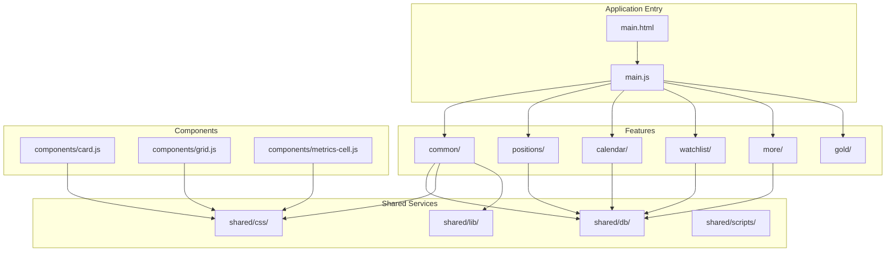
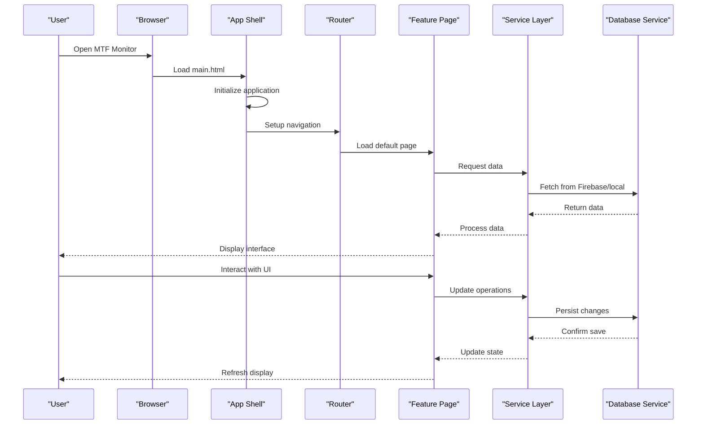
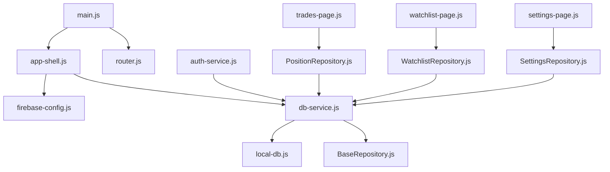

# Getting Started

<cite>
**Referenced Files in This Document**
- [README.md](file://README.md)
- [package.json](file://package.json)
- [main.html](file://main.html)
- [main.js](file://main.js)
- [shared/db/firebase-config.js](file://shared/db/firebase-config.js)
- [shared/db/auth-service.js](file://shared/db/auth-service.js)
- [shared/db/db-service.js](file://shared/db/db-service.js)
- [features/common/app-shell.js](file://features/common/app-shell.js)
- [features/positions/trades-page.js](file://features/positions/trades-page.js)
- [features/calendar/calendar-page.js](file://features/calendar/calendar-page.js)
- [features/watchlist/watchlist-page.js](file://features/watchlist/watchlist-page.js)
- [features/more/settings-page.js](file://features/more/settings-page.js)
</cite>

## Table of Contents
1. [Introduction](#introduction)
2. [Project Structure](#project-structure)
3. [Core Components](#core-components)
4. [Architecture Overview](#architecture-overview)
5. [Detailed Component Analysis](#detailed-component-analysis)
6. [Dependency Analysis](#dependency-analysis)
7. [Performance Considerations](#performance-considerations)
8. [Troubleshooting Guide](#troubleshooting-guide)
9. [Conclusion](#conclusion)

## Introduction
MTF Monitor is a mobile-first, multi-timeframe trading monitoring dashboard designed to help traders track positions, manage calendars, and maintain watchlists across multiple timeframes. The application emphasizes usability on small screens while providing rich functionality for active traders.

Key features:
- Position tracking with detailed trade views and history
- Calendar management for events and scheduled activities
- Watchlist management for instruments and symbols
- Settings configuration and app versioning
- Multi-timeframe awareness for market analysis

The project follows a modular architecture with clear separation between UI components, business logic, and data persistence layers.

## Project Structure
The MTF Monitor application is organized into feature-based modules with shared utilities and database services:



**Diagram sources**
- [main.html](file://main.html)
- [main.js](file://main.js)
- [features/common/app-shell.js](file://features/common/app-shell.js)
- [shared/db/db-service.js](file://shared/db/db-service.js)

**Section sources**
- [README.md](file://README.md)
- [package.json](file://package.json)
- [main.html](file://main.html)
- [main.js](file://main.js)

## Core Components

### Application Shell and Navigation
The application uses a modular shell system that manages routing between different feature pages. The main entry point initializes the application and sets up the navigation framework.

### Database Layer
The database layer provides Firebase integration for real-time data synchronization and local storage capabilities for offline functionality.

### Feature Modules
Each major feature (positions, calendar, watchlist) is implemented as a self-contained module with its own service layer and repository pattern for data management.

**Section sources**
- [main.js](file://main.js)
- [features/common/app-shell.js](file://features/common/app-shell.js)
- [shared/db/db-service.js](file://shared/db/db-service.js)

## Architecture Overview



**Diagram sources**
- [main.html](file://main.html)
- [main.js](file://main.js)
- [features/common/app-shell.js](file://features/common/app-shell.js)
- [shared/db/db-service.js](file://shared/db/db-service.js)

## Detailed Component Analysis

### Installation and Setup Requirements

#### System Requirements
- **Node.js**: Version 16 or higher recommended
- **Modern Browser**: Chrome, Firefox, Safari, or Edge with ES6+ support
- **Firebase Account**: Required for cloud data synchronization
- **Internet Connection**: For initial setup and Firebase operations

#### Environment Configuration
Before running the application, you need to configure Firebase credentials and environment variables.

**Section sources**
- [package.json](file://package.json)
- [shared/db/firebase-config.js](file://shared/db/firebase-config.js)

### Step-by-Step Setup Instructions

#### 1. Clone and Install Dependencies
```bash
git clone <repository-url>
cd mtf-monitor
npm install
```

#### 2. Configure Firebase
Create a Firebase project and configure the application with your credentials.

#### 3. Start Development Server
```bash
npm start
```

#### 4. Access the Application
Open your browser and navigate to `http://localhost:3000`

**Section sources**
- [package.json](file://package.json)
- [main.html](file://main.html)

### Basic Usage Examples

#### Navigating the Interface
The application provides a mobile-first interface with bottom navigation tabs for easy access to different sections.

#### Adding Positions
Use the positions module to track your trading positions with detailed information including entry price, stop loss, take profit, and current P&L.

#### Managing Calendar Events
Add trading-related events, economic calendar items, and personal reminders through the calendar interface.

#### Configuring Watchlist
Set up your preferred instruments and symbols with custom timeframes and alerts.

**Section sources**
- [features/positions/trades-page.js](file://features/positions/trades-page.js)
- [features/calendar/calendar-page.js](file://features/calendar/calendar-page.js)
- [features/watchlist/watchlist-page.js](file://features/watchlist/watchlist-page.js)
- [features/more/settings-page.js](file://features/more/settings-page.js)

## Dependency Analysis



**Diagram sources**
- [main.js](file://main.js)
- [features/common/app-shell.js](file://features/common/app-shell.js)
- [shared/db/firebase-config.js](file://shared/db/firebase-config.js)
- [shared/db/db-service.js](file://shared/db/db-service.js)
- [shared/db/auth-service.js](file://shared/db/auth-service.js)
- [features/positions/PositionRepository.js](file://features/positions/PositionRepository.js)
- [features/watchlist/WatchlistRepository.js](file://features/watchlist/WatchlistRepository.js)
- [features/more/SettingsRepository.js](file://features/more/SettingsRepository.js)

**Section sources**
- [package.json](file://package.json)
- [shared/db/_registry.js](file://shared/db/_registry.js)

## Performance Considerations

### Mobile Optimization
The application is specifically designed for mobile devices with touch-friendly interfaces and optimized rendering for small screens.

### Data Synchronization
Real-time Firebase synchronization ensures data consistency across devices while maintaining offline capability through local storage.

### Memory Management
Efficient component lifecycle management prevents memory leaks and maintains smooth performance during extended usage sessions.

## Troubleshooting Guide

### Common Setup Issues

#### Firebase Configuration Errors
- Verify your Firebase project credentials are correctly configured
- Check that Firestore rules allow read/write operations
- Ensure your Firebase project has Firestore enabled

#### Port Conflicts
If port 3000 is already in use, modify the development server configuration or kill the conflicting process.

#### Browser Compatibility
Ensure your browser supports modern JavaScript features (ES6+, async/await, fetch API).

#### Network Issues
- Check firewall settings that might block Firebase connections
- Verify internet connectivity for cloud features
- Test with different network configurations if experiencing connection issues

### Debugging Tips
- Use browser developer tools to inspect network requests
- Check console logs for JavaScript errors
- Verify Firebase authentication status
- Test local storage functionality when offline

**Section sources**
- [shared/db/firebase-config.js](file://shared/db/firebase-config.js)
- [shared/db/auth-service.js](file://shared/db/auth-service.js)
- [shared/db/db-service.js](file://shared/db/db-service.js)

## Conclusion
MTF Monitor provides a comprehensive solution for traders who need to monitor multiple timeframes and manage their trading activities efficiently. The mobile-first design ensures accessibility on-the-go while the robust feature set supports serious trading workflows. With proper Firebase configuration and following the setup instructions provided, users can quickly deploy and customize the application to meet their specific trading needs.

The modular architecture makes it easy to extend functionality and integrate additional features as trading requirements evolve. The combination of real-time synchronization and offline capability ensures reliable operation regardless of network conditions.