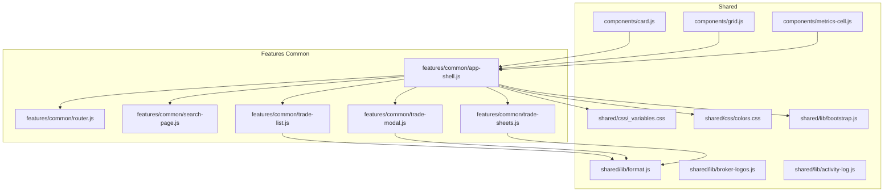
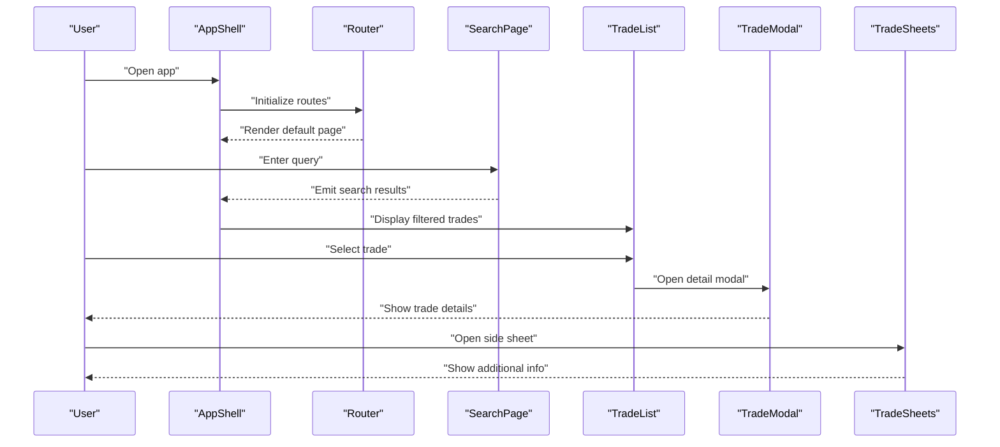
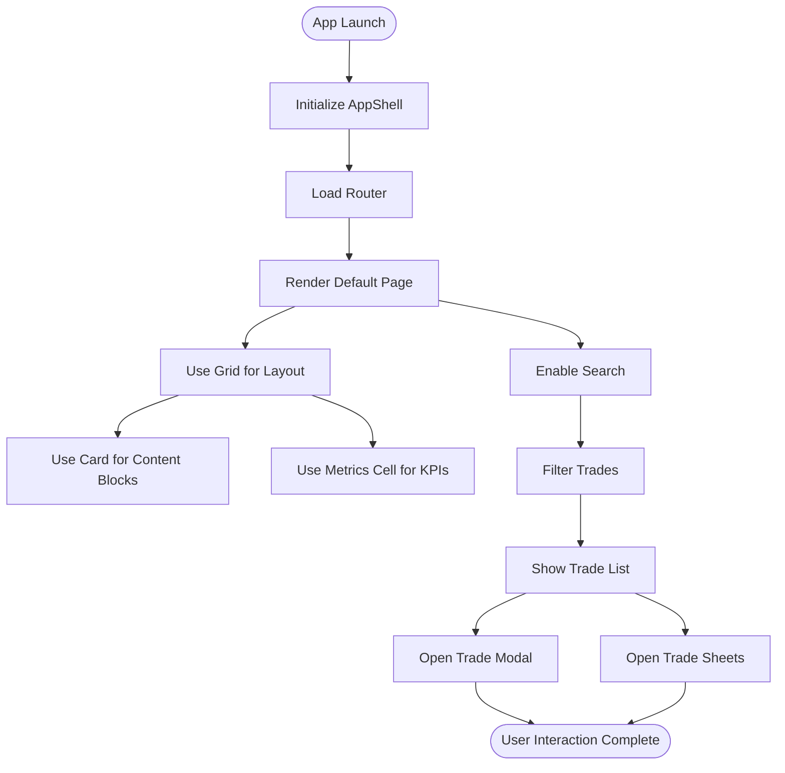
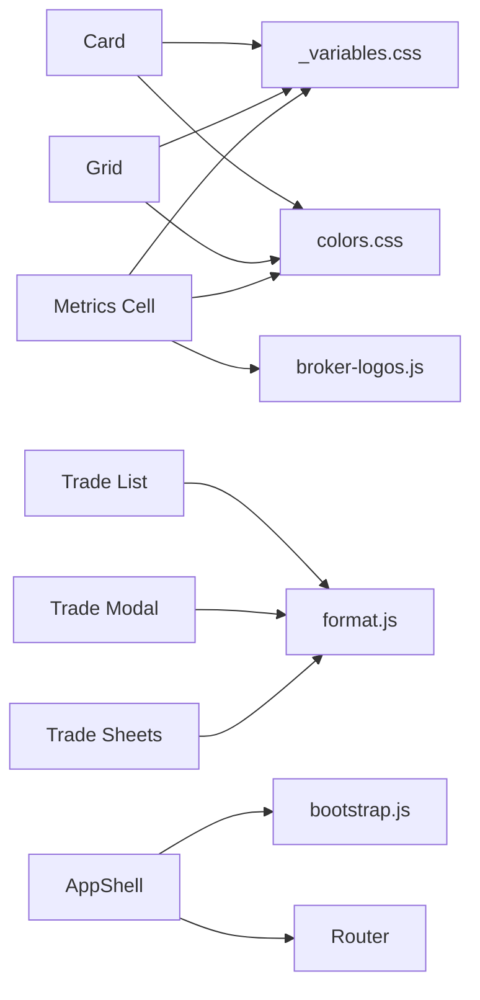

# Shared Components & Utilities

<cite>
**Referenced Files in This Document**
- [card.js](file://components/card.js)
- [grid.js](file://components/grid.js)
- [metrics-cell.js](file://components/metrics-cell.js)
- [app-shell.js](file://features/common/app-shell.js)
- [router.js](file://features/common/router.js)
- [search-page.js](file://features/common/search-page.js)
- [trade-list.js](file://features/common/trade-list.js)
- [trade-modal.js](file://features/common/trade-modal.js)
- [trade-sheets.js](file://features/common/trade-sheets.js)
- [_variables.css](file://shared/css/_variables.css)
- [colors.css](file://shared/css/colors.css)
- [bootstrap.js](file://shared/lib/bootstrap.js)
- [format.js](file://shared/lib/format.js)
- [broker-logos.js](file://shared/lib/broker-logos.js)
- [activity-log.js](file://shared/lib/activity-log.js)
</cite>

## Table of Contents
1. [Introduction](#introduction)
2. [Project Structure](#project-structure)
3. [Core Components](#core-components)
4. [Architecture Overview](#architecture-overview)
5. [Detailed Component Analysis](#detailed-component-analysis)
6. [Dependency Analysis](#dependency-analysis)
7. [Performance Considerations](#performance-considerations)
8. [Troubleshooting Guide](#troubleshooting-guide)
9. [Conclusion](#conclusion)
10. [Appendices](#appendices)

## Introduction
This document describes the shared UI components and utility libraries used across the MTF Monitor application. It focuses on reusable building blocks such as Card, Grid layout system, and Metrics Cell, along with the application shell structure, search functionality, and trade-related components. It also covers styling conventions, responsive design patterns, accessibility considerations, composition strategies, and performance optimization techniques.

## Project Structure
The project organizes shared UI components under a dedicated folder and feature-specific pages and utilities under features. Styling is centralized in shared CSS modules, while common runtime utilities live in shared/lib. The application shell and routing are implemented in the common feature.

**Diagram sources**
- [card.js](file://components/card.js)
- [grid.js](file://components/grid.js)
- [metrics-cell.js](file://components/metrics-cell.js)
- [app-shell.js](file://features/common/app-shell.js)
- [router.js](file://features/common/router.js)
- [search-page.js](file://features/common/search-page.js)
- [trade-list.js](file://features/common/trade-list.js)
- [trade-modal.js](file://features/common/trade-modal.js)
- [trade-sheets.js](file://features/common/trade-sheets.js)
- [_variables.css](file://shared/css/_variables.css)
- [colors.css](file://shared/css/colors.css)
- [bootstrap.js](file://shared/lib/bootstrap.js)
- [format.js](file://shared/lib/format.js)
- [broker-logos.js](file://shared/lib/broker-logos.js)
- [activity-log.js](file://shared/lib/activity-log.js)

**Section sources**
- [card.js](file://components/card.js)
- [grid.js](file://components/grid.js)
- [metrics-cell.js](file://components/metrics-cell.js)
- [app-shell.js](file://features/common/app-shell.js)
- [router.js](file://features/common/router.js)
- [search-page.js](file://features/common/search-page.js)
- [trade-list.js](file://features/common/trade-list.js)
- [trade-modal.js](file://features/common/trade-modal.js)
- [trade-sheets.js](file://features/common/trade-sheets.js)
- [_variables.css](file://shared/css/_variables.css)
- [colors.css](file://shared/css/colors.css)
- [bootstrap.js](file://shared/lib/bootstrap.js)
- [format.js](file://shared/lib/format.js)
- [broker-logos.js](file://shared/lib/broker-logos.js)
- [activity-log.js](file://shared/lib/activity-log.js)

## Core Components
This section documents the primary reusable UI components: Card, Grid, and Metrics Cell. For each component, we describe purpose, props, events, customization options, and usage guidance.

### Card
- Purpose: A container for grouping related content and actions with consistent padding, elevation, and optional header/footer slots.
- Props:
  - title: string; displayed in the card header if provided.
  - subtitle: string; secondary text below the title.
  - padding: number or string; controls internal spacing.
  - bordered: boolean; toggles visible border.
  - shadow: boolean; toggles elevation/shadow effect.
  - slotHeader: boolean; enables custom header content.
  - slotFooter: boolean; enables custom footer content.
- Events:
  - onClick: emitted when the card body is clicked (useful for navigation or selection).
- Customization:
  - Use CSS variables from shared CSS to adjust colors, spacing, and radius.
  - Compose multiple cards within the Grid for layouts.
- Usage example references:
  - See [card.js](file://components/card.js) for implementation details and prop handling.

**Section sources**
- [card.js](file://components/card.js)

### Grid Layout System
- Purpose: Provides a flexible grid for arranging cards and other components responsively.
- Props:
  - columns: number; defines the number of columns at the current breakpoint.
  - gap: number or string; space between cells.
  - align: string; alignment strategy (e.g., start, center, end).
  - wrap: boolean; whether items should wrap to the next line.
- Events:
  - None by default; typically used as a layout wrapper.
- Customization:
  - Leverage CSS variables for spacing and breakpoints.
  - Combine with Card to build dashboards and lists.
- Usage example references:
  - See [grid.js](file://components/grid.js) for implementation details and prop handling.

**Section sources**
- [grid.js](file://components/grid.js)

### Metrics Cell
- Purpose: Displays a single metric value with label, optional icon/logo, and contextual color coding.
- Props:
  - label: string; descriptive name of the metric.
  - value: string or number; the metric value to display.
  - unit: string; optional unit suffix (e.g., %, $).
  - trend: string; directional indicator (e.g., up, down, neutral).
  - color: string; overrides default color mapping based on trend.
  - icon: string; optional logo or icon reference (e.g., broker logo).
  - compact: boolean; reduces size for dense layouts.
- Events:
  - onClick: emitted when the cell is clicked (useful for drill-down).
- Customization:
  - Use shared color tokens and typography variables for consistency.
  - Integrate with broker-logos for brand icons.
- Usage example references:
  - See [metrics-cell.js](file://components/metrics-cell.js) for implementation details and prop handling.

**Section sources**
- [metrics-cell.js](file://components/metrics-cell.js)

## Architecture Overview
The application shell orchestrates navigation, global state, and integration of feature pages. The router manages page transitions, while search and trade-related components provide core user workflows.

**Diagram sources**
- [app-shell.js](file://features/common/app-shell.js)
- [router.js](file://features/common/router.js)
- [search-page.js](file://features/common/search-page.js)
- [trade-list.js](file://features/common/trade-list.js)
- [trade-modal.js](file://features/common/trade-modal.js)
- [trade-sheets.js](file://features/common/trade-sheets.js)

**Section sources**
- [app-shell.js](file://features/common/app-shell.js)
- [router.js](file://features/common/router.js)
- [search-page.js](file://features/common/search-page.js)
- [trade-list.js](file://features/common/trade-list.js)
- [trade-modal.js](file://features/common/trade-modal.js)
- [trade-sheets.js](file://features/common/trade-sheets.js)

## Detailed Component Analysis

### Application Shell
- Responsibilities:
  - Initializes the app and integrates the router.
  - Provides global layout and theme context.
  - Coordinates communication between feature pages and shared components.
- Key interactions:
  - Uses the router to render pages.
  - Integrates search and trade components into the main flow.
  - Applies shared CSS variables for consistent styling.
- Usage example references:
  - See [app-shell.js](file://features/common/app-shell.js) for initialization and orchestration logic.

**Section sources**
- [app-shell.js](file://features/common/app-shell.js)

### Router
- Responsibilities:
  - Manages route definitions and navigation.
  - Renders feature pages based on current route.
  - Supports programmatic navigation triggered by components.
- Integration points:
  - Consumed by the application shell.
  - Used by search and trade flows to navigate to detail views.
- Usage example references:
  - See [router.js](file://features/common/router.js) for route configuration and navigation methods.

**Section sources**
- [router.js](file://features/common/router.js)

### Search Page
- Responsibilities:
  - Accepts user input and filters data.
  - Emits search results to parent components.
  - Integrates with formatting utilities for display.
- Props and events:
  - Input binding for query text.
  - Event emission for selected item or result set.
- Usage example references:
  - See [search-page.js](file://features/common/search-page.js) for input handling and event emission.

**Section sources**
- [search-page.js](file://features/common/search-page.js)

### Trade List
- Responsibilities:
  - Displays a list of trades using shared components (Card/Grid).
  - Formats values via shared format utilities.
  - Handles selection and triggers modal/sheet actions.
- Props and events:
  - Data array of trades.
  - Selection event to open detail modal or sheets.
- Usage example references:
  - See [trade-list.js](file://features/common/trade-list.js) for rendering and interaction logic.

**Section sources**
- [trade-list.js](file://features/common/trade-list.js)

### Trade Modal
- Responsibilities:
  - Presents detailed view of a selected trade.
  - Uses formatting utilities for numbers and dates.
  - Can be closed programmatically or via user action.
- Props and events:
  - Trade object to display.
  - Close event to dismiss modal.
- Usage example references:
  - See [trade-modal.js](file://features/common/trade-modal.js) for modal lifecycle and content rendering.

**Section sources**
- [trade-modal.js](file://features/common/trade-modal.js)

### Trade Sheets
- Responsibilities:
  - Shows side panel with supplementary information about a trade.
  - Integrates with formatting utilities and logos.
  - Supports slide-in/out animations controlled by parent.
- Props and events:
  - Trade object to display.
  - Open/close control and close event.
- Usage example references:
  - See [trade-sheets.js](file://features/common/trade-sheets.js) for sheet behavior and content rendering.

**Section sources**
- [trade-sheets.js](file://features/common/trade-sheets.js)

### Conceptual Overview
The following diagram illustrates how shared components compose into feature pages and how the shell coordinates them.

[No sources needed since this diagram shows conceptual workflow, not actual code structure]

## Dependency Analysis
Shared components depend on styling and utility modules. Feature pages depend on both shared components and utilities.

**Diagram sources**
- [card.js](file://components/card.js)
- [grid.js](file://components/grid.js)
- [metrics-cell.js](file://components/metrics-cell.js)
- [trade-list.js](file://features/common/trade-list.js)
- [trade-modal.js](file://features/common/trade-modal.js)
- [trade-sheets.js](file://features/common/trade-sheets.js)
- [app-shell.js](file://features/common/app-shell.js)
- [router.js](file://features/common/router.js)
- [_variables.css](file://shared/css/_variables.css)
- [colors.css](file://shared/css/colors.css)
- [bootstrap.js](file://shared/lib/bootstrap.js)
- [format.js](file://shared/lib/format.js)
- [broker-logos.js](file://shared/lib/broker-logos.js)

**Section sources**
- [card.js](file://components/card.js)
- [grid.js](file://components/grid.js)
- [metrics-cell.js](file://components/metrics-cell.js)
- [trade-list.js](file://features/common/trade-list.js)
- [trade-modal.js](file://features/common/trade-modal.js)
- [trade-sheets.js](file://features/common/trade-sheets.js)
- [app-shell.js](file://features/common/app-shell.js)
- [router.js](file://features/common/router.js)
- [_variables.css](file://shared/css/_variables.css)
- [colors.css](file://shared/css/colors.css)
- [bootstrap.js](file://shared/lib/bootstrap.js)
- [format.js](file://shared/lib/format.js)
- [broker-logos.js](file://shared/lib/broker-logos.js)

## Performance Considerations
- Prefer lightweight components: Keep Card, Grid, and Metrics Cell minimal and focused on presentation.
- Avoid unnecessary re-renders: Pass stable references for props and memoize derived values where possible.
- Batch updates: Group state changes to reduce layout thrashing.
- Lazy loading: Defer heavy feature pages until needed via the router.
- Image and logo caching: Use cached assets from broker-logos to avoid repeated network requests.
- CSS variable reuse: Centralize styles to minimize style recalculation.

[No sources needed since this section provides general guidance]

## Troubleshooting Guide
- Styling issues:
  - Verify that shared CSS variables are loaded before components render.
  - Check color tokens and spacing variables for conflicts.
- Formatting errors:
  - Ensure numeric inputs are valid before passing to format utilities.
  - Handle undefined or null values gracefully in formatting functions.
- Navigation problems:
  - Confirm routes are registered in the router before navigating.
  - Validate that the application shell initializes the router early.
- Accessibility concerns:
  - Ensure interactive elements have appropriate roles and labels.
  - Provide keyboard navigation support for modals and sheets.
- Logging and diagnostics:
  - Use activity logging to trace user actions and errors during development.

**Section sources**
- [activity-log.js](file://shared/lib/activity-log.js)
- [format.js](file://shared/lib/format.js)
- [router.js](file://features/common/router.js)
- [app-shell.js](file://features/common/app-shell.js)

## Conclusion
The shared components and utilities form a cohesive foundation for the MTF Monitor application. By adhering to established patterns for props, events, and styling, teams can compose complex interfaces efficiently while maintaining consistency and performance. The application shell and router provide a clear entry point and navigation model, enabling scalable feature development.

[No sources needed since this section summarizes without analyzing specific files]

## Appendices

### Styling Conventions
- Use CSS variables for colors, spacing, and typography to ensure consistency.
- Apply semantic class names aligned with component responsibilities.
- Maintain responsive breakpoints through shared variables and media queries.

**Section sources**
- [_variables.css](file://shared/css/_variables.css)
- [colors.css](file://shared/css/colors.css)

### Utility Libraries
- bootstrap.js: Initializes shared services and global configurations.
- format.js: Provides number, date, and currency formatting helpers.
- broker-logos.js: Supplies standardized broker logos and asset paths.
- activity-log.js: Records user actions and diagnostic events.

**Section sources**
- [bootstrap.js](file://shared/lib/bootstrap.js)
- [format.js](file://shared/lib/format.js)
- [broker-logos.js](file://shared/lib/broker-logos.js)
- [activity-log.js](file://shared/lib/activity-log.js)

### Guidelines for Creating Custom Components
- Define clear props with sensible defaults and types.
- Emit events for user interactions and state changes.
- Compose existing shared components rather than duplicating logic.
- Follow naming conventions for props and events.
- Ensure accessibility attributes are present for interactive elements.
- Test responsiveness and keyboard navigation.

[No sources needed since this section provides general guidance]