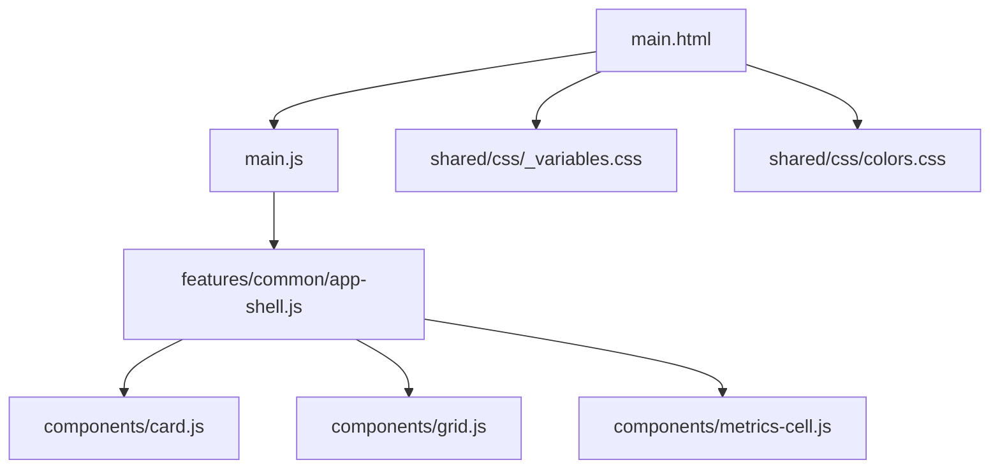
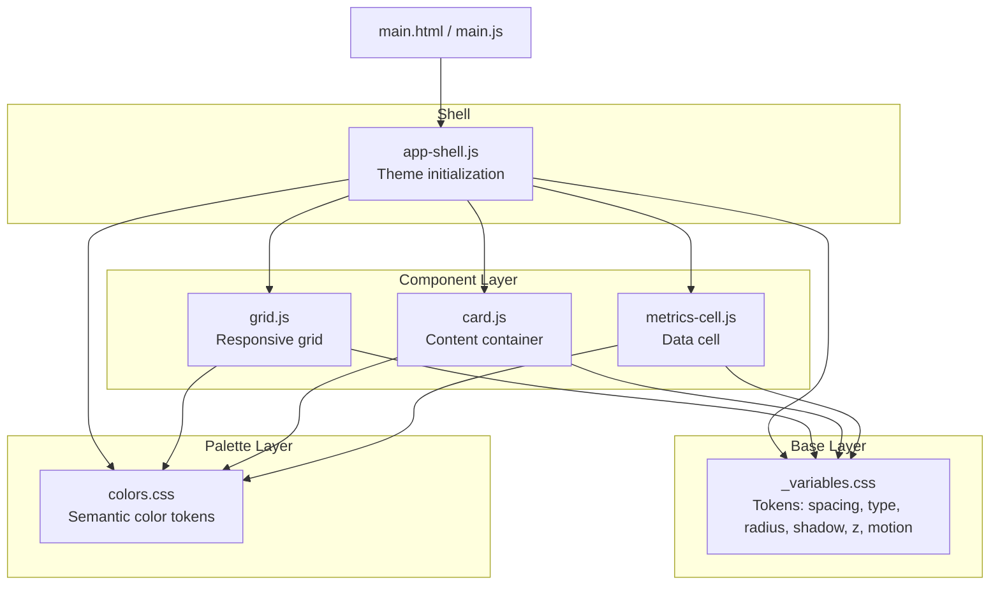
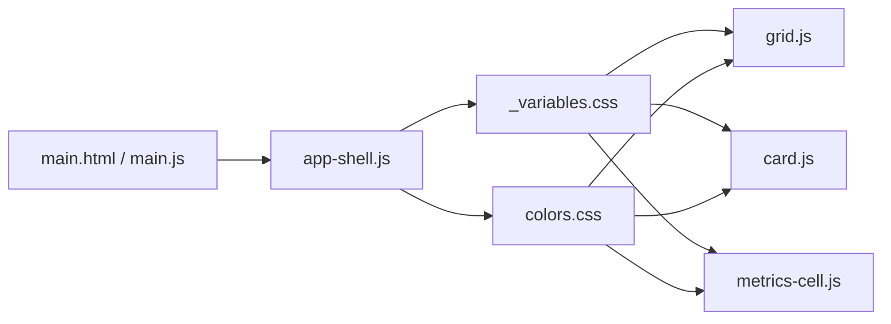

# Styling & Theming

<cite>
**Referenced Files in This Document**
- [main.html](file://main.html)
- [main.js](file://main.js)
- [_variables.css](file://shared/css/_variables.css)
- [colors.css](file://shared/css/colors.css)
- [app-shell.js](file://features/common/app-shell.js)
- [card.js](file://components/card.js)
- [grid.js](file://components/grid.js)
- [metrics-cell.js](file://components/metrics-cell.js)
</cite>

## Table of Contents
1. [Introduction](#introduction)
2. [Project Structure](#project-structure)
3. [Core Components](#core-components)
4. [Architecture Overview](#architecture-overview)
5. [Detailed Component Analysis](#detailed-component-analysis)
6. [Dependency Analysis](#dependency-analysis)
7. [Performance Considerations](#performance-considerations)
8. [Troubleshooting Guide](#troubleshooting-guide)
9. [Conclusion](#conclusion)
10. [Appendices](#appendices)

## Introduction
This document explains the styling system and theming capabilities of the MTF Monitor application. It focuses on CSS variable architecture, color system implementation, responsive design patterns, mobile-first approach, breakpoint strategy, cross-browser compatibility considerations, and best practices for maintaining visual consistency. It also provides guidelines for adding new colors, modifying themes, creating responsive layouts, and optimizing CSS delivery and rendering performance.

## Project Structure
The styling assets are centralized under shared/css and consumed by the main HTML entry point and feature components. The key files include:
- Shared CSS variables and color tokens
- Application shell that wires up styles and layout
- Reusable UI components that consume tokens and implement responsive behavior

**Diagram sources**
- [main.html](file://main.html)
- [main.js](file://main.js)
- [_variables.css](file://shared/css/_variables.css)
- [colors.css](file://shared/css/colors.css)
- [app-shell.js](file://features/common/app-shell.js)
- [card.js](file://components/card.js)
- [grid.js](file://components/grid.js)
- [metrics-cell.js](file://components/metrics-cell.js)

**Section sources**
- [main.html](file://main.html)
- [main.js](file://main.js)
- [_variables.css](file://shared/css/_variables.css)
- [colors.css](file://shared/css/colors.css)
- [app-shell.js](file://features/common/app-shell.js)
- [card.js](file://components/card.js)
- [grid.js](file://components/grid.js)
- [metrics-cell.js](file://components/metrics-cell.js)

## Core Components
- CSS Variables Architecture
  - Global tokens for spacing, typography, radii, shadows, z-index layers, and motion durations are defined in a dedicated variables file. These tokens provide a single source of truth for layout and motion across the app.
  - Color tokens are organized in a separate color file to decouple palette from layout tokens. Colors are exposed as CSS custom properties with semantic names (e.g., surface, text, accent).
- Theme Entry Points
  - The application shell initializes theme-related behaviors and ensures consistent base styles are applied before component rendering.
- Responsive Utilities
  - Grid and card components encapsulate responsive behavior using CSS media queries and container-friendly patterns. They rely on tokens rather than hard-coded values to maintain consistency.

Guidelines
- Always reference tokens via CSS variables instead of hard-coded values.
- Keep color semantics clear and avoid duplicating palettes; prefer token aliases where appropriate.
- Use the grid component for layout composition and reserve cards for content containers.

**Section sources**
- [_variables.css](file://shared/css/_variables.css)
- [colors.css](file://shared/css/colors.css)
- [app-shell.js](file://features/common/app-shell.js)
- [grid.js](file://components/grid.js)
- [card.js](file://components/card.js)

## Architecture Overview
The styling architecture follows a layered approach:
- Base layer: global tokens (spacing, typography, motion)
- Palette layer: semantic color tokens
- Component layer: reusable elements consuming tokens
- Page/feature layer: compositions and page-specific overrides when necessary

**Diagram sources**
- [_variables.css](file://shared/css/_variables.css)
- [colors.css](file://shared/css/colors.css)
- [app-shell.js](file://features/common/app-shell.js)
- [grid.js](file://components/grid.js)
- [card.js](file://components/card.js)
- [metrics-cell.js](file://components/metrics-cell.js)
- [main.html](file://main.html)
- [main.js](file://main.js)

## Detailed Component Analysis

### CSS Variable Architecture
- Token categories
  - Spacing scale: consistent gaps and paddings
  - Typography: font families, sizes, line heights, weights
  - Shape: border radii, corner treatments
  - Elevation: shadows and depth indicators
  - Z-index: stacking context layers
  - Motion: durations and easing curves
- Naming conventions
  - Use kebab-case for variable names
  - Group by domain (e.g., spacing, color, motion)
  - Prefer semantic aliases over raw values at higher layers

Best practices
- Centralize all tokens in the variables file
- Introduce aliases in the color file for brand or theme variants
- Avoid overriding tokens at the component level unless absolutely necessary

**Section sources**
- [_variables.css](file://shared/css/_variables.css)
- [colors.css](file://shared/css/colors.css)

### Color System Implementation
- Semantic tokens
  - Surface, background, text, border, accent, success, warning, error
  - Tokens should be accessible and contrast-compliant
- Theme switching
  - Define multiple sets of color tokens (e.g., light/dark) and toggle via a root-level class or attribute
  - Ensure all components consume tokens rather than direct hex values
- Accessibility
  - Maintain minimum contrast ratios for text and interactive elements
  - Provide focus-visible styles using tokens

Guidelines for adding colors
- Add a new token in the color file with a descriptive name
- Create an alias if needed for a specific theme variant
- Update documentation and ensure usage is token-based everywhere

**Section sources**
- [colors.css](file://shared/css/colors.css)

### Responsive Design Patterns and Breakpoints
- Mobile-first strategy
  - Start with base styles for small screens
  - Apply progressive enhancements with min-width media queries
- Breakpoint strategy
  - Use tokens for spacing and sizing to keep layouts fluid
  - Adopt a minimal set of breakpoints to reduce complexity
- Layout primitives
  - Grid component handles column distribution and wrapping
  - Card component adapts padding and internal spacing based on viewport

Practical tips
- Prefer relative units (rem, em, %) and clamp() for fluid typography and spacing
- Use gap utilities for consistent spacing between items
- Test at common device widths and orientations

**Section sources**
- [grid.js](file://components/grid.js)
- [card.js](file://components/card.js)
- [_variables.css](file://shared/css/_variables.css)

### Cross-Browser Compatibility
- CSS features
  - Validate use of modern features (e.g., container queries, :has) against target browsers
  - Provide fallbacks or polyfills where necessary
- Vendor prefixes
  - Rely on build tooling to add prefixes if required
- Rendering differences
  - Normalize box model and scroll behavior consistently
  - Verify flexbox and grid behavior across engines

**Section sources**
- [_variables.css](file://shared/css/_variables.css)
- [colors.css](file://shared/css/colors.css)

### Component-Level Styling Conventions
- Grid
  - Encapsulates responsive columns and gutters
  - Exposes configuration via attributes or options while relying on tokens internally
- Card
  - Provides consistent padding, borders, and elevation
  - Adapts internal spacing for different screen sizes
- Metrics Cell
  - Displays data with clear hierarchy and emphasis using tokens
  - Ensures readability and accessibility across themes

Naming patterns
- Use BEM-like naming for component classes
- Keep modifier classes scoped to components
- Prefer data attributes for configuration when possible

**Section sources**
- [grid.js](file://components/grid.js)
- [card.js](file://components/card.js)
- [metrics-cell.js](file://components/metrics-cell.js)

### Theme Customization and Brand Adaptation
- Creating a new theme
  - Duplicate the current color token set
  - Rename tokens to reflect the theme (e.g., dark, brand)
  - Toggle theme via a root-level class or attribute
- Brand adaptation
  - Replace primary/accent tokens with brand colors
  - Adjust surface and text tokens to meet contrast requirements
- Validation
  - Run contrast checks and visual regression tests
  - Confirm interactive states (hover, focus, active) remain distinct

Example workflow
- Define new tokens in the color file
- Wire theme toggling in the application shell
- Update any hardcoded references to use tokens

**Section sources**
- [colors.css](file://shared/css/colors.css)
- [app-shell.js](file://features/common/app-shell.js)

## Dependency Analysis
Styling dependencies flow from global tokens to components and pages. The shell initializes theme state and ensures tokens are available before components render.

**Diagram sources**
- [_variables.css](file://shared/css/_variables.css)
- [colors.css](file://shared/css/colors.css)
- [app-shell.js](file://features/common/app-shell.js)
- [grid.js](file://components/grid.js)
- [card.js](file://components/card.js)
- [metrics-cell.js](file://components/metrics-cell.js)
- [main.html](file://main.html)
- [main.js](file://main.js)

**Section sources**
- [_variables.css](file://shared/css/_variables.css)
- [colors.css](file://shared/css/colors.css)
- [app-shell.js](file://features/common/app-shell.js)
- [grid.js](file://components/grid.js)
- [card.js](file://components/card.js)
- [metrics-cell.js](file://components/metrics-cell.js)
- [main.html](file://main.html)
- [main.js](file://main.js)

## Performance Considerations
- CSS delivery
  - Minify and concatenate CSS assets
  - Leverage HTTP/2 multiplexing and caching headers
  - Defer non-critical styles and preload critical ones
- Rendering optimization
  - Avoid expensive selectors and deep nesting
  - Prefer transform and opacity for animations to leverage GPU acceleration
  - Use will-change sparingly and only for known hot paths
- Token-driven updates
  - Switch themes by toggling root-level classes to minimize reflows
  - Batch DOM updates around theme changes
- Measurement
  - Audit with Lighthouse and WebPageTest
  - Track CLS and INP impacts after style changes

[No sources needed since this section provides general guidance]

## Troubleshooting Guide
Common issues and resolutions
- Theme not applying
  - Ensure the root-level theme class or attribute is present before components render
  - Verify that all components consume tokens and do not override with hard-coded values
- Inconsistent spacing or typography
  - Check that tokens are imported and not shadowed by local styles
  - Confirm that media queries align with the intended breakpoints
- Contrast failures
  - Validate color tokens against WCAG guidelines
  - Adjust text/surface tokens to improve contrast
- Performance regressions
  - Inspect paint and layout times in DevTools
  - Reduce heavy effects and simplify selectors

**Section sources**
- [app-shell.js](file://features/common/app-shell.js)
- [_variables.css](file://shared/css/_variables.css)
- [colors.css](file://shared/css/colors.css)

## Conclusion
The MTF Monitor styling system centers on a robust token architecture and semantic color tokens, enabling consistent theming and responsive layouts. By adhering to mobile-first principles, minimizing breakpoints, and following naming conventions, teams can maintain visual coherence and extendability. The provided guidelines and diagrams serve as a foundation for safe customization, brand adaptation, and performance-conscious development.

[No sources needed since this section summarizes without analyzing specific files]

## Appendices

### Quick Reference: Adding a New Color
- Define a new semantic token in the color file
- Alias it for each theme variant if needed
- Replace any hard-coded color usages with the token
- Validate contrast and update documentation

**Section sources**
- [colors.css](file://shared/css/colors.css)

### Quick Reference: Creating a Responsive Layout
- Start with mobile-first base styles
- Use the grid component for structure
- Apply tokens for spacing and typography
- Enhance with media queries for larger screens

**Section sources**
- [grid.js](file://components/grid.js)
- [_variables.css](file://shared/css/_variables.css)