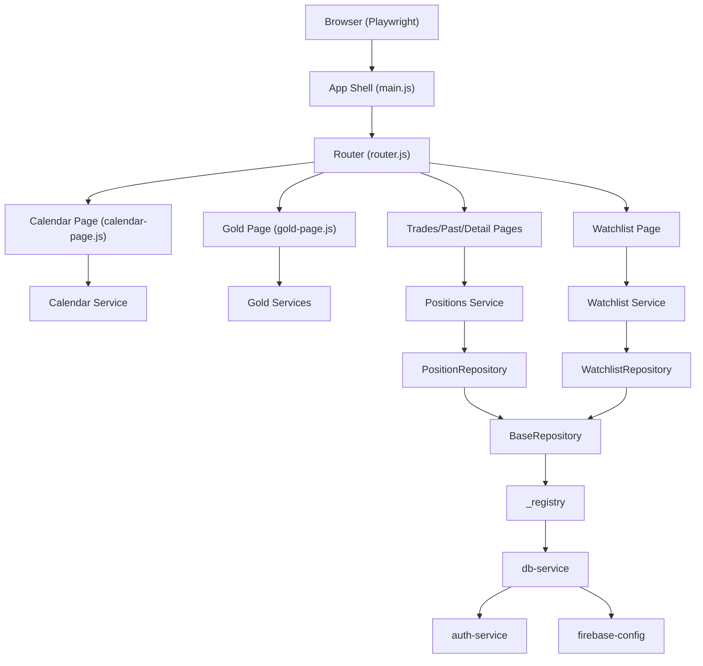
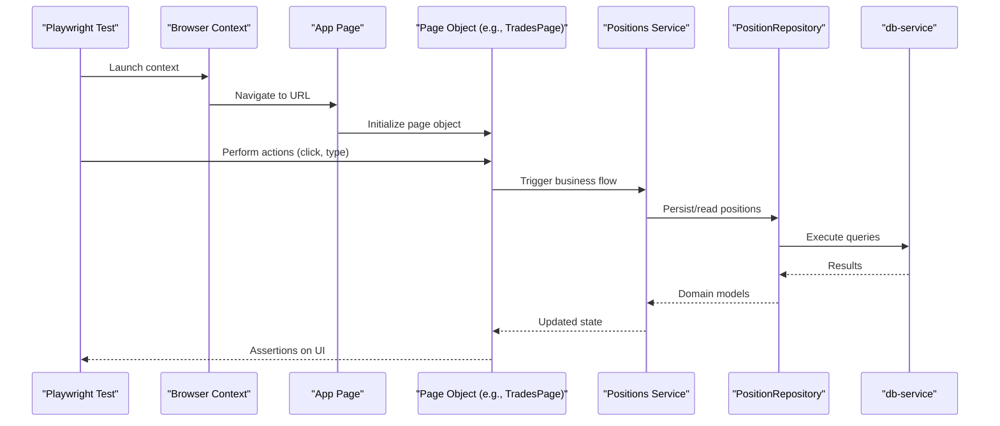
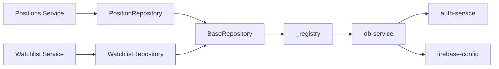

# Testing Strategy

<cite>
**Referenced Files in This Document**
- [playwright.config.js](file://playwright.config.js)
- [package.json](file://package.json)
- [main.js](file://main.js)
- [main.html](file://main.html)
- [pages.json](file://pages.json)
- [app-version.json](file://app-version.json)
- [shared/db/BaseRepository.js](file://shared/db/BaseRepository.js)
- [shared/db/_registry.js](file://shared/db/_registry.js)
- [shared/db/db-service.js](file://shared/db/db-service.js)
- [shared/db/auth-service.js](file://shared/db/auth-service.js)
- [shared/db/firebase-config.js](file://shared/db/firebase-config.js)
- [shared/lib/bootstrap.js](file://shared/lib/bootstrap.js)
- [features/positions/PositionRepository.js](file://features/positions/PositionRepository.js)
- [features/watchlist/WatchlistRepository.js](file://features/watchlist/WatchlistRepository.js)
- [features/calendar/calendar-page.js](file://features/calendar/calendar-page.js)
- [features/calendar/calendar-service.js](file://features/calendar/calendar-service.js)
- [features/gold/gold-page.js](file://features/gold/gold-page.js)
- [features/gold/gold-services.js](file://features/gold/gold-services.js)
- [features/more/more-page.js](file://features/more/more-page.js)
- [features/more/settings-page.js](file://features/more/settings-page.js)
- [features/more/app-version.js](file://features/more/app-version.js)
- [features/more/SettingsRepository.js](file://features/more/SettingsRepository.js)
- [features/positions/trades-page.js](file://features/positions/trades-page.js)
- [features/positions/past-page.js](file://features/positions/past-page.js)
- [features/positions/trade-detail-page.js](file://features/positions/trade-detail-page.js)
- [features/positions/positions-service.js](file://features/positions/positions-service.js)
- [features/watchlist/watchlist-page.js](file://features/watchlist/watchlist-page.js)
- [features/watchlist/watchlist-service.js](file://features/watchlist/watchlist-service.js)
- [features/common/app-shell.js](file://features/common/app-shell.js)
- [features/common/router.js](file://features/common/router.js)
- [features/common/search-page.js](file://features/common/search-page.js)
- [features/common/trade-list.js](file://features/common/trade-list.js)
- [features/common/trade-modal.js](file://features/common/trade-modal.js)
- [features/common/trade-sheets.js](file://features/common/trade-sheets.js)
</cite>

## Table of Contents
1. Introduction
2. Project Structure
3. Core Components
4. Architecture Overview
5. Detailed Component Analysis
6. Dependency Analysis
7. Performance Considerations
8. Troubleshooting Guide
9. Conclusion
10. Appendices

## Introduction
This document defines the comprehensive testing strategy for the MTF Monitor application. It covers end-to-end (E2E) testing with Playwright, unit and integration testing approaches for components, services, and repositories, test organization and naming conventions, and continuous integration setup guidance. It also includes examples tailored to trading-specific scenarios such as position tracking and real-time updates, along with considerations for financial applications and browser automation.

## Project Structure
The repository is organized by feature modules under features/, shared infrastructure under shared/, and top-level configuration files at the root. The E2E configuration is defined at the root, while feature pages and services are grouped by domain (calendar, gold, positions, watchlist, more). Shared database and library utilities live under shared/.

```mermaid
graph TB
subgraph "Root"
Pkg["package.json"]
PW["playwright.config.js"]
MainJS["main.js"]
MainHTML["main.html"]
PagesJSON["pages.json"]
AppVer["app-version.json"]
end
subgraph "Features"
CalPage["features/calendar/calendar-page.js"]
CalSvc["features/calendar/calendar-service.js"]
GoldPage["features/gold/gold-page.js"]
GoldSvc["features/gold/gold-services.js"]
MorePage["features/more/more-page.js"]
SettingsPage["features/more/settings-page.js"]
AppVersion["features/more/app-version.js"]
PosRepo["features/positions/PositionRepository.js"]
TradesPage["features/positions/trades-page.js"]
PastPage["features/positions/past-page.js"]
TradeDetail["features/positions/trade-detail-page.js"]
PosSvc["features/positions/positions-service.js"]
WLPage["features/watchlist/watchlist-page.js"]
WLSvc["features/watchlist/watchlist-service.js"]
WLRepo["features/watchlist/WatchlistRepository.js"]
CommonShell["features/common/app-shell.js"]
Router["features/common/router.js"]
Search["features/common/search-page.js"]
TradeList["features/common/trade-list.js"]
TradeModal["features/common/trade-modal.js"]
TradeSheets["features/common/trade-sheets.js"]
end
subgraph "Shared"
BaseRepo["shared/db/BaseRepository.js"]
DBReg["shared/db/_registry.js"]
DBService["shared/db/db-service.js"]
AuthSvc["shared/db/auth-service.js"]
FirebaseCfg["shared/db/firebase-config.js"]
Bootstrap["shared/lib/bootstrap.js"]
end
Pkg --> PW
MainJS --> CommonShell
MainJS --> Router
MainJS --> Bootstrap
MainHTML --> MainJS
PagesJSON --> MainJS
AppVer --> AppVersion
CalPage --> CalSvc
GoldPage --> GoldSvc
MorePage --> SettingsPage
MorePage --> AppVersion
PosRepo --> BaseRepo
PosRepo --> DBReg
PosRepo --> DBService
PosSvc --> PosRepo
WLRepo --> BaseRepo
WLRepo --> DBReg
WLRepo --> DBService
WLSvc --> WLRepo
CommonShell --> Router
CommonShell --> Search
CommonShell --> TradeList
CommonShell --> TradeModal
CommonShell --> TradeSheets
```

**Diagram sources**
- [playwright.config.js](file://playwright.config.js)
- [package.json](file://package.json)
- [main.js](file://main.js)
- [main.html](file://main.html)
- [pages.json](file://pages.json)
- [app-version.json](file://app-version.json)
- [shared/db/BaseRepository.js](file://shared/db/BaseRepository.js)
- [shared/db/_registry.js](file://shared/db/_registry.js)
- [shared/db/db-service.js](file://shared/db/db-service.js)
- [shared/db/auth-service.js](file://shared/db/auth-service.js)
- [shared/db/firebase-config.js](file://shared/db/firebase-config.js)
- [shared/lib/bootstrap.js](file://shared/lib/bootstrap.js)
- [features/positions/PositionRepository.js](file://features/positions/PositionRepository.js)
- [features/watchlist/WatchlistRepository.js](file://features/watchlist/WatchlistRepository.js)
- [features/calendar/calendar-page.js](file://features/calendar/calendar-page.js)
- [features/calendar/calendar-service.js](file://features/calendar/calendar-service.js)
- [features/gold/gold-page.js](file://features/gold/gold-page.js)
- [features/gold/gold-services.js](file://features/gold/gold-services.js)
- [features/more/more-page.js](file://features/more/more-page.js)
- [features/more/settings-page.js](file://features/more/settings-page.js)
- [features/more/app-version.js](file://features/more/app-version.js)
- [features/positions/trades-page.js](file://features/positions/trades-page.js)
- [features/positions/past-page.js](file://features/positions/past-page.js)
- [features/positions/trade-detail-page.js](file://features/positions/trade-detail-page.js)
- [features/positions/positions-service.js](file://features/positions/positions-service.js)
- [features/watchlist/watchlist-page.js](file://features/watchlist/watchlist-page.js)
- [features/watchlist/watchlist-service.js](file://features/watchlist/watchlist-service.js)
- [features/common/app-shell.js](file://features/common/app-shell.js)
- [features/common/router.js](file://features/common/router.js)
- [features/common/search-page.js](file://features/common/search-page.js)
- [features/common/trade-list.js](file://features/common/trade-list.js)
- [features/common/trade-modal.js](file://features/common/trade-modal.js)
- [features/common/trade-sheets.js](file://features/common/trade-sheets.js)

**Section sources**
- [playwright.config.js](file://playwright.config.js)
- [package.json](file://package.json)
- [main.js](file://main.js)
- [main.html](file://main.html)
- [pages.json](file://pages.json)
- [app-version.json](file://app-version.json)

## Core Components
This section outlines the key building blocks relevant to testing:

- Application entry and bootstrap
  - main.js initializes core modules and wires up UI shells and routing.
  - main.html provides the HTML shell loaded by tests.
  - pages.json enumerates available pages used by navigation flows.
  - app-version.json supplies version metadata consumed by the app.

- Shared data layer
  - BaseRepository defines common repository behavior.
  - _registry manages dependency registration and resolution.
  - db-service encapsulates database operations.
  - auth-service handles authentication-related logic.
  - firebase-config configures Firebase connectivity.
  - bootstrap orchestrates initialization sequences.

- Feature modules
  - Calendar: calendar-page.js and calendar-service.js implement calendar interactions and business logic.
  - Gold: gold-page.js and gold-services.js manage gold-related UI and logic.
  - More: more-page.js, settings-page.js, app-version.js, and SettingsRepository.js handle settings and app info.
  - Positions: PositionRepository.js, trades-page.js, past-page.js, trade-detail-page.js, and positions-service.js implement position tracking and trade details.
  - Watchlist: watchlist-page.js, watchlist-service.js, and WatchlistRepository.js manage watchlist state and persistence.
  - Common: app-shell.js, router.js, search-page.js, trade-list.js, trade-modal.js, and trade-sheets.js provide shared UI and navigation primitives.

Testing implications:
- Use page objects for each feature module to encapsulate selectors and actions.
- Mock or stub shared services (db-service, auth-service, firebase-config) for isolated unit tests.
- Leverage registry patterns for dependency injection during tests.

**Section sources**
- [main.js](file://main.js)
- [main.html](file://main.html)
- [pages.json](file://pages.json)
- [app-version.json](file://app-version.json)
- [shared/db/BaseRepository.js](file://shared/db/BaseRepository.js)
- [shared/db/_registry.js](file://shared/db/_registry.js)
- [shared/db/db-service.js](file://shared/db/db-service.js)
- [shared/db/auth-service.js](file://shared/db/auth-service.js)
- [shared/db/firebase-config.js](file://shared/db/firebase-config.js)
- [shared/lib/bootstrap.js](file://shared/lib/bootstrap.js)
- [features/calendar/calendar-page.js](file://features/calendar/calendar-page.js)
- [features/calendar/calendar-service.js](file://features/calendar/calendar-service.js)
- [features/gold/gold-page.js](file://features/gold/gold-page.js)
- [features/gold/gold-services.js](file://features/gold/gold-services.js)
- [features/more/more-page.js](file://features/more/more-page.js)
- [features/more/settings-page.js](file://features/more/settings-page.js)
- [features/more/app-version.js](file://features/more/app-version.js)
- [features/more/SettingsRepository.js](file://features/more/SettingsRepository.js)
- [features/positions/PositionRepository.js](file://features/positions/PositionRepository.js)
- [features/positions/trades-page.js](file://features/positions/trades-page.js)
- [features/positions/past-page.js](file://features/positions/past-page.js)
- [features/positions/trade-detail-page.js](file://features/positions/trade-detail-page.js)
- [features/positions/positions-service.js](file://features/positions/positions-service.js)
- [features/watchlist/watchlist-page.js](file://features/watchlist/watchlist-page.js)
- [features/watchlist/watchlist-service.js](file://features/watchlist/watchlist-service.js)
- [features/watchlist/WatchlistRepository.js](file://features/watchlist/WatchlistRepository.js)
- [features/common/app-shell.js](file://features/common/app-shell.js)
- [features/common/router.js](file://features/common/router.js)
- [features/common/search-page.js](file://features/common/search-page.js)
- [features/common/trade-list.js](file://features/common/trade-list.js)
- [features/common/trade-modal.js](file://features/common/trade-modal.js)
- [features/common/trade-sheets.js](file://features/common/trade-sheets.js)

## Architecture Overview
The application follows a feature-based architecture with shared infrastructure. Tests should mirror this structure:

- E2E tests target user journeys across pages and services.
- Unit tests isolate components, services, and repositories.
- Integration tests validate data layer interactions and external dependencies.

**Diagram sources**
- [main.js](file://main.js)
- [features/common/router.js](file://features/common/router.js)
- [features/calendar/calendar-page.js](file://features/calendar/calendar-page.js)
- [features/gold/gold-page.js](file://features/gold/gold-page.js)
- [features/positions/trades-page.js](file://features/positions/trades-page.js)
- [features/positions/past-page.js](file://features/positions/past-page.js)
- [features/positions/trade-detail-page.js](file://features/positions/trade-detail-page.js)
- [features/watchlist/watchlist-page.js](file://features/watchlist/watchlist-page.js)
- [features/calendar/calendar-service.js](file://features/calendar/calendar-service.js)
- [features/gold/gold-services.js](file://features/gold/gold-services.js)
- [features/positions/positions-service.js](file://features/positions/positions-service.js)
- [features/watchlist/watchlist-service.js](file://features/watchlist/watchlist-service.js)
- [features/positions/PositionRepository.js](file://features/positions/PositionRepository.js)
- [features/watchlist/WatchlistRepository.js](file://features/watchlist/WatchlistRepository.js)
- [shared/db/BaseRepository.js](file://shared/db/BaseRepository.js)
- [shared/db/_registry.js](file://shared/db/_registry.js)
- [shared/db/db-service.js](file://shared/db/db-service.js)
- [shared/db/auth-service.js](file://shared/db/auth-service.js)
- [shared/db/firebase-config.js](file://shared/db/firebase-config.js)

## Detailed Component Analysis

### End-to-End Testing with Playwright
- Configuration
  - playwright.config.js defines global settings, workers, retries, and environment variables.
  - package.json contains scripts to run Playwright tests and reports.
- Test Organization
  - Group tests by feature directories mirroring features/.
  - Use spec files named after user journeys (e.g., positions.spec.js, watchlist.spec.js).
- Page Object Model (POM)
  - Create POMs for each feature page (e.g., CalendarPage, GoldPage, TradesPage, PastPage, TradeDetailPage, WatchlistPage).
  - Encapsulate selectors, waits, and actions within POMs to reduce flakiness.
- Test Data Management
  - Seed fixtures via db-service mocks or local-db utilities where applicable.
  - Use JSON fixtures for static data; generate dynamic data for positions and watchlists.
- Assertions
  - Assert on visible text, counts, and DOM attributes rather than exact values when appropriate.
  - For real-time updates, assert on eventual consistency using retries and timeouts.

**Diagram sources**
- [playwright.config.js](file://playwright.config.js)
- [package.json](file://package.json)
- [features/positions/trades-page.js](file://features/positions/trades-page.js)
- [features/positions/positions-service.js](file://features/positions/positions-service.js)
- [features/positions/PositionRepository.js](file://features/positions/PositionRepository.js)
- [shared/db/db-service.js](file://shared/db/db-service.js)

**Section sources**
- [playwright.config.js](file://playwright.config.js)
- [package.json](file://package.json)
- [features/positions/trades-page.js](file://features/positions/trades-page.js)
- [features/positions/positions-service.js](file://features/positions/positions-service.js)
- [features/positions/PositionRepository.js](file://features/positions/PositionRepository.js)
- [shared/db/db-service.js](file://shared/db/db-service.js)

### Unit Testing Approaches
- Components
  - Isolate UI components by mocking DOM interactions and service calls.
  - Validate rendering and event handling without full browser execution.
- Services
  - Stub repositories and external APIs to verify business logic paths.
  - Cover error branches and edge cases (network failures, invalid inputs).
- Repositories
  - Mock BaseRepository and _registry to control data layer responses.
  - Verify query construction, transformations, and error propagation.

Best practices:
- Keep tests deterministic by seeding controlled data.
- Use spies/stubs for async operations and timers.
- Maintain high coverage for critical financial calculations and validations.

[No sources needed since this section provides general guidance]

### Integration Testing Strategies
- Database Operations
  - Use a test database instance or in-memory store via db-service.
  - Validate CRUD operations through repositories and ensure consistency.
- External API Calls
  - Intercept network requests and return canned responses for stability.
  - Simulate latency and errors to verify resilience.

Recommendations:
- Separate integration suites from unit tests.
- Reset state between tests to avoid cross-test pollution.

[No sources needed since this section provides general guidance]

### Trading-Specific Scenarios
- Position Tracking
  - Create positions, update quantities/prices, and verify totals and statuses.
  - Ensure real-time updates propagate correctly to UI elements.
- Real-Time Updates
  - Simulate streaming events and assert incremental UI changes.
  - Handle race conditions with explicit waits and assertions.

Example flows:
- Open a new position, navigate to trades list, confirm presence and metrics.
- Update a position’s price and verify profit/loss recalculation.
- Filter and sort trades, then assert ordering and visibility.

[No sources needed since this section provides general guidance]

### Browser Automation Considerations
- Stability
  - Prefer explicit waits over sleeps; use auto-waiting capabilities.
  - Retry transient failures and stabilize flaky tests.
- Environment
  - Configure headless mode for CI; enable headed mode for debugging.
  - Manage viewport sizes and device emulation for responsive checks.
- Security
  - Avoid embedding secrets in code; use environment variables and secure storage.

[No sources needed since this section provides general guidance]

## Dependency Analysis
The following diagram highlights key dependencies among shared layers and feature modules that influence test design.

**Diagram sources**
- [shared/db/BaseRepository.js](file://shared/db/BaseRepository.js)
- [shared/db/_registry.js](file://shared/db/_registry.js)
- [shared/db/db-service.js](file://shared/db/db-service.js)
- [shared/db/auth-service.js](file://shared/db/auth-service.js)
- [shared/db/firebase-config.js](file://shared/db/firebase-config.js)
- [features/positions/PositionRepository.js](file://features/positions/PositionRepository.js)
- [features/watchlist/WatchlistRepository.js](file://features/watchlist/WatchlistRepository.js)
- [features/positions/positions-service.js](file://features/positions/positions-service.js)
- [features/watchlist/watchlist-service.js](file://features/watchlist/watchlist-service.js)

**Section sources**
- [shared/db/BaseRepository.js](file://shared/db/BaseRepository.js)
- [shared/db/_registry.js](file://shared/db/_registry.js)
- [shared/db/db-service.js](file://shared/db/db-service.js)
- [shared/db/auth-service.js](file://shared/db/auth-service.js)
- [shared/db/firebase-config.js](file://shared/db/firebase-config.js)
- [features/positions/PositionRepository.js](file://features/positions/PositionRepository.js)
- [features/watchlist/WatchlistRepository.js](file://features/watchlist/WatchlistRepository.js)
- [features/positions/positions-service.js](file://features/positions/positions-service.js)
- [features/watchlist/watchlist-service.js](file://features/watchlist/watchlist-service.js)

## Performance Considerations
- Parallelization
  - Tune workers in playwright.config.js to balance speed and resource usage.
- Flakiness Reduction
  - Use stable selectors and avoid brittle CSS/XPath.
  - Implement retry strategies for transient network issues.
- Resource Management
  - Reuse contexts and pages where possible to reduce overhead.
  - Clear caches and cookies between tests to maintain isolation.

[No sources needed since this section provides general guidance]

## Troubleshooting Guide
Common issues and resolutions:
- Network Timeouts
  - Increase timeouts selectively per action; mock slow endpoints.
- Selector Instability
  - Prefer semantic attributes and role-based queries.
- State Leakage
  - Reset database and session state before each test.
- Authentication Flows
  - Pre-authenticate via admin endpoints or seed tokens securely.

[No sources needed since this section provides general guidance]

## Conclusion
A robust testing strategy for MTF Monitor combines Playwright-driven E2E tests, focused unit tests for components/services/repositories, and integration tests for data and external dependencies. Organize tests by feature, adopt page object patterns, manage test data carefully, and address financial-specific challenges like real-time updates and precision. With disciplined configuration and CI integration, the suite will remain reliable and scalable.

[No sources needed since this section summarizes without analyzing specific files]

## Appendices

### Test Organization and Naming Conventions
- Directory layout mirrors features/ (e.g., tests/features/positions, tests/features/watchlist).
- Spec names describe user goals (e.g., should display open positions, should filter trades by status).
- Keep POMs co-located with feature specs or in a dedicated page-objects directory.

[No sources needed since this section provides general guidance]

### Continuous Integration Setup
- Define jobs to install dependencies, build assets, and run Playwright tests.
- Cache node_modules and Playwright browsers to speed up runs.
- Publish test artifacts and screenshots/videos on failure.
- Gate merges on passing test suites.

[No sources needed since this section provides general guidance]